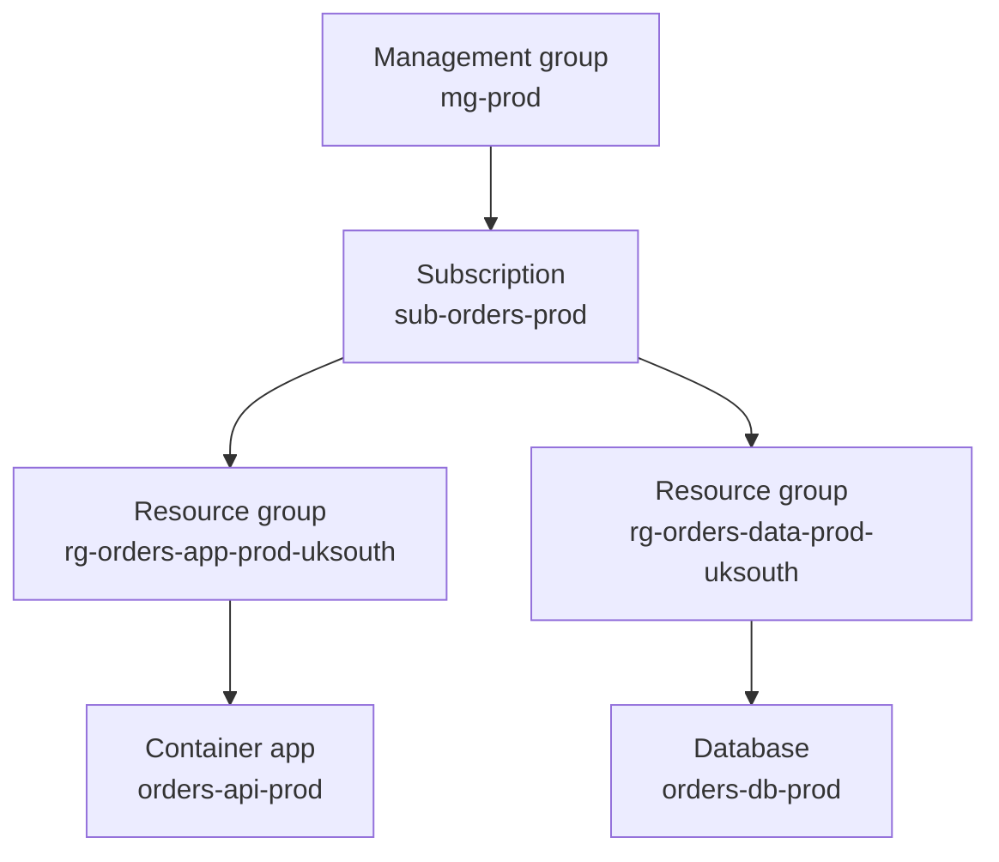

## Table of Contents

1. [The Placement Story](#the-placement-story)
2. [Tenants](#tenants)
3. [Subscriptions](#subscriptions)
4. [Resource Groups](#resource-groups)
5. [Scope Inheritance](#scope-inheritance)
6. [Regions](#regions)
7. [Availability Zones](#availability-zones)
8. [Placement Review](#placement-review)
9. [Putting It All Together](#putting-it-all-together)
10. [What's Next](#whats-next)

## The Placement Story
<!-- section-summary: The first Azure placement story connects identity, billing, lifecycle, governance, geography, and failure boundaries before the Orders API gets deployed. -->

For this first Azure foundations article, the story is one app: `orders-api-prod`. The Orders API receives checkout requests, reads secrets from Key Vault, writes order events to Storage, and talks to a database that keeps customer purchase history. Before the team creates a single resource, they need to decide where the workload belongs.

Azure placement has several layers, and each layer answers a different production question. A **tenant** answers which identity directory the company trusts. A **subscription** answers which billing, quota, access, and governance boundary owns the resources. A **resource group** answers which resources share a lifecycle. A **scope** answers where permissions and policies apply. A **region** answers which geographic Azure location hosts the service. An **availability zone** answers how the workload survives a failure inside one supported region.

The Orders API gives us a concrete target for each layer. The table below names the placement choice and the part of Azure behavior that choice controls.

| Layer | Orders choice | What the choice controls |
|---|---|---|
| **Tenant** | `devpolaris.com` Microsoft Entra tenant | Users, groups, app identities, managed identities, sign-in policy, and identity logs |
| **Subscription** | `sub-orders-prod` | Billing, quotas, Azure RBAC assignments, Azure Policy, resource provider registration, and production isolation |
| **Resource groups** | `rg-orders-app-prod-uksouth` and `rg-orders-data-prod-uksouth` | Lifecycle boundaries for app resources and long-lived data resources |
| **Scope** | Management group, subscription, resource group, or resource | Where Azure RBAC roles, Azure Policy, and other management controls take effect |
| **Region** | `uksouth` | Geographic placement, latency, data residency, service availability, and regional quota |
| **Availability zones** | Zone-redundant app and data choices where supported | Protection from a zone-level facility, power, cooling, or network failure |

This placement story matters because many Azure mistakes start with a resource created in the wrong home. A developer runs a CLI command while the active subscription points at production. A staging database lands in the same resource group as production data. A team chooses a region before checking service availability. A zone-redundant design copies zone numbers across subscriptions before anyone checks the physical mapping.

This ladder is useful because it gives the team an order for the conversation. We start with the tenant because every Azure resource operation needs a trusted identity. Then we move into subscriptions, resource groups, scopes, regions, zones, and a final placement review that the team can repeat before Bicep, Terraform, the Azure CLI, or the portal creates anything.

## Tenants
<!-- section-summary: A Microsoft Entra tenant is the organization's identity directory, and Azure subscriptions trust one tenant to authenticate users, groups, applications, and workload identities. -->

A **Microsoft Entra tenant** is an isolated cloud identity directory for an organization. You will still hear the older name, Azure Active Directory or Azure AD, because years of screenshots, scripts, and blog posts use it. In current Microsoft naming, Microsoft Entra ID is the identity service, and a tenant is one organization's directory inside that service.

The tenant stores the identity objects the Orders team uses every day. Maya's user account lives there. The `grp-orders-platform` and `grp-orders-support` groups live there. The deployment pipeline can have a service principal there. The managed identity attached to `orders-api-prod` also appears there as a service principal that Azure manages for the workload.

The tenant gives Azure the answer to the question "who is calling?" When Maya opens the Azure portal, Microsoft Entra ID authenticates her. When the deployment pipeline calls Azure Resource Manager, Microsoft Entra ID issues the token for that software caller. When the running API asks Key Vault for a secret through managed identity, Microsoft Entra ID issues the token for that workload identity.

An **Azure subscription** trusts one Microsoft Entra tenant for identity. Microsoft documents this as a trust relationship: each subscription trusts a single tenant, and one tenant can be trusted by many subscriptions. For DevPolaris, that means `sub-orders-dev`, `sub-orders-staging`, `sub-orders-prod`, and `sub-platform-shared` can all trust the same `devpolaris.com` tenant.

That trust relationship gives the company one identity home across several Azure environments. The same employee account can receive Reader access in production and Contributor access in development. The same platform group can own shared networking subscriptions. The same identity logs can help the security team trace who signed in, which app requested a token, and which workload identity called Azure.

Tenant choices become serious during mergers, spinouts, vendor access, and directory migrations. If a subscription changes the tenant it trusts, the resources stay in their Azure regions, while role assignments, service principals, managed identities, Key Vault access, and automation need careful review. The trusted identity directory changed, so the access records that point at old directory objects may need replacement.

So the tenant names the people and software. The next layer gives those known callers a production resource boundary to work inside, and that boundary is the subscription.

## Subscriptions
<!-- section-summary: An Azure subscription is the main production boundary for billing, quota, resource ownership, Azure RBAC, Azure Policy, and environment isolation. -->

An **Azure subscription** is the container where Azure resources, billing records, quotas, access assignments, policies, and provider registrations meet. It is the first place most engineers feel Azure as an operating system for cloud work. If the tenant answers who the caller is, the subscription answers which Azure resource estate that caller is trying to manage.

For the Orders team, one shared subscription would create messy operations. Development load tests could consume quota needed by production. A broad Contributor assignment for a test environment could accidentally reach production resources. Monthly cost reports would mix experiments, staging, and real customer traffic into the same bill. Production policy rules would slow down harmless development experiments, while loose development rules would put production at risk.

The team uses separate subscriptions because subscriptions make several boundaries visible. Each boundary gives production its own operating space instead of mixing release traffic, experiments, access, and bills together.

- **Access boundary**: Azure RBAC roles can apply at the subscription. A platform group can manage development while production access stays with a smaller on-call group.
- **Cost boundary**: Azure usage rolls up by subscription, so finance can see production Orders spend instead of filtering every test resource by name.
- **Quota boundary**: Many service quotas apply per subscription and per region. Virtual machine vCPU quota, for example, has regional and VM-family quota checks inside the active subscription.
- **Policy boundary**: Azure Policy can deny or audit deployments at the subscription. Production can require approved regions, required tags, private network settings, or specific SKUs.
- **Provider boundary**: Resource providers such as `Microsoft.KeyVault`, `Microsoft.ContainerService`, and `Microsoft.Storage` register in the subscription before those resource types can be deployed.

This is why production usually gets its own subscription. `sub-orders-prod` carries the production bill, production quota, production provider registrations, production policies, and production role assignments. `sub-orders-dev` can stay looser, cheaper, and easier to reset.

The Azure CLI also has an active subscription context. That context matters because `az group create`, `az deployment sub create`, and many other commands target the selected subscription unless you pass a subscription explicitly. A safe deployment starts by checking the active account:

```bash
az account show \
  --query "{name:name, subscriptionId:id, tenantId:tenantId}" \
  --output table
```

The output should name the subscription and tenant the team expected. In this example, the CLI is pointing at the production Orders subscription and the DevPolaris tenant:

```json
{
  "name": "sub-orders-prod",
  "subscriptionId": "88888888-4444-4444-4444-121212121212",
  "tenantId": "11111111-2222-3333-4444-555555555555"
}
```

If the CLI points at the wrong subscription, the team changes the active context before creating resources. That small pause matters because the next deployment command will follow the selected subscription:

```bash
az account set --subscription "sub-orders-prod"
```

That simple check prevents a very real class of Azure mistakes. The command after `az account set` might create a resource group, deploy an app, assign a role, or delete a test stack. The active subscription decides which estate receives that change.

A subscription is still too large for daily application lifecycle work. The Orders team needs a smaller container for the resources that deploy, update, and clean up together, and that is where resource groups enter the story.

## Resource Groups
<!-- section-summary: A resource group is a flat lifecycle container inside a subscription, and teams use it to group resources that deploy, update, protect, and delete together. -->

A **resource group** is a logical container for related Azure resources inside a subscription. Microsoft describes it as a container that holds related resources for an Azure solution, and the usual practice is to place resources with the same lifecycle into the same group. In beginner terms, a resource group is the box you use when a set of resources should move together during deployment and cleanup.

Resource groups stay flat. A resource group contains resources, and each resource belongs to one resource group at a time. A group can contain a web app, a managed identity, a Key Vault, a storage account, a private endpoint, and diagnostic settings. The hierarchy stops at resources, which keeps lifecycle ownership simple once the team chooses good boundaries.

For the Orders API, the app layer and the data layer have different lifecycles. The container app, app settings, managed identity assignment, and monitoring settings may change with every release. The database and storage account hold long-lived customer records and need stronger protection. The team can split them like this:

| Resource group | Example resources | Lifecycle idea |
|---|---|---|
| `rg-orders-app-prod-uksouth` | Container app, app environment, managed identity attachment, app diagnostics | Changes often with releases |
| `rg-orders-data-prod-uksouth` | Database, storage account, Key Vault, private endpoints, backup settings | Changes carefully and survives app redeployments |

This split saves teams during ordinary operations. If a pipeline cleans up a preview or redeploys the app stack, it targets the app resource group. The database group stays separate, with stricter access, locks, backup checks, and slower change review. The resource group boundary turns "delete the app resources" into a much safer target than "delete everything with Orders in the name."

When you create a resource group, Azure asks for a location. The Orders team chooses the same region it expects for the app resources, then adds a few ownership tags that later cost and inventory tools can read:

```bash
az group create \
  --name "rg-orders-app-prod-uksouth" \
  --location "uksouth" \
  --tags service=orders-api env=prod team=commerce-platform
```

The resource group location is the region where Azure stores metadata about the group. The resources inside the group can live in other regions, and Microsoft recommends using the same location for the group and its resources unless the team has a reason to separate them. For the Orders team, `rg-orders-app-prod-uksouth` in `uksouth` keeps the group metadata close to the app resources it describes.

The tags in that command give the first hint of the next foundation article. Tags add queryable metadata such as `service`, `env`, and `team`. They help cost reports, inventories, and incident responders find ownership. This article cares about placement; the next article goes deeper into resource IDs, names, tags, and locks.

Now the Orders resources have a tenant, a subscription, and resource groups. The next question is where access and governance flow from, because Azure role assignments and policies use scopes that form a parent-child hierarchy.

## Scope Inheritance
<!-- section-summary: Azure scope is the hierarchy where role assignments and policies apply, with management groups, subscriptions, resource groups, and resources forming parent-child boundaries. -->

A **scope** is the Azure boundary where a management rule applies. Azure RBAC uses scope to decide how widely a role assignment reaches. Azure Policy also uses scopes so governance rules can apply to a management group, subscription, resource group, or specific resource.

The practical hierarchy looks like this for the Orders production estate. The management group gives the company a production-wide parent, and the subscription, resource groups, and resources become more specific as the tree moves downward.



**Management groups** sit above subscriptions. Large organizations use them to organize many subscriptions and apply shared governance. DevPolaris might place `sub-orders-prod`, `sub-payments-prod`, and `sub-platform-prod` under `mg-prod`, then apply production-wide policies there.

The subscription sits below that management group. A role assignment at `sub-orders-prod` can reach every resource group and resource in that subscription. A policy assignment at `sub-orders-prod` can evaluate new deployments across the whole subscription.

Resource groups sit below the subscription. A role assignment at `rg-orders-app-prod-uksouth` reaches the app resources in that group. The deployment pipeline can receive Contributor on the app group while the database group remains outside that assignment.

Individual resources sit at the narrowest scope. A support tool might receive Key Vault Secrets User on one vault, or a monitoring identity might receive read access on one Application Insights component. Narrow resource scopes fit callers that need one target with tightly bounded access.

Inheritance is the part that surprises new Azure users. If Maya receives Reader at the subscription, she can read child resource groups and many child resources. If the production policy denies public IP creation at `mg-prod`, child production subscriptions inherit that guardrail. If the Orders pipeline receives Contributor at the app resource group, it can change app resources in that group while the data group follows a different access path.

Azure access reviews need both the scope and the role name. "Contributor" at one resource group may be a normal deployment permission. "Contributor" at a production subscription may grant far more reach than the job requires. The role and the scope together explain the actual power.

The team can inspect role assignment evidence from the CLI by naming the scope directly. This gives reviewers a concrete list of principals, roles, and assignment locations for the app group:

```bash
az role assignment list \
  --scope "/subscriptions/88888888-4444-4444-4444-121212121212/resourceGroups/rg-orders-app-prod-uksouth" \
  --output table
```

At this point, the Orders team knows who can touch the work, where the resources live logically, and where governance flows from. The next placement decision moves from management structure into physical geography.

## Regions
<!-- section-summary: An Azure region is the geographic placement choice for service latency, data residency, service availability, SKU availability, quota, and recovery planning. -->

An **Azure region** is a geographic Azure location where Microsoft operates datacenter capacity and service endpoints. `uksouth`, `westeurope`, `eastus`, and `australiaeast` are programmatic region names you use in CLI commands, Bicep, Terraform, ARM templates, and resource IDs. The display name may say "UK South", while the deployment value is `uksouth`.

The region decision affects real users. If most Orders customers live in the United Kingdom, `uksouth` gives the application a nearby Azure home. Browser requests travel a shorter network path, support engineers inspect resources in the expected geography, and data governance discussions start from a region that matches the business footprint.

The region also affects which Azure services, SKUs, and features the team can deploy. Azure expands constantly, and regions differ in available services, VM sizes, zone support, and capacity. A VM size, database tier, or zone-redundant feature that works in one region may fail validation in another region or in another subscription.

The Orders team usually checks five region questions before committing to `uksouth`:

| Question | Orders example |
|---|---|
| **Where are the users?** | Checkout users and support staff mainly sit in the United Kingdom. |
| **Where can the data live?** | Customer order records should stay in an approved geography. |
| **Does the service exist there?** | The required compute, database, storage, Key Vault, and monitoring features must support `uksouth`. |
| **Does this subscription have quota there?** | Production needs enough regional vCPU, database, and service quota before release week. |
| **What recovery shape does the app need?** | The team decides between one region with zones, backup to a paired or secondary region, or active multi-region design. |

The CLI can show supported locations for the active subscription. The Orders team uses that output to confirm the deployment name, display name, region category, and paired region metadata for `uksouth`:

```bash
az account list-locations \
  --query "[?name=='uksouth'].{name:name, displayName:displayName, category:metadata.regionCategory, pairedRegion:metadata.pairedRegion[0].name}" \
  --output json
```

A typical result gives the deployment name and useful region metadata. The exact list changes as Azure regions evolve, so the team treats CLI output as current evidence:

```json
[
  {
    "name": "uksouth",
    "displayName": "UK South",
    "category": "Recommended",
    "pairedRegion": "ukwest"
  }
]
```

That result still leaves service-specific work. For virtual machines, the team can check SKU availability before a template depends on a size that might fail during deployment:

```bash
az vm list-skus \
  --location "uksouth" \
  --size "Standard_D" \
  --all \
  --output table
```

If a deployment asks for a SKU outside the available set for that region, zone, or subscription, Azure can return an error such as `SkuNotAvailable`. That error usually means the requested size or service option is unavailable for that location, zone, or subscription. The fix may involve choosing another SKU, choosing another region or zone, or requesting quota where Azure supports a quota increase.

Region pairs deserve a careful explanation. Microsoft pairs some Azure regions within the same geography, such as `uksouth` and `ukwest`, and newer regions may be nonpaired. Region pairs help some platform recovery and geo-replication scenarios, and some services use them for redundancy options. Application recovery still comes from the architecture the team configures: backups, database replicas, storage redundancy, DNS failover, deployment pipelines, runbooks, and tested restore steps.

For many production systems, the first strong design is one good region with availability zones. That gives the Orders API low-latency regional placement and protection from a zone-level failure inside the region, which leads directly to the next layer.

## Availability Zones
<!-- section-summary: Availability zones are physically separate locations inside supported Azure regions, and teams use zonal or zone-redundant services to reduce facility-level failure risk. -->

An **availability zone** is a physically separate location inside a supported Azure region. Microsoft describes zones as separate groups of datacenters with independent power, cooling, and networking. In an availability-zone-enabled region, the zones sit close enough for low-latency regional architecture and separate enough to reduce the chance that one local incident affects every copy of the workload.

The Orders team can use zones in two common ways. A **zonal** resource pins something to a specific zone, such as a VM in zone `1`. A **zone-redundant** service spreads the service across zones for the team, such as a zone-redundant database or storage option where the service handles replication across multiple zones.

For a production API, the app layer might run multiple instances across zones, while the database uses a zone-redundant high-availability option if the chosen database service supports it in `uksouth`. If one zone has a power, cooling, or network issue, the team wants healthy app instances and data paths in remaining zones. That design protects against a facility-level problem while keeping the app in the same region.

Zones are a service feature as much as a region feature. A region can support availability zones, and a specific Azure service still needs to support the zonal or zone-redundant mode the team wants. The Orders team checks the service documentation before assuming a resource can use zones.

There is one Azure detail that matters for cross-subscription designs: zone numbers are logical inside a subscription. Logical zone `1` in `sub-orders-prod` can map to a different physical facility than logical zone `1` in another subscription. For one app inside one subscription, using zones `1`, `2`, and `3` works as expected. For cross-subscription placement, capacity reservation sharing, or recovery testing, teams should inspect physical zone mapping evidence rather than copying the same zone number across subscriptions.

Availability zones also set the boundary between single-region resilience and multi-region recovery. Zones help with a local zone-level event inside a region. A broad regional incident needs a regional recovery plan: backups to another region, geo-replicated data, failover routing, tested infrastructure deployment, and a clear decision about how much complexity the business actually needs.

The Orders team now has all the coordinates. The final placement review ties tenant, subscription, resource group, scope, region, and zones into one short conversation before the deployment runs.

## Placement Review
<!-- section-summary: A placement review turns tenant, subscription, resource group, scope, region, zone, quota, and recovery choices into a repeatable pre-deployment checklist. -->

A **placement review** is a short pre-deployment check that asks where the workload belongs and which evidence proves that choice. It is useful before a new workload launches, before a subscription split, before a region move, and before a production access change. The review keeps the team from discovering placement mistakes through bills, outages, access failures, or compliance reports later.

For the Orders API, the placement review sounds like a normal engineering conversation. The table keeps each decision tied to the evidence the team should keep for later audits and incidents.

| Decision | Orders answer | Evidence to keep |
|---|---|---|
| **Tenant** | `devpolaris.com` | `az account show` output and identity design notes |
| **Subscription** | `sub-orders-prod` | Active CLI context, subscription ID, budget owner, quota check |
| **Resource groups** | App group and data group split | Deployment plan, tags, backup ownership, lock plan |
| **Scope** | Pipeline Contributor only on the app group | Role assignment output and policy assignments |
| **Region** | `uksouth` | Location query, service support, SKU availability, data requirement |
| **Zones** | Zone-redundant where the service supports it | Service documentation, deployment settings, failure test notes |
| **Recovery** | Single region with zones plus backups to an approved recovery target | Restore test notes and owner sign-off |

Different workloads deserve different placement shapes. A learning lab can use one subscription, one resource group, one low-cost region, and a simple single-zone or best-effort setup. A normal production API usually deserves a dedicated production subscription, separate app and data groups, approved policy, a nearby region, zone-aware service choices, and tested backups. A global revenue-critical system may need multiple regions, active traffic management, replicated data, and a much larger operations runbook.

The team chooses the shape before resources drift. Azure gives a lot of freedom once the boundaries are clear: the same tenant can support many subscriptions, the same subscription can hold many resource groups, the same region can host many services, and the same availability-zone-enabled region can support zonal and zone-redundant designs for different parts of the workload.

The placement review turns that freedom into a map the team can explain. If an incident starts at 2 a.m., the on-call engineer can see the tenant, subscription, resource group, scope, region, and zone plan, then work from a known design instead of hunting through portal pages.

## Putting It All Together
<!-- section-summary: Azure placement becomes practical when the team connects identity, resource ownership, governance, geography, and resilience as one deployment path. -->

The Orders API now has a clear Azure home. The `devpolaris.com` Microsoft Entra tenant stores the people and software identities. The `sub-orders-prod` subscription owns the production resources, cost, quota, policies, and provider registrations. The app and data resource groups split release-heavy resources from long-lived state.

Azure scopes explain how power flows through the hierarchy. Management groups can hold production-wide guardrails, the subscription can hold broad production controls, resource groups can hold deployment access, and individual resources can receive narrow assignments for special cases.

The region gives the workload its geographic home. `uksouth` keeps the Orders API near its primary users and inside the approved data geography. The team still checks service support, SKU availability, quota, and recovery requirements because a region name alone never proves a complete production design.

Availability zones add in-region resilience where the chosen services support them. The app can spread running capacity across zones, and the data layer can use zone-redundant options when available. If the business needs recovery from a full regional incident, the design grows into backups, replication, routing, and tested failover beyond the single-region zone plan.

That is the first Azure foundation. Tenant, subscription, resource group, scope, region, and zone are the coordinates that keep a workload understandable. Every later Azure topic builds on those coordinates, because resources, networking, compute, identity, observability, and cost all need a known home.

## What's Next

After the Orders team knows where the workload belongs, the next job is naming and finding the exact things created there. The next article covers Azure resources, resource IDs, names, tags, and locks so alerts, bills, deployment plans, and access reviews point at the right object before anyone changes it.

---

**References**

- [Associate or add an Azure subscription to your Microsoft Entra tenant](https://learn.microsoft.com/en-us/entra/fundamentals/how-subscriptions-associated-directory) - Documents the trust relationship between Azure subscriptions and Microsoft Entra tenants.
- [Understand the billing and tenant relationship](https://learn.microsoft.com/en-us/azure/cost-management-billing/understand/understand-billing-tenant-relationship) - Explains how a subscription trusts a Microsoft Entra tenant and how tenants can relate to multiple subscriptions.
- [Subscription considerations and recommendations](https://learn.microsoft.com/en-us/azure/cloud-adoption-framework/ready/landing-zone/design-area/resource-org-subscriptions) - Describes subscriptions as boundaries for scale, quota, cost, governance, security, and identity controls.
- [What are Azure management groups?](https://learn.microsoft.com/en-us/azure/governance/management-groups/overview) - Explains how management groups organize subscriptions for unified policy and access management.
- [Understand scope for Azure RBAC](https://learn.microsoft.com/en-us/azure/role-based-access-control/scope-overview) - Defines management group, subscription, resource group, and resource scopes and their parent-child inheritance.
- [What is Azure Resource Manager?](https://learn.microsoft.com/en-us/azure/azure-resource-manager/management/overview) - Covers resource groups, resource provider routing, resource group deletion behavior, and resource group location recommendations.
- [Manage Azure resource groups by using Azure CLI](https://learn.microsoft.com/en-us/azure/azure-resource-manager/management/manage-resource-groups-cli) - Documents resource group CLI workflows and explains that the resource group location stores metadata.
- [Azure subscription and service limits, quotas, and constraints](https://learn.microsoft.com/en-us/azure/azure-resource-manager/management/azure-subscription-service-limits) - Lists Azure subscription limits, quotas, and constraints across services.
- [Increase regional vCPU quotas](https://learn.microsoft.com/en-us/azure/quotas/regional-quota-requests) - Explains regional vCPU quota checks per subscription and region.
- [az account](https://learn.microsoft.com/en-us/cli/azure/account?view=azure-cli-latest) - Documents `az account show`, `az account set`, and `az account list-locations`.
- [What are Azure regions?](https://learn.microsoft.com/en-us/azure/reliability/regions-overview) - Explains Azure regions, resiliency options, availability zones, and paired or nonpaired region considerations.
- [List of Azure regions](https://learn.microsoft.com/en-us/azure/reliability/regions-list) - Lists region programmatic names, physical locations, availability zone support, and paired regions.
- [SKU not available errors](https://learn.microsoft.com/en-us/azure/azure-resource-manager/troubleshooting/error-sku-not-available) - Explains deployment failures caused by unavailable service SKUs in a subscription's region or zones.
- [What are Azure Availability Zones?](https://learn.microsoft.com/en-us/azure/reliability/availability-zones-overview) - Defines availability zones as physically separate locations inside supported Azure regions.
- [Zonal resources and zone resiliency](https://learn.microsoft.com/en-us/azure/reliability/availability-zones-zonal-resource-resiliency) - Explains zonal and zone-redundant resources and cross-subscription zone mapping checks.
- [Azure region pairs and nonpaired regions](https://learn.microsoft.com/en-us/azure/reliability/regions-paired) - Describes how Azure uses paired and nonpaired regions for platform recovery and service redundancy scenarios.
