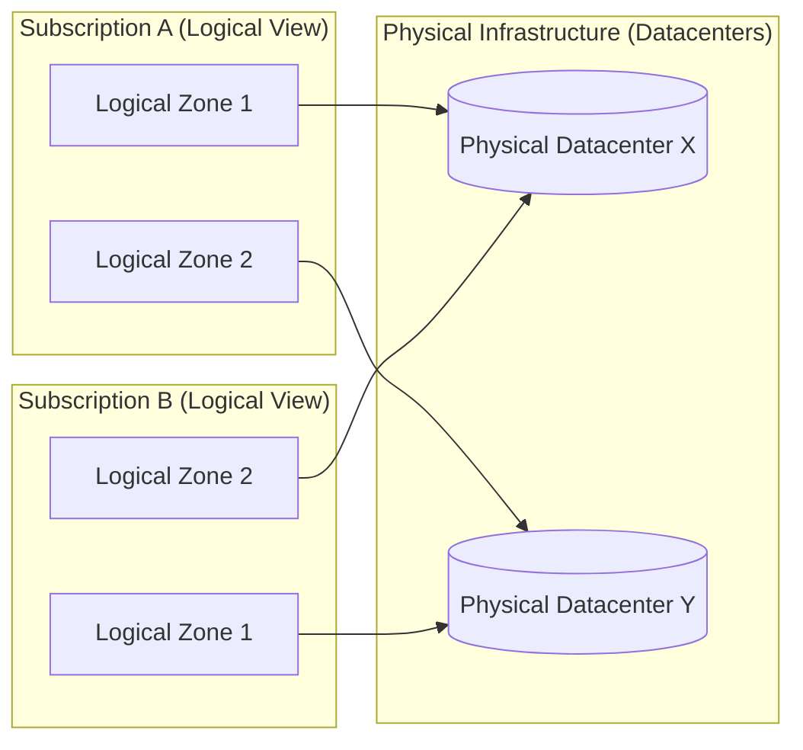

## Table of Contents

1. [Workload Partitioning: Subscription Boundaries](#workload-partitioning-subscription-boundaries)
2. [Logical Workspaces: Resource Groups](#logical-workspaces-resource-groups)
3. [Geographic Coordinates: Regions and SKUs](#geographic-coordinates-regions-and-skus)
4. [The CLI Scope: Switching Subscriptions and Querying Locations](#the-cli-scope-switching-subscriptions-and-querying-locations)
5. [Under-the-Hood: Logical Zone Randomization and Latency Rings](#under-the-hood-logical-zone-randomization-and-latency-rings)
6. [The Resilient Placement Decision](#the-resilient-placement-decision)
7. [Putting It All Together](#putting-it-all-together)
8. [What's Next](#whats-next)

## Workload Partitioning: Subscription Boundaries

A subscription is the most important billing and resource quota folder in Azure. Instead of deploying all your company services inside one shared folder (which makes it hard to see who spent what and creates massive security risks), you partition your infrastructure across dedicated subscriptions.

Think of your Azure subscriptions like separate bank accounts for different departments. If you put all your company's operational funds and experimental R&D money into one massive shared bucket, you will have a very hard time figuring out who is spending what, and a single mistake by an intern could drain your entire production budget.

To design a secure, cost-effective infrastructure, you must partition your workloads across dedicated subscriptions based on four operational drivers:

### 1. The Blast-Radius Protection (Operational Isolation)

The most important reason to separate subscriptions is access isolation. When a developer or a deployment script connects to Azure, their permissions are bound to a specific subscription scope. If your production databases and your developers' experimental sandboxes live in the same subscription, a developer running a cleanup script to erase test data could accidentally target a production database.

By placing production services inside a completely separate subscription, you create a physical administrative firewall. This isolation functions at the identity level: when an operator or a deployment pipeline authenticates through Microsoft Entra ID, the identity directory issues a JSON Web Token (JWT). The token's claims, specifically its audience (`aud`) and scope boundaries, are tightly locked to the active subscription. 

If an engineer working inside a development subscription runs a script that attempts to update or delete a resource in production, the Azure Resource Manager (ARM) engine will intercept the request at the central gateway. Because the engineer's active security token lacks any valid scope claims matching the production subscription's path, ARM blocks the request at the front gate, returning a `403 Forbidden` error before the resource provider is ever contacted.

### 2. Quotas and Resource Limits

Azure enforces strict, subscription-level capacity limits called quotas. For example, a subscription might be capped at a maximum of 100 virtual CPU cores or 20 storage accounts per region. These limits exist to prevent a single account from accidentally consuming all physical hypervisor capacity in a datacenter, shielding other tenants sharing the physical hardware from "noisy neighbor" starvation.

If your team runs high-frequency performance testing in the same subscription as your production application, the load-testing containers could consume all available vCPU allocations. When your production system tries to autoscale to handle a real traffic spike, the regional hypervisor resource scheduler will check your active subscription's allocated capacity. Because the load tests have saturated the subscription-level quota, ARM will reject the scale request immediately, leaving your production application starved of compute capacity and unable to handle user traffic. 

Partitioning these environments ensures that development scaling tests never starve your production systems of capacity. If a subscription quota limit is reached, it affects only the development folder, keeping your production capacity pool completely safe.

### 3. Financial and Billing Boundaries

Every resource inside a subscription compiles its hourly and monthly cost onto that specific subscription's billing statement. When virtual machines run, databases write transactions, or files are read from storage, the underlying physical hypervisors generate continuous telemetry records called usage meters. These meters track consumption in real-time (such as gigabytes of storage-hours or fractional vCPU run-hours).

If you deploy all your services into one shared subscription, the billing telemetry pipeline will aggregate millions of these individual usage logs into a single invoice. Your finance team will have to spend hours parsing through raw CSV spreadsheets, trying to map specific resource names to corporate cost centers.

By dedicating separate subscriptions to different organizational units (e.g., `sub-platform-core`, `sub-commerce-prod`, `sub-data-science-dev`), costs are automatically separated at the invoicing tier. This simplifies cost allocation, budget monitoring, and financial chargebacks. Each department receives a clean invoice representing only their resources, making cost management a routine administrative task.

### 4. Policy and Governance Rules

Azure uses a policy framework to enforce compliance rules (such as mandating that all databases are encrypted, or forbidding public storage endpoints). These rules are cabled to subscription folders. If your production subscription must comply with strict financial auditing standards, you can apply heavy restrictions at the subscription root. If developers shared that same subscription, they would be blocked from experimenting with new services, slowing down innovation. Separate subscriptions let you enforce strict compliance on production while leaving development sandboxes relatively open.

## Logical Workspaces: Resource Groups

Once you select a subscription, you organize your resources into resource groups. A resource group is simply a folder inside your subscription. But unlike a folder on your computer's filesystem, where you can nest folders five or ten levels deep, resource groups are flat. You cannot put a resource group inside another resource group. Every resource lives in exactly one resource group, and that is it.

This flat design might feel limiting at first, but it forces a clean, disciplined organizational model. In the cloud, a resource group represents a **lifecycle boundary**. When organizing resources, you must follow three core design rules:

### 1. Unified Lifecycle

Resources that are created, updated, and destroyed together belong in the same resource group. For example, our transactional orders API consists of a container app, a network interface, a private DNS record, and a database connection string. These resources are tightly cabled together—if you delete the API, the network interface and DNS records become useless junk. 

Placing them in a single resource group (e.g., `rg-orders-prod-uksouth`) means you can deploy the entire stack as a single template, update it as a single unit, and delete it recursively with a single command. 

Under the hood, when you issue a command to delete a resource group (like running `az group delete`), ARM does not execute a simple random wipe. Instead, it reads the metadata directory of all resources inside that folder, builds a directed acyclic graph (DAG) of their dependencies based on explicit `dependsOn` definitions and network links, performs a topological sort, and issues asynchronous deletion commands to individual resource providers (such as `Microsoft.Network` and `Microsoft.Compute`) in the exact reverse order of their dependencies. This guarantees a clean, orchestrator-safe teardown of your stack.

### 2. Isolate Persistent Data

Compute layers (like container apps or web servers) are highly volatile—you might destroy and recreate them ten times a day as you release new code versions. Your database, however, holds valuable, persistent customer records that must survive for years. 

If you place your volatile compute container and your persistent database in the exact same resource group, you risk an accidental deletion. A developer or a CI/CD pipeline attempting to clean up a stale staging compute stack could delete the entire resource group, erasing the persistent database along with it. 

To protect your data, you should place persistent state (like SQL databases or blob storage accounts) in their own dedicated, heavily protected resource groups with strict access controls. By decoupling compute from state at the resource group boundary, you ensure that a destructive deployment script targeted at a compute group can never touch your valuable, persistent data disks.

### 3. Align Resource Group Metadata

Every resource group is itself a metadata object, and when you create one, you must specify a geographic region for it (such as `uksouth`). This location does not dictate where your actual resources live—a resource group in `uksouth` can technically contain a virtual machine running in `eastus`. 

However, doing this introduces a dangerous control plane dependency. When you deploy a resource, its configuration properties, active status mappings, and administrative bindings are stored as metadata rows in a central ARM directory service. This directory service is physically hosted in the region you selected for the parent resource group.

If the `uksouth` region suffers a major datacenter outage or a WAN partition, the metadata directory for your resource group becomes completely unavailable. Even though your virtual machine in `eastus` is physically running fine and serving data to users, you will be unable to modify, update, scale, reboot, or delete its settings because the ARM control plane cannot read or update the parent resource group's metadata index. To avoid this, always set your resource group's metadata location to the same physical region hosting your actual resources.

A major gotcha is resource group moves. While Azure allows you to move resources between resource groups later, doing so is an expensive control plane transaction. A move modifies the resource's absolute ID path, which immediately breaks external monitoring dashboards, automated billing scripts, and CI/CD pipeline variables that rely on the original path. You must design your resource group naming standards before creating your first resource.

## Geographic Coordinates: Regions and SKUs

An Azure region is not just a single physical building. It is a set of datacenters deployed within a strictly defined latency perimeter and connected through a private, ultra-low-latency fiber network. 

Unlike local computing, where your workstation can host any application regardless of hardware size, cloud regions are physically asymmetric. Azure continuously builds and upgrades its datacenter sites globally, which means that different regions have completely different physical capacities, power grids, cooling systems, and hardware inventories.

When choosing a geographic home for your application, you must balance four critical factors:

### 1. Network Latency

The speed of light traveling through fiber-optic cables is a hard physical limit. In glass fiber cores, light travels at approximately $2 \times 10^8$ meters per second (about 200 kilometers per millisecond). This translates to a physical baseline network latency penalty of roughly 1 millisecond of round-trip time (RTT) for every 100 kilometers of distance.

If your primary customer base lives in London, hosting your application in Singapore adds a baseline network round-trip penalty of 150 milliseconds or more to every request. For transactional systems, this delay compounds quickly. In modern web architectures, loading a single page often requires multiple synchronous database queries (the "N+1 query" pattern). If your backend is separated from your database, or if your user's browser must exchange multiple rounds of TLS handshakes across a long distance, a 50ms physical latency gap quickly balloons into a sluggish 250ms page load delay. You should always select a region that minimizes network distance, aiming for a round-trip time below 100 milliseconds to the user.

### 2. Service and SKU Availability

Because datacenters are built at different times, they host different physical hardware. Azure classifies its regions into two primary categories:

*   **Recommended regions** (like `uksouth` or `westeurope`): These are massive, multi-campus datacenter complexes spread across multiple physical facilities. They host the complete catalog of Azure services and premium hardware sizes (called SKUs), backed by three fully independent Availability Zones.
*   **Alternate regions** (like `ukwest` or `westgermany`): These are smaller, single-facility footprints designed primarily as disaster recovery pairs or localized latency extensions. They operate on a restricted, utility-centric service menu and do not support full zone-redundant configurations.

If you write a Bicep template that attempts to deploy a zone-redundant Premium database into a smaller alternate region like `ukwest`, the ARM engine will evaluate your request against the regional capacity directory. Because the physical hardware controllers do not exist in that region, ARM will reject the deployment with a `LocationRequiredSkuNotAvailable` error code. Always verify that your target region physically hosts the hardware your application requires.

### 3. Geopolitical and Compliance Posture

Many countries legally mandate that personal customer records must remain within national borders (for example, the European Union's GDPR rules or local banking security laws). Selecting a region inside that geopolitical boundary is your primary mechanism to satisfy data compliance.

### 4. Twin Recovery Pairing (The Buddy System)

Azure pairs almost every region with another geographic twin within the same geopolitical boundary, typically located at least 300 miles away (such as `uksouth` and `ukwest`). This pairing functions like an operational "buddy system" during a major regional crisis (such as a widespread power grid failure or natural disaster).

During an outage, Azure prioritizes the recovery of the primary recommended region in the pair first. In addition, platform-level updates are rolled out sequentially—never to both paired regions at the same time—ensuring that a software bug in the cloud hypervisor cannot take down both sites simultaneously. To ensure maximum availability, you configure georeplicated services (like database read-replicas or file mirrors) to copy data asynchronously from your primary recommended region to its secondary twin.

## The CLI Scope: Switching Subscriptions and Querying Locations

To manage these placement coordinates without relying on the slow Web Portal, you use the Azure CLI to dynamically query regions, verify SKU availability, and switch your active subscription context.

Let us execute a terminal session to switch our active CLI subscription to production and query our target region coordinates:

```bash
$ az account set --subscription "Production-Orders-Subscription"
```

This terminal command shifts your active CLI context. Every subsequent command you run will execute within this specific billing envelope. 

To verify that the subscription context changed and inspect the physical locations supported by your active account, you run the location list query:

```bash
$ az account list-locations --query "[?name=='uksouth']" --output json
```

This CLI execution queries the regional metadata API to return our target region coordinates:

```json
[
  {
    "displayName": "UK South",
    "id": "/subscriptions/88888888-4444-4444-4444-121212121212/locations/uksouth",
    "metadata": {
      "geographyGroup": "Europe",
      "latitude": "50.9959",
      "longitude": "-1.3047",
      "pairedRegion": [
        {
          "id": "/subscriptions/88888888-4444-4444-4444-121212121212/locations/ukwest",
          "name": "ukwest"
        }
      ],
      "regionCategory": "Recommended",
      "regionType": "Physical"
    },
    "name": "uksouth",
    "regionalDisplayName": "(Europe) United Kingdom South"
  }
]
```

Every returned coordinate provides precise placement evidence:

*   `name`: The raw command-line identifier (`uksouth`). This is the exact string you must use inside your infrastructure templates and CLI commands.
*   `pairedRegion`: The designated geographic disaster recovery twin (`ukwest`).
*   `regionCategory`: Marked as `Recommended`. Recommended regions are full-scale primary datacenters hosting the complete catalog of Azure services, whereas secondary regions are categorised as `Other` or `Alternate` and support limited compute families.

## Under-the-Hood: Logical Zone Randomization and Latency Rings

To build a highly resilient architecture, you must understand the physical mechanisms behind Azure Availability Zones. An Availability Zone is a physically separate datacenter facility inside a region, equipped with independent power substations, industrial cooling towers, and fiber network routing paths.

When you configure zone-redundant services, you must account for two physical engineering constraints under the hood:



### 1. Logical Zone Randomization

To prevent every customer from overloading "Zone 1" in their configuration files, the Azure control plane randomizes the mapping of logical zone numbers to physical datacenters at the subscription tier.

This randomization is cabled to your subscription ID. When a subscription is provisioned, ARM hashes the subscription's unique UUID. This hash serves as a seed mapping logical strings ("Zone 1", "Zone 2") to physical datacenters. As shown in the diagram, Zone 1 in Subscription A might point to physical datacenter facility X, while in Subscription B the string "Zone 1" maps to physical datacenter facility Y. 

If your platform team attempts to coordinate low-latency cross-subscription network traffic by hardcoding logical zone numbers, you will suffer unexpected latency hops because the traffic must cross physical datacenter boundaries. To bypass this, you must query physical zone mappings using the CLI or rely on private virtual network routing metrics rather than logical zone strings.

### 2. High-Speed Latency Rings

To minimize latency overhead, Azure availability zones are connected by a private, high-speed fiber ring network designed to maintain sub-two-millisecond latency.

When your application writes transactional records to a zone-redundant database, the database engine executes synchronous writes across this fiber ring to ensure that the transaction is committed to physically isolated storage blocks before returning success. Under the hood, this relies on a three-replica consensus commit. When a write payload is received by the database master in Zone 1, the transaction log is immediately mirrored over the dark fiber ring to replicas in Zone 2 and Zone 3. The transaction is only marked as committed and a success code returned to the client once the log is written to the physical storage controllers of at least two zones. This network performance requirement is why zone-redundancy is restricted to primary recommended regions.

## The Resilient Placement Decision

When designing placement, you classify your services into three distinct zonal deployment models:

*   **Zone-Redundant**: The service automatically replicates data and balances requests across multiple physical zones. This is ideal for Ingress Load Balancers, Key Vaults, and Storage Accounts.
*   **Zonal**: You pin the resource to a single physical zone to minimize inter-service network latency. This is typical for Compute Virtual Machines or specialized cache nodes where speed is critical.
*   **Regional (Non-Zonal)**: The service has a single region-wide control plane without zonal parameters. Examples include Azure Monitor workspaces or regional identity registers.

For our transactional orders API, we choose a zone-redundant layout for ingress and databases to guarantee that a physical power failure in one datacenter cannot interrupt user checkout requests.

## Putting It All Together

Operating a resilient, cost-effective cloud system requires complete control over resource placement boundaries:

*   **Enforce Subscription Isolation**: Split production workloads from non-production staging environments using dedicated subscription billing and quota containers.
*   **Organize by Lifecycle**: Structure Resource Groups around shared deployment lifecycles, keeping persistent databases isolated from volatile compute layers.
*   **Query Regional SKUs**: Run `az account list-locations` inside your shell to verify regional pairings and ensure your target location supports your required hardware profiles.
*   **Mitigate Zone Randomization**: Recognize that logical zone numbers are randomized across subscriptions, relying on private network routing metrics rather than hardcoded zone strings.
*   **Deploy Zone-Redundant Anchors**: Utilize zone-redundant models for database and ingress targets while keeping latency-sensitive compute tasks zonal.

## What's Next

We have established our boundary placement, subscription partitioning, regional coordinates, and availability zone architectures. Now we are ready to identify and secure our individual resources. In the next article, we will go deep into resource identities. We will dissect the complete syntax of an Azure Resource ID, configure standard cost allocation tags, and apply control plane management locks.

---

**References**

* [Azure Regions and Availability Zones](https://learn.microsoft.com/en-us/azure/reliability/availability-zones-overview) - Physical datacenter layouts and zone mapping logic.
* [Manage Azure Subscriptions](https://learn.microsoft.com/en-us/azure/cost-management-billing/manage/create-subscription) - Billing and quota boundary structures.
* [Resource Group Management Guide](https://learn.microsoft.com/en-us/azure/azure-resource-manager/management/manage-resource-groups-portal) - Best practices for organizing resource lifecycles.
* [Cross-Region Replication Twins](https://learn.microsoft.com/en-us/azure/reliability/cross-region-replication-azure) - Georeplication pairs and prioritize recovery paths.
