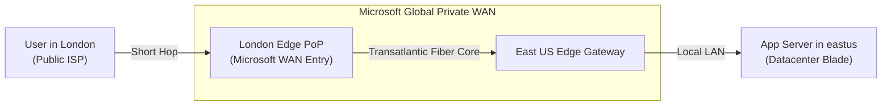
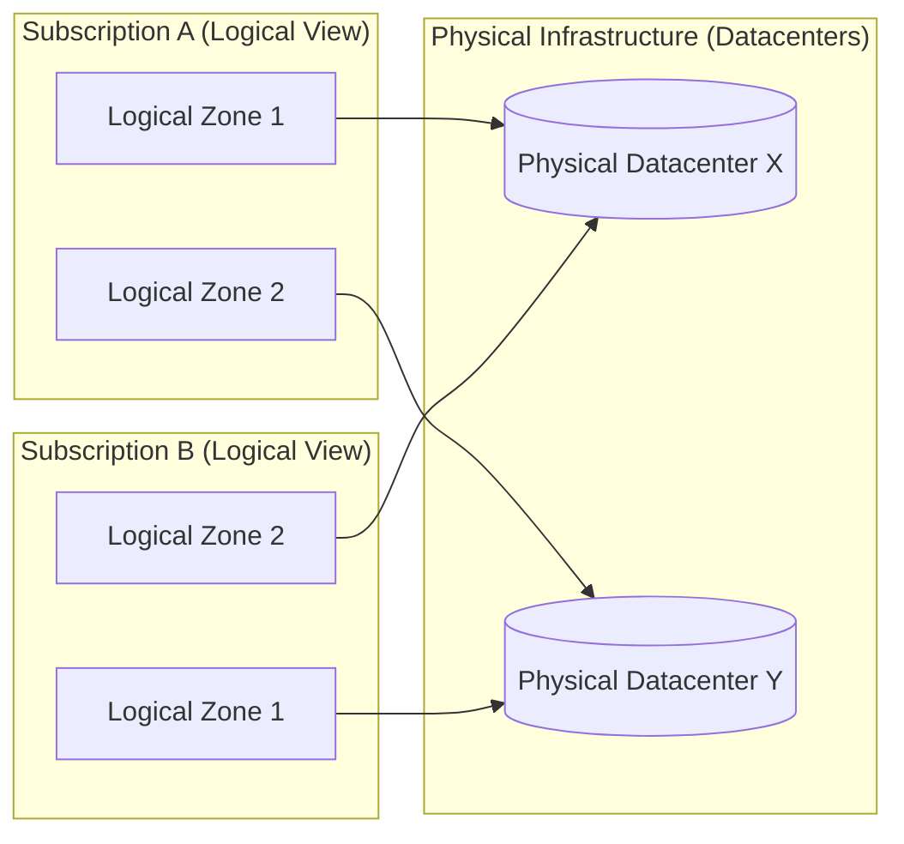

## Table of Contents

1. [Workload Partitioning: Subscription Boundaries](#workload-partitioning-subscription-boundaries)
2. [Logical Workspaces: Resource Groups](#logical-workspaces-resource-groups)
3. [Geographic Coordinates: Regions and SKUs](#geographic-coordinates-regions-and-skus)
4. [The CLI Scope: Switching Subscriptions and Querying Locations](#the-cli-scope-switching-subscriptions-and-querying-locations)
5. [Under-the-Hood: Logical Zone Randomization and Latency Rings](#under-the-hood-logical-zone-randomization-and-latency-rings)
6. [The Resilient Placement Decision](#the-resilient-placement-decision)
7. [Putting It All Together](#putting-it-all-together)
8. [What's Next](#whats-next)

## Workload Partitioning: Subscription Boundaries

A subscription is the most important billing and resource quota scope in Azure. Instead of deploying all your company services inside one shared scope (which makes it hard to see who spent what and creates massive security risks), you partition your infrastructure across dedicated subscriptions.

At a practical level, a subscription is the Azure scope where billing records, quota limits, policy assignments, and RBAC permissions meet. Keeping production, development, and shared platform workloads in separate subscriptions gives each environment its own cost ledger, capacity pool, and permission boundary.

To design a secure, cost-effective infrastructure, you must partition your workloads across dedicated subscriptions based on four operational drivers:

### 1. The Blast-Radius Protection (Operational Isolation)

The most important reason to separate subscriptions is access isolation. When a developer or a deployment script connects to Azure, their permissions are bound to a specific subscription scope. If your production databases and your developers' experimental test environments live in the same subscription, a developer running a cleanup script to erase test data could accidentally target a production database.

By placing production services inside a completely separate subscription, you create an administrative boundary. This isolation functions through Azure RBAC scopes. When an operator or a deployment pipeline authenticates through Microsoft Entra ID, the identity receives an access token that proves who the caller is. ARM then checks whether that caller has a role assignment at the production subscription, resource group, or resource scope.

If an engineer working inside a development subscription runs a script that attempts to update or delete a resource in production, the Azure Resource Manager (ARM) engine parses the target resource ID and evaluates the caller's role assignments along that path. If the caller has no matching permission at the production scope, ARM blocks the request with a `403 Forbidden` error before the resource provider performs the change.

### 2. Quotas and Resource Limits

Azure enforces strict, subscription-level capacity limits called quotas. For example, a subscription might be capped at a maximum of 100 virtual CPU cores or 20 storage accounts per region. These limits exist to prevent a single account from accidentally consuming all physical hypervisor capacity in a datacenter, shielding other tenants sharing the physical hardware from "noisy neighbor" starvation.

If your team runs high-frequency performance testing in the same subscription as your production application, the load-testing containers could consume all available vCPU allocations. When your production system tries to autoscale to handle a real traffic spike, the regional hypervisor resource scheduler will check your active subscription's allocated capacity. Because the load tests have saturated the subscription-level quota, ARM will reject the scale request immediately, leaving your production application starved of compute capacity and unable to handle user traffic.

Partitioning these environments ensures that development scaling tests never starve your production systems of capacity. If a subscription quota limit is reached, it affects only the development subscription, keeping your production capacity pool completely safe.

### 3. Financial and Billing Boundaries

Every resource inside a subscription compiles its hourly and monthly cost onto that specific subscription's billing statement. When virtual machines run, databases write transactions, or files are read from storage, the underlying physical hypervisors generate continuous telemetry records called usage meters. These meters track consumption in real-time (such as gigabytes of storage-hours or fractional vCPU run-hours).

If you deploy all your services into one shared subscription, the billing telemetry pipeline will aggregate millions of these individual usage logs into a single invoice. Your finance team will have to spend hours parsing through raw CSV spreadsheets, trying to map specific resource names to corporate cost centers.

By dedicating separate subscriptions to different organizational units (e.g., `sub-platform-core`, `sub-commerce-prod`, `sub-data-science-dev`), costs are automatically separated at the invoicing tier. This simplifies cost allocation, budget monitoring, and financial chargebacks. Each department receives a clean invoice representing only their resources, making cost management a routine administrative task.

### 4. Policy and Governance Rules

Azure Policy is the subscription rule system that accepts or rejects resource configurations before deployment completes. It exists so compliance rules are enforced by the platform instead of relying on every engineer to remember them manually.

Example: production can require private storage endpoints and deny resources outside `uksouth`, while a development subscription can allow temporary public test endpoints for short-lived experiments.

These rules are applied at subscription scopes. If your production subscription must comply with strict financial auditing standards, you can apply heavy restrictions at the subscription root. If developers shared that same subscription, they would be blocked from experimenting with new services, slowing down innovation. Separate subscriptions let you enforce strict compliance on production while leaving development test environments relatively open.


*Subscription boundaries are practical operating walls. They separate who can change production, which quota pool can be exhausted, which invoice records the spend, and which policies constrain deployments.*

## Logical Workspaces: Resource Groups

Once you select a subscription, you organize your resources into resource groups. A resource group is a flat lifecycle container inside your subscription. It is not a nested directory tree: you cannot put a resource group inside another resource group. Every resource lives in exactly one resource group, and that is it.

This flat design might feel limiting at first, but it forces a clean, disciplined organizational model. In the cloud, a resource group represents a **lifecycle boundary**. When organizing resources, you must follow three core design rules:

### 1. Unified Lifecycle

Resources that are created, updated, and destroyed together belong in the same resource group. For example, our transactional orders API consists of a container app, a network interface, a private DNS record, and a database connection string. These resources belong to the same runtime unit: if you delete the API, the network interface and DNS records become useless deployment residue.

Placing them in a single resource group (e.g., `rg-orders-prod-uksouth`) means you can deploy the entire stack as a single template, update it as a single unit, and delete it recursively with a single command.

Under the hood, when you issue a command to delete a resource group (like running `az group delete`), ARM does not execute a simple random wipe. Azure Resource Manager orchestrates deletion across the resource providers that own the child resources. Some resources have dependency-sensitive ordering, and some providers need extra time to finish their own delete operations. This is why a resource group delete can remain in progress for a while and why locked, protected, or provider-blocked resources can stop the cleanup from completing cleanly.

### 2. Isolate Persistent Data

Compute layers (like container apps or web servers) are frequently replaced as you release new code versions. Your database, however, holds valuable, persistent customer records that must survive for years.

If you place your volatile compute container and your persistent database in the exact same resource group, you risk an accidental deletion. A developer or a CI/CD pipeline attempting to clean up a stale staging compute stack could delete the entire resource group, erasing the persistent database along with it.

To protect your data, you should place persistent state (like SQL databases or blob storage accounts) in their own dedicated, heavily protected resource groups with strict access controls. By decoupling compute from state at the resource group boundary, you ensure that a destructive deployment script targeted at a compute group can never touch your valuable, persistent data disks.

### 3. Align Resource Group Metadata

Every resource group is itself a metadata object, and when you create one, you must specify a geographic region for it (such as `uksouth`). This location does not dictate where your actual resources live. A resource group in `uksouth` can technically contain a virtual machine running in `eastus`.

However, doing this introduces a real control-plane consideration. The resource group location is where Azure stores metadata about the resources in that group, and control-plane operations for the group are routed through that metadata location. Azure Resource Manager is designed to fail over resource requests to a secondary region when a resource group's region is temporarily unavailable, but regional failures can still affect management operations, especially when the target service region is also unhealthy.

The practical rule stays simple: put the resource group metadata close to the resources it manages unless you have a compliance reason to do otherwise. This keeps normal management operations predictable and avoids creating a surprising dependency between an `eastus` workload and a `uksouth` metadata location.

A major gotcha is resource group moves. While Azure allows you to move resources between resource groups later, doing so is an expensive control plane transaction. A move modifies the resource's absolute ID path, which immediately breaks external monitoring dashboards, automated billing scripts, and CI/CD pipeline variables that rely on the original path. You must design your resource group naming standards before creating your first resource.

## Geographic Coordinates: Regions and SKUs

An Azure region is the placement boundary where Azure groups datacenter capacity, network latency expectations, available service SKUs, and resilience options. It is not just a single physical building. It is a set of datacenters deployed within a strictly defined latency perimeter and connected through a private, ultra-low-latency fiber network.

Unlike local computing, where your workstation can host any application regardless of hardware size, cloud regions are physically asymmetric. Azure continuously builds and upgrades its datacenter sites globally, which means that different regions have completely different physical capacities, power grids, cooling systems, and hardware inventories.

When choosing a geographic home for your application, you must balance four critical factors:

### 1. Network Latency

The speed of light traveling through fiber-optic cables is a hard physical limit. In glass fiber cores, light travels at approximately $2 \times 10^8$ meters per second (about 200 kilometers per millisecond). This translates to a physical baseline network latency penalty of roughly 1 millisecond of round-trip time (RTT) for every 100 kilometers of distance.

If your primary customer base lives in London, hosting your application in Singapore adds a baseline network round-trip penalty of 150 milliseconds or more to every request. For transactional systems, this delay compounds quickly. In modern web architectures, loading a single page often requires multiple synchronous database queries (the "N+1 query" pattern). If your backend is separated from your database, or if your user's browser must exchange multiple rounds of TLS handshakes across a long distance, a 50ms physical latency gap quickly balloons into a sluggish 250ms page load delay. You should always select a region that minimizes network distance, aiming for a round-trip time below 100 milliseconds to the user.

### 2. Service and SKU Availability

Service and SKU availability means not every Azure region can run every service size or feature. Regions are built at different times, so they host different generations of server blades, network switches, and cooling technology.

Example: a VM size available in `eastus` may not be available in `uksouth`, and a newer database tier may launch in major regions before smaller regions.

Consequently, Azure regions are physically asymmetric. Microsoft classifies its regions into two primary categories:

*   **Recommended regions** (like `uksouth` or `westeurope`): These are primary regional hubs that offer the highest datacenter footprint. They typically support the complete catalog of Azure services, the largest VM SKU series (such as the M-series memory-optimized blades), and full Availability Zone architectures.
*   **Alternate regions** (like `ukwest` or `westgermany`): These are smaller, satellite regional datacenters. They primarily serve as backup targets for disaster recovery or specialized data-residency nodes. Alternate regions often provide a restricted service catalog, have lower physical compute quotas, and do not support Availability Zones.

Under the hood, when you submit a Bicep or Terraform template, the ARM gateway evaluates your request against the target region's physical inventory registry. If you attempt to deploy a specific VM size (like `Standard_E64ds_v5` memory-optimized VM) or a zone-redundant SQL pool in a region that lacks the physical hardware, ARM will reject the REST transaction at its validation gate, returning a `SkuNotAvailable` or `OperationNotAllowed` error:

```json
{
  "error": {
    "code": "SkuNotAvailable",
    "message": "The requested size 'Standard_E64ds_v5' is not available in region 'ukwest' for subscription '88888888-4444-4444-4444-121212121212'."
  }
}
```

To prevent deployment pipeline failures, always query regional hardware capabilities and verify your subscription's active quota limits before committing to a regional target.

### 3. Geopolitical and Compliance Posture

Many industries and national jurisdictions legally mandate that citizen personal records must remain within specific sovereign boundaries. For example, the European Union's GDPR rules and financial security frameworks require that data planes stay within the EU boundary. Selecting a region inside that geopolitical boundary (such as `westeurope` or `germanywestcentral`) is your primary compliance tool to enforce this boundary.

### 4. Microsoft's Worldwide WAN and Cold Potato Routing

Microsoft's worldwide WAN is the private backbone network that carries Azure traffic across regions and edge locations. It exists so Azure can move traffic over Microsoft's controlled network path instead of leaving every long-distance hop to the public internet.

Example: a user request may enter at a nearby Microsoft edge location, then travel on Microsoft's backbone toward the Azure region hosting the application.

When evaluating network latency, you must understand how traffic traverses the globe to reach your selected region. Microsoft operates one of the largest private Wide Area Networks in the world, consisting of over 175,000 miles of terrestrial and subsea fiber-optic cables.

To minimize latency and bypass public internet congestion, Microsoft utilizes **Cold Potato Routing**. In traditional routing, an ISP tries to hand off traffic to other networks as quickly as possible (hot potato). Under Microsoft's cold potato model, when a user in London sends a request to an application hosted in `eastus` (Virginia), the request enters Microsoft's private network at the nearest local Edge Site (Point of Presence or PoP) in London.

The packet is immediately encapsulated and routed across Microsoft's private transatlantic fiber backbone. Because the packet stays within Microsoft's managed network for 99% of its journey, it bypasses public internet hops, routing loops, and peering bottlenecks, ensuring highly predictable and stable latency times.



### 5. Twin Recovery Pairing (The Buddy System)

Azure pairs many regions with another geographic twin within the same geography, typically located at least 300 miles away (such as `uksouth` and `ukwest`). This pairing creates a preferred cross-region recovery relationship during a major regional crisis (such as a widespread power grid failure or natural disaster).

During a broad outage, Azure prioritizes recovery for one region in each pair. In addition, platform-level updates are generally rolled out sequentially across paired regions so the same platform update is not applied to both paired sites at the same time. To improve regional recovery, you configure geo-replicated services, database replicas, storage redundancy, or backup restore targets explicitly. Region pairing helps the platform, but it does not automatically make an application recoverable.

## The CLI Scope: Switching Subscriptions and Querying Locations

To manage these placement coordinates without relying on the slow Web Portal, you use the Azure CLI to dynamically query regions, verify SKU availability, and switch your active subscription context.

Let us execute a terminal session to switch our active CLI subscription to production and query our target region coordinates:

```bash
$ az account set --subscription "Production-Orders-Subscription"
```

This terminal command shifts your active CLI context. Every subsequent command you run will execute within this specific billing envelope.

To verify that the subscription context changed and inspect the physical locations supported by your active account, you run the location list query:

```bash
$ az account list-locations --query "[?name=='uksouth']" --output json
```

This CLI execution queries the regional metadata API to return our target region coordinates:

```json
[
  {
    "displayName": "UK South",
    "id": "/subscriptions/88888888-4444-4444-4444-121212121212/locations/uksouth",
    "metadata": {
      "geographyGroup": "Europe",
      "latitude": "50.9959",
      "longitude": "-1.3047",
      "pairedRegion": [
        {
          "id": "/subscriptions/88888888-4444-4444-4444-121212121212/locations/ukwest",
          "name": "ukwest"
        }
      ],
      "regionCategory": "Recommended",
      "regionType": "Physical"
    },
    "name": "uksouth",
    "regionalDisplayName": "(Europe) United Kingdom South"
  }
]
```

Every returned coordinate provides precise placement evidence:

*   `name`: The raw command-line identifier (`uksouth`). This is the exact string you must use inside your infrastructure templates and CLI commands.
*   `pairedRegion`: The designated geographic disaster recovery twin (`ukwest`).
*   `regionCategory`: Marked as `Recommended`. Recommended regions are primary regions for most new workloads and usually have broader service availability, but you still need to check the exact service and SKU before deploying.

## Under-the-Hood: Logical Zone Randomization and Latency Rings

Availability Zones are physically separate datacenter facilities inside one Azure region. They exist so an application can survive the loss of one facility without leaving the region.

Example: a production API can place replicas in zones `1`, `2`, and `3` in `uksouth`, so one zonal power issue does not remove all running capacity.

To build a highly resilient architecture, you must understand the physical mechanisms behind Azure Availability Zones. An Availability Zone is equipped with independent power substations, industrial cooling towers, and fiber network routing paths.

When you configure zone-redundant services, you must account for two physical engineering constraints under the hood:



### 1. Logical Zone Randomization

Logical zone randomization means `zone 1` in one subscription may map to a different physical facility than `zone 1` in another subscription. Azure does this to spread customers across facilities instead of concentrating everyone on the same datacenter.

Example: `sub-orders-prod` and `sub-analytics-prod` may both deploy to `zone 1`, but Azure can map those logical labels to different physical sites.

This mapping is scoped to your subscription. Azure does not promise that logical zone `1` in one subscription points to the same physical datacenter as logical zone `1` in another subscription. As shown in the diagram, Zone 1 in Subscription A might point to physical datacenter facility X, while in Subscription B the string "Zone 1" maps to physical datacenter facility Y.

If your platform team attempts to coordinate low-latency cross-subscription network traffic by hardcoding logical zone numbers, you will suffer unexpected latency hops because the traffic must cross physical datacenter boundaries. To bypass this, you must query physical zone mappings using the CLI or rely on private virtual network routing metrics rather than logical zone strings.


*Logical zone numbers are scoped to a subscription. The same label can point at a different physical building in another subscription, so cross-subscription placement decisions need measured network evidence rather than copied zone strings.*

:::expand[Hardcoding Zone Numbers Across Subscriptions]{kind="pitfall"}
Azure maps logical zone numbers (1, 2, 3) to physical datacenter buildings independently per subscription. This means logical "Zone 1" in Subscription A and logical "Zone 1" in Subscription B can map to completely different physical sites. A platform team that hosts a low-latency web application in Subscription A and its backend database in Subscription B, both hardcoded to `zone: "1"` under the assumption of physical co-location, may suffer unexpected cross-datacenter network hops, adding 2–5 ms of latency to every database query.

This mirrors the behavior of AWS, which randomizes logical zone names (such as `us-east-1a`) across different accounts. Azure also provides ways to compare logical and physical availability zone mappings, such as Check Zone Peers for supported subscriptions and regions, but the safe day-to-day habit is still to avoid copying logical zone numbers across subscriptions as if they were universal physical building IDs.

To find zone-to-SKU availability for your subscription, run:
```bash
az vm list-skus --location eastus --zone --output table
```

To prevent this latency penalty, parameterize zone values instead of hardcoding:

*   **Before (Hardcoded Trap):** Both subscription Bicep templates define:
    ```bicep
    param zone string = '1'
    ```
*   **After (Flexibly Parameterized):** Define a mapping variable based on the subscription, or deploy zone-redundant resources that balance traffic automatically.

**Rule of thumb:** Never assume logical zone numbers are symmetric across different subscriptions. If you require cross-subscription placement alignment, check the zone mapping for those subscriptions and regions, or choose zone-redundant platform services that abstract physical zone details.
:::

### 2. High-Speed Latency Rings

High-speed latency rings are the private fiber paths connecting zones inside a region. They exist so zone-redundant services can copy data across facilities without adding cross-country latency.

Example: a zone-redundant storage write can commit to more than one zonal facility while staying inside the region's low-latency fiber boundary.

When your application uses a zone-redundant service, Azure places replicas or service components across separate facilities inside the region. The exact replication protocol depends on the service. A zone-redundant storage account, a zone-redundant SQL database, and a zone-redundant load balancer do not all commit data the same way. The shared design point is that the service can keep operating through the loss of one zone when the selected service, region, and SKU support that mode.

## The Resilient Placement Decision

A resilient placement decision is the choice of how many facilities a workload should depend on. It connects business criticality to a concrete zone pattern.

Example: a production checkout API may need zone-redundant compute, while an internal report worker may fit a single-zone deployment with backups.

When designing placement, you classify your services into three distinct zonal deployment models:

*   **Zone-Redundant**: The service automatically replicates data and balances requests across multiple physical zones. This is ideal for Ingress Load Balancers, Key Vaults, and Storage Accounts.
*   **Zonal**: You pin the resource to a single physical zone to minimize inter-service network latency. This is typical for Compute Virtual Machines or specialized cache nodes where speed is critical.
*   **Regional (Non-Zonal)**: The service has a single region-wide control plane without zonal parameters. Examples include Azure Monitor workspaces or regional identity registers.

For our transactional orders API, we choose a zone-redundant layout for ingress and databases to guarantee that a physical power failure in one datacenter cannot interrupt user checkout requests.

## Putting It All Together

Operating a resilient, cost-effective cloud system requires complete control over resource placement boundaries:

*   **Enforce Subscription Isolation**: Split production workloads from non-production staging environments using dedicated subscription billing and quota containers.
*   **Organize by Lifecycle**: Structure Resource Groups around shared deployment lifecycles, keeping persistent databases isolated from volatile compute layers.
*   **Query Regional SKUs**: Run `az account list-locations` inside your shell to verify regional pairings and ensure your target location supports your required hardware profiles.
*   **Mitigate Zone Randomization**: Recognize that logical zone numbers are randomized across subscriptions, relying on private network routing metrics rather than hardcoded zone strings.
*   **Deploy Zone-Redundant Anchors**: Utilize zone-redundant models for database and ingress targets while keeping latency-sensitive compute tasks zonal.

## What's Next

We have established our boundary placement, subscription partitioning, regional coordinates, and availability zone architectures. Now we are ready to identify and secure our individual resources. In the next article, we will go deep into resource identities. We will dissect the complete syntax of an Azure Resource ID, configure standard cost allocation tags, and apply control plane management locks.


*Use this as the placement checklist: isolate production at the subscription boundary, group resources by lifecycle, choose regions by latency and available SKUs, treat zone numbers as subscription-scoped, and pair recovery targets deliberately.*

---

**References**

* [Azure Regions and Availability Zones](https://learn.microsoft.com/en-us/azure/reliability/availability-zones-overview) - Physical datacenter layouts and zone mapping logic.
* [Manage Azure Subscriptions](https://learn.microsoft.com/en-us/azure/cost-management-billing/manage/create-subscription) - Billing and quota boundary structures.
* [Resource Group Management Guide](https://learn.microsoft.com/en-us/azure/azure-resource-manager/management/manage-resource-groups-portal) - Best practices for organizing resource lifecycles.
* [Cross-Region Replication Twins](https://learn.microsoft.com/en-us/azure/reliability/cross-region-replication-azure) - Georeplication pairs and prioritize recovery paths.
