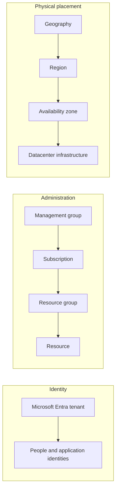

## Table of Contents

1. [What Coordinates Does Azure Give Every Workload?](#what-coordinates-does-azure-give-every-workload)
2. [What Is a Microsoft Entra Tenant?](#what-is-a-microsoft-entra-tenant)
3. [Why Do Azure Subscriptions Exist?](#why-do-azure-subscriptions-exist)
4. [How Do Management Groups and Resource Groups Organize Resources?](#how-do-management-groups-and-resource-groups-organize-resources)
5. [How Do Scope, RBAC, and Policy Work Together?](#how-do-scope-rbac-and-policy-work-together)
6. [How Do Regions Place Workloads?](#how-do-regions-place-workloads)
7. [How Do Availability Zones Limit Failure?](#how-do-availability-zones-limit-failure)
8. [How Do You Review a Workload’s Placement?](#how-do-you-review-a-workloads-placement)
9. [Check Your Answers](#check-your-answers)
10. [References](#references)

Before you create a virtual machine, Azure needs more than its size. Which organization does the person creating it belong to? Which part of that organization owns the resource and its cost? Where should the machine run? What should happen if the datacenter supporting it fails?

Azure uses different concepts to answer those questions. The confusing part is that several appear on the same deployment screen, even though they describe different things. A resource group has a location, for example, but that location does not force every resource in the group to run there. Understanding why makes the rest of the model much easier to use.

We will separate identity, administration, and physical placement, then bring them together in a payments deployment:

1. **What Coordinates Does Azure Give Every Workload?**
2. **What Is a Microsoft Entra Tenant?**
3. **Why Do Azure Subscriptions Exist?**
4. **How Do Management Groups and Resource Groups Organize Resources?**
5. **How Do Scope, RBAC, and Policy Work Together?**
6. **How Do Regions Place Workloads?**
7. **How Do Availability Zones Limit Failure?**
8. **How Do You Review a Workload’s Placement?**

## What Coordinates Does Azure Give Every Workload?
<!-- section-summary: Identity, administrative ownership, and physical placement are separate coordinates, so a resource's subscription does not determine its region. -->

A cloud platform needs to identify callers, organize resources, apply controls, and place work on infrastructure. Azure gives each of these jobs a name. Start with the question each name answers rather than trying to memorize the names in isolation.

| Question Azure must answer | Concept used |
|---|---|
| Which organization or identity directory does this caller belong to? | Tenant |
| Which major administrative and commercial boundary owns these resources? | Subscription |
| Which related resources should be managed together? | Resource group |
| Where should a permission or governance rule apply? | Scope |
| In which geographic area should this workload run? | Region |
| Which independent failure location inside that region should it use? | Availability zone |

These questions form three sets of coordinates. The **identity coordinate** identifies the directory containing the caller. The **administrative coordinate** identifies who manages a resource and which governance applies to it. The **physical coordinate** describes the infrastructure location supporting the workload.


```mermaid
flowchart LR
  subgraph identity[Identity]
    T[Microsoft Entra tenant] --> U[People and application identities]
  end
  subgraph administration[Administration]
    M[Management group] --> S[Subscription] --> G[Resource group] --> R[Resource]
  end
  subgraph placement[Physical placement]
    GEO[Geography] --> REG[Region] --> Z[Availability zone] --> D[Datacenter infrastructure]
  end
  class T,U,M,S,G,R,GEO,REG,Z,D neutral
```

The administrative hierarchy and the physical hierarchy are independent. That distinction is the central model for this article. Placing a resource in a subscription answers an ownership question; selecting its region answers a deployment-location question. Neither choice supplies the other automatically.

Consider a `Production` subscription and `payments-prod` resource group. One VM runs in UK South, zone 1. A second VM runs in UK South, zone 2. Storage uses a zone-redundant configuration in UK South, while backup resources use another region. All of these resources can belong to the same administrative group even though their placement differs.

The subscription itself does not occupy UK South, and a region is not a container inside the resource group. Each resource has its own placement characteristics. This distinction also explains why viewing resources grouped by region in a portal does not change their administrative hierarchy. The view is showing a shared property, not introducing another governance level.

The identity coordinate comes first because Azure needs to identify the people and software acting on those resources. Once that identity boundary is clear, the subscription and resource group can describe the resources those callers manage.

## What Is a Microsoft Entra Tenant?
<!-- section-summary: A tenant holds an organization's identity objects; several subscriptions can trust that same tenant while keeping separate resource boundaries. -->

A **Microsoft Entra tenant** is an organization's identity and security boundary. It provides the directory in which Azure can identify people, groups, applications, and managed identities. A directory is the collection of identity records and their associated settings; it gives a caller's name a specific organizational context.

Suppose Contoso begins using Microsoft cloud services. It needs records for Alice and Bob, groups such as Finance-Team and Developers, application identities, managed identities, authentication rules, Conditional Access settings, and enterprise applications. Those records and settings belong in the Contoso tenant.

Conditional Access is part of this identity setting: it concerns the conditions under which access is allowed. The important point here is where that policy belongs. It belongs with the identity system, alongside the people and applications to which it applies, rather than with a geographic region.

When Alice signs in, Azure needs to know which directory her identity comes from. A username by itself does not express the full organizational boundary. “Alice in the Contoso tenant” supplies that missing context. The tenant therefore provides the identity universe in which the account, its groups, and relevant identity settings make sense.

Contoso can have Development, Testing, Production, and Security subscriptions while continuing to use this single directory. Alice does not require four independent identities simply because the organization has four subscriptions. Her identity can remain in Contoso's tenant while resource administration is divided across those subscriptions.

The relationship is a trust relationship: each subscription trusts one Microsoft Entra tenant at a time for authentication, and a tenant can be associated with multiple subscriptions. Authentication means establishing who the caller is. Whether that known caller may perform a particular resource operation is a separate permissions question. The subscription's trust in a tenant does not, by itself, give every person in the tenant administrative access. [Microsoft's resource management overview](https://learn.microsoft.com/en-us/azure/active-directory/fundamentals/secure-with-azure-ad-resource-management) describes this tenant–subscription relationship.

That separation matters when reading an Azure diagram. A tenant represents identity and security context. A subscription represents a resource, governance, and commercial boundary. If a diagram puts subscriptions beneath a tenant, it is showing which directory they trust; it is not showing separate datacenters or requiring a new employee account for every environment.

With one identity system serving several environments, the next question is why those environments need separate subscriptions at all.

## Why Do Azure Subscriptions Exist?
<!-- section-summary: Subscriptions divide resources by administration, cost accountability, quotas, policies, ownership, environment, and acceptable blast radius. -->

A **subscription** is a billing and management container for Azure resources and resource groups. It supplies a major boundary for administration and resource consumption. In practical terms, it helps an organization decide which collection of resources belongs under the same ownership, spending, and governance arrangement.

Imagine Contoso's planned estate: 100 development VMs, 50 test databases, 200 production services, security monitoring, and experiments. Azure could place everything within one broad administrative collection. The difficulty would come when the organization needed to separate who administers it, who accounts for its cost, which quotas and limits apply, and which policies protect production.

These concerns often overlap. Production and development may have different administrators and rules. Security monitoring may have distinct ownership. Experiments may need a limited blast radius—the range of resources or activities that could be affected by a mistake. Subscription boundaries give the organization a way to make those larger distinctions explicit.

A simple arrangement is one Contoso tenant with Production, Development, and Sandbox subscriptions. Another arrangement divides Production, NonProduction, Security, and Sandbox. Either is an organizational choice rather than a universal template. The useful rule is to create subscriptions around major governance, ownership, environment, cost, or isolation boundaries, rather than creating one for every individual resource.

Keeping everything in one subscription can still work. For example, Contoso could organize production, development, finance, security, experiments, customer A, and customer B within that subscription. The tradeoff is that all those concerns share the same major boundary. Separating subscriptions provides stronger administrative isolation when their requirements differ enough to justify it.

### Why a subscription can span regions

The subscription answers an administrative question, so its contents can run in several geographic locations. An example Production subscription contains a VM and database in UK South, a backup vault in West Europe, and another VM in East US. The subscription remains the same throughout; the resource locations differ.

The distinction can be stated precisely: the subscription identifies the resource's administrative ownership, while the resource's `location` describes its physical or service placement. Choosing Production as the subscription does not choose UK South as the region. Choosing UK South does not decide which department pays for or administers the resource.

This is also why separating subscriptions should begin with governance needs rather than geographic names alone. Geography may influence the design, but it is one input to a broader ownership and isolation decision. The subscriptions then need an organizational structure above them when the estate grows, and smaller lifecycle boundaries inside them for daily application work.

## How Do Management Groups and Resource Groups Organize Resources?
<!-- section-summary: Management groups organize subscriptions for shared governance, while resource groups collect resources with compatible management and deletion lifecycles. -->

Azure provides a layer above subscriptions and a layer below them because each solves a different scale problem. **Management groups** help apply governance across subscriptions. **Resource groups** help manage related resources within a subscription.

### Applying governance across subscriptions

Suppose an organization grows to 100 subscriptions, including 60 production subscriptions that must follow the same corporate security policy. Configuring the same rule independently 60 times creates repeated work and opportunities for inconsistency. A management group lets the organization collect those subscriptions under a shared governance parent.

An example hierarchy begins with a Root Management Group. A Platform branch contains Identity and Connectivity subscriptions. A Production branch contains Prod-App1, Prod-App2, and Prod-App3 subscriptions. A Sandbox branch contains Developer-A and Developer-B subscriptions. The grouping explains which subscriptions should share controls before any individual VM is considered.

Management groups do not normally contain the application VMs themselves. Their purpose is to organize subscriptions so governance can be applied at scale. The [Azure RBAC scope hierarchy](https://learn.microsoft.com/en-us/azure/role-based-access-control/scope-overview) places them above subscriptions for that reason.

### Grouping resources that share a lifecycle

Inside a subscription, applications use VMs, disks, databases, virtual networks, load balancers, public IPs, Key Vaults, and storage accounts. A resource group collects related resources into a smaller management boundary. The useful criterion is their **lifecycle**: how they are created, changed, operated, and eventually deleted.

For an online shop, `rg-shop-prod` contains a web app, database, storage account, monitoring resources, and Key Vault. This can be a sensible grouping when those resources are managed together. Thinking of the group only as a folder misses the operational consequence: the group represents related management and lifecycle work.

The Customer Portal example makes that consequence clearer. Its VM, database, storage, and monitoring may be created together, updated together, owned by one team, and deleted together. Their shared lifecycle supports using one resource group. A central network with a shared VNet, firewall, and VPN gateway must remain after the portal is removed. That separate lifetime supports placing the network elsewhere.

Grouping everything merely because it is production would hide this difference. Environment is one useful property, but the portal's deletion must not imply deleting infrastructure that other applications still need. [Azure Resource Manager's overview](https://learn.microsoft.com/en-us/azure/azure-resource-manager/management/overview) recommends placing resources with the same lifecycle together. A resource belongs to one resource group, and supported resources can later be moved between groups.

### Understanding the resource group's location

Creating a resource group requires a location. For `rg-payments`, selecting UK South chooses where Azure stores the group's management metadata. Metadata is information describing the group; it is distinct from the workload running on resources within it.

That group can contain a VM in UK South, storage in UK South, and another resource in West Europe. The group's metadata location does not force the resource locations. A group named `rg-example` with metadata in UK South can therefore manage resources in more than one region. [Microsoft's resource group guidance](https://learn.microsoft.com/en-us/azure/azure-resource-manager/management/manage-resource-groups-portal) documents this separation.

Management groups, subscriptions, resource groups, and resources now form an administrative hierarchy. The next step is understanding what follows that hierarchy: permissions and governance have a reach called scope.

## How Do Scope, RBAC, and Policy Work Together?
<!-- section-summary: Scope determines which resources a control reaches; permissions inherit down the management hierarchy, while physical and network settings remain separate. -->

**Scope** is the set of resources to which a control applies. If Alice manages only `VM-01`, a permission can concern that individual resource. If she manages the payments application, the appropriate scope might be `rg-payments`. If she administers the production platform, the required scope may be the Production subscription.

Azure Resource Manager has four standard scope levels, from widest to narrowest: management group, subscription, resource group, and resource. Permissions assigned at a higher level are inherited by the lower levels beneath it. This makes the location of a role assignment as important as the role itself.

Consider a Production subscription containing `rg-payments` with `VM-A` and `DB-A`, and `rg-orders` with `VM-B` and `DB-B`. Assigning Alice an appropriate role at `rg-payments` reaches that group and its descendants. It does not give that assignment a reach into the sibling `rg-orders` group. Assigning the same role at the subscription instead reaches both groups and all four resources.

The higher the assignment scope, the broader its effect. To review access, ask both what the role allows and which descendants the chosen scope contains. A role name alone does not describe the full extent of permission.

### Different controls use the same hierarchy

**Azure RBAC**, or role-based access control, answers who may do what. For example, combine Alice, the Virtual Machine Contributor role, and `rg-payments`. Together, those three parts mean that Alice may perform the actions allowed by that role within the group and its descendants.

**Azure Policy** concerns permitted or required resource configurations. A policy attached to a Production management group might require deployments to use approved regions, affecting the subscriptions below that group. Policies assigned at subscription or resource-group scope likewise apply beneath those scopes. The two systems use the same administrative structure for different decisions: RBAC concerns the caller's allowed actions; Policy concerns resource configuration rules.

This distinction explains why “I have permission” does not completely answer whether a proposed configuration fits organizational rules. The identity, allowed action, and configuration requirement are related checks, but each has its own job.

### What the hierarchy does not supply

A VM inside `rg-payments` does not inherit a region, VNet, subnet, availability zone, or IP address simply because it is beneath that group and subscription. Those settings describe placement or network relationships. Scope inheritance describes the reach of controls.

A region is therefore outside the ARM governance hierarchy. The structure is subscription, resource group, resource, with a location property on the resource. It is not subscription, UK South, resource group. Portal views that group items by location do not change this rule.

An Azure resource ID makes the distinction visible:

```text
/subscriptions/1234/resourceGroups/rg-payments/providers/Microsoft.Compute/virtualMachines/api-01
```

This identifies a subscription, resource group, provider, resource type, and resource name. The provider is the Azure service namespace managing that resource type; here `Microsoft.Compute` manages `virtualMachines`. UK South and zone 2 are absent from this administrative path because they are placement characteristics. You must examine those characteristics separately to understand where the VM runs.

## How Do Regions Place Workloads?
<!-- section-summary: Regions locate workloads on datacenter infrastructure; region selection must account for latency, residency, services, capacity, cost, and resilience. -->

A request to create a VM eventually requires physical computing hardware somewhere. An **Azure region** is the geographic deployment area that provides that infrastructure. UK South, West Europe, East US, Australia East, and Japan East are examples.

A region comprises one or more datacenters connected by high-capacity, fault-tolerant, low-latency networking. Regions sit within larger **geographies**, which are important when considering data-residency boundaries. The broad relationship is geography, then region, then supporting datacenter infrastructure. [Microsoft's region overview](https://learn.microsoft.com/en-ca/azure/reliability/regions-overview) explains those terms and selection considerations.

Why distribute infrastructure geographically? A single giant global datacenter would introduce several problems. A London user communicating with a server thousands of kilometres away experiences added latency. Organizations may have legal or contractual limits on where data is stored or processed. A large geographic disaster could affect infrastructure concentrated in one location. Different places also offer different services and prices.

These are practical design inputs, not just definitions. When selecting a region, consider:

- **Latency:** how far requests must travel between users, applications, and the infrastructure serving them.
- **Data residency and regulation:** which locations satisfy the organization's requirements for storage and processing.
- **Service availability:** whether the needed Azure services and features exist in the selected location.
- **Capacity:** whether the region can support the intended deployment requirements.
- **Cost:** how service and network pricing affect the design.
- **Resilience:** which regional and availability-zone options support the required failure response.

A region choice should be evaluated against all of these together. Being geographically close to users is useful, but it does not establish that the needed service is available or that its resilience option fits the workload. Likewise, choosing a region for an approved geography does not automatically address what happens during an outage.

That brings us to a smaller failure boundary. UK South is a regional choice, but copies of an application within it can still share a local infrastructure dependency. Availability zones let the design address that dependency explicitly.

## How Do Availability Zones Limit Failure?
<!-- section-summary: Zones isolate local infrastructure failures within a region; zonal placement and zone redundancy require service-specific choices, and regional failures require another region. -->

An **availability zone** is a separated group of datacenters within a region, with independent power, cooling, and networking infrastructure. The aim is enough separation that a failure in one zone does not prevent workloads in other zones from continuing. A region can contain multiple physical facilities, so treating the whole region as one giant datacenter hides useful failure boundaries.

Consider utility power loss, a cooling problem, a networking failure, a datacenter incident, or another local infrastructure fault. If every copy of the application depends on the same location, several instances may still share one point of failure. Compare API 1, API 2, and API 3 all running in zone 1 with one API instance in each of zones 1, 2, and 3. Distributing them reduces dependence on one zone.

### Match redundancy to the failure boundary

Failures have different reach. Server, rack, and component failures call for local infrastructure resiliency. Losing a zone calls for a multi-zone architecture. Losing an entire region requires a multi-region strategy. Three zones in UK South remain three locations within UK South; they do not provide a second region if UK South is unavailable.

This separates high availability within a region from regional disaster recovery. Zone design addresses the first problem. A second-region strategy addresses the larger regional failure problem, with the replication, recovery, and operational decisions that entails.

### Zonal and zone-redundant services

With a **zonal** or pinned deployment, the engineer selects a zone for a resource. For example, VM-A is placed in zone 1, VM-B in zone 2, and VM-C in zone 3. The engineer is responsible for creating the redundant deployment arrangement.

With a **zone-redundant** deployment, the service distributes or replicates its components across zones. The engineer selects that supported service capability instead of manually placing every underlying component. Different Azure services expose these models differently, so a region's zone support does not answer every service-specific deployment question. The [Well-Architected guidance](https://learn.microsoft.com/en-us/azure/well-architected/resiliency/regions-availability-zones) describes both models.

### Logical zone numbers need subscription context

Zone numbers are logical labels, not universal physical building addresses. Azure distinguishes physical zones from the logical zone numbers a subscription sees. Subscription A's zone 1 can map to a different physical zone from subscription B's zone 1. [The availability-zone overview](https://learn.microsoft.com/en-us/azure/reliability/availability-zones-overview) explains this logical-to-physical mapping.

For ordinary placement within one subscription and region, think of zones 1, 2, and 3 as logical failure-domain labels. In a cross-subscription design, matching the number alone does not establish matching physical placement. This detail follows from the same larger principle: the label belongs to a particular context, so interpreting it requires that context.

## How Do You Review a Workload’s Placement?
<!-- section-summary: Review identity, governance, lifecycle, geography, and failure isolation separately, then combine them into a complete workload placement design. -->

Consider how Acme could put these choices together. Its tenant contains Alice, Bob, Carol, and Dave. Beneath the Root Management Group, Platform contains Identity and Connectivity subscriptions; Production contains Payments and Commerce subscriptions; NonProduction contains Dev and Test subscriptions.

Within Payments, `rg-payments-app` holds VM-1, VM-2, and a load balancer. `rg-payments-data` holds the database and storage. VM-1 runs in UK South zone 1, VM-2 in UK South zone 2, and the database uses zone redundancy in UK South. Disaster-recovery resources use a second Azure region.

This describes three structures at once. The tenant identifies the organization's people and software. Management groups, subscriptions, and resource groups organize resources and control reach. Regions and zones describe placement and failure isolation. Keeping all three visible lets a reviewer answer a specific question without mistaking one kind of boundary for another.

When asked to deploy a payments system, work through the following decisions in order:

1. **Choose the tenant.** Identify the directory containing the people, applications, groups, and managed identities that will administer or access the environment.
2. **Choose the management group and subscription.** Establish production or nonproduction status, cost ownership, applicable policies, required access boundaries, and acceptable blast radius.
3. **Choose resource groups by lifecycle.** Consider deployment, ownership, operations, and deletion together. Separate resources that must survive the removal of another part of the system.
4. **Choose the region.** Review users, latency, regulation, data residency, service availability, pricing, capacity, and resilience requirements.
5. **Plan for a zone failure.** Identify which components are zonal, which support zone redundancy, and whether the application would continue operating after one zone is lost.
6. **Plan for a regional failure where required.** Address the second region, replication, failover, traffic routing, backups, recovery objectives, and the procedures people will follow during recovery.

The order moves from identity through governance and lifecycle to geography and failure isolation. It also exposes incomplete answers. “The system is in Production” still leaves its physical placement unknown. “It runs in UK South” still leaves ownership and regional recovery unanswered. “It uses three zones” still needs an explanation of which components use them and what happens when the whole region fails.

| Concept | Boundary to remember | Common misunderstanding |
|---|---|---|
| Tenant | Identity and security context | Treating it as a region |
| Management group | Governance across subscriptions | Treating it as the application runtime |
| Subscription | Major resource, governance, and consumption boundary | Treating it as a datacenter |
| Resource group | Related management and lifecycle | Treating it as a physical location |
| Scope | Reach of a control | Treating it as network connectivity |
| Region | Geographic deployment area | Treating it as an RBAC container |
| Availability zone | Failure isolation within a region | Treating it as a separate region |

The most useful summary is also a practical way to explain a design to someone else: the tenant identifies whose directory is in use; subscriptions and resource groups explain administrative organization; regions and zones explain where the workload runs and which failures its placement addresses. Each answer adds information the other answers cannot provide.

## Check Your Answers

:::expand[What Coordinates Does Azure Give Every Workload?]{kind="recap"}
Identity, administration, and physical placement are separate. The tenant supplies identity context; the management hierarchy organizes resources and controls; regions and zones describe infrastructure placement. A resource's subscription does not determine its region.
:::

:::expand[What Is a Microsoft Entra Tenant?]{kind="recap"}
A tenant is the directory and identity boundary holding an organization's users, groups, applications, managed identities, and identity settings. A subscription trusts one tenant at a time, while one tenant can serve multiple subscriptions.
:::

:::expand[Why Do Azure Subscriptions Exist?]{kind="recap"}
Subscriptions establish major management and consumption boundaries for access, ownership, costs, quotas, policies, environments, and blast radius. Create them around meaningful organizational boundaries rather than individual resources. A subscription can contain resources in several regions.
:::

:::expand[How Do Management Groups and Resource Groups Organize Resources?]{kind="recap"}
Management groups collect subscriptions for shared governance. Resource groups collect related resources within a subscription, ideally with compatible lifecycles. The group's location stores management metadata and does not force the locations of its resources.
:::

:::expand[How Do Scope, RBAC, and Policy Work Together?]{kind="recap"}
Scope defines the resources a control reaches. RBAC governs who may perform actions; Policy governs permitted or required configurations. Higher-level permissions reach descendants, but resources do not inherit regions, subnets, zones, or addresses through that hierarchy.
:::

:::expand[How Do Regions Place Workloads?]{kind="recap"}
A region provides datacenter infrastructure within a geography. Select it by evaluating latency, residency, regulation, service availability, capacity, cost, and resilience. A geographic choice alone does not establish a complete availability design.
:::

:::expand[How Do Availability Zones Limit Failure?]{kind="recap"}
Zones separate power, cooling, and networking failure domains within a region. Zonal resources require an explicit redundant arrangement; zone-redundant services distribute supported components. Logical zone labels are subscription-specific, and surviving a whole-region outage requires another region.
:::

:::expand[How Do You Review a Workload’s Placement?]{kind="recap"}
Review the tenant, governance boundary, resource lifecycles, region, zone-failure response, and regional-recovery requirements. Keep identity, administration, and placement distinct while checking that the combined design answers all three kinds of question.
:::

## References

- [Resource management fundamentals in Microsoft Entra ID](https://learn.microsoft.com/en-us/azure/active-directory/fundamentals/secure-with-azure-ad-resource-management)
- [Understand scope for Azure RBAC](https://learn.microsoft.com/en-us/azure/role-based-access-control/scope-overview)
- [What is Azure Resource Manager?](https://learn.microsoft.com/en-us/azure/azure-resource-manager/management/overview)
- [Manage resource groups through the Azure portal](https://learn.microsoft.com/en-us/azure/azure-resource-manager/management/manage-resource-groups-portal)
- [What are Azure regions?](https://learn.microsoft.com/en-ca/azure/reliability/regions-overview)
- [What are Azure Availability Zones?](https://learn.microsoft.com/en-us/azure/reliability/availability-zones-overview)
- [Architecture strategies for using availability zones and regions](https://learn.microsoft.com/en-us/azure/well-architected/resiliency/regions-availability-zones)
