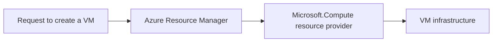
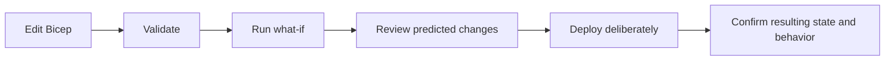

## Table of Contents

1. [What Must Azure Know About a Resource?](#what-must-azure-know-about-a-resource)
2. [How Do Resource Names and IDs Differ?](#how-do-resource-names-and-ids-differ)
3. [How Do Providers, Types, and API Versions Define a Resource?](#how-do-providers-types-and-api-versions-define-a-resource)
4. [How Should Tags Describe Resources?](#how-should-tags-describe-resources)
5. [How Do Locks Protect Resources?](#how-do-locks-protect-resources)
6. [What Evidence Should You Collect Before a Change?](#what-evidence-should-you-collect-before-a-change)
7. [How Do You Preview and Verify Infrastructure Changes?](#how-do-you-preview-and-verify-infrastructure-changes)
8. [How Do Names, IDs, Types, Tags, and Locks Work Together?](#how-do-names-ids-types-tags-and-locks-work-together)
9. [Check Your Answers](#check-your-answers)
10. [References](#references)

“Restart `vm01`” sounds like a clear request until development and production both contain a VM with that name. The name helps people talk about the machine, but it does not tell Azure—or the person carrying out the request—which machine is intended.

Every Azure resource has several pieces of information around it. Some identify the exact object, some tell Azure how to manage it, and others describe its owner or protect it against accidental changes. Keeping those jobs separate helps you find the right resource and understand what a proposed operation would affect.

We will start with the manageable object itself and follow the information needed to change it safely:

1. **What Must Azure Know About a Resource?**
2. **How Do Resource Names and IDs Differ?**
3. **How Do Providers, Types, and API Versions Define a Resource?**
4. **How Should Tags Describe Resources?**
5. **How Do Locks Protect Resources?**
6. **What Evidence Should You Collect Before a Change?**
7. **How Do You Preview and Verify Infrastructure Changes?**
8. **How Do Names, IDs, Types, Tags, and Locks Work Together?**

## What Must Azure Know About a Resource?
<!-- section-summary: An Azure resource is a manageable object; ARM needs its subscription, group, provider, type, and name to identify and route management operations. -->

An **Azure resource** is a manageable item available through Azure. Creating a VM, storage account, virtual network, database, or Key Vault requires an object that represents the thing Azure must manage. The infrastructure performs the work, while the resource object gives management operations a defined target.

**Azure Resource Manager**, usually shortened to ARM, provides a common management layer in front of Azure services. It handles creating, reading, updating, and deleting these resource objects. A request to create a VM enters that common layer, which identifies the resource kind and routes the request to the service that understands virtual machines. [Microsoft's Resource Manager overview](https://learn.microsoft.com/en-us/azure/azure-resource-manager/management/overview) describes this management model.



Imagine millions of manageable objects with names such as `prod`, `database`, `web`, `app01`, and `storage`. A short label cannot tell ARM which subscription owns an object or which service should receive its management request. Azure therefore needs several pieces of context together.

| Identity component | Payments VM example | What it establishes |
|---|---|---|
| Subscription | `12345678-...` | Major administrative boundary |
| Resource group | `rg-payments-prod` | Group containing the resource |
| Resource provider | `Microsoft.Compute` | Service managing this kind of object |
| Resource type | `virtualMachines` | Kind of object within that provider |
| Resource name | `vm-payments-01` | Particular instance in that context |

Combining these parts produces a resource ID. The ID answers which object Azure should act on; the provider and type also explain which management operations and properties apply to it. This is the foundation for interpreting deployment files, permission strings, and errors later in the article.

A resource also has information that serves other purposes. Tags can say which team owns it or which cost center pays for it. A lock can prevent certain management changes. Those additions are important, but they do not replace the underlying address and type. Understanding their separate roles avoids treating descriptive information as identity or treating a friendly name as a complete address.

## How Do Resource Names and IDs Differ?
<!-- section-summary: A name is a local human-readable label; an ID supplies the complete management address, including scope and nested resource paths. -->

A **resource name** is the short, human-readable name of an object within the namespace used by its resource type. A namespace is the context within which a name must be distinct. Saying “restart `vm-payments-01`” is convenient because people can recognize and discuss that label without repeating a long path.

The context still matters. Subscription A and Subscription B could each contain `rg-prod` with a VM called `app01`. A group could also contain different resource types with similar names. The name alone leaves out information needed to distinguish those objects.

### Naming conventions and service restrictions

Azure services use names in different ways. A name might appear in a DNS hostname, public URL, internal service namespace, operating-system hostname, or globally shared Azure namespace. These uses explain why one resource type accepts `my-app-prod-01`, another permits only lowercase letters, another disallows hyphens, and another requires global uniqueness.

Distinguish an organizational **naming convention** from a service's **naming restriction**. The convention is the format your organization prefers. The restriction is what the service technically accepts. Your preferred format must fit the rules of the resource type; Azure has no single naming rule that replaces the [service-specific restrictions](https://learn.microsoft.com/en-us/azure/azure-resource-manager/management/resource-name-rules).

For example, `vm-payments-prod-uks-001` includes the type (`vm`), workload (`payments`), environment (`prod`), region abbreviation (`uks`), and instance (`001`). The [Cloud Adoption Framework naming guidance](https://learn.microsoft.com/en-us/azure/cloud-adoption-framework/ready/azure-best-practices/resource-naming) discusses similar components. These pieces help people recognize a resource while keeping its label reasonably stable.

Mutable organizational details fit better in metadata. Naming a VM `vm-payments-prod-alice-001` creates an awkward question when Alice leaves: should the infrastructure's name change because its owner changed? Cost center 4827, owner Alice, project manager Bob, and an expiry date of `2026-12-15` are similar examples. They describe current organizational facts, so tags are generally a better home for them.

### Reading a full resource ID

A **resource ID** is the complete address of an object in Azure's management hierarchy. A short VM name is like being told to meet someone at “14”: the number needs a street, city, and country. “14 Oxford Street, London, United Kingdom” supplies the missing context.

The payments VM has an address of this shape:

```text
/subscriptions/12345678-aaaa-bbbb-cccc-123456789abc/resourceGroups/rg-payments-prod/providers/Microsoft.Compute/virtualMachines/vm-payments-01
```

Read the segments in order. `/subscriptions/12345678-aaaa-bbbb-cccc-123456789abc` identifies the subscription. `/resourceGroups/rg-payments-prod` identifies the containing resource group. `/providers/Microsoft.Compute` identifies the provider namespace. `/virtualMachines/vm-payments-01` identifies the resource type and this instance's name.

The filesystem analogy works similarly: `/home/alice/projects/payments/config.json` identifies a particular file, whereas `config.json` could refer to hundreds of files. The Azure name `vm01` is the short label; `/subscriptions/.../resourceGroups/.../providers/Microsoft.Compute/virtualMachines/vm01` supplies the scoped identity.

IDs appear in RBAC scopes, dependencies, policy, diagnostics, API calls, Bicep and ARM references, dashboards, resource relationships, and automation. When one resource or tool must refer unambiguously to another, the full ID is often the appropriate representation. The long string is useful precisely because it carries the context a display name omits.

### Moves change the address

The ID is an address rather than an unchanging lifetime identifier. Moving `vm01` from `rg-old` to `rg-new` changes the group segment even if the VM's name stays the same:

```text
Before: /subscriptions/A/resourceGroups/rg-old/providers/Microsoft.Compute/virtualMachines/vm01
After:  /subscriptions/A/resourceGroups/rg-new/providers/Microsoft.Compute/virtualMachines/vm01
```

Moving to a different subscription likewise changes the ID. Scripts, templates, dashboards, and other references may require updates after a supported move, as [Microsoft's resource-move guidance](https://learn.microsoft.com/en-us/azure/azure-resource-manager/management/move-resource-group-and-subscription) warns. An administrative move does not necessarily change the physical region. The address describes the resource's management location, so its relationship to physical placement remains separate.

### Child resources extend the path

Some resources have children. A virtual network called `vnet-prod` can contain frontend and backend subnets. The backend subnet has a more detailed path:

```text
/subscriptions/.../resourceGroups/rg-network/providers/Microsoft.Network/virtualNetworks/vnet-prod/subnets/backend
```

After the provider, `virtualNetworks/vnet-prod` identifies the parent and `subnets/backend` identifies the child. Resource IDs therefore do not always stop after one type-and-name pair. When an Azure error includes such a path, read all of it: the final child segment may identify the exact object involved in the failed operation.

## How Do Providers, Types, and API Versions Define a Resource?
<!-- section-summary: Providers implement resource management APIs; the provider/type pair identifies the object kind, and the API version selects the management contract. -->

ARM performs common management work: it handles request authentication and authorization, determines scope, handles tags and locks, and routes operations. It does not need to implement every service's internal logic for VMs, SQL databases, VNets, Key Vaults, AKS clusters, and storage accounts. Azure delegates that specialized work to **resource providers**.

A resource provider is the service exposing REST operations for particular Azure resource types. REST operations are API requests through which management clients interact with the service. `Microsoft.Compute` handles compute resources, `Microsoft.Network` handles networking resources, `Microsoft.Storage` handles storage resources, and `Microsoft.KeyVault` handles Key Vault resources. [Microsoft's provider documentation](https://learn.microsoft.com/en-us/azure/azure-resource-manager/management/resource-providers-and-types) describes the supported types and operations.

The provider namespace alone is too broad to identify an object kind. Compute includes more than one kind of resource, so Azure combines the namespace with a **resource type**:

| Portal description | Precise resource type |
|---|---|
| Virtual machine | `Microsoft.Compute/virtualMachines` |
| Storage account | `Microsoft.Storage/storageAccounts` |
| Virtual network | `Microsoft.Network/virtualNetworks` |
| Key vault | `Microsoft.KeyVault/vaults` |

The general format is `{resource-provider}/{resource-type}`. This pair tells automation which schema and management operations apply. A schema describes the properties the API accepts or returns. Portal labels are convenient for recognition; the precise type is what deployment and management tools use to distinguish the object.

### Recognizing types inside permissions

The same structure appears in Azure RBAC action names:

```text
Microsoft.Compute/virtualMachines/read
Microsoft.Compute/virtualMachines/write
Microsoft.Compute/virtualMachines/delete
```

Each action identifies the provider, the resource type, and the operation. These strings are easier to interpret once the provider/type model is familiar. They describe management actions against a known kind of resource, rather than an unrelated vocabulary that must be memorized separately.

### Registering a provider for a subscription

A subscription also has a registration relationship with resource providers. An inventory might show `Microsoft.Compute: Registered`, `Microsoft.Network: Registered`, and `Microsoft.SomeService: NotRegistered`. Registration enables the subscription to work with that management service.

Some providers are registered automatically or by default, and Azure tooling may register a needed provider during a workflow. Microsoft recommends registering providers when required instead of registering every provider indiscriminately. Registration establishes that subscription–provider relationship; it does not itself create a VM, network, or other workload resource.

This distinction is useful when interpreting setup steps. Enabling the service's management provider is preparatory work. A later create operation still has to identify a type, supply a name and configuration, and produce the resource itself.

### Selecting a management API contract

Azure resource schemas evolve. A newer management API may expose properties that an older version did not contain. An **API version** states which management contract a request or deployment uses.

Consider `Microsoft.Storage/storageAccounts@2025-06-01`. In a Bicep declaration, the quoted type expression follows the symbolic resource name:

```bicep
resource storage 'Microsoft.Storage/storageAccounts@2025-06-01' = {
}
```

This deliberately incomplete declaration illustrates only the type-and-version syntax; creating a storage account also requires its resource properties. The date selects the Storage management API contract. It does not mean that the account's data or infrastructure comes from June 2025. Providers publish the resource types, supported locations, and API versions they expose, which are the relevant facts when choosing a contract for automation.

The name, ID, provider, type, and API version now describe an addressable and manageable object. The organization still needs information that cuts across that hierarchy, such as ownership and cost allocation. That is the role of tags.

## How Should Tags Describe Resources?
<!-- section-summary: Tags are mutable key-value attributes for organizational meaning, inventory, and supported cost views; they do not automatically inherit or enforce resource protection. -->

Suppose the organization has 5,000 resources. Their subscription, resource group, type, name, and region do not fully answer who owns them, whether they are production, which application uses them, which cost center pays, when they should be retired, or whether they face customers.

Creating a separate hierarchy for every question would be impractical. **Tags** provide additional dimensions as key-value metadata. Metadata is descriptive information attached to an object rather than the object itself. A payments resource might carry these values:

```text
Environment = Production
Owner       = PaymentsTeam
CostCenter  = CC1042
Workload    = Payments
Criticality = High
```

[Azure's tagging guidance](https://learn.microsoft.com/en-us/azure/azure-resource-manager/management/tag-resources) defines tags as organizational key-value metadata. A tag adds a characteristic that can be queried without moving the resource into a different group or changing its ID.

### Attributes cross container boundaries

`rg-payments-prod` containing a VM, database, and storage account is a containment relationship. Tags such as `Environment=Prod`, `CostCenter=4500`, and `Team=Payments` are attributes. An inventory can search for resources with both `Environment=Prod` and `CostCenter=4500` across multiple resource groups and, where the query reaches them, multiple subscriptions.

The difference matters when the organization changes. `Owner=Alice` can be updated to `Owner=PlatformTeam` when responsibility moves. The resource can keep its name, type, and ID because the organizational description changed rather than the object being replaced. Stable identity belongs in names and scoped addresses; mutable business context belongs in metadata.

### Tags require explicit propagation and controls

A resource group tagged `Environment=Production` does not automatically give that tag to its VM, database, and storage resources. Resources do not automatically inherit tags from their group or subscription. Azure Policy can propagate or enforce tagging behavior when that behavior is required.

This is separate from the permission inheritance described in the previous foundations article. A parent's permission scope can reach descendants while its tag values remain attached only to the parent. Seeing a tag on the group is therefore not evidence that every contained resource carries that value.

Tags also do not make a resource production-safe. Adding `Environment=Production` does not prevent deletion, enable backups, or restrict deployment to approved regions. Azure Policy, RBAC, locks, and automation perform enforcement or operations. Tags may provide input to those controls, but the descriptive value alone performs none of those actions.

### Using tags for cost attribution

An example SharedPlatform subscription contains payments, checkout, search, and analytics resources. Reporting only the subscription total would combine their spending. Tags such as `CostCenter=Payments`, `CostCenter=Checkout`, and `CostCenter=Search` can provide organizational categories within that shared subscription.

Azure Cost Management can use tags for categorization where supported. That qualification matters: tagging standards support the cost views available for the resources and usage involved; a label does not by itself guarantee that every possible cost appears under that label. The value of a standard is that the organization has consistent dimensions to use wherever supported reporting exposes them.

### Keep sensitive values out of tags

Tags are stored as plain text and can appear in management and reporting interfaces. A value such as `DatabasePassword=hunter2` is therefore inappropriate. It would place the secret in descriptive metadata that is not designed to protect it.

Use a secret-management service such as Key Vault for the actual password, key, or secret. A tag like `DataClassification=Confidential` can describe the sensitivity of a resource without containing the sensitive material itself. This preserves the useful distinction between describing information and storing the information that requires protection.

Tags help people understand the resource. Protecting it against an otherwise-authorized accidental management action requires another mechanism: a lock.

## How Do Locks Protect Resources?
<!-- section-summary: Resource locks block selected control-plane changes, inherit down supported scopes, and add operational friction without replacing permissions or data protection. -->

Suppose Alice has Contributor access on the Production subscription because she legitimately manages its resources. If she accidentally requests deletion of a storage account, RBAC may confirm that she is authorized. That permission answer does not address whether a critical resource should be easy to delete accidentally.

A **resource lock** adds a management guardrail against selected operations, even for an otherwise-authorized identity. RBAC describes allowed actions; the lock can block a management action that would otherwise pass that permission check.

| Lock level | Intended management effect |
|---|---|
| `CanNotDelete`, also presented as Delete | Allow changes while preventing deletion |
| `ReadOnly` | Allow reads while preventing updates and deletion |

Locks can be applied at subscription, resource-group, or individual-resource scope. They inherit downward, with the most restrictive applicable lock taking precedence. A Delete lock on a resource group therefore reaches its VM, database, and storage resources. [Microsoft's lock documentation](https://learn.microsoft.com/en-us/azure/azure-resource-manager/management/lock-resources) explains these levels and inheritance rules.

### A lock adds a deliberate step

Locks are management objects too. An identity with sufficient permission to manage locks can remove one and then perform the resource operation. A lock therefore adds deliberate operational friction rather than an unbreakable security boundary.

Without the guardrail, an accidental delete could remove the resource immediately. With a suitable lock, the action is blocked; someone must notice the protection, explicitly remove it using the necessary permissions, and then request deletion. That extra step is useful because it interrupts a routine or mistaken action and demands a more deliberate decision.

### Control-plane protection has a data-plane limit

The **control plane** manages Azure resource objects. The **data plane** handles operations on the service's data. For Storage, deleting the storage-account resource is a control-plane operation, while operating on blobs, files, queues, or tables is data-plane work.

A Delete lock on the storage account can block deletion of that ARM resource. It does not establish that nobody can delete a blob inside the account. Resource Manager locks apply to control-plane operations, not to all data-plane activity. The difference explains why resource locks cannot replace backups, RBAC, soft delete, versioning, or service-specific data protection.

Protection should follow the thing being protected. If the concern is accidentally removing the storage-account resource, a management lock is relevant. If the concern is losing individual stored objects, examine the data-protection and permission mechanisms for those operations as well. The account surviving and its data surviving are related but different requirements.

### ReadOnly can affect ordinary operations

Some operations that sound like routine administration use control-plane `POST` requests. A ReadOnly lock can therefore interfere with starting or restarting certain resources, or with retrieving information through an API that uses a non-read control-plane operation.

“Read only” should be understood in terms of the management API behavior, not just whether a human thinks an action edits configuration. Microsoft documents service-specific side effects. Review those consequences before applying ReadOnly broadly, because a protection setting can also prevent operational work the team expects to perform.

This is one reason to inspect both current state and existing protections before a change. A resource name tells you very little about those conditions.

## What Evidence Should You Collect Before a Change?
<!-- section-summary: Confirm the exact ID, current configuration, dependencies, owner, protections, and recent changes before acting on a resource. -->

Consider a request to delete `vm01`. Searching that label, finding a result, and deleting it leaves several questions unanswered. Which tenant and subscription does it belong to? Which group contains it? What exact type and ID identify it? Which region is it in, who owns it, and what still depends on it?

The resource may be locked, managed by Infrastructure as Code, or involved in a recent change. Its tags may identify an owner, while its network relationships or child resources reveal dependencies that a display name cannot show. **Observe first, change second** is the operating principle that brings these details together.

### Confirm the target beyond its friendly name

Suppose the Development and Production subscriptions each contain `rg-app` and a VM named `vm01`. “Restart vm01” does not choose between them. This ID does:

```text
/subscriptions/PROD-ID/resourceGroups/rg-app/providers/Microsoft.Compute/virtualMachines/vm01
```

A useful habit is to translate the human's short name into an exact verified ID before a destructive or important operation. That does not eliminate the need to confirm the requested action; it removes ambiguity about the target to which the action would apply.

### Inspect configuration and relationships together

Suppose a request asks to enlarge a subnet from `10.20.0.0/24` to `10.20.0.0/23`. Reading the current and requested prefixes is necessary, but it is only part of the review. Determine what else shares the address space, whether peerings are involved, whether another subnet overlaps, whether NICs are deployed, and what the Infrastructure as Code repository declares.

A NIC is a network interface connecting a resource to its network. Mentioning deployed NICs in this review is important because the subnet is part of a live set of relationships, not just an isolated text property. The same principle applies to dependencies, service integrations, and resources that reference an ID: changing one object can affect the objects that rely on it.

Azure Resource Graph supports inventory and property queries at scale using information collected from resource providers. It also supports resource-change information. [Its overview](https://learn.microsoft.com/en-us/azure/governance/resource-graph/overview) describes this queryable view of the estate.

Evidence therefore includes current state, relationships, historical changes, and organizational metadata. If the present configuration is surprising or the request relates to an incident, history can help explain how the resource reached that state. Tags and documentation can identify the owner, while an IaC repository can reveal what another process expects the resource to look like.

After establishing what exists and what depends on it, the next step is predicting the proposed change before applying it.

## How Do You Preview and Verify Infrastructure Changes?
<!-- section-summary: Compare actual and desired state, interpret validation and what-if as evidence, use the verified scope, and confirm the result after deployment. -->

**Infrastructure as Code**, or IaC, declares infrastructure configuration in files that can be reviewed and deployed. It introduces a useful distinction between actual state—what Azure contains now—and desired state—what those files declare.

Suppose a VM is currently sized `Standard_D4s_v5` while its Bicep file declares `Standard_D8s_v5`. Both descriptions can exist at the same time. The current resource tells you what is running; the deployment file tells you what applying that declaration may request. Reviewing only one of them hides the difference.

ARM's **what-if** functionality previews deployment changes without performing the deployment. Predictions can include Create, Modify, Delete, and NoChange. It gives reviewers a way to examine expected impact while the proposed change is still a plan. [The Bicep what-if documentation](https://learn.microsoft.com/en-us/azure/azure-resource-manager/bicep/deploy-what-if) explains its behavior and limitations.



The preview reduces uncertainty before a high-impact operation. It changes the workflow from discovering a surprise after deployment to inspecting the predicted Create, Modify, or Delete beforehand. Validation and service-specific preflight checks contribute additional evidence where available.

### Interpret preview limitations

What-if is a prediction, not certainty about every deployment outcome. Some expressions cannot be fully evaluated, and some results require interpretation. A preview that appears safe is therefore one source of evidence rather than proof that failure is impossible.

Combine the preview with the verified target, current configuration, dependencies, ownership, and protections already inspected. Each source of evidence answers a different uncertainty. The full set is more useful than treating any single output as a universal approval to proceed.

### Follow through from identification to verification

The following workflow makes that combination explicit:

1. **Identify the resource.** Confirm tenant, subscription, group, resource type, and exact resource ID.
2. **Describe current state.** Inspect configuration, region, tags, provisioning state, and locks.
3. **Understand relationships.** Review dependencies, network relationships, children, integrations, and references to the ID.
4. **Establish ownership.** Check tags, documentation, IaC repositories, and operational responsibilities.
5. **Review history where relevant.** Investigate activity or change information when the current state is unexpected or the operation is incident-related.
6. **Predict impact.** Use validation, what-if, and available service-specific preflight checks, interpreting their limitations.
7. **Make the change deliberately.** Use the exact scope and ID already verified, rather than a visually similar resource name.
8. **Verify afterward.** Read the resulting state and confirm that the workload still behaves as expected.

Verification closes the gap between a requested operation and an observed result. A successful change request alone does not describe everything the workload now does. Rechecking state and behavior establishes whether the intended outcome actually occurred.

## How Do Names, IDs, Types, Tags, and Locks Work Together?
<!-- section-summary: Names aid recognition, IDs choose the object, provider/type/API version define management, tags describe meaning, and locks restrict selected control-plane changes. -->

Bring the pieces together using the payments VM. Its name is `vm-payments-prod-001`, and its resource type is `Microsoft.Compute/virtualMachines`. Its ID provides the administrative path:

```text
/subscriptions/abc123/resourceGroups/rg-payments-prod/providers/Microsoft.Compute/virtualMachines/vm-payments-prod-001
```

Its tags record `Environment=Production`, `Workload=Payments`, `Owner=PaymentsTeam`, `CostCenter=CC4021`, and `Criticality=High`. A `CanNotDelete` lock adds management deletion protection. Each item contributes a different kind of information about the same resource.

| Construct | Question it answers |
|---|---|
| Name | What do people call this instance? |
| Resource ID | Exactly which object is being addressed? |
| Provider | Which management service handles the object? |
| Resource type | What kind of object is it? |
| API version | Which management contract does the operation use? |
| Tags | What does the object mean to the organization? |
| Lock | Which management changes should be blocked? |

This comparison is the conceptual center of the topic. None of these fields has to do every job. The local name can stay readable because the ID supplies full scope. Organizational details can change in tags without changing the object. Locks can add a specific guardrail without replacing the identity or permission system.

### Following a resize request

Suppose an engineer asks to resize `vm-payments-prod-001`. Conceptually, Azure first needs the Microsoft Entra identity making the request and the exact resource ID identifying its target. Azure RBAC determines whether the requested action is allowed at that scope, and applicable locks can block the management operation.

The provider and type identify `Microsoft.Compute` and `virtualMachines` as the service and object kind involved. The API version selects the management contract, and the Compute resource provider carries out the operation. These steps explain why identity, scope, type, and API version appear together throughout Azure management.

Tags such as `Environment=Production` or `Criticality=High` still describe the VM. They do not intrinsically supply its identity or execute the resize. Policy or automation may use tag values to influence behavior, but that additional behavior comes from the configured control or automation, not from the metadata existing by itself.

### A manageable object with distinct responsibilities

Thinking of ARM as a distributed object-management system helps organize the final model. Every manageable object has a type, a local name, and an address. It can also carry organizational metadata and management guardrails. Those correspond to identity, meaning, and protection.

For another payments VM, `vm-payments-001` is the local name, `Microsoft.Compute/virtualMachines` is the type, and its subscription/group/provider path is the address. `Environment=Prod` and `Owner=Payments` describe it. `CanNotDelete` restricts an ordinary management deletion. Keeping these responsibilities separate makes inventory, permissions, deployment files, and operational checks easier to interpret.

The final operating rule follows directly: before acting on a friendly name, verify the exact identity, current configuration, relationships, protections, and expected impact. The name begins the conversation; the evidence establishes which change is appropriate and whether it succeeded.

## Check Your Answers

:::expand[What Must Azure Know About a Resource?]{kind="recap"}
A resource is a manageable Azure object. ARM needs its subscription, resource group, provider, type, and name to identify it and route its management operation. The underlying service then handles the specialized work.
:::

:::expand[How Do Resource Names and IDs Differ?]{kind="recap"}
A name is a readable label within a resource-type namespace. An ID includes the administrative context and may extend through child resources. Moves between groups or subscriptions change the ID, so references need review. Service restrictions still govern valid names.
:::

:::expand[How Do Providers, Types, and API Versions Define a Resource?]{kind="recap"}
The provider implements management operations, the provider/type pair identifies the object kind, and the API version selects its contract. Provider registration enables the subscription's relationship with that service; it does not create a resource.
:::

:::expand[How Should Tags Describe Resources?]{kind="recap"}
Use tags for mutable attributes such as owner, environment, workload, and cost center. They support inventory and cost categorization where supported. They neither inherit automatically nor enforce protection, and plain-text tag values must not contain secrets.
:::

:::expand[How Do Locks Protect Resources?]{kind="recap"}
Delete and ReadOnly locks block selected management operations and inherit down their scope. Authorized lock managers can remove them. Their control-plane protection does not replace data protection, and ReadOnly can interfere with operational APIs using non-read requests.
:::

:::expand[What Evidence Should You Collect Before a Change?]{kind="recap"}
Confirm the exact ID and scope, current configuration, tags, ownership, dependencies, children, integrations, locks, and relevant history. Check the IaC declaration as well as the live state. A short name alone is insufficient evidence.
:::

:::expand[How Do You Preview and Verify Infrastructure Changes?]{kind="recap"}
Compare actual and desired state, validate the proposed deployment, and interpret what-if predictions alongside other evidence. Apply the operation to the verified target, then inspect resulting state and workload behavior. A preview reduces uncertainty without guaranteeing the outcome.
:::

:::expand[How Do Names, IDs, Types, Tags, and Locks Work Together?]{kind="recap"}
Names aid human recognition; IDs identify the scoped object; providers, types, and API versions define its management; tags explain organizational meaning; locks restrict selected changes. A safe operation considers each role and verifies the result afterward.
:::

## References

- [Azure Resource Manager overview](https://learn.microsoft.com/en-us/azure/azure-resource-manager/management/overview)
- [Naming rules and restrictions for Azure resources](https://learn.microsoft.com/en-us/azure/azure-resource-manager/management/resource-name-rules)
- [Define your naming convention](https://learn.microsoft.com/en-us/azure/cloud-adoption-framework/ready/azure-best-practices/resource-naming)
- [Move resources to another resource group or subscription](https://learn.microsoft.com/en-us/azure/azure-resource-manager/management/move-resource-group-and-subscription)
- [Azure resource providers and types](https://learn.microsoft.com/en-us/azure/azure-resource-manager/management/resource-providers-and-types)
- [Use tags to organize Azure resources](https://learn.microsoft.com/en-us/azure/azure-resource-manager/management/tag-resources)
- [Lock Azure resources to protect infrastructure](https://learn.microsoft.com/en-us/azure/azure-resource-manager/management/lock-resources)
- [Azure Resource Graph overview](https://learn.microsoft.com/en-us/azure/governance/resource-graph/overview)
- [Preview Bicep changes with what-if](https://learn.microsoft.com/en-us/azure/azure-resource-manager/bicep/deploy-what-if)
