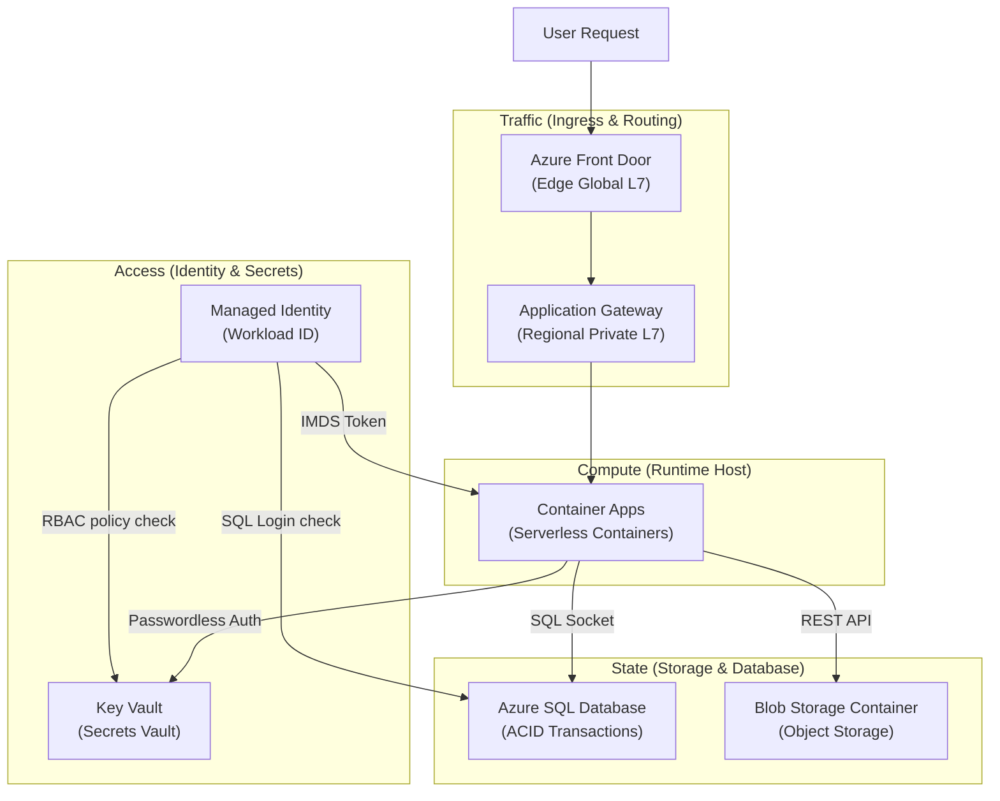

## Table of Contents

1. [The Job-Based Service Map](#the-job-based-service-map)
2. [Traffic: Managing Public Entry](#traffic-managing-public-entry)
3. [Compute: Where the Code Runs](#compute-where-the-code-runs)
4. [State: Relational Databases and Object Storage](#state-relational-databases-and-object-storage)
5. [Access: Workload Identities and Secret Vaults](#access-workload-identities-and-secret-vaults)
6. [The CLI Scope: Querying Container App Ingress and Revisions](#the-cli-scope-querying-container-app-ingress-and-revisions)
7. [Under-the-Hood: Inside the Container Apps Serverless Fabric](#under-the-hood-inside-the-container-apps-serverless-fabric)
8. [Operational Diagnostics: Mapping Symptoms to Service Families](#operational-diagnostics-mapping-symptoms-to-service-families)
9. [Putting It All Together](#putting-it-all-together)
10. [What's Next](#whats-next)

## The Job-Based Service Map

The Azure service catalog is easiest to read as a job-to-service index. Each service family owns a specific runtime responsibility: entry, execution, state, access, evidence, or release.


*Start from the application job, then choose the Azure service family that owns traffic, compute, state, access, telemetry, or release behavior.*


The sheer number of services in the Azure catalog can feel overwhelming. But if you group these services by the specific operational jobs they perform for your application, the catalog suddenly transforms into a clean, easy-to-read map:

*   **Public Traffic Entry (Ingress & Routing)**: How does a customer's browser request safely reach your running code?
*   **Compute Execution (Runtime Host)**: Where does your code physically execute, and what triggers it?
*   **Persistent State (Storage & Databases)**: Where do your transactions, file assets, and user sessions live so they survive system restarts?
*   **Access Control (Identity & Secrets)**: How do your services prove who they are and securely read passwords?
*   **Operational Evidence (Observability)**: Where do your logs, metrics, and alerts go so you can see what is happening under the hood?
*   **Repeatable Release (Deployment Operations)**: How do your container images and templates safely transition from Git into active production?

By standardizing on this map, you prevent your team from getting lost in product menus. When a problem occurs, you immediately identify which family owns the job, locate the correct CLI commands, and query the specific resource properties.

This job-centric mapping is the best antidote to cloud catalog fatigue. As a developer, your primary concern is not memorizing trademarked marketing names; it is understanding the flow of bytes through your system. By categorizing services by their runtime responsibilities, you can immediately narrow down where a bug lives. If a user cannot resolve your domain name, you check DNS; if their container crashes during an active query, you check Compute; if their session data is lost, you check State.



## Traffic: Managing Public Entry

Traffic services answer a fundamental routing question: How does a customer's browser request safely navigate the internet and reach your running code?

When an application starts small, you can connect your compute containers directly to the public internet using their built-in HTTPS ingress endpoints. But as traffic grows and security requirements become stricter, exposing application servers directly through public endpoints is an operational risk. You need dedicated routing layers to terminate TLS, apply edge filtering, preserve source context, and forward only valid traffic to backend services.

In the Azure ecosystem, public ingress is managed by four specialized routing layers:

*   **Azure DNS**: This is the translation layer. It maps human-friendly custom domain names (like `api.devpolaris.com`) to the raw IP addresses or default domain names of your Azure resources.
*   **Azure Front Door**: A global edge routing service deployed across Microsoft edge points of presence (PoPs) worldwide. Front Door routes HTTP and HTTPS traffic at the edge, can apply Web Application Firewall (WAF) filtering, terminates TLS close to users, and load-balances requests across global origins.
*   **Application Gateway**: A regional Layer 7 load balancer that lives inside your virtual network. It handles regional TLS termination, path-based routing rules (for example, sending `/api/*` to your backend containers and `/static/*` to object storage), Web Application Firewall policies, and private backend integration.
*   **API Management (APIM)**: An API gateway that serves as an administrative proxy. It sits in front of your microservices, enforcing rate limits, usage quotas, token validation policies, versioning, subscriptions, and transformations. APIM can use caching policies and external cache integrations, but token validation should be explained through APIM policy configuration rather than an assumed Redis authentication layer.

Using these entry points establishes a clean ingress layer. By routing all external requests through Front Door or App Gateway, you ensure that malicious scripts and brute-force attempts are filtered before they reach internal compute resources.

## Compute: Where the Code Runs

Compute resources are the Azure services that actually run your code. They provide CPU, memory, startup behavior, scaling behavior, and the runtime boundary around your process.

Example: the same Orders system might run a legacy inventory daemon on a VM, the public API in Container Apps, and receipt email work in Azure Functions.

Azure splits compute into distinct models based on how much infrastructure each service hides from you. Each step hides more of the underlying hardware, operating system, and orchestration complexity, allowing your team to focus more tightly on code:

### 1. Virtual Machines (The Infrastructure Tier)
Virtual Machines are the compute option where your team controls the guest operating system. You lease a slice of a physical hypervisor, granting you complete root access to the operating system, file system, and kernel parameters. However, this means your team is responsible for managing operating system patches, system upgrades, security firewalls, and disk backups.

### 2. App Service (The Managed Hosting Tier)
App Service is the managed web host for long-running HTTP apps and APIs. Azure hides the operating system and handles kernel patching, OS updates, and physical hardware scaling. However, you are still responsible for configuring the web server engine (like Nginx, IIS, or Node.js) and managing the application pool boundaries.

### 3. Azure Container Apps (The Managed Container Tier)
Azure Container Apps is the managed runtime for Docker images when you do not want to operate Kubernetes directly. It hides both the OS and the web server engine, as well as the container orchestrator. You do not manage Kubernetes nodes, API servers, or pod network interfaces. You simply supply a pre-built Docker container image, and Azure handles container scheduling, ingress proxying, TLS termination, and autoscaling.

### 4. Azure Functions (The Serverless FaaS Tier)
Azure Functions is the event-handler runtime for small units of code that wake up when a trigger fires. You supply code functions connected to specific events, such as an incoming HTTP query, a new row in a database, or a message in a queue. Scale and idle billing behavior depends on the hosting plan. Consumption-style plans can scale to zero for event-driven workloads, while Premium, Dedicated, and other plans keep different amounts of capacity available for performance, networking, or predictability.

For our transactional orders API, Azure Container Apps (ACA) provides the ideal balance of managed serverless scaling and simple container orchestration.

:::expand[Why the Four-Tier Abstraction Ladder Exists]{kind="design"}
Azure did not build Virtual Machines, App Service, Container Apps, and Functions as competing alternatives. Instead, each tier represents a step on an **abstraction ladder** designed to systematically remove operational surface area that the tier below it forced your team to manage.

This directly mirrors the AWS abstraction ladder:
*   **Virtual Machines** correspond to **Amazon EC2** (raw infrastructure).
*   **App Service** matches **AWS Elastic Beanstalk** (managed platform).
*   **Container Apps** aligns with **AWS Fargate** (serverless containers).
*   **Functions** equates to **AWS Lambda** (serverless FaaS).

As you climb this ladder, you trade low-level infrastructure control for increased speed of delivery and lower operational overhead:

| Abstraction Tier | Team Ownership Surface | Cold-Start Behavior | Ingress & Scale Control |
| :--- | :--- | :--- | :--- |
| **Virtual Machines (IaaS)** | OS updates, kernel patches, disk provisioning, and web servers. | **Zero cold start** (always warm) | Custom load balancers and scale sets. |
| **App Service (PaaS)** | Runtime version choices, minor updates, and scale-unit sizing. | **Zero cold start** (unless configured to sleep) | Built-in slots and platform scale rules. |
| **Container Apps (CaaS)** | Container base images, library dependencies, and ingress ports. | **Seconds or more** (if scaled to zero, depending on image and startup path) | Managed ingress, revisions, and event-driven scale rules. |
| **Functions (FaaS)** | Pure application code and input/output trigger bindings. | **Milliseconds to seconds** (highly dependent on runtime) | Event-driven triggers only (HTTP, queue, timer). |

**Rule of thumb:** Choose the highest rung of the abstraction ladder that your workload's execution model and technical constraints allow. Climbing the ladder trades granular host control for operational simplicity, but moving down should be treated as a last resort reserved for specialized compliance needs or custom operating system kernel extensions.
:::

## State: Relational Databases and Object Storage

State services guarantee that your application data survives deployment updates, server crashes, and regional power outages. You select state services by matching their engine to the specific structure and query patterns of your data:

*   **Azure SQL Database**: A fully managed relational database engine based on Microsoft SQL Server. It is the ideal home for structured transactional records (like order ledgers and billing accounts) because it guarantees strict ACID (Atomicity, Consistency, Isolation, Durability) properties, complex schema validation, and automated point-in-time recovery backups. It utilizes write-ahead transaction logging to ensure that no committed record is lost during a hypervisor failover.
*   **Azure Cosmos DB**: A globally distributed NoSQL database designed for planet-scale write performance and sub-10ms response times. It supports multiple API shapes (like JSON documents or key-value tables) and asynchronously replicates data across global regions automatically. It measures capacity in Request Units (RUs) and allows you to tune consistency levels along a spectrum from Strong (immediate replication check) to Eventual (asynchronous caching), balancing latency against data correctness.
*   **Azure Blob Storage**: The object storage service (Azure's equivalent of Amazon S3). It stores unstructured data files - such as PDF invoices, user profile photos, or raw CSV logs - in highly durable storage blocks. It organizes data into distinct lifecycle tiers (Hot for active reads, Cool for infrequent access, and Archive for backups) and automatically migrates old blocks to cheaper media based on lifecycle rules you define, optimizing storage costs.

Establishing a clear division between these engines is a vital operational habit. You should never store large image files inside a relational SQL database, and you should never attempt to coordinate strict, multi-row financial transactions inside a document store. Choose the database family that fits the data's job.

## Access: Workload Identities and Secret Vaults

Access services decide how running code proves who it is and reads sensitive values without storing passwords in the image. They exist because compute often needs databases, storage, and APIs, but long-lived secrets in Git or container layers are hard to rotate and easy to leak.

Example: `ca-orders-api-prod` can use a managed identity to request a short-lived token, then use that token to read `sql-orders-password` from Key Vault.

To keep private passwords and keys out of your Git repositories and Docker image layers, you enforce a strict access loop:

Container App (Managed Identity) -> local identity endpoint -> Key Vault API -> role assignment check -> secret value.

Under the hood, this passwordless access loop relies on Microsoft Entra ID and a platform-managed local identity endpoint:

1.  **The Token Request**: When your container app needs to connect to Key Vault, the Azure SDK asks the Container Apps managed identity endpoint for a token for `https://vault.azure.net`.
2.  **Platform Verification**: Container Apps exposes that endpoint only inside the running app environment and protects the request with platform-provided headers.
3.  **Token Generation**: Microsoft Entra ID issues a short-lived access token for the managed identity.
4.  **Vault Verification**: The container app passes this access token in the `Authorization: Bearer eyJ...` header of its REST API query to your Azure Key Vault resource.
5.  **Role Assignment Check**: Key Vault validates the token, identifies the workload identity, and checks its own Role-Based Access Control (RBAC) rules. If the identity holds a data-plane role such as `Key Vault Secrets User`, Key Vault returns the secret value to the container in the JSON response body.

This passwordless handshake is infinitely safer than storing database connection strings or API keys in configuration files or container images. Even if an attacker somehow gains read access to your Git repository, there are no passwords to steal, because credentials only exist as ephemeral, cryptographically signed memory tokens generated at runtime. It completely resolves "the first secret problem" of bootstrap security.

## The CLI Scope: Querying Container App Ingress and Revisions

To audit your compute boundaries and verify ingress health directly from the terminal, you use the Azure CLI to inspect your container application's active configuration profiles.

Let us execute a terminal session to query our production orders container app properties:

```bash
$ az containerapp show \
    --name "app-orders-prod" \
    --resource-group "rg-orders-prod-uksouth"
```

This terminal command instructs the ARM engine to return the runtime, network ingress, and active deployment parameters:

```json
{
  "id": "/subscriptions/88888888-4444-4444-4444-121212121212/resourceGroups/rg-orders-prod-uksouth/providers/Microsoft.App/containerApps/app-orders-prod",
  "location": "uksouth",
  "name": "app-orders-prod",
  "properties": {
    "configuration": {
      "activeRevisionsMode": "Single",
      "ingress": {
        "external": true,
        "fqdn": "app-orders-prod.uksouth.azurecontainerapps.io",
        "targetPort": 8080,
        "traffic": [
          {
            "latestRevision": true,
            "weight": 100
          }
        ],
        "transport": "auto"
      }
    },
    "provisioningState": "Succeeded",
    "template": {
      "containers": [
        {
          "image": "crproddevpolaris.azurecr.io/orders-api:v2.1.0",
          "name": "orders-container",
          "resources": {
            "cpu": 0.5,
            "memory": "1.0Gi"
          }
        }
      ]
    }
  },
  "resourceGroup": "rg-orders-prod-uksouth"
}
```

Every returned parameter provides critical runtime evidence:
*   `fqdn`: The Fully Qualified Domain Name automatically generated by the container ingress. This is the endpoint WAF proxies or DNS records target.
*   `targetPort`: The network port (`8080`) that the ingress proxy expects your container process to listen on. If your application code is configured to listen on a different port (such as 3000), the ingress proxy will suffer continuous health check timeouts, returning 504 Gateway errors to users.
*   `image`: The exact container registry path and version tag (`v2.1.0`) running.
*   `cpu` & `memory`: The precise compute limits allocated to the task container.

## Under-the-Hood: Inside the Container Apps Serverless Fabric

The Container Apps serverless fabric is the managed runtime path between the REST resource you configure and the replicas that run your image. It exists so you can describe an app, ingress, revisions, and scale rules without operating Kubernetes nodes yourself.


*Container Apps looks simple from the app surface, but ingress, revisions, Envoy, KEDA, and managed Kubernetes still shape runtime behavior.*


Example: when you update `app-orders-prod` from image `v2.1.0` to `v2.2.0`, Container Apps creates a new revision, routes traffic through Envoy, and uses KEDA to adjust replica count from the configured scale rules.

To design a robust compute architecture, you must understand the orchestration layers that Azure manages beneath the surface. When you deploy a container app to Azure Container Apps (ACA), the platform does not run your container directly on a bare metal host. Instead, ACA abstracts a Kubernetes orchestration framework behind a simple, serverless REST API:

```plain
Container App REST API -> Managed Environment -> Ingress (Envoy) -> Scaling (KEDA) -> Replicas (Pods)
```

By abstracting these components, Azure provides a clean runtime fabric driven by three under-the-hood systems:

### 1. Managed Ingress with Envoy Proxy Sidecars

Envoy is the managed HTTP proxy that receives traffic before it reaches your container. It handles routing, TLS behavior, revision weights, and health-based forwarding.

Example: Envoy can route 95 percent of traffic to revision `v1` and 5 percent to revision `v2`, then forward only healthy requests to the container target port `8080`.

When ingress is enabled, Container Apps provisions a public or internal endpoint. Under the hood, this ingress routing is managed by Envoy deployed immediately adjacent to your container task.

When a user's HTTP request arrives:
1.  Envoy terminates the external TLS session, decrypts the packet, and inspects the HTTP headers.
2.  It compares the incoming request parameters against the active revision traffic weights.
3.  It opens a local TCP connection and forwards the raw HTTP traffic directly to your application's designated `targetPort` (such as `8080`).

If your application process is configured to bind to a different port (such as `3000`), or if it takes longer than the platform's default health check timeout to bind to that port, the Envoy proxy will suffer connection timeouts. Instead of routing traffic, it will instantly return `502 Bad Gateway` or `503 Service Unavailable` REST errors to the client, even though the ARM control plane reports that the resource provisioning succeeded.

### 2. Event-Driven Auto-Scaling with KEDA

KEDA is the scale controller that turns demand signals into replica counts. It is useful when work arrives as queue depth, HTTP concurrency, or another external signal instead of showing up as CPU usage first.

Example: if a Service Bus queue for invoices reaches `500` messages, KEDA can ask the platform to start more invoice worker replicas before existing workers are CPU-bound.

Scaling in Container Apps is managed by the Kubernetes Event-driven Autoscaling (KEDA) engine. KEDA operates as a high-frequency polling loop that continuously queries configured scale rule sources:

*   **HTTP Concurrency**: Envoy tracks active concurrent requests and reports them to KEDA.
*   **Message Queues**: KEDA polls the queue metadata (such as Azure Queue Storage or Service Bus) to check active message depths.
*   **Hardware Limits**: The host hypervisor monitors VM-level CPU and memory percentages.

When the observed metrics cross your defined scale threshold, KEDA signals the orchestrator to scale up the replica count. If the scale minimum is set to `0`, KEDA will scale the app down to zero active replicas when no traffic or queue messages are detected, completely eliminating compute costs during idle periods.

However, scaling to zero introduces the **"Cold-Start Hazard"**. When a new HTTP request hits an idle, zero-replica app, the Envoy ingress proxy is forced to hold the request thread in memory while KEDA spins up a brand-new container instance. The startup process (pulling the Docker image, provisioning the network card, launching the application process, and passing readiness probes) can add 2 to 10 seconds of latency to that first request. For customer-facing APIs where response speed is critical, you should maintain a minimum replica count of `1` to bypass the cold-start delay.

### 3. Progressive Rollouts with Immutable Revisions

A revision is the read-only version record for one Container Apps template. It lets the platform run old and new versions side by side while routing traffic by percentage.

Example: revision `orders-api--v21` can receive 95 percent of traffic while `orders-api--v22` receives 5 percent during a canary release.

Each modification to your container configuration (such as changing an environment variable, updating the image tag, or modifying resource CPU allocations) creates an immutable revision.

Container Apps supports two active revision modes:
*   **Single-Revision Mode**: The platform automatically terminates the previous revision and routes 100% of incoming traffic to the newest active revision, achieving rapid, zero-downtime upgrades.
*   **Multiple-Revision Mode**: Multiple historical revisions run concurrently. The Envoy ingress layer splits traffic between these revisions based on percentage weights you define (e.g., routing 95% of traffic to the stable `v1` revision and 5% to the new `v2` canary revision). This enables progressive Canary rollouts and rapid, single-command rollbacks without redeploying code.

### 4. Zero-Trust Service Mesh with Dapr Sidecars

Dapr is an optional helper process that runs beside your application container. It provides service calls, pub/sub, state access, and mutual TLS behavior through a local sidecar so every service does not have to implement the same plumbing.

Example: `orders-api` can call `http://localhost:3500/v1.0/invoke/inventory/method/reserve` and let Dapr resolve the `inventory` service and secure the hop between containers.

For advanced microservice architectures, Container Apps can inject a Distributed Application Runtime (Dapr) sidecar container next to your workload. Dapr acts as an operational sidecar, intercepting all inter-service egress and ingress traffic.

Dapr encapsulates all communications behind mutually authenticated TLS (mTLS) certificates rotated automatically by the platform, providing cryptographically secure, zero-trust network channels between your containers without your application code managing certificates, routing paths, or service-to-service discovery APIs.

## Operational Diagnostics: Mapping Symptoms to Service Families

Operational diagnostics means mapping a symptom to the service family that can actually explain it. This prevents teams from changing the wrong layer during an outage.

Example: HTTP `502` from the public endpoint should start with ingress, target ports, probes, and backend health before the team scales the SQL database.

To keep your team from wasting time during outages, map system symptoms directly to the correct service family to inspect:

| Incident Symptom | Primary Outage Job | Azure Service Family to Inspect |
| :--- | :--- | :--- |
| **HTTP 502 / 504 Errors** | Ingress cannot reach or validate container tasks. | **Traffic Ingress / Compute**: Inspect target port configurations, health probe paths, and task container resource limits. |
| **Database Connection Timeouts** | Compute tasks are saturating database sockets. | **State Database**: Audit active connections, database lock tables, index definitions, and connection pool scopes. |
| **Application Startup Crashes** | Container process fails to read decryption credentials. | **Access Control**: Verify Managed Identity role assignments, Key Vault network firewalls, and KMS decrypt scopes. |
| **Storage Egress Failures** | Workers cannot write exported files. | **State Storage**: Inspect Blob Storage container access policies and SAS token expiration times. |
| **Blank Telemetry / Missing Traces** | App logs are not streaming to workspaces. | **Observability**: Verify Application Insights connection strings and Log Analytics workspace ingestion configurations. |

By standardizing on this diagnostic matrix, you ensure that every troubleshooting run starts with empirical evidence, isolating the true failure coordinate immediately.

## Putting It All Together

Operating a resilient cloud system requires connecting application symptoms to exact service blocks across your global service map:

*   **Triage by App Job**: Start every diagnostic run by mapping the symptom to the correct service family; never scale capacity blindly without evidence.
*   **Secure the Access Loop**: Leverage Managed Identities with Key Vault access and RBAC assignments to decouple credentials from container images, eliminating hardcoded passwords.
*   **Map Target Ingress Ports**: Align your container app's `targetPort` configurations with your container code's internal network binding port to prevent bad gateway and gateway timeout errors.
*   **Acknowledge the Managed Runtime**: Recognize that Azure Container Apps gives you managed environments, revisions, Envoy ingress, and KEDA scale rules so your team can run containers without operating the orchestration layer directly.
*   **Isolate Database Latency**: Look past database CPU metrics during connection drops, inspecting I/O bottlenecks, active connection limits, and query index definitions first.
*   **Centralize Log Aggregation**: Configure diagnostic settings on all critical control-plane and data-plane resources to stream telemetry automatically to a single Log Analytics workspace for unified cross-service auditing.

Understanding this service map ensures that you can locate any resource and debug any platform failure systematically.

## What's Next

We have established the core Azure mental model, directory boundaries, physical regions, resource identities, and the global service map. Now we are ready to explore security access controls in deep operational detail.

In the next chapter, we will study **Role-Based Access Control (RBAC)**. We will dissect the three-part RBAC equation, write custom role definitions using JSON action blocks, and learn how to manage access control at scale using group-level assignments rather than static user bindings.

By standardizing access rules at this level, we protect our cloud resources from security leaks while maintaining flexible team boundaries.


*Use this as the core services checklist: every production app needs an entry path, runtime, durable state, identity, evidence, and release path.*

---

**References**

* [Azure Container Apps overview](https://learn.microsoft.com/en-us/azure/container-apps/overview) - Core managed container app concepts such as environments, revisions, ingress, and scale.
* [Set scaling rules in Azure Container Apps](https://learn.microsoft.com/en-us/azure/container-apps/scale-app) - Official guide to Container Apps scaling behavior and KEDA metric polling.
* [Managed Identities in Microsoft Entra](https://learn.microsoft.com/en-us/entra/identity/managed-identities-azure-resources/overview) - Workflow security guidelines for workload identity access loops.
* [Azure SQL Database overview](https://learn.microsoft.com/en-us/azure/azure-sql/database/sql-database-paas-overview) - Transaction logs, regional reliability, and database resource choices.
