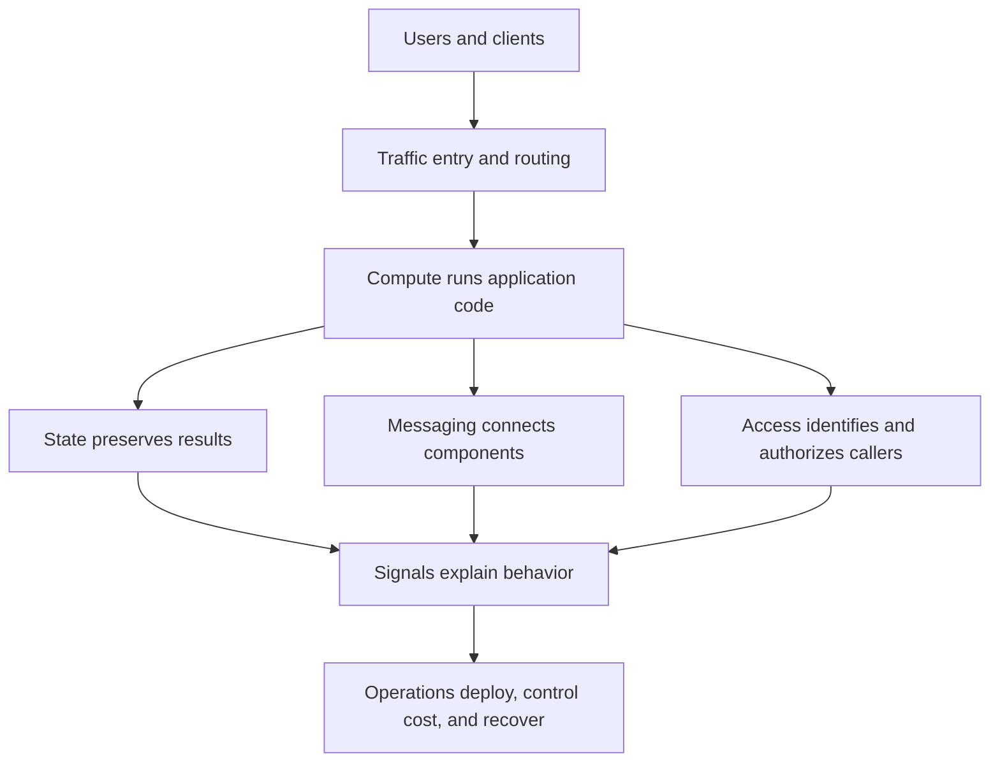
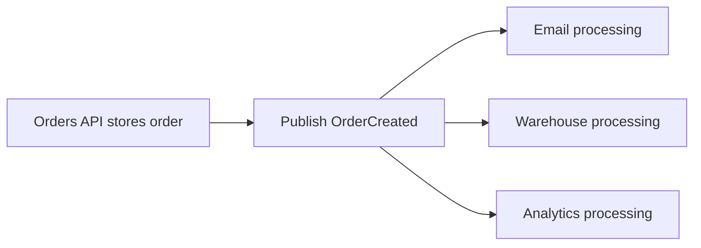
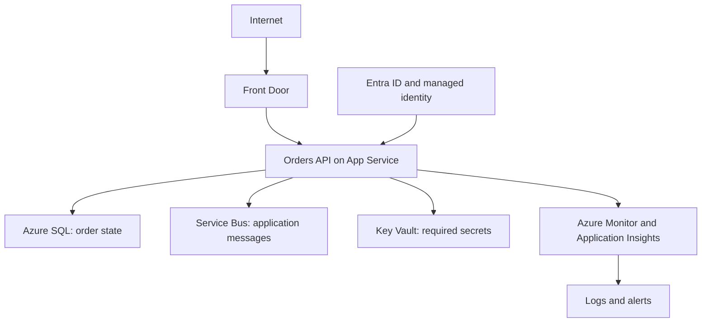

## Table of Contents

1. [Why Should You Learn Azure Services by Job?](#why-should-you-learn-azure-services-by-job)
2. [How Does Traffic Enter an Azure Application?](#how-does-traffic-enter-an-azure-application)
3. [Where Can Azure Run Application Code?](#where-can-azure-run-application-code)
4. [Where Do Data and Deferred Work Live?](#where-do-data-and-deferred-work-live)
5. [How Do Identity, Permissions, and Secrets Protect the System?](#how-do-identity-permissions-and-secrets-protect-the-system)
6. [Which Signals Explain Runtime Behavior?](#which-signals-explain-runtime-behavior)
7. [How Do Deployment, Cost, and Recovery Shape Operations?](#how-do-deployment-cost-and-recovery-shape-operations)
8. [How Do You Debug With the Service Map?](#how-do-you-debug-with-the-service-map)
9. [Check Your Answers](#check-your-answers)
10. [References](#references)

An online shop can start with a browser, an application process, and a local database. Moving it into production raises questions that this simple arrangement has not answered. How will customers reach the application? Where will their orders survive if the process crashes? What happens when payment processing is slow, and how will anyone find the cause?

Those questions give Azure's services a purpose. You do not need to begin by memorizing every product. Start with the work the application must perform and the failures it must handle, then choose services that meet those requirements.

We will follow the shop's Orders API and the operational work around it through eight questions:

1. **Why Should You Learn Azure Services by Job?**
2. **How Does Traffic Enter an Azure Application?**
3. **Where Can Azure Run Application Code?**
4. **Where Do Data and Deferred Work Live?**
5. **How Do Identity, Permissions, and Secrets Protect the System?**
6. **Which Signals Explain Runtime Behavior?**
7. **How Do Deployment, Cost, and Recovery Shape Operations?**
8. **How Do You Debug With the Service Map?**

## Why Should You Learn Azure Services by Job?
<!-- section-summary: Derive the production jobs first—traffic, compute, state, messaging, access, signals, and operations—then select services that satisfy those requirements. -->

A production application must receive traffic, execute code, preserve state, communicate between components, identify callers, control access, produce operational signals, deploy safely, account for cost, and recover from failure. Azure offers specialized capabilities for these recurring jobs. The [Azure Architecture Center](https://learn.microsoft.com/en-us/azure/architecture/guide/) likewise starts with workload requirements before technology choices.

For an online shop, the API exposes operations such as these:

```http
POST /orders
GET /orders/123
PUT /orders/123/cancel
```

The API validates the customer, creates an order, charges payment, stores the order, and emits an `OrderCreated` event. On a laptop, a Python, Java, or .NET process talking to a local database may demonstrate that behavior. Production asks the same application to keep working under circumstances the laptop example does not address.

For example, internet traffic must find the service even when more than one instance exists. Ten application instances must share durable order information. The API must authenticate to the database without scattering passwords through configuration. Payment processing may be temporarily unavailable. Someone needs to explain why order 123 took eight seconds, release version 2, handle a zone failure, and account for the bill.

These are the reasons behind the service categories. Each category should answer an actual requirement rather than appear merely because its icon is available.


```mermaid
flowchart TD
  U[Users and clients] --> T[Traffic entry and routing]
  T --> C[Compute runs application code]
  C --> S[State preserves results]
  C --> M[Messaging connects components]
  C --> A[Access identifies and authorizes callers]
  S --> O[Signals explain behavior]
  M --> O
  A --> O
  O --> P[Operations deploy, control cost, and recover]
  class U,T,C,S,M,A,O,P neutral
```

The diagram groups responsibilities; it does not prescribe that every request must traverse every box in sequence. Some capabilities handle requests directly, while others observe or manage the system. We will make that distinction explicit after examining the individual jobs.

The useful question for any service is, “What job does this perform for this application?” Answering it also makes omissions visible. An architecture can have compute and a database yet still lack a plan for delayed downstream work, investigation, or restoring lost data. A service map helps review those missing responsibilities before an incident exposes them.

## How Does Traffic Enter an Azure Application?
<!-- section-summary: Match ingress to its scope and purpose: global HTTP entry, regional HTTP routing, network-level balancing, or API governance. -->

When a customer requests `https://api.example.com/orders`, that public request must cross from the internet into the Azure workload. **Ingress** means this incoming traffic path. Azure offers several entry and routing services because sending traffic to an application involves different kinds of decisions.

### Global HTTP entry with Front Door

Suppose the Orders API runs in UK South, West Europe, and East US. A customer could connect directly to one deployment, but the architecture would still need to decide which region to use, how to respond when that region fails, where to terminate TLS, how to protect the public HTTP endpoints, and whether static content can be delivered nearer users.

**Azure Front Door** provides a globally distributed HTTP entry point in front of application origins. An origin is the backend destination that serves the application or content. Customers in London, New York, and Tokyo can enter through Microsoft's global edge infrastructure, which routes HTTP(S) traffic toward the appropriate origin. The [API gateway architecture guidance](https://learn.microsoft.com/en-us/azure/architecture/microservices/design/gateway) places Front Door in this global entry role.

TLS termination is where the receiving component handles the encrypted HTTPS connection. Thinking about that job alongside regional routing explains why a public entry layer may need more capabilities than an IP address alone. The design question is whether this application needs a global public front door, not whether every web application should purchase every Azure networking service.

### Regional HTTP routing with Application Gateway

Inside one region, the application may need HTTP-aware decisions. Requests under `/orders/*` go to the Orders service, `/catalog/*` to Catalog, and `/images/*` to an image-serving pool. Choosing among those destinations requires examining HTTP information rather than only a destination IP and port.

**Application Gateway** is a regional HTTP reverse proxy and load balancer. A reverse proxy receives a client's request and forwards it to an appropriate backend. It operates at layer 7, the application-protocol layer, so hostnames and URL paths can inform routing. It can also provide Web Application Firewall functionality. A WAF applies protection rules to web traffic. [The Application Gateway overview](https://learn.microsoft.com/en-us/azure/application-gateway/overview) explains these capabilities.

The service's regional scope and HTTP awareness are the important distinctions here. Front Door addresses global public entry; Application Gateway addresses HTTP routing within a regional architecture. They can participate in the same design when both jobs are required.

### Network-level distribution with Load Balancer

Another workload may simply need traffic arriving at `10.1.2.4:443` distributed across VM1, VM2, and VM3. It does not need a routing decision based on `/orders`, `/images`, or `Host: api.example.com`.

**Azure Load Balancer** serves this lower-level, network-distribution role. It operates below the HTTP-aware layer used by Application Gateway. Distinguishing the traffic layer avoids treating the two services as interchangeable names for a similar-looking diagram box.

| Service | Main traffic job in this map |
|---|---|
| Front Door | Global HTTP entry and routing |
| Application Gateway | Regional HTTP-aware routing and optional WAF |
| Load Balancer | Regional network-level distribution |

There is overlap in some architectures, but these products address different combinations of scope, protocol layer, and routing requirements. [Microsoft's load-balancing comparison](https://learn.microsoft.com/en-us/azure/architecture/guide/technology-choices/load-balancing-overview) uses those distinctions to guide selection.

### API rules with API Management

Now suppose mobile apps, the website, partners, and internal systems all consume the Orders API. Partner A is allowed 1,000 requests per minute, while Partner B is allowed 100. Requests must carry a JWT token. An older path needs rewriting, API documentation must be published, usage must be measured, and versions v1 and v2 must coexist.

These are **API governance** requirements: the rules and arrangements under which clients use an API. A JWT is a token format used to carry claims about a caller or request. Requiring and evaluating such a token is an access rule, while distributing packets across machines is a different job.

**Azure API Management** provides a managed platform for publishing and managing APIs. It can apply authentication, rate limiting, restrictions, transformations, and other API policies before routing to the backend. Application Gateway asks where an HTTP request should go; API Management adds the rules under which the API request may proceed. Both roles are described in the [API gateway guidance](https://learn.microsoft.com/en-us/azure/architecture/microservices/design/gateway).

### Add entry layers only when they have work to do

A possible stack is Front Door for global routing and edge security, then Application Gateway for regional ingress and WAF, then API Management for API authentication, policy, and quotas, followed by the Orders API. That is a possible allocation of responsibilities, not a required deployment recipe.

Every layer adds capability alongside cost, latency, configuration, failure modes, and operational burden. A team should be able to explain which requirement each layer satisfies. Where a simpler arrangement meets the requirements, additional layers do not improve the design merely by increasing the number of products involved.

Once the request reaches the application, another service must supply the CPU, memory, operating system, and runtime that execute its code.

## Where Can Azure Run Application Code?
<!-- section-summary: Compute choices trade machine-level control against platform responsibility; choose by operating-system, container, Kubernetes, event, scaling, and team requirements. -->

**Compute** is the capacity and execution environment that run application code. A function such as `create_order(...)` ultimately executes using CPU and memory within an operating system and runtime. Azure's compute services offer different divisions of responsibility between the team and the platform.

The range includes infrastructure as a service, managed application platforms, containers, and serverless execution. These categories describe how much of the underlying environment the team chooses and operates. [Azure's compute design guidance](https://learn.microsoft.com/en-us/azure/architecture/solution-ideas/articles/compute-get-started) presents the choices along this spectrum.

### Virtual Machines for guest-machine control

**Azure Virtual Machines** provide substantial control over the guest machine. Azure operates the physical infrastructure and virtualization layer, while the guest environment contains the operating system, runtime, application, and its configuration.

That control can be necessary for legacy applications, custom operating-system requirements, special agents, specific software dependencies, and lift-and-shift workloads. Lift-and-shift means moving an existing workload while retaining much of its existing machine-oriented arrangement. The reason to choose VMs is the control the workload needs, together with the team's ability to manage the resulting responsibilities.

The tradeoff is direct: more control over the guest means more responsibility for the guest. A VM-hosted application involves networking, the machine, operating-system patching, runtime, web server, and application work. A service map should account for those jobs even if the architecture diagram uses just one VM icon.

### App Service for a managed web platform

If the Orders API is a .NET API, Node application, Java app, or Python web service and does not require control over an individual machine, **App Service** provides a higher-level hosting platform. The team supplies application code while Azure manages much of the hosting environment.

Compared with a VM, the team gives up some machine-level control and takes on less infrastructure responsibility. That is the recurring managed-service tradeoff: choosing an abstraction that handles lower-level work can reduce operational burden when it meets the application's requirements. [Azure's design principles](https://learn.microsoft.com/en-us/azure/architecture/guide/design-principles/) encourage managed services where their capabilities fit.

App Service bundles hosting, runtime-platform support, scaling features, deployment features, and monitoring integrations. A smaller number of boxes in an architecture diagram may therefore represent more platform-managed responsibilities rather than a less complete design.

### Container Apps for managed container execution

The API may instead arrive as a container image, such as `orders-api:v42`. An image packages the application and its runtime contents for deployment. The team may need container deployment, autoscaling, revisions, HTTP ingress, jobs, and scale-to-zero behavior where appropriate, without taking on Kubernetes operation.

**Azure Container Apps** provides a managed container platform for that set of requirements. It handles much of the orchestration while exposing application-level features such as networking, revisions, ingress, jobs, and scaling. A revision represents a deployable application configuration/version within that platform model. [The Container Apps overview](https://learn.microsoft.com/en-gb/azure/container-apps/overview) describes these capabilities.

This choice accounts for several jobs together: container compute, incoming traffic, scaling, revision management, and observability integration. The point is not that those jobs disappeared. The platform supplies them through a higher-level interface.

### AKS for Kubernetes requirements

**Azure Kubernetes Service**, or AKS, is relevant when the organization needs Kubernetes APIs and its ecosystem: Pods, Deployments, Services, Helm, operators, and custom controllers. These are Kubernetes ways to describe workloads, package applications, and automate platform behavior.

The containers run through Kubernetes abstractions on AKS and Azure infrastructure. Kubernetes introduces substantial operational complexity, so using containers alone is not enough reason to select it. The decision should identify which Kubernetes capabilities the organization needs and whether those benefits justify operating that platform.

This keeps the comparison with Container Apps useful. Both can run containers, but the required interface and operating responsibility differ. Choose based on the orchestration requirements, rather than treating a container image as an automatic commitment to Kubernetes.

### Functions for event-triggered code

Some work is naturally expressed as code that runs when something happens: generating a receipt, resizing an image, processing a queue message, running on a timer, or responding to an HTTP request. **Azure Functions** provides an event-driven programming model for this kind of execution.

The developer describes code associated with a triggering event instead of primarily provisioning and operating an individual server. This is the meaning of **serverless** in this context. Servers still execute the code; the abstraction changes the developer's main unit of work and responsibility.

Functions workloads can also run on Container Apps, combining the Functions programming model with Container Apps features. [Microsoft's Functions-on-Container-Apps overview](https://learn.microsoft.com/en-us/azure/container-apps/functions-overview) describes that supported combination.

### Make the compute decision from requirements

VMs, App Service, Container Apps, AKS, and Functions may all be capable of running some form of the Orders API. No one product is universally the best answer. Ask whether the workload requires operating-system control, uses containers, specifically needs Kubernetes, or is request-driven or event-driven.

Also consider whether it should scale to zero, how predictable its load is, which networking features it requires, and how much platform complexity the team can operate. These questions connect a product decision to real constraints. Popularity alone cannot tell you who will manage the runtime or whether its operating model fits the application.

Whatever executes the code, order information must survive beyond the life of one process. That introduces durable state and, separately, communication with work that can happen later.

## Where Do Data and Deferred Work Live?
<!-- section-summary: Durable storage preserves results beyond compute failure; databases, objects, and caches serve different data needs, while messaging decouples work across time. -->

Suppose order 12345, with an amount of 49.99, exists only in the API process's RAM:

```json
{
  "orderId": 12345,
  "amount": 49.99
}
```

If the process crashes, the order disappears. **State** is the information the system must remember, and **durable state** must outlive that process. Compute executes work; storage and databases preserve the results. Keeping those roles separate allows a failed application instance to be replaced while persistent data remains available.

### Relational order data in Azure SQL Database

Orders have relationships. A customer has orders, each order contains order lines, and each line refers to a product. The system may need transactions, constraints, joins, relational queries, and strong consistency.

A transaction groups related data work into a controlled unit, while constraints enforce rules on stored data and joins combine related records for a query. Those requirements make a relational service such as **Azure SQL Database** appropriate to consider. The Orders API might use tables for Orders, OrderLines, Customers, and Payments. [Microsoft's combined relational and NoSQL example](https://learn.microsoft.com/en-us/azure/architecture/databases/idea/combine-relational-nosql) discusses order-management and financial-style requirements where relational integrity matters.

The reason for the choice is the data behavior required by the system. Merely knowing that SQL Database exists does not establish whether every other kind of application data belongs there.

### Flexible distributed data in Cosmos DB

A product catalogue can have a different shape. One product is a laptop with CPU and screen specifications, while another category has unrelated attributes:

```json
{
  "productId": "123",
  "category": "laptop",
  "specifications": {
    "cpu": "...",
    "screen": "..."
  }
}
```

A workload requiring flexible schemas, high volume, global distribution, and low-latency access may point toward **Azure Cosmos DB**. A schema describes the data's structure; flexibility matters when records need different attributes rather than one rigid shared shape.

SQL Database and Cosmos DB solve different data problems. The comparison is relational models, transactions, and queries versus distributed flexible application data and scale. It should not be reduced to SQL being old and Cosmos DB being modern. Microsoft's [polyglot persistence guidance](https://learn.microsoft.com/en-us/azure/architecture/databases/idea/combine-relational-nosql) illustrates using different stores for different needs.

### Objects and files in Storage

Invoices, photographs, and exports—`invoice.pdf`, `photo.jpg`, and `export.csv`—are file or object data. Storing large binary objects inside relational order tables is often unnecessary. The database can retain order metadata while Blob Storage holds the files.

For example, order 123 can record `customerId=456`, a total of £79, and an `invoiceBlob` reference to `invoices/123.pdf`. The database preserves the order's structured information and relationship to the invoice; object storage preserves the invoice content.

Storage accounts provide a home for storage capabilities including blobs, files, queues, and related data. At this foundation level, the selection principle is the important part: match the shape and access pattern of the data to the storage mechanism, instead of forcing all state into one database technology.

### Cached copies for performance

If every request asks for the price of product ABC, repeatedly querying the authoritative database may be unnecessarily slow or expensive. A **cache** stores quickly accessible copies so the API can check the cache first and consult the database when needed.

Azure Cache for Redis illustrates this performance-layer role: a cached value is not automatically the durable source of truth. The authoritative database and the cached copy have different responsibilities, even if both contain the same price for a time.

### Separate order creation from slower downstream work

Now consider a synchronous workflow that creates an order, charges payment, sends email, updates the warehouse, updates analytics, and only then responds to the customer. If email takes 20 seconds, the customer may wait those 20 seconds. If analytics fails, order creation may fail with it. These components are tightly coupled because one request waits for their work.

Messaging can separate that work across time. The Orders API stores the order and publishes `OrderCreated`; email, warehouse, and analytics components react independently. The customer request no longer necessarily depends synchronously on every downstream service completing its work.


```mermaid
flowchart LR
  A[Orders API stores order] --> E[Publish OrderCreated]
  E --> EM[Email processing]
  E --> W[Warehouse processing]
  E --> AN[Analytics processing]
  class A,E,EM,W,AN neutral
```

This is a communication decision, distinct from deciding where persistent order records live. A database remembers the order. Messaging coordinates information and work among components that can run at different times.

### Choose the communication pattern

**Azure Service Bus** fits reliable application messaging and queueing. A producer places a message in a durable queue, and a consumer processes it. If the consumer is temporarily unavailable, the message can wait until the consumer recovers. This is temporal decoupling: producer and consumer do not have to complete their work at the same moment.

Also distinguish a **command** from an **event**. “Process order 123” asks for particular work. “Order 123 was created” reports a fact that has already occurred. Both move information, but they express different relationships between sender and receiver.

Service Bus addresses application queues and messaging, **Event Grid** addresses event distribution and notification, and **Event Hubs** addresses high-throughput event and telemetry streams. Selecting among them starts with the communication pattern. Their shared ability to move information does not mean they are interchangeable services.

Compute now has databases, storage, and messaging services to call. Those calls need an access design so the application can prove its identity and receive only the permissions it requires.

## How Do Identity, Permissions, and Secrets Protect the System?
<!-- section-summary: Entra ID identifies callers, managed identity removes workload-managed credentials where supported, RBAC limits allowed actions, and Key Vault stores unavoidable sensitive material. -->

The Orders API may need Azure SQL, Storage, Key Vault, and Service Bus. A basic configuration could contain a database username and password, a storage key, and a Service Bus key:

```text
DB_USER=orders
DB_PASSWORD=something-secret
STORAGE_KEY=abcdef...
SERVICE_BUS_KEY=xyz...
```

These are illustrative placeholders, not recommended credentials. The arrangement raises a management problem: secrets can be copied, expire, leak, enter Git, appear in environment files, be shared between systems, or simply be forgotten. Adding more credentials multiplies the work of keeping access controlled.

It helps to separate three questions: who is making the request, what may that identity do, and which sensitive credentials still need storage. Identity, authorization, and secret management answer those questions respectively.

### Identify both people and software

**Microsoft Entra ID** is Azure's main identity platform. Human identities and groups might include Alice, Bob, and Platform-Team. Software callers include the Orders API, a deployment pipeline, and an automation job. Each needs an identity context so the receiving service can establish which caller is involved.

The question is the same for human and workload callers: who or what made this request? An application's identity is useful because its permissions should describe the application, rather than depending on a password copied from a person or shared with unrelated workloads.

### Use managed identity where supported

A **managed identity** gives a supported Azure workload an identity whose credentials Azure manages. The application can act as that identity, obtain a token through Microsoft Entra ID, and present it to an Azure service. A token supplies proof and claims used in the access process; it replaces the application's need to directly manage a reusable credential for that supported relationship.

This changes the first question from where to hide a database password to whether that password can be avoided for the supported connection. The application still needs an identity and permission; Azure manages the credential side of that identity. [The managed identity overview](https://learn.microsoft.com/en-us/entra/identity/managed-identities-azure-resources/overview) explains the model.

### Assign permission separately with RBAC

Identifying the caller as the Orders API does not determine what the API may do. **Authorization** evaluates the allowed action. Azure RBAC expresses a resource permission using a principal, role, and scope.

For example, combine the Orders API identity, `Storage Blob Data Reader`, and `invoice-storage`. The resulting access means the workload may read blobs within that storage scope. The identity is known, the role states the permitted operations, and the scope limits where they apply.

This is **least privilege**: grant the access needed for the workload's task instead of treating a trusted identity as permission to do everything. The [Azure RBAC guidance for Key Vault access](https://learn.microsoft.com/en-us/azure/key-vault/general/rbac-guide) provides another example of applying resource permissions separately from identification.

### Store unavoidable secrets in Key Vault

Managed identity cannot eliminate every sensitive value. Third-party API keys, certificates, encryption keys, legacy passwords, and external-service credentials may still be required. **Azure Key Vault** provides storage and controlled access for that material.

The Orders API can use its managed identity to access Key Vault and retrieve `payment-provider-api-key`. The workload authenticates without embedding an extra vault-access credential in its code, while the external payment provider's unavoidable key remains in the secret store. [Key Vault's basic concepts](https://learn.microsoft.com/en-us/azure/key-vault/general/basic-concepts) describe these roles and managed identity access.

The resulting division is straightforward: Entra ID identifies the caller; managed identity supplies an Azure-managed workload identity; RBAC defines allowed actions and scope; Key Vault holds the keys, secrets, and certificates that remain necessary. These capabilities cooperate, but none substitutes for all the others.

Even correctly configured access does not explain every failure. The running system must emit information that shows what it did and where a request failed or slowed down.

## Which Signals Explain Runtime Behavior?
<!-- section-summary: Metrics show quantities over time, logs record events, and traces follow requests across dependencies; monitoring connects these signals to alerts and responses. -->

When the API returns `500 Internal Server Error`, the response alone cannot explain the cause. **Telemetry** is the operational information emitted by the application and infrastructure. Three foundational forms—metrics, logs, and traces—answer different questions about behavior.

### Metrics show quantities and trends

**Metrics** are numeric measurements over time. Examples include 1,425 requests per second, CPU utilization of 72%, an error rate of 2.3%, P95 latency of 620 milliseconds, and queue depth of 12,491.

P95 is the 95th-percentile latency: it summarizes the point below which 95% of the observed request latencies fall. Queue depth measures how much work is waiting. These definitions matter because each number describes a different aspect of the system; a high request count and a growing queue do not answer the same question.

Metrics compress large amounts of activity into measurements that reveal abnormal behavior. An error-rate chart rising from around 2% toward 8%, for example, can reveal a change worth investigating without requiring a person to read every request record. The metric establishes the pattern; more detailed signals help explain it.

### Logs record what happened

**Logs** are discrete event records. They can hold error details, diagnostics, audit information, application events, and platform events. An order log can show a short sequence:

```console
14:03:21 CreateOrder order=123
14:03:21 Calling PaymentService
14:03:22 Payment declined code=51
14:03:22 Order rejected
```

The records connect a particular order to a payment attempt and a rejection. Where a metric reports that HTTP 500 responses increased, logs may identify an SQL connection timeout or another concrete cause. The detail complements the aggregate view rather than replacing it.

### Traces follow a request through dependencies

Requests can cross Front Door, the Orders API, a Payment API, a database, and Service Bus. **Distributed tracing** follows related work across those components so the team can understand where a request spent time.

For a six-second checkout, a trace named `OrderRequest-abc` records these timings:

| Trace component | Observed duration |
|---|---|
| Orders API request | 6.0 seconds |
| Database work | 100 milliseconds |
| Payment Service dependency | 5.6 seconds |
| Service Bus work | 50 milliseconds |

The broad complaint “checkout is slow” now has a specific lead: the payment dependency consumed 5.6 seconds. The table reports related observations; the overall request duration also includes work beyond the listed dependency timings. Tracing makes the cross-service relationship visible instead of leaving each service's records isolated.

### Collect and investigate through Azure Monitor

**Azure Monitor** is the broader observability platform bringing together logs, metrics, traces, events, alerts, and related telemetry. **Application Insights** focuses on application-performance monitoring and supports OpenTelemetry-based instrumentation. Instrumentation is the code or integration that emits the measurements and records used for observation. **Log Analytics** provides log and trace querying and analysis within this service map.

For the Orders API, requests, dependencies, exceptions, traces, and metrics contribute application evidence. Azure resources and infrastructure contribute their own operational information. [Azure Monitor's overview](https://learn.microsoft.com/en-us/azure/azure-monitor/fundamentals/overview) and the [Application Insights overview](https://learn.microsoft.com/en-us/azure/azure-monitor/app/app-insights-overview) describe these complementary roles.

### Turn collected data into a response

Enabling logs alone does not establish effective monitoring. Monitoring is a feedback process: the system emits telemetry, collection makes it available, analysis identifies a condition, an alert reaches a person or automation, and that recipient responds. A terabyte of logs that nobody examines does not complete that process.

For example, payment failures exceeding 5% can trigger the response. An alert notifies the on-call engineer, who uses a trace to identify payment-provider latency and chooses a mitigation. The metrics detect the condition, the trace narrows the cause, and the response addresses the operational problem.

This connects observability to the wider task of running the application through change. Releases, cost growth, and failures all need deliberate operating procedures, not just a working first deployment.

## How Do Deployment, Cost, and Recovery Shape Operations?
<!-- section-summary: Repeatable delivery, justified complexity, and failure-specific recovery are part of the architecture; high availability and backup protect against different problems. -->

A working Front Door–API–SQL path is a starting point. Tomorrow may bring version 2, a security update, a traffic spike, a database failure, a cost increase, certificate rotation, a region outage, or a bad deployment. Architecture must account for these changes over the system's lifetime. [Azure's design principles](https://learn.microsoft.com/en-us/azure/architecture/guide/design-principles/) emphasize operations, evolution, redundancy, self-healing, and failure analysis.

### Make infrastructure reproducible

Creating a VM, database, network, and firewall rule through portal clicks can produce a running environment. It does not by itself establish that the same environment can be recreated tomorrow. If the configuration exists only in someone's memory, recovery and review depend on that memory remaining correct and available.

Infrastructure as Code keeps deployment configuration in reviewable files. ARM, Bicep, and Terraform support infrastructure deployment, with configuration stored in a Git repository. The language is a tool choice; the underlying requirement is that infrastructure configuration be reviewable and reproducible.

This also supports deliberate discussion of changes. A team can inspect the declared configuration rather than reconstructing every setting from recollection of earlier portal actions. The service map should account for that repeatability even though the deployment tool does not process a customer's order.

### Release application changes through a repeatable process

The Orders API progresses from v1 to v2 to v3. A delivery pipeline can run commit, build, test, security checks, deploy, and verify as an explicit sequence. GitHub Actions and Azure DevOps are examples of tools that can automate that process.

The important property is the repeatable sequence. Remembering the right portal clicks is fragile because the same change may need to be repeated by another person or during a stressful recovery. A pipeline makes the expected steps explicit, including verification after deployment rather than stopping at the deployment action.

### Require each service to justify its cost and complexity

Compare an architecture with two VMs and an SQL database to one containing Front Door, Application Gateway, API Management, AKS, Redis, Cosmos DB, SQL Database, Service Bus, Event Grid, Application Insights, a firewall, and three regions.

The larger arrangement may satisfy important requirements. It may also solve problems the application does not have. Each added service brings some combination of direct spending, engineering complexity, support work, skills requirements, failure modes, telemetry, and configuration. These costs exist even when a diagram makes adding another box look effortless.

Azure Cost Management and governance tools provide financial visibility. [Microsoft's management and governance guidance](https://learn.microsoft.com/en-us/azure/architecture/guide/management-governance/management-governance-start-here) includes cost alongside the operating foundation. Treating cost as part of design makes it possible to judge whether a service's benefit justifies its ongoing expense and operational effort.

The practical rule is to make complexity earn its place. The smallest adequate solution is the one that meets the real requirements with an operating burden the team can sustain. It is not necessarily the solution with the fewest capabilities, because managed platforms may bundle several jobs.

### Match recovery to the kind of failure

Failure can affect an application instance, a zone, stored data, or an entire region. Those events require different responses:

| Failure | Recovery or resilience work |
|---|---|
| Application instance stops | Restart or use other instances |
| Availability zone fails | Use zone-redundant arrangements |
| Data is corrupted or deleted | Restore from backups or service recovery features |
| Region is unavailable | Use a cross-region design and disaster-recovery process |

**Azure Backup** and **Azure Site Recovery**, together with service-specific backup and replication mechanisms, address parts of this operating layer. Their presence in the service map helps identify the recovery work that must be assigned somewhere; it does not make every mechanism appropriate for every failure.

### Separate high availability from backup

Suppose a database has replicas A, B, and C. Someone accidentally executes this destructive statement:

```sql
DELETE FROM Orders;
```

This is a failure example, not a command to run. Replication may faithfully reproduce the deletion on all three replicas. The database can remain available while the order data is gone.

Replication protects availability against certain infrastructure failures. Backup protects recoverability in certain data-loss scenarios. The replica example explains why one cannot automatically substitute for the other. A production system may need both continued operation during infrastructure failure and a way to recover earlier data after a mistake.

The same reasoning applies to zone and regional planning. Zone redundancy addresses a failure inside a region. A whole-region outage requires the regional recovery design. Naming a reliability feature is only useful when the team can explain which failure it handles and how recovery will proceed.

## How Do You Debug With the Service Map?
<!-- section-summary: Separate the customer request path from supporting operations, then investigate failures by traffic, compute, dependencies, state, messaging, access, signals, and recent changes. -->

A possible Orders architecture uses Front Door as public entry and App Service to host the API. The API uses Azure SQL for orders, Service Bus for messages, and Key Vault for unavoidable secrets. Microsoft Entra ID and managed identity support access, while Azure Monitor and Application Insights collect operational signals.


```mermaid
flowchart TD
  I[Internet] --> F[Front Door]
  F --> A[Orders API on App Service]
  A --> SQL[Azure SQL: order state]
  A --> SB[Service Bus: application messages]
  A --> KV[Key Vault: required secrets]
  MI[Entra ID and managed identity] --> A
  A --> MON[Azure Monitor and Application Insights]
  MON --> L[Logs and alerts]
  class I,F,A,SQL,SB,KV,MI,MON,L neutral
```

Outside the request path, GitHub Actions or Azure DevOps manages delivery, Cost Management provides spending visibility, and backup/recovery configuration supports recoverability. Bicep can define infrastructure, while the SQL backup and replication strategy addresses the chosen data-recovery requirements. These are possible decisions for the stated jobs, not a mandatory service combination.

### Separate application work from management work

When a customer calls `POST /orders`, the direct runtime path may be Front Door, Orders API, and SQL. RBAC, Policy, Monitor, Cost Management, the deployment pipeline, and backup still matter, but they do not all process every order as sequential application stages.

The **request or data path** performs application work. The **management and operations path** makes the environment governable, observable, deployable, affordable, and recoverable. Drawing or discussing both paths prevents the mistake of treating every important Azure service as another synchronous dependency in the customer's request.

This also helps during incidents. A delivery pipeline can explain a recent change without being the component currently executing checkout. Cost reports can show an unexpected operating pattern without being a request-routing service. The service's job tells you what evidence to ask it for.

### Investigate the failing job in order

If customers cannot place orders, use the following sequence to narrow the problem rather than opening unrelated Azure resources at random.

1. **Check traffic.** Is DNS correct? Is Front Door healthy? Is TLS valid? Is the WAF blocking the request? Is regional ingress healthy? If `curl https://api.example.com` cannot establish a useful connection, investigating database queries may be premature.
2. **Check compute.** If traffic reaches the application, determine whether the Orders API is running, whether instances are healthy, and whether CPU and memory are sufficient. Look for recent crashes, failed deployments, or autoscaling problems.
3. **Check state and dependencies.** Can the application connect to SQL? Is the database healthy? Is a connection pool exhausted, a query deadlocked, or storage unavailable? A connection pool is the set of reusable database connections; exhausting it can stop application work even when the database service itself still runs.
4. **Check messaging.** If synchronous order creation succeeds but downstream work does not, determine whether messages enter the queue, queue depth is growing, consumers are running, dead-letter messages exist, or retries are overwhelming the system. Dead-letter messages are messages set aside when normal processing cannot complete; they provide evidence about failed work.
5. **Check access.** For `403 Forbidden`, `401 Unauthorized`, or credential-unavailable errors, identify the actual caller. Did it obtain a token? Does RBAC allow the action, at which scope, and can the workload access Key Vault?
6. **Correlate signals.** Bring together logs, metrics, traces, dependency durations, exceptions, and deployment events. Azure Monitor supports assembling these kinds of telemetry for investigation.
7. **Review changes.** Look for a new application deployment, Policy change, RBAC assignment, network rule, database migration, secret rotation, or scaling change. Compare when the failure started with what changed immediately before it.

The shorter version follows the same reasoning: can traffic reach the system, is compute running, can it reach dependencies, is state healthy, are messages flowing, is authorization succeeding, what do signals show, and what changed? Each answer chooses the next useful investigation rather than assuming the whole Azure platform is one undifferentiated failure.

### Service categories are responsibilities, not hard walls

Azure products overlap. Container Apps provides compute, ingress, autoscaling, secrets capabilities, and observability integration. Application Gateway combines routing, TLS termination, WAF, and load balancing. API Management combines gateway behavior, authentication, rate limiting, and observability features.

The map therefore does not require a separate resource for every architectural job. A higher-level managed service can perform several jobs. App Service bundles hosting, runtime-platform work, scaling, deployment features, and monitoring integration; Container Apps bundles container execution, ingress, scaling, revisions, and observation integration. Fewer boxes can represent a higher-level abstraction rather than missing functionality.

What matters is that every required job has a clear home and that the team understands the remaining responsibility. A platform can handle much of hosting while the team still chooses data behavior, access scope, telemetry, and the recovery requirements the application must meet.

### Keep a compact service map

| Job and first question | Services and roles from this article |
|---|---|
| Traffic: how does a request reach the right instance? | Front Door for global HTTP entry; Application Gateway for regional HTTP ingress/WAF; Load Balancer for network distribution; API Management for API rules |
| Compute: where does code execute? | VMs for machine control; App Service for managed web/API hosting; Container Apps for managed containers; AKS for Kubernetes; Functions for event-driven code |
| State: what survives compute failure? | SQL for relational/transactional data; Cosmos DB for distributed flexible data; Storage for blobs/files/objects; Redis-style caches for fast cached state |
| Messaging: which work can proceed asynchronously? | Service Bus for application queues; Event Grid for notifications; Event Hubs for high-volume event streams |
| Access: who calls, what may they do, and which secrets remain? | Entra ID for identity; managed identity for supported workloads; RBAC for permissions; Key Vault for keys, secrets, and certificates |
| Signals: how will behavior be understood? | Azure Monitor, Application Insights, and Log Analytics for telemetry, application observation, and query/analysis |
| Deployment: how will the system change safely? | ARM/Bicep/Terraform for infrastructure; GitHub Actions/Azure DevOps for repeatable delivery |
| Cost: what does the design consume? | Cost Management for financial visibility |
| Recovery: what happens to instances, zones, regions, or data? | Azure Backup, Site Recovery, and service-specific backup/replication arrangements |

Given a blank page, begin with “customers must submit orders.” Derive the need for public entry, code execution, durable state, payment/email/warehouse decoupling, controlled service access, failure signals, safe releases, spending controls, and recovery. Only then map those requirements to products.

One possible mapping is Front Door, App Service, Azure SQL, Service Bus, managed identity with RBAC and Key Vault, Azure Monitor with Application Insights, Bicep with GitHub Actions, and an SQL backup/replication strategy. Each choice remains a decision to justify. The value of the map is the reasoning that connects a service to a system requirement, which remains useful even as Azure's catalogue changes.

## Check Your Answers

:::expand[Why Should You Learn Azure Services by Job?]{kind="recap"}
Production creates recurring requirements for traffic, compute, state, messaging, access, signals, and operations. Starting with those jobs explains why a service belongs in the architecture and reveals responsibilities that a product list can overlook.
:::

:::expand[How Does Traffic Enter an Azure Application?]{kind="recap"}
Choose entry services by scope and purpose. Front Door handles global HTTP entry, Application Gateway regional HTTP routing, Load Balancer network-level distribution, and API Management API governance. Combine layers only when their capabilities justify added cost and complexity.
:::

:::expand[Where Can Azure Run Application Code?]{kind="recap"}
VMs, App Service, Container Apps, AKS, and Functions offer different control and responsibility boundaries. Choose by operating-system needs, container packaging, Kubernetes requirements, request/event patterns, scaling, networking, and the team's operating capacity.
:::

:::expand[Where Do Data and Deferred Work Live?]{kind="recap"}
Durable stores preserve information beyond process failure. SQL, Cosmos DB, object storage, and caches serve different data purposes. Messaging separates components across time; Service Bus, Event Grid, and Event Hubs address application messaging, notifications, and high-volume streams respectively.
:::

:::expand[How Do Identity, Permissions, and Secrets Protect the System?]{kind="recap"}
Entra ID identifies callers. Managed identity gives supported workloads Azure-managed credentials. RBAC assigns allowed actions at a scope. Key Vault stores unavoidable keys, certificates, and secrets. A known identity still requires a deliberate permission assignment.
:::

:::expand[Which Signals Explain Runtime Behavior?]{kind="recap"}
Metrics summarize quantities, logs record events, and traces connect work across dependencies. Azure Monitor and Application Insights collect and explain these signals, with Log Analytics for querying. Effective monitoring also requires analysis, alerts, and a response.
:::

:::expand[How Do Deployment, Cost, and Recovery Shape Operations?]{kind="recap"}
Use reviewable infrastructure and repeatable delivery, justify each service's financial and operating burden, and match recovery mechanisms to instance, zone, data, and regional failures. Replicas can copy an accidental deletion, so high availability does not replace backup.
:::

:::expand[How Do You Debug With the Service Map?]{kind="recap"}
Separate runtime dependencies from management support. Check traffic, compute, data dependencies, messages, identity and permission, correlated telemetry, and recent changes. Services may perform several jobs; the requirement is that every needed responsibility is accounted for.
:::

## References

- [Azure Application Architecture Fundamentals](https://learn.microsoft.com/en-us/azure/architecture/guide/)
- [API gateways](https://learn.microsoft.com/en-us/azure/architecture/microservices/design/gateway)
- [Application Gateway overview](https://learn.microsoft.com/en-us/azure/application-gateway/overview)
- [Azure load-balancing options](https://learn.microsoft.com/en-us/azure/architecture/guide/technology-choices/load-balancing-overview)
- [Compute architecture design](https://learn.microsoft.com/en-us/azure/architecture/solution-ideas/articles/compute-get-started)
- [Design principles for Azure applications](https://learn.microsoft.com/en-us/azure/architecture/guide/design-principles/)
- [Container Apps overview](https://learn.microsoft.com/en-gb/azure/container-apps/overview)
- [Functions on Container Apps](https://learn.microsoft.com/en-us/azure/container-apps/functions-overview)
- [Combine Cosmos DB and SQL Database](https://learn.microsoft.com/en-us/azure/architecture/databases/idea/combine-relational-nosql)
- [Managed identities for Azure resources](https://learn.microsoft.com/en-us/entra/identity/managed-identities-azure-resources/overview)
- [Key Vault permissions through Azure RBAC](https://learn.microsoft.com/en-us/azure/key-vault/general/rbac-guide)
- [Key Vault basic concepts](https://learn.microsoft.com/en-us/azure/key-vault/general/basic-concepts)
- [Azure Monitor overview](https://learn.microsoft.com/en-us/azure/azure-monitor/fundamentals/overview)
- [Application Insights and OpenTelemetry](https://learn.microsoft.com/en-us/azure/azure-monitor/app/app-insights-overview)
- [Management and governance architecture](https://learn.microsoft.com/en-us/azure/architecture/guide/management-governance/management-governance-start-here)
