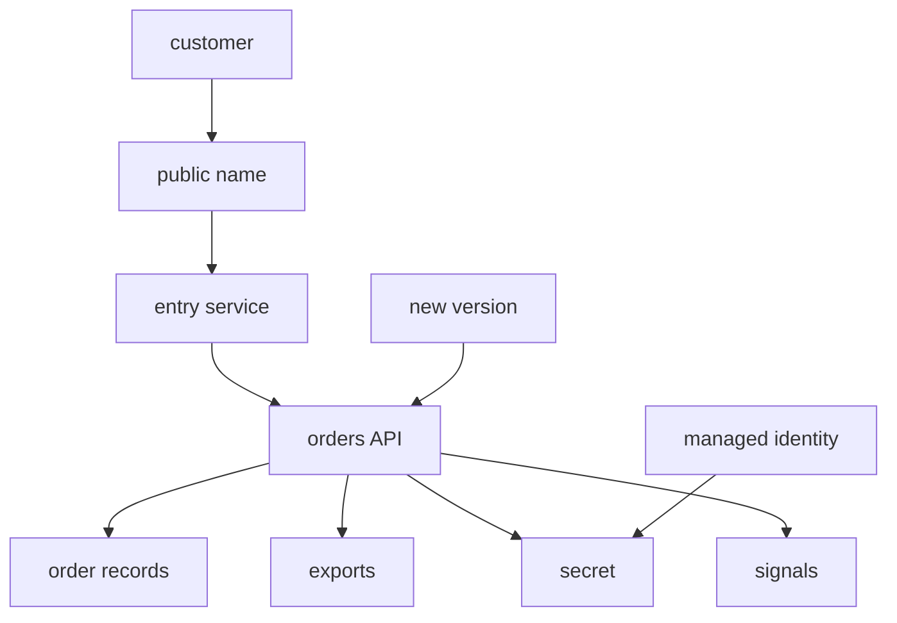

## Table of Contents

1. [The Problem](#the-problem)
2. [The Job-Based Map](#the-job-based-map)
3. [The Orders API](#the-orders-api)
4. [Traffic: What Handles Public Entry](#traffic-what-handles-public-entry)
5. [Compute: Where The Code Runs](#compute-where-the-code-runs)
6. [State: Where Data Lives](#state-where-data-lives)
7. [Access: Who Can Touch What](#access-who-can-touch-what)
8. [Signals: Where Evidence Lives](#signals-where-evidence-lives)
9. [Operations: Deployment, Cost, And Recovery](#operations-deployment-cost-and-recovery)
10. [Debugging With The Map](#debugging-with-the-map)
11. [Putting It All Together](#putting-it-all-together)

## The Problem

The team can now place Azure resources and identify exact Azure resources. The last foundation step is service choice.

This is where AWS knowledge is useful again. If you learned the AWS Core Services Map, you already know the pattern: start with the app need, then find the service family. Azure uses different names and some different boundaries, but the app jobs are familiar.

The mistake is to ask for direct replacements too early:

```text
What is the Azure ECS?
What is the Azure S3?
What is the Azure CloudWatch?
```

Those questions are not useless, but they are too narrow. The better beginner question is:

> Which Azure service family should I look at first for this app need?

This article builds that map around one production backend. Each section starts with the job and then names the Azure services that usually belong in the first conversation.

## The Job-Based Map

Read the map from left to right. The job comes first. The service family comes second. The exact service name comes last.

| Guiding question | Azure service family | Azure services to recognize |
| --- | --- | --- |
| What handles public traffic? | Traffic entry | App Service ingress, Container Apps ingress, Azure Front Door, Application Gateway, API Management, Azure DNS |
| Where does code run? | Compute | App Service, Container Apps, Functions, Virtual Machines, AKS |
| Where does state live? | Storage and databases | Azure SQL Database, Cosmos DB, Blob Storage, Managed Disks, Azure Files |
| Who grants access? | Identity and secrets | Microsoft Entra, managed identities, Azure RBAC, Key Vault |
| Where do logs, metrics, traces, and alerts live? | Observability | Azure Monitor, Log Analytics, Application Insights, alert rules |
| Which services help deployment? | Release operations | Container Registry, deployment slots, revisions, Bicep, ARM templates, Azure DevOps, GitHub Actions |
| Which services help cost and recovery? | Cost and resilience | Cost Management, budgets, Azure Backup, service backups, redundancy choices |

An AWS-to-Azure bridge can sit beside this, but it should not drive the design alone.

| If AWS made you think of... | Ask this job question in Azure |
| --- | --- |
| Route 53 and ALB | What owns DNS, TLS, routing, WAF, and backend health? |
| ECS, Fargate, Lambda, EC2 | What runtime shape does this code need? |
| S3, RDS, DynamoDB, EBS | What kind of state is this: object, relational, document, disk, or file? |
| IAM roles and Secrets Manager | Which workload identity needs which secret or resource permission? |
| CloudWatch and CloudTrail | Where will request behavior, logs, metrics, traces, and management events be visible? |

The comparison is a bridge. The Azure mechanism still has to be checked in Azure terms.

## The Orders API

The running example is `devpolaris-orders-api`. It receives checkout requests, writes order records, creates export files, reads a database secret, emits logs, and needs repeatable releases.

Before choosing services, write the jobs in app language:

```text
orders API needs:
  public traffic to reach the app
  backend code to keep running
  order records to persist
  finance export files to persist
  private config to stay out of code and images
  the app to access only what it needs
  logs, metrics, traces, and alerts after requests finish
  releases to move safely from code to traffic
  cost and recovery controls before the app grows
```

Now Azure has something to answer.



A first production map might look like this:

| App job | First Azure service | Why this is the first family to inspect |
| --- | --- | --- |
| Public name | Azure DNS or existing DNS provider | Users need a stable name for the API |
| HTTP entry | App Service ingress, Container Apps ingress, Front Door, Application Gateway, or API Management | Requests need a controlled entry path |
| Runtime | App Service or Container Apps | The team wants managed hosting before operating VMs or Kubernetes |
| Order records | Azure SQL Database | Orders need relational data and transactions |
| Export files | Blob Storage | CSV and receipt files need object storage |
| Runtime secret | Key Vault | Private config should not live in code or image layers |
| Runtime permission | Managed identity plus Azure RBAC | The app needs limited access without stored Azure credentials |
| Operational evidence | Application Insights, Log Analytics, Azure Monitor | Logs, metrics, traces, and alerts need a durable home |
| Release evidence | Deployment slots, revisions, Container Registry, pipelines, or infrastructure code | The team needs to know what version is running |
| Cost watch | Cost Management and budgets | The team needs visibility before spend surprises become normal |
| Recovery | Service backups, redundancy, and restore plans | Important state needs a recovery path |

The map does not choose forever. It gives you the first place to look.

## Traffic: What Handles Public Entry

Traffic answers a concrete question:

> How does a customer request reach healthy backend code?

For a simple Azure backend, the runtime may provide the first public entry. App Service can expose a web app over HTTPS. Container Apps can expose ingress for containerized services. That may be enough for the first Orders API.

Other traffic services enter when the job changes:

| Traffic need | Azure service to inspect |
| --- | --- |
| Public DNS records | Azure DNS or another DNS provider |
| Simple regional app endpoint | App Service or Container Apps ingress |
| Global edge entry, WAF, acceleration, multi-region routing | Azure Front Door |
| Regional layer 7 routing, WAF, private backends | Application Gateway |
| API products, policies, quotas, versions, developer access | API Management |
| Lower-level network load balancing | Azure Load Balancer |

The AWS comparison helps here, but only if it stays job-based. Front Door is not just "the Azure ALB." Application Gateway is not just "the other ALB." API Management is not a load balancer with a nicer name. The traffic job decides the first service to inspect.

## Compute: Where The Code Runs

Compute answers:

> What keeps this code running after the laptop is closed?

Azure gives several first choices:

| Runtime need | Azure service to inspect |
| --- | --- |
| Managed web app or API | App Service |
| Managed containers, revisions, scale rules, background workers | Container Apps |
| Event-driven functions, scheduled work, small HTTP handlers | Azure Functions |
| Full operating system control | Virtual Machines |
| Kubernetes platform patterns | AKS |

The tradeoff is simplicity versus control. App Service and Container Apps remove much of the platform work for common backends. Virtual Machines and AKS give more control, but they also give the team more to operate.

For the first Orders API, App Service or Container Apps is a good first conversation. If the team later needs Kubernetes-level control, AKS can become a deliberate step instead of the default starting point.

## State: Where Data Lives

State answers:

> What must survive deploys, restarts, and failed app instances?

Do not put all state under the word "storage." The shape of the data matters.

| State shape | Azure service to inspect |
| --- | --- |
| Relational order records | Azure SQL Database |
| Document or globally distributed NoSQL data | Cosmos DB |
| Receipt files, exports, images, and objects | Blob Storage |
| Attached disk for VM-shaped workloads | Managed Disks |
| Shared file paths for lift-and-shift needs | Azure Files |

For Orders, relational records and finance exports are different jobs. Azure SQL Database may store order rows. Blob Storage may store CSV exports or receipt files. A single storage service name should not hide the data model.

State also brings recovery. Backup, retention, redundancy, deletion protection, and restore testing belong in the first service map because they are easier to design before the data matters.

## Access: Who Can Touch What

Access answers:

> Which caller can do which action on which resource?

Azure splits this across Microsoft Entra, managed identities, Azure RBAC, resource scopes, and service-specific data permissions. Key Vault often appears early because apps need secrets, keys, or certificates.

For Orders, the clean path is:

```text
Orders runtime
  -> managed identity
  -> role assignment or vault access model
  -> Key Vault secret
```

That path is stronger than storing a database password in app settings or a container image. But managed identity alone does not grant access. The identity still needs the right permission at the right scope.

This is where AWS IAM intuition helps and misleads at the same time. The helpful part is the caller-and-permission habit. The misleading part is assuming Azure role assignments, managed identities, service principals, and Key Vault access behave exactly like IAM roles and resource policies. Learn the Azure mechanism before widening access.

## Signals: Where Evidence Lives

Signals answer:

> What will the team read when the app is slow, broken, expensive, or suspicious?

Azure Monitor is the broad monitoring platform. Log Analytics workspaces hold queryable logs. Application Insights gives application-level request, dependency, exception, and performance evidence for many app stacks. Alert rules and action groups turn signals into notifications.

For Orders, useful evidence includes:

| Evidence need | Azure service to inspect |
| --- | --- |
| Request duration and failures | Application Insights |
| App logs | Log Analytics workspace |
| Metrics and platform signals | Azure Monitor metrics |
| Alerting | Alert rules and action groups |
| Management activity | Azure Activity Log |

The first map should name where evidence lives. Otherwise every incident starts by asking where logs went.

## Operations: Deployment, Cost, And Recovery

Operations answer:

> How do changes, money, and restore paths stay visible after the first deploy?

Deployment may use GitHub Actions, Azure DevOps, Bicep, ARM templates, Terraform, container images in Azure Container Registry, App Service deployment slots, or Container Apps revisions. The tool matters less than the evidence it leaves: target subscription, resource group, region, version, configuration, and rollback path.

Cost should be visible by subscription, resource group, tag, and service family. Azure Cost Management and budgets help catch surprises before they become normal.

Recovery belongs on the first map too. Azure SQL Database, storage accounts, compute platforms, and Key Vault all have different backup, redundancy, retention, and restore behavior. A service exists is not the same as the team can recover it.

For Orders, the first operations note might say:

```text
Deploy through GitHub Actions.
Target subscription sub-orders-prod.
Target resource group rg-orders-prod-uksouth.
Track cost by tags team=orders, env=prod, service=orders-api.
Document restore paths for SQL, Blob Storage, and Key Vault.
```

Short notes like that keep operations connected to the service map.

## Debugging With The Map

The point of a core services map is not memorization. It is faster reasoning.

If customers get 502 errors before app logs appear, inspect traffic entry and backend health before changing the database. If the app fails only when reading a secret, inspect managed identity, Key Vault, and role scope before changing DNS. If exports disappear, inspect Blob Storage, lifecycle, permissions, and deployment config before changing compute.

The map turns a vague symptom into a first service family:

| Symptom | First family |
| --- | --- |
| Public URL fails before reaching code | Traffic entry |
| App will not start or scale | Compute |
| Writes fail or data is missing | State |
| Secret read returns forbidden | Access |
| No logs after deploy | Signals |
| Wrong version is serving traffic | Deployment |
| Spend changes suddenly | Cost |
| Restore path is unclear | Recovery |

This is also why direct AWS translation is risky. A symptom should point to a job. Then the job points to Azure services.

## Putting It All Together

The opening problem was service-name noise. Azure has many services because production systems have many jobs.

The Orders API needs public traffic, compute, state, access, signals, deployment, cost visibility, and recovery. Azure maps those jobs to service families: ingress and routing services for traffic, App Service or Container Apps for runtime, Azure SQL Database and Blob Storage for state, Key Vault and managed identity for access, Azure Monitor and Application Insights for evidence, deployment tooling for change, Cost Management for spend, and service-specific backup or redundancy features for recovery.

AWS knowledge helps when it gives you the job map. Azure knowledge starts when you learn Azure's boundaries, resource IDs, and service mechanisms.

---

**References**

- [Hosting applications on Azure](https://learn.microsoft.com/en-us/azure/developer/intro/hosting-apps-on-azure). Supports the hosting-service comparison and app hosting choices.
- [Azure Container Apps overview](https://learn.microsoft.com/en-us/azure/container-apps/overview). Supports Container Apps runtime, revisions, ingress, scaling, secrets, and logging claims.
- [Get Started with Azure App Service](https://learn.microsoft.com/en-us/azure/app-service/getting-started). Supports App Service as a managed web application hosting platform.
- [Managed identities for Azure resources](https://learn.microsoft.com/en-us/entra/identity/managed-identities-azure-resources/overview). Supports the managed identity and workload access discussion.
- [What is Azure Resource Manager?](https://learn.microsoft.com/en-us/azure/azure-resource-manager/management/overview). Supports Resource Manager, resource provider, and management scope framing.
