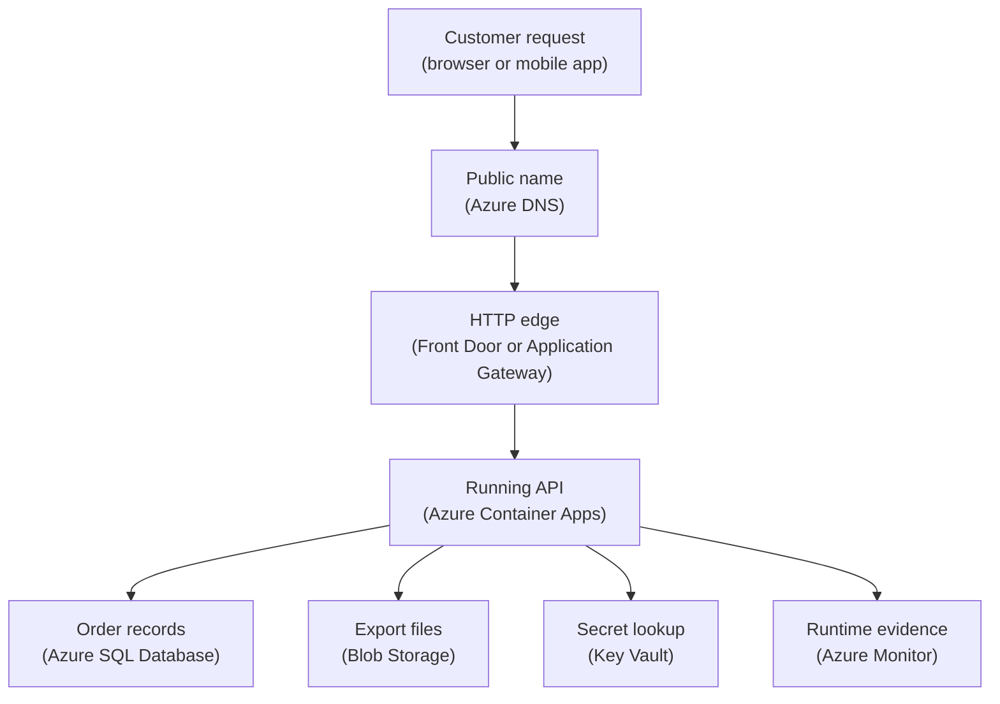

## Table of Contents

1. [Start With The Job](#start-with-the-job)
2. [If You Know The AWS Service Map](#if-you-know-the-aws-service-map)
3. [The First Production Map](#the-first-production-map)
4. [Traffic: Name, Edge, And Private Network](#traffic-name-edge-and-private-network)
5. [Compute: Where The Container Runs](#compute-where-the-container-runs)
6. [Data: Records, Files, And Secrets](#data-records-files-and-secrets)
7. [Identity: Let Services Prove Who They Are](#identity-let-services-prove-who-they-are)
8. [Signals: Logs, Metrics, And Traces](#signals-logs-metrics-and-traces)
9. [Deployment: Images, Resource Groups, And Inventory](#deployment-images-resource-groups-and-inventory)
10. [Debugging With The Map](#debugging-with-the-map)
11. [Tradeoffs: Simplicity, Control, And Ownership](#tradeoffs-simplicity-control-and-ownership)

## Start With The Job

When you first open Azure, the service names can feel like a long menu
before you know what meal you are cooking. That feeling is normal. Start
with a practical question: for each job in the system, which Azure
service is probably responsible?

An Azure core services map is a simple operating map for a backend service.
It groups services by the job they do:
where traffic enters, where code runs, where data lives, where secrets are stored, which identity is allowed to call which resource, and where evidence appears when something breaks.
The formal names matter, but they come after the job.

This exists because cloud systems split work into managed pieces.
On your laptop, one Node.js process might read a `.env` file, write local logs, connect to a local database, and save files under one project directory.
In Azure, those responsibilities usually become separate resources.
That split is helpful because Azure can manage many parts for you, but it becomes confusing if every resource name feels like magic.

This map fits inside the larger Azure mental model.
A tenant is the identity boundary.
A subscription is the billing and management boundary.
A resource group is the folder-like ownership boundary for related resources.
Inside that structure, services do specific jobs for one system.

The running example is `devpolaris-orders-api`.
It is a small backend service for checkout traffic.
It receives order requests, stores order records, writes export files for finance, reads secrets safely, and needs logs that help a developer debug failures.
We will map its first production shape on Azure.

> Do not ask, "Which Azure service should I learn next?" first. Ask, "What job is the system asking for?"

Here is the first job map.
Keep it small on purpose.
Azure has more services than this, but a beginner needs a useful map before a catalog.

| Job In The System | Azure Service | First Question To Ask |
|-------------------|---------------|-----------------------|
| Public name | Azure DNS | Does the public name resolve to the intended entry point? |
| Public entry | Front Door or Application Gateway | Are requests reaching a healthy backend? |
| Private network | Virtual Network | Is the app on the expected private network path? |
| Run the API | Azure Container Apps | Is a healthy revision running and receiving traffic? |
| Store orders | Azure SQL Database | Can the app connect, and does the firewall allow it? |
| Store exports | Blob Storage | Does the container exist, and can the app reach it? |
| Store secrets | Key Vault | Can the app identity read the needed secret? |
| Service login | Managed Identity | Is the identity attached to the running app? |
| Logs and metrics | Azure Monitor | Are logs and metrics arriving for this service? |
| App traces | Application Insights | Can you see requests, failures, and dependency calls? |
| Query logs | Log Analytics | Are the logs connected to the right workspace? |
| Store images | Container Registry | Does the release image tag exist in the registry? |
| Track spend | Cost Management | Can you see cost for this resource group? |

Use the table as a first response map. When checkout fails, the map
helps you follow the failing job instead of wandering through the
portal. You move through the job that is failing and inspect the service
that owns that job.

## If You Know The AWS Service Map

If you already learned the AWS core services map, use it as a starting point.
The jobs are familiar:
run code, receive traffic, store records, store objects, protect secrets, record signals, and track spend.
The service names change.
The exact behavior changes too.

Use this table as a bridge, not as a perfect dictionary:

| Job | AWS idea you know | Azure idea to learn |
|-----|-------------------|---------------------|
| Run a container backend | ECS with Fargate | Azure Container Apps |
| Run a web app platform | Elastic Beanstalk or App Runner style thinking | App Service |
| Run event code | Lambda | Azure Functions |
| Run your own server | EC2 | Virtual Machines |
| Store relational orders | RDS | Azure SQL Database |
| Store object files | S3 | Blob Storage |
| Store secrets | Secrets Manager or SSM Parameter Store | Key Vault |
| Give an app cloud identity | IAM role for a workload | Managed Identity plus Azure RBAC |
| Public DNS | Route 53 | Azure DNS |
| Public edge or load entry | ALB, CloudFront, or Global Accelerator depending on job | Application Gateway or Front Door depending on job |
| Logs and metrics | CloudWatch | Azure Monitor, Log Analytics, and Application Insights |
| Container images | ECR | Azure Container Registry |
| Cost review | Cost Explorer and budgets | Cost Management and budgets |

Some rows are intentionally broad.
For example, Front Door is not "the Azure ALB."
Application Gateway is not "just an ALB with a new name."
The right comparison depends on the job: global edge, regional HTTP load balancing, private networking, TLS termination, or web application firewall rules.

That is why the article keeps returning to the job first.
If you ask "what is the Azure version of this AWS service?", you may pick the wrong neighbor.
If you ask "what job is failing?", the service map becomes much easier to use.

## The First Production Map

The `devpolaris-orders-api` team has already built a container image.
The app exposes `GET /health`, accepts `POST /orders`, reads a database connection setting, and writes monthly export files.
The team wants a first Azure production environment that is managed enough for a small team but still clear enough to debug.

In plain words, the system needs this:

```text
public DNS name
  -> protected HTTP entry point
  -> private app runtime
  -> order database
  -> export file storage
  -> secret store
  -> service identity
  -> logs, metrics, traces
  -> image registry
  -> cost view
```

In Azure words, that can become this:

```text
Azure DNS
  -> Azure Front Door or Application Gateway
  -> Azure Container Apps
  -> Azure SQL Database
  -> Blob Storage
  -> Key Vault
  -> Managed Identity
  -> Azure Monitor, Application Insights, Log Analytics
  -> Azure Container Registry
  -> Cost Management
```

Read the diagram from top to bottom.
The labels put the plain job first and the Azure name second.
Identity, networking, images, and cost stay in the inventory table so the request path stays readable.



Managed Identity, Virtual Network, Container Registry, Application Insights, Log Analytics, and Cost Management still matter.
The table below names those supporting pieces without turning every support relationship into another arrow.

This design does not try to use every Azure service.
That is the point.
The first production map should explain the main jobs clearly enough that a teammate can answer:
where does traffic enter, where does code run, where does data live, who is allowed to call what, and where do we see evidence?

Here is a small service inventory for the first version.
This is the kind of short table a backend team can keep in a deployment issue, runbook, or architecture note.

| Owner | Resource | Azure Service | Job |
|-------|----------|---------------|-----|
| Platform | `rg-devpolaris-orders-prod` | Resource group | Ownership boundary |
| Platform | `dns-devpolaris-com` | Azure DNS | Public records |
| Platform | `fd-devpolaris-prod` | Front Door | Public edge |
| Backend | `ca-orders-api-prod` | Container Apps | Run API |
| Backend | `crdevpolarisprod` | Container Registry | Store images |
| Data | `sql-devpolaris-prod` | Azure SQL | Order records |
| Data | `stdevpolarisexports` | Blob Storage | Export files |
| Security | `kv-devpolaris-prod` | Key Vault | Secrets |
| Security | `mi-orders-api-prod` | Managed Identity | Service access |
| Ops | `appi-orders-api-prod` | Application Insights | App traces |
| Ops | `log-devpolaris-prod` | Log Analytics | Query logs |
| Finance | `prod subscription` | Cost Management | Spend review |

Notice how the inventory avoids vague ownership.
If the API cannot read from Key Vault, the backend engineer and security owner know which resource family is involved.
If cost rises suddenly, the finance owner does not start inside the app logs.
They start with cost by resource group and service.

## Traffic: Name, Edge, And Private Network

Traffic is the first job because users cannot call a service they cannot reach.
For `devpolaris-orders-api`, the public name might be `orders.devpolaris.com`.
That name needs to point to a public entry point, and the entry point needs a path to the app.

Azure DNS owns the name. DNS (Domain Name System, the internet naming
system) translates a friendly name into a destination that browsers and
clients can use. For a beginner, the first DNS check asks whether the
record points to the edge resource you expect.

Front Door and Application Gateway both sit in the "public entry" family, but they are not identical.
Azure Front Door is a global edge service that can route HTTP traffic closer to users and help with public web entry.
Application Gateway is a regional layer 7 load balancer, which means it understands HTTP and HTTPS and can route to backends inside a region.
For a first map, either can be the front door, depending on the team's shape.

Virtual Network is the private traffic area.
A virtual network, often called a VNet, is an isolated network space in Azure.
Subnets are smaller address ranges inside it.
Network rules, private endpoints, and service integration decide which resources can talk privately instead of crossing the public internet.

Here is the traffic slice for the orders API:

| Job | Azure Service | First Question To Ask |
|-----|---------------|-----------------------|
| Human name | Azure DNS | Does `orders` resolve to the expected Azure entry? |
| HTTP edge | Front Door | Is the origin healthy and receiving requests? |
| Regional entry | Application Gateway | Is the backend pool healthy? |
| Private space | Virtual Network | Is this resource in the expected VNet? |
| Placement | Subnet | Is the app integrated with the expected subnet? |
| Block or allow | Network rules | Does a rule allow this source to reach this target? |

A common beginner failure is to treat "networking" as one blob during
debugging. DNS answers a naming question, Front Door or Application
Gateway answers an entry question, Virtual Network answers a private
path question, and network rules answer an allow-or-deny question.

Imagine the app is healthy, but users see a connection failure.
If you start inside the container logs, you may find nothing.
The app never received the request.
The better first checks are DNS, edge health, and backend routing.

```text
Symptom: https://orders.devpolaris.com/health fails from a browser

First useful questions:
1. Does Azure DNS resolve the expected record?
2. Does Front Door or Application Gateway see the backend as healthy?
3. Can the edge reach the Container Apps endpoint or private backend?
4. Did a network rule block the path before the app saw traffic?
```

That path keeps you from debugging compute when traffic never reached compute.

## Compute: Where The Container Runs

Compute is where your code executes.
For `devpolaris-orders-api`, compute means the runtime that starts the container image, injects configuration, exposes HTTP, restarts unhealthy versions, and sends logs somewhere useful.

Azure Container Apps is the main compute choice in this article.
It is a managed container platform for running containerized apps without operating the underlying servers yourself.
You still own the app image, environment variables, secrets references, scaling settings, health behavior, and deployment choices.
Azure owns much of the host management beneath it.

That split is why Container Apps is a good first production path for a small backend team.
The team can package the API as a container, push it to Azure Container Registry, and run it with HTTP ingress and scaling rules.
They do not need to design a Kubernetes cluster on day one.

App Service is another managed compute option.
It is comfortable when you want to deploy web apps directly, with less container-specific platform thinking.
It can also run containers, but many teams choose it because the web-app operating model is simple and familiar.

Azure Functions is for event-driven functions.
Use it when the unit of work is small and triggered by an event, such as a queue message, timer, HTTP request, or storage event.
It can serve APIs, but it changes the shape of timeout behavior, cold starts, and function-level permissions.

Virtual Machines are servers you manage.
They are useful when you need OS-level control, custom agents, special networking, or legacy software.
They also bring back patching, process supervision, disk care, and more server operations.

AKS (Azure Kubernetes Service) is the managed Kubernetes option.
Kubernetes is an orchestration platform, meaning it schedules and manages containers across a cluster.
It is a later choice when the team needs Kubernetes APIs, custom controllers, service mesh patterns, or a shared platform.
It should not be the default first answer just because it sounds serious.

Use this table as a beginner compute map:

| Job Shape | Azure Service | First Good Use |
|-----------|---------------|----------------|
| Containerized API | Container Apps | First managed container backend |
| Web app platform | App Service | Simple hosted web app |
| Event handler | Azure Functions | Small triggered work |
| Full server control | Virtual Machines | Custom OS needs |
| Container orchestration | AKS | Later platform needs |

For the orders API, the compute inventory might look like this:

```text
App: devpolaris-orders-api
Compute: Azure Container Apps
Container image: crdevpolarisprod.azurecr.io/orders-api:2026.05.03.4
Ingress: external through Front Door
Health endpoint: /health
Minimum replicas: 2
Identity: mi-orders-api-prod
Logs: appi-orders-api-prod -> log-devpolaris-prod
```

The exact names matter less than job clarity. If a revision is
unhealthy, inspect Container Apps. If the image cannot be pulled,
inspect Container Registry and identity. If the app starts but cannot
read secrets, inspect Managed Identity and Key Vault before changing the
container.

## Data: Records, Files, And Secrets

Data is not one service family.
Order records, export files, and secrets have different jobs, so they belong in different Azure services.
This is one of the first places a beginner can save themselves pain by mapping jobs instead of names.

Azure SQL Database owns relational records.
Relational means the data is shaped into tables with relationships, constraints, indexes, and SQL queries.
For `devpolaris-orders-api`, orders, order items, payment status, and customer references are normal relational data.
Azure SQL is a clear first choice when the team needs transactions and SQL queries.

Blob Storage owns files and object-like data.
A blob is a binary large object, but you can think of it as a file stored in a cloud storage account.
Monthly finance exports, invoice PDFs, or raw import files belong here more naturally than in a database table.

Key Vault owns secrets and keys.
A secret is a sensitive value such as an API token, database credential, signing key, or webhook secret.
The app should not bake those values into the container image.
It should read them at runtime through a controlled identity.

Here is the data map:

| Data Job | Azure Service | First Question To Ask |
|----------|---------------|-----------------------|
| Order records | Azure SQL Database | Can the app connect with the expected login? |
| Export files | Blob Storage | Does the target container exist? |
| Secret values | Key Vault | Can the app identity read the needed value? |
| Database password fallback | Key Vault | Is the app using the intended secret version? |
| File access control | Storage account | Do network rules and data roles both allow access? |

The job split matters during incidents.
If an export file is missing, Azure SQL may still be perfectly healthy.
If the API cannot read its database password, the database may be fine and Key Vault access may be broken.
If the app cannot reach Blob Storage, the storage container may exist but network rules may block the app.

Here is a small realistic configuration record from the orders service.
It is the kind of inventory a team might review before the first
production release, focused on the resources and settings that affect
the app path.

```yaml
service: devpolaris-orders-api
environment: prod
data:
  orders:
    service: Azure SQL Database
    server: sql-devpolaris-prod.database.windows.net
    database: orders_prod
  exports:
    service: Blob Storage
    account: stdevpolarisexports
    container: monthly-orders
  secrets:
    service: Key Vault
    vault: kv-devpolaris-prod
    names:
      - orders-sql-connection
      - stripe-webhook-secret
```

What should you inspect first from that record?
For failed inserts, start with Azure SQL connectivity and login evidence.
For failed export upload, start with Blob Storage container access and network path.
For missing credentials, start with Key Vault and Managed Identity.

The failure mode to avoid is treating service names as magic.
"Azure SQL is down" is rarely a useful first sentence.
Better first sentences are smaller:
the app cannot resolve the database host, the identity cannot get the secret, the SQL login fails, or the storage account denies the network path.

## Identity: Let Services Prove Who They Are

Identity is the job of proving who or what is making a request.
For humans, that usually means signing in through Microsoft Entra ID.
For Azure resources, the clean beginner path is Managed Identity.

Managed Identity gives an Azure resource an identity managed by Azure.
Instead of putting a password or token in a container image, you assign an identity to the Container App and grant that identity access to Key Vault, Blob Storage, or another resource.
The app asks Azure for a token, and Azure decides whether that identity is allowed.

This is similar to giving a CI job a temporary cloud role instead of pasting a permanent secret into the workflow.
The application still needs permission, but the secret is not stored as a long-lived value in the repo or image.

For `devpolaris-orders-api`, the identity story might be:

```text
Managed identity: mi-orders-api-prod
Assigned to: ca-orders-api-prod
Allowed to read: kv-devpolaris-prod secrets
Allowed to write: stdevpolarisexports/monthly-orders
Allowed to connect: orders_prod database path chosen by team
Not allowed to manage: subscription, DNS, container registry admin settings
```

The most common beginner mistake is debugging compute when identity is failing.
The container starts.
The route works.
The database exists.
But the app receives a permission error when it tries to read a secret or upload a file.

The failure often looks like this:

```text
2026-05-03T09:42:18Z ERROR orders-api
operation=load-secret secret=orders-sql-connection
status=403
message="Caller is not authorized to perform action on Key Vault secret."
resource=kv-devpolaris-prod
identity=mi-orders-api-prod
```

That log points first at identity. Before rebuilding the image or
repeatedly restarting the container, check whether the managed identity
is assigned to the Container App and whether that identity has the
correct Key Vault permission model for reading secrets.

Identity checks should be boring and specific:

| Access Need | Identity | Target | First Check |
|-------------|----------|--------|-------------|
| Read secrets | Managed Identity | Key Vault | Secret read allowed |
| Upload exports | Managed Identity | Blob Storage | Storage role assigned |
| Pull image | Container App identity or registry config | Container Registry | Image pull allowed |
| Query database | App identity or configured login | Azure SQL | Login path works |

Do not make the managed identity an owner of everything.
Give it the smallest useful access for the jobs it performs.
That gives you a cleaner blast radius when an app bug or token misuse appears.

## Signals: Logs, Metrics, And Traces

Observability is how the system tells you what is happening.
Logs are event records.
Metrics are numbers over time, such as request count, CPU, memory, and failure rate.
Traces follow a request as it moves through application code and dependencies.

Azure Monitor is the broad observability platform. Application Insights
is the application performance monitoring part used for request
telemetry, failures, dependencies, and traces. Log Analytics is the
workspace where you query collected logs. For a beginner, the key idea
is that missing observability resources leave the incident with less
evidence.

For `devpolaris-orders-api`, useful signals include:

| Question | Azure Service | First Signal |
|----------|---------------|--------------|
| Is the app receiving traffic? | Application Insights | Request count |
| Are requests failing? | Application Insights | Failed requests |
| Did a revision start? | Container Apps | Revision status |
| What did the app log? | Log Analytics | Container logs |
| Is the database slow? | Azure Monitor | SQL metrics |
| Did storage deny access? | Azure Monitor | Storage failures |

Missing observability is a real failure mode.
The app can be running and still be hard to operate because nobody linked the right logs or traces.
During the first production map, observability is not a later decoration.
It is part of the system.

Here is the kind of failure snapshot that should make you look at observability setup before changing code:

```text
Incident note: orders-api returned 500 for checkout requests

What we found:
- Container App revision: healthy
- Front Door backend: healthy
- Application Insights: no request data after deployment
- Log Analytics query: no container logs from ca-orders-api-prod

Likely issue:
Observability resources were not linked during the production deployment.
The app may be failing, but the team cannot see the failure path yet.
```

The fix direction is concrete: connect Container Apps logs to the Log
Analytics workspace, configure application telemetry to Application
Insights, and make sure the team can query the records by app name,
revision, and time range.

Good observability reduces guessing.
When the next incident happens, the team should be able to answer:
did the request reach the edge, did it reach the app, did the app call SQL or Blob Storage, and which identity was used?

## Deployment: Images, Resource Groups, And Inventory

Deployment is where the map turns into resources.
The backend team builds an image.
Azure Container Registry stores that image.
Azure Container Apps runs it.
The resource group keeps the production resources together for ownership, access, inventory, and cost review.

Container Registry is the image store.
For `devpolaris-orders-api`, a release might publish `crdevpolarisprod.azurecr.io/orders-api:2026.05.03.4`.
The tag should point to the image that passed the team's release checks.
The Container App then updates to a new revision based on that image.

A resource group is not just a folder in the portal.
It is a practical boundary for listing resources, applying access, reviewing costs, and deleting related non-production environments.
For production, it also helps humans inspect the right set of resources quickly.

Here is a realistic `az resource list` style snapshot for the production resource group.
The exact output shape can vary by query, but this gives the team a useful inventory view.

```text
$ az resource list --resource-group rg-devpolaris-orders-prod --query "[].{name:name,type:type,location:location}" --output table
Name                       Type                                            Location
-------------------------  ----------------------------------------------  --------
ca-orders-api-prod         Microsoft.App/containerApps                     eastus
cae-orders-prod            Microsoft.App/managedEnvironments               eastus
crdevpolarisprod           Microsoft.ContainerRegistry/registries          eastus
sql-devpolaris-prod        Microsoft.Sql/servers                           eastus
orders_prod                Microsoft.Sql/servers/databases                 eastus
stdevpolarisexports        Microsoft.Storage/storageAccounts               eastus
kv-devpolaris-prod         Microsoft.KeyVault/vaults                       eastus
mi-orders-api-prod         Microsoft.ManagedIdentity/userAssignedIdentities eastus
vnet-devpolaris-prod       Microsoft.Network/virtualNetworks               eastus
fd-devpolaris-prod         Microsoft.Cdn/profiles                          global
appi-orders-api-prod       Microsoft.Insights/components                   eastus
log-devpolaris-prod        Microsoft.OperationalInsights/workspaces        eastus
```

This output shows what exists before you debate what is broken. If the
Key Vault is not in the resource group, secret debugging changes. If
there is no Application Insights component, request telemetry cannot
appear. If there is no Container Registry, image deployment evidence is
somewhere else.

A small release inventory can sit next to the resource inventory:

| Release Item | Expected Value | First Check |
|--------------|----------------|-------------|
| Image | `orders-api:2026.05.03.4` | Registry tag exists |
| Runtime | `ca-orders-api-prod` | Revision active |
| Identity | `mi-orders-api-prod` | Assigned to app |
| Secrets | `kv-devpolaris-prod` | Secret access allowed |
| Logs | `log-devpolaris-prod` | New logs arriving |
| Cost scope | `rg-devpolaris-orders-prod` | Spend grouped |

Deployment is not finished when a container starts.
Deployment is finished when the right image is running, the app can reach its dependencies, the logs and traces are visible, and the team can see what it costs to keep the system alive.

## Debugging With The Map

The map is most valuable when something breaks.
Beginners often debug the service they can see first, not the service that owns the failing job.
That is how teams lose time.

Here is a realistic failure.
At 10:15, checkout requests return `500`.
A developer opens Container Apps first because the API is the visible service.
The revision is healthy, CPU is normal, and restarts are not increasing.
They spend twenty minutes changing app settings and restarting the revision.

The useful log line was actually about identity:

```text
2026-05-03T10:15:44Z ERROR orders-api
request_id=ordreq_7f31 path=/orders
dependency=KeyVault secret=orders-sql-connection
status=403
message="Managed identity mi-orders-api-prod cannot read this secret."
```

The wrong service family was inspected first.
Compute was healthy enough to run the code.
Identity was failing when the code tried to read the secret.
The fix direction is to inspect the managed identity assignment and Key Vault permission, then retry the request after access is corrected.

Here is another failure shape.
Finance reports that monthly export files are missing.
The first instinct is to open the storage account and check the blob container.
The container exists.
The app has the correct role.
But the storage firewall only allows selected networks, and the Container App is not coming from the expected network path.

```text
2026-05-03T11:08:12Z ERROR orders-api
operation=upload-export
target=stdevpolarisexports/monthly-orders/2026-05.csv
status=403
message="This request is not authorized to perform this operation."
hint="Network rule denied the request before blob write completed."
```

This is the "checking storage when networking is blocked" failure.
Blob Storage is the target, but the first broken job is network access.
The fix direction is to verify the app's network integration, private endpoint or firewall rule, and allowed source path.

The map also prevents the "service names are magic" problem.
Do not say "Azure is broken."
Say which job failed.
Name the service only after naming the job.

| Symptom | Tempting Wrong Start | Better First Start |
|---------|----------------------|--------------------|
| `orders.devpolaris.com` does not load | Restart app | DNS and edge health |
| App logs show Key Vault `403` | Rebuild image | Managed Identity access |
| Export upload denied | Recreate container | Network and storage rules |
| No logs after deploy | Change app code | Monitor links and workspace |
| Many platform choices appear | Pick AKS | Start with Container Apps |

Choosing AKS too early is its own failure mode.
AKS can be the right answer for a team that already needs Kubernetes.
But if the first production service only needs one containerized API, HTTP ingress, managed scaling, secrets, logs, and a database, Container Apps usually keeps the operating surface smaller.
You can learn the app's production needs before adding cluster operations.

## Tradeoffs: Simplicity, Control, And Ownership

Managed services trade some control for less operational work. With
Container Apps, Azure handles much of the host layer, and you spend more
time on container behavior, scaling rules, identity, and dependencies.
With Virtual Machines, you regain OS-level control, but you also regain
patching, process management, disk care, and more failure modes.

The same tradeoff appears across the map.
Azure SQL manages much of the database platform, but you still own schema design, queries, indexes, connection behavior, backups decisions, and access.
Blob Storage manages durable object storage, but you still own naming, lifecycle rules, access, and network restrictions.
Azure Monitor can collect signals, but you still own useful logs, alert design, and incident questions.

Here is the tradeoff table for the first production map:

| Choice | You Gain | You Give Up |
|--------|----------|-------------|
| Container Apps over VMs | Less server care | Less host control |
| App Service over VMs | Simple web hosting | Less runtime shape control |
| Functions over app server | Event fit | Different timeout model |
| AKS later | Orchestration control | More platform operations |
| Azure SQL | Managed database platform | Still need data ownership |
| Managed Identity | Fewer stored secrets | Need clear role design |

There is also a service sprawl tradeoff. If every small feature gets its
own storage account, vault, workspace, registry, and network without a
naming or ownership pattern, the map becomes noisy because ownership is
unclear.

For the orders API, a clear first ownership model is enough:

| Boundary | Owns | Why It Helps |
|----------|------|--------------|
| Resource group | Production resources | Inventory and cost |
| Managed identity | App permissions | Smaller blast radius |
| Log workspace | Runtime evidence | Shared querying |
| Key Vault | Secrets | Controlled access |
| Container registry | Release images | Deployment evidence |

Cost Management belongs in the core map because cost is an operating signal.
A service that works but surprises the team with spend is still not understood.
For the first version, review cost by subscription, resource group, and service family.
That is enough to catch obvious surprises such as an oversized database, unused environments, or unexpected log volume.

The beginner goal is to look at `devpolaris-orders-api` and say: this
job belongs to compute, this one belongs to data, this one belongs to
identity, this one belongs to networking, and this one belongs to
observability. Once you can do that, the service names stop being magic
and start becoming tools.

---

**References**

- [Azure documentation](https://learn.microsoft.com/en-us/azure) - The official entry point for Azure services, concepts, and learning paths.
- [Azure Container Apps services](https://learn.microsoft.com/en-us/azure/container-apps/services) - Useful for understanding how Container Apps organizes running container services.
- [Azure App Service documentation](https://learn.microsoft.com/en-us/azure/app-service/) - Official guide for the managed web app hosting option compared in the compute section.
- [Azure Functions documentation](https://learn.microsoft.com/en-us/azure/azure-functions/) - Official guide for the event-driven compute option mentioned in the service map.
- [Azure Monitor documentation](https://learn.microsoft.com/en-us/azure/azure-monitor/) - Official guide for metrics, logs, traces, alerts, and monitoring resources.
- [Managed identities for Azure resources](https://learn.microsoft.com/en-us/entra/identity/managed-identities-azure-resources/) - Official guide to letting Azure resources authenticate without storing credentials in code.
