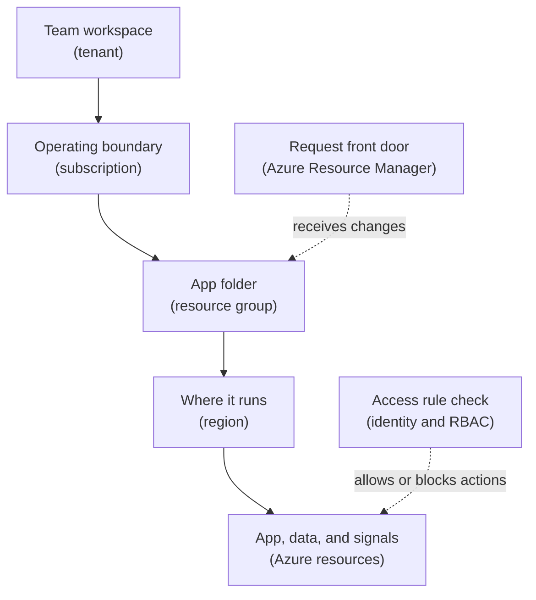

## Table of Contents

1. [What The Cloud Is Trying To Organize](#what-the-cloud-is-trying-to-organize)
2. [The AWS Translation](#the-aws-translation)
3. [The Example: One Orders API Needs A Home](#the-example-one-orders-api-needs-a-home)
4. [Tenants Are The Team Workspace](#tenants-are-the-team-workspace)
5. [Subscriptions Are The Operating Boundary](#subscriptions-are-the-operating-boundary)
6. [Resource Groups Keep Related Things Together](#resource-groups-keep-related-things-together)
7. [Regions And Zones Put Resources On The Map](#regions-and-zones-put-resources-on-the-map)
8. [Azure Resource Manager Is The Front Door](#azure-resource-manager-is-the-front-door)
9. [Resources Have IDs, Tags, And Lifecycles](#resources-have-ids-tags-and-lifecycles)
10. [Identity Decides Who And What Can Act](#identity-decides-who-and-what-can-act)
11. [Managed Services Still Leave You Responsible](#managed-services-still-leave-you-responsible)
12. [Failure Modes For Beginners](#failure-modes-for-beginners)
13. [The Mental Checklist Before You Deploy](#the-mental-checklist-before-you-deploy)

## What The Cloud Is Trying To Organize

If you have learned some AWS before, you already have a useful cloud habit:
do not start with the product list.
Start with the map.

In AWS, the useful first questions were things like:
which account, which Region, which resource, and who is allowed to touch it?
Azure asks the same kind of operating questions, but the labels change.
Instead of an AWS account being the main workspace, Azure gives you a tenant for identity, a subscription for resources and billing, and resource groups for related resources.

That means Azure is not a totally new puzzle.
It is the same cloud problem with a different set of boundary words.
Your app still needs somewhere to run.
Users still need a network path.
Data still needs a durable home.
Logs still need a place to land.
Humans, pipelines, and workloads still need permissions that are narrow enough to be safe.

Azure is Microsoft's cloud platform.
It gives teams rented infrastructure and managed services through a shared control system called Azure Resource Manager.
You ask Azure to create things for you: an app environment, a database, a storage account, a private network, a log workspace, or a secret store.
Each created thing is a resource, which means Azure can track it, secure it, bill for it, update it, and delete it.

Azure exists because teams do not want every application team to buy servers, install operating systems, wire networks, create identity systems, and build their own monitoring stack from scratch.
The trade is simple.
You give up some low-level control.
You gain a place where common infrastructure can be requested, managed, audited, and repeated.

In the larger system, Azure sits between your application and the physical data centers.
You still write the application.
You still choose the architecture.
You still decide how much failure your service can tolerate.
Azure gives you the place, the managed building blocks, and the management layer.

This article follows one running example:
a Node backend called `devpolaris-orders-api` is moving from a developer laptop and CI pipeline into Azure.
We will use Azure Container Apps as the likely runtime because it is easy to picture: you give Azure a container image, and Azure runs the app for you.
We will not go deep into Container Apps here.
The goal is to learn the map before we learn the individual streets.

> Azure feels calmer when you ask, "which tenant, which subscription, which resource group, which region, which resource, and which identity?"

## The AWS Translation

AWS comparisons are useful as a bridge, but they are not perfect replacements.
The goal is not to memorize a one-to-one dictionary.
The goal is to reuse any AWS mental model you already have.

Here is the short translation table:

| AWS idea you know | Azure idea to learn | What changes |
|-------------------|---------------------|--------------|
| AWS account | Azure subscription | The subscription is the main resource, billing, and access boundary |
| AWS Organizations account structure | Tenant plus subscriptions, sometimes management groups | Azure separates identity home from resource boundary more visibly |
| IAM identity and role | Microsoft Entra identity, managed identity, and Azure RBAC | Identity and permissions are split across Entra ID and Azure role assignments |
| Region and Availability Zone | Region and availability zone | Similar idea, but service support and naming must still be checked |
| ARN | Azure resource ID | Both are exact identifiers, but Azure IDs are path-like ARM IDs |
| Tags | Tags | Same team habit: ownership, cost, environment, and search |
| CloudFormation or Terraform calling AWS APIs | ARM, Bicep, Terraform, CLI, or portal calling Azure Resource Manager | Every create, update, or delete flows through the Azure management layer |

The biggest Azure difference is the tenant.
In AWS beginner lessons, the account often feels like the main top-level box.
In Azure, identity has its own home above subscriptions.
That is why someone can be signed in to the right company tenant and still be looking at the wrong subscription.

The second big difference is the resource group.
AWS has tags and service-specific groupings, but it does not have the same universal resource group container.
In Azure, resource groups become part of daily operations.
They affect inventory, access scope, deployment targeting, cost review, and deletion safety.

So the AWS callback is simple:
keep asking the same careful questions, but translate the boxes before you act.

## The Example: One Orders API Needs A Home

Imagine a small team owns `devpolaris-orders-api`.
It is a Node backend that receives checkout requests.
It validates carts, stores orders, and publishes events for shipping and email workers.

On a laptop, the development path is small:

```text
developer laptop
  -> npm run dev
  -> http://localhost:3000/orders
  -> local test database
```

That is a good learning setup.
It is not a shared production setup.
If a user places an order, the request should not depend on one person's terminal window.

The team wants a first Azure shape like this:

```text
users
  -> public URL
  -> Azure Container Apps app
  -> managed database
  -> logs and metrics
  -> identity based access to secrets or storage
```

Those words hide several important placement decisions.
Where is the app allowed to run?
Which bill does it belong to?
Which group contains the app and its logs?
Which identity does the app use when it talks to other Azure services?
Who can delete it?

Here is the beginner map for this article:



Read the solid path from top to bottom.
The service lives inside a team workspace, then inside an operating boundary, then inside an app folder, then in a real Azure region with managed resources.
The dotted arrows are not places.
They are checks and rules.
Azure Resource Manager receives change requests for the resource group.
Identity decides whether a person, pipeline, or app is allowed to act on those resources.

This distinction matters.
Many beginner mistakes happen because people mix up place and permission.
A subscription is a place where resources are managed.
A role assignment is a permission rule.
A region is a location.
A tenant is the identity home for the organization.

Keep those boxes separate and later Azure services become much easier to place.

## Tenants Are The Team Workspace

A tenant is the identity workspace for an organization in Microsoft Entra ID.
Microsoft Entra ID is the identity system that knows users, groups, applications, and service identities.
If your company signs in with work accounts such as `maya@devpolaris.example`, those users belong to a tenant.

For a beginner, think of the tenant as the team workspace for identity.
It answers questions like:
who are the people, what groups are they in, what applications exist, and what identities can be used by workloads?

The tenant is not where your Container App runs.
The tenant is where Azure checks identity.
That difference is important.
Your app might run in the `uksouth` region, but the user who deploys it is still known through the tenant.

For `devpolaris-orders-api`, the tenant might contain groups like this:

| Tenant Object | Beginner Meaning | Example Use |
|---------------|------------------|-------------|
| `Platform Engineers` | People who can manage shared cloud setup | Create subscriptions and guardrails |
| `DevPolaris Orders Maintainers` | People who own this service | Deploy and inspect the app |
| `id-devpolaris-orders-api-prod` | A workload identity | Let the app read a secret or write logs |

Notice that the table mixes people and workload identity on purpose.
Cloud access is not only about humans.
A running app also needs an identity when it talks to another service.
Without that identity, teams often fall back to copied passwords or long-lived keys.
That is the habit Azure managed identities are designed to remove.

The tenant is also where the organization can set broad rules.
For example, a company can require multifactor sign-in for people who manage production.
That rule belongs close to identity, not inside one small app resource.

The safe beginner question is:

> Which tenant am I signed into?

If the answer is wrong, every later Azure decision starts from the wrong identity home.

## Subscriptions Are The Operating Boundary

A subscription is the main Azure boundary for resources, billing, quotas, and access assignment.
If the tenant is the identity workspace, a subscription is the operating workspace.
It is where teams create resources and where Azure collects usage and cost.

The word "subscription" can sound like a payment plan, and it is partly that.
But for engineers, it is also a working boundary.
You can have separate subscriptions for development, staging, and production.
That gives mistakes a smaller place to land.

For `devpolaris-orders-api`, a team might use this split:

| Subscription | Purpose | Beginner Risk It Reduces |
|--------------|---------|--------------------------|
| `devpolaris-dev` | Experiments and early testing | A test cleanup does not touch production |
| `devpolaris-staging` | Release checks before users see changes | Bad config is caught before production |
| `devpolaris-prod` | Real checkout traffic | Access and cost are easier to review |

This does not make production safe by itself.
It only creates a boundary where safer rules can be applied.
You still need correct permissions, reviews, backups, monitoring, and deployment practice.

The Azure CLI can show which subscription your shell is using:

```bash
$ az account show --query "{name:name,id:id,tenantId:tenantId}" --output json
{
  "name": "devpolaris-prod",
  "id": "11111111-2222-3333-4444-555555555555",
  "tenantId": "aaaaaaaa-bbbb-cccc-dddd-eeeeeeeeeeee"
}
```

This output is not trivia.
It is a safety check.
Before a deployment or cleanup command, the subscription name and ID tell you which operating boundary your command will touch.

A realistic beginner failure looks like this:

```bash
$ az containerapp list --resource-group rg-devpolaris-orders-prod --output table
Name                       ResourceGroup                Location
-------------------------  ---------------------------  --------
ca-devpolaris-orders-api   rg-devpolaris-orders-prod    uksouth
```

That command looks harmless.
But if your active subscription is `devpolaris-prod` when you expected `devpolaris-staging`, the next command might change a production app.
The command did what you asked.
Your context was wrong.

The habit is simple:
check the subscription before changing resources.

## Resource Groups Keep Related Things Together

A resource group is a container for related Azure resources.
It is not a folder in the filesystem.
It is a management container inside Azure Resource Manager.
You use it to group things that should be created, viewed, secured, tagged, or deleted together.

For `devpolaris-orders-api`, a production resource group might be named `rg-devpolaris-orders-prod`.
Inside it, the team could keep the app, the Container Apps environment, a log workspace, and app-specific storage.
The database might live there too if it has the same lifecycle.
If the database should survive app rebuilds or serve multiple services, it may deserve a separate resource group.

This is the first real design choice in the article.
You gain simplicity when related resources live together.
You gain safety when resources with different lifecycles are separated.

Here is a small inventory:

```text
Resource group: rg-devpolaris-orders-prod
Location: uksouth

Name                            Type                                      Location
------------------------------  ----------------------------------------  --------
ca-devpolaris-orders-api        Microsoft.App/containerApps               uksouth
cae-devpolaris-orders-prod      Microsoft.App/managedEnvironments         uksouth
log-devpolaris-orders-prod      Microsoft.OperationalInsights/workspaces  uksouth
stdevpolarisordersprod          Microsoft.Storage/storageAccounts         uksouth
id-devpolaris-orders-api-prod   Microsoft.ManagedIdentity/userAssignedIdentities uksouth
```

This inventory tells you more than names.
It tells you which resources the team probably manages together.
It also gives you the next diagnostic path.
If the app cannot send logs, look for the log workspace in this group.
If the app cannot start because its identity is missing, look for the managed identity in this group.

Resource groups have a sharp edge:
when you delete a resource group, Azure deletes the resources inside it.
That is useful for short-lived test environments.
It is dangerous for production.

So a good resource group name carries context:
`rg-devpolaris-orders-prod` is much safer than `orders`.
The prefix says it is a resource group.
The service name says who owns it.
The environment says how careful you should be.

The beginner rule is:

> Put things together when they share a lifecycle. Split them when deleting one should not delete the other.

## Regions And Zones Put Resources On The Map

A region is a real Azure location made of data centers and networking.
Examples include `uksouth`, `westeurope`, and `eastus`.
When you create most Azure resources, you choose a region.

The region matters for three practical reasons.
First, users usually get lower latency when the app runs near them.
Second, some organizations have data residency rules, which means data must stay inside a required geography.
Third, not every Azure service or feature is available in every region.

For the orders team, assume most users and staff are in the United Kingdom.
A first production choice could be `uksouth`.
That does not mean every future system must stay there.
It means the team starts with a region that makes sense for latency, operations, and data rules.

Azure also has availability zones in many regions.
An availability zone is a separated group of data centers inside one region, with independent power, cooling, and networking.
The beginner idea is simple:
one zone can have trouble while another zone in the same region keeps working.

Some services use zones for you when you choose a zone-redundant option.
Some services require you to configure multiple instances across zones.
Some services do not support zones in a given region or pricing tier.
That is why "we are in Azure" is not a reliability plan.
You still need to check how each service handles zones.

For a first `devpolaris-orders-api` plan, the team might write this:

| Decision | First Choice | Why It Matters |
|----------|--------------|----------------|
| Primary region | `uksouth` | Close to the first user base |
| App runtime | Azure Container Apps | Runs the container without managing VMs |
| Zone approach | Use supported zone features where available | Reduces impact of one zone problem |
| Disaster recovery | Document later multi-region plan | Multi-region adds cost and operational work |

The tradeoff is worth saying plainly.
A single-region design is easier to understand and operate.
A multi-region design can survive bigger regional problems, but it adds data replication, traffic routing, testing, cost, and failure modes of its own.

For a foundation article, the important habit is not "always use the most complex shape."
The important habit is to know where your resources live and what failure boundary that location gives you.

## Azure Resource Manager Is The Front Door

Azure Resource Manager, often called ARM, is the deployment and management layer for Azure.
When you create, update, or delete Azure resources through the portal, Azure CLI, PowerShell, REST API, SDKs, Bicep, ARM templates, or Terraform, the request goes through this management layer.

That means Azure has a common front door for resource changes.
ARM checks who you are, checks whether you are allowed to do the action, understands the resource type, and sends the request to the right Azure service.

This is why the portal and CLI can show the same resources.
They are different doorways into the same management system.
The portal is not magic.
It is a user interface that causes management requests.

A beginner deployment path might look like this:

```text
GitHub Actions deployment job
  -> Azure login
  -> az containerapp update
  -> Azure Resource Manager
  -> Microsoft.App resource provider
  -> ca-devpolaris-orders-api resource changes
```

The phrase resource provider means the Azure service family that supplies a resource type.
For example, Container Apps resources are under `Microsoft.App`.
Storage account resources are under `Microsoft.Storage`.
This naming appears in resource IDs and deployment errors, so it is worth recognizing early.

When something fails, ARM often gives you the first useful clue.
You might see an authorization error, a missing resource error, a region support error, or a conflict because another update is already running.

Here is a realistic failure shape:

```text
ERROR: (AuthorizationFailed) The client 'maya@devpolaris.example'
with object id '7f0d...' does not have authorization to perform action
'Microsoft.App/containerApps/write' over scope
'/subscriptions/11111111-2222-3333-4444-555555555555/resourceGroups/rg-devpolaris-orders-prod/providers/Microsoft.App/containerApps/ca-devpolaris-orders-api'
```

Do not read that as a wall of noise.
Read it as a sentence.
Maya tried to write a Container Apps resource.
The scope was the `ca-devpolaris-orders-api` resource inside the production resource group.
Azure blocked the request because the identity did not have the required permission.

That error already tells you where to inspect:
the subscription, the resource group, the resource type, the exact resource, and the role assignment for Maya or her group.

## Resources Have IDs, Tags, And Lifecycles

A resource is one manageable thing in Azure.
A Container App is a resource.
A storage account is a resource.
A log workspace is a resource.
A managed identity is also a resource.
Each resource has a type, a name, a location if the type is regional, and a long resource ID.

Here is a realistic Azure resource ID for the orders app:

```text
/subscriptions/11111111-2222-3333-4444-555555555555/resourceGroups/rg-devpolaris-orders-prod/providers/Microsoft.App/containerApps/ca-devpolaris-orders-api
```

Read it left to right:

| ID Part | Meaning |
|---------|---------|
| `subscriptions/1111...` | Which subscription owns it |
| `resourceGroups/rg-devpolaris-orders-prod` | Which resource group contains it |
| `providers/Microsoft.App` | Which service family manages it |
| `containerApps/ca-devpolaris-orders-api` | Which resource type and resource name |

This ID is the cloud version of a full path.
It is longer than a file path, but it answers the same kind of question:
exactly which thing are we talking about?

Tags are key-value labels you attach to resources.
They help people search, group costs, and understand ownership.
For a small team, a few clear tags are better than a large tag system nobody maintains.

The orders team might use:

```text
owner=orders
environment=prod
service=devpolaris-orders-api
cost-center=checkout
```

Tags do not replace resource groups.
Resource groups are containers.
Tags are labels.
You often use both.

Lifecycle is the deeper idea.
If the Container App is rebuilt often, it has one lifecycle.
If the database stores customer orders, it has a different lifecycle.
If logs must be retained for support or audit, they have another lifecycle.

Putting everything into one resource group is simple, but it can make deletion too risky.
Splitting every resource into its own resource group is safe in one narrow sense, but it can make ownership hard to read.
The practical middle is to group by lifecycle and ownership.

For `devpolaris-orders-api`, you might keep app runtime and app logs together, then keep shared production data in a separate group:

| Resource Group | Contains | Deletion Risk |
|----------------|----------|---------------|
| `rg-devpolaris-orders-prod` | Container App, environment, app identity, app logs | Deletes runtime pieces |
| `rg-devpolaris-orders-data-prod` | Production database and backups | Deletes customer order data |

That split is not always required.
It is a tradeoff.
You add separation when the protection is worth the extra management.

## Identity Decides Who And What Can Act

Identity is how Azure knows who or what is making a request.
Humans have identities.
Pipelines have identities.
Applications can have identities too.

Azure access is usually controlled with Azure RBAC, which means role-based access control.
RBAC assigns a role to an identity at a scope.
A role is a bundle of allowed actions.
A scope is where those actions apply, such as a subscription, resource group, or one resource.

Here is the plain version:

```text
identity + role + scope = what can happen
```

For example:
the `DevPolaris Orders Maintainers` group might have Reader access on the production subscription and Contributor access on `rg-devpolaris-orders-prod`.
That lets maintainers inspect production broadly, but only change the resources they own.

The running app also needs identity.
If `devpolaris-orders-api` reads from a storage account or secret store, you do not want a password pasted into an environment variable forever.
Azure managed identities let an Azure-hosted workload get Microsoft Entra tokens without the team managing credentials directly.

For the orders app, a user-assigned managed identity might be named `id-devpolaris-orders-api-prod`.
The Container App uses that identity.
Azure then grants that identity only the permissions it needs.

The path looks like this:

```text
ca-devpolaris-orders-api
  uses identity id-devpolaris-orders-api-prod
  receives role assignment on target resource
  requests a token from Microsoft Entra ID
  calls the target service without storing a password
```

This is one of the most useful Azure mental models.
The application does not become trusted because it is your application.
It becomes allowed because a specific identity has a specific role at a specific scope.

A missing permission often looks like an app bug at first.
The API starts, then fails when it tries to read a secret or write to storage.
The code might log something like this:

```text
2026-05-03T10:14:22Z devpolaris-orders-api error
operation=load-checkout-settings
status=403
message="The principal does not have permission to perform this action."
```

The fix is not to paste an admin key into the app.
The fix is to grant the managed identity the smallest useful role on the target resource, then redeploy or restart only if the app needs to refresh its connection.

That is how identity turns a hidden secret problem into an explicit access rule.

## Managed Services Still Leave You Responsible

A managed service is a service where Azure handles some operational work for you.
Container Apps can run containers without you managing virtual machines directly.
A managed database can handle parts of patching, backups, failover features, and monitoring integration.
Managed identity can remove the need to store credentials in your app.

Managed does not mean ownerless.
It means responsibility is shared.
Azure operates the platform.
You configure the resource, choose the region, assign access, set scaling rules, watch costs, and design how the app handles failures.

For `devpolaris-orders-api`, Azure Container Apps might run the container image.
That does not mean Azure knows whether `/orders` is healthy.
The team still needs a health endpoint, useful logs, correct environment variables, and a deployment process that can roll back a bad image.

A simple app path might be:

```text
POST https://orders.devpolaris.example/orders
  -> Azure ingress for ca-devpolaris-orders-api
  -> Node handler POST /orders
  -> managed identity reads app settings or secrets
  -> database writes order row
  -> logs go to log-orders-prod
```

Each arrow has an owner question.
Who owns DNS?
Who owns the Container App?
Who owns the database schema?
Who owns the identity permission?
Who checks the logs after deployment?

This is where cloud learning becomes practical.
You are not just naming services.
You are learning where responsibility moves when a managed service takes over part of the work.

Here is a beginner responsibility split:

| Area | Azure Handles | Your Team Handles |
|------|---------------|-------------------|
| Container runtime | Platform infrastructure | Image, config, scaling choice, health checks |
| Region facilities | Data center operations | Region selection and recovery plan |
| Identity platform | Token issuing and identity records | Role assignments and least privilege |
| Resource management | Common management layer | Naming, grouping, tagging, deletion safety |
| Logs platform | Log collection service | Meaningful app logs and alert decisions |

The tradeoff is not good or bad by itself.
Managed services reduce some operational tasks.
They also require you to learn the platform's boundaries.
You need enough understanding to know which problem belongs to your code and which problem belongs to cloud configuration.

## Failure Modes For Beginners

Most early Azure mistakes are map mistakes.
The app code can be fine while the cloud context is wrong.
When something fails, slow down and locate the box first.

Wrong subscription is the classic one.
You deploy to staging, but your CLI is pointed at production, or the other way around.
The symptom is confusing because the command may succeed.
The app you check later is unchanged because you updated a different subscription.

The fix direction is to inspect the active account before the change and include the subscription ID in automation.
Human commands should start with `az account show`.
Pipelines should avoid relying on whatever context happened to exist before the job.

Wrong resource group is similar.
You create `ca-devpolaris-orders-api` in `rg-devpolaris-orders-test` but the dashboard and alerts point at `rg-devpolaris-orders-prod`.
The resource exists, but it is not where the team expects it.
The fix is to use consistent names and make deployment scripts pass the resource group explicitly.

Wrong region makes resources appear missing.
A storage account or app environment exists in `westeurope`, but the engineer searches in `uksouth`.
Some services also have region-specific feature support, so a deployment can fail because the chosen region does not support the required feature.
The fix is to make region a visible deployment input and document why the team chose it.

Missing identity permission often looks like a code or network bug.
The app starts, then gets `403 Forbidden` when it touches another service.
The fix is to inspect the principal, role, and scope.
Do not solve it by giving the app broad contributor access.
Give the workload identity the smallest role that lets it do the needed action.

Deleting a resource group by mistake is the loudest failure in this article.
It happens when a group name is vague, a cleanup script points at the wrong environment, or production lacks resource locks and review steps.
The fix direction is to separate dangerous lifecycles, use clear names, protect production groups with locks or approvals where appropriate, and make deletion commands require obvious environment input.

Here is a compact failure table you can keep beside the map:

| Failure | What It Feels Like | First Check | Correction Direction |
|---------|--------------------|-------------|----------------------|
| Wrong subscription | Change succeeds but target app is unchanged | `az account show` | Set the subscription explicitly |
| Wrong resource group | Resource exists but team cannot find it | Resource ID or group inventory | Use named groups per service and environment |
| Wrong region | Portal view looks empty or feature is unavailable | Resource location | Make region a deployment input |
| Missing identity permission | App gets `403` from another service | Principal, role, and scope | Assign least-privilege role |
| Deleted resource group | Many resources vanish together | Activity log and resource group delete event | Restore from backup where possible, add deletion guardrails |

The point is not to memorize every Azure error.
The point is to learn which box to inspect first.

## The Mental Checklist Before You Deploy

Before the first Azure deployment of `devpolaris-orders-api`, the team should be able to answer a small set of questions.
These questions are more useful than memorizing service names because they reveal whether the map is clear.

Start with identity.
Which tenant are you signed into?
Which human group can deploy?
Which workload identity will the app use?
What exact role does that identity need?

Then check the operating boundary.
Which subscription is this environment in?
Is it dev, staging, or production?
Can cost and ownership be reviewed from that boundary?

Then check grouping.
Which resource group owns the app runtime?
Does the database share the same lifecycle, or should it live separately?
Would deleting the group delete anything the team is not ready to lose?

Then check location.
Which region is the primary home?
Does the region meet user latency and data residency needs?
Does the region support the features the team plans to use?
Does the design use availability zones where the service and region support them?

Then check the resource path.
Can you write the resource ID or find it from Azure CLI?
Can you tell from the ID which subscription, resource group, provider, type, and name are involved?
Are tags clear enough for ownership and cost review?

Finally, check responsibility.
What does Azure operate for this service?
What does the team still operate?
Where will logs appear after the first deployment?
What is the first thing the team checks if the app returns errors?

For the first version, the answer might be:

```text
Tenant: devpolaris.example tenant
Subscription: devpolaris-prod
Resource group: rg-devpolaris-orders-prod
Region: uksouth
Runtime resource: Microsoft.App/containerApps/ca-devpolaris-orders-api
Workload identity: id-devpolaris-orders-api-prod
First diagnostic path: app revision status, app logs, identity role assignments
```

That small record is not a full architecture.
It is enough to stop the team from treating Azure like a product catalog.
It gives every later service a place in the map.

When the next article introduces a specific Azure service, keep asking the same questions.
Where does it live?
Who can change it?
What identity does it use?
What failure boundary does it rely on?
What responsibility stays with the team?

---

**References**

- [What is Azure Resource Manager?](https://learn.microsoft.com/en-us/azure/azure-resource-manager/management/overview) - Explains ARM, resource groups, resource providers, scopes, tags, locks, and how Azure handles management requests.
- [What are Azure regions?](https://learn.microsoft.com/en-us/azure/reliability/regions-overview) - Defines regions, geographies, data residency boundaries, and the main factors to consider when choosing a region.
- [What are availability zones?](https://learn.microsoft.com/en-us/azure/reliability/availability-zones-overview) - Explains zones, zone-redundant resources, zonal resources, and the reliability tradeoffs inside one region.
- [Managed identities for Azure resources documentation](https://learn.microsoft.com/en-us/entra/identity/managed-identities-azure-resources/) - Provides the official entry point for using Microsoft Entra managed identities with Azure resources.
