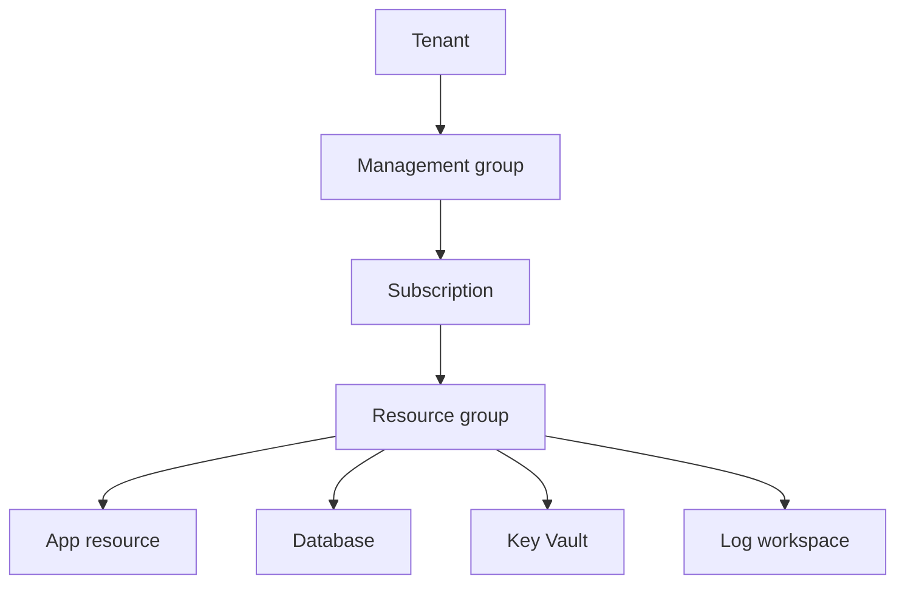

## Table of Contents

1. [The Problem](#the-problem)
2. [The Same App Jobs](#the-same-app-jobs)
3. [What Carries Over From AWS](#what-carries-over-from-aws)
4. [What Azure Changes](#what-azure-changes)
5. [Resource Manager](#resource-manager)
6. [Scopes And Callers](#scopes-and-callers)
7. [The First Azure Map](#the-first-azure-map)
8. [What Azure Takes Over](#what-azure-takes-over)
9. [Putting It All Together](#putting-it-all-together)
10. [What's Next](#whats-next)

## The Problem

The Orders API already has an AWS-shaped story in your head. Customer traffic enters through a front door. Code runs somewhere managed. Data leaves the laptop and lands in durable services. Secrets need a protected home. Logs and metrics need to outlive one terminal session.

Then the team asks for the Azure version.

The first instinct is to translate service names. ECS becomes Container Apps, RDS becomes Azure SQL Database, S3 becomes Blob Storage, CloudWatch becomes Azure Monitor. That helps for a minute, then Azure's different control plane and boundary map start to matter. If you carry over the AWS job map but miss the Azure boundaries, the design will still feel blurry.

The beginner question is:

> I understand the jobs a cloud app needs. How does Azure organize those jobs?

This article uses AWS as a bridge, then steps into Azure's own model: resources, Resource Manager, tenants, subscriptions, resource groups, regions, managed identities, and role assignments.

## The Same App Jobs

The app has not changed just because the provider changed. The Orders API still needs the same production jobs:

| App need | Plain job |
| --- | --- |
| Customers call the API | Public traffic reaches healthy code |
| Backend code keeps running | Compute hosts the app when no laptop is open |
| Order records survive deploys | A database stores structured state |
| Receipt files and exports survive | Object or file storage keeps artifacts |
| Private values stay private | A secret store holds sensitive config |
| The app calls other services | A workload identity gets limited access |
| Engineers debug later | Logs, metrics, traces, and alerts are kept |
| Changes reach production | Deployment leaves repeatable evidence |

This job list is the part that transfers well from AWS. A cloud provider gives managed homes to jobs that were hidden in the laptop, repo, shell, local database, and human memory.

The useful Azure habit starts there. Ask what job the app needs before asking what service name to memorize.

## What Carries Over From AWS

AWS is still useful as a learning bridge because it already taught the shape of a production system. The trick is to compare concepts by job, not to build a one-for-one dictionary.

| AWS idea | Useful memory | Azure idea to learn next |
| --- | --- | --- |
| Account | A hard place where resources, access, cost, and quotas become real | Tenant, subscription, and resource group split those concerns differently |
| Region | A geographic service home | Azure region |
| Availability Zone | A local failure boundary inside a Region | Azure availability zone |
| ARN | A string that identifies a resource strongly enough for policies and events | Azure resource ID |
| IAM role | A caller can receive permissions without using a human password | Managed identity plus Azure role assignment |
| CloudWatch | Evidence has to live outside the process | Azure Monitor, Log Analytics, and Application Insights |
| CloudFormation or service APIs | Infrastructure changes go through a control plane | Azure Resource Manager, ARM templates, and Bicep |

The table is a starting point, not a migration plan. Azure has services that resemble AWS services, but the boundary model is where many beginners get surprised.

In AWS, the account carries a lot of weight. It is a resource boundary, access boundary, billing boundary, and quota boundary. In Azure, those ideas are spread across the tenant, management group, subscription, resource group, and resource. That split is the first real Azure lesson.

## What Azure Changes

Azure starts with an identity home called a tenant. A tenant belongs to Microsoft Entra. Users, groups, applications, service principals, and many identity settings live there. If you sign in to the wrong tenant, the right subscription may look missing even if it exists.

The subscription is where Azure resources are created and billed. It is also a strong management scope for policy, role assignments, quotas, and cost. For someone coming from AWS, a subscription often feels like the closest daily match for "the place this workload lives," but it is not the whole account equivalent because identity lives at the tenant level.

The resource group is a major Azure-specific habit. It is a lifecycle and management container inside a subscription. AWS has tags, stacks, accounts, and service-specific groupings, but it does not have the same universal resource group idea. In Azure, resource groups show up everywhere: deployment, access scope, cleanup, inventory, and cost review.

That gives Azure a different shape:



The diagram is not a complete enterprise hierarchy. It is the first mental model. Azure asks you to know which tenant you are signed into, which subscription receives the resource, which resource group owns the lifecycle, and which region hosts the workload.

## Resource Manager

Azure Resource Manager, often shortened to ARM, is the deployment and management layer for Azure. When you create, update, delete, tag, lock, or assign access to many Azure resources, the request goes through Resource Manager.

That makes ARM more than a background implementation detail. It is the reason Azure can apply common management features across many services: role-based access control, tags, locks, templates, resource groups, and deployment scopes.

If AWS taught you to look for the service API that owns a resource, Azure adds one important first stop:

```text
Azure portal
Azure CLI
Azure PowerShell
REST API
SDK
        -> Azure Resource Manager
        -> Resource provider
        -> Resource
```

The resource provider is the service namespace that supplies a type of resource. `Microsoft.Web` supplies App Service resources. `Microsoft.Storage` supplies storage accounts. `Microsoft.Sql` supplies SQL resources. A resource ID includes that provider path, which is why Azure resource IDs are so useful later.

The first non-obvious truth is that control plane and data plane are different. Resource Manager can protect and manage the resource object, but the service may also have a separate data path. A lock can prevent deleting a storage account through the management plane, but it is not the same thing as protecting every blob from every data operation. Azure foundations should keep that distinction alive from the start.

## Scopes And Callers

Every Azure action has a caller. The caller might be a human user, a service principal used by a pipeline, a managed identity attached to an app, or another workload identity. Azure checks who the caller is and what the caller is allowed to do at the relevant scope.

Scopes form a chain:

```text
tenant
  management group
    subscription
      resource group
        resource
```

Role assignments can happen at several of those scopes. A role assignment at the subscription can affect many resource groups. A role assignment at one Key Vault can be much narrower. That should feel familiar if you know IAM policy scope from AWS, but the Azure nouns and inheritance path are different.

Managed identity is the Azure idea to recognize early. Instead of putting a long-lived password in app settings, an Azure app can use an identity managed by Azure. That identity still needs permission. The identity proves who the workload is; the role assignment says what it can do.

For Orders, the sentence should be specific:

```text
The Orders API uses managed identity mi-orders-prod
to read one Key Vault secret
inside subscription sub-orders-prod
at the Key Vault or resource group scope.
```

That sentence is better than "the app has Azure access." It names the caller, the permission target, and the boundary.

## The First Azure Map

Once the app jobs and Azure boundaries are visible, the first map becomes small enough to reason about.

| App job | First Azure idea | Example resource |
| --- | --- | --- |
| Resource ownership | Subscription and resource group | `sub-orders-prod`, `rg-orders-prod-uksouth` |
| Placement | Region and possibly zones | `uksouth`, zone-redundant where needed |
| Public entry | Runtime ingress, Front Door, Application Gateway, or API Management | App Service HTTPS endpoint for the first simple version |
| Compute | App Service, Container Apps, Functions, VMs, or AKS | App Service or Container Apps |
| Records | Relational or NoSQL data service | Azure SQL Database |
| Files | Object or file storage | Blob Storage |
| Secrets | Secret store | Key Vault |
| Workload access | Managed identity and role assignment | `mi-orders-prod` |
| Signals | Logs, metrics, traces, alerts | Azure Monitor, Log Analytics, Application Insights |
| Deployment | Repeatable app and infrastructure changes | GitHub Actions, Azure DevOps, Bicep, Terraform |

This table should not make Azure feel smaller than it is. It should make the first conversation less noisy. You can go deeper later. First, you need a map that says what each resource is doing for the app.

## What Azure Takes Over

Azure takes over infrastructure jobs, not product ownership.

If you use App Service, Azure operates much of the web hosting platform, but the team still owns the app code, runtime settings, dependencies, health, and release behavior. If you use Azure SQL Database, Azure manages much of the database platform, but the team still owns schema design, access, query behavior, retention choices, and recovery expectations. If you use managed identity, Azure removes a stored credential, but the team still owns the permission scope.

That is the same cloud lesson AWS taught, with different Azure mechanics. Managed does not mean ownerless. Serverless does not mean decisionless. A resource group does not guarantee a good lifecycle unless the team puts the right resources in it.

The first operating checklist should fit on one screen:

| Question | Azure evidence |
| --- | --- |
| What job does this resource do? | Resource type, service map, deployment note |
| Where does it live? | Tenant, subscription, resource group, region |
| Who can change it? | Role assignments and policy at scope |
| What can the app access? | Managed identity, Key Vault access, data permissions |
| What proves it works? | Logs, metrics, traces, alerts, deployment history |
| What remains ours? | Code, data meaning, access design, release, recovery, cost choices |

That checklist is the mental model. The rest of the Azure roadmap keeps adding detail to it.

## Putting It All Together

The opening question was not "what is the Azure equivalent of every AWS service?" That question creates a translation table and then runs out of breath.

The better question was how Azure organizes the same cloud app jobs. The answer is that the jobs carry over, while the boundaries change. Azure uses Resource Manager as the management layer. Microsoft Entra tenants hold identity. Subscriptions hold resources, billing, policy, and quotas. Resource groups organize lifecycle and management. Managed identities represent workloads. Role assignments grant permissions at scope. Resource IDs name exact resources.

With that map, the Orders API stops being a product menu. It becomes a system with jobs, boundaries, callers, evidence, and owners.

## What's Next

The next article turns the boundary map into a placement decision. Before creating resources, you need to know which tenant, subscription, resource group, region, and zone shape the workload should use.

---

**References**

- [What is Azure Resource Manager?](https://learn.microsoft.com/en-us/azure/azure-resource-manager/management/overview). Supports the Resource Manager, resource provider, resource group, scope, tag, lock, and management-layer explanations.
- [What is Microsoft Entra?](https://learn.microsoft.com/en-us/entra/fundamentals/what-is-entra). Supports the tenant and identity-home framing.
- [What is Azure role-based access control?](https://learn.microsoft.com/en-us/azure/role-based-access-control/overview). Supports the caller, role assignment, and scope model.
- [Managed identities for Azure resources](https://learn.microsoft.com/en-us/entra/identity/managed-identities-azure-resources/overview). Supports the managed identity explanation for workload access without stored credentials.
- [Control plane and data plane operations](https://learn.microsoft.com/en-us/azure/azure-resource-manager/management/control-plane-and-data-plane). Supports the distinction between Resource Manager operations and service data operations.
