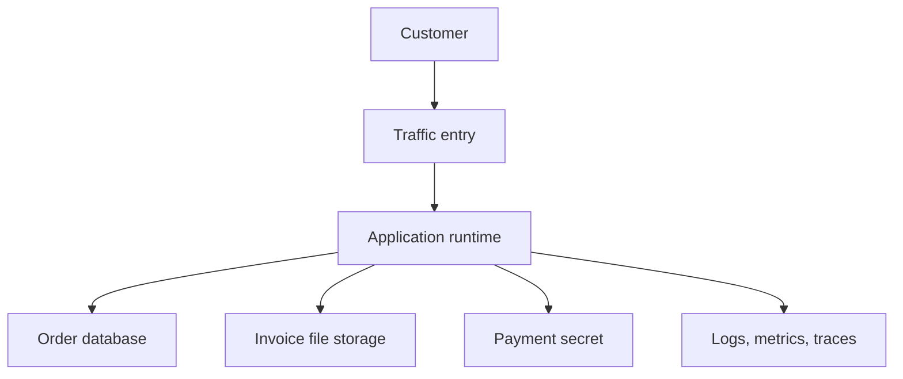
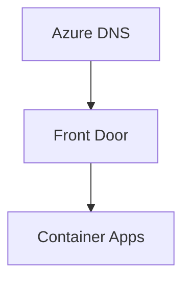
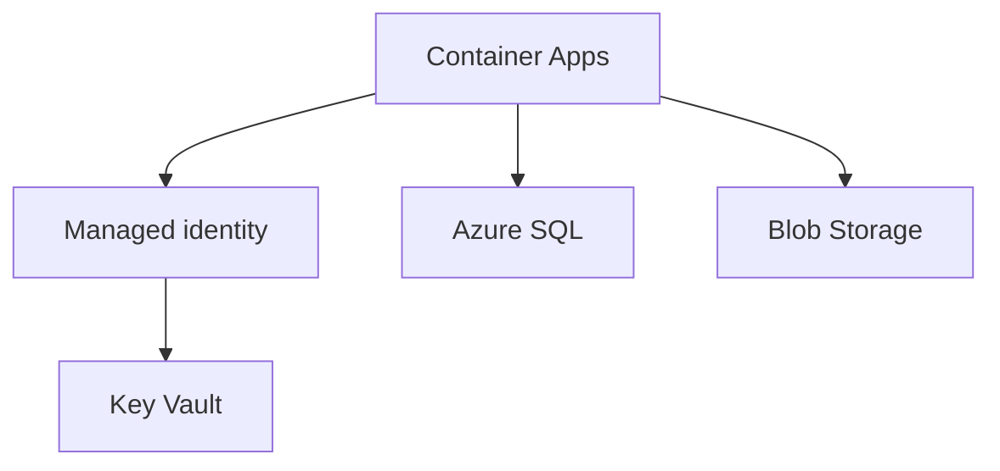
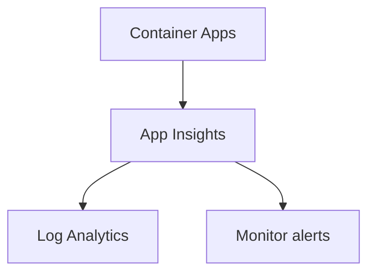

## Table of Contents

1. [The Three Placement Questions](#the-three-placement-questions)
2. [Regions Are The First Location Choice](#regions-are-the-first-location-choice)
3. [Availability Zones Are Local Failure Boundaries](#availability-zones-are-local-failure-boundaries)
4. [Single Region Multi Zone Or Multi Region](#single-region-multi-zone-or-multi-region)
5. [A First Placement Record For The Orders API](#a-first-placement-record-for-the-orders-api)
6. [Failure Evidence Everything Landed In One Zone](#failure-evidence-everything-landed-in-one-zone)
7. [Start With The Job](#start-with-the-job)
8. [If You Know The AWS Service Map](#if-you-know-the-aws-service-map)
9. [The First Production Map](#the-first-production-map)
10. [Deployment Images Resource Groups And Inventory](#deployment-images-resource-groups-and-inventory)
11. [Debugging With The Map](#debugging-with-the-map)
12. [Tradeoffs Simplicity Control And Ownership](#tradeoffs-simplicity-control-and-ownership)

## The Three Placement Questions

After the previous article, we know where an Azure resource belongs in the management hierarchy.
It belongs in a tenant, subscription, and resource group.
The next decision is where the workload runs and which service owns each job.

Those are different questions.
Mixing them creates confused designs.

The placement questions are:

```text
Which region should hold this workload?
Which local failure boundary should the workload survive?
Which services in that location own traffic, compute, data, identity, secrets, networking, and signals?
```

The first question is geographic.
It affects latency, data residency, service availability, and disaster recovery options.

The second question is about local resilience.
It asks whether one datacenter problem inside a region should take down the workload.
In Azure, that usually leads to availability zones, zone-redundant services, zonal resources, or a simpler regional deployment.

The third question is about job ownership.
It asks what service receives public traffic, what service runs code, what service stores state, what service holds secrets, what service proves health, and what service helps you recover.

The running example is still `orders-api`.
It receives checkout requests from UK customers, writes order records, stores generated invoice files, reads a payment provider secret, and needs enough telemetry for the platform team to debug a failed checkout.

The team is not building a global commerce platform yet.
It is building a first production Azure shape.
That matters because an early design should be safe, understandable, and easy to operate.
It should not copy the largest architecture diagram a cloud provider can draw.

Here is the starting path:



This diagram deliberately avoids product names.
Before we ask whether the runtime is App Service, Container Apps, Functions, AKS, or a VM, we should know what job the runtime is doing.
Before we ask whether traffic uses Front Door, Application Gateway, or a load balancer, we should know whether the app is public, private, regional, or global.

That job-first habit makes the Azure service list much less noisy.

## Regions Are The First Location Choice

An Azure region is a geographic area where Azure runs services.
Microsoft describes a region as physical facilities, datacenters, and networking infrastructure within a geography.
For a workload team, the region is the first location choice that appears in deployment plans, CLI commands, dashboards, and incident notes.

Region choice is not a style preference.
It affects the user experience and the operating model.

If most users are in the United Kingdom, `uksouth` may reduce latency compared with a region far away.
If a company has data residency requirements, the team must choose regions inside the required geography.
If a specific Azure service or SKU is unavailable in a region, the preferred architecture may not be deployable there.
If the region does not support availability zones for a service the team needs, the resilience plan changes.

The region also becomes part of the evidence trail.
When someone asks where production is running, "Azure" is not a useful answer.
"The production Orders API runs in `uksouth`, with a documented recovery plan for regional failure" is an answer an operator can test.

Azure CLI can show region metadata:

```bash
$ az account list-locations \
    --query "[?name=='uksouth'].{name:name, displayName:displayName, geographyGroup:metadata.geographyGroup, regionType:metadata.regionType}" \
    --output table
Name     DisplayName  GeographyGroup  RegionType
-------  -----------  --------------  ----------
uksouth  UK South     United Kingdom  Physical
```

The exact fields available can vary as Azure updates APIs, but the point is stable.
Treat region as deployment evidence.
Do not leave it as an assumption hidden in a portal click.

A first region decision for Orders might say:

```text
Primary region:
  uksouth

Reasons:
  near primary users
  inside required geography
  supports the intended compute and data services
  supports availability zones for the resources that need zone resilience

Non-goals for this phase:
  active-active global deployment
  cross-region write routing
  custom disaster recovery automation
```

The non-goals matter.
They stop the first design from quietly becoming too large.
A small production workload may need a good backup and restore plan before it needs active-active multi-region complexity.

Region pairs are another place beginners overgeneralize.
Some Azure regions are paired with another region, and some services use region pairs for geo-replication or geo-redundancy.
But deploying a resource to one region does not automatically create a working disaster recovery system in its pair.
Many newer regions are nonpaired, and many services can support geo-redundancy without relying only on region pairs.

So the correct question is not "what is the paired region?"
The better question is:
what does this service actually do when a region has a serious problem, and what must our team configure, test, and monitor?

## Availability Zones Are Local Failure Boundaries

Availability zones are separated groups of datacenters inside many Azure regions.
Each zone has independent power, cooling, and networking infrastructure.
They are close enough for low-latency connections, but separated enough to reduce the chance that one local outage affects all zones at once.

Zones help with a different problem from regions.
A region decision asks which geographic area should host the workload.
A zone decision asks what happens if one local part of that region has trouble.

Azure services support zones in different ways.
Some resources are zone-redundant, meaning the service spreads or replicates across zones for you in a supported region.
Some resources are zonal, meaning you choose one zone and the resource is pinned there.
Some resources are regional or nonzonal, meaning you do not choose a zone and should read the service reliability guidance to understand its behavior.

Here is the practical vocabulary:

| Shape | What it means | Beginner question |
|---|---|---|
| Regional or nonzonal | The resource runs in the region without an explicit zone choice | Is this acceptable if a zone has trouble? |
| Zonal | The resource is placed in one selected zone | What moves traffic or work if this zone fails? |
| Zone-redundant | The service spreads or replicates across multiple zones | Which tiers, regions, and settings are required? |
| Multi-region | Workload uses more than one region | How do data, traffic, failover, and recovery actually work? |

The dangerous assumption is that "region supports zones" means "my app is zone resilient".
It does not.
The region can support zones while a particular service, tier, configuration, or resource instance does not.

Another subtle detail is logical zone mapping.
Zone `1` in one subscription may not map to the same physical datacenter as zone `1` in another subscription.
That usually does not matter for a simple app.
It matters when teams try to coordinate zonal placement across subscriptions.
Use Azure's zone mapping evidence rather than assuming the numbers line up across tenants or subscriptions.

Zone-aware design is most useful when it changes a failure story.
For the Orders API, the question is not "can we mention zones in a diagram?"
The question is:
if one zone has a power or networking issue, can checkout still run, can the database still serve writes, and can operators see what happened?

That is why zone support must be checked service by service.
The runtime, database, storage account, vault, network path, and monitoring workspace can each have different reliability behaviors.

## Single Region Multi Zone Or Multi Region

A first Azure workload does not need the largest possible resilience pattern.
It needs a pattern that matches the failure the team is prepared to handle.

A single-region regional deployment is the simplest.
The resources run in one region.
The team relies on the service's normal availability behavior, backups, alerts, and a recovery plan.
This can be a reasonable starting point for internal tools, prototypes, or low-risk systems.
It is weak if the business expects the app to survive a zone-level problem with minimal interruption.

A single-region multi-zone design uses availability zones inside one region.
The app might run multiple runtime instances across zones, use a zone-redundant database setting where supported, and avoid pinning every critical piece to one zone.
This improves resilience against local datacenter or zone failures while keeping latency and operations simpler than a multi-region design.

A multi-region design places parts of the workload in more than one region.
That can protect against regional failure and can improve latency for a global user base.
It also introduces more moving parts:
traffic routing, data replication, conflict handling, secret and identity setup in each region, failover runbooks, cost, and regular tests.

The tradeoff looks like this:

| Pattern | What gets simpler | What gets harder |
|---|---|---|
| Single region | Cost, data flow, deployment, debugging | Regional and some local failure recovery |
| Single region with zones | Local failure resilience | Zone support checks, configuration, some cost |
| Multi-region | Regional failure options, global reach | Data replication, failover, consistency, operations |

For the Orders API, a good first decision might be:

```text
Start with one region: uksouth.
Use zone-redundant or multi-zone settings for the runtime and database where the chosen tiers support them.
Keep database backups and restore tests in scope.
Do not add a second active region until the team can operate the first one well.
```

That decision is not timid.
It is honest.
Multi-region systems fail too, and they fail in ways beginners cannot debug by intuition.
A second region without tested traffic failover and data recovery is a diagram, not resilience.

The right first design makes failure modes visible.
If the team chooses one region and one zone, everyone should know the tradeoff.
If the team chooses zone redundancy, the evidence should show which resources are actually zone redundant.
If the team chooses multi-region, there should be a tested story for reads, writes, secrets, deployments, and rollback.

## A First Placement Record For The Orders API

The placement record is the written decision that connects cloud vocabulary to the app.
It does not need to be long.
It does need to be specific enough that a teammate can check it.

For Orders, a first placement record might look like this:

```yaml
workload: orders-api
environment: production
tenant: devpolaris
subscription: DevPolaris Production
resourceGroup: rg-orders-prod-uksouth
primaryRegion: uksouth
regionReason:
  - near primary UK users
  - inside required data geography
  - supports selected compute and data services
  - supports availability zones for the reliability target
reliabilityShape: single-region-multi-zone
recoveryPosture:
  - database point-in-time restore tested quarterly
  - generated invoice files protected by storage data protection settings
  - deployment rollback uses previous container image or app slot
```

This record is not a replacement for architecture.
It is the first page of architecture.
It tells future readers which assumptions were intentional.

The matching command evidence should live near deployment logs:

```bash
$ az group show \
    --name rg-orders-prod-uksouth \
    --query "{name:name, location:location, tags:tags}" \
    --output json
{
  "name": "rg-orders-prod-uksouth",
  "location": "uksouth",
  "tags": {
    "app": "orders",
    "env": "prod",
    "owner": "platform",
    "region": "uksouth"
  }
}
```

The placement record should also name what is not yet solved:

```text
Known gaps:
  no active secondary region
  manual restore runbook for database recovery
  no cross-region traffic manager in phase one
  zone configuration must be checked after each service is chosen
```

That level of honesty is useful.
It prevents the word "production" from implying every advanced reliability feature.
It gives the team a backlog that matches real risk.

The record also helps during incidents.
If checkout is slow for UK users, the team can check regional health, runtime metrics, database latency, and network entry points in `uksouth` before searching every Azure region.
If a service SKU is unavailable in `uksouth`, the placement record becomes the place to discuss whether to change service choice, region choice, or resilience target.

## Failure Evidence Everything Landed In One Zone

The most frustrating resilience failure is the one that looked redundant on the whiteboard.
The architecture diagram had three boxes.
The actual deployment put every critical instance in the same zone, or used a service tier that did not support zone redundancy.

Imagine Orders runs on virtual machines for a legacy reason.
The design says "three app instances".
The evidence says something else:

```bash
$ az vm list \
    --resource-group rg-orders-prod-uksouth \
    --query "[].{name:name, zone:zones[0], size:hardwareProfile.vmSize}" \
    --output table
Name              Zone    Size
----------------  ------  -----------
vm-orders-prod-1  1       Standard_D4s_v5
vm-orders-prod-2  1       Standard_D4s_v5
vm-orders-prod-3  1       Standard_D4s_v5
```

There are three instances, but not three zone boundaries.
If zone `1` has a serious problem, the runtime may lose all instances.

The first fix is not to add a fourth VM.
The first fix is to make placement explicit:

```text
vm-orders-prod-1 -> zone 1
vm-orders-prod-2 -> zone 2
vm-orders-prod-3 -> zone 3
```

If the team uses a managed service instead of VMs, the evidence changes.
For an app platform, inspect the service's zone redundancy settings and the hosting plan or environment.
For a database, inspect the service tier and high availability settings.
For storage, inspect redundancy settings and data protection configuration.

Here is the beginner-safe diagnostic path:

```text
1. List the critical resources.
2. For each resource, identify whether it is regional, zonal, or zone-redundant.
3. Check whether the chosen region and tier support the intended shape.
4. Confirm the runtime has more than one instance where the service requires instances.
5. Record the evidence in deployment output or an operations note.
```

The deeper lesson is that resilience is not a label on the diagram.
It is behavior you can prove from service configuration and failure tests.

## Start With The Job

Once placement is clear, the Azure service map becomes easier.
Do not start with a product list.
Start with the job the system needs done.

The Orders API needs these jobs:

| Job | Plain question |
|---|---|
| Traffic entry | How do users reach the app safely? |
| Compute | Where does the application code run? |
| Data | Where do order records live? |
| File storage | Where do generated invoice files live? |
| Identity | Who or what is allowed to act? |
| Secrets | Where does the payment provider secret live? |
| Networking | Which paths are public, private, or restricted? |
| Observability | What evidence proves the app is healthy or broken? |
| Deployment | How does a new version reach runtime safely? |
| Cost and resilience | What does this shape cost, and what can fail? |

Now product names have a job to attach to.
Azure App Service is not "better than" Azure SQL Database because they do different jobs.
Azure Front Door is not a replacement for Key Vault.
Azure Monitor is not a database.
That sounds obvious until a beginner is staring at a portal full of service tiles.

For a small web backend, the first service map might include:

| Job | Common Azure services to recognize |
|---|---|
| Public DNS and edge traffic | Azure DNS, Azure Front Door |
| Regional app routing | Application Gateway, Azure Load Balancer, Container Apps ingress, App Service front end |
| Managed web runtime | Azure App Service |
| Managed container runtime | Azure Container Apps |
| Event-driven code | Azure Functions |
| Full server ownership | Azure Virtual Machines |
| Relational database | Azure SQL Database |
| Object and file storage | Azure Blob Storage, Azure Files |
| Secrets and keys | Azure Key Vault |
| Workload identity | Managed identities, service principals, Azure RBAC |
| Network boundary | Virtual networks, subnets, private endpoints, network security groups |
| Telemetry and alerts | Azure Monitor, Application Insights, Log Analytics, alert rules |
| Container images | Azure Container Registry |

This table is not meant to be memorized.
It is a first map.
Later Azure modules will go deeper into compute, networking, storage, databases, identity, security, observability, deployment, cost, and resilience.
For now, the map helps you put each unfamiliar service name into a sentence.

The sentence is:
this service owns this job in the system.

## If You Know The AWS Service Map

If you have seen AWS first, reuse the mental habit but not every exact assumption.
Both clouds split systems into traffic, compute, data, identity, network, observability, deployment, cost, and resilience jobs.
The names and boundaries differ.

Here is a rough translation:

| Job | AWS names you might know | Azure names to learn |
|---|---|---|
| Account or subscription boundary | AWS account | Azure subscription |
| Resource grouping | Tags, CloudFormation stack, naming | Resource group, tags |
| Identity provider and access | IAM, roles, policies | Microsoft Entra ID, Azure RBAC, managed identities |
| Object storage | S3 | Azure Blob Storage |
| Managed relational database | RDS | Azure SQL Database, Azure Database services |
| Managed web app runtime | Elastic Beanstalk, App Runner, ECS patterns | App Service, Container Apps |
| Event-driven functions | Lambda | Azure Functions |
| Metrics and logs | CloudWatch | Azure Monitor, Application Insights, Log Analytics |
| Secrets | Secrets Manager, Parameter Store | Key Vault |
| Edge and load balancing | CloudFront, ALB, NLB, Route 53 | Front Door, Application Gateway, Load Balancer, Azure DNS |

Use the table as orientation, not as a dictionary.
For example, an Azure resource group is not just an AWS tag.
It is a lifecycle and management container in Azure Resource Manager.
Azure managed identities are not just IAM roles with a new name.
They are Microsoft Entra identities assigned to Azure resources so workloads can get tokens without storing credentials.

The useful habit is job-based thinking.
If you know that CloudWatch is where you often look for metrics and logs in AWS, you have a head start:
in Azure, ask where Azure Monitor, Application Insights, and Log Analytics fit for this workload.
If you know that S3 is object storage, look for Blob Storage when the app needs durable unstructured files.
If you know Lambda is event-driven code, look at Azure Functions before reaching for a virtual machine.

The danger is copying architecture by name.
An AWS design with ECS, ALB, RDS, S3, Secrets Manager, and CloudWatch does not automatically become Container Apps, Application Gateway, Azure SQL, Blob Storage, Key Vault, and Azure Monitor.
That might be a good Azure design.
It might also be overbuilt, underbuilt, or mismatched to the team's operating skills.

Translate the jobs first.
Choose the Azure services second.

## The First Production Map

For Orders, we can sketch a first Azure production map without pretending it is the final architecture.
The map is easier to read as three small views: entry, dependencies, and evidence.







This map makes several choices:

The public name is separate from the runtime.
That lets the team reason about DNS and edge routing without confusing them with application code.

The app runs as a container in Azure Container Apps.
That gives the team a managed container runtime without operating Kubernetes directly.
Another team might choose App Service for a straightforward web app or Functions for event-driven work.
The job is compute.
The chosen service is one answer to that job.

The app uses a managed identity to read secrets.
That keeps a long-lived secret out of application settings and source code.
The identity still needs a role assignment or equivalent access on the vault.

Order records live in Azure SQL Database.
Generated invoice files live in Blob Storage.
Those are different data shapes.
Order records need relational queries and transactions.
Invoice files are durable objects.

Application telemetry flows to Application Insights and a Log Analytics workspace.
Alerts use Azure Monitor.
That gives the team evidence during failures rather than only a runtime to restart.

The same map can be written as an inventory:

```yaml
traffic:
  dns: Azure DNS
  edge: Azure Front Door
compute:
  runtime: Azure Container Apps
  imageRegistry: Azure Container Registry
data:
  relational: Azure SQL Database
  objects: Azure Blob Storage
identity:
  runtimeIdentity: user-assigned managed identity
secrets:
  vault: Azure Key Vault
observability:
  appTelemetry: Application Insights
  logStore: Log Analytics workspace
  alerts: Azure Monitor alert rules
```

The map is intentionally small.
It does not yet include private endpoints, a full virtual network design, deployment slots or revisions strategy, backup vaults, cost budgets, or disaster recovery automation.
Those are real topics.
They belong in later decisions once the first shape is clear.

## Deployment Images Resource Groups And Inventory

The service map becomes real only when resources can be found.
That means deployment output and inventory matter.

Suppose the Orders team deploys the container image `orders-api:2026.05.11.4f62c21`.
The image is not the running service.
It is a build artifact.
Azure Container Registry can store it, and Container Apps can run it.
Those are two different jobs.

The deployment summary should connect image, runtime, resource group, and region:

```text
Image:
  registry: acrdevpolarisprod.azurecr.io
  repository: orders-api
  tag: 2026.05.11.4f62c21

Runtime:
  service: Azure Container Apps
  app: ca-orders-prod
  resource group: rg-orders-prod-uksouth
  region: uksouth

Identity:
  user-assigned managed identity: id-orders-api-prod

Signals:
  Application Insights: appi-orders-prod
  Log Analytics workspace: law-platform-prod
```

After deployment, inventory should prove that the expected resources exist:

```bash
$ az resource list \
    --resource-group rg-orders-prod-uksouth \
    --query "[].{name:name, type:type, location:location}" \
    --output table
Name                 Type                                             Location
-------------------  -----------------------------------------------  --------
ca-orders-prod       Microsoft.App/containerApps                      uksouth
cae-orders-prod      Microsoft.App/managedEnvironments                uksouth
acrdevpolarisprod    Microsoft.ContainerRegistry/registries           uksouth
id-orders-api-prod   Microsoft.ManagedIdentity/userAssignedIdentities uksouth
kv-orders-prod       Microsoft.KeyVault/vaults                        uksouth
sql-orders-prod      Microsoft.Sql/servers/databases                  uksouth
stordersproduks001   Microsoft.Storage/storageAccounts                uksouth
appi-orders-prod     Microsoft.Insights/components                    uksouth
```

This output can reveal design drift.
If the registry is shared across many workloads, it may not belong in the Orders resource group.
If the Log Analytics workspace is platform-owned, it may live in a platform observability group.
If a database shows a different region, the placement record needs to explain why.

Inventory is not busywork.
It is how you discover whether the deployed system matches the architecture you think you have.

The same habit applies to tags:

```bash
$ az resource list \
    --tag app=orders \
    --query "[].{name:name, type:type, group:resourceGroup, env:tags.env}" \
    --output table
Name                 Type                                             Group                    Env
-------------------  -----------------------------------------------  -----------------------  ----
ca-orders-prod       Microsoft.App/containerApps                      rg-orders-prod-uksouth   prod
kv-orders-prod       Microsoft.KeyVault/vaults                        rg-orders-prod-uksouth   prod
stordersproduks001   Microsoft.Storage/storageAccounts                rg-orders-prod-uksouth   prod
```

When tags, names, groups, and regions agree, the system is easier to operate.
When they disagree, decide whether the exception is intentional or the inventory is lying.

## Debugging With The Map

When checkout fails, do not debug "Azure".
Debug one job at a time.

Start with the symptom.
Then ask which service owns the first useful evidence.

| Symptom | First job to inspect | Useful evidence |
|---|---|---|
| Domain does not resolve | Public name | DNS record, Front Door endpoint, certificate status |
| Users see gateway errors | Traffic entry | Front Door or Application Gateway backend health |
| API returns 500 | Compute and app code | Application Insights failures, logs, revision health |
| App cannot read payment secret | Identity and secrets | Managed identity, Key Vault role assignment, vault access logs |
| App cannot write orders | Data | SQL connectivity, firewall or private endpoint, database errors |
| Invoice export is missing | Object storage | Blob container, object name, application log, storage metrics |
| No telemetry appears | Observability | Diagnostic settings, instrumentation key or connection string, workspace ingestion |
| Deployment rolled out wrong version | Deployment | Image tag, revision, slot, commit SHA, deployment logs |

This table is not a replacement for deep service knowledge.
It is a way to choose the first door.

Imagine users report failed checkouts.
The app logs show:

```text
2026-05-11T09:42:18Z ERROR checkout request failed
operationId=7cf8a18a4d0f4b61
dependency=KeyVault
target=https://kv-orders-prod.vault.azure.net/secrets/payment-provider-key
status=403
message=Caller is not authorized to perform action on resource
```

The first useful job is not DNS.
It is not the database.
It is identity and secrets.
The target is Key Vault, the caller should be the runtime identity, and the failure is authorization.

A focused check follows:

```bash
$ az role assignment list \
    --assignee 6a44a4a0-3333-4555-9666-1bdc1234ee71 \
    --scope /subscriptions/8fd0aa2a-3333-4444-8888-c33333333333/resourceGroups/rg-orders-prod-uksouth/providers/Microsoft.KeyVault/vaults/kv-orders-prod \
    --query "[].{role:roleDefinitionName, scope:scope}" \
    --output table
Role    Scope
------  -----
```

No role assignment appears at the vault scope.
The likely fix is not to put the secret in an app setting.
The likely fix is to grant the runtime identity the narrow secret-reading role it needs, then verify the app can read the secret.

Now imagine the symptom is different:

```text
2026-05-11T10:03:44Z WARN checkout latency high
operationId=98a86be4c22144bb
dependency=AzureSQL
durationMs=5210
message=timeout while opening connection
```

The first useful job is data connectivity.
Inspect the SQL database, firewall or private endpoint path, regional health, connection string source, and database metrics.
Do not rotate Key Vault secrets just because Key Vault is in the architecture diagram.

The map keeps incident response from becoming a tour of every Azure service the team has ever heard of.

## Tradeoffs Simplicity Control And Ownership

Every Azure service choice trades simplicity, control, and ownership.
The beginner mistake is asking which service is best without saying what the team wants to own.

App Service owns a lot of web hosting work for you.
That can be ideal for a conventional backend because the team can focus on code, configuration, scaling, domains, certificates, and deployment rather than servers.
The tradeoff is less control over the underlying platform than running your own virtual machines.

Container Apps lets a team run containers with managed ingress, revisions, scaling, and environment features without directly operating Kubernetes.
That can be a good fit when the deployment artifact is already a container and the team wants serverless container operations.
The tradeoff is that some Kubernetes-level controls are intentionally hidden.

Azure Functions is strong when work is event-driven:
file arrived, queue message received, timer fired, HTTP trigger called.
The tradeoff is that function hosting, cold start behavior, execution duration, bindings, and plan choice become part of the design.

Virtual Machines give the most familiar server control.
They also give the team patching, hardening, disk, backup, identity, monitoring, and availability responsibilities that managed platforms absorb in other models.

The same tradeoff appears in data services.
Azure SQL Database handles much of the database platform management, including patching and built-in maintenance operations.
The team still owns schema design, query behavior, data access, backup expectations, and recovery tests.
Blob Storage is excellent for durable unstructured objects, but it is not a relational database.
Key Vault protects secrets, keys, and certificates, but it does not design least privilege for you.
Azure Monitor collects and helps analyze telemetry, but it does not decide which user-impacting signals deserve alerts.

So the core services map should end with ownership:

```text
If Azure manages it, learn what Azure guarantees and what settings you choose.
If your team manages it, make the operational work explicit.
If nobody owns it, the system owns you during the incident.
```

For Orders, a conservative first ownership model might be:

| Area | Azure owns more of | Team still owns |
|---|---|---|
| Container runtime | Platform infrastructure, revision mechanics, managed ingress features | Image quality, config, scaling settings, identity, health checks |
| SQL Database | Engine patching, backups, high availability features by tier | Schema, queries, access, recovery objectives, restore tests |
| Blob Storage | Durable object service, redundancy options by account setting | Container design, object names, lifecycle policy, accidental deletion protection |
| Key Vault | Secret store, object versioning, access enforcement | Secret rotation process, identity scope, network rules, app usage |
| Azure Monitor | Telemetry platform, queries, alerts machinery | What to collect, what to alert on, who responds |

This is where the first Azure map becomes useful.
We know the workload's tenant, subscription, resource group, region, zone posture, services, identities, and evidence.
That does not make the app perfect.
It makes the next module learnable.

When you see a new Azure service, place it with three questions:

```text
Where does it run?
What job does it own?
What evidence proves it is healthy, reachable, secured, and paid for?
```

Those questions are the bridge from Azure Foundations into the deeper Azure modules.

---

**References**

- [What are Azure regions?](https://learn.microsoft.com/en-us/azure/reliability/regions-overview) - Used for Azure regions, geographies, data residency boundaries, region selection factors, paired and nonpaired regions, and nonregional service considerations.
- [What are Azure availability zones?](https://learn.microsoft.com/en-us/azure/reliability/availability-zones-overview) - Used for availability zones as separated datacenter groups, zone-redundant and zonal resource behavior, logical zone mapping, and zone guidance.
- [Azure region pairs and nonpaired regions](https://learn.microsoft.com/en-us/azure/reliability/cross-region-replication-azure) - Used for the caution that region pairs do not automatically create disaster recovery and that many newer regions use availability zones as a primary resilience option.
- [Choose an Azure compute service](https://learn.microsoft.com/en-us/azure/architecture/guide/technology-choices/compute-decision-tree) - Used for the compute service map across Virtual Machines, App Service, Functions, AKS, Container Apps, Container Instances, Azure Batch, and related hosting models.
- [What is Azure SQL Database?](https://learn.microsoft.com/en-us/azure/azure-sql/database/sql-database-paas-overview) - Used for Azure SQL Database as a fully managed PaaS database engine with built-in maintenance, backups, high availability features, and scaling models.
- [Azure Key Vault keys, secrets, and certificates overview](https://learn.microsoft.com/en-us/azure/key-vault/general/about-keys-secrets-certificates) - Used for Key Vault object types, identifiers, versioning, and the distinction between secrets, keys, certificates, and storage account keys.
- [Azure Monitor overview](https://learn.microsoft.com/en-us/azure/azure-monitor/fundamentals/overview) - Used for Azure Monitor as the telemetry, metrics, logs, traces, events, alerting, visualization, and troubleshooting platform.
