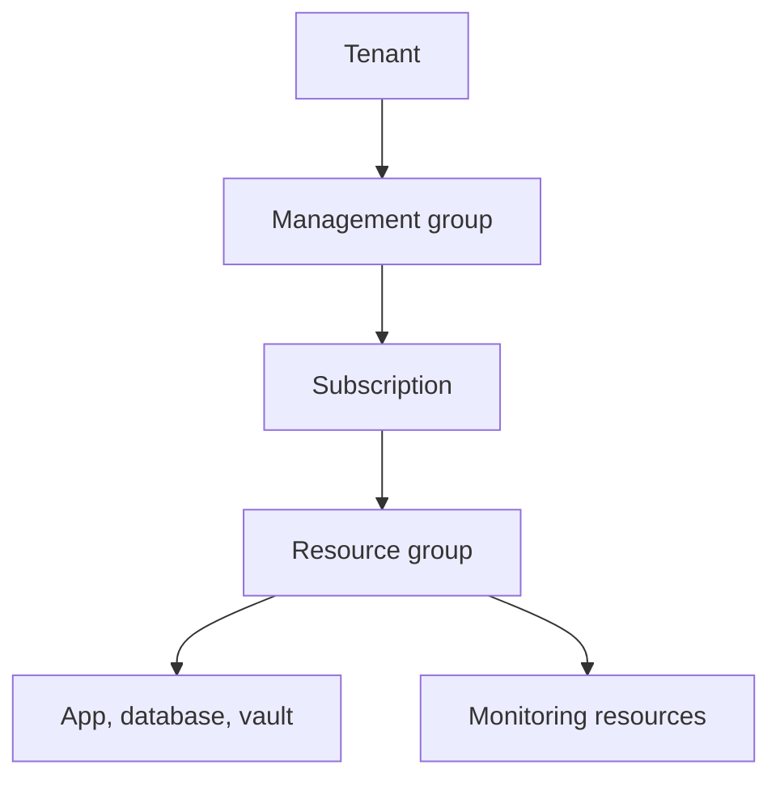
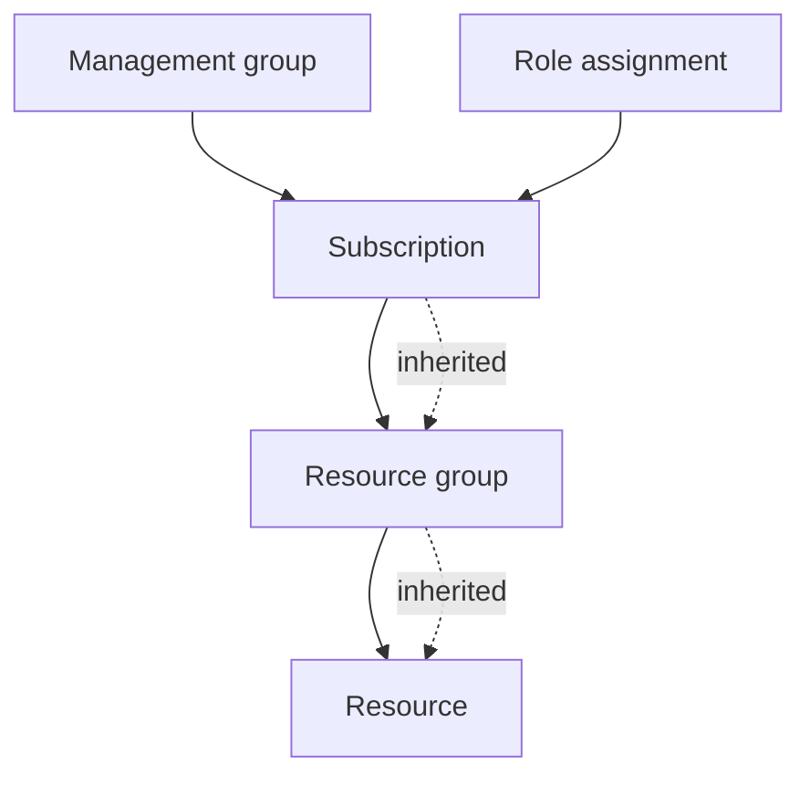

## Table of Contents

1. [What The Cloud Is Trying To Organize](#what-the-cloud-is-trying-to-organize)
2. [The Boundary Check Before You Deploy](#the-boundary-check-before-you-deploy)
3. [Tenants Are The Identity Home](#tenants-are-the-identity-home)
4. [Subscriptions The Billing And Policy Boundary](#subscriptions-the-billing-and-policy-boundary)
5. [Resource Groups The Lifecycle Container](#resource-groups-the-lifecycle-container)
6. [Resources Names Tags And Resource IDs](#resources-names-tags-and-resource-ids)
7. [Scope RBAC And Policy Inheritance](#scope-rbac-and-policy-inheritance)
8. [The Example One Orders API Needs A Home](#the-example-one-orders-api-needs-a-home)
9. [Artifacts That Prove Where You Are](#artifacts-that-prove-where-you-are)
10. [Failure Modes For Beginners](#failure-modes-for-beginners)
11. [The Review Habit Before You Change Azure](#the-review-habit-before-you-change-azure)

## What The Cloud Is Trying To Organize

The first hard part of Azure is not the service list.
It is knowing where a resource belongs before the resource exists.

On a laptop, an app, a database, a log file, and a secret might all sit inside one folder or one developer account.
In Azure, those same concerns are split into managed resources.
That split is useful because teams can secure, bill, tag, monitor, and delete resources separately.
It is also the source of many beginner mistakes.

The cloud is trying to organize four everyday questions:

| Question | Azure answer |
|---|---|
| Who can sign in and be represented? | Tenant |
| Which broad business or environment boundary pays and receives policy? | Subscription |
| Which resources should be managed together? | Resource group |
| Which exact thing is the command changing? | Resource ID |

Those are not decorative labels.
They are operating boundaries.
When a deployment goes to the wrong subscription, the app can look missing even though it was created perfectly.
When unrelated systems share one resource group, a cleanup command can become dangerous.
When tags are inconsistent, cost and ownership reports become a guessing game.
When a role assignment is granted too high in the hierarchy, a small automation identity can quietly gain access to far more than it needs.

Azure Resource Manager, often shortened to ARM, is the management layer that receives create, update, and delete requests for Azure resources.
The portal, Azure CLI, PowerShell, SDKs, REST APIs, Bicep, ARM templates, and Terraform providers all end up talking to that management plane for many control-plane operations.
That is why the same basic shape appears everywhere.
You are rarely just "making a database".
You are making a resource of a specific type, in a specific subscription, in a specific resource group, with a specific name, location, tags, and permissions around it.

Here is the small map we need first:



You do not need to master every box on day one.
You do need to learn the habit behind the boxes.
Before a command changes Azure, ask what boundary it targets and what evidence proves that boundary.

## The Boundary Check Before You Deploy

Most cloud incidents begin with a normal action in the wrong place.
A developer deploys to the old subscription.
A pipeline creates a resource group in the lab environment.
A cleanup script deletes a broad group because its name looked temporary.
A role assignment is granted at subscription scope because the resource group permission failed once and nobody came back to narrow it.

The boundary check is a short pause before creating, changing, or deleting anything:

```text
Which tenant am I signed into?
Which subscription is active?
Which resource group owns this app or environment?
Which resource ID will this command target?
Which identity is allowed to make the change?
```

This is not bureaucracy.
It is the safety step that turns Azure from a giant console into an auditable system.

Azure CLI makes the first two questions visible:

```bash
$ az account show --query "{tenant:tenantId, subscription:name, subscriptionId:id}" --output table
Tenant                                Subscription              SubscriptionId
------------------------------------  ------------------------  ------------------------------------
9a6d6b5b-1111-4222-9333-4aa1c234abcd  DevPolaris Production     8fd0aa2a-2222-4444-8888-721b1234dcba
```

Notice what this output proves and what it does not prove.
It proves the active tenant and subscription for the CLI session.
It does not prove that the resource group exists.
It does not prove that the target resource belongs to the Orders API.
It does not prove that the signed-in identity should have production rights.

The next check narrows the target:

```bash
$ az group show --name rg-orders-prod-uksouth --query "{name:name, location:location, tags:tags}" --output json
{
  "name": "rg-orders-prod-uksouth",
  "location": "uksouth",
  "tags": {
    "app": "orders",
    "env": "prod",
    "owner": "platform",
    "costCenter": "dp-commerce"
  }
}
```

Now the command has evidence for the resource group boundary.
The group name and tags agree on the workload and environment.
The subscription name says production.
That still is not enough for a destructive change, but it is a much better starting point than clicking through the portal and trusting memory.

This is why Azure foundations begin with organization rather than a service.
The service can be App Service, Container Apps, SQL Database, Key Vault, or Storage.
The first operating question stays the same:
where exactly will this thing live?

## Tenants Are The Identity Home

A tenant is the identity home for an organization in Microsoft Entra ID.
It contains the users, groups, applications, service principals, managed identities, and directory settings that Azure uses to recognize callers.

For a beginner, the easiest way to think about the tenant is:
this is where Azure learns who or what is asking.

That "what" matters.
Cloud systems are full of non-human callers.
A GitHub Actions workflow, an Azure DevOps pipeline, a web app, a virtual machine, and a scheduled job can all need permissions.
Azure represents those callers through identities too.

The tenant does not usually feel like the daily workspace for an app team.
Most app teams spend more time choosing subscriptions and resource groups.
But when sign-in, identity lookup, app registration, managed identity, or cross-tenant access gets involved, the tenant becomes the first clue.

Suppose the Orders API has a deployment pipeline.
The pipeline needs to create an App Service update and read a container image.
If the pipeline identity lives in the wrong tenant, assigning it access in the production subscription will fail or create confusing evidence.
The subscription can be correct, the resource group can be correct, and the identity can still be the wrong principal.

A useful identity check looks like this:

```bash
$ az ad signed-in-user show --query "{displayName:displayName, userPrincipalName:userPrincipalName, id:id}" --output json
{
  "displayName": "Maya Singh",
  "userPrincipalName": "maya@devpolaris.example",
  "id": "1f889a7b-1111-4a22-8c55-f0a91234abcd"
}
```

For automation, the evidence usually comes from a service principal or managed identity rather than a person:

```bash
$ az identity show \
    --resource-group rg-orders-prod-uksouth \
    --name id-orders-api-prod \
    --query "{name:name, principalId:principalId, clientId:clientId}" \
    --output json
{
  "name": "id-orders-api-prod",
  "principalId": "6a44a4a0-3333-4555-9666-1bdc1234ee71",
  "clientId": "0f8389f2-4444-4888-9999-47181234f95a"
}
```

The non-obvious truth is that identity and permission are separate.
Creating an identity only creates a caller.
It does not automatically mean the caller can read Key Vault, pull from a registry, or update a web app.
Permission is granted later, at a scope.
That scope might be a management group, subscription, resource group, or individual resource.

This separation is good engineering.
It lets a workload have a stable identity while permissions are narrowed around what the workload actually needs.
It also gives you a clear diagnostic path:
first identify the caller, then inspect the role assignment, then inspect the target resource.

## Subscriptions The Billing And Policy Boundary

A subscription is the first Azure boundary most engineers touch every day.
It is where resources are created, usage is billed, quotas apply, and broad governance settings often land.

A subscription is not exactly the same thing as an environment, but many teams use subscriptions to separate environments because the boundary is strong enough to matter.
For example, `DevPolaris Development`, `DevPolaris Staging`, and `DevPolaris Production` might be three subscriptions under the same tenant.

That shape gives the team a practical safety property.
A developer can have broad rights in development without also having broad rights in production.
A cost report can show production spend separately.
A policy can require stronger controls in production.
A quota increase can be requested for the subscription that actually needs it.

The mistake is treating the subscription as a folder.
It is not a place to casually mix unrelated trust levels.
If a production deployment identity can create resources anywhere in the production subscription, that may be acceptable for a small platform team and too broad for a service team.
If several teams share one subscription, tags and resource group boundaries become more important because the subscription alone no longer says who owns what.

The active subscription is visible in the CLI:

```bash
$ az account list --query "[].{name:name, id:id, isDefault:isDefault}" --output table
Name                         Id                                    IsDefault
---------------------------  ------------------------------------  ---------
DevPolaris Development       d1f8e3ac-1111-4444-a8c0-a11111111111  False
DevPolaris Staging           a6b1ed44-2222-4444-8fd2-b22222222222  False
DevPolaris Production        8fd0aa2a-3333-4444-8888-c33333333333  True
```

Changing the active subscription is explicit:

```bash
$ az account set --subscription "DevPolaris Production"
```

In a pipeline, do not rely on a human's active CLI profile.
The subscription should be part of the deployment configuration.
The pipeline should print the subscription ID before it changes resources.
That small line in the log often saves hours during an incident.

```text
Deploy target
  tenant:       9a6d6b5b-1111-4222-9333-4aa1c234abcd
  subscription: 8fd0aa2a-3333-4444-8888-c33333333333
  resourceGroup: rg-orders-prod-uksouth
  commit:       4f62c21
```

The tradeoff is that more subscriptions create more governance work.
You need role assignments, budgets, policies, network connectivity, and monitoring patterns across them.
The answer is not "one subscription per tiny thing".
The answer is to separate boundaries that need different billing, policy, blast radius, or administrative trust.

## Resource Groups The Lifecycle Container

A resource group is a container for resources that should be managed together.
The phrase "managed together" does most of the work.

If the Orders API, its App Service plan, its App Service app, its Application Insights resource, its dashboard, and its alert rules are deployed, updated, reviewed, and deleted as one unit, they are good candidates for the same resource group.
If the shared virtual network is owned by a platform team and reused by many apps, it probably belongs somewhere else.
If the production database has a different backup, recovery, and change process from the stateless web app, the team should at least discuss whether it belongs in the same group.

Azure lets resources in one resource group live in different regions.
The resource group itself also has a location, but that location is about where group metadata is stored, not a rule that every resource inside must run there.
That detail surprises people.
It means `rg-orders-prod-uksouth` can technically contain a storage account in `westeurope`.
The question is whether that mismatch is intentional and documented.

Resource group naming should explain the lifecycle boundary:

```text
rg-orders-prod-uksouth
rg-orders-staging-uksouth
rg-shared-network-prod-uksouth
rg-platform-observability-prod
```

The `rg-` prefix is not magic.
It is useful because Azure has many resource types and humans read lists quickly under pressure.
The more important part is the app, environment, and location signal.

A good resource group review asks:

| Review question | Why it matters |
|---|---|
| Do these resources deploy together? | If not, one deployment may disturb another system |
| Do they have the same owner? | If not, incident response becomes confusing |
| Do they have the same deletion lifecycle? | If not, cleanup becomes risky |
| Do they share the same environment? | If not, staging and production can leak into each other |
| Do tags identify app, environment, owner, and cost center? | If not, reports and automation lose context |

Resource group deletion is convenient in labs because it deletes the resources inside the group.
That same behavior is dangerous in production.
Before deleting a production group, list the resources and read them as a system:

```bash
$ az resource list \
    --resource-group rg-orders-prod-uksouth \
    --query "[].{name:name, type:type, location:location}" \
    --output table
Name                    Type                                      Location
----------------------  ----------------------------------------  --------
plan-orders-prod        Microsoft.Web/serverfarms                 uksouth
app-orders-prod         Microsoft.Web/sites                       uksouth
appi-orders-prod        Microsoft.Insights/components             uksouth
law-platform-prod       Microsoft.OperationalInsights/workspaces  uksouth
kv-orders-prod          Microsoft.KeyVault/vaults                 uksouth
```

This output tells a story.
The group contains the runtime, monitoring component, and vault.
It also points at a Log Analytics workspace named `law-platform-prod`, which may be shared.
If that workspace is truly shared, it should probably not live in an app-owned resource group.
If it is app-specific, the name should stop implying platform ownership.

That is the real value of resource groups.
They make ownership visible enough to discuss before the bill, access model, or delete button teaches the lesson for you.

## Resources Names Tags And Resource IDs

An Azure resource is a manageable item such as a web app, storage account, virtual network, SQL database, Key Vault, managed identity, alert rule, or dashboard.
Azure resources have names, types, locations, tags, and resource IDs.
Those fields solve different jobs.

Names help humans.
Tags help inventory, cost, ownership, and automation.
Resource IDs help tools point to the exact target.

Do not make one field do every job.
A name like `orders-prod` is readable, but it is not globally unique across every Azure service.
A tag like `env=prod` is useful for reporting, but it is not a permission boundary by itself.
A resource ID is precise, but too long for humans to use as the only operating vocabulary.

Here is a storage account as Azure sees it:

```json
{
  "id": "/subscriptions/8fd0aa2a-3333-4444-8888-c33333333333/resourceGroups/rg-orders-prod-uksouth/providers/Microsoft.Storage/storageAccounts/stordersproduks001",
  "name": "stordersproduks001",
  "type": "Microsoft.Storage/storageAccounts",
  "location": "uksouth",
  "tags": {
    "app": "orders",
    "env": "prod",
    "owner": "platform",
    "costCenter": "dp-commerce"
  }
}
```

Read the `id` from left to right:

```text
subscription
  -> resource group
  -> provider namespace
  -> resource type
  -> resource name
```

That path is why resource IDs are so useful in scripts and audit logs.
They remove ambiguity.
If two resources have similar names, the ID still tells you which subscription and group own the target.

Tags are not inherited automatically from a resource group to the resources inside it.
That matters because teams often tag a resource group and assume every cost line or search result will carry the same metadata.
If resource-level tags are required for reporting or automation, enforce them through policy or deployment tooling rather than memory.

Tags should also never contain secrets or sensitive values.
Tags appear in places that are meant for discovery, reporting, exports, deployment history, and operations.
Use Key Vault for secrets.
Use tags for labels you would be comfortable showing in an inventory report.

A practical starting tag set is small:

```yaml
app: orders
env: prod
owner: platform
costCenter: dp-commerce
dataClass: internal
```

The tradeoff is between consistency and friction.
If you require twenty tags before a developer can create a test resource, people will find ways around the system.
If you require no tags, production inventory becomes archaeology.
Start with the tags that answer ownership, environment, and cost, then add only the fields that real operations use.

## Scope RBAC And Policy Inheritance

Azure access is scoped.
That one sentence explains a lot of behavior that otherwise feels mysterious.

When you assign an Azure role, you assign it to a security principal at a scope.
The security principal might be a user, group, service principal, or managed identity.
The scope might be a management group, subscription, resource group, or individual resource.
Lower scopes inherit assignments from higher scopes.

The practical shape looks like this:



If a group receives `Reader` at subscription scope, members can read resources in resource groups below that subscription.
If a deployment identity receives `Contributor` at one resource group, it can manage resources in that group but not other groups in the subscription.
If an app's managed identity receives `Key Vault Secrets User` on one vault, it can read secrets there without becoming a contributor to the whole resource group.

The beginner mistake is widening scope to make an error disappear.
The deployment failed because the identity could not update one App Service, so someone granted `Contributor` at subscription scope.
The immediate deployment works.
The long-term blast radius grows.

A better diagnostic path keeps actor, action, target, and scope separate:

```text
Actor:  id-orders-api-prod
Action: read secret value
Target: kv-orders-prod
Scope:  /subscriptions/.../resourceGroups/rg-orders-prod-uksouth/providers/Microsoft.KeyVault/vaults/kv-orders-prod
Role:   Key Vault Secrets User
```

Now the fix has a shape.
If the app cannot read a secret, inspect the managed identity, the vault, the role assignment, and the vault's network or authorization settings.
Do not start by granting broad rights.

You can inspect role assignments with Azure CLI:

```bash
$ az role assignment list \
    --assignee 6a44a4a0-3333-4555-9666-1bdc1234ee71 \
    --scope /subscriptions/8fd0aa2a-3333-4444-8888-c33333333333/resourceGroups/rg-orders-prod-uksouth \
    --query "[].{role:roleDefinitionName, scope:scope}" \
    --output table
Role                  Scope
--------------------  -------------------------------------------------------------------------
Key Vault Secrets User /subscriptions/8fd0aa2a-3333-4444-8888-c33333333333/resourceGroups/rg-orders-prod-uksouth/providers/Microsoft.KeyVault/vaults/kv-orders-prod
Monitoring Reader      /subscriptions/8fd0aa2a-3333-4444-8888-c33333333333/resourceGroups/rg-orders-prod-uksouth
```

Policy works with a similar hierarchy.
A policy assignment at subscription scope can apply to resource groups and resources below it.
That is useful when production must require tags, allowed regions, or certain security settings.
It also means a denied deployment may be failing because of a policy inherited from above the resource group.

The operating habit is the same for RBAC and policy:
start with the narrow target, then walk upward through the hierarchy only when the evidence requires it.

## The Example One Orders API Needs A Home

Let's place one simple system.

The DevPolaris team owns `orders-api`, a Node backend that receives checkout requests, writes order records, emits application logs, and reads one payment provider secret.
The team is moving its production runtime into Azure.
We are not choosing every service yet.
We are choosing the home the services will live in.

The first draft looks like this:

```text
Tenant:
  DevPolaris Microsoft Entra tenant

Subscription:
  DevPolaris Production

Resource group:
  rg-orders-prod-uksouth

Resources:
  App runtime
  Database
  Key Vault
  Managed identity
  Monitoring resources

Tags:
  app=orders
  env=prod
  owner=platform
  costCenter=dp-commerce
```

That map is intentionally boring.
Boring is good here.
It gives every later decision somewhere to attach.

If the app will run in App Service, the App Service app and its plan need a subscription and resource group.
If the app will run in Container Apps, the container app, environment, and managed identity need a home.
If the app reads from Key Vault, the vault lives in a resource group and the app identity receives scoped permission.
If logs go to Azure Monitor, diagnostic settings and workspaces need ownership too.

The resource group can be created with evidence baked in:

```bash
$ az group create \
    --name rg-orders-prod-uksouth \
    --location uksouth \
    --tags app=orders env=prod owner=platform costCenter=dp-commerce
{
  "id": "/subscriptions/8fd0aa2a-3333-4444-8888-c33333333333/resourceGroups/rg-orders-prod-uksouth",
  "location": "uksouth",
  "managedBy": null,
  "name": "rg-orders-prod-uksouth",
  "properties": {
    "provisioningState": "Succeeded"
  },
  "tags": {
    "app": "orders",
    "costCenter": "dp-commerce",
    "env": "prod",
    "owner": "platform"
  },
  "type": "Microsoft.Resources/resourceGroups"
}
```

The response is more than confirmation.
It is a record of scope.
It includes the subscription ID, resource group name, location, tags, provisioning state, and resource type.

Now imagine a second team owns the Billing API.
Should Billing share this group?
Probably not if it deploys on a different schedule, has different owners, and needs a separate cleanup path.
It can still call Orders over the network.
It does not need to share a lifecycle container.

This is the first real Azure design tradeoff.
Large groups are convenient because there are fewer boxes.
Small groups are safer because ownership and deletion are clearer.
The healthy middle is to group resources by lifecycle and ownership, then document exceptions.

## Artifacts That Prove Where You Are

Azure work should leave evidence.
That evidence is how you debug calmly when the portal looks busy, the pipeline is red, or a teammate asks whether production was touched.

Start with the active account:

```bash
$ az account show --query "{tenant:tenantId, subscription:name, subscriptionId:id}" --output json
{
  "tenant": "9a6d6b5b-1111-4222-9333-4aa1c234abcd",
  "subscription": "DevPolaris Production",
  "subscriptionId": "8fd0aa2a-3333-4444-8888-c33333333333"
}
```

Then prove the resource group:

```bash
$ az group show \
    --name rg-orders-prod-uksouth \
    --query "{id:id, name:name, location:location, tags:tags}" \
    --output json
{
  "id": "/subscriptions/8fd0aa2a-3333-4444-8888-c33333333333/resourceGroups/rg-orders-prod-uksouth",
  "name": "rg-orders-prod-uksouth",
  "location": "uksouth",
  "tags": {
    "app": "orders",
    "env": "prod",
    "owner": "platform",
    "costCenter": "dp-commerce"
  }
}
```

Then list the resources that already exist:

```bash
$ az resource list \
    --resource-group rg-orders-prod-uksouth \
    --query "[].{name:name, type:type, location:location}" \
    --output table
Name                    Type                                      Location
----------------------  ----------------------------------------  --------
app-orders-prod         Microsoft.Web/sites                       uksouth
plan-orders-prod        Microsoft.Web/serverfarms                 uksouth
kv-orders-prod          Microsoft.KeyVault/vaults                 uksouth
id-orders-api-prod      Microsoft.ManagedIdentity/userAssignedIdentities uksouth
appi-orders-prod        Microsoft.Insights/components             uksouth
```

Finally, prove the exact target before a risky operation:

```bash
$ az resource show \
    --ids /subscriptions/8fd0aa2a-3333-4444-8888-c33333333333/resourceGroups/rg-orders-prod-uksouth/providers/Microsoft.Web/sites/app-orders-prod \
    --query "{id:id, name:name, type:type, tags:tags}" \
    --output json
{
  "id": "/subscriptions/8fd0aa2a-3333-4444-8888-c33333333333/resourceGroups/rg-orders-prod-uksouth/providers/Microsoft.Web/sites/app-orders-prod",
  "name": "app-orders-prod",
  "type": "Microsoft.Web/sites",
  "tags": {
    "app": "orders",
    "env": "prod",
    "owner": "platform"
  }
}
```

These artifacts are useful because they can be pasted into a pull request, incident note, or deployment log.
They also make review possible.
A senior engineer can look at the subscription ID, group name, tags, and resource ID and catch a mismatch before the command runs.

Good Azure operators do not keep the map only in their head.
They make the map visible in command output, resource names, tags, deployment logs, and review notes.

## Failure Modes For Beginners

The first failure mode is the wrong subscription.
The command succeeds, but the team cannot find the resource in production.
The fix is not to recreate it immediately.
First run `az account show`, list matching resources across subscriptions if needed, and remove the accidental resource from the wrong boundary.

```bash
$ az account show --query "{name:name, id:id}" --output table
Name                    Id
----------------------  ------------------------------------
DevPolaris Development  d1f8e3ac-1111-4444-a8c0-a11111111111
```

That output says the CLI was pointed at development.
Creating a second "missing" production resource before checking this would duplicate the problem.

The second failure mode is the overloaded resource group.
At first, `rg-prod-shared` feels convenient.
Six months later, nobody knows whether it is safe to delete a test App Service plan because the group also contains production alert rules and a shared vault.
The fix is to split by lifecycle and ownership, then move or recreate resources deliberately where Azure supports it.

The third failure mode is tags that are present on the group but missing on resources.
Cost reports group spend under "untagged".
Automation skips resources during cleanup or backup review.
The fix is to enforce the required tags through deployment templates, policy, or review gates rather than asking every person to remember.

The fourth failure mode is scope creep in access.
A pipeline identity needs to update one web app.
It receives contributor rights across the whole subscription.
The deployment succeeds, but the identity can now change resources it does not own.
The fix is to grant the narrowest practical role at the narrowest practical scope and keep evidence of why that scope was chosen.

The fifth failure mode is trusting a name instead of the resource ID.
`app-orders-prod` looks clear until there are multiple subscriptions, slots, regions, or sandboxes.
The resource ID is the exact address.
Use it in scripts and incident notes when ambiguity would be expensive.

The sixth failure mode is putting secrets into tags, names, or deployment outputs.
Those fields are designed for discovery.
Secrets belong in Key Vault or another approved secret store, with access controlled separately.

The pattern behind these failures is simple:
Azure did what it was asked to do, but the request did not carry enough boundary evidence.

## The Review Habit Before You Change Azure

Before creating or changing Azure resources, use a short review that a teammate can follow.
It should fit in a pull request or deployment summary.

```text
Change:
  Deploy orders-api production runtime

Boundary:
  tenant: DevPolaris Microsoft Entra tenant
  subscription: DevPolaris Production
  resource group: rg-orders-prod-uksouth

Ownership:
  app: orders
  env: prod
  owner: platform
  costCenter: dp-commerce

Access:
  deployment identity: spn-orders-deploy-prod
  runtime identity: id-orders-api-prod
  broadest intended scope: rg-orders-prod-uksouth

Evidence:
  az account show
  az group show --name rg-orders-prod-uksouth
  az resource list --resource-group rg-orders-prod-uksouth
```

This review is small enough to repeat.
That matters.
An operating habit that only works during a big architecture review will not protect a Tuesday afternoon hotfix.

For low-risk development resources, the review can be lightweight.
For production deletion, access widening, region movement, or shared resources, the review should be stricter.
The point is not to slow every change equally.
The point is to make the blast radius visible before Azure carries out the request.

Keep the core jobs separate:

```text
Tenant answers who exists.
Subscription answers broad billing, quota, and policy.
Resource group answers shared lifecycle.
Resource ID answers exact target.
Tags answer ownership, cost, and inventory.
RBAC scope answers how far permission reaches.
```

Once those jobs are clear, Azure service names become less intimidating.
You can learn App Service, Container Apps, SQL Database, Key Vault, Storage, and Azure Monitor one at a time because you already know where each resource belongs and how to prove it.

---

**References**

- [What is Azure Resource Manager?](https://learn.microsoft.com/en-us/azure/azure-resource-manager/management/overview) - Used for ARM as the Azure management layer, resource terminology, scope hierarchy, resource group behavior, tags, and deployment management concepts.
- [Manage Azure resource groups by using Azure CLI](https://learn.microsoft.com/en-us/azure/azure-resource-manager/management/manage-resource-groups-cli) - Used for resource group creation, metadata location, and the lifecycle guidance that related resources should share a resource group.
- [Use tags to organize your Azure resources and management hierarchy](https://learn.microsoft.com/en-us/azure/azure-resource-manager/management/tag-resources) - Used for tag behavior, tag scope, inventory use cases, and the warning not to store sensitive values in tags.
- [Understand scope for Azure RBAC](https://learn.microsoft.com/en-us/azure/role-based-access-control/scope-overview) - Used for management group, subscription, resource group, and resource scopes, plus inheritance and least-privilege reasoning.
- [What is Microsoft Entra?](https://learn.microsoft.com/en-us/entra/fundamentals/what-is-entra) - Used for Microsoft Entra ID as Azure's identity and access foundation for users, apps, and resources.
- [What are managed identities for Azure resources?](https://learn.microsoft.com/en-us/entra/identity/managed-identities-azure-resources/overview) - Used for workload identities, system-assigned and user-assigned managed identities, and credential-free access to downstream Azure resources.
