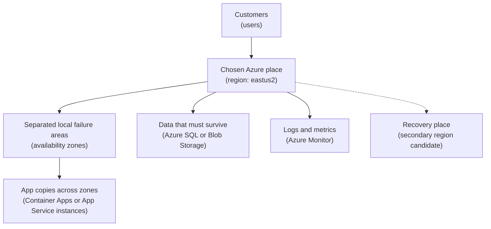

## Table of Contents

1. [The Three Placement Questions](#the-three-placement-questions)
2. [The AWS Translation](#the-aws-translation)
3. [Regions Are The First Location Choice](#regions-are-the-first-location-choice)
4. [Availability Zones Are Local Failure Boundaries](#availability-zones-are-local-failure-boundaries)
5. [Zonal, Zone-Redundant, And Regional Resources](#zonal-zone-redundant-and-regional-resources)
6. [A First Placement Record For The Orders API](#a-first-placement-record-for-the-orders-api)
7. [When The Region Picker Looks Empty](#when-the-region-picker-looks-empty)
8. [Failure Evidence: Everything Landed In One Zone](#failure-evidence-everything-landed-in-one-zone)
9. [Single Region, Multi-Zone, Or Multi-Region](#single-region-multi-zone-or-multi-region)
10. [Beginner Failure Modes And Fix Directions](#beginner-failure-modes-and-fix-directions)

## The Three Placement Questions

Before you create the first production resource in Azure, pause on three practical questions.
Where are the users?
Where is the data allowed to live?
What should happen if part of the chosen region has trouble?

Those questions sound plain because they are.
They are also the real shape behind Azure location vocabulary.
You do not choose a region because a dropdown asks for one.
You choose it because customers need reasonable latency, the business has data residency rules, and the service needs a known failure posture.

This article follows one backend service: `devpolaris-orders-api`.
It accepts checkout requests, stores order records in Azure SQL, saves generated receipts in Blob Storage, and sends logs and metrics to Azure Monitor.
The app runs on Azure Container Apps or App Service.
We are using those services only as placement examples.
The lesson is not how to configure each service.
The lesson is how to decide where the pieces belong.

An Azure region is a real-world Azure location area that contains datacenters and network infrastructure.
It is the first location choice for most cloud resources.
An availability zone is a separated group of datacenters inside many Azure regions.
Zones are close enough for low-latency communication, but separated enough that one local failure should not automatically mean every zone has the same problem.

Azure fits into the larger system like this:
your team owns a workload, the workload runs in a subscription, the resources sit in one or more regions, and some resources can be spread across zones inside a region.
A subscription is the Azure workspace boundary for resources, billing, and access.
This article focuses on the location part of that picture.

For `devpolaris-orders-api`, the running example will demonstrate a first production decision:
place the API, database, blob storage, and monitoring in a primary region near most customers, then decide whether each piece is single-zone, zone-redundant, regional, or copied to a secondary region.

Keep this question near you:

> If this exact Azure place has trouble, what still answers customer requests, and what evidence proves it?

That is the operational spine.
Every term in the article should help you answer that question.

## The AWS Translation

This is one of the friendliest places to reuse your AWS mental model.
AWS and Azure both use regions for geographic placement.
Both use availability zones for local failure boundaries inside many regions.
The shape is familiar, but the details still belong to the provider you are using.

| AWS idea you know | Azure idea to learn | What to watch |
|-------------------|---------------------|---------------|
| AWS Region | Azure region | Same placement question: geography, latency, data rules, service support |
| AWS Availability Zone | Azure availability zone | Same failure-boundary idea, but zone support is service and region specific |
| Multi-AZ design | Zone-redundant or zonal design | Azure service names and options vary by service |
| Cross-region recovery | Secondary region or paired-region thinking | You still need a restore, failover, or redeploy plan |
| Console region selector | Portal, CLI, or resource location filter | Wrong location views can make healthy resources look missing |

The important difference is that Azure also has resource groups.
A resource group has a location, but that does not automatically force every resource inside it to live in that same region.
That can surprise AWS users because AWS does not have this same universal resource group layer.

So keep the AWS question, but translate it carefully:
which subscription, which resource group, which Azure region, and does this service support the zone shape I am expecting?

## Regions Are The First Location Choice

A region is where Azure places the resource in the world.
If you create an Azure SQL database in `eastus`, that database is not the same thing as a database in `westus2`.
If you create a storage account in `westeurope`, the data placement and latency story are different from `centralus`.

This matters because beginner cloud mistakes often look like missing resources.
You open the portal, choose the wrong region, and the app is not there.
Nothing has vanished.
You are looking at the wrong location boundary.

For the orders API, region choice starts with users.
If most customers are in the eastern United States, a nearby region such as `eastus` or `eastus2` might reduce request latency.
Latency is delay between a request and a response.
You can feel it as a slower checkout screen.

The next question is data residency.
Data residency means the geographic boundary where data is allowed or expected to be stored.
If a company promises that customer order data stays in Europe, then placing Azure SQL in a United States region would be wrong even if the API technically works.
The service would be passing tests while violating a business rule.

The third question is capacity and service availability.
Not every Azure service is available in every region.
Not every available service supports every feature in every region.
That is why a careful region decision is not only "nearest to users."
It is "nearest acceptable region that supports the services and resilience settings this workload needs."

Here is a practical first-pass region record.
It is the kind of small artifact a reviewer can inspect before the team creates production resources.

```text
Region placement record

Workload: devpolaris-orders-api
Environment: production
Primary user base: eastern United States
Data residency boundary: United States
Primary region: eastus2
Secondary region candidate: centralus

App platform: Azure Container Apps or App Service
Database: Azure SQL Database
Object storage: Azure Blob Storage
Signals: Azure Monitor with Log Analytics

Region decision:
  eastus2 is close to the main customer base.
  eastus2 is inside the required data residency boundary.
  Required services are checked before deployment.
  Zone support is checked per service, not assumed.

Open questions:
  Can the current Azure SQL tier use zone redundancy in this region?
  Should blob data use zone-redundant storage or geo-redundant storage?
  What is the manual recovery plan if the whole region is unavailable?
```

The useful part is not the exact region name.
The useful part is the shape of the record.
It connects user location, data rules, service availability, and recovery questions in one place.

Notice the phrase "checked per service."
Azure regions differ, and Azure services differ.
You should treat region support as evidence to inspect, not trivia to remember.

## Availability Zones Are Local Failure Boundaries

After the region, the next question is what happens inside that region.
An availability zone is a local failure boundary.
You can think of it as one separated part of a region, with independent power, cooling, and networking.

The point is not that a zone can never fail.
The point is that the workload should not be forced to fail just because one zone has a problem.
If the app has copies in multiple zones and the database or storage layer can keep serving, the service has a better chance of staying available.

Azure zone names are logical inside your subscription.
That means `zone 1` in one subscription does not have to map to the same physical datacenter group as `zone 1` in another subscription.
For most beginner design work, that detail mainly teaches humility.
Do not compare zone numbers across subscriptions as if they are universal building names.

Here is the mental model for `devpolaris-orders-api`.
Read it from top to bottom.
Plain labels come first, and the Azure term follows in parentheses.



The zone box groups the app copies because you usually care whether compute can keep serving after one local failure area has trouble.
The data and monitoring boxes stay attached to the region because their exact zone behavior depends on the service, tier, and configuration.
Some services let you choose zones.
Some services distribute across zones for you.
Some services are regional or nonzonal.

That distinction is the heart of good Azure placement.
You are not trying to make every box look symmetrical.
You are trying to understand which failure each box can survive.

## Zonal, Zone-Redundant, And Regional Resources

Azure uses a few words that are easy to mix up.
Learn them through the failure they describe.

A zonal resource is pinned to one availability zone that you choose.
If that zone has trouble, the resource can have trouble.
This can be useful when you need strict placement, but it does not give zone failure protection by itself.
To make zonal resources resilient, you normally run separate copies in more than one zone and design failover between them.

A zone-redundant resource is spread or replicated across multiple zones by the Azure service.
The service manages the zone spread for that resource.
For data services, this often means the service keeps data available even if one zone is affected, but the exact behavior depends on the service and configuration.

A regional resource is placed in a region without you choosing a specific zone.
Some regional resources may be placed by Azure anywhere in the region.
If they are not configured for zone redundancy, you should not assume they survive a zone outage.
The beginner mistake is seeing "regional" and hearing "safe across all zones."
Those are not the same sentence.

You may also see nonzonal.
That means the resource is not configured to use availability zones.
Azure might still place it somewhere in the region, but you do not control or rely on zone placement.

The secondary region is different.
A paired region or secondary region is another Azure region used for disaster recovery or replication.
Some Azure regions have Microsoft-defined pairs, and some newer regions do not.
You can still design multi-region recovery with paired or nonpaired regions, but you need to know what each service supports.

Here is the vocabulary tied back to the orders API:

| Term | Plain Meaning | Orders API Example | What To Inspect |
|------|---------------|--------------------|-----------------|
| Region | Geographic Azure area | `eastus2` for production | Resource `location` |
| Availability zone | Local failure area inside a region | Zones `1`, `2`, `3` | Zone field or zone setting |
| Zonal | Resource placed in one chosen zone | One app copy pinned to zone `1` | Instance or revision placement |
| Zone-redundant | Service spreads across zones | Storage or database redundancy setting | Redundancy or high availability setting |
| Regional | Resource placed in a region | Log workspace in `eastus2` | Region plus service reliability guide |
| Secondary region | Recovery region | `centralus` candidate | Replication and failover plan |

The main habit is simple:
ask the service how it supports zones.
Do not ask the region alone.

That matters for the services in this article.
Azure SQL Database and Blob Storage appear in common production designs, but their resilience behavior comes from tier and redundancy choices.
App Service and Azure Container Apps have their own zone support rules.
Azure Monitor pieces such as Log Analytics have their own regional behavior.
The safe sentence is: "we checked this service, this tier, in this region."

## A First Placement Record For The Orders API

Now put the words into a first design.
The team wants production to start simple, but not blind.
They will keep all primary resources in one Azure region at first.
They will use zones where the service and tier support them.
They will write down which parts are not zone protected.

That record might look like this:

| Component | Azure Service | Primary Region | Zone Posture | Why It Is Chosen |
|-----------|---------------|----------------|--------------|------------------|
| Public API | Container Apps or App Service | `eastus2` | Multi-zone if supported | Keeps API copies away from one local failure |
| Orders data | Azure SQL Database | `eastus2` | Zone-redundant if tier supports it | Keeps checkout writes from depending on one zone |
| Receipt files | Blob Storage | `eastus2` | Zone-redundant storage if allowed | Keeps receipts readable during a zone issue |
| Logs and metrics | Azure Monitor | `eastus2` | Regional service behavior checked | Keeps signals near the workload |
| Recovery target | Same services later | `centralus` candidate | Not active yet | Gives a place to plan regional recovery |

This is not a final architecture diagram.
It is a decision table.
It says what the team believes and what they still need to verify.

A careful reviewer would ask four questions:
Are the customers mostly near `eastus2`?
Does United States data residency match the product promise?
Do these service tiers support the desired zone posture in `eastus2`?
If `eastus2` is unavailable, what exactly can the team restore in `centralus`?

That last question is where many beginner designs get uncomfortable.
Zone spread helps with a local zone problem.
It does not magically make a single-region service survive a full regional outage.
If the only database exists in one region, then a major region failure is a recovery event, not a smooth failover event.

For a first production backend, that may be acceptable.
Acceptable does not mean ignored.
It means the team writes down the tradeoff and knows what kind of incident it is accepting.

Here is a short placement note that could live beside an infrastructure pull request:

```text
Placement note for PR #184

Service: devpolaris-orders-api
Change: create production resources
Primary region: eastus2
Data boundary: United States

Expected posture:
  API: multiple instances, zone spread enabled when platform supports it
  Azure SQL: zone redundancy requested for production tier
  Blob Storage: zone-redundant storage requested
  Azure Monitor: workspace in same primary region

Reviewer checks:
  Confirm every resource location is eastus2.
  Confirm app copies are not all in one zone.
  Confirm database and storage redundancy settings match the table.
  Confirm no customer data resource is created outside the United States boundary.
```

The reviewer checks are as important as the design.
Cloud location choices are easy to say and easy to drift from.
Evidence keeps the decision real.

## When The Region Picker Looks Empty

Sometimes a beginner opens the Azure portal, chooses a region, and cannot create the resource they expected.
The region picker may hide the service.
The SKU (stock keeping unit, Azure's term for a service tier or size) may be unavailable.
The zone option may not appear.
The page may show no matching resources after deployment.

There are several possible causes.
The first is the simple one: you are looking in the wrong region.
If the orders API resources were created in `eastus2`, the portal view for `westus` will not show them.

The second cause is service availability.
Azure services are not identical across all regions.
Microsoft groups services and regions into categories, and availability can depend on the region type, service type, customer demand, and feature maturity.
For learners, the key point is not the category names.
The key point is that "Azure supports this service" does not mean "this exact service feature exists in every region I might choose."

The third cause is zone support.
A region can support availability zones, while a specific service, tier, or configuration still does not offer the zone option you expected.
That is why you check the service reliability guidance and the portal or CLI output for the exact resource.

A realistic evidence snapshot might look like this:

```text
Resource creation check

Workload: devpolaris-orders-api
Attempted service: Azure Container Apps
Attempted region: northeurope
Expected setting: zone redundancy enabled

Portal result:
  Region: North Europe
  Zone redundancy: not shown for selected environment
  Revision replicas: visible after deployment

What to inspect next:
  1. Is this service available in the selected region?
  2. Does this service support availability zones in this region?
  3. Does the selected plan, environment, or tier expose the zone setting?
  4. Is another approved region a better first production home?
```

This snapshot avoids a common trap.
It does not jump straight to "Azure is broken."
It turns the empty picker into a checklist.

The correction might be one of several things.
Choose a recommended region that supports the needed service.
Choose a different tier that supports zone redundancy.
Accept a regional service for now and document the risk.
Or move the workload to a different service if the zone behavior is a hard requirement.

The important part is that the team follows the placement evidence instead of wandering through the portal.
They inspect region, service, tier, and zone support as separate facts.

## Failure Evidence: Everything Landed In One Zone

The most useful location lesson usually comes from a boring failure snapshot.
Imagine the orders API passed its smoke tests.
The `/health` endpoint returns `200`.
The first checkout works.
Then the platform team reviews the placement evidence and sees this:

```text
Zone placement snapshot

Workload: devpolaris-orders-api
Region: eastus2
Captured: 2026-04-17T15:42:08Z

Component                         Zone posture        Observed placement
orders-api revision replica 1      zonal               zone 1
orders-api revision replica 2      zonal               zone 1
orders-api revision replica 3      zonal               zone 1
orders-sql-prod                    regional            zone setting not enabled
ordersreceiptsprod                 LRS storage         nonzonal storage redundancy
orders-prod-logs                   regional            workspace in eastus2

Risk:
  One zone issue can remove every running API copy.
  Database and receipt storage settings do not prove zone resilience.
```

This is not an outage yet.
It is better than an outage.
It is evidence caught during review.

The API has three replicas, but three replicas in one zone are not the same as three replicas across zones.
Replica count helps with process crashes, rolling updates, and traffic load.
Zone spread helps with a local datacenter group problem.
They solve different problems.

The storage line has another important clue.
`LRS` means locally redundant storage.
It keeps multiple copies inside a single region, but it is not the same as zone-redundant storage.
For a receipt file system that should survive a zone problem, the team needs to inspect whether `ZRS` (zone-redundant storage) is available and appropriate for the storage account.

The database line is similar.
"Azure SQL in the right region" is not enough evidence.
The team needs the high availability or zone redundancy setting for the chosen tier.
If the chosen tier cannot provide the required posture, the decision must be visible in the placement record.

The fix direction is clear:
spread app instances across supported zones, turn on zone-redundant settings where the selected service and tier allow it, and document any regional or nonzonal component as an accepted risk.

Here is the corrected table the reviewer wants to see:

| Component | Previous Evidence | Corrected Evidence | Why It Matters |
|-----------|-------------------|--------------------|----------------|
| API replicas | All in zone `1` | Replicas across zones `1`, `2`, `3` | One zone issue should not remove every app copy |
| Azure SQL | Regional only | Zone redundancy enabled or risk accepted | Checkout writes need a known failure posture |
| Blob Storage | LRS | ZRS where available and suitable | Receipts should not depend on one local zone |
| Azure Monitor | Regional workspace | Regional behavior documented | Logs may be affected by regional service behavior |

The phrase "or risk accepted" is not a loophole.
It is honest engineering.
Sometimes the simplest design is the right first design.
The problem is pretending it is more resilient than it is.

## Single Region, Multi-Zone, Or Multi-Region

Every resilience design spends something.
It spends money, time, mental load, testing effort, and incident complexity.
The job is not to choose the biggest design by default.
The job is to choose the smallest design that honestly matches the service risk.

The simplest design is a single-region design.
All production resources live in one Azure region.
For `devpolaris-orders-api`, that means the app platform, Azure SQL, Blob Storage, and Azure Monitor all sit in `eastus2`.
This is easiest to understand and operate.
Latency between components is usually low.
Costs and dashboards are easier to read.

The weakness is regional recovery.
If the whole region has a serious problem, the service may need manual restore or failover work.
Backups, infrastructure definitions, DNS, secrets, and runbooks all matter.
Single region can be reasonable for a new service, but it should not be described as region-failure resilient.

The next step is multi-zone inside one region.
The app runs across zones.
Data services use zone-redundant settings where supported.
This protects against many local failures without forcing the team into full multi-region operation.
It usually adds configuration choices, testing work, and sometimes higher service cost.

The bigger step is multi-region.
The service has a primary region and a secondary region.
Data is replicated or restorable.
Traffic can move.
Monitoring and incident playbooks know both places.
This can improve disaster recovery, but it adds harder questions:
which database is writable, how stale can replicated data be, who triggers failover, how DNS changes, and how you test all of it without causing harm.

Here is the tradeoff in one table:

| Design | What You Gain | What You Give Up | Good First Use |
|--------|---------------|------------------|----------------|
| Single region | Simple operation and low component latency | Limited regional recovery | Early production with clear backup plan |
| Single region, multi-zone | Better protection from zone failures | More settings and evidence checks | Checkout API with steady traffic |
| Multi-region | Better disaster recovery options | More cost, data, DNS, and testing complexity | Service with strict recovery targets |

The orders API team might choose single region plus multi-zone for its first production version.
That is a sensible middle.
They keep the system understandable while reducing the impact of one local zone problem.
They also keep a secondary region candidate in the record so future recovery work has a direction.

Do not skip the operational part.
A multi-region design that nobody tests can be more dangerous than a single-region design that everyone understands.
During an incident, vague resilience claims do not help.
A tested runbook and clear evidence do.

## Beginner Failure Modes And Fix Directions

Location mistakes often repeat.
Once you know the shapes, they become easier to spot.

Wrong region is the first one.
The symptom is "I created the resource, but I cannot find it."
Check the resource group, subscription, and region before recreating anything.
The fix is usually changing the portal region filter, CLI location flag, or infrastructure variable.

No zone spread is the second one.
The symptom is "we have three copies, but one zone problem still takes everything down."
Inspect actual placement, not just replica count.
The fix is to enable zone spread for the app platform or deploy separate zonal copies behind a regional entry point, depending on the service.

Assuming every service supports zones is the third one.
The symptom is a design document that says "multi-zone" while one service silently runs as regional or nonzonal.
Inspect the service reliability guide, selected tier, and region.
The fix is to choose a supported tier, change service, change region, or document the accepted risk.

Region picker showing no resources is the fourth one.
The symptom is an empty portal page or missing SKU.
Do not immediately create a duplicate resource.
Check whether the selected region is wrong, whether the service exists there, and whether the needed feature is available there.

Data residency mismatch is the fifth one.
The symptom is a working service in a region that violates the product or legal promise.
This can pass technical tests and still be wrong.
The fix is to move customer data resources into an allowed geography and update deployment defaults so the mistake does not repeat.

Single-region recovery limitation is the sixth one.
The symptom is confidence that "Azure is redundant" while the workload has no tested regional recovery path.
Azure provides many redundancy options, but the workload still needs an architecture, backups, replication choices, DNS plan, and restore practice.
The fix is to write the recovery target honestly and build the next recovery step when the business needs it.

Here is a compact diagnostic table for the first production review:

| Review Question | Evidence To Inspect | Bad Sign | Fix Direction |
|-----------------|--------------------|----------|---------------|
| Where are users? | Latency notes and user geography | Region chosen by habit | Choose an approved nearby region |
| Where may data live? | Data residency record | Database outside allowed geography | Move data resources and lock defaults |
| Can one zone fail? | Zone placement table | All app copies in one zone | Spread app copies or accept risk |
| Does each service support zones? | Service docs, tier, portal setting | Zone option missing | Change tier, service, or region |
| What if region fails? | Recovery plan | Only a primary region exists | Add backups, restore plan, or secondary region |

This is the point of learning regions and zones early.
You are not trying to become a walking Azure catalog.
You are learning how to ask placement questions that protect users, data, and your future debugging time.

---

**References**

- [What are Azure regions?](https://learn.microsoft.com/en-us/azure/reliability/regions-overview) - Microsoft Learn explains regions, geographies, data residency boundaries, paired and nonpaired regions, and multi-region tradeoffs.
- [What are Azure availability zones?](https://learn.microsoft.com/en-us/azure/reliability/availability-zones-overview) - Microsoft Learn defines availability zones, zonal resources, zone-redundant resources, nonzonal deployments, and zone design guidance.
- [Available services by region types and categories](https://learn.microsoft.com/en-us/azure/reliability/availability-service-by-category) - Microsoft Learn shows why service and feature availability varies by region type and service category.
