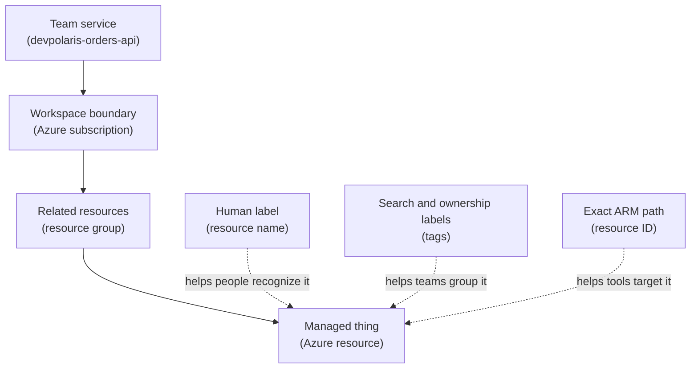

## Table of Contents

1. [The Labels That Prevent Risky Edits](#the-labels-that-prevent-risky-edits)
2. [If You Know AWS ARNs](#if-you-know-aws-arns)
3. [Names, Tags, and IDs Do Different Jobs](#names-tags-and-ids-do-different-jobs)
4. [Where Azure Puts a Resource](#where-azure-puts-a-resource)
5. [A Small Production Inventory](#a-small-production-inventory)
6. [Read a Resource ID From Left to Right](#read-a-resource-id-from-left-to-right)
7. [Service Naming Rules Are Not All the Same](#service-naming-rules-are-not-all-the-same)
8. [Tags Turn Resources Into Team Inventory](#tags-turn-resources-into-team-inventory)
9. [When a Script Targets the Wrong Thing](#when-a-script-targets-the-wrong-thing)
10. [Why Resource IDs Matter to Automation, RBAC, and Policy](#why-resource-ids-matter-to-automation-rbac-and-policy)
11. [Failure Modes You Will Actually See](#failure-modes-you-will-actually-see)
12. [A Review Habit Before You Change Anything](#a-review-habit-before-you-change-anything)

## The Labels That Prevent Risky Edits

The hard part is not always creating the Azure resource.
Sometimes the hard part is knowing which one you are about to change.
A team opens the Azure portal and sees three similar resources:
`ca-orders-api`, `ca-devpolaris-orders-api`, and `devpolaris-orders-api-prod`.
Two live in different resource groups.
One lives in a different subscription.
One has no owner tag.
The ticket says "restart the production orders API."
Nobody wants to click the wrong button.

This article is about the labels Azure gives you so that situation stays calm.
A resource name is the human-friendly name you see in the portal and type into commands.
A tag is a key-value label, such as `env=prod` or `owner=platform`, that helps teams search, filter costs, and understand ownership.
A resource ID is the exact Azure Resource Manager path for one resource.
Azure Resource Manager, often shortened to ARM, is the management layer that receives requests from the portal, Azure CLI, PowerShell, REST APIs, SDKs, Bicep, and ARM templates.

Those three labels exist because humans and machines need different kinds of certainty.
Humans need names they can recognize.
Finance and platform teams need tags they can group.
Automation needs an exact ID that cannot accidentally mean a similar resource somewhere else.
If you mix those jobs together, you get scripts that rely on partial names, dashboards that cannot find owners, and production changes that require too much guesswork.

These labels fit inside the Azure map you have already been building.
A subscription is a billing and management boundary.
A resource group is a container for related resources in a subscription.
A resource provider is the Azure service namespace that supplies a kind of resource, such as `Microsoft.App`, `Microsoft.Sql`, or `Microsoft.Storage`.
A resource type is the specific kind under that provider, such as `containerApps`, `servers`, or `storageAccounts`.
The resource is the thing Azure manages for you.

We will use one running example:
the `devpolaris-orders-api` team operates a small backend service in Azure.
The production setup includes a resource group, an Azure Container App, an Azure SQL server and database, a Storage account with a blob container, a Key Vault, Application Insights, and a Log Analytics workspace.
The goal is practical:
when you see several similar resources, you should know which one is production before editing it.



Read the solid path first.
It tells you where the resource lives.
The dotted links are not extra places.
They are different ways to describe the same resource for different readers.

> A name helps you recognize a resource. A resource ID proves which resource it is.

## If You Know AWS ARNs

The AWS version of this lesson was ARNs (Amazon Resource Names), tags, and human-readable resource names.
Azure has the same operating need:
humans need labels, teams need inventory, and automation needs exact targets.
The Azure words are a little different.

| AWS idea you know | Azure idea to learn | How to think about it |
|-------------------|---------------------|------------------------|
| Resource name | Resource name | Human-friendly, but uniqueness rules depend on the service |
| Tag | Tag | Same habit: ownership, environment, cost, and search |
| ARN | Resource ID | Exact path to one Azure resource through subscription, resource group, provider, type, and name |
| AWS service namespace, such as `s3` or `ecs` | Azure provider namespace, such as `Microsoft.Storage` or `Microsoft.App` | Tells you which service family owns the resource type |
| AWS account ID inside an ARN | Subscription ID inside a resource ID | Helps prove which operating boundary owns the resource |

The biggest difference is readability.
An ARN is compact and service-shaped.
An Azure resource ID reads more like a filesystem path.
That path is long, but it is useful because it shows the subscription, resource group, provider, resource type, and resource name in order.

So the AWS habit still applies:
do not trust a friendly name alone when the action is risky.
Use the exact identifier.

## Names, Tags, and IDs Do Different Jobs

The first beginner trap is treating every Azure identifier as if it has the same precision.
They look related because they often contain similar words.
But they answer different questions.

A name answers, "What did the team call this?"
A tag answers, "What does this belong to?"
A resource ID answers, "Which exact Azure object is this request talking about?"
Those questions sound close, but they lead to different operational choices.

Think about a row in a database table.
It might have a display name, a set of labels, and a primary key.
The display name is useful in a UI.
The labels help you filter rows.
The primary key is what code uses when it must update exactly one row.
Azure names, tags, and resource IDs work in a similar way.

For `devpolaris-orders-api`, the production Container App might look like this:

| Identifier | Example | Main job |
|------------|---------|----------|
| Resource name | `ca-devpolaris-orders-api-prod` | Helps a human recognize the Container App |
| Tag | `env=prod` | Helps teams search, group, and report |
| Resource ID | `/subscriptions/11111111-2222-3333-4444-555555555555/resourceGroups/rg-devpolaris-orders-prod/providers/Microsoft.App/containerApps/ca-devpolaris-orders-api-prod` | Points to one exact Azure resource |

The name is readable, but it is not enough by itself.
Another subscription can have a Container App with the same name.
Another resource group can have a similar name.
Some Azure services require globally unique names, while others only need uniqueness inside a resource group or parent resource.
You have to know the service before you know how much certainty the name gives you.

Tags are useful, but they are not proof of identity.
A teammate can forget to add `env=prod`.
A migration can copy a tag to the wrong resource.
A tag can say `owner=orders-team` even after the owning team changed.
Tags help you find and understand resources, but they should not be treated as secrets, permissions, or the only guardrail before a dangerous change.

The resource ID is the string to slow down and read when automation, access control, or policy is involved.
It includes the subscription, resource group, resource provider namespace, resource type, and resource name.
That is why it feels long.
It carries the context that a short name leaves out.

The tradeoff is simple.
Readable names help humans work faster.
Resource IDs help machines work safely.
Tags help teams search, cost-report, clean up, and assign ownership.
But no one of those labels replaces the others.
A healthy Azure environment uses all three.

## Where Azure Puts a Resource

Before you read a resource ID, you need the basic Azure nesting model.
Azure has several management scopes, meaning levels where Azure can organize or apply management rules.
For this article, the three most important levels are subscription, resource group, and resource.

A subscription is the large boundary where billing, quotas, and many access decisions are applied.
Many companies keep production and non-production workloads in separate subscriptions because the separation makes accidents easier to contain.
For example, `sub-devpolaris-prod` might hold production resources, while `sub-devpolaris-nonprod` holds dev and test.

A resource group is a logical container inside a subscription.
It holds resources that the team wants to manage together.
For the orders API, the production resource group might be:

```text
rg-devpolaris-orders-prod
```

That resource group can hold the Container App, database, Storage account, Key Vault, monitoring resources, and supporting configuration for production.
The resource group does not mean everything runs on the same machine.
It means the resources are grouped for management, access, deployment, and cleanup.

A resource provider is the namespace for an Azure service.
`Microsoft.App` provides Container Apps.
`Microsoft.Sql` provides SQL servers and databases.
`Microsoft.Storage` provides Storage accounts.
`Microsoft.KeyVault` provides Key Vault resources.
You will see these provider names inside resource IDs and in Bicep or ARM template resource types.

A resource type is the kind of resource under the provider.
For example, a Container App has type `Microsoft.App/containerApps`.
A Storage account has type `Microsoft.Storage/storageAccounts`.
A SQL database is nested under a SQL server, so its type path includes both `servers` and `databases`.

That nesting matters because it tells you what Azure is targeting.
If a script changes a resource group, it may affect many resources.
If it changes a Container App resource ID, it should affect only that Container App.
If it grants a role assignment at subscription scope, it can affect every matching resource under that subscription.

## A Small Production Inventory

The fastest way to make cloud resources understandable is to keep a small inventory.
This does not need to be a fancy database at first.
Even a table in a pull request description or runbook can force the team to write down the name, tags, and exact resource ID before changing anything.

Here is the `devpolaris-orders-api` production inventory.
The IDs are realistic examples, but the subscription GUID is intentionally fake.

| Resource | Name | Key tags | Resource ID |
|----------|------|----------|-------------|
| Resource group | `rg-devpolaris-orders-prod` | `service=devpolaris-orders-api`, `env=prod`, `owner=platform` | `/subscriptions/11111111-2222-3333-4444-555555555555/resourceGroups/rg-devpolaris-orders-prod` |
| Container App | `ca-devpolaris-orders-api-prod` | `service=devpolaris-orders-api`, `env=prod`, `component=api` | `/subscriptions/11111111-2222-3333-4444-555555555555/resourceGroups/rg-devpolaris-orders-prod/providers/Microsoft.App/containerApps/ca-devpolaris-orders-api-prod` |
| Azure SQL server | `sql-devpolaris-orders-prod` | `service=devpolaris-orders-api`, `env=prod`, `component=database` | `/subscriptions/11111111-2222-3333-4444-555555555555/resourceGroups/rg-devpolaris-orders-prod/providers/Microsoft.Sql/servers/sql-devpolaris-orders-prod` |
| Azure SQL database | `orders` | `service=devpolaris-orders-api`, `env=prod`, `component=database` | `/subscriptions/11111111-2222-3333-4444-555555555555/resourceGroups/rg-devpolaris-orders-prod/providers/Microsoft.Sql/servers/sql-devpolaris-orders-prod/databases/orders` |
| Storage account | `stdevpolarisordersprod` | `service=devpolaris-orders-api`, `env=prod`, `component=exports` | `/subscriptions/11111111-2222-3333-4444-555555555555/resourceGroups/rg-devpolaris-orders-prod/providers/Microsoft.Storage/storageAccounts/stdevpolarisordersprod` |
| Blob container | `invoices` | Stored under the Storage account | `/subscriptions/11111111-2222-3333-4444-555555555555/resourceGroups/rg-devpolaris-orders-prod/providers/Microsoft.Storage/storageAccounts/stdevpolarisordersprod/blobServices/default/containers/invoices` |
| Key Vault | `kv-devpolaris-orders-prod` | `service=devpolaris-orders-api`, `env=prod`, `component=secrets` | `/subscriptions/11111111-2222-3333-4444-555555555555/resourceGroups/rg-devpolaris-orders-prod/providers/Microsoft.KeyVault/vaults/kv-devpolaris-orders-prod` |
| Application Insights | `appi-devpolaris-orders-prod` | `service=devpolaris-orders-api`, `env=prod`, `component=observability` | `/subscriptions/11111111-2222-3333-4444-555555555555/resourceGroups/rg-devpolaris-orders-prod/providers/Microsoft.Insights/components/appi-devpolaris-orders-prod` |
| Log Analytics workspace | `log-devpolaris-orders-prod` | `service=devpolaris-orders-api`, `env=prod`, `component=observability` | `/subscriptions/11111111-2222-3333-4444-555555555555/resourceGroups/rg-devpolaris-orders-prod/providers/Microsoft.OperationalInsights/workspaces/log-devpolaris-orders-prod` |

The table is not there to make naming feel bureaucratic.
It gives a tired engineer something concrete to compare during a change.
If the ticket says "restart production orders API," the row for the Container App tells you the production name, tags, resource group, provider, type, and full ID.

You can ask Azure for the same evidence from the CLI.
The command below filters resources by the service and environment tags, then prints the name, type, resource group, and ID.

```bash
$ az resource list \
>   --tag service=devpolaris-orders-api \
>   --tag env=prod \
>   --query "[].{name:name,type:type,resourceGroup:resourceGroup,id:id}" \
>   --output table
Name                           Type                                      ResourceGroup                 Id
-----------------------------  ----------------------------------------  ----------------------------  -------------------------------------------------------------------------------
ca-devpolaris-orders-api-prod  Microsoft.App/containerApps               rg-devpolaris-orders-prod     /subscriptions/11111111-2222-3333-4444-555555555555/resourceGroups/rg-devpolaris-orders-prod/providers/Microsoft.App/containerApps/ca-devpolaris-orders-api-prod
sql-devpolaris-orders-prod     Microsoft.Sql/servers                     rg-devpolaris-orders-prod     /subscriptions/11111111-2222-3333-4444-555555555555/resourceGroups/rg-devpolaris-orders-prod/providers/Microsoft.Sql/servers/sql-devpolaris-orders-prod
stdevpolarisordersprod         Microsoft.Storage/storageAccounts          rg-devpolaris-orders-prod     /subscriptions/11111111-2222-3333-4444-555555555555/resourceGroups/rg-devpolaris-orders-prod/providers/Microsoft.Storage/storageAccounts/stdevpolarisordersprod
kv-devpolaris-orders-prod      Microsoft.KeyVault/vaults                 rg-devpolaris-orders-prod     /subscriptions/11111111-2222-3333-4444-555555555555/resourceGroups/rg-devpolaris-orders-prod/providers/Microsoft.KeyVault/vaults/kv-devpolaris-orders-prod
```

The important part is not memorizing this command.
The important part is the habit:
filter by tags, then verify the resource group, type, and ID before changing state.
Names get you close.
IDs tell you whether you are truly there.

## Read a Resource ID From Left to Right

An Azure resource ID looks long until you split it into pieces.
The usual shape for a resource inside a resource group is:

```text
/subscriptions/{subscriptionId}/resourceGroups/{resourceGroupName}/providers/{providerNamespace}/{resourceType}/{resourceName}
```

Now apply that to the production Container App:

```text
/subscriptions/11111111-2222-3333-4444-555555555555/resourceGroups/rg-devpolaris-orders-prod/providers/Microsoft.App/containerApps/ca-devpolaris-orders-api-prod
|             |                                    |              |                            |         |                    |
|             subscription ID                      |              resource group              |         resource name
literal       account-like Azure boundary          literal        group name                  type      ca-devpolaris-orders-api-prod
                                                               provider namespace: Microsoft.App
```

Read it in small questions.
Which subscription?
Which resource group?
Which provider?
Which resource type?
Which resource name?
That reading order keeps you from staring at the whole string as one confusing blob.

Nested resources add more type and name pairs after the first resource.
The SQL database for `devpolaris-orders-api` is nested under the SQL server:

```text
/subscriptions/11111111-2222-3333-4444-555555555555/resourceGroups/rg-devpolaris-orders-prod/providers/Microsoft.Sql/servers/sql-devpolaris-orders-prod/databases/orders
```

The provider is `Microsoft.Sql`.
The first type and name pair is `servers/sql-devpolaris-orders-prod`.
The next type and name pair is `databases/orders`.
That tells you the database named `orders` belongs to the SQL server named `sql-devpolaris-orders-prod`.

The blob container ID has the same nested pattern:

```text
/subscriptions/11111111-2222-3333-4444-555555555555/resourceGroups/rg-devpolaris-orders-prod/providers/Microsoft.Storage/storageAccounts/stdevpolarisordersprod/blobServices/default/containers/invoices
```

The Storage account is `stdevpolarisordersprod`.
The blob service segment is `blobServices/default`.
The container is `containers/invoices`.
If a script is supposed to change the `invoices` container, this full path is safer than passing only `invoices`.
There could be many containers named `invoices` in many Storage accounts.

This is why IDs matter for automation.
When a deploy script, Bicep output, Terraform state, policy assignment, or RBAC role assignment uses the full resource ID, it carries the context with it.
The script does not need to guess which subscription or resource group the short name belongs to.

## Service Naming Rules Are Not All the Same

Azure resource names are not governed by one universal rule.
Each resource provider can define its own length, allowed characters, uniqueness scope, and casing behavior.
This feels annoying at first, but it exists because different services expose names in different places.
A Storage account name becomes part of public DNS hostnames.
A resource group name stays inside Azure Resource Manager.
A SQL server name has service-specific endpoint behavior.

That means a name that works for a Container App may fail for a Storage account.
For our running example, this is why the Container App can be named:

```text
ca-devpolaris-orders-api-prod
```

But the Storage account uses:

```text
stdevpolarisordersprod
```

Storage account names are especially strict.
They use lowercase letters and numbers, with no hyphens.
They also need to be globally unique because they appear in service endpoints.
So the readable pattern has to bend.
The team keeps the same meaning, but compresses the name into a format that the Storage service accepts.

Here is a beginner-friendly naming plan for the same service:

| Resource kind | Example name | Why it looks that way |
|---------------|--------------|-----------------------|
| Resource group | `rg-devpolaris-orders-prod` | Short prefix, service name, environment |
| Container App | `ca-devpolaris-orders-api-prod` | Readable and scoped to the resource group |
| SQL server | `sql-devpolaris-orders-prod` | Service prefix plus workload and environment |
| SQL database | `orders` | Nested under the SQL server, so the server name gives context |
| Storage account | `stdevpolarisordersprod` | Lowercase letters and numbers for Storage account rules |
| Key Vault | `kv-devpolaris-orders-prod` | Readable name for secret storage |
| Application Insights | `appi-devpolaris-orders-prod` | Monitoring component connected to the app |
| Log Analytics workspace | `log-devpolaris-orders-prod` | Workspace for logs and queries |

The prefix is not magic.
It is just a convention that helps humans scan.
`rg` hints at resource group.
`ca` hints at Container App.
`kv` hints at Key Vault.
The useful part is that the team uses the pattern consistently enough that the exceptions stand out.

You still need to check the official naming rules for the service you are creating.
Do not assume that because one resource accepts hyphens, another one does too.
Do not assume the name is globally unique unless the service says so.
And do not rely on casing to distinguish resources.
Azure resource and resource group names are generally handled case-insensitively unless a service documents something different, and APIs may return casing differently from the way you typed it.
Compare names without assuming case will save you.

## Tags Turn Resources Into Team Inventory

Names are good when you are looking at one resource.
Tags are good when you are trying to find a group of resources across services.
If every production orders resource has `service=devpolaris-orders-api` and `env=prod`, you can search for the service without knowing every resource type in advance.

A tag is a key-value pair.
The key is the label name, such as `owner`.
The value is the label value, such as `platform`.
You can put tags on many Azure resources, resource groups, and subscriptions.
Not every resource type supports tags in every situation, so errors from Azure still matter.
But for ordinary inventory and cost tracking, tags are one of the first habits to build.

For the orders API, a small tag set might be:

| Tag key | Example value | Why the team uses it |
|---------|---------------|----------------------|
| `service` | `devpolaris-orders-api` | Groups all resources for one backend |
| `env` | `prod` | Separates production from dev and test |
| `owner` | `platform` | Tells people who to ask before changing it |
| `component` | `api`, `database`, `secrets`, `observability` | Separates parts of the service |
| `costCenter` | `product-engineering` | Helps billing reports group spend |
| `managedBy` | `bicep` | Warns people that manual edits may drift from code |

Those tags answer practical questions during normal work.
Who owns this Key Vault?
Which resources belong to production?
Why did storage costs increase this month?
Which resources are managed by infrastructure as code?
Without tags, those questions turn into portal searches, chat messages, and guesses.

Tags do have limits.
Azure documents maximum tag counts and length limits.
Tag names also have character restrictions.
Some services have special tag behavior.
Resources do not automatically inherit tags from their resource group or subscription unless you set up policy or automation to apply them.
That surprises many beginners.
Putting `env=prod` on `rg-devpolaris-orders-prod` does not automatically mean every resource inside the group has `env=prod`.

Tags are also stored as plain text metadata.
Do not put secrets in them.
A tag like `databasePassword=...` is a serious mistake.
Tags can be visible to people and tools that can read resource metadata.
They are for classification, ownership, cost, and operations.
They are not a secret store and they are not an access control system.
Use Key Vault for secrets and Azure RBAC for access decisions.

Here is a realistic tag inspection:

```bash
$ az resource show \
>   --ids /subscriptions/11111111-2222-3333-4444-555555555555/resourceGroups/rg-devpolaris-orders-prod/providers/Microsoft.App/containerApps/ca-devpolaris-orders-api-prod \
>   --query "{name:name,type:type,resourceGroup:resourceGroup,tags:tags}" \
>   --output json
{
  "name": "ca-devpolaris-orders-api-prod",
  "type": "Microsoft.App/containerApps",
  "resourceGroup": "rg-devpolaris-orders-prod",
  "tags": {
    "service": "devpolaris-orders-api",
    "env": "prod",
    "owner": "platform",
    "component": "api",
    "managedBy": "bicep"
  }
}
```

The useful evidence is not only the tag list.
It is the combination of `name`, `type`, `resourceGroup`, and tags.
Together they tell you this is the production Container App for the orders API.

## When a Script Targets the Wrong Thing

Now let the friction become concrete.
The team has a small script that restarts the orders API after a configuration change.
It was written during a busy week, and it accepts a resource name plus a resource group.

```bash
$ ./restart-container-app.sh ca-devpolaris-orders-api-prod rg-devpolaris-orders-dev
Restarting Container App ca-devpolaris-orders-api-prod in rg-devpolaris-orders-dev...
Revision restart requested.
```

The output looks successful, but the resource group is wrong.
The script restarted a similarly named app in the dev resource group.
Production is still running the old configuration.
Worse, a teammate might now assume production was restarted because the app name looked right.

The first thing to inspect is the resource ID that the script resolved.
Good scripts should print it before making a state-changing request.
If the script does not print it, run a lookup yourself:

```bash
$ az resource show \
>   --resource-group rg-devpolaris-orders-dev \
>   --name ca-devpolaris-orders-api-prod \
>   --resource-type Microsoft.App/containerApps \
>   --query "{name:name,resourceGroup:resourceGroup,id:id,tags:tags}" \
>   --output json
{
  "name": "ca-devpolaris-orders-api-prod",
  "resourceGroup": "rg-devpolaris-orders-dev",
  "id": "/subscriptions/11111111-2222-3333-4444-555555555555/resourceGroups/rg-devpolaris-orders-dev/providers/Microsoft.App/containerApps/ca-devpolaris-orders-api-prod",
  "tags": {
    "service": "devpolaris-orders-api",
    "env": "dev",
    "owner": "platform"
  }
}
```

Now the problem is visible.
The name matches production, but the resource group and `env` tag say dev.
The resource ID also contains `rg-devpolaris-orders-dev`.
That is the proof.

The fix is not "be more careful next time."
The fix is to make the script accept or resolve the exact production resource ID before it changes state.
For example, a safer script can require a full ID and print the key fields back to the operator:

```bash
$ ./restart-container-app.sh \
>   --id /subscriptions/11111111-2222-3333-4444-555555555555/resourceGroups/rg-devpolaris-orders-prod/providers/Microsoft.App/containerApps/ca-devpolaris-orders-api-prod
Target:
  name: ca-devpolaris-orders-api-prod
  resourceGroup: rg-devpolaris-orders-prod
  type: Microsoft.App/containerApps
  env: prod
Restarting exact resource ID...
Revision restart requested.
```

That extra evidence is not noise.
It protects the team from a common cloud failure:
a short name points to a real resource, but not the resource you meant.

## Why Resource IDs Matter to Automation, RBAC, and Policy

Resource IDs are long because Azure management is scoped.
A request can happen at tenant, management group, subscription, resource group, or resource scope.
Scope means "the level where this setting, deployment, role assignment, or policy applies."
If you choose the wrong scope, the action can be too narrow to work or too broad to be safe.

Automation uses resource IDs because scripts need stable targets.
A deployment output might pass the Container App ID to a smoke-test job.
A cleanup job might delete old non-production resources by ID.
A dashboard script might join metrics to the resource ID because names alone can collide.
When the ID is present, the script does not have to reconstruct the target from several loose strings.

Azure RBAC, which means role-based access control, also relies on scope.
When you grant someone access, you grant a role at a scope.
That scope can be a subscription, a resource group, or one resource.
Granting `Reader` at the resource group lets someone view everything in that group.
Granting a narrower role on the Key Vault resource ID limits the assignment to that Key Vault.

Policy uses scope too.
An Azure Policy assignment can require tags, restrict locations, or enforce naming rules at a chosen scope.
If the policy is assigned at the production subscription, it can apply broadly across production.
If it is assigned at one resource group, it affects that group.
The resource ID path tells you where the rule attaches and what resources are below it.

This is the beginner mental model:

| Use case | Best identifier | Why |
|----------|-----------------|-----|
| Portal scanning | Name plus resource group | Fast human recognition |
| Cost reporting | Tags | Groups resources by service, environment, and owner |
| Automation target | Resource ID | Removes ambiguity across subscriptions and groups |
| RBAC assignment | Scope or resource ID | Controls exactly where access applies |
| Policy assignment | Scope ID | Controls where rules are enforced |
| Incident review | Name, tags, and ID together | Lets humans and tools agree on the same object |

You do not need to memorize every Azure path shape.
You need to know when short names are enough and when they are not.
Changing a display filter in the portal can start with a name.
Granting access, deleting resources, restarting production, or wiring automation should use the exact ID or at least verify it before acting.

## Failure Modes You Will Actually See

The first failure mode is assuming names are globally unique across all Azure services.
They are not.
Some names are globally unique because the service exposes them globally.
Some are unique only within a resource group.
Some are unique within a parent resource.
If two resources have similar names, check subscription, resource group, type, and ID before you edit either one.

The second failure mode is forgetting service-specific naming rules.
The Storage account name `st-devpolaris-orders-prod` looks readable, but Storage account names do not accept hyphens.
The name `stdevpolarisordersprod` is less readable, but it fits the service.
This is why a team naming convention needs room for exceptions.
The convention should carry meaning, not force every service into the same exact string pattern.

The third failure mode is missing `owner` or `env` tags.
A resource named `tmp-orders-test` with no tags might be harmless.
It might also be an old production migration artifact that someone still depends on.
The fix is to add minimum required tags at creation time, then use policy or review checks to catch missing tags early.
For existing resources, start by tagging high-risk resources first:
databases, Key Vaults, public endpoints, production compute, and monitoring workspaces.

The fourth failure mode is putting secrets in tags.
A tag is metadata.
It can flow into billing exports, inventory reports, portal views, and automation logs.
Do not store passwords, tokens, connection strings, or customer data in tags.
If the information would be dangerous in a screenshot, it does not belong in a tag.

The fifth failure mode is making casing assumptions.
Azure resource names and resource group names are generally case-insensitive unless the service documents otherwise.
APIs may return casing differently from the original input.
A script should not decide that `rg-DevPolaris-Orders-Prod` and `rg-devpolaris-orders-prod` are different production targets.
Normalize or compare names case-insensitively when you are checking identity.

The sixth failure mode is using the wrong resource ID in automation.
This usually happens when a value is copied from a staging output, a Terraform variable points at an old resource group, or a script builds IDs from string pieces.
The symptom can look like an authorization problem, a "not found" error, or a successful change in the wrong place.
Before you add permissions or rerun the job, print the ID and compare subscription, resource group, provider, type, and tags.

Here is the inspection checklist I want you to build into your hands:

| Check | What you are proving |
|-------|----------------------|
| Subscription ID | The command is looking in the intended environment boundary |
| Resource group | The resource belongs to the expected workload group |
| Provider and type | You are targeting the right kind of resource |
| Resource name | The human label matches the ticket or runbook |
| Tags | The service, environment, owner, and component make sense |
| Full resource ID | Automation and RBAC point at the exact object |

Notice what this checklist does not say.
It does not say "trust the shortest friendly name."
Friendly names are helpful, but they need context.

## A Review Habit Before You Change Anything

Before changing a production Azure resource, pause long enough to make the target boring.
You want the evidence to line up so clearly that the change feels ordinary.
The resource name should match the service.
The resource group should match the environment.
The tags should explain ownership and purpose.
The resource ID should point at the exact subscription, provider, type, and resource.

For `devpolaris-orders-api`, the review might be only five lines in a deployment log:

```text
target.name: ca-devpolaris-orders-api-prod
target.type: Microsoft.App/containerApps
target.resourceGroup: rg-devpolaris-orders-prod
target.tags.env: prod
target.id: /subscriptions/11111111-2222-3333-4444-555555555555/resourceGroups/rg-devpolaris-orders-prod/providers/Microsoft.App/containerApps/ca-devpolaris-orders-api-prod
```

That snapshot is small, but it is enough to catch many bad changes.
If `target.tags.env` says `dev`, stop.
If the resource group says `rg-devpolaris-orders-test`, stop.
If the subscription ID is not the production subscription, stop.
If the type is not `Microsoft.App/containerApps`, stop.
You are looking at the wrong thing or at least at something you do not understand yet.

Good naming makes this review fast.
Good tags make it searchable and accountable.
Good resource ID handling makes scripts and access control precise.
Together they turn cloud inventory from a guessing game into a routine check.
That is the point:
not prettier labels, but safer operations.

---

**References**

- [Naming rules and restrictions for Azure resources](https://learn.microsoft.com/en-us/azure/azure-resource-manager/management/resource-name-rules) - Official Microsoft Learn reference for Azure resource naming scopes, character rules, casing guidance, and service-specific constraints.
- [Use tags to organize your Azure resources and management hierarchy](https://learn.microsoft.com/en-us/azure/azure-resource-manager/management/tag-resources) - Official Microsoft Learn guide for Azure tags, tag limitations, inheritance behavior, and billing use cases.
- [What is Azure Resource Manager?](https://learn.microsoft.com/en-us/azure/azure-resource-manager/management/overview) - Official Microsoft Learn overview of ARM concepts such as resources, resource groups, resource providers, scopes, RBAC, and tags.
- [Azure resource providers and types](https://learn.microsoft.com/en-us/azure/azure-resource-manager/management/resource-providers-and-types) - Official Microsoft Learn reference for provider namespaces, resource types, registration, locations, and API versions.
