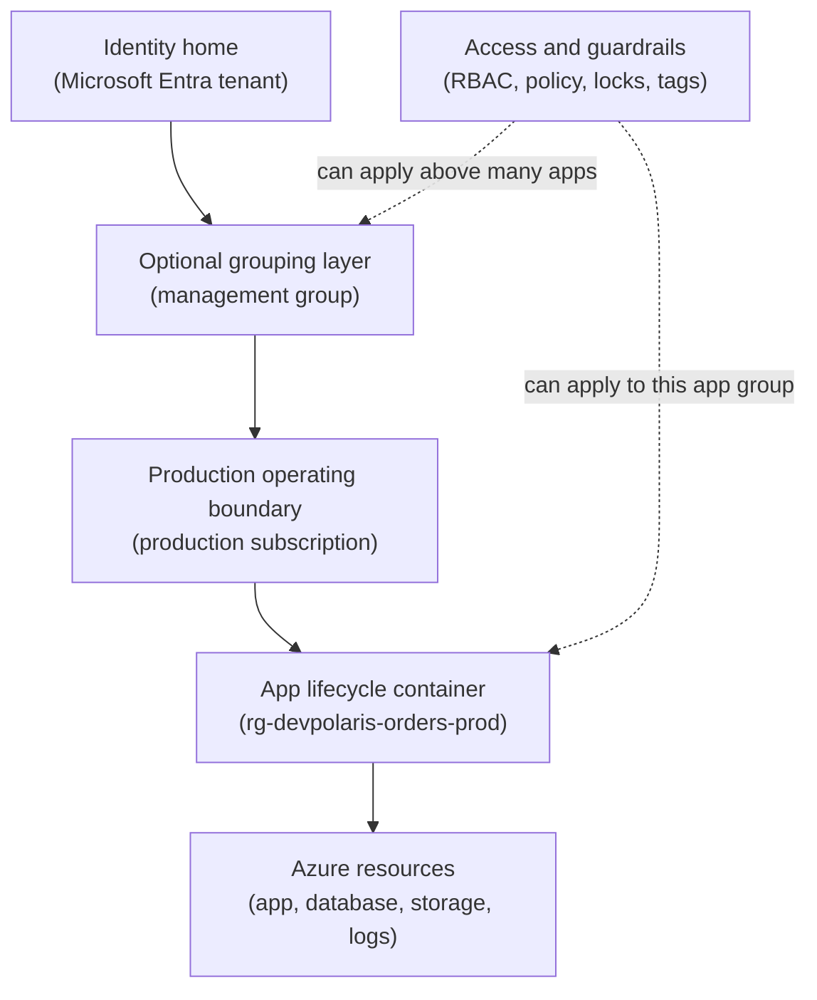

## Table of Contents

1. [The Boundary Check Before You Deploy](#the-boundary-check-before-you-deploy)
2. [The AWS Translation](#the-aws-translation)
3. [The Azure Hierarchy In One Picture](#the-azure-hierarchy-in-one-picture)
4. [Tenants: The Identity Home](#tenants-the-identity-home)
5. [Subscriptions: The Billing And Policy Boundary](#subscriptions-the-billing-and-policy-boundary)
6. [Management Groups: A Light Layer Above Subscriptions](#management-groups-a-light-layer-above-subscriptions)
7. [Resource Groups: The Lifecycle Container](#resource-groups-the-lifecycle-container)
8. [Azure Resource Manager: The Front Door For Changes](#azure-resource-manager-the-front-door-for-changes)
9. [Scope, RBAC, And Policy Inheritance](#scope-rbac-and-policy-inheritance)
10. [The Orders API Placement Plan](#the-orders-api-placement-plan)
11. [Artifacts That Prove Where You Are](#artifacts-that-prove-where-you-are)
12. [Failure Modes For Beginners](#failure-modes-for-beginners)
13. [Choosing A Resource Group Shape](#choosing-a-resource-group-shape)

## The Boundary Check Before You Deploy

You can be signed in to Azure, see the portal, and still be in the wrong place.
That is the practical confusion this article is about.
Azure may accept your login, show you resources, and let you click around.
But the resource you are viewing may belong to the wrong tenant, the wrong subscription, or the wrong resource group.

That confusion can become a real production problem. A deployment
pointed at the wrong subscription can create production infrastructure
from a staging pipeline, a database placed in the wrong resource group
can be deleted with an unrelated cleanup, and a teammate can have access
to one tenant while still being unable to see the subscription where the
application bill lives.

Azure uses several boundaries before you ever create a virtual machine, web app, storage account, or database.
A **tenant** is the identity home.
In modern Azure, that usually means a Microsoft Entra ID tenant, which is the directory where users, groups, service principals, and sign-ins live.
A **subscription** is the billing, quota, and policy boundary where Azure resources are paid for and controlled.
A **resource group** is the lifecycle container that holds related resources for one solution.

This article follows one running example:
the DevPolaris team is placing `devpolaris-orders-api` into Azure.
The service has a production environment and a staging environment.
The team wants production in a production subscription, staging in a staging subscription, and resources grouped so they can be deployed, inspected, tagged, and deleted safely.

For a beginner, the goal is not to memorize every Azure governance feature.
The goal is to build one operating habit:

> Before you deploy, check the tenant, subscription, and resource group.

That habit prevents a surprising number of cloud mistakes.

## The AWS Translation

If you know AWS, the closest familiar idea is the AWS account.
An AWS account is where resources live, where billing lands, and where IAM rules protect production.
Azure splits that feeling across a few boxes.

That split is the part worth slowing down for because Azure does not
replace one AWS word with one Azure word. Once you see the shape, the
model is manageable: identity lives in the tenant, resources and billing
live in subscriptions, and lifecycle grouping happens in resource
groups.

| AWS idea you know | Azure idea to learn | Practical warning |
|-------------------|---------------------|-------------------|
| AWS account | Azure subscription | Closest match for resources, billing, policy, and access scope |
| AWS Organizations or account hierarchy | Tenant, management groups, and subscriptions | Identity lives in the tenant, resources live in subscriptions |
| IAM users, groups, and roles | Microsoft Entra users, groups, service principals, managed identities, and RBAC | Permission checks depend on identity, role, and scope |
| Tags on resources | Tags on resources and resource groups | Helpful for ownership and cost, but not a permission system |
| A named stack or environment | Resource group | Azure can delete the whole group, so lifecycle grouping matters |

The main beginner mistake is assuming "tenant" means the same thing as "account."
It does not.
The tenant is the identity home.
The subscription is where resources are created and billed.
The resource group is the lifecycle container inside the subscription.

So if an AWS-trained engineer asks, "which account am I in?", the Azure version is usually:

> Which tenant am I signed into, which subscription is active, and which resource group am I about to change?

## The Azure Hierarchy In One Picture

Azure becomes less confusing when you separate identity, billing, lifecycle, and the actual resources.
Those words are easy to blur together when you are new.
The portal often shows them near each other, and a CLI command may mention several of them in one output.

Read this diagram from top to bottom.
It shows the production path for the orders API.
The side note is a rule layer, not another place where the app runs.



The main path is the location and ownership path.
The tenant contains the identities that can sign in.
A management group can collect subscriptions for shared governance.
A subscription contains resource groups.
A resource group contains resources.
Staging follows the same shape, usually with its own subscription and resource group, but drawing both paths repeats the same idea.

The dotted rule box is different.
RBAC (role-based access control, the permission system that answers who can do what) and Azure Policy (rules that allow, deny, or audit resource configuration) do not hold your app.
They are checks Azure applies when someone tries to create, change, read, or delete something.

That distinction matters.
If you think permissions are another location, you will search in the wrong place.
If you think subscriptions are just login accounts, billing and production separation will feel mysterious.
If you think resource groups are folders for tidiness only, deleting one can surprise you badly.

## Tenants: The Identity Home

A tenant is the home for identities.
In Azure, a tenant is usually a Microsoft Entra ID directory.
It holds users like Maya, groups like `orders-api-deployers`, applications, service principals, and sign-in rules.
A service principal is an identity used by software, such as a CI/CD pipeline, rather than by a person.

Think of the tenant as the company directory.
It answers questions like:
who is Maya, is she allowed to sign in, is this pipeline identity real, and which groups does this identity belong to?
It does not mean every Azure bill or every resource lives directly inside Maya's account.

This is where beginners often get tripped up.
You can sign in with your work account and still be looking at the wrong tenant.
Many developers have guest access to client tenants, old lab tenants, personal Microsoft accounts, or multiple company directories.
The portal can switch between those directories.
The CLI can also hold tokens for more than one tenant.

For DevPolaris, the identity home might be:

| Boundary | Example | Plain Meaning |
|----------|---------|---------------|
| Tenant | `devpolaris.onmicrosoft.com` | The directory where DevPolaris identities live |
| Human identity | `maya@devpolaris.com` | A person who can sign in |
| Group | `orders-api-deployers` | People allowed to deploy the orders API |
| Workload identity | `sp-devpolaris-orders-ci` | Pipeline identity used by automation |

This tenant does not automatically mean Maya can change production.
The tenant proves who Maya is.
Azure still needs role assignments at a scope, such as a subscription or resource group, before Maya can manage resources there.

That separation is healthy.
Identity asks, "who are you?"
RBAC asks, "what are you allowed to do here?"
The word **here** is the scope.
We will come back to scope later because it is one of Azure's most useful ideas.

## Subscriptions: The Billing And Policy Boundary

A subscription is where Azure resources are created, charged, limited, and governed.
If the tenant is the company directory, a subscription is closer to a cloud workspace with a bill attached.
It has its own subscription ID.
It can have policies.
It can have role assignments.
It contains resource groups.

The word subscription can sound like a payment plan.
Billing is part of it, but a subscription is also an engineering boundary.
It answers practical questions:
which environment is this, who can deploy here, what quotas apply, which policies are enforced, and where do costs roll up?

For `devpolaris-orders-api`, a simple starting shape is:

| Subscription | Purpose | Normal Access | Example Risk |
|--------------|---------|---------------|--------------|
| `sub-devpolaris-staging` | Release checks before production | Developers can deploy and debug | Bad config blocks a release |
| `sub-devpolaris-prod` | Real checkout traffic | Limited deploy access, broad read access | Mistake can affect customers |

The team could put staging and production in one subscription and separate them with resource groups.
For a small learning project, that may be fine.
For a team service, separate subscriptions make the boundary harder to cross by accident.
They also make cost review cleaner because production spend and staging spend are already separated at a major Azure boundary.

Subscriptions also help with policy.
For example, the production subscription can require certain tags, deny public IP addresses unless approved, or limit which Azure regions are allowed.
The staging subscription can allow more experimentation.
That difference is hard to express safely if all environments are mixed together with the same broad permissions.

The important correction is this:
a subscription is not the same thing as a tenant.
A tenant can contain or trust identities that can access many subscriptions.
A subscription trusts one tenant for identity.
If someone says "I am in the DevPolaris tenant," that does not prove they are in the production subscription.

## Management Groups: A Light Layer Above Subscriptions

Management groups are optional for small teams, but you should know where they fit.
A management group sits above subscriptions and lets an organization apply governance to several subscriptions together.
Governance means rules and access patterns that shape what teams can do safely.

For example, DevPolaris might later create:

| Management Group | Subscriptions Under It | Why It Exists |
|------------------|------------------------|---------------|
| `mg-devpolaris-production` | Production subscriptions | Shared production policies |
| `mg-devpolaris-nonprod` | Development and staging subscriptions | More flexible testing rules |

If the platform team applies a policy at `mg-devpolaris-production`, Azure can let that policy inherit down to production subscriptions, their resource groups, and their resources.
That saves the team from copying the same policy assignment into every production subscription.

You do not need management groups on day one for one application.
They become useful when you have many subscriptions and the same guardrails need to apply across them.
The beginner mistake is either ignoring them forever or using them too early for a tiny setup.
For now, remember the place:
tenant, then optional management groups, then subscriptions.

## Resource Groups: The Lifecycle Container

A resource group is a container for related Azure resources.
The key word is related, not similar.
The best resource group boundary is usually lifecycle.
Lifecycle means "these things are created, changed, and deleted together."

For the production orders API, this resource group might hold:
an App Service for the API, an Azure SQL database, a storage account for exports, Application Insights for telemetry, and a Key Vault for secrets.
Those resources are not the same type of thing.
They are related because they serve one application environment.

That gives the team a resource group like:

```text
rg-devpolaris-orders-prod
  app-devpolaris-orders-prod
  sql-devpolaris-orders-prod
  stdevpolarisordersprod
  kv-devpolaris-orders-prod
  appi-devpolaris-orders-prod
```

The staging environment gets a different resource group:

```text
rg-devpolaris-orders-staging
  app-devpolaris-orders-staging
  sql-devpolaris-orders-staging
  stdevpolarisordersstg
  kv-devpolaris-orders-staging
  appi-devpolaris-orders-staging
```

That separation gives the team a clear answer to "what belongs to staging?" and "what belongs to production?"
It also gives deployments a clean target.
A Bicep file, ARM template, Terraform configuration, or Azure CLI command can target `rg-devpolaris-orders-prod` and only work inside that group.

Resource group deletion is the part you must respect.
When you delete a resource group, Azure deletes the resources inside it.
That is useful for temporary labs.
It is dangerous for live systems.

This is why unrelated lifecycles should not share one group.
If `devpolaris-orders-api` and `devpolaris-billing-api` share `rg-shared-prod`, a cleanup for one service can threaten the other.
If a database must outlive the app compute, it may need its own group.
The right boundary is not "all databases together" or "all web apps together."
The right boundary is "what changes and dies together?"

The resource group location is where Azure stores metadata about that
group. Resources inside the group can still run in other regions, so
`rg-devpolaris-orders-prod` in `eastus` can contain a resource in
`centralus`, even if that is not what you intended.

That is why you check both:
the resource group location and the resource location.

## Azure Resource Manager: The Front Door For Changes

Azure Resource Manager, often shortened to ARM, is the management layer for Azure.
When the portal, Azure CLI, PowerShell, SDKs, Bicep, ARM templates, or Terraform create and update Azure resources, requests go through Azure Resource Manager.

That sentence matters because it explains why the same scope model appears everywhere.
The portal and CLI may look different, but both are asking ARM to create, update, read, or delete resources.
ARM checks identity, authorization, policy, locks, and the requested resource shape before the change reaches the Azure service that owns the resource.

For the orders API, imagine a deployment command that creates an App
Service. Focus first on the path the request takes:

```text
Maya or CI pipeline
  -> Azure CLI, portal, Bicep, Terraform, or SDK
  -> Azure Resource Manager
  -> authorization and policy checks
  -> Microsoft.Web resource provider
  -> app service resource created or updated
```

A resource provider is the Azure service namespace that owns a type of resource.
For example, web app resources are under `Microsoft.Web`.
Storage accounts are under `Microsoft.Storage`.
Databases have their own provider namespaces.

ARM is also why the resource ID is so useful.
A resource ID is Azure's full path to a resource.
It includes the subscription, resource group, provider, resource type, and resource name.

```text
/subscriptions/00000000-0000-0000-0000-000000000001
/resourceGroups/rg-devpolaris-orders-prod
/providers/Microsoft.Web/sites/app-devpolaris-orders-prod
```

That path is long because it is precise.
If you are debugging an access issue, a failed deployment, or a wrong-resource mistake, this full ID tells you exactly which subscription and resource group Azure thinks you mean.

## Scope, RBAC, And Policy Inheritance

Scope means "the level where a rule, role, lock, or deployment target applies."
Azure has several common scopes:
management group, subscription, resource group, and resource.
Tenant is also a possible deployment and management scope for some operations, but most beginner app work happens lower than that.

The scope you choose controls the blast radius of the change.
Blast radius means the area affected by one action.
If Maya gets Contributor at the production subscription, she can change many production resource groups.
If Maya gets Contributor only at `rg-devpolaris-orders-prod`, her access is smaller.

RBAC assignments inherit down the scope tree.
If a group gets Reader at the subscription, that group can read resource groups and resources inside that subscription.
If a pipeline identity gets Contributor at one resource group, it can deploy resources in that group, but not in a sibling group.

Policy works similarly.
A policy assigned at a management group can affect subscriptions below it.
A policy assigned at a subscription can affect resource groups and resources inside it.
A policy assigned at one resource group does not automatically affect another resource group.

Here is a practical scope table for the orders API:

| Scope | Example Assignment | What It Allows | Risk If Too Broad |
|-------|--------------------|----------------|-------------------|
| Management group | Production region policy | All production subscriptions follow the region rule | A bad rule blocks many teams |
| Subscription | Developers get Reader | Developers can inspect production state | Sensitive resources may be visible |
| Resource group | CI gets Contributor | Pipeline can deploy one app environment | Wrong group lets CI change unrelated resources |
| Resource | Operator gets Key Vault Secrets User | Operator can read one vault's secrets | Secret access spreads quietly |

The safest scope is not always the smallest possible scope.
If you assign one role per individual resource, the setup becomes noisy and hard to audit.
If you assign everything at subscription level, mistakes travel too far.
For one app environment, resource group scope is often the useful middle.

## The Orders API Placement Plan

Now place `devpolaris-orders-api` without rushing into a database choice.
The first decision is environment separation.
The team wants staging and production to feel similar, but not share the same blast radius.

The placement plan can look like this:

| Environment | Tenant | Subscription | Resource Group | Main Purpose |
|-------------|--------|--------------|----------------|--------------|
| Staging | `devpolaris.onmicrosoft.com` | `sub-devpolaris-staging` | `rg-devpolaris-orders-staging` | Release checks before production |
| Production | `devpolaris.onmicrosoft.com` | `sub-devpolaris-prod` | `rg-devpolaris-orders-prod` | Real checkout traffic |

The names are boring on purpose. When someone reads
`rg-devpolaris-orders-prod`, they should know the company, app, and
environment without opening a wiki.

The team also chooses a small tag set.
Tags are key-value metadata attached to resources, resource groups, and subscriptions.
They help with ownership, cost review, automation, and search.
They are not secrets.
Do not put passwords, tokens, customer names, or private incident details in tags.

For the orders API, useful tags might be:

| Tag | Staging Value | Production Value |
|-----|---------------|------------------|
| `app` | `devpolaris-orders-api` | `devpolaris-orders-api` |
| `environment` | `staging` | `production` |
| `owner` | `orders-team` | `orders-team` |
| `costCenter` | `commerce` | `commerce` |
| `managedBy` | `bicep` | `bicep` |

Tags support discovery.
They do not replace correct scopes.
A tag saying `environment=production` does not stop a staging deployment identity from changing it.
RBAC and policy do that work.
Tags make the inventory readable after the boundaries are already right.

## Artifacts That Prove Where You Are

Before a deployment changes anything, the team needs evidence.
Not vibes.
Not "the profile name says prod."
Evidence.

The Azure CLI can show the active account context.
This is the kind of output a developer should check before deploying:

```bash
$ az account show
{
  "environmentName": "AzureCloud",
  "homeTenantId": "11111111-1111-1111-1111-111111111111",
  "id": "00000000-0000-0000-0000-000000000001",
  "isDefault": true,
  "name": "sub-devpolaris-prod",
  "state": "Enabled",
  "tenantId": "11111111-1111-1111-1111-111111111111",
  "user": {
    "name": "maya@devpolaris.com",
    "type": "user"
  }
}
```

Three fields matter first.
`tenantId` tells you which identity directory Azure is using.
`id` is the subscription ID.
`name` is the human-friendly subscription name.
If this says `sub-devpolaris-prod`, you should slow down before running anything destructive.

A resource group inventory gives another sanity check:

```bash
$ az group list --query "[].{name:name, location:location, tags:tags}" --output table
Name                            Location    Tags
------------------------------  ----------  -----------------------------------------------
rg-devpolaris-orders-prod       eastus      app=devpolaris-orders-api environment=production
rg-devpolaris-payments-prod     eastus      app=devpolaris-payments-api environment=production
rg-platform-monitoring-prod     eastus      app=platform-monitoring environment=production
```

This output tells Maya she is in the production subscription and can see production resource groups.
It does not prove the app resources are correctly placed.
It only proves the current subscription contains the group she expects.

Now inspect one resource group:

```bash
$ az resource list \
  --resource-group rg-devpolaris-orders-prod \
  --query "[].{name:name,type:type,location:location}" \
  --output table
Name                           Type                                      Location
-----------------------------  ----------------------------------------  --------
app-devpolaris-orders-prod     Microsoft.Web/sites                       eastus
sql-devpolaris-orders-prod     Microsoft.Sql/servers/databases           eastus
kv-devpolaris-orders-prod      Microsoft.KeyVault/vaults                 eastus
appi-devpolaris-orders-prod    Microsoft.Insights/components             eastus
```

This inventory answers the next question:
"what would be affected if I changed or deleted this resource group?"
That is the operational reason to list resources.
You are building a mental picture before your command changes state.

Here is a failure snapshot from a staging deployment that pointed at production by accident:

```text
Deployment: orders-api-staging-2026-05-03.4
Expected subscription: sub-devpolaris-staging
Actual subscription:   sub-devpolaris-prod
Target group:          rg-devpolaris-orders-staging

ERROR: Resource group 'rg-devpolaris-orders-staging' could not be found.
```

The error is useful if you read it carefully. The staging resource group
is missing because the command is looking in the production
subscription. Switch the active subscription to `sub-devpolaris-staging`
and rerun the deployment there instead of creating staging resources in
production.

That distinction is the whole lesson.
Do not repair the symptom inside the wrong boundary.
Move to the right boundary first.

## Failure Modes For Beginners

The most common Azure mistakes at this level are not exotic.
They are ordinary boundary mistakes.
That is good news because ordinary checks catch them.

The first failure is deploying to the wrong subscription.
It often happens when a CLI profile, portal directory, or pipeline variable points somewhere surprising.
The command may be valid.
The template may be valid.
The target is wrong.

```text
Preflight failed
expectedSubscriptionName: sub-devpolaris-staging
actualSubscriptionName:   sub-devpolaris-prod
actualSubscriptionId:     00000000-0000-0000-0000-000000000001
decision: stop before deployment
```

The correction is to make the subscription check explicit.
A human can run `az account show`.
A pipeline can compare the current subscription ID against an expected value and stop before deployment.
Do not trust a label alone.

The second failure is mixing unrelated lifecycles in one resource group.
Imagine this inventory:

```text
rg-commerce-prod
  app-devpolaris-orders-prod
  sql-devpolaris-orders-prod
  app-devpolaris-billing-prod
  sql-devpolaris-billing-prod
  st-shared-exports-prod
```

This looks tidy at first because everything belongs to commerce.
But the orders API and billing API may deploy on different schedules, have different owners, and need different deletion rules.
If a cleanup or redeploy targets the whole group, both services are at risk.
The fix is usually to split by app and environment, then keep truly shared resources in a clearly named shared group with stricter access.

The third failure is assuming resource group location equals resource location.
This mistake creates confusing latency, compliance, and debugging problems.
A resource group might be in `eastus`, while one resource inside it is in `westus2`.

```text
Resource group: rg-devpolaris-orders-prod
Resource group location: eastus

Resource inventory:
app-devpolaris-orders-prod      eastus
sql-devpolaris-orders-prod      westus2
appi-devpolaris-orders-prod     eastus
```

Inspect resource locations before renaming anything. Decide whether the
out-of-region resource is intentional. For many beginner app
environments, keeping the group and resources in the same region is the
simpler default.

The fourth failure is deleting a resource group with live resources.
Resource group deletion is convenient when the group is a lab.
It is dangerous when the group contains a production app, database, secrets, and telemetry.

```text
Delete request
scope: /subscriptions/.../resourceGroups/rg-devpolaris-orders-prod
resources in scope: 5
contains database: yes
contains key vault: yes
decision: block and require owner review
```

The correction is to treat resource group deletion as a high-risk operation.
Use locks for important groups where appropriate.
Keep backup and restore plans separate from the delete button.
Make the inventory visible before deletion.

The fifth failure is confusing the identity tenant with the billing subscription.
Maya can be signed in through `devpolaris.onmicrosoft.com` and still have several subscriptions available.
The tenant proves where her identity came from.
It does not prove which subscription a command will change.

The correction is to check both fields.
Tenant tells you who authenticated you.
Subscription tells you where resources and charges live.
Resource group tells you which lifecycle container the change targets.

## Choosing A Resource Group Shape

A practical default is one resource group per app per environment.
For DevPolaris, that means:

```text
rg-devpolaris-orders-staging
rg-devpolaris-orders-prod
```

This shape gives each environment a clear deployment target. It makes
inventory easy, lets the team grant the CI pipeline access to one
environment without handing it a whole subscription, and makes cleanup
safer because staging and production are not in the same container.

The tradeoff is that too many tiny resource groups can create noise.
If every small helper resource gets its own group, ownership becomes harder to read.
Policy assignments, role assignments, locks, budgets, and dashboards can become scattered.
People stop knowing which group matters because there are too many of them.

Use this decision rule:
put resources together when they share an owner, environment, deployment path, and deletion story.
Split them when any of those answers differ.

For the orders API, that means the web app, database, secrets vault, telemetry, and storage for production can start together in `rg-devpolaris-orders-prod`.
If the database later needs a separate backup process, stricter access, or a lifecycle that outlives the app, moving it to a separate group may be reasonable.
If a shared virtual network serves many apps, it probably belongs in a platform-owned group rather than inside the orders API group.

The final operating checklist is short:

| Check | What You Are Proving |
|-------|----------------------|
| Tenant | The identity home is the expected one |
| Subscription | Billing, policy, and environment boundary are correct |
| Resource group | The lifecycle container matches the app and environment |
| Resource locations | The actual resources run where you expect |
| Role scope | Access is broad enough to work and narrow enough to limit mistakes |
| Tags | Ownership and cost metadata are readable |

This checklist helps you avoid the quiet Azure mistake where every
command is technically valid and still aimed at the wrong place.

---

**References**

- [What is Azure Resource Manager?](https://learn.microsoft.com/en-us/azure/azure-resource-manager/management/overview) - Explains ARM, resources, resource groups, scope levels, deployment targets, and resource group deletion behavior.
- [Use the Azure portal and Azure Resource Manager to manage resource groups](https://learn.microsoft.com/en-us/azure/azure-resource-manager/management/manage-resource-groups-portal) - Shows how Azure presents resource group creation, listing, deletion, locks, tags, and access management.
- [Use tags to organize your Azure resources and management hierarchy](https://learn.microsoft.com/en-us/azure/azure-resource-manager/management/tag-resources) - Covers tag behavior, tag inheritance limits, billing use cases, and the warning not to store sensitive values in tags.
- [What are Azure management groups?](https://learn.microsoft.com/en-us/azure/governance/management-groups/overview) - Describes management groups as governance scopes above subscriptions and explains inheritance through the hierarchy.
- [What is Microsoft Entra?](https://learn.microsoft.com/en-us/entra/fundamentals/what-is-entra) - Defines Microsoft Entra ID as the cloud identity and access management service behind Azure tenants.
