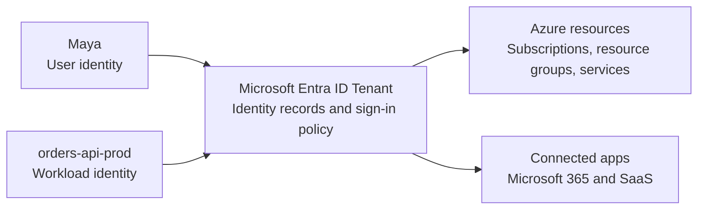
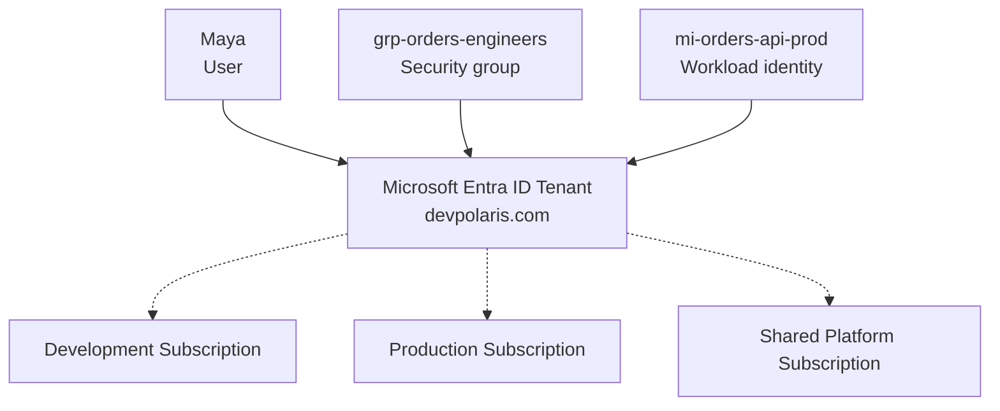
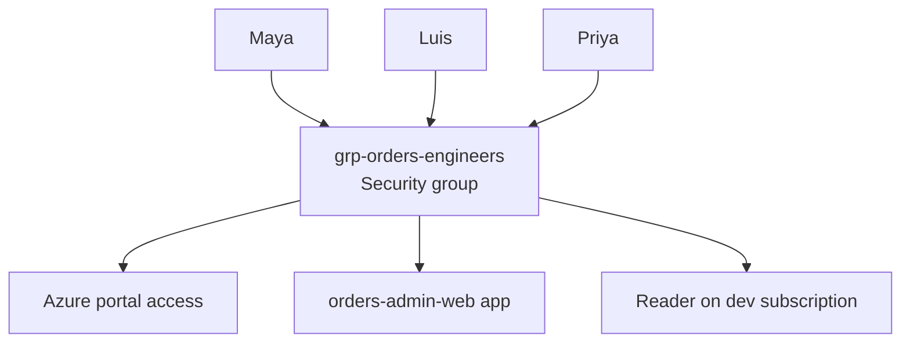
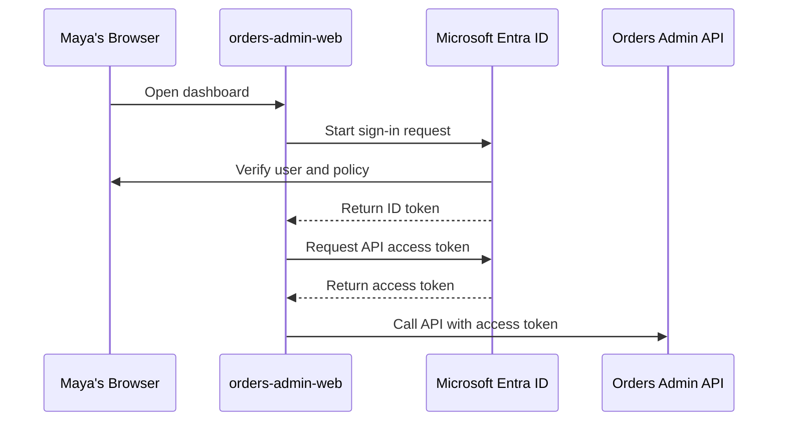
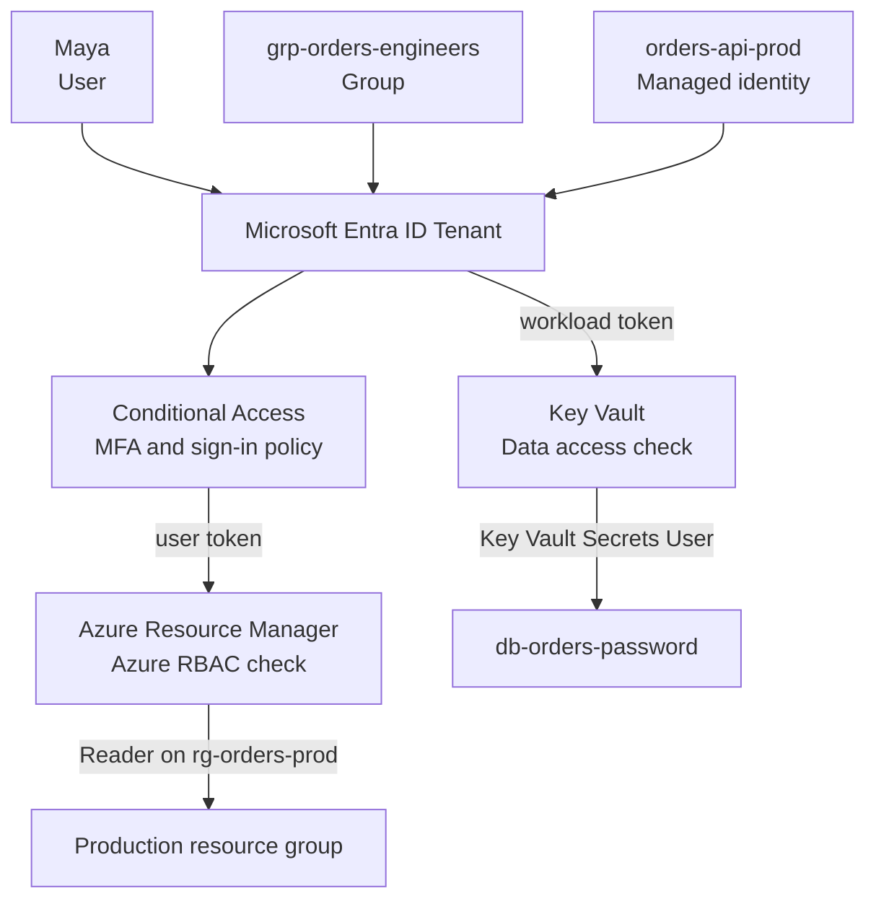

## Table of Contents

1. [The Identity Home](#the-identity-home)
2. [The Tenant](#the-tenant)
3. [Users and Groups](#users-and-groups)
4. [Apps and Service Principals](#apps-and-service-principals)
5. [Devices and Workloads](#devices-and-workloads)
6. [Sign-In Tokens](#sign-in-tokens)
7. [Conditional Access](#conditional-access)
8. [Entra Roles and Azure RBAC](#entra-roles-and-azure-rbac)
9. [Evidence and Operations](#evidence-and-operations)
10. [Putting It All Together](#putting-it-all-together)
11. [What's Next](#whats-next)

## The Identity Home
<!-- section-summary: Microsoft Entra ID is the cloud identity system that stores callers, verifies sign-in, applies access policy, and issues tokens for Microsoft cloud resources. -->

**Microsoft Entra ID** is Microsoft's cloud identity and access management service. It stores digital identities such as employees, groups, devices, applications, service principals, and managed identities. It verifies sign-ins, applies access policy, and issues security tokens that other systems can trust.

Microsoft Entra is the larger product family for identity and network access. **Microsoft Entra ID** is the identity foundation inside that family. If an organization uses Azure, Microsoft 365, or Dynamics 365, that organization already has a Microsoft Entra tenant. Older screenshots, URLs, SDK names, and team conversations may still use the old name **Azure Active Directory**. Microsoft renamed Azure Active Directory to Microsoft Entra ID, while existing sign-in URLs, APIs, deployments, and integrations kept working.

Let's use one concrete company while we go through the article. The Orders team runs `orders-api-prod` in Azure. Engineers use Microsoft 365, the Azure portal, GitHub, and a few internal admin apps. The production API needs to read secrets from Key Vault and write messages to a queue. Every one of those actions starts with identity. Someone or something has to prove who it is before a resource can decide what it may do.

That is the job Entra ID plays in the system. It gives the organization one identity home for people and software, then Azure and connected applications use that identity home during access checks. The Orders engineer signs in with `maya@devpolaris.com`. The Orders API runs with a workload identity called `mi-orders-api-prod`. The finance dashboard uses an app registration. These records all live in the identity layer before any Azure subscription, virtual network, database, or container app receives a request.

The first shape looks like this:



The tenant is the identity home. Azure resources sit under subscriptions and resource groups. Connected applications can also trust the same tenant for sign-in. That split is the reason Azure identity feels different from a local app with its own user table.

## The Tenant
<!-- section-summary: A tenant is one isolated Entra ID directory for an organization, and Azure subscriptions trust that tenant for identity verification. -->

A **tenant** is one isolated instance of Microsoft Entra ID for an organization. It is the directory that stores users, groups, devices, application registrations, service principals, domains, and identity policy. A new tenant gets an initial domain such as `devpolaris.onmicrosoft.com`, and the organization can add verified custom domains such as `devpolaris.com`.

In the Orders team, the tenant holds `maya@devpolaris.com`, the `grp-orders-engineers` security group, the `orders-admin-web` application registration, and the `mi-orders-api-prod` managed identity. The production Azure subscription then trusts this tenant. When Maya signs in to the Azure portal, the subscription relies on Entra ID to verify that Maya is real before Azure evaluates what she can do.

This is one of the most important Azure differences for people coming from AWS. An AWS account has its own IAM boundary inside the account. Azure splits the identity directory and the resource container. A single Entra tenant can be trusted by many Azure subscriptions, so one workforce directory can serve development, staging, production, and shared platform subscriptions.



This design makes onboarding easier to reason about. A new engineer gets one user in the tenant. Then the platform team grants that user, usually through groups, access to the right subscriptions and applications. Offboarding also starts in one place. A disabled user account stops that person from starting new sign-ins through the tenant.

Azure CLI output makes this relationship visible. The subscription has its own `id`, and the identity trust points back to a `tenantId`:

```json
{
  "id": "88888888-4444-4444-4444-121212121212",
  "name": "Production-Orders-Subscription",
  "tenantId": "11112222-3aaa-4bbb-8888-999999999999",
  "user": {
    "name": "maya@devpolaris.com",
    "type": "user"
  }
}
```

The tenant answers the identity question first. After that, Azure can evaluate permissions inside the subscription.

## Users and Groups
<!-- section-summary: Users represent people, and groups let teams grant and remove access without repeating the same assignment for every person. -->

A **user** is a person or account record in the tenant. It can represent an employee, contractor, guest, administrator, or test account. The user record has profile details, sign-in methods, group memberships, assigned roles, and activity history. In daily Azure work, a user is the human caller behind portal clicks, CLI commands, and approval actions.

A **group** is a collection of identities managed together. Microsoft Entra supports security groups for access control, and Microsoft 365 groups for collaboration features. For infrastructure access, security groups are the everyday tool. A group can contain users, devices, and service principals, and organizations can use assigned membership or dynamic membership rules.

The production example starts with the 12 engineers on the Orders team. Giving each engineer direct access to every app and subscription creates repeated work. Instead, the identity team creates `grp-orders-engineers`, adds the engineers to that group, and assigns access to the group.



Now access follows team membership. When Priya joins the Orders team, adding her to `grp-orders-engineers` gives her the app access and Azure visibility tied to that group. When Luis moves to another team, removing him from the group removes those group-based assignments without hunting through each application one by one.

Groups also make policy targeting practical. A Conditional Access policy can apply to a group. An enterprise application can assign access to a group. Azure RBAC can assign a role to a group at a subscription, resource group, or resource scope. The same group identity becomes a reusable handle for access decisions across Microsoft cloud systems.

There is still a review responsibility. Groups make access easier to grant, and that same convenience can hide stale membership if nobody reviews it. A production group like `grp-orders-prod-admins` needs owners, join rules, access reviews, and a clear reason for existing. The group represents a real job, rather than a random collection of people from last year's incident.

Users and groups cover people. The Orders system also has software that needs identity.

## Apps and Service Principals
<!-- section-summary: App registrations describe software identity, while service principals are tenant-local instances that can sign in or receive access. -->

An **app registration** is the identity configuration for software. It describes how an application uses Microsoft Entra ID: client ID, redirect URIs, supported account types, certificates or secrets, exposed API scopes, and other sign-in settings. In Microsoft documentation, the durable object behind this configuration is often called the application object.

A **service principal** is the local tenant identity for an application. If the app registration is the software template, the service principal is the tenant-local identity record that can be assigned access and show up in logs. For a single-tenant internal app, you usually get one application object and one matching service principal in the home tenant. For a multi-tenant SaaS app, the application object lives in the vendor's home tenant, and each customer tenant gets its own service principal when the app is used there.

The Orders team builds `orders-admin-web`, a small internal dashboard for support engineers. The team registers the app in Entra ID so users can sign in. The app registration receives a client ID. The application code uses that client ID when redirecting users to Microsoft sign-in. Entra ID then issues tokens back to the app after the sign-in succeeds.

The distinction between IDs matters in real deployments:

| Identifier | What it points to | Where it shows up |
|---|---|---|
| **Application ID / Client ID** | The application registration | App code, SDK configuration, sign-in endpoints |
| **Object ID** | One object inside one tenant | Role assignments, Graph queries, audit evidence |
| **Service principal ID** | The tenant-local application identity | Enterprise apps, app permissions, access logs |

This is a common beginner pain point. The app's client ID helps the sign-in flow identify which application is asking for a token. Azure role assignments and many directory operations need the object ID of the local principal that receives access. Copying the wrong GUID into infrastructure code can make a deployment fail or grant access to the wrong object.

Service principals also appear in automation. A deployment pipeline can use a service principal to deploy infrastructure into Azure. That service principal might authenticate with a certificate, a client secret, or a federated credential from a CI/CD provider. The important production habit is to treat that pipeline as its own identity with narrow access, rather than sharing a human administrator account.

Apps and service principals give software an identity record. Azure also gives identities to devices and hosted workloads.

## Devices and Workloads
<!-- section-summary: Device identities help Entra evaluate the computer used for access, and workload identities let running software authenticate without pretending to be a human. -->

A **device identity** is an object in Microsoft Entra ID that represents a laptop, desktop, phone, tablet, or server. The device object gives the organization a way to include device state in access decisions. A sign-in from a managed laptop can carry different evidence from a sign-in from an unknown personal device.

For the Orders team, this matters during production work. Maya signs in from a company-managed laptop that is joined to Microsoft Entra and marked compliant through device management. If the same username and password appear from an unmanaged computer in another country, the access decision can move to a stricter path. The device record gives policy a concrete signal beyond just the password.

A **workload identity** is an identity for software. Microsoft describes workload identities as applications, service principals, and managed identities. These identities represent APIs, background jobs, deployment tools, container apps, virtual machines, and other non-human callers. The production goal is simple: software has its own identity and its own permissions.

**Managed identities for Azure resources** are the common Azure-native version of this idea. A managed identity gives an Azure compute resource a Microsoft Entra identity. The application code can ask the Azure host for a token and call services that support Entra authentication, without storing a client secret or password in app settings.

The Orders API can use a managed identity called `mi-orders-api-prod`. Key Vault can grant that identity permission to read one set of secrets. Storage can grant it permission to write one queue. The identity belongs to the running workload, so logs can show that `mi-orders-api-prod` accessed the vault rather than blaming a human developer or a shared deployment account.

This separation keeps the story clean:

| Caller | Identity type | Example job |
|---|---|---|
| Engineer | User | Investigates a production alert |
| Team | Group | Receives shared app or Azure access |
| Web app | App registration and service principal | Signs users into an internal dashboard |
| Container app | Managed identity | Reads secrets or writes messages at runtime |
| Laptop | Device identity | Supplies device compliance evidence |

All these identities become useful because Entra ID can issue tokens for them.

## Sign-In Tokens
<!-- section-summary: Entra ID uses standard identity protocols to issue signed tokens that applications and Azure services can validate. -->

A **token** is signed proof from Microsoft Entra ID. After a user or workload authenticates, Entra ID can issue tokens that describe the caller and the access that was granted. Modern Microsoft identity flows use standards such as OAuth 2.0 and OpenID Connect, and many enterprise apps also use SAML.

For a beginner, the token flow can feel abstract, so connect it to the Orders admin dashboard. Maya opens `orders-admin-web`. The app redirects her browser to Microsoft sign-in. Entra ID verifies her sign-in, checks the relevant policy, and returns an ID token to the app. The ID token lets the app know who signed in. If the app later calls an API, it uses an access token for that API.



There are a few token names worth learning early:

| Token | What it is used for | Production example |
|---|---|---|
| **ID token** | Signs a user into a client application | `orders-admin-web` learns Maya's identity |
| **Access token** | Lets a client call a protected resource | The dashboard calls the Orders Admin API |
| **Refresh token** | Lets a client request new tokens | A session stays active without asking Maya to sign in every few minutes |

Access tokens in the Microsoft identity platform are usually JSON Web Tokens, or JWTs. A JWT contains claims, which are fields about the token issuer, audience, subject, tenant, app, scopes, roles, and time limits. The receiving application validates the token signature using Microsoft's published public keys and checks that the token was meant for that application or API.

This design keeps Maya's password out of application code. Applications receive signed proof from Entra ID and then make their own authorization decision or rely on Azure's authorization layer. The token is powerful while it is valid, so applications and tools treat token strings as sensitive secret material.

Tokens prove sign-in and carry claims. Conditional Access decides whether the sign-in receives a token in the first place.

## Conditional Access
<!-- section-summary: Conditional Access evaluates sign-in signals such as user, app, device, location, and risk, then requires controls such as MFA or blocks access. -->

**Conditional Access** is Microsoft Entra's policy engine for sign-in decisions. A Conditional Access policy combines signals, makes a decision, and enforces controls. In plain terms, it lets the organization say that a certain kind of sign-in needs a certain kind of proof.

For example, the Orders team might allow normal dashboard access from managed company laptops after single sign-on, require MFA for production portal access, and block legacy authentication protocols that miss modern policy signals. If a sign-in has higher risk signals, the policy can require a stronger control or block the attempt.

Common signals include:

| Signal | What it tells the policy | Example |
|---|---|---|
| **User or group** | Which person or team is signing in | `grp-orders-prod-admins` |
| **Application** | Which app the caller wants | Azure portal, Microsoft 365, internal dashboard |
| **Device state** | Whether the device is known or compliant | Company laptop versus unknown browser |
| **Location** | Where the request appears to come from | Office network, home, unfamiliar country |
| **Risk** | Whether Microsoft detects risky sign-in behavior | Impossible travel, leaked credentials, unfamiliar properties |

Common controls include requiring multifactor authentication, requiring a compliant device, requiring an approved client app, limiting session lifetime, or blocking access. **Multifactor authentication**, usually called MFA, means the user provides another proof beyond the password, such as a passkey, security key, authenticator approval, or another approved factor.

A production-style flow makes the policy concrete. Maya signs in to the Azure portal to inspect a production resource group. Entra ID identifies her user, sees that the target app is Azure management, checks that she belongs to the production administrators group, checks the device signal, and requires MFA. After she completes MFA, Entra ID issues the token. Azure can then evaluate whether she has the right Azure role at the target scope.

Conditional Access is powerful because it sits before many apps and resources. One tenant policy can protect Microsoft 365, Azure portal sign-in, internal apps, and SaaS applications connected to the tenant. The policy still needs careful rollout. A new production policy works best with report-only mode, test groups, emergency access accounts, and staged deployment so the organization can avoid locking itself out.

Conditional Access decides token issuance conditions. Azure and Microsoft Entra roles decide what an authenticated caller can administer.

## Entra Roles and Azure RBAC
<!-- section-summary: Microsoft Entra roles control directory administration, while Azure RBAC controls Azure resource access through subscriptions, resource groups, and resources. -->

Microsoft has two role systems that beginners often mix together. **Microsoft Entra roles** control administration of the directory. **Azure role-based access control**, usually called **Azure RBAC**, controls access to Azure resources through Azure Resource Manager.

Microsoft Entra roles cover directory resources such as users, groups, applications, service principals, devices, and role assignments. A user with **User Administrator** can manage users. A user with **Application Administrator** can manage app registrations and enterprise applications. A user with **Global Administrator** has broad directory administration power and needs very strong protection.

Azure RBAC covers Azure resources such as subscriptions, resource groups, virtual machines, storage accounts, container apps, and key vaults. A user with **Reader** on a resource group can inspect resources in that group. A user with **Contributor** on a subscription can create and modify many Azure resources in that subscription. A workload identity with **Key Vault Secrets User** on a vault can read secret values from that vault.

The boundary looks like this:

| Role system | Controls | Example role | Example action |
|---|---|---|---|
| **Microsoft Entra roles** | Directory resources through Microsoft Graph and admin portals | User Administrator | Reset a user's password |
| **Azure RBAC** | Azure resources through Azure Resource Manager | Contributor | Create a storage account |
| **Azure RBAC data roles** | Data-plane access for supported Azure services | Storage Blob Data Reader | Read blobs from a container |

This split matters during real incidents. Contributor on the production subscription lets Maya create or update many Azure resources, while password reset stays in the Microsoft Entra role system. User Administrator in Entra ID lets her manage users, while database resizing stays in Azure RBAC. The directory and the Azure resource plane have separate role definitions, separate assignments, and separate decision points.

Azure role assignments still use Entra identities as principals. A principal can be a user, group, service principal, managed identity, or workload identity. When infrastructure code assigns a role, it usually needs the Microsoft Entra object ID for that principal:

```json
{
  "principalId": "aaaaaaaa-bbbb-cccc-dddd-eeeeeeeeeeee",
  "principalType": "ServicePrincipal",
  "roleDefinitionName": "Key Vault Secrets User",
  "scope": "/subscriptions/88888888-4444-4444-4444-121212121212/resourceGroups/rg-orders-prod/providers/Microsoft.KeyVault/vaults/kv-orders-prod"
}
```

That assignment says the Orders API identity can use the Key Vault Secrets User role at the production vault scope. Entra ID owns the identity record. Azure RBAC owns the permission binding to the Azure resource. The request works only when both sides line up: the caller can authenticate as that principal, and Azure finds a role assignment that allows the requested action at the target scope.

Once roles exist, the team needs evidence that the access path works and stays clean.

## Evidence and Operations
<!-- section-summary: Entra operations rely on admin tools, Microsoft Graph, sign-in logs, audit logs, and access reviews so identity decisions can be inspected later. -->

Identity systems need evidence because access problems rarely happen as neat theory. Someone fails sign-in. A new engineer sees the wrong app. A pipeline deployment fails with `AuthorizationFailed`. A security review asks who had production access last month. Entra ID and Azure give teams several places to inspect what happened.

The **Microsoft Entra admin center** is the main web experience for managing tenant identity. Teams use it to inspect users, groups, enterprise applications, app registrations, devices, Conditional Access policies, roles, and sign-in logs. The Azure portal also surfaces many identity experiences because Azure subscriptions rely on the same tenant.

**Microsoft Graph** is the API surface for directory objects. Automation can use Graph to list users, inspect group membership, query service principals, and review app ownership. For production identity operations, Graph matters because teams eventually need repeatable evidence instead of manual screenshots.

The logs tell different parts of the story:

| Evidence source | What it helps answer | Example question |
|---|---|---|
| **Sign-in logs** | Who tried to sign in and what policy happened | Did MFA pass for Maya's portal sign-in? |
| **Audit logs** | Who changed a directory object or policy | Who added Luis to `grp-orders-prod-admins`? |
| **Azure Activity Log** | Who changed Azure resources through ARM | Who updated the production Key Vault settings? |
| **Role assignment inventory** | Who has permission at a scope | Which principals have Contributor on production? |

Good production identity work treats these as normal operating tools. The Orders platform team can review the members of `grp-orders-prod-admins`, check sign-in logs for failed MFA prompts, confirm which service principal owns the deployment pipeline, and inspect role assignments at the production subscription. Access becomes something the team can explain with records, not a guess based on who remembers an old setup meeting.

This is also where privileged operations need extra care. Broad administrator roles work best with few permanent members. High-impact access benefits from approval, just-in-time activation where available, MFA, emergency access planning, and regular review. The goal is a tenant where daily work is smooth, and dangerous access leaves clear evidence.

Now all the pieces can fit into one request path.

## Putting It All Together
<!-- section-summary: A real Azure request starts with an Entra identity, passes sign-in policy, receives a token, and then reaches an authorization check on the target application or Azure resource. -->

Let's return to the Orders system and trace two normal production paths.

First, Maya opens the Azure portal to inspect the production resource group. Her user account lives in the Entra tenant. Her team membership comes from `grp-orders-engineers`. Conditional Access checks her sign-in signals and requires MFA because Azure management is a sensitive app. Entra ID issues a token after the sign-in succeeds. Azure Resource Manager receives the request and checks Azure RBAC at the resource group scope. If the group has Reader there, Maya can inspect the resources.

Second, `orders-api-prod` starts inside Azure Container Apps. The app uses its managed identity, `mi-orders-api-prod`, to request a token for Key Vault. Entra ID issues a token for that workload identity. Key Vault receives the token and checks whether Azure RBAC allows that identity to read secrets at the vault scope. If the Key Vault Secrets User assignment exists, the API can read the secret it needs.



This is Microsoft Entra ID in practical terms. It is the identity home for people and software. It stores the caller records. It verifies sign-in. It applies Conditional Access. It issues tokens. It gives Azure and connected apps a trusted identity layer so they can make their own authorization decisions.

The first big habit is separating identity from permission. Entra ID proves the caller. Entra roles manage the directory. Azure RBAC grants access to Azure resources. Application roles and app permissions protect application APIs. A secure Azure design keeps those layers connected as separate access layers.

The second big habit is using the right identity for the job. Humans use user accounts protected by MFA and Conditional Access. Teams use groups so access follows membership. Applications use app registrations and service principals. Azure-hosted workloads use managed identities where possible. Devices supply extra access evidence. Each identity has a narrow job and leaves clearer logs.

That is why this article comes first in the Azure identity and security module. Before RBAC, managed identities, Key Vault, or production access reviews, the team needs the directory picture. Every secure Azure request starts with a caller that Entra ID can recognize.

## What's Next

The next article in this module can build on this foundation and go deeper into Azure RBAC. That is where the request changes from "who is calling" to "what can this caller do at this exact Azure scope."

---

**References**

- [What is Microsoft Entra?](https://learn.microsoft.com/en-us/entra/fundamentals/what-is-entra) - Defines Microsoft Entra ID as the foundational Entra product for authentication, policy enforcement, and protection for users, devices, apps, and resources.
- [New name for Azure Active Directory](https://learn.microsoft.com/en-us/entra/fundamentals/new-name) - Explains the rename from Azure Active Directory to Microsoft Entra ID and the continuity of existing URLs, APIs, deployments, and licensing.
- [Microsoft Entra ID documentation](https://learn.microsoft.com/en-us/entra/identity/) - Overview of Entra ID areas such as authentication, application management, RBAC, users, groups, Conditional Access, and device identity.
- [Learn about group types, membership types, and access management](https://learn.microsoft.com/en-us/entra/fundamentals/concept-learn-about-groups) - Supports the explanation of security groups, Microsoft 365 groups, dynamic membership, and access management.
- [Application and service principal objects in Microsoft Entra ID](https://learn.microsoft.com/en-us/azure/active-directory/develop/app-objects-and-service-principals) - Defines app registrations, application objects, service principals, client IDs, and local tenant application instances.
- [Managed identities for Azure resources](https://learn.microsoft.com/en-us/entra/identity/managed-identities-azure-resources/overview) - Explains managed identities, supported identity types, token retrieval, and credential-free access to supported resources.
- [OAuth 2.0 and OpenID Connect protocols](https://learn.microsoft.com/en-us/entra/identity-platform/v2-protocols) - Documents Microsoft identity platform protocol roles, tokens, app registrations, and authorization/token endpoints.
- [Tokens and claims overview](https://learn.microsoft.com/en-us/entra/identity-platform/security-tokens) - Supports the explanation of access tokens, ID tokens, refresh tokens, JWT validation, and claims.
- [What is Conditional Access?](https://learn.microsoft.com/en-us/entra/identity/conditional-access/overview) - Defines Conditional Access as the policy engine that uses signals and enforces access controls such as MFA.
- [Overview of role-based access control in Microsoft Entra ID](https://learn.microsoft.com/en-us/entra/identity/role-based-access-control/custom-overview) - Explains the difference between Microsoft Entra roles for directory resources and Azure roles for Azure resources.
- [Understand Azure role assignments](https://learn.microsoft.com/en-us/azure/role-based-access-control/role-assignments) - Documents Azure role assignment principals, principal types, object IDs, role definitions, and scopes.
