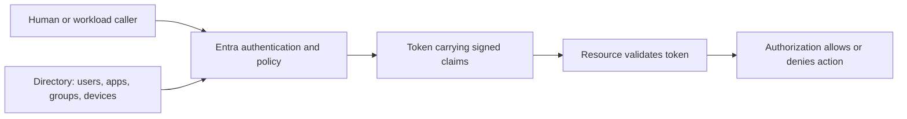
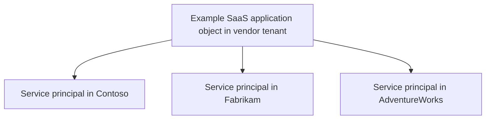

## Table of Contents

1. [Why Does Azure Need an Identity Layer?](#why-does-azure-need-an-identity-layer)
2. [How Do Tenants Organize People, Groups, and Devices?](#how-do-tenants-organize-people-groups-and-devices)
3. [How Do App Registrations and Service Principals Represent Software?](#how-do-app-registrations-and-service-principals-represent-software)
4. [How Do Managed Identities Remove Stored Credentials?](#how-do-managed-identities-remove-stored-credentials)
5. [How Do Tokens Prove Identity to a Resource?](#how-do-tokens-prove-identity-to-a-resource)
6. [How Does Conditional Access Evaluate Sign-In Context?](#how-does-conditional-access-evaluate-sign-in-context)
7. [How Are Entra Roles, Azure Roles, and Application Roles Different?](#how-are-entra-roles-azure-roles-and-application-roles-different)
8. [How Do You Trace Human and Workload Identity End to End?](#how-do-you-trace-human-and-workload-identity-end-to-end)
9. [Check Your Answers](#check-your-answers)
10. [References](#references)

When someone asks an application to do something, the application needs answers to two questions. Who is making the request? What is that person or program allowed to do? A correct password might help answer the first question, but it does not decide whether the caller should read an invoice, refund an order, or delete a production database.

Microsoft Entra ID supplies a common identity system for those decisions. Applications can use its identity records, authentication, policies, and tokens instead of building their own account and password systems independently. The resource receiving a request still has to apply the permissions relevant to that operation.

The following questions connect the directory objects you see in Entra to the sign-ins and service calls they support:

1. **Why Does Azure Need an Identity Layer?**
2. **How Do Tenants Organize People, Groups, and Devices?**
3. **How Do App Registrations and Service Principals Represent Software?**
4. **How Do Managed Identities Remove Stored Credentials?**
5. **How Do Tokens Prove Identity to a Resource?**
6. **How Does Conditional Access Evaluate Sign-In Context?**
7. **How Are Entra Roles, Azure Roles, and Application Roles Different?**
8. **How Do You Trace Human and Workload Identity End to End?**

## Why Does Azure Need an Identity Layer?
<!-- section-summary: Authentication establishes a caller's identity; authorization decides what that identity may do, so applications benefit from a shared identity authority. -->

**Authentication** establishes who or what a caller is. **Authorization** decides which operations that established identity may perform. Microsoft Entra ID is Microsoft's cloud identity and access management service for users, devices, applications, and resources. Its role is broader than storing Azure user accounts: it acts as an identity authority that other systems trust when making their own access decisions. [Microsoft's Entra overview](https://learn.microsoft.com/en-us/entra/fundamentals/what-is-entra) describes this scope.

A useful starting model is an identity authority supporting human, workload, and device identities. Through authentication and relevant policy checks, callers obtain tokens that communicate identity information. The receiving application or resource validates the relevant token and evaluates whether the requested action is permitted.


```mermaid
flowchart LR
  P[Human or workload caller] --> E[Entra authentication and policy]
  D[Directory: users, apps, groups, devices] --> E
  E --> T[Token carrying signed claims]
  T --> R[Resource validates token]
  R --> A[Authorization allows or denies action]
  class P,E,D,T,R,A neutral
```

The separation is deliberate. Proving that a request definitely came from Alice says nothing, by itself, about whether Alice should be allowed to delete the Production database. Conversely, a rule saying that Developers may read Production logs is useful only after the system establishes whether the requester is a member of that group. Authentication supplies a principal to evaluate; authorization evaluates that principal against the relevant rules.

### Why applications should share identity infrastructure

Imagine a company running 100 applications: email, Git hosting, the Azure portal, HR, payroll, an Orders API, CRM, a VPN, analytics, and an internal wiki among them. Each could maintain its own database of Alice, Bob, and Carol with a separate password for each application.

That design spreads account lifecycle work across the entire estate. When Alice leaves, someone must find every account. When she changes department, permissions must be updated in every relevant system. An MFA requirement must be implemented repeatedly. A compromised password creates separate investigations into what each application accepts and how it responds.

**Multi-factor authentication**, or MFA, requires more than one kind of authentication evidence. Having a shared identity provider lets applications delegate much of that specialized authentication work rather than implementing their own version. Alice authenticates through Entra, and applications such as Azure Portal, the Orders API, and Microsoft 365 receive the appropriate identity or token information.

This does not remove every application's access responsibilities. Payroll and the Orders API can still have different business rules. Central identity reduces duplicated identity mechanisms while allowing each system to authorize the work it owns.

### Distinguishing Entra ID from Windows domain services

The former name Azure Active Directory can suggest that Entra ID is simply a traditional Active Directory domain controller hosted in Azure. The technologies have different primary models.

**Active Directory Domain Services** is associated with domain controllers, computer domain membership, Group Policy, and protocols such as LDAP, Kerberos, and NTLM. These are the directory and authentication mechanisms commonly encountered in traditional Windows domain environments.

Modern Entra applications typically use OAuth 2.0, OpenID Connect, and SAML. At this level, the important point is that these protocols support application identity and sign-in relationships that differ from joining a computer to a traditional domain. Their presence in application configuration is a sign of that cloud identity model.

**Microsoft Entra Domain Services** is a separate managed service for workloads requiring traditional domain capabilities, including LDAP, Kerberos, and NTLM. Keep the three concepts distinct: Entra ID is the modern cloud identity provider; Active Directory Domain Services is traditional Windows domain infrastructure; Entra Domain Services provides managed domain capabilities for workloads that need them.

The platform is shared, but each organization still needs a defined boundary for its identity records. That boundary is the tenant.

## How Do Tenants Organize People, Groups, and Devices?
<!-- section-summary: A tenant gives identities organizational context; user objects, groups, device records, and authentication methods serve distinct identity-management purposes. -->

A **tenant** is an organization's instance of the Entra identity platform. It contains its identity objects, applications, and access policies. Contoso's tenant might hold users Alice, Bob, and Carol; Developers and Finance groups; device records; application objects; service principals; managed identities; and identity/security policies. [Microsoft's tenant overview](https://learn.microsoft.com/en-us/entra/identity/multi-tenant-organizations/overview) describes this identity and access-management scope.

The tenant ID matters because a caller's context includes the directory in which its identity exists. The system is identifying Alice inside Contoso, not merely receiving the string `alice@example.com`. The directory boundary gives that account and its relationships their meaning.

### A tenant can support several subscriptions

An Entra tenant describes identity. An Azure subscription describes an Azure resource, governance, and consumption boundary. Contoso can therefore use one tenant containing Alice, Bob, and PlatformTeam across Development, Production, and Security subscriptions.

The subscriptions trust the tenant for identity rather than requiring duplicate copies of every employee account. Each subscription has a trust relationship with one tenant, and one tenant can be associated with multiple subscriptions. [Microsoft's subscription-association guidance](https://learn.microsoft.com/en-us/entra/fundamentals/how-subscriptions-associated-directory) explains that relationship.

When Alice opens the Azure portal, Contoso's Entra tenant establishes her identity. Azure then evaluates the relevant RBAC assignments before permitting an action in Production. The directory answers who Alice is; the resource permission system answers what she may do there. Merely having an account in the trusted tenant does not answer the second question.

### The account is different from its authentication method

Alice's identity is not her password. A password is one possible piece of evidence that she controls the account. An authenticator, passkey, certificate, security key, or another configured method can provide authentication evidence as well.

This distinction explains how authentication can change without replacing the person represented by the account. Alice can move to a different authentication method while remaining the same directory identity with the same organizational context. Account lifecycle and credential lifecycle are related responsibilities, but they are not the same object.

A **user object** normally represents the person. It includes an object ID, username or sign-in identifiers, name, group memberships, account state, assigned roles, and other attributes. The object ID identifies that particular directory record. An application is relying on an established security principal, not just trusting that someone typed Alice's email address.

For example, Alice can belong to Developers, have access to Application A, and hold Reader on Azure Subscription B. These are relationships attached to the identity. They remain intelligible even when the authentication method used to prove that identity changes.

### Groups reduce repeated permission relationships

Suppose 500 developers need access to 30 systems. Assigning every person separately creates a large set of individual person-to-system relationships. It also makes department moves and account reviews unnecessarily repetitive.

A group allows collective access relationships. Alice, Bob, and Carol join Developers, and the group receives the appropriate application access. Joining Engineering can mean adding Alice to Developers; moving to Finance can mean removing her from Developers and adding her to Finance.

The point of grouping is to manage many identity relationships through a smaller number of meaningful collections. It does not make membership decisions unimportant. Membership is precisely the input through which a person's access changes, so the group should correspond to a real organizational or access need.

### Devices add context about how access is attempted

Knowing that Alice is the caller may be insufficient for a sensitive application. Alice using a corporate managed laptop and Alice using an unknown unmanaged laptop present different contexts even though the human identity is the same.

Entra can represent devices and use device information in access decisions. Device state and platform can contribute alongside user, application, location, and risk information. The resulting decision can consider who is signing in, the strength of authentication, the device, the target application, location or risk signals, and applicable policy.

This is why identity security reaches beyond a username-and-password check. The next section extends the same reasoning beyond people: applications need identifiable records and access relationships too.

## How Do App Registrations and Service Principals Represent Software?
<!-- section-summary: An app registration defines an application in its home tenant, while a service principal represents that application as an authorizable identity in a particular tenant. -->

Suppose the Orders API reads blobs from Azure Storage using an account name and `storageKey=SUPER-SECRET-KEY`. That key now needs a home: perhaps an environment variable, configuration file, CI/CD variable, Kubernetes Secret, developer laptop, or deployment script.

The organization must create, distribute, protect, rotate, replace, and revoke it, while preventing accidental commits to Git. This is both a security burden and an operational reliability problem. Giving software its own identity creates a stable object to authorize instead of treating possession of a copied service key as the whole access model.

### Define the application's relationship with Entra

An **app registration** tells Entra about an application. If users should sign into an Orders Web Application through Entra, the platform needs to know which application it is, which tenant owns it, where authentication responses may return, which APIs it requests, whether it exposes API permissions, and whether it supports one tenant or multiple tenants.

Registering it creates an **application object** in its home tenant. This object is the application's definition or blueprint. Its configuration can include the application/client ID, redirect URIs, supported account types, API permissions, exposed scopes, app roles, certificates, and credentials. A redirect URI specifies an allowed destination for an authentication response; an exposed scope describes a permission offered by an API.

These settings describe how the application participates in identity flows. They do not, by themselves, constitute a separate local security identity in every tenant where the application is used. That local representation is a service principal.

### Give each tenant a local application identity

Imagine a vendor defines Example SaaS in its own tenant. Contoso, Fabrikam, and AdventureWorks then use that application. Each customer needs a local way to express who may use it, what the application may access, and which tenant-specific configuration applies.

A **service principal** supplies that local representation. The application object remains the definition in the home tenant, while service principals represent the application in the tenants where it is used. [Microsoft's application-object documentation](https://learn.microsoft.com/en-us/entra/identity-platform/app-objects-and-service-principals) explains this relationship.


```mermaid
flowchart TD
  A[Example SaaS application object in vendor tenant]
  A --> C[Service principal in Contoso]
  A --> F[Service principal in Fabrikam]
  A --> W[Service principal in AdventureWorks]
  class A,C,F,W neutral
```

The class-and-instance analogy can help: an application object resembles a blueprint, and each service principal resembles an instance in a tenant. The analogy is approximate, but it captures the important difference between defining the software's identity configuration and representing its local access relationship.

### Understand the two administrative views

The Entra interface reflects this distinction. **App registrations** is the developer-oriented view of application objects and their definitions. **Enterprise applications** is commonly the administrative view of service principals—the applications present in the tenant and their local access relationships.

An application you register can appear through both perspectives. One view answers how the application is defined. The other answers how its local identity and access are managed in this tenant. Seeing both entries is therefore not evidence that they are interchangeable objects or an unnecessary duplicate.

The service principal matters because authorization needs a principal to receive permission. A human permission can name Alice. A software permission can name the Orders API service principal. For example, combine that principal with Storage Blob Data Reader at Storage Account X to define what that application may read.

### Keep the identifiers and credentials distinct

The **client ID** identifies the application's identity configuration. An **object ID**, or principal ID where appropriate, identifies a particular directory object or security principal. Both are identifiers; neither is proof that the caller controls the identity merely because it knows the value.

A traditional application authentication arrangement combines a client ID with a client secret, or a client ID with a certificate. The application presents authentication evidence to Entra, which verifies it and can issue a token. The certificate arrangement still involves private-key material that must be managed securely.

This is more structured than sharing arbitrary resource passwords, but the credential-management work remains. The organization still has to protect and maintain the secret or private key used to prove the application's identity. Managed identity addresses that remaining problem for supported Azure workloads.

## How Do Managed Identities Remove Stored Credentials?
<!-- section-summary: Managed identity lets supported Azure workloads obtain tokens without developers distributing long-lived credentials; system- and user-assigned identities differ mainly in lifecycle. -->

A **managed identity** is an Entra identity whose credential lifecycle Azure manages for a supported workload. Behind the scenes, it is represented by a special kind of service principal. Its purpose is to let application code obtain Entra tokens without developers supplying and maintaining the identity's long-lived credential. [The managed identity overview](https://learn.microsoft.com/en-us/entra/identity/managed-identities-azure-resources/overview) describes this design.

For an Azure-hosted Orders API, the application requests a token intended for Storage through the supported managed identity mechanism. Azure and Entra establish the workload identity and return an access token. The API then presents that token to Storage.

The application can avoid a setting such as `CLIENT_SECRET=abc123...` for that supported identity relationship. Developers do not receive a long-lived identity password that they must distribute or rotate across configuration files. They do receive temporary tokens as needed, which still require appropriate handling.

The useful improvement is eliminating a credential the application team would otherwise have to possess. That does not eliminate the identity, the access request, or the target service's permission checks. Managed identity supplies a way to prove the workload identity; authorization still determines what the workload may do.

### System-assigned identity follows one resource

A **system-assigned managed identity** belongs directly to an Azure resource. For VM-01, enabling that identity creates an identity associated with VM-01's lifecycle. Deleting the VM removes its system-assigned identity.

That coupling is useful to understand when reasoning about ownership. The identity represents that resource's workload relationship, so it does not remain an independently reusable identity after the resource disappears. Lifecycle here means the relationship among creation, continued existence, and deletion of the resource and its identity.

### User-assigned identity has an independent lifecycle

A **user-assigned managed identity** is a separate Azure resource. An identity such as SharedWorkloadIdentity can be associated with supported App A, App B, and App C resources. Its existence is independent of any single attached application's lifecycle.

The distinction is therefore resource-coupled identity versus independent reusable identity. “System-assigned” and “user-assigned” do not mean secure and insecure categories. The relevant questions are whether the identity should follow one resource and whether more than one supported resource needs to use it.

The independent identity remains an explicit object to manage. Reuse is a lifecycle and design capability; it does not replace the need to review which workloads share the identity and what permissions that identity receives. This follows directly from the principal-based authorization model introduced in the previous section.

### Follow the application-to-Storage call

The Orders API asks for a Storage-targeted token through managed identity infrastructure. Entra verifies the workload identity and returns an access token. The API includes it in an authorization header when calling Storage:

```http
Authorization: Bearer <token>
```

Here `<token>` is a placeholder for a sensitive temporary credential, not a literal value to send. Storage validates the token and evaluates permissions before allowing or denying the operation. There is no hardcoded Storage password in this flow.

This is the same separation seen for people: establish identity, communicate trustworthy evidence, and evaluate authorization at the resource. To understand why that evidence can be used across a service call, we need to examine what a token contains and what the receiver must check.

## How Do Tokens Prove Identity to a Resource?
<!-- section-summary: Tokens carry signed claims for a particular recipient and limited lifetime; ID, access, and refresh tokens have different purposes and must not be treated interchangeably. -->

A **security token** carries information about authentication or authorization from an identity provider to a client or protected resource. After Alice authenticates, Entra can issue a token that travels with the appropriate interaction. The receiving system validates it instead of asking Alice to provide her Entra password again.

This avoids designing every API request around repeatedly asking whether Alice is still the same person. The token communicates evidence that the resource can evaluate. [Microsoft's token overview](https://learn.microsoft.com/en-us/entra/identity-platform/security-tokens) explains the relationship among providers, clients, resources, tokens, and claims.

### Read a token as a signed statement

A simplified token for the Orders API might express these facts:

```text
Issuer: Microsoft Entra ID
Tenant: Contoso
Subject: Alice
Audience: Orders API
Scopes: Orders.Read, Orders.Create
Expires: 17:15
Signature: ...
```

These individual assertions are **claims**. A claim is a name/value statement, such as `subject=Alice's object ID`, `tenant=Contoso`, `audience=Orders API`, or `scope=Orders.Read`. Claims describe what the token asserts; their existence as text is not sufficient reason to trust them.

The cryptographic signature provides essential verification. Without checking it, a caller could fabricate a statement such as `role=GlobalAdministrator`. The protected resource instead verifies that the token came from a trusted issuer and is intended for that resource. The name inside an unverified token is no stronger than another unverified statement made by the caller.

This is why tokens are useful as evidence rather than just convenient containers for user details. Their meaning depends on validation of the issuer, recipient, and other relevant token conditions, not on a client merely being able to read the claims.

### Audience limits where an access token is valid

An **audience** identifies the protected API or resource for which an access token was issued. A valid Microsoft Graph access token is not automatically a valid Orders API credential. A correctly implemented Orders API should reject a token intended for Graph, even if its signature comes from a legitimate Microsoft issuer.

Conversely, a token whose audience is Orders API is aimed at that API, subject to the remaining validation and authorization checks. This prevents one token from acting as a universal key across unrelated resources. Knowing that a token is valid somewhere is not enough; it must be suitable for the receiver evaluating this request.

The same rule explains why the managed identity flow requests a token targeted at Storage. The workload is asking for evidence appropriate to the service it intends to call, not an unspecified credential for every Azure operation.

### Separate token types by purpose

| Token type | Intended purpose |
|---|---|
| ID token | Tell a client who successfully authenticated to it |
| Access token | Provide the credential a client presents to a protected API or resource |
| Refresh token | Allow a client to obtain new tokens without requiring a completely new interactive authentication each time |

An ID token is therefore not a universal API authorization token. It communicates authentication information to its client. The protected API expects an access token suitable for that API. Treating the two interchangeably loses the recipient and purpose distinctions that make the token model useful.

Clients should also avoid building assumptions around an API access token's internal format. The protected resource is responsible for validating its access token. The client uses the token for its intended request rather than treating the token's contents as a guaranteed interface for unrelated client logic. [Microsoft's access-token guidance](https://learn.microsoft.com/en-us/entra/identity-platform/access-tokens) discusses these responsibilities.

### Expiration limits exposure without making theft harmless

Access tokens are temporary credentials. A caller authenticates, obtains a short-lived access token, uses it, and eventually reaches its expiration. A stolen permanent password or key can remain useful until changed; an expiring token has a limited validity window.

That limitation reduces one dimension of exposure. It does not make token theft harmless. An access token remains sensitive credential material while valid and should be treated accordingly. Reading a token as “only identity information” would miss the fact that it is used to gain access to a protected resource.

Token issuance also depends on whether the sign-in is acceptable under the organization's policies. Establishing the account and checking the first authentication factor may leave important context unanswered, which is where Conditional Access enters the picture.

## How Does Conditional Access Evaluate Sign-In Context?
<!-- section-summary: Conditional Access combines identity, device, application, location, risk, and policy signals to determine acceptable access conditions, separately from resource permissions. -->

**Conditional Access** evaluates the circumstances under which access should proceed. A password-correct check alone cannot express every security requirement for a modern application. Entra can combine signals about the user, device, application, location, and risk with organizational policy. Microsoft describes it as a Zero Trust policy engine. [The Conditional Access overview](https://learn.microsoft.com/en-us/entra/identity/conditional-access/overview) explains this contextual model.

Consider Alice signing in from London on a corporate laptop with a normal sign-in pattern. Compare that with Alice attempting to reach a sensitive administrative application from an unusual location using an unknown device. Both attempts may provide valid first-factor evidence, yet the organization can require different behavior because the contexts differ.

The first factor is one part of the authentication evidence, not the entire access decision. Requiring stronger authentication for a sensitive situation follows from the difference in context rather than assuming all successful password checks deserve the same trust.

### Express access conditions as policies

A policy can state that a privileged administrator accessing Azure management must use stronger authentication. Another can block a sensitive application when the device is not compliant. Device compliance refers to whether the device satisfies the relevant organization's requirements; the policy uses that signal as part of its decision.

These examples combine a caller or device condition with a target application or resource. They show why Conditional Access is more expressive than a single global password rule. The organization can evaluate the circumstances of the attempted access and require an appropriate response.

At the same time, the purpose remains bounded. A requirement for MFA or an acceptable device does not express which VM operations Alice may perform. It sets conditions under which the sign-in or access is accepted.

### Successful Conditional Access does not grant VM permissions

Suppose Alice completes the required MFA and uses an acceptable device before accessing Azure management. Azure Resource Manager still needs to determine whether she may delete a particular VM. Azure RBAC answers that resource permission question.

Conceptually, the path is authentication, contextual access evaluation, token issuance, the request to ARM, and RBAC's action-and-scope decision. Passing an earlier stage is necessary evidence for later stages, not permission to bypass them. A user can satisfy sign-in policy and still receive an authorization denial for a resource operation.

This distinction is important during troubleshooting. “MFA succeeded” and “the VM operation is allowed” are separate observations. Investigating a denied VM operation should include the role and scope rather than assuming the identity system must have failed because the user cannot perform the action.

### Identity contributes to the security boundary

Traditional network models often treated the inside of an office firewall as a trusted area. Modern users and applications work from homes, phones, cloud services, partner networks, multiple Azure regions, SaaS platforms, and automation pipelines. Being inside one office network is insufficient evidence for all those access relationships.

Identity context therefore forms a major security boundary. Decisions consider who is acting, which device is involved, which application is being accessed, what permissions apply, and what risk or other context the attempt presents. Conditional Access supplies part of this reasoning, while authorization continues at the directory, application, or Azure resource boundary that owns the requested action.

## How Are Entra Roles, Azure Roles, and Application Roles Different?
<!-- section-summary: Directory administration, Azure resource administration, and application business permissions use different authorization systems, all applied to established principals. -->

The word **role** appears in several places because different systems need to authorize different objects and actions. It does not identify one universal permission system spanning every directory setting, Azure resource, and application operation.

**Microsoft Entra roles** authorize directory administration. They can permit managing users, groups, applications, password resets, and directory settings. **Azure RBAC roles** authorize Azure resource operations, such as managing VMs, reading storage configuration, managing resource groups, and deploying resources.

Microsoft documents these as separate authorization systems with separate role definitions, assignments, data stores, and decision points. [The Entra role-concepts guidance](https://learn.microsoft.com/en-us/entra/identity/role-based-access-control/concept-understand-roles) explains the separation.

For example, Global Administrator is an Entra directory role. Virtual Machine Contributor is an Azure RBAC role. The titles refer to different administrative domains. Treating them as interchangeable would confuse administration of identity records with administration of compute resources.

### Applications have their own authorization rules

The Orders API can expose permissions such as `Orders.Read`, `Orders.Create`, and `Orders.Admin`. It may evaluate scopes, app roles, claims, and its own business rules before accepting an operation.

The layers answer different questions. Entra authentication establishes the caller. Conditional Access evaluates the conditions under which access proceeds. API permissions and relevant claims describe what the client has been granted for that API. Application authorization decides whether this operation satisfies the business rules. Azure RBAC determines what the principal may do to Azure resources.

A user allowed to view orders is not necessarily allowed to refund them or administer the application. Likewise, an application's ability to use its own business API does not automatically authorize it to change the Azure resource hosting that API. Each decision belongs to the system managing the relevant action.

### Principal is the shared authorization concept

A **security principal** is an identity that a permission system can authorize. Users, groups, and service principals fit this model; managed identity is a special workload case represented by a service principal.

Authorization can therefore use principal, role, and scope whether the principal represents Alice, Developers, the Orders API, a managed identity, or an automation pipeline. Human and software callers behave differently, but permission assignment needs a stable identity to evaluate in both cases.

This abstraction replaces the need to rely on one shared all-applications Storage administrator key. Different applications can have different permissions attached to their own identities. The Orders API may read an invoice container, Billing may read and write it, and Analytics may read only exports.

### Least privilege follows from explicit identities

**Least privilege** means giving an identity only the access required for its job, at the appropriate scope and duration. Explicit identities make that separation possible: the application needing read-only invoices does not have to share the broader credential used by a different service.

The same reasoning applies to people and groups. The permission relationship should describe what the role requires, not assume that recognizing the caller justifies broad trust. The purpose of authentication is to establish the principal accurately so those narrower decisions can be applied.

With the objects and boundaries separated, the full flow is easier to trace. That trace should include not only the successful request but the evidence needed to investigate sign-ins and subsequent actions.

## How Do You Trace Human and Workload Identity End to End?
<!-- section-summary: Follow the caller from tenant and authentication through policy, token, and resource authorization, then correlate identity evidence with operation evidence. -->

Start with Alice visiting the internal Orders Web Application. The application redirects her to Entra ID rather than collecting her Entra password itself. Entra identifies the Contoso tenant and Alice's account, then she authenticates through the configured method—passwordless authentication, MFA, or another supported arrangement.

Conditional Access evaluates the user, device, target application, location or risk, and policy. Entra issues an ID token and, where required, an access token. The application receives the relevant identity information, including Alice's tenant context and claims, and applies its own permissions: may she view orders, issue a refund, or administer the application?

This is the architectural benefit of federation and tokens. **Federation** lets the application rely on an external identity authority for authentication evidence. The application can decide how Alice may use its features without needing to receive her Entra password.

### Trace software and administrator calls separately

The Orders API then reads invoices from Storage using its managed identity. It requests a Storage-targeted token, obtains temporary identity evidence from Entra, and presents it to Storage. Storage validates the token and evaluates access before returning data such as `invoice.pdf`.

An administrator managing the Azure environment follows another path: authenticate through Entra, call Azure Resource Manager, and pass the relevant Azure RBAC check at subscription, resource-group, or resource scope. This is a different authorization decision from Alice's permission to call `GET /orders` in the application.

The Contoso example contains a user principal for Alice, an app registration and service principal for the Orders Web App, and a managed-identity service principal for the Orders API. One identity authority supports all three scenarios, while the directory, application, and Azure services retain their respective permission decisions.

### Collect evidence about authentication and identity changes

If an attacker signs in as Alice, the security team needs more than the final fact that access succeeded. It needs the time, location, account, authentication method, application, whether MFA was required, whether Conditional Access applied, and whether earlier attempts failed.

The investigation also needs to know whether directory objects or privileges changed. Entra sign-in and audit information supplies identity evidence across users and applications. Managed identities can also have sign-in activity inspected through Entra sign-in logs. Auditability is therefore part of operating the identity system, not an optional concern separate from authentication.

These records help connect a security decision to the conditions under which it happened. An apparently legitimate account name cannot explain whether the sign-in came from expected circumstances or whether the account's permissions had just changed.

### Correlate sign-in evidence with Azure operations

If Alice deletes a VM, there are two related investigations. The identity layer asks whether Alice authenticated, which account and sign-in were involved, and which conditions applied. The Azure resource layer asks which operation occurred, against which resource, at what time, and whether it succeeded.

Entra logs provide identity and authentication evidence. The Azure Activity Log provides Azure control-plane operation evidence. Correlating them yields a more complete account of what happened than assuming either record contains every part of the story.

The distinction mirrors the architecture: authenticating a caller and performing an operation are separate stages. Evidence should be examined at both stages when reconstructing a change or access incident.

### Keep the terminology tied to its job

| Concept | Meaning in the identity flow |
|---|---|
| Tenant | Organizational identity universe containing records and policies |
| User | Directory representation of a person |
| Group | Collection used to manage identity and access relationships |
| Device | Device representation and associated trust signals |
| App registration | Configuration that introduces an application to Entra |
| Application object | Application definition in its home tenant |
| Service principal | Application's local, authorizable identity in a tenant |
| Enterprise application | Administrative view commonly used for that service principal |
| Managed identity | Azure-managed workload identity represented by a special service principal |
| Client ID | Identifier associated with application identity configuration |
| Object/principal ID | Identifier of a particular directory object or principal |
| Token and claims | Temporary evidence and the assertions carried within it |
| Conditional Access | Contextual sign-in and access policy evaluation |
| Entra roles | Directory-administration authorization |
| Azure RBAC | Azure resource-operation authorization |

Six questions make a useful review: which tenant is involved, who or what is acting, how the identity was proved, which sign-in conditions were evaluated, how evidence reached the receiving system, and what the identity may do there. These questions apply across portal menus and product-specific views because they follow the underlying flow.

The overall model is a directory and policy engine supporting token issuance. The directory supplies identity records; authentication verifies the caller; Conditional Access evaluates context; tokens communicate trusted claims; the resource validates the evidence and applies authorization. Entra makes identity evidence available to cooperating systems, and those systems use it with their own rules to decide whether to allow the requested action.

## Check Your Answers

:::expand[Why Does Azure Need an Identity Layer?]{kind="recap"}
Authentication and authorization answer different questions. A shared identity authority avoids rebuilding account and authentication mechanisms in every application, while each resource still evaluates its own permissions. Entra ID also differs from traditional and managed domain services.
:::

:::expand[How Do Tenants Organize People, Groups, and Devices?]{kind="recap"}
The tenant supplies organizational identity context and can serve several subscriptions. User objects represent people, groups simplify shared access, devices contribute context, and authentication methods prove control of identities without being the identities themselves.
:::

:::expand[How Do App Registrations and Service Principals Represent Software?]{kind="recap"}
An app registration creates the application's definition in its home tenant. A service principal represents it locally for tenant-specific access. App registrations and Enterprise applications expose those different perspectives, and identifiers must be distinguished from authentication credentials.
:::

:::expand[How Do Managed Identities Remove Stored Credentials?]{kind="recap"}
Supported workloads obtain Entra tokens through Azure-managed identity credentials instead of distributing their own long-lived secret. System-assigned identity follows one resource's lifecycle; user-assigned identity exists independently and can be attached to multiple supported resources.
:::

:::expand[How Do Tokens Prove Identity to a Resource?]{kind="recap"}
Tokens carry signed claims that the receiver validates for its purpose and audience. ID tokens, access tokens, and refresh tokens have different roles. Access tokens expire but remain sensitive credentials, and a token for Graph is not automatically valid for Orders API.
:::

:::expand[How Does Conditional Access Evaluate Sign-In Context?]{kind="recap"}
It combines user, device, application, location, risk, and policy signals to require appropriate authentication or block access. Passing those conditions does not grant resource permissions; Azure RBAC still evaluates the requested action and scope.
:::

:::expand[How Are Entra Roles, Azure Roles, and Application Roles Different?]{kind="recap"}
Entra roles govern directory administration, Azure RBAC governs Azure resources, and application permissions govern API operations and business rules. All depend on established principals. Least privilege limits each principal to the access, scope, and duration its job requires.
:::

:::expand[How Do You Trace Human and Workload Identity End to End?]{kind="recap"}
Follow tenant, caller, authentication, policy, token, and resource authorization. Trace human application use, workload calls, and Azure administration separately. Correlate Entra sign-in/audit evidence with Activity Log operations when investigating changes or incidents.
:::

## References

- [What is Microsoft Entra?](https://learn.microsoft.com/en-us/entra/fundamentals/what-is-entra)
- [Multitenant organization concepts](https://learn.microsoft.com/en-us/entra/identity/multi-tenant-organizations/overview)
- [Associate a subscription with an Entra tenant](https://learn.microsoft.com/en-us/entra/fundamentals/how-subscriptions-associated-directory)
- [Conditional Access overview](https://learn.microsoft.com/en-us/entra/identity/conditional-access/overview)
- [Managed identities for Azure resources](https://learn.microsoft.com/en-us/entra/identity/managed-identities-azure-resources/overview)
- [Application objects and service principals](https://learn.microsoft.com/en-us/entra/identity-platform/app-objects-and-service-principals)
- [Tokens and claims overview](https://learn.microsoft.com/en-us/entra/identity-platform/security-tokens)
- [Access tokens](https://learn.microsoft.com/en-us/entra/identity-platform/access-tokens)
- [Microsoft Entra role concepts](https://learn.microsoft.com/en-us/entra/identity/role-based-access-control/concept-understand-roles)
