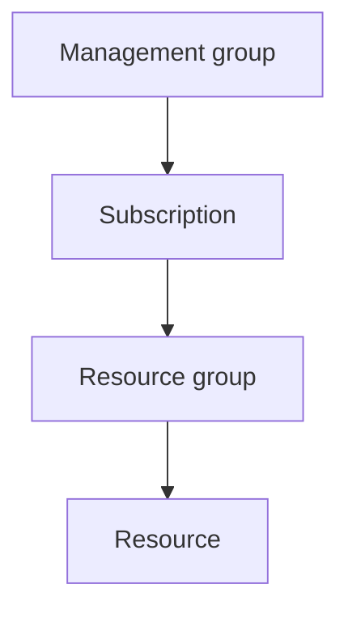
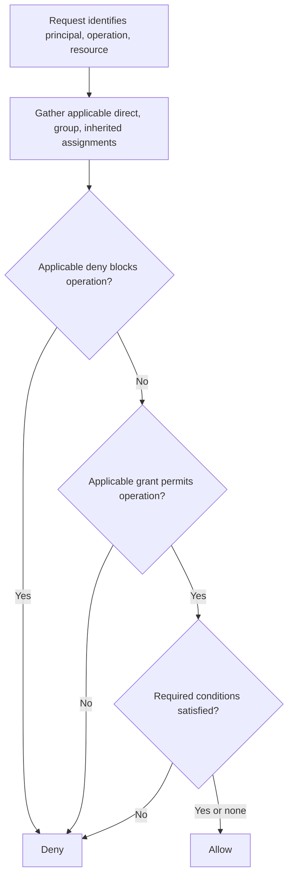
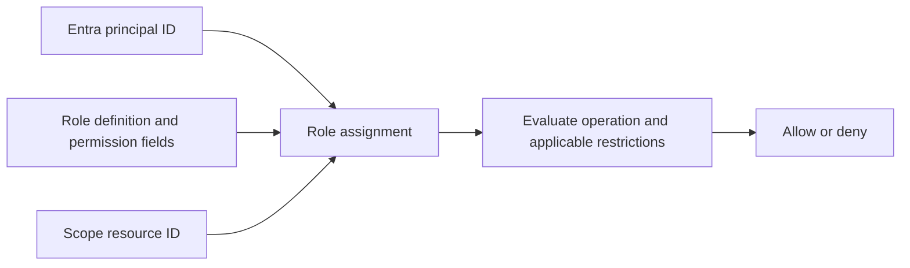

## Table of Contents

1. [Why Does Azure RBAC Exist?](#why-does-azure-rbac-exist)
2. [Who Can Receive an Azure Role?](#who-can-receive-an-azure-role)
3. [What Do Role Definitions Allow?](#what-do-role-definitions-allow)
4. [Where Does a Role Assignment Apply?](#where-does-a-role-assignment-apply)
5. [How Does Azure Evaluate an Access Request?](#how-does-azure-evaluate-an-access-request)
6. [How Do You Design Least-Privilege Access?](#how-do-you-design-least-privilege-access)
7. [How Do You Diagnose an RBAC Failure With Evidence?](#how-do-you-diagnose-an-rbac-failure-with-evidence)
8. [How Does the Complete RBAC Model Fit Together?](#how-does-the-complete-rbac-model-fit-together)
9. [Check Your Answers](#check-your-answers)
10. [References](#references)

Alice signs in successfully and asks Azure to delete `vm-prod-01`. Azure knows who she is, but that does not answer whether she should be allowed to delete this VM. The operation, its target, and Alice's assigned permissions still need to be checked.

Azure RBAC makes that permission decision through a small set of connected objects. A principal identifies the caller, a role describes permitted operations, and a scope states where those permissions apply. Understanding that combination explains both ordinary access assignments and confusing cases such as a Reader who can still modify resources.

We will build that model and then use it to review and investigate access:

1. **Why Does Azure RBAC Exist?**
2. **Who Can Receive an Azure Role?**
3. **What Do Role Definitions Allow?**
4. **Where Does a Role Assignment Apply?**
5. **How Does Azure Evaluate an Access Request?**
6. **How Do You Design Least-Privilege Access?**
7. **How Do You Diagnose an RBAC Failure With Evidence?**
8. **How Does the Complete RBAC Model Fit Together?**

## Why Does Azure RBAC Exist?
<!-- section-summary: Azure RBAC groups operations into reusable roles and grants them to established principals at a defined resource scope. -->

**Azure role-based access control**, or Azure RBAC, is Azure's primary authorization system for Azure resources. It is built on Azure Resource Manager and controls who has access, what they may do, and where they may do it. [Microsoft's RBAC overview](https://learn.microsoft.com/en-us/azure/role-based-access-control/overview) describes these three dimensions.

The central relationship is a **role assignment**: a security principal plus a role definition plus a scope. A principal answers who receives access. A role definition answers which operations are permitted. Scope answers which resources those permissions cover.

For example, Alice plus Virtual Machine Contributor plus `rg-payments-prod` grants the VM-management operations included in that role within the specified resource-group scope. Each component contributes information the other two cannot supply. Alice's identity does not describe the action set, and the role name does not identify the target estate.

### Authentication establishes the caller

Authentication and authorization are separate decisions. Alice completing MFA establishes stronger evidence that she is the person signing in. It does not establish that she should be able to delete a production database or modify every resource in a subscription.

Entra authenticates the caller and issues an access token. Azure Resource Manager receives the token with the resource request and evaluates whether the established principal may perform this operation at this target. A correct identity is a prerequisite for permission evaluation, not a substitute for it.

Conditional Access remains a separate part of the sign-in context. It can require MFA, a compliant device, or an acceptable risk level before access proceeds. RBAC then checks the Azure resource operation. Passing a sign-in policy does not create a resource permission assignment.

### Roles make repeated access manageable

Imagine 500 engineers and 10,000 resources without roles. Individual rules would have to specify Alice's read and start access to VM1, read access to VM2 and VM3, storage visibility, and many other operations. Bob and Carol would require their own sets of similar rules.

People usually perform jobs: database administrator, network operator, security reader, VM operator, storage-data reader, or application developer. Those jobs require recognizable bundles of operations. A role captures a reusable bundle rather than forcing every assignment to repeat each individual permission.

Virtual Machine Contributor, for example, groups appropriate VM read, write, VM operations, and related management permissions. Assigning it uses that defined bundle instead of listing a fresh collection of actions for every operator. The definition still needs to be understood; the role's friendly title is a summary of its actual permissions.

This is the meaning of role-based access: permission sets are represented by roles and assigned to identities. The remaining question is which kind of identity receives the assignment, because Azure operations are performed by software as well as by people.

## Who Can Receive an Azure Role?
<!-- section-summary: Users, groups, service principals, and managed identities can receive roles; stable directory identifiers establish which principal actually receives access. -->

A **security principal** is an identity to which an authorization system can attach permission. Azure RBAC supports users, groups, service principals, and managed identities. These are primarily represented in Microsoft Entra ID, which provides their directory and authentication context.

The integration is close but the responsibilities differ. Entra defines and authenticates identities such as Alice, Payments-Developers, an Orders API service principal, or the API's managed identity. Azure RBAC associates those principals with Azure resource permissions.

### Assign a person directly or use a group

Alice has a user object in Entra. An assignment of Alice plus Reader plus Subscription A grants the resource-reading operations included in Reader at that subscription scope. It is a straightforward direct user assignment.

If 40 developers require the same access, repeating direct assignments for Alice, Bob, Carol, and every other developer becomes harder to maintain. A Payments-Developers group can receive Reader at the Payments subscription, and the people who need that role join the group.

Applicable access is transitive through supported group membership: a user's effective access includes a relevant role assigned to a group to which the user belongs. Adding Alice when she joins Payments and removing her when she leaves changes her relationship to the group assignment without editing equivalent Azure assignments across many resources.

[Microsoft's RBAC best practices](https://learn.microsoft.com/en-us/azure/role-based-access-control/best-practices) favor role assignment to groups over repeated direct assignments where that collective model fits. Group membership becomes an important part of the access evidence, because the user's permissions may not appear as a direct assignment on the resource.

### Give software an explicit principal

An Orders API reading invoices from Storage is a software caller. A service principal can represent that application's tenant-local security identity. Combining it with Storage Blob Data Reader at `invoice-storage` grants access to that explicit principal instead of relying on a shared human account or password.

A supported App Service called `orders-api` can use managed identity to avoid application-managed credentials. That identity is also represented by a security principal, and RBAC can assign it the same kind of role-and-scope relationship. Managed identity changes how the workload authenticates; it does not create a different interpretation of the role's permissions.

This unifying model lets RBAC evaluate Alice, a developer group, an application service principal, and a managed identity as principals. The system is authorizing identities, rather than treating permissions as a feature reserved for human users.

### Use object IDs rather than display names as evidence

The portal may display Alice Smith, but several directory objects can share that display name. Names can change too: an application might be renamed from `orders-api` to `orders-service`. Permission relationships need a more stable target than that text.

Entra directory objects have unique **object IDs**. Alice's display name can be Alice Smith while her object ID is a value such as `54b6b4a7-....`. Azure role assignments identify the principal through its relevant identifier, not merely through a label that operators recognize.

For applications, distinguish the application/client ID from the object or principal ID. The client ID identifies application/client configuration. The principal ID identifies a particular directory security principal. RBAC needs the latter relationship: which actual directory object receives the permission?

These identifiers make access reviews precise. Seeing the expected display name in an interface is a useful starting point, but a role assigned to a different object with a similar name does not authorize the caller making this request. Confirm the tenant and principal ID before concluding that the right identity has access.

The principal now answers who. To understand what that principal receives, inspect the role definition rather than relying only on its title.

## What Do Role Definitions Allow?
<!-- section-summary: Role definitions contain management and supported data operations; exclusions subtract from one role's grants, while separate assignments can add permissions. -->

A **role definition** is a reusable permission bundle. Azure provides built-in definitions and supports custom ones where needed. The definition describes allowed and excluded operations through `Actions`, `NotActions`, `DataActions`, and `NotDataActions`. [The role-definition documentation](https://learn.microsoft.com/en-us/azure/role-based-access-control/role-definitions) explains these fields.

A role definition is distinct from a role assignment. Reader can exist as a defined permission set without anyone receiving it. Alice can exist as a principal, and `rg-production` can exist as a scope, without any permission connecting them. Creating Alice plus Reader plus `rg-production` establishes the actual assignment.

The same definition can be reused in Alice plus Reader plus Resource Group A, Bob plus Reader plus Subscription B, and App X plus Reader plus Resource Y. Reusing the bundle does not force the assignments to share a principal or scope.

### Built-in roles illustrate different kinds of power

| Role | Broad purpose |
|---|---|
| Reader | View Azure resources |
| Contributor | Manage resources without general RBAC assignment administration |
| Owner | Manage resources and Azure RBAC access |
| Role Based Access Control Administrator | Manage Azure RBAC access |

Managing a VM and managing who may manage that VM are different powers. Contributor lets an operator broadly administer resources at the assignment scope, but it does not inherently let that operator make Bob an Owner. Azure separates resource administration from access administration so ordinary infrastructure work does not automatically include the power to change the permission system.

Creating a VM, modifying a network, and configuring an application are examples of resource work. Assigning Reader, Contributor, or Owner is access-administration work. [Microsoft's comparison of Azure and directory roles](https://learn.microsoft.com/en-us/azure/role-based-access-control/rbac-and-directory-admin-roles) describes the relevant built-in role capabilities.

### Actions describe control-plane operations

The **control plane** manages the Azure resource object itself. Examples include creating or resizing a VM, changing storage configuration, deleting a resource group, and reading Key Vault configuration. These operations use ARM or related management interfaces.

The `Actions` field includes allowed management operations, and `NotActions` subtracts selected operations from that role's grant. An operation such as `Microsoft.Compute/virtualMachines/read` uses the provider/type/action structure introduced in the resources article.

Read the components as a management service, a resource kind, and an action on that kind. Other provider operations can represent write, delete, or specific actions. These precise operations, rather than just the portal's “Virtual machine” label, are the authorization primitives used in role definitions.

### DataActions describe supported service-data operations

Reading a storage account's configuration and reading the blobs stored inside it are different requests. The first asks about the managed resource. The second asks to access the data exposed by its service.

`DataActions` includes supported data-plane operations, while `NotDataActions` excludes operations from that role's data grant. A provider operation shaped like `Microsoft.Storage/.../blobs/read` concerns actual blob data. The abbreviated path illustrates the operation family; an implementation must use the complete operation defined by the provider.

This explains a common misunderstanding of Reader. Reader at storage-account scope can allow inspection of the resource's existence, region, configuration, and properties without granting Entra-based access to `secret.txt`, `invoice.pdf`, or `customer-record.json` inside it. Storage Blob Data Reader addresses the different job of reading blob contents.

The distinction appears throughout Azure: configuring and resizing are management tasks, while reading blobs, sending queue messages, querying secrets, and accessing service data are data tasks. Not every service uses Azure RBAC for every data-plane operation, so the target's supported authorization model still matters.

### NotActions subtracts from one role, not every role

Consider a simplified custom permission definition:

```text
Actions:
  *
NotActions:
  Microsoft.Authorization/roleAssignments/write
```

The exclusion removes role-assignment write from this role's allowed management operations. It does not create a global denial forbidding the principal from obtaining that permission elsewhere.

Conceptually, this role's management grant is `Actions - NotActions`, and its data grant is `DataActions - NotDataActions`. If Role A grants everything except operation X and Role B explicitly grants X, the principal can still receive X through Role B. The exception belongs to the first role's permission definition.

This follows Azure RBAC's additive model. Applicable role grants normally combine rather than replacing one another. Alice can hold Reader at a subscription and Virtual Machine Contributor at `rg-compute`; within that group, the applicable grants include both bundles.

The same principle prevents a narrow Reader assignment from cancelling a broader Contributor assignment. If Alice is Contributor at the subscription and Reader at a child group, the inherited Contributor capabilities still apply. Adding a less-powerful role below does not subtract an existing grant above.

The role definition tells us which operations an assignment can contribute. The scope tells us where that contribution reaches, and is just as important when judging actual access.

## Where Does a Role Assignment Apply?
<!-- section-summary: Scope defines the resource set covered by an assignment; inherited grants flow down the hierarchy, and assignments themselves are addressable authorization resources. -->

**Scope** is the set of Azure resources to which a role assignment applies. Reader for one VM and Reader across the entire Azure estate use a similar permission bundle with dramatically different reach.

The four standard hierarchical scopes are management group, subscription, resource group, and resource. Lower scopes inherit applicable assignments from their ancestors. [The scope overview](https://learn.microsoft.com/en-us/azure/role-based-access-control/scope-overview) documents this parent-child model.



Suppose Production contains `rg-orders`, with `orders-api` and `orders-db`, and `rg-payments`, with `payments-api` and `payments-db`. Alice's Reader assignment at Production reaches the applicable resources in both groups. Looking only for a direct assignment on `orders-api` would miss the parent grant explaining her access.

A role assigned to one group does not automatically reach a sibling group, because the sibling is outside that assignment's descendants. The inheritance follows the management hierarchy, so determining the target's ancestors is part of evaluating which grants apply.

### Narrow both the permission and its reach

If the Orders API only needs invoices from `invoice-storage`, Storage Blob Data Reader at the subscription may technically allow the required request. It can also expose other matching Storage resources in that subscription to the same identity.

Assigning the role at `invoice-storage` instead limits the grant to that target and applicable children. If the API identity is compromised, the permission's narrower reach reduces what that identity can expose. [Microsoft's assignment guidance](https://learn.microsoft.com/en-us/azure/role-based-access-control/role-assignments) recommends the smallest scope that satisfies the requirement.

Least privilege therefore has at least two dimensions: a narrow set of operations and a narrow set of resources. Selecting a read-only role is insufficient if it grants access across an unnecessarily large estate. Role and scope must be reviewed together.

### The assignment connects three independently identified objects

The Orders API managed identity plus Storage Blob Data Reader plus `invoice-storage` is a role assignment. It permits the role's data operations against that scope and applicable children. Access is granted by creating an assignment and revoked by removing it, subject to any other applicable grants that remain.

The assignment itself is also an Azure resource under `Microsoft.Authorization/roleAssignments`. Authorization configuration can therefore be created, enumerated, automated, audited, and managed through infrastructure tooling. It is configuration data, not an invisible permission state existing only inside the portal.

This matters for repeatable access management. A deployment or review can inspect explicit role-assignment objects and compare their principal, role, and scope, rather than depending on a person's recollection of which portal actions were performed.

### Roles and assignments have identifiers too

The role definition has its own ID. “Reader” is its human-friendly name, while the unique role ID identifies the permission bundle for automation. Microsoft recommends unique role IDs in scripts because built-in role IDs remain stable even if naming changes.

Four identifiers can therefore appear during an access review:

| Identifier | Object or relationship it identifies |
|---|---|
| Principal ID | Directory principal receiving access |
| Role definition ID | Permission bundle being assigned |
| Scope resource ID | Resource boundary covered by the assignment |
| Role assignment ID | Particular assignment connecting the other parts |

A role assignment can be read as `principalId`, `roleDefinitionId`, and `scope`, with its own assignment identity. Distinguishing those fields avoids confusing the application's client ID with a role ID or treating a resource name as a complete scope.

Once these objects are established, Azure evaluates a request by collecting the assignments that apply to the actual caller and target.

## How Does Azure Evaluate an Access Request?
<!-- section-summary: Azure evaluates the caller, operation, applicable direct/group/inherited grants, deny assignments, and supported conditions to reach an authorization decision. -->

Suppose Alice sends a request equivalent to `POST .../virtualMachines/vm-prod-01/start`. Azure must determine whether that particular caller may perform the VM-start operation on that particular resource. The following model summarizes the evaluation for ARM and Azure-RBAC-integrated data services.

First, the request includes a token from Entra. Relevant token information establishes tenant and principal identity, with group information and other claims contributing to the identity context. Azure now has the caller to evaluate rather than an unverified display name.

Second, the target and action are identified:

```text
Operation: Microsoft.Compute/virtualMachines/start/action
Resource: /subscriptions/PROD/resourceGroups/rg-payments/providers/Microsoft.Compute/virtualMachines/vm-prod-01
```

The exact resource path supplies where, and the provider action supplies what. This level of precision is necessary because read, write, start, and delete requests can require different permissions on the same VM.

### Gather direct, group, and inherited assignments

Azure considers applicable assignments made directly to Alice, assignments made to groups she belongs to, and assignments at the resource or its applicable resource-group, subscription, and management-group ancestors.

For example, a management group may grant Alice Reader while a subscription grants DevTeam Virtual Machine Contributor. If Alice belongs to DevTeam, both applicable grants can contribute at the VM. Group membership and scope inheritance are therefore independent ways an assignment can become relevant to the same request.

The combined grant might include read from Role A, VM start and restart from Role B, and monitoring read from Role C. RBAC's additive model combines the permitted operations from applicable assignments, with each role's exclusions taken into account.

The system then asks whether `Microsoft.Compute/virtualMachines/start/action` is covered. If no applicable grant permits it, authorization is denied. If a grant covers it, additional restrictions such as applicable denies and conditions still need to be considered.

### Deny assignments can override grants

A **deny assignment** is a separate Azure mechanism capable of blocking an action even when a role assignment allows it. If a role grants Alice deletion of X and an applicable deny assignment blocks that deletion, the deny takes precedence.

This is distinct from `NotActions`. An exclusion removes an action from one role's contribution; another role can still grant it. A deny assignment can block the operation despite such a grant. Mixing those concepts would produce incorrect conclusions about the caller's effective access.

Administrators generally do not create arbitrary deny assignments in the same way they create ordinary role assignments. Azure creates and manages them for specific platform mechanisms, such as protected managed resources and certain deployment-stack scenarios. [Microsoft's deny-assignment documentation](https://learn.microsoft.com/en-us/azure/role-based-access-control/deny-assignments) explains this limitation.

The ordinary design model remains additive grants with carefully selected scopes. It is not an unrestricted manual allow/deny rule language for shaping every permission relationship. When an applicable platform deny exists, however, it must be included in the evaluation and the investigation.

### Conditions can narrow supported role assignments

Sometimes role plus scope is still broader than the requirement. Alice might need blob-read access only when a supported attribute condition matches `Project=Blue`. Azure attribute-based access control, or **ABAC**, adds conditions to supported RBAC role assignments.

The conceptual relationship is Alice plus Storage Blob Data Reader plus the storage-account scope plus a condition selecting the relevant Project attribute. The condition narrows the permission contributed by that assignment; it does not independently grant a new set of permissions.

This example concerns the supported resource attributes and conditions evaluated by the authorization feature. It should not be generalized into a claim that adding an arbitrary ordinary Azure tag automatically enforces access. The condition must exist on a supported assignment and use the supported attribute mechanism. [The ABAC overview](https://learn.microsoft.com/en-us/azure/role-based-access-control/conditions-overview) describes the feature's relationship to RBAC.

### Read the complete decision path

Conceptually, Azure establishes the principal, identifies the resource and operation, collects applicable assignments, checks for applicable deny restrictions, and determines whether the effective grants cover the operation. Where applicable assignment conditions narrow a grant, those conditions must also be satisfied for that grant to authorize the operation.



This is a high-level teaching model rather than an instruction to implement Azure's authorization engine. Its value is the set of questions it forces a reviewer to answer. The [RBAC overview](https://learn.microsoft.com/en-us/azure/role-based-access-control/overview) describes the corresponding evaluation concepts.

The effective default is no grant, no access. Bob can be an authenticated Contoso employee and still lack every relevant Production RBAC assignment. His successful Entra sign-in does not grant management access merely because the subscription trusts the same tenant.

## How Do You Design Least-Privilege Access?
<!-- section-summary: Choose the correct principal, minimum useful operation set, and narrowest practical scope, with special care for permission-granting roles and custom-role maintenance. -->

“Give the deployment pipeline access to production” is an incomplete requirement. It identifies a broad intention without specifying the actual caller, operations, or resource boundary. Starting with Owner at subscription scope would fill those gaps with broad privilege rather than a justified access design.

First identify who should receive access: the pipeline's service principal, an appropriate managed identity, or a human group if the task is human administration. Avoid using a person's identity for automation when a workload identity fits the actor.

Then identify exactly what it needs to do. Reading configuration, deploying App Service, restarting an application, modifying networking, and assigning RBAC roles represent different privilege levels. Finally identify where: one app, one group, one subscription, or multiple subscriptions.

Least privilege combines the correct principal, smallest useful permission set, and smallest useful scope. [Microsoft's role-assignment steps](https://learn.microsoft.com/en-us/azure/role-based-access-control/role-assignments-steps) recommend restrictive roles and narrow scopes that meet the job's requirements.

### Review role and scope as a pair

Reader on one resource and Owner on a management group differ along two axes. The latter permits much more powerful operations over a much broader resource estate. The risk comes from both the capability and its reach.

Reviewing only the role name can miss an excessive scope, while reviewing only a small-looking resource group can miss a highly privileged assignment. The useful review unit is the role together with its scope and the principal that can exercise it.

The invoice-reading application demonstrates the point. Storage Blob Data Reader is narrower than a broad administration role, yet assigning it at the entire subscription can still expose more data than reading one invoice storage target requires. Least privilege must account for both dimensions.

### Treat access administration as privileged work

The ability to create role assignments can let a caller grant powerful roles to itself or another identity. That makes permission-granting capability especially sensitive, even if the operator's normal task sounds administrative rather than destructive.

Owner, Role Based Access Control Administrator, and User Access Administrator are privileged administrator roles that should be limited. Their authority over the permission model can have consequences beyond ordinary resource operations. Separating that work from Contributor's resource administration reduces opportunities for privilege escalation.

If a deployment needs to configure an app but not grant new access, those are different requirements. A request to manage role assignments should be explicit and justified instead of silently included because it makes a setup command easier to run.

### Prefer a purpose-specific built-in role

For an analyst who only reads blobs, compare Owner, Contributor, Storage Blob Data Owner, Storage Blob Data Contributor, and Storage Blob Data Reader. The reader role is the closest fit when the actual requirement is only blob reading.

Start with the task, identify the exact operations, find the narrow built-in role containing them, and narrow the scope before assigning it. A familiar broad role is not preferable simply because it avoids checking the required operation.

Where one built-in role is insufficient, an appropriate combination may cover the need. Because grants are additive, the combination must be reviewed as a whole. Two individually reasonable assignments can jointly provide a broader result than either title suggests.

### Custom roles introduce maintenance responsibilities

A custom Payments Operator role might permit reading selected resources, restarting an application, and inspecting monitoring while omitting deletion, network modification, and permission assignment. Azure supports such custom definitions, but someone must understand the exact provider operations and maintain the role.

Wildcards deserve particular care. A wildcard can admit newly introduced provider actions, unintentionally expanding permission as the platform evolves. [Microsoft's best practices](https://learn.microsoft.com/en-us/azure/role-based-access-control/best-practices) caution against unnecessary wildcard use for this reason.

A reasonable progression is a narrow built-in role, then a considered combination of suitable roles, then a carefully designed custom role if neither meets the need. Customization should solve a real permission gap while accepting the ongoing security and maintenance work it creates.

The same precise requirement model is useful after deployment. When access fails—or seems unexpectedly broad—reconstruct the actual principal, operation, and scope rather than relying on what somebody believes was assigned.

## How Do You Diagnose an RBAC Failure With Evidence?
<!-- section-summary: Verify actual principal IDs, operations, targets, inherited/group grants, conditions, and denies; common failures follow directly from the permission model. -->

“I should have access” states an expectation, not the evidence Azure evaluated. Start by confirming the tenant, principal type, object/principal ID, and applicable group memberships. For software, confirm the identity used by the running application, rather than a similarly named or intended identity.

Next identify the exact failed operation. `Microsoft.Storage/.../blobs/read`, `Microsoft.Compute/.../write`, and `Microsoft.Authorization/roleAssignments/write` concern different permission families. Then identify the exact resource ID under `/subscriptions/.../resourceGroups/.../providers/...` so the scope is unambiguous.

Inspect direct role assignments, group-based assignments, inherited assignments, conditions, and deny assignments that apply to this combination. Each piece contributes to explaining the result, and the absence of a direct assignment on the target is not proof that the caller lacks inherited access.

### Understand Access control (IAM) as a management view

The Azure portal exposes **Access control (IAM)** at management-group, subscription, resource-group, and resource scopes. In this context, it is a management surface for viewing and changing RBAC role assignments, not a separate unexplained authorization engine.

The view helps answer who has which roles here. Its scope context matters: inspecting one resource's assignments should be part of an investigation that also considers relevant ancestors and group membership. Portal labels are convenient entry points to the underlying assignment objects.

### Read the target's permissions upward

For `vm-prod-01`, inspect its own assignments and those inherited from its resource group, subscription, and management group. If someone unexpectedly has access, an ancestor grant may explain it. If someone unexpectedly lacks access, check the exact principal, action, scope, and data/control-plane distinction before assuming that a familiar role should suffice.

This upward review follows the same inheritance model as the authorization engine. It avoids treating a narrow local view as a complete picture of effective access across all relevant levels.

### Example: the API can inspect Storage but cannot read a blob

The Orders API receives `403 AuthorizationPermissionMismatch` while reading a blob. Confirm the managed identity `orders-api-prod` and its principal ID, represented as `abc...` in the example. The required action is reading blob contents, and the target is the `invoicesprod` storage account.

The existing assignment is Reader at `invoicesprod`. That explains the mismatch: Reader grants resource/control-plane visibility, not necessarily blob-data reads under Entra-based data authorization. The application likely needs an appropriate data role such as Storage Blob Data Reader at a suitably narrow scope.

The diagnosis follows the four observations rather than the wording “Reader sounds right.” The caller is correct, the resource is correct, but the granted permission family does not match the operation. A broad Contributor or Owner assignment would obscure that specific issue instead of expressing the application's read requirement.

### Example: Reader can still restart a VM

Alice sees a Reader assignment on `rg-app` and asks why she can restart a VM in that group. An upward inspection finds Contributor assigned at the subscription.

Both grants apply. Reader at the group does not remove inherited Contributor operations. Adding another Reader assignment would not change the additive result. If the broader access is no longer required, the relevant correction is to remove or narrow the broader grant through the authorized access-management process.

This example shows why a role title in one scope cannot be treated as a complete statement of a user's access. Effective permissions depend on all applicable grants, including those outside the currently displayed assignment list.

### Example: Contributor cannot assign Bob Reader

Alice has Contributor and tries to assign Bob Reader. The role-assignment operation is denied because broad resource administration does not inherently include general RBAC assignment administration.

Owner and specialized access-administration roles carry those capabilities. The failed action belongs to the permission-management boundary, not to ordinary VM, storage, or application configuration. Understanding that boundary explains the result without treating it as an arbitrary Azure limitation.

The right investigation therefore asks whether Alice was intended to administer access at all. If she was not, the denial may reflect the desired design. A failed request does not automatically imply that a new role should be granted.

## How Does the Complete RBAC Model Fit Together?
<!-- section-summary: Role assignments connect directory principals to permission definitions and resource scopes; effective access depends on all applicable grants and supported restrictions. -->

The full object model begins with Entra directory principals. Users and groups have object IDs, and service principals or managed identities have the relevant principal object IDs. A role assignment references the principal, a role definition, and a resource scope.

The definition contains `Actions`, `NotActions`, `DataActions`, and `NotDataActions`. The scope sits within the management-group, subscription, resource-group, and resource hierarchy. Evaluation compares all applicable assignments with the exact requested operation and the restrictions relevant to that target.



This model explains why assigning “permission to a username” is imprecise language. The actual configuration connects a directory principal, a defined operation set, and a particular resource boundary. Its identifiers make that relationship explicit and automatable.

### Keep adjacent authorization systems separate

Entra roles and Azure RBAC roles govern different things. Creating users, resetting passwords, managing enterprise applications, and changing directory settings belong to directory authorization. Reading VMs, creating storage accounts, managing VNets, and assigning Azure resource roles belong to Azure authorization.

Global Administrator is an Entra directory role; Virtual Machine Contributor is an Azure RBAC role. Do not infer one set of permissions simply from holding a role in the other system. Their shared use of the word role does not make their protected objects the same.

Application authorization creates another boundary. Alice calling `POST /orders/123/refund` may need to belong to RefundManagers, the order may need to be less than 30 days old, and the refund may need to be below £10,000. These are application business rules, not a generic permission to administer the Azure resource hosting the API.

Conditional Access can decide whether authentication proceeds under current conditions. Azure RBAC can decide whether the established principal may operate on an Azure resource. The Orders API can decide whether that business user may refund this order. One identity can participate in all three decisions without those systems becoming one universal role set.

### Summarize each term by its responsibility

| Concept | Responsibility |
|---|---|
| Microsoft Entra ID | Establish and represent identity |
| Azure RBAC | Authorize principals against Azure resources and supported data operations |
| Principal | Identity receiving access |
| Object/principal ID | Stable directory identifier of that principal |
| Role definition | Reusable permission bundle |
| Role assignment | Connection among principal, role, and scope |
| Actions | Control-plane operations contributed by a role |
| DataActions | Supported data-plane operations contributed by a role |
| NotActions / NotDataActions | Exclusions from that role's own contribution |
| Scope | Resource set covered by an assignment |
| Deny assignment | Applicable Azure-managed restriction capable of overriding grants |
| Condition | Additional filter on supported role assignments |

The short request model is principal, operation, resource, applicable assignments, and relevant denies or conditions, followed by allow or deny. It provides a repeatable explanation for both a successful operation and a refusal.

### Use the model as a design and review tool

For a proposed grant, state the principal ID, required operation set, and smallest practical resource scope before selecting an assignment. For an unexpected result, reconstruct those same details from the actual request and the current configuration.

This is especially valuable when several relationships overlap. A developer may have a direct assignment, a group assignment, and an inherited assignment. An application may use an identity different from the one originally intended. A role may expose configuration without exposing data. Each apparent exception follows from one of the same explicit relationships.

For example, review Alice's intended read-only access by tracing every applicable assignment rather than starting with the most recently added Reader role. Record which assignment identifies Alice directly, which reaches her through a group, and which applies through the subscription. Then compare their operation sets at the VM. This separates the question of whether Reader was assigned correctly from the question of whether the complete access result is read-only. Both can have different answers without any inconsistency in Azure's evaluation.

Apply the same discipline to a software caller. Its principal ID establishes who received the grant, the role fields establish whether blob data or resource configuration is covered, and the scope ID establishes which storage target is included. A missing piece should lead to a specific correction in that relationship. It should not automatically lead to a more powerful role, a larger scope, or a newly created identity. The smaller, evidence-backed explanation is also easier to review later because every permission continues to describe an understandable job.

The final design rule is precise: select the correct principal, give it the smallest permission set that performs the job, and apply that set at the narrowest practical scope. Then evaluate the complete collection of applicable grants rather than assuming one new assignment defines the caller's entire access.

## Check Your Answers

:::expand[Why Does Azure RBAC Exist?]{kind="recap"}
RBAC turns repeated operation permissions into reusable role definitions and assigns them to established principals at scopes. Authentication and Conditional Access supply identity and sign-in conditions; they do not automatically grant the requested Azure action.
:::

:::expand[Who Can Receive an Azure Role?]{kind="recap"}
Users, groups, service principals, and managed identities can receive assignments. Group membership can contribute effective access. Confirm the tenant and object/principal ID rather than relying on a display name or confusing it with the application's client ID.
:::

:::expand[What Do Role Definitions Allow?]{kind="recap"}
Definitions list management Actions and supported DataActions, with exclusions from each role's grant. Reader's resource visibility differs from blob-data reading. Grants combine, so NotActions is not a global deny and a narrower Reader assignment cannot cancel inherited Contributor.
:::

:::expand[Where Does a Role Assignment Apply?]{kind="recap"}
Scope determines the covered resource set, with applicable grants inherited from management group through subscription and group to resource. Assignments are Azure authorization resources connecting principal, role definition, and scope IDs. Narrow both operations and reach.
:::

:::expand[How Does Azure Evaluate an Access Request?]{kind="recap"}
Identify caller, target, and operation; gather applicable direct, group, and inherited grants; and evaluate effective permissions with applicable denies and supported conditions. A directory account without a relevant grant has no corresponding Azure resource access.
:::

:::expand[How Do You Design Least-Privilege Access?]{kind="recap"}
Specify the actual actor, required actions, and narrowest useful scope. Limit permission-granting roles. Prefer narrow built-in roles or justified combinations before custom definitions, and review custom-role wildcards and maintenance responsibilities carefully.
:::

:::expand[How Do You Diagnose an RBAC Failure With Evidence?]{kind="recap"}
Inspect actual principal IDs, operations, resource IDs, group membership, ancestor assignments, conditions, and denies. Check management versus data access. A denial may be correct, while unexpectedly broad access often comes from an inherited grant.
:::

:::expand[How Does the Complete RBAC Model Fit Together?]{kind="recap"}
Assignments connect directory identities, permission definitions, and resource boundaries. Evaluate all applicable relationships for the exact action. Keep directory roles, Azure roles, Conditional Access, and application business authorization separate even when they involve the same caller.
:::

## References

- [Azure RBAC overview](https://learn.microsoft.com/en-us/azure/role-based-access-control/overview)
- [Azure RBAC best practices](https://learn.microsoft.com/en-us/azure/role-based-access-control/best-practices)
- [Understand role definitions](https://learn.microsoft.com/en-us/azure/role-based-access-control/role-definitions)
- [Azure roles and directory roles](https://learn.microsoft.com/en-us/azure/role-based-access-control/rbac-and-directory-admin-roles)
- [Azure RBAC scopes](https://learn.microsoft.com/en-us/azure/role-based-access-control/scope-overview)
- [Understand role assignments](https://learn.microsoft.com/en-us/azure/role-based-access-control/role-assignments)
- [Azure deny assignments](https://learn.microsoft.com/en-us/azure/role-based-access-control/deny-assignments)
- [Attribute-based access control conditions](https://learn.microsoft.com/en-us/azure/role-based-access-control/conditions-overview)
- [Steps to assign an Azure role](https://learn.microsoft.com/en-us/azure/role-based-access-control/role-assignments-steps)
