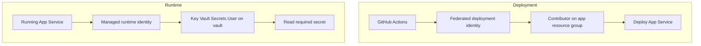

## Table of Contents

1. [Why Do Workloads Need Their Own Identities?](#why-do-workloads-need-their-own-identities)
2. [How Do App Registrations and Service Principals Represent Workloads?](#how-do-app-registrations-and-service-principals-represent-workloads)
3. [How Do Managed Identities Work?](#how-do-managed-identities-work)
4. [How Does Application Code Obtain and Use a Token?](#how-does-application-code-obtain-and-use-a-token)
5. [Why Does a Managed Identity Still Need Permission?](#why-does-a-managed-identity-still-need-permission)
6. [How Does Workload Identity Federation Replace Shared Secrets?](#how-does-workload-identity-federation-replace-shared-secrets)
7. [Why Must Runtime and Pipeline Identities Stay Separate?](#why-must-runtime-and-pipeline-identities-stay-separate)
8. [How Do You Debug the Full Identity Chain?](#how-do-you-debug-the-full-identity-chain)
9. [Check Your Answers](#check-your-answers)
10. [References](#references)

A web application asks Storage to read `customer.json`. Storage cannot accept the application's claim that it should be trusted without evidence. It needs to establish which software is calling and whether that caller may read the file.

Using a developer's account can hide that problem during local testing. The application works while the developer is signed in, then fails after deployment because production uses a different identity—or has no suitable identity configured. Workload identity makes the software's caller explicit so its access can be managed separately from the person who wrote it.

These questions follow that identity from its directory record to the token and permission check used by the destination:

1. **Why Do Workloads Need Their Own Identities?**
2. **How Do App Registrations and Service Principals Represent Workloads?**
3. **How Do Managed Identities Work?**
4. **How Does Application Code Obtain and Use a Token?**
5. **Why Does a Managed Identity Still Need Permission?**
6. **How Does Workload Identity Federation Replace Shared Secrets?**
7. **Why Must Runtime and Pipeline Identities Stay Separate?**
8. **How Do You Debug the Full Identity Chain?**

## Why Do Workloads Need Their Own Identities?
<!-- section-summary: Software needs a caller identity independent of its developers; identity, credential, and permission answer three separate questions. -->

A **workload identity** represents software rather than a person. Microsoft Entra includes applications, service principals, and managed identities within this area. [The workload identity overview](https://learn.microsoft.com/en-us/entra/workload-id/workload-identities-overview) describes the category.

The security flow resembles a human sign-in in its broad structure. Alice proves her identity through a password, passkey, or MFA, obtains a token through Entra, and presents suitable evidence to Storage. Storage then evaluates the relevant access rules. Software uses a machine authentication mechanism instead of an interactive human method, but the destination still needs both authentication and authorization.

Three separate concepts explain the relationship:

| Concept | Question answered | Example |
|---|---|---|
| Identity | Which caller is this? | Application X |
| Credential | How does the caller prove control of that identity? | A secret, certificate-based proof, federated assertion, or Azure-managed mechanism |
| Permission | What may the established identity do? | Application X may read blobs in Storage account Y |

Identity, credential, and permission must remain distinct. Creating an identity does not automatically establish a credential on every computer, and proving an identity does not automatically grant a resource action. The three pieces cooperate rather than substituting for one another.

### Why a personal account is the wrong lifecycle for software

Consider application code that downloads a file:

```python
storage.download_blob("orders.json")
```

This line illustrates the requested operation; the surrounding client setup determines which identity the request uses. If it runs as Alice, the application depends on Alice's account lifecycle and permissions. What happens when she leaves? What if her access is much broader than the application's needs? What happens when MFA is required, or when the job runs unattended at 03:00?

A dedicated identity for OrderProcessor avoids expressing those software requirements through a person's account. Alice has a human user identity, while OrderProcessor has a workload identity. Calling it a user account for software can be a useful starting analogy, provided we remember that its implementation and authentication methods differ from those of a human account.

The separation also makes permissions easier to review. The team can ask what OrderProcessor needs rather than infer the answer from everything Alice is authorized to do. The same code may use different credential providers locally and in Azure, so its permissions need to be checked under the identity used in each environment.

Before choosing how software authenticates, Azure needs a directory representation of the application. That introduces application objects and service principals.

## How Do App Registrations and Service Principals Represent Workloads?
<!-- section-summary: An application object defines software, a service principal represents it in a tenant, and credentials prove control of that identity rather than defining its permissions. -->

An **app registration** creates the application's identity configuration in Entra. Its **application object** describes the application, while a **service principal** represents the application's security identity inside a particular tenant. The blueprint-and-instance analogy captures the difference: one describes the application definition, and the other is the tenant-local principal that can receive permission.

For Contoso CRM, the registration can describe the application name, client ID, redirect URIs, supported account types, requested API permissions, certificates, and federated credentials. These settings define how the application participates in identity flows. The service principal is the concrete identity referred to when a permission system says to give Contoso CRM Reader access.

[Microsoft's application-object documentation](https://learn.microsoft.com/en-us/entra/identity-platform/app-objects-and-service-principals) explains the template and local-representation relationship. Keeping both objects visible is useful because different administrative operations target different layers.

### A definition can have several tenant-local instances

Suppose MyInvoiceApp is registered in tenant A with client ID `abc123`. Its service principal in that tenant has object ID `sp-789`. The application object answers which application is defined; the service principal answers which local directory security identity represents it.

Creating an app registration normally also creates the corresponding service principal in its home tenant. A multitenant application makes the distinction even clearer: one vendor application definition can have a service principal in tenant A and a different service principal in tenant B. Each tenant manages its local identity and access relationship.

This is why the phrase “instance of an application in a tenant” is useful. The definition can remain shared while the authorizable directory objects remain tenant-specific. A local permission assignment needs to identify the appropriate principal, not merely a familiar application display name.

### Client ID and object ID identify different things

The **application/client ID** identifies the application or workload in token-request configuration. The **service principal object ID**, also called its principal ID in relevant Azure interfaces, identifies the specific directory security principal commonly used when granting permissions.

If one interface shows client ID `a1b2c3...` and another shows object ID `x7y8z9...`, those values are not interchangeable. They answer “which application?” and “which actual directory object?” respectively. Different APIs expose both because their operations refer to different objects in the model.

Knowing a client ID is also not authentication proof. An arbitrary computer cannot claim to be OrderProcessor merely because it knows the application's identifier. Some mechanism must establish that the caller controls the identity being requested.

### Secrets and certificates supply authentication evidence

A traditional application can authenticate using a client ID plus a client secret, or a client ID plus a certificate/private-key arrangement. The client ID selects the application; the credential supplies proof of control. A client secret is conceptually similar to a machine password, though the protocol is not literally a human username/password login.

A configuration might contain these placeholders:

```text
TENANT_ID=...
CLIENT_ID=...
CLIENT_SECRET=...
```

The workload presents the required evidence to Entra. If authentication succeeds, Entra issues an access token for the target resource. The target receives that token rather than simply trusting the application's configured name.

The secret still needs storage. Source code is an inappropriate place for it; possible management locations include an environment variable, GitHub secret, Kubernetes Secret, Key Vault, or pipeline variable. Even with suitable storage, somebody must create, store, protect, rotate, replace, and monitor the credential's expiration.

Certificates improve some properties of authentication but still require credential lifecycle management, especially protection of private-key material. Managed identity and federation address this operational burden by changing how the workload obtains trusted authentication evidence.

### Unpack overloaded requests into separate operations

“Create a service principal for Terraform” often compresses four tasks: register an application, create or locate its service principal, configure an authentication method, and grant authorization. Completing one of those tasks does not imply the others are complete.

Similarly, saying that a managed identity has Contributor is shorthand for a role assignment associated with its backing principal ID. Portals and command-line tools can hide some of the object-model details, but understanding them makes it easier to locate a failed step instead of repeatedly recreating identities or adding roles.

## How Do Managed Identities Work?
<!-- section-summary: A managed identity is a special service principal with Azure-managed credentials; choose system or user assignment by lifecycle and shared-permission boundaries. -->

For a supported Azure workload, a **managed identity** lets Azure manage the authentication credential. Enabling it on an Azure Function creates an identity represented in Entra by a special service principal. The developer does not receive an identity password, store a client secret for it, or rotate that underlying credential.

[The managed identity overview](https://learn.microsoft.com/en-us/entra/identity/managed-identities-azure-resources/overview) describes credentials that Azure manages without exposing them to developers. This changes authentication management, not the target resource's authorization model.

A managed identity is therefore a special service-principal type. Every managed identity has a backing service principal, but an ordinary service principal need not be a managed identity. Unlike ordinary application registrations, managed identities do not have a corresponding application object in the directory. That exception matters when searching for them in application-oriented administrative views.

### System-assigned identity follows the resource

Enable system-assigned managed identity on `payments-vm`, and Azure creates an identity tied to that VM. Its lifecycle follows the resource: enabling the identity establishes it, and deleting the VM removes it.

This model fits an identity whose meaning is “this specific Azure resource.” For an InvoiceProcessor Function or InvoiceFunction, the identity can logically belong to that Function alone. If the resource is deleted and the workload no longer needs that identity, the coupled lifecycle expresses that relationship directly. [The managed identity glossary](https://learn.microsoft.com/en-us/entra/identity/managed-identities-azure-resources/managed-identities-glossary) defines the system-assigned model.

### User-assigned identity exists independently

A **user-assigned managed identity** is its own Azure resource. An identity called `payments-reader` can be attached to Function A and Function B. Deleting Function A leaves `payments-reader` in existence because the identity does not belong exclusively to that Function's lifecycle.

This is useful when one logical identity should survive resource recreation or when several resources intentionally require the same security identity. A blue deployment and green deployment can both use ProductionAppIdentity while the deployment resources change. [Managed identity best practices](https://learn.microsoft.com/en-us/azure/active-directory/managed-identities-azure-resources/managed-identity-best-practice-recommendations) discuss the independent and reusable model.

Choose according to lifecycle and security boundaries. One resource, one identity, and one lifetime often support system assignment. A persistent identity across recreation or deliberate reuse supports user assignment. The names of the two options do not themselves describe which boundary the workload should use.

### Sharing identity also shares permission

If VM A, VM B, and VM C can all act as SharedIdentity, and that identity has Storage Contributor, each participating resource can potentially use that permission. Compromising any resource able to use the shared identity may therefore expose the permissions of the shared principal.

Reuse reduces some lifecycle complexity while increasing the number of workloads connected to the same authorization boundary. **Blast radius** describes the extent of possible impact from a compromise or mistake. Identity reuse must be reviewed in those terms, rather than treating fewer identity resources as automatically preferable.

[Microsoft's identity recommendations](https://learn.microsoft.com/en-us/entra/identity/managed-identities-azure-resources/managed-identity-best-practice-recommendations) emphasize least privilege. The decision should establish both which resources use an identity and what that identity can access. Managing credentials for those resources does not make their shared access harmless.

With an identity available, application code still has to request and send a token. Managed identity does not cause the source and destination services to skip the usual request-and-authorization flow.

## How Does Application Code Obtain and Use a Token?
<!-- section-summary: Application code asks a credential provider for a token and sends it to the destination; the actual selected identity may differ between local and Azure environments. -->

An Azure Function needing a blob should not have to embed its identity's client secret in source code. With a supported identity arrangement, the application can ask the environment's credential mechanism for a token.

An Azure SDK pattern can look conceptually like this:

```python
credential = DefaultAzureCredential()

client = BlobServiceClient(
    account_url=...,
    credential=credential
)
```

This fragment illustrates credential wiring rather than a complete runnable application. The account URL and surrounding SDK setup still need to be supplied. The architectural point is that the client receives a credential provider instead of a hardcoded client secret.

The provider obtains an access token using an available authentication mechanism. The application then sends the token with the request to Storage, commonly as `Authorization: Bearer <token>`. The token placeholder is sensitive runtime evidence, not a string to hardcode or print indiscriminately.

### The target evaluates the token and its own permissions

The broad flow remains authentication followed by a resource request. The application authenticates through Azure/Entra, obtains an access token, then presents that token to Storage. Managed identity simplifies how the application authenticates; it does not merge all participating services into one implicit trust relationship.

A simplified token identifies an issuer such as Microsoft Entra ID, a subject/principal such as OrderProcessor, an audience of Azure Storage, the Contoso tenant, and an expiration. Storage examines whether the token is valid, whether it is intended for Storage, which principal it represents, and whether that principal may perform the requested operation.

The **audience** identifies the intended resource. A token for another API does not become suitable merely because it came from the same identity provider. The **principal** identifies who received the token, which must match the identity whose permissions the operator expects the resource to use.

These details are useful when mentally expanding an application-to-database arrow. The application obtains a token as some identity, receives it, sends it, and the database or service authorizes that identity. The important diagnostic question is which identity the application actually uses now, rather than which identity the deployment designer intended it to use.

### Local success can exercise a different identity

`DefaultAzureCredential` illustrates this difference. On a developer's laptop, the available credential can come from a developer login and represent Alice. Deployed in Azure, the same application can use managed identity and represent InvoiceFunctionIdentity.

If Alice has broad access in the local environment while the managed identity has no suitable role in production, the same source code can work locally and fail after deployment. Local and production runtime identities are different, so the authorization evidence from one environment does not prove the other is configured correctly.

The example is not a reason to abandon SDK credential abstractions. It is a reason to identify the credential provider and resulting principal when testing them. A successful client call demonstrates that the identity actually selected for that call had access under those conditions; it does not establish that every possible identity selected by the same code will have access.

### Select among available identities deliberately

An App Service can have a system-assigned principal S and a user-assigned principal U. If U has Key Vault Secrets User but the SDK authenticates as S, authentication can succeed while vault authorization fails.

Recording the non-secret client ID, principal/object ID, and tenant ID helps compare the caller that obtained the token with the principal that received permission. Those identifiers help locate a mismatch without exposing the token or secret itself. The next section explains the permission half of that comparison.

## Why Does a Managed Identity Still Need Permission?
<!-- section-summary: Enabling identity supplies a caller, not access; authorization must match the actual principal, operation, target scope, and destination's permission model. -->

Turning Managed Identity on establishes a workload identity. It does not automatically grant access to Azure resources. A token proving that the caller is InvoiceFunction still leaves Storage with a separate question: may InvoiceFunction read this blob?

Azure RBAC commonly expresses the answer as a **principal**, a **role**, and a **scope**. The principal is who receives access, the role lists allowed actions, and the scope is where those actions apply. For InvoiceFunction, Storage Blob Data Reader at the intended invoices storage scope can supply the required read access.

The conceptual combination is who, can do what, and where. A shorthand path such as `/subscriptions/.../storageAccounts/invoices` expresses the intended target in a diagram, while a real assignment needs the actual applicable Azure resource scope. The target boundary must be verified rather than inferred from a friendly name.

### Identity and authorization can change independently

App A can use Identity A while App B uses Identity B, with neither identity initially having permissions. Grant Identity A Blob Data Reader on Storage, and A can now read while B remains unauthorized. Both identities existed before the role assignment; the assignment changed authorization, not their existence.

The reverse separation matters too. Creating an RBAC assignment for a principal does not provide a workload with credentials to authenticate as it. The workload needs both a working authentication mechanism and permission for the operation it intends to perform.

This explains two very different failure modes: the application may fail to acquire an appropriate token, or it may acquire one successfully and then be denied by the destination. Treating both as “managed identity is broken” obscures the distinction that determines the next check.

### Scope and operation must match the destination

Azure RBAC's management hierarchy runs from management group to subscription to resource group to resource. A permission reaches the applicable descendants of its assignment scope. Blob Data Reader on StorageAccount1 does not establish blob read access on StorageAccount2.

Do not ask only whether an identity has a familiar role somewhere. Ask whether that principal has the required role at a scope covering this exact target. The role's name and its assignment location work together to define the access.

Also distinguish **control-plane** operations from **data-plane** operations. Creating or configuring a storage account is management work. Reading, writing, or deleting blobs is work on the service's data. A resource-management role such as Storage Account Contributor should not be treated as automatic proof of the blob data permission the application needs.

Storage Blob Data Reader is an example of a role aimed at reading blob data. The correct question is which exact operation is being attempted and which authorization system controls that operation. The distinction is especially important when a deployment identity can configure a resource but the running application cannot read its contents.

### Some APIs use different permission systems

Workload identities can call more than Azure Resource Manager and Azure services using Azure RBAC. Other targets may evaluate OAuth scopes, application permissions, app roles, database permissions, ACLs, or custom authorization. An ACL is an access-control list expressing allowed access to its protected object.

Microsoft Graph, for example, has its own application and delegated permission model. It would be inaccurate to say that every workload identity receives all permissions through Azure RBAC. Entra supplies identity evidence; the target API determines what that identity may do using its own model.

That rule holds regardless of how the workload authenticated. For software running outside Azure, federation offers another authentication mechanism while leaving the target's authorization responsibility intact.

## How Does Workload Identity Federation Replace Shared Secrets?
<!-- section-summary: Federation exchanges a trusted external workload assertion for an Entra token, validating issuer, subject, audience, and signature instead of depending on a stored Azure client secret. -->

A GitHub Actions runner needs to deploy to Azure but is not itself an Azure resource with ordinary managed identity naturally available. A traditional setup creates an Azure service principal, issues a client secret, and stores it in GitHub as something like `AZURE_CLIENT_SECRET`.

That allows authentication, but it also creates a long-lived credential to store and maintain. Whoever obtains the secret may be able to impersonate the identity while the credential remains usable. Improving secret storage helps, yet the system still depends on protecting possession of that secret.

**Workload identity federation** uses an external identity provider's signed assertion instead. GitHub authenticates the workload and issues a token describing its repository, workflow, or environment context. Entra is configured to trust only the intended issuer and matching claims for an application registration or user-assigned managed identity. [Microsoft's federation overview](https://learn.microsoft.com/en-us/entra/workload-id/workload-identity-federation) explains this secretless trust relationship.

### Define the trust narrowly

For a production GitHub environment, the relationship can be configured as follows:

```text
Issuer: https://token.actions.githubusercontent.com
Subject: repo:contoso/orders:environment:production
Audience: api://AzureADTokenExchange
```

The **issuer** identifies the token-producing authority. The **subject** identifies the particular workload context the trust accepts. The **audience** identifies the token exchange for which the assertion is intended. Matching these values limits which external assertions Entra should accept for the configured identity.

The workflow presents its GitHub OIDC token. OIDC is the identity protocol through which the provider issues this evidence. Entra verifies the signature, issuer, audience, and subject, then issues an Azure access token when the configured trust requirements are satisfied.


The trust is now “GitHub attests that this is the expected workload, and Entra accepts that assertion under this configuration.” GitHub does not need to store an Azure client password for that relationship.

### Understand what changed and what did not

Secret-based authentication depends primarily on who possesses the Azure client secret. Federated authentication depends on a trusted issuer, expected subject, expected audience, signature verification, and a short-lived assertion. This removes the stored Azure secret from the pipeline's credential inventory.

The external trust configuration still matters. A mismatched subject or issuer can prevent authentication, while an overly broad trust would accept a broader set of workloads than intended. Federation changes the proof of identity; it does not eliminate the need to define exactly which identity a workload may assume.

Nor does federation grant permission by itself. The resulting principal still needs the appropriate Azure or API authorization for the requested action. This keeps federation within the same identity–credential–permission model as managed identity and certificate-based authentication.

A simplified selection process is to use managed identity for a suitable supported Azure runtime, and otherwise use an application/service-principal arrangement with federation where an external provider can supply the required trusted assertion. Secrets or certificates remain possible authentication methods where that arrangement is necessary, with their credential lifecycle work made explicit.

## Why Must Runtime and Pipeline Identities Stay Separate?
<!-- section-summary: Deployment automation and running application code are different actors with different management and data permissions, so separate identities limit privilege sharing. -->

Consider GitHub Actions deploying an Azure Function that later reads secrets from Key Vault. The pipeline and Function are separate actors. One changes Azure resources; the other runs application code and accesses its dependencies.

The pipeline may need Contributor or other deployment permissions on an application resource group. The Function may need only Key Vault Secrets User on a vault. Those roles correspond to different jobs and should generally be assigned to different identities.

### Shared identity transfers deployment privileges to runtime

Suppose one identity serves both the pipeline and the application. The pipeline requires broad enough permissions to deploy infrastructure, while the runtime may only need Storage Blob Data Reader. If the application is compromised, the attacker may be able to use the shared identity's deployment privileges to modify infrastructure.

A separate DeploymentIdentity with Contributor on the app resource group and RuntimeIdentity with blob-read access on Storage prevents that automatic sharing of authorization. The runtime's identity remains limited to the data access its work requires, rather than inheriting the permission necessary to deploy its own environment.

This is the same principle used for independent workloads: each security boundary receives its own identity and the minimum required access. The distinction should be visible even if the same team owns both the pipeline and the application.

### Follow two trust chains in one deployment

An API deployment can use GitHub OIDC with a federated credential on a deployment service principal. Entra exchanges the expected GitHub assertion for an Azure token, and the deployment principal uses Contributor on the App Resource Group to deploy App Service.

At runtime, App Service uses a managed identity represented by its own service principal. It obtains a token intended for Key Vault and receives only the appropriate Key Vault Secrets User access. The runtime does not reuse the GitHub deployment credential or service principal to fetch the application's secret.



There are two trust chains because there are two callers. The deployment chain starts with the external workflow's assertion. The runtime chain starts with Azure's managed identity mechanism. Both reach Entra-issued tokens and target authorization, but their principal IDs, required audiences, and permissions differ.

### Management work and data work reinforce the separation

Creating App Service, updating a Function, deploying ARM/Bicep, and setting configuration are generally management-plane tasks. A pipeline identity commonly acts against Azure Resource Manager for those operations.

The runtime instead reads or writes data through Storage, SQL, or Key Vault. Its authorization may use data roles or the target's own permission model. Separating identities lets access reviews follow those responsibilities without having to explain why application code carries infrastructure-deployment authority.

The distinction also clarifies testing. A successful deployment proves that the deployment caller could perform deployment operations. It does not prove that the running app's separate identity can read a blob or a secret. Runtime verification must exercise the runtime identity itself.

## How Do You Debug the Full Identity Chain?
<!-- section-summary: Work forward from code and credential selection to token audience, actual principal, operation, authorization model, role, and scope before changing access. -->

When an application reports access denied, reconstruct the request before changing IAM settings. **IAM** refers broadly to identity and access management. Randomly adding roles can hide the original mismatch while granting more access than the application requires.

For an InvoiceFunction-to-Storage call, identify the software, its intended InvoiceFunctionManagedIdentity, the Azure-managed authentication mechanism, Entra as token issuer, Storage as intended audience, the principal Storage actually sees, Storage Blob Data Reader as the required permission, and the storage-account or container scope where it applies.

These are eight separate observations in one chain. A failure can occur before token acquisition, during token validation, or while evaluating the action at its scope. Knowing the last successful stage narrows the next investigation.

### Distinguish authentication from authorization failures

An **authentication failure** prevents the application from obtaining or using valid identity evidence. Possible causes include the wrong client ID, expired secret, invalid certificate, incorrect tenant, federated subject mismatch, wrong issuer, or unavailable managed identity mechanism.

An **authorization failure** occurs when identity evidence succeeds but the destination denies the requested action. Causes include a missing RBAC assignment, wrong role, role at the wrong scope, authenticating as a different resource's identity, wrong API permission, or permission-propagation delay.

The distinction prevents an unproductive response such as adding a role when the client cannot obtain a token, or replacing credentials when the token is valid but the principal lacks access. The remedy must address the failed stage.

### Treat HTTP status as a lead, not absolute proof

`401 Unauthorized` often points to a missing, invalid, or expired token, or a token with an incorrect audience. `403 Forbidden` often indicates that the caller is known but lacks permission for the operation.

Those are useful first diagnostic directions, not universal guarantees for every API. For a 403, begin by checking principal, role, scope, and operation. For a 401, investigate token presence and validity along with the resource for which it was issued. Then use the destination's actual error evidence to confirm the interpretation.

### Compare expected and observed identities

The system-assigned S versus user-assigned U example is a common pattern: U received Key Vault Secrets User, but the SDK selected S. Both are valid identities, so authentication can work while the required role applies to the wrong principal.

Likewise, `DefaultAzureCredential` can select Alice's developer login locally and InvoiceFunctionIdentity in production. Local access may succeed because Alice has broader permissions, while production has no applicable runtime assignment. Compare actual client, principal, and tenant IDs instead of assuming the environment selected the intended caller.

Next compare the assignment target. The correct principal and role on StorageAccount1 do not authorize the same action on StorageAccount2. Finally compare operation types: permission to manage a storage-account resource is not equivalent to permission to read its blobs. These checks explain many failures without widening access.

### Use a repeatable investigation sequence

1. Identify the code that made the failing request.
2. Identify the credential provider it actually used.
3. Confirm the tenant against which it authenticated.
4. Record the non-secret client and principal identifiers that obtained the token.
5. Determine whether token acquisition succeeded.
6. Confirm the audience or resource for which the token was issued.
7. Identify the exact operation attempted at the destination.
8. Determine which authorization mechanism controls that operation.
9. Inspect the role or permission held by the actual principal.
10. Verify the scope to which that permission applies.

The sequence moves from executing software to identity evidence to permission. It avoids treating “the app has an identity” or “the identity has a role” as a complete explanation. Each statement needs the actual environment, target, and operation to establish whether it is relevant to the failed request.

### Keep the relationships together

Ordinary workload identity commonly begins with an app registration and application object, then a tenant-local service principal using a secret, certificate, or federated assertion. A supported Azure workload can instead use a managed identity represented directly by a special service principal with Azure-managed credentials.

External assertions can come from GitHub, Kubernetes, or another supported identity-provider arrangement. The shared outcome is authentication through Entra, an access token for a target, and authorization by that target's RBAC or permission system. The target then allows or denies the request.

| Term | Relationship to remember |
|---|---|
| Workload identity | Identity belonging to software |
| App registration/application object | Definition of the application's identity configuration |
| Service principal | Tenant-local security principal |
| Credential | Proof used to authenticate as that identity |
| Managed identity | Special service principal whose credentials Azure manages |
| System-assigned identity | Lifecycle tied to one Azure resource |
| User-assigned identity | Independent reusable identity resource |
| Federation | Trust in another provider's short-lived assertion |
| Authorization | The target's permission decision for the established principal |
| Pipeline/runtime identities | Separate callers serving deployment and application work |

The final check is always the same: can this workload authenticate as the principal it intends to use, and is that principal authorized for this particular operation here? Keeping those questions separate makes the directory terminology and the failure evidence much easier to interpret.

## Check Your Answers

:::expand[Why Do Workloads Need Their Own Identities?]{kind="recap"}
Software must run independently of a developer's account, permissions, and interactive sign-in. Identity names the caller, a credential proves control of that identity, and permission defines what the established caller may do.
:::

:::expand[How Do App Registrations and Service Principals Represent Workloads?]{kind="recap"}
The application object defines the application; its service principal is a tenant-local authorizable identity. Client IDs and object/principal IDs identify different layers. Secrets, certificates, and federated assertions are authentication mechanisms, separate from role assignments.
:::

:::expand[How Do Managed Identities Work?]{kind="recap"}
Azure manages credentials for a special service principal without a corresponding ordinary application object. System assignment follows one resource's lifecycle; user assignment is independent and reusable. Shared identity also shares permissions and the associated blast radius.
:::

:::expand[How Does Application Code Obtain and Use a Token?]{kind="recap"}
A credential provider obtains a target-specific token, and application code sends it to the resource for validation and authorization. The selected identity may differ between a developer login and managed identity, or between multiple identities attached to one runtime.
:::

:::expand[Why Does a Managed Identity Still Need Permission?]{kind="recap"}
Identity establishment grants no resource access by itself. Permission must match the actual principal, operation, and scope. Data and management roles differ, and some APIs use scopes, app roles, database permissions, or other models instead of Azure RBAC.
:::

:::expand[How Does Workload Identity Federation Replace Shared Secrets?]{kind="recap"}
An external provider issues a signed workload assertion. Entra checks the configured issuer, subject, audience, and signature before issuing an Azure token. This removes the stored Azure client secret while retaining explicit trust configuration and target authorization.
:::

:::expand[Why Must Runtime and Pipeline Identities Stay Separate?]{kind="recap"}
Deployment automation commonly needs management permissions while runtime code needs narrower data access. Separate identities prevent application compromise from automatically exposing deployment privileges and ensure runtime tests exercise the runtime caller.
:::

:::expand[How Do You Debug the Full Identity Chain?]{kind="recap"}
Identify code, credential provider, tenant, actual principal, token acquisition, audience, operation, permission model, role, and scope. Use 401/403 as diagnostic leads, then confirm the failed stage through evidence rather than adding broad access.
:::

## References

- [Workload identities overview](https://learn.microsoft.com/en-us/entra/workload-id/workload-identities-overview)
- [Application objects and service principals](https://learn.microsoft.com/en-us/entra/identity-platform/app-objects-and-service-principals)
- [Managed identities overview](https://learn.microsoft.com/en-us/entra/identity/managed-identities-azure-resources/overview)
- [Managed identities glossary](https://learn.microsoft.com/en-us/entra/identity/managed-identities-azure-resources/managed-identities-glossary)
- [Managed identity recommendations](https://learn.microsoft.com/en-us/azure/active-directory/managed-identities-azure-resources/managed-identity-best-practice-recommendations)
- [Managed identity security and lifecycle practices](https://learn.microsoft.com/en-us/entra/identity/managed-identities-azure-resources/managed-identity-best-practice-recommendations)
- [Workload identity federation](https://learn.microsoft.com/en-us/entra/workload-id/workload-identity-federation)
