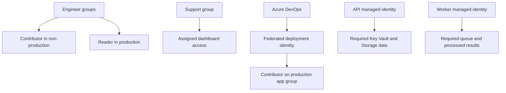

## Table of Contents

1. [What Identity Architecture Is the Startup Building?](#what-identity-architecture-is-the-startup-building)
2. [Why Should You Write an Access Workbook First?](#why-should-you-write-an-access-workbook-first)
3. [How Do Groups and Azure Boundaries Limit Human Access?](#how-do-groups-and-azure-boundaries-limit-human-access)
4. [How Should You Protect Human Sign-In?](#how-should-you-protect-human-sign-in)
5. [How Does the Support Dashboard Use Entra ID?](#how-does-the-support-dashboard-use-entra-id)
6. [How Do Runtime Applications Receive Production Access?](#how-do-runtime-applications-receive-production-access)
7. [How Should Azure DevOps Deploy Without a Stored Secret?](#how-should-azure-devops-deploy-without-a-stored-secret)
8. [How Do You Rehearse and Verify the Identity Design?](#how-do-you-rehearse-and-verify-the-identity-design)
9. [Check Your Answers](#check-your-answers)
10. [References](#references)

For a small startup, giving everyone Owner can seem like the fastest way to get work done. It also means that one compromised engineer account may expose production infrastructure, data, secrets, permissions, and deployment control at once.

A useful first setup needs only a few deliberate boundaries. Engineers need room to experiment, support needs its dashboard, runtime applications need their data, and the deployment pipeline needs to update the application. Those are different jobs, so they should not all inherit the same access.

We will first identify the actors and required actions, then connect them to authentication and permissions and test that the boundaries hold:

1. **What Identity Architecture Is the Startup Building?**
2. **Why Should You Write an Access Workbook First?**
3. **How Do Groups and Azure Boundaries Limit Human Access?**
4. **How Should You Protect Human Sign-In?**
5. **How Does the Support Dashboard Use Entra ID?**
6. **How Do Runtime Applications Receive Production Access?**
7. **How Should Azure DevOps Deploy Without a Stored Secret?**
8. **How Do You Rehearse and Verify the Identity Design?**

## What Identity Architecture Is the Startup Building?
<!-- section-summary: Separate human, runtime, and deployment actors, and distinguish directory administration, Azure management, data access, and application access before assigning roles. -->

The startup has two founders, four engineers, and two support employees. Its Azure environment includes Production and Non-production subscriptions, a Support Dashboard, a Public API, a Background Worker, Azure SQL or Storage, and Key Vault. Azure DevOps Pipelines deploys the software.

The goal is a small access system that limits the impact of a compromised developer account, application, or pipeline. **Blast radius** is the set of resources and operations potentially exposed by that compromise. Limiting it requires understanding which actors genuinely need which capabilities.

Begin with four questions for every relationship: who is acting, what they are trying to do, where they may do it, and how they prove their identity. The final question concerns authentication; the action and target questions concern authorization. Keeping both visible prevents a successful login or an enabled managed identity from being mistaken for a complete access design.

### Distinguish four access planes

An **access plane** here means a category of protected operations. It is a way to separate decisions that otherwise all appear under the broad heading of IAM, or identity and access management.

| Plane | Example work | Relevant authorization |
|---|---|---|
| Entra administration | Create users and applications, change Conditional Access, reset authentication methods, assign directory roles | Entra roles such as Global Administrator, Application Administrator, and Conditional Access Administrator |
| Azure resource management | Create App Service, restart a Function, delete a VM, configure Storage, deploy infrastructure | Azure RBAC roles such as Reader, Contributor, and Owner |
| Service data access | Read blobs, retrieve vault secrets, receive messages, query a database | Data roles, SQL permissions, and other service-specific rules |
| Application access | Use the support dashboard and its features | Entra authentication plus appropriate application assignment and app roles |

For data work, examples include Storage Blob Data Reader, Key Vault Secrets User, Service Bus Data Receiver, and SQL permissions. These describe using a service's contents rather than creating or configuring the Azure resource itself.

If Sarah visits `https://support.example.com`, the question of whether she may use the dashboard is an application authorization question. Giving her Azure Reader or Contributor is not normally the appropriate way to answer it. Conversely, a dashboard administrator does not automatically need to administer the App Service resource.

### Keep three groups of actors separate

Human identities receive the Azure and application access appropriate to their work. Runtime identities receive the data and service access required by the running application. The deployment identity receives permission to change the infrastructure it deploys.

This division prevents a convenient but dangerous “everyone is Owner everywhere” arrangement. It also gives the startup a clear way to discuss additions. If a new worker needs another queue, the change belongs to that worker's runtime permission set; it does not require widening every engineer's or pipeline's access.

Before implementing those relationships, write them down. An access workbook makes the intended boundary concrete enough to review and later compare with reality.

## Why Should You Write an Access Workbook First?
<!-- section-summary: Record actor, identity, required action, target, and permission before implementation so each assignment has a specific reason and can later be verified. -->

An **access workbook** is a simple matrix of actors and the permissions their jobs require. It does not need to introduce a large governance process. Its value is making assumptions visible before a portal role assignment turns them into production access.

| Actor | Identity | Required task | Target | Intended permission |
|---|---|---|---|---|
| Engineers | Entra group | Build and test infrastructure | Non-production subscription | Contributor |
| Engineers | Entra group | Inspect production | Production subscription | Reader |
| Founders/platform administrators | Entra group | Emergency production administration | Required production scope | Limited privileged/JIT access |
| Support | Entra group | Use the support dashboard | Support application | Support application role |
| API | Managed identity | Read required secrets | Production Key Vault | Key Vault Secrets User |
| Worker | Managed identity | Receive queue work | Service Bus | Data Receiver permission |
| Pipeline | Federated workload identity | Deploy App Service | Production app resource group | Contributor |

**Just-in-time**, or JIT, access means making privileged access available when needed rather than leaving it continuously active, where that capability is available in the chosen setup. The workbook records the requirement without confusing it with ordinary day-to-day access.

The rows force useful questions. Does support need Azure portal access, or just the dashboard? Does the API need Contributor, or only a secret-read permission? Does the pipeline need Owner, or only application deployment authority? Do engineers require production writes by default?

Often the narrower answer is sufficient. The point is to decide based on the task rather than grant a broad role and hope to reduce it later. [Microsoft's RBAC best practices](https://learn.microsoft.com/en-us/azure/role-based-access-control/best-practices) recommend required-only access, group-based human assignments, narrow privileged scope, and limited subscription Owners.

### Describe the reason, not only the role name

“API has Key Vault Secrets User” is incomplete without identifying the vault and the reason for the access. “The production API retrieves its required secrets from the production vault” explains the relationship and makes a different or broader assignment easier to spot.

The workbook should therefore preserve actor, task, target, and permission together. A role that was reasonable for one target may be excessive at subscription scope. Likewise, an identity suitable for a deployment task may be inappropriate for runtime access even when both belong to the same application team.

This task-based view supports later verification. Each row can become a test of a required successful operation, and the boundaries between rows can become tests of denied operations. The workbook is both the design's starting point and the comparison target after implementation.

## How Do Groups and Azure Boundaries Limit Human Access?
<!-- section-summary: Separate non-production and production subscriptions, assign human roles through meaningful groups, and reserve broad access-administration powers for a small privileged set. -->

One Entra tenant can support separate Non-production and Production subscriptions. The tenant supplies the common identity context; the subscriptions supply distinct administrative and governance boundaries.

Once practical, use a division such as `sub-startup-nonprod` and `sub-startup-prod` rather than relying only on `rg-dev` and `rg-prod` inside one undifferentiated startup subscription. [Azure landing-zone principles](https://learn.microsoft.com/en-us/azure/cloud-adoption-framework/ready/landing-zone/design-principles) describe separating lifecycle environments to improve governance and reduce risk.

This lets engineers have Contributor in Non-production and Reader in Production without requiring a long list of remembered exceptions. Subscription boundaries make the environment difference explicit before individual resource permissions are considered.

### Create groups that represent real jobs

The four engineers are Alice, Ben, Carlos, and Deepa. Instead of four repeated Contributor assignments, put the relevant people in a non-production engineering group and assign the group. Onboarding adds the person to the appropriate group; offboarding removes the relevant membership rather than searching for scattered direct assignments.

A small group structure can include:

- `grp-azure-nonprod-contributors`
- `grp-azure-prod-readers`
- `grp-azure-prod-operators`
- `grp-support-dashboard-users`
- `grp-support-dashboard-admins`
- `grp-identity-admins`

An equivalent non-production engineering group might be named `grp-azure-nonprod-engineers`; the meaningful distinction is the security job it represents, not a mandatory spelling. Avoid creating 150 groups for an eight-person company. Create a group where it corresponds to a real population with a distinct access requirement.

Azure RBAC supports users, groups, service principals, and managed identities. [Role-assignment guidance](https://learn.microsoft.com/en-us/azure/role-based-access-control/role-assignments-steps) recommends group-based assignment for manageable human access. The startup can use that pattern without turning a small team into an elaborate hierarchy.

### Give experimentation a different boundary from production change

Non-production Contributor access lets engineers create resources, deploy, restart services, modify configuration, and remove non-production resources. Production Reader supplies the relevant resource visibility for inspection of health, configuration, metrics, and deployments without routine production modification.

These choices support fast experimentation in the environment intended for it and controlled changes in production. Production operator or administrator access can remain a separate requirement rather than an accidental side effect of engineering membership.

Remember that the applicable permissions still depend on the role definition and target service. Reader is an Azure resource role, not universal permission to read all production data. Keeping application and data planes separate prevents the production-inspection role from being interpreted as broad customer-data access.

### Keep Owner rare and deliberate

Contributor generally permits resource management without general Azure RBAC access administration. Owner combines resource management with permission management. If an attacker obtains Owner, it may be able to change applications, create resources, change access, and grant another identity permission, creating a way to retain access.

The referenced RBAC guidance recommends no more than three subscription Owners and narrow scope for privileged administrator roles. An eight-person company does not need eight subscription Owners simply because everyone knows each other or occasionally works on production.

The small privileged group should have only the roles and scopes its responsibilities require. This limits the effect of a compromised account and makes changes to the permission system easier to distinguish from ordinary engineering work. Those privileged identities also need stronger protection during sign-in.

## How Should You Protect Human Sign-In?
<!-- section-summary: Require MFA, strengthen privileged authentication, and maintain monitored, tested emergency accounts so policy mistakes do not lock out recovery. -->

Careful RBAC assignments do not protect the intended boundary if an attacker can use a stolen password to impersonate the person holding them. Authentication must establish that the caller controls the expected identity, while authorization limits what that identity may do afterward.

Require MFA as a baseline. For small tenants without more advanced Conditional Access licensing, **Security Defaults** provides baseline identity protection, including MFA registration and protection for privileged activities while blocking several weaker authentication paths. [The Security Defaults documentation](https://learn.microsoft.com/en-us/entra/fundamentals/security-defaults) describes that baseline.

Where Conditional Access is used, express requirements in terms of caller, context, and resource: for example, Azure administration requires strong MFA. The policy defines the authentication condition rather than granting an Azure management role. [Microsoft's MFA guidance](https://learn.microsoft.com/en-us/entra/identity/conditional-access/policy-all-users-mfa-strength) recommends broad MFA protection.

### Give privileged accounts stronger authentication

An ordinary account may use email, Slack or Teams, and support tools. A highly privileged identity can potentially alter the cloud environment and its access rules. The authentication protection should reflect that difference in impact.

For privileged administrators, prefer phishing-resistant approaches such as FIDO2/passkeys, security keys, Windows Hello for Business, or certificate-based authentication where possible. The objective is to avoid relying entirely on passwords plus second factors that are easily phished. [The administrator MFA guidance](https://learn.microsoft.com/en-us/entra/identity/conditional-access/policy-admin-phish-resistant-mfa) explains this recommendation.

The access workbook and authentication design should agree. If an account can change directory policy or production permissions, treat it as privileged even if the same person also performs ordinary engineering work. The person's job title alone does not describe the account's power.

### Preserve an emergency recovery path

A policy mistake can block the very administrators who would fix it. For example, a Conditional Access configuration that blocks everyone can create a tenant lockout. A recovery design needs an authorized path that does not depend on the same failed normal sign-in arrangement.

Maintain at least two **emergency access**, or break-glass, accounts. The referenced guidance recommends cloud-only accounts that do not depend on external federation, monitoring their use, testing them regularly, and excluding them from Conditional Access policies that could prevent emergency sign-in. [Microsoft's emergency-access guidance](https://learn.microsoft.com/en-us/entra/identity/role-based-access-control/security-emergency-access) describes the model.

These accounts are for recovery rather than everyday administration. Their existence creates a responsibility to control who can use them, know how authentication works, and investigate their use. An untested account whose credentials nobody can locate is not an effective recovery path.

The normal and emergency paths should therefore be separately understood. Normal administration follows the normal administrator identities and policies. Emergency use follows a controlled procedure for restoring access when the normal path is unavailable. Later launch tests must verify this operational distinction, not just confirm that two accounts appear in the directory.

## How Does the Support Dashboard Use Entra ID?
<!-- section-summary: Centralize support authentication through Entra, restrict application assignment, and enforce support roles separately from Azure resource-administration permissions. -->

Suppose the dashboard at `support.example.com` currently maintains local passwords. Every support employee then has an Entra account and a separate dashboard credential. Offboarding requires disabling Entra and remembering the dashboard and every other separately managed application.

Using Entra as the dashboard's identity provider connects the application to the central identity lifecycle. Support staff authenticate through Entra and present the resulting identity information to the dashboard. The application no longer needs a separate employee password system for that relationship.

### Restrict application access after authentication

The tenant contains more than support: developers, founders, finance, and contractors may also have accounts. Successful Entra authentication establishes who Sarah is; it does not prove she belongs to the support population permitted to use the dashboard.

Assign the appropriate support group to the application. For a compatible Entra enterprise application, **Assignment required** can restrict access to assigned users and groups. [Enterprise application properties](https://learn.microsoft.com/en-us/entra/identity/enterprise-apps/application-properties) document this setting.

The distinction should be visible in testing. A finance employee may authenticate successfully because Entra knows the account, then be denied dashboard access because the application assignment is absent. That is the expected separation of authentication and authorization, not a sign-in failure.

### Use App Service authentication where it fits

If the dashboard runs on App Service, its built-in authentication and authorization features—often called **Easy Auth**—can handle much of the sign-in plumbing. A browser requests `GET /tickets`; App Service detects that it lacks the required sign-in, directs the browser to Entra, and receives the successful authentication result before supplying identity information and claims to the application.

This can reduce OAuth integration work for a small application. [The App Service authentication overview](https://learn.microsoft.com/en-gb/azure/app-service/overview-authentication-authorization) describes built-in support for App Service and Functions, including Entra as an identity provider.

The application still needs to interpret its access requirements. A platform's help with authentication does not decide which customer cases a support user may modify or whether exporting data is permitted.

### Model support capabilities with application roles

The dashboard can distinguish Support Reader, Support Agent, and Support Admin. Reader views customer cases, Agent modifies them, and Admin can export data or change settings. Application roles such as `Support.Reader`, `Support.Agent`, and `Support.Admin` express those differences.

Assign people or groups to the appropriate app roles and enforce the corresponding operations. This is more precise than letting every authenticated user perform every action. A role name should describe a real capability distinction inside the dashboard.

Azure RBAC remains separate. Azure Reader does not automatically make someone a dashboard user, and Support.Admin does not imply permission to administer the App Service resource. The dashboard has two relevant identities to consider: the human using its interface and the runtime software accessing its backend resources. The next section addresses the latter.

## How Do Runtime Applications Receive Production Access?
<!-- section-summary: Give API, worker, and dashboard separate managed identities and narrow data permissions, selecting identity lifecycle to match the supported runtime arrangement. -->

The Public API calls Key Vault and Storage. The Worker calls Service Bus and Storage. The dashboard backend may need database or application-specific read access. These runtime calls should use explicit application identities rather than credentials copied from a developer or a broad shared deployment identity.

A configuration containing `AZURE_CLIENT_ID` and `AZURE_CLIENT_SECRET` introduces a secret that must be generated, stored, protected, rotated, and monitored. For a supported Azure runtime, managed identity removes the application team's need to handle that identity's underlying credential.

Azure still needs authorization assignments for the resulting principal. [The managed identity recommendations](https://learn.microsoft.com/en-us/azure/active-directory/managed-identities-azure-resources/managed-identity-best-practice-recommendations) describe credential management and lifecycle choices; enabling identity does not independently grant access to a vault, queue, or storage target.

### Give each application its own permission boundary

Use distinct runtime identities such as `mi-api-prod`, `mi-worker-prod`, and `mi-support-prod`. Their names help describe the actors, while their actual principal IDs establish which directory objects receive access.

If the worker is compromised, its access should be limited to consuming its queue and writing its required results. It should not also receive API-only secrets, dashboard administration, or infrastructure-deployment permissions simply because all components share one application estate.

The identity boundary therefore carries a permission and blast-radius boundary. Sharing one identity among the API, worker, and dashboard would also share its combined permissions, undermining the separation the access workbook intended.

### Choose lifecycle before sharing an identity

A simple `api-prod` resource can use system-assigned managed identity when the identity should follow that resource's lifetime. Deleting the app removes the associated identity. This is a straightforward fit when one resource and one identity should be managed together.

A user-assigned identity exists independently and can be attached to blue and green API deployments. That can fit a logical production identity that must survive application recreation or be intentionally used by more than one deployment resource.

The early-stage decision can stay simple: use the resource-coupled model for a straightforward one-resource lifetime; consider the independent model when recreation or deliberate reuse requires it. Reuse should be an explicit requirement, because resources sharing the identity also share the principal's permissions.

### Grant data access rather than general production administration

If the API retrieves secrets, assign its managed identity Key Vault Secrets User at the required production vault. That expresses the intended job. Owner at the Production subscription would instead give the application broad production-administration power.

Similarly, reading blobs requires a data-access role such as Storage Blob Data Reader, not merely a management role named Storage Account Contributor. Ask whether the workload needs to manage the resource or use its data. Runtime work usually needs the latter, while creating and configuring resources belongs to deployment or administration.

| Runtime principal | Permission | Intended target |
|---|---|---|
| `mi-api-prod` | Key Vault Secrets User | `kv-prod` |
| `mi-api-prod` | Storage Blob Data Reader | `customer-data` |
| `mi-worker-prod` | Service Bus Data Receiver | Orders queue |
| `mi-worker-prod` | Storage Blob Data Contributor | `processed-orders` |
| `mi-support-prod` | Database/application-specific read access | Required dashboard backend |

These runtime identities do not need Owner, broad Contributor, or User Access Administrator for the stated jobs. The deployment identity has a different responsibility and should be designed separately rather than adding its permissions to this table.

## How Should Azure DevOps Deploy Without a Stored Secret?
<!-- section-summary: Use federated Azure DevOps service-connection authentication with a separate deployment identity, narrow deployment scope, and controlled handling of privileged IAM changes. -->

The pipeline is another workload. It should authenticate as its own deployment identity rather than as Alice performing a deployment. The authentication question is how Azure DevOps proves that it is the expected caller for that identity.

Historically, a service principal and client secret supplied that proof, with the Azure secret stored inside Azure DevOps. **Workload identity federation** replaces the stored Azure password with a short-lived signed assertion and an explicit trust relationship. [Microsoft's service-connection guidance](https://learn.microsoft.com/en-us/azure/devops/pipelines/library/connect-to-azure?view=azure-devops) recommends federation for new Azure Resource Manager service connections and describes support through an app registration or managed identity.

### Follow the federation exchange

Azure DevOps supplies an assertion about the pipeline or service-connection identity. Entra validates it against the configured trust and issues an Azure access token. The pipeline then presents that token for its deployment operations.

The assertion is evidence issued for the external workload, rather than an Azure client secret stored indefinitely in the pipeline system. The trust configuration identifies which asserted workload Entra accepts. The resulting token still represents a principal whose Azure permissions must be assigned deliberately.

Federation therefore changes authentication while preserving the authorization questions from the workbook. Successful token exchange does not decide whether the pipeline should change one App Service, an entire resource group, or the subscription's access rules.

### Separate deployment and runtime identities

Use a deployment identity such as `sp-prod-deployment` and a different runtime identity such as `mi-api-prod`. The first changes application infrastructure; the second reads the API's required data or secrets after deployment.

If the production deployment modifies only `rg-prod-app`, Contributor on that group is a narrower fit than Owner across the subscription. A compromised pipeline can still affect the application resources within its authorized scope, but it should not automatically gain every resource, every permission, or every subscription.

This is least privilege for automation. The relevant boundary is the job, not the fact that pipeline and API belong to the same application. Using one identity for convenience would merge their permissions and let runtime compromise expose deployment authority.

### Keep privileged IAM changes outside ordinary releases

A deployment identity with Contributor plus the ability to create arbitrary role assignments can potentially grant an attacker powerful access. The ability to grant permission deserves a different level of control from ordinary application deployment.

A small startup can separate a normal pipeline with Contributor on the application resource group from a rare, controlled bootstrap/IAM process that manages role assignments. **Bootstrap** here means the initial or privileged setup needed to establish identities and access, rather than routine application delivery.

That split lets normal releases deploy code and resource configuration without controlling who can access Production. If an infrastructure change also requires a new permission relationship, handle that relationship through the designated privileged process instead of silently expanding the ordinary pipeline.

The final arrangement has separate human, deployment, and runtime paths. Limited administrators use strong authentication and JIT where available; engineers use the non-production and production groups; support uses application assignment; the pipeline uses federation; and each runtime receives its own data permissions. The next task is proving that the actual configuration matches those boundaries.

## How Do You Rehearse and Verify the Identity Design?
<!-- section-summary: Test allowed and denied operations for every actor, verify offboarding and emergency recovery, and reconcile observed principal/role/scope evidence with the access workbook. -->

A launch rehearsal should ask more than whether IAM settings were created. It should demonstrate that required actions succeed and that operations outside each actor's job are denied. That second half is how the startup verifies isolation rather than merely showing that broad access can make the application run.

Use controlled rehearsal targets and a safe test environment for destructive-denial cases. A permission mistake could cause a supposedly forbidden delete to succeed, so valuable production data should not be used as the test fixture. This keeps the rehearsal focused on proving the boundary without creating an avoidable outage.

### Rehearse ordinary human access

Sign in as an ordinary engineer, not an administrator standing in for one. The engineer should create and deploy resources in Non-production and inspect Production. Production modification and Production RBAC changes should fail under the intended baseline access.

Sign in as a support employee. The employee should reach the dashboard and permitted customer information, but should not change the API through the Azure portal or read Key Vault directly. This demonstrates that application access and cloud administration remain separate.

Finally, use an ordinary employee outside support, such as someone in finance. Entra authentication may succeed, but `support.example.com` should deny application access if that employee is not assigned. That verifies that recognizing a company account does not automatically grant dashboard use.

| Caller | Expected success | Expected denial |
|---|---|---|
| Ordinary engineer | Create/deploy in non-production; inspect production | Modify production; change production RBAC |
| Support employee | Use dashboard; view permitted data | Modify API infrastructure; directly read Key Vault |
| Unassigned finance employee | Authenticate through Entra | Use support dashboard |

If an engineer unexpectedly modifies Production, investigate the applicable direct, group, and inherited assignments. The test result is evidence that the effective access differs from the workbook, even if the intended Reader assignment itself exists.

### Test runtime identities separately

Run the API using its actual production-style runtime identity. It should read required Key Vault secrets and required storage data. It should be denied deletion of Key Vault, VM creation, reading an unrelated storage account, and changing Azure RBAC.

Run the worker under its own identity. It should consume the orders queue and write processed results. It should not read API-only secrets, manage App Service, or access the support database. The test should answer what a caller holding the worker identity could do, rather than assuming the identity is isolated because it has a different name.

These checks distinguish the runtime principals from the deployment identity and from a developer login. Testing through an administrator's credentials could make every required call succeed while proving nothing about the application's configured permissions.

### Test pipeline reach as well as deployment success

The Azure DevOps pipeline should build, deploy, and update the application. It should not modify an unrelated production resource group or grant itself Owner. Direct customer-database access should ideally remain outside its deployment job as well.

A successful release shows that the deployment path works. The denied operations show that its power stops at the intended boundary. Both are needed to establish that the service connection is useful without being universal Production access.

If an access-changing operation is required for controlled bootstrap, rehearse it as that separate privileged process. Do not use its success to justify equivalent permission on the normal release identity.

### Rehearse employee departure

Model Alice leaving the company by disabling or removing her Entra identity through the intended offboarding process. Verify the resulting access behavior in Azure, the support dashboard, and Azure DevOps. Check whether any separate shared passwords still provide a path that bypasses the intended identity lifecycle.

The desired result is that a terminated employee no longer has access to those systems. Central identity supplies one lifecycle across participating applications, but the rehearsal should inspect actual behavior rather than assuming every integration reacts exactly as expected without verification.

This test is particularly useful for finding the old local dashboard account or shared credential that survived a migration to Entra sign-in. The workbook's human-access rows should describe all remaining paths that matter, not only the newly configured ones.

### Prove emergency access operationally

Simulate normal administrator sign-in being unavailable and follow the authorized emergency procedure. Someone must know where the credentials are, who can use them, how authentication works, and what to do after entering the tenant.

The referenced emergency-access guidance recommends regular validation, at least every 90 days. A working account plus a practiced procedure is the recovery capability; a document saying that emergency access exists is insufficient by itself.

Monitor emergency-account use so an unexpected sign-in receives attention. Regular testing should remain distinguishable from ordinary daily administration, because these identities are reserved for a failure of the normal access path.

### Diagnose failures without broadening permission blindly

An API-to-Key-Vault 403 suggests authentication may have succeeded while authorization failed. Confirm which managed identity the API actually used, which principal ID received the assignment, which role was assigned, which vault was called, and which scope the assignment covers.

Do not respond by escalating from Contributor to Owner until the call works. That can conceal the missing or mismatched permission while creating a much larger security boundary than the application requires.

Instead, express the missing relationship precisely: `mi-api-prod` needs Key Vault Secrets User at `kv-startup-prod`, if that is the actual required vault. The principal, operation set, and exact target should explain the correction. A valid authentication event and a similarly named role on another principal are not equivalent evidence.

### Reconcile the workbook with the deployed configuration

After setup and rehearsal, update the initial matrix to show the principals and scopes that actually exist:

| Principal | Type | Role/access | Scope |
|---|---|---|---|
| `grp-nonprod-engineers` | Human group | Contributor | Non-production subscription |
| `grp-prod-readers` | Human group | Reader | Production subscription |
| `grp-support-users` | Human group | Support application access | Support dashboard |
| `mi-api-prod` | Managed identity | Key Vault Secrets User | Production Key Vault |
| `mi-api-prod` | Managed identity | Storage Blob Data Reader | Customer storage |
| `mi-worker-prod` | Managed identity | Service Bus Data Receiver | Orders queue |
| `sp-prod-deployment` | Workload identity | Contributor | Production app resource group |

The short names in this final example serve the same security jobs as the longer group names introduced earlier. In a real workbook, choose the actual created names and IDs rather than keeping both as competing inventories. The required evidence is the deployed principal and assignment, not conformity to one illustrative naming style.

When someone later asks why a role exists, the task and target should provide the answer. “It was already there” leaves an unexplained permission in the security boundary. Keeping the workbook current prevents the initial clear design from disappearing into accumulated exceptions.

### Keep the first iteration small

The complete initial setup remains modest: one Entra tenant, MFA for everyone, stronger phishing-resistant administrator authentication where possible, two emergency accounts, and separate non-production and production subscriptions.

Engineers receive non-production Contributor and production Reader. Support receives dashboard access without Azure administration by default. A small privileged group receives only required administration. The dashboard uses Entra authentication, required assignment, and appropriate support roles.

The API, worker, and dashboard backend use their own managed identities with required data permissions. Azure DevOps uses federation with a separate deployment identity scoped to its deployment job. Avoid runtime Azure client secrets where managed identity works and avoid an Azure DevOps service-principal secret where federation works.

Each change of trust boundary deserves an explicit identity decision: developer, support employee, privileged administrator, pipeline, production API, and background worker are different actors. Security comes from matching those actors to appropriate authentication and narrowly scoped permission, then proving the resulting behavior—not from enabling the largest possible set of IAM features.

## Check Your Answers

:::expand[What Identity Architecture Is the Startup Building?]{kind="recap"}
Separate human, deployment, and runtime actors. Distinguish Entra administration, Azure resource management, service data, and application access. Every relationship should explain who acts, what it does, where it acts, and how identity is proved.
:::

:::expand[Why Should You Write an Access Workbook First?]{kind="recap"}
The workbook connects each actor to a required action, target, identity, and permission before roles are created. It exposes unnecessary portal, Contributor, Owner, or production-write assumptions and later provides the expected results for verification.
:::

:::expand[How Do Groups and Azure Boundaries Limit Human Access?]{kind="recap"}
Separate production from non-production and assign human access through groups representing real jobs. Engineers can experiment in non-production while inspecting production. Keep Owner and other access-administration powers narrow and limited to a small privileged set.
:::

:::expand[How Should You Protect Human Sign-In?]{kind="recap"}
Require MFA, use appropriate Security Defaults or Conditional Access, and strengthen privileged authentication. Maintain at least two cloud-only emergency accounts with controlled access, monitoring, suitable policy exclusions, and regular recovery tests.
:::

:::expand[How Does the Support Dashboard Use Entra ID?]{kind="recap"}
Use Entra as identity provider, require application assignment where supported, and enforce Support.Reader, Support.Agent, or Support.Admin capabilities. App Service authentication can handle sign-in plumbing, but dashboard permission remains distinct from Azure resource roles.
:::

:::expand[How Do Runtime Applications Receive Production Access?]{kind="recap"}
Use separate managed identities for API, worker, and dashboard. Select lifecycle by resource coupling or intentional reuse, then grant only required vault, storage, messaging, or database access. Runtime data access should not imply broad infrastructure administration.
:::

:::expand[How Should Azure DevOps Deploy Without a Stored Secret?]{kind="recap"}
Use a federated ARM service connection with explicit trust and a separate deployment identity. Scope deployment permission to the required application resources, and keep privileged bootstrap/IAM changes outside ordinary releases when those powers are unnecessary.
:::

:::expand[How Do You Rehearse and Verify the Identity Design?]{kind="recap"}
Test both successful and denied actions under every actual caller, including engineers, support, unassigned employees, API, worker, and pipeline. Rehearse offboarding and emergency recovery, diagnose exact principal/role/scope failures, and reconcile the workbook with observed configuration.
:::

## References

- [Azure RBAC best practices](https://learn.microsoft.com/en-us/azure/role-based-access-control/best-practices)
- [Azure landing-zone design principles](https://learn.microsoft.com/en-us/azure/cloud-adoption-framework/ready/landing-zone/design-principles)
- [Steps to assign an Azure role](https://learn.microsoft.com/en-us/azure/role-based-access-control/role-assignments-steps)
- [Security Defaults](https://learn.microsoft.com/en-us/entra/fundamentals/security-defaults)
- [Require MFA for all users](https://learn.microsoft.com/en-us/entra/identity/conditional-access/policy-all-users-mfa-strength)
- [Phishing-resistant MFA for administrators](https://learn.microsoft.com/en-us/entra/identity/conditional-access/policy-admin-phish-resistant-mfa)
- [Emergency access accounts](https://learn.microsoft.com/en-us/entra/identity/role-based-access-control/security-emergency-access)
- [Enterprise application properties](https://learn.microsoft.com/en-us/entra/identity/enterprise-apps/application-properties)
- [App Service authentication and authorization](https://learn.microsoft.com/en-gb/azure/app-service/overview-authentication-authorization)
- [Managed identity recommendations](https://learn.microsoft.com/en-us/azure/active-directory/managed-identities-azure-resources/managed-identity-best-practice-recommendations)
- [Azure DevOps ARM service connections](https://learn.microsoft.com/en-us/azure/devops/pipelines/library/connect-to-azure?view=azure-devops)
