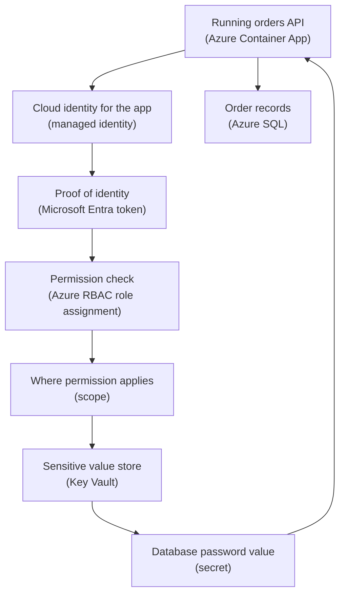

## Table of Contents

1. [The Permission Questions Before Production](#the-permission-questions-before-production)
2. [If You Know AWS IAM](#if-you-know-aws-iam)
3. [One Request Has Several Checks](#one-request-has-several-checks)
4. [Identity Answers Who Or What](#identity-answers-who-or-what)
5. [Azure RBAC Answers What Action And Where](#azure-rbac-answers-what-action-and-where)
6. [Scope Is The Size Of The Permission](#scope-is-the-size-of-the-permission)
7. [Managed Identity Removes Stored App Passwords](#managed-identity-removes-stored-app-passwords)
8. [Key Vault Protects Sensitive Values](#key-vault-protects-sensitive-values)
9. [Evidence You Can Inspect](#evidence-you-can-inspect)
10. [Failure Modes And Fix Directions](#failure-modes-and-fix-directions)
11. [The Operating Checklist](#the-operating-checklist)

## The Permission Questions Before Production

Before a backend service can touch production data, Azure asks a small set of permission questions.
The questions are not only for humans.
They are also for pipelines, scripts, virtual machines, container apps, and any other workload that tries to read, write, deploy, or delete something.

The useful mental model is simple:
identity answers who or what is acting.
Azure RBAC answers what action that identity can perform and where it can perform it.
Scope answers where a permission applies.
Managed identity gives an Azure-hosted app its own cloud identity without storing a password in code or settings.
Key Vault protects sensitive values such as secrets, keys, and certificates.

Those pieces exist because cloud systems are shared.
One subscription may hold many teams.
One resource group may hold a production app, a database, a secret store, and logs.
One engineer may need read access everywhere but write access only in staging.
One app may need to read a database password from a vault, but it should not be able to delete the vault.

Azure identity and security fit into the larger Azure map you learned in foundations.
A tenant is the identity home.
A subscription is the operating boundary for resources and billing.
A resource group collects related resources.
Inside those boxes, Azure needs a way to decide whether a person, group, app, or managed identity can perform a specific operation.

This article follows `devpolaris-orders-api`.
It is a Node backend for checkout traffic.
The production version runs in Azure Container Apps, stores order records in Azure SQL, writes receipts to Blob Storage, sends logs to Azure Monitor, and reads sensitive settings from Key Vault.

The running problem is practical:
the app needs enough access to run, developers need enough access to debug, and nobody should receive broad production power by accident.

Keep this short sentence near you:

> Identity says who or what. RBAC says what action and where. Scope says how far the permission reaches.

## If You Know AWS IAM

If you have learned AWS before, the closest bridge is AWS IAM.
That bridge helps, but it is not a one-to-one translation.
AWS IAM often feels like the place where identity, roles, policies, and permissions live together.
Azure splits the story more visibly.

Microsoft Entra ID is the identity system.
It knows users, groups, app registrations, service principals, and managed identities.
Azure RBAC is the authorization system for Azure resources.
It decides what an identity can do at a scope such as a subscription, resource group, or resource.

Here is the careful translation:

| AWS idea you may know | Azure idea to learn | Careful difference |
|-----------------------|---------------------|--------------------|
| IAM user or group | Microsoft Entra user or group | Entra ID is the identity home, not the resource container |
| IAM role assumed by a workload | Managed identity or service principal | Managed identity is created and managed by Azure for supported Azure resources |
| IAM policy permissions | Azure role definition | Azure roles describe allowed actions, but assignment happens at an Azure scope |
| Attaching a role to an EC2 instance, ECS task, or Lambda | Assigning a managed identity to an Azure compute resource | Similar job, different mechanics and lifecycle |
| AWS account boundary | Azure subscription plus tenant context | Azure separates identity home from resource boundary |
| Secrets Manager or Parameter Store | Key Vault | Similar secret-storage job, but Key Vault also handles keys and certificates |

The important difference is this:
Azure does not ask only "what IAM policy is attached?"
Azure asks "which identity is this, which Azure role is assigned, and at what scope?"

That means you should avoid fake translations like "Microsoft Entra ID equals IAM."
Entra ID handles identity.
Azure RBAC handles authorization to Azure resources.
Managed identities are workload identities.
Key Vault is a protected place for sensitive values.
Those pieces cooperate, but they are not the same object.

For `devpolaris-orders-api`, the AWS-style question might be:
"Which role does the app use when it reads secrets?"

The Azure version is more exact:
"Which managed identity is assigned to the Container App, which role does that identity have, and is the role scoped to the Key Vault or wider?"

That extra precision helps once you get used to it.
It helps you grant access narrowly and debug failures calmly.

## One Request Has Several Checks

Let us follow one simple production path.
`devpolaris-orders-api` starts a new container revision.
During startup, it reads `DATABASE_PASSWORD` from Key Vault.
Then it connects to Azure SQL and starts answering requests.

That sounds like one app action, but Azure sees several questions:

1. What is the app's identity?
2. Is that identity allowed to read this Key Vault secret?
3. Is the request aimed at the correct vault?
4. Is the secret enabled and current?
5. Is the app using the value safely after it receives it?

Read the diagram from top to bottom.
Plain-English labels come first.
Azure terms follow in parentheses.



Notice what is not in the diagram:
there is no password stored in the app container image.
There is no developer's personal Azure login inside the app.
There is no broad "production admin" identity just because the app needs one secret.

The app receives a cloud identity from Azure.
The app asks Microsoft Entra ID for a token.
Azure checks whether that identity has a suitable role assignment at a scope that includes the Key Vault.
If the check passes, the app can read the secret value it needs.

This is the core security rhythm you will see again and again:
authenticate first, authorize second, then access the resource.
Authentication means proving who or what you are.
Authorization means deciding what that proven identity can do.

## Identity Answers Who Or What

Identity is the answer to "who or what is making this request?"
For a human, that might be `maya@devpolaris.example`.
For a team, it might be a Microsoft Entra group named `orders-api-deployers`.
For a pipeline, it might be a service principal or workload identity.
For an Azure-hosted app, it is often a managed identity.

Microsoft Entra ID is the Azure identity home.
It is the directory that stores and verifies these identities.
The old name Azure Active Directory still appears in older posts, tickets, and screenshots, but the current product name is Microsoft Entra ID.

For a beginner, separate these identity types:

| Identity Type | Plain Meaning | Example In The Orders API |
|---------------|---------------|----------------------------|
| User | One person who signs in | `maya@devpolaris.example` |
| Group | A set of users managed together | `orders-api-readers` |
| Service principal | Software identity used by an app or automation | `sp-devpolaris-orders-ci` |
| Managed identity | Azure-managed workload identity for an Azure resource | `mi-devpolaris-orders-api-prod` |

The identity only proves who or what is asking.
It does not automatically grant access to every resource.
That is a common beginner trap.

Maya can sign in successfully and still fail to restart the production Container App.
The CI pipeline can authenticate successfully and still fail to assign roles.
The managed identity can get a token successfully and still receive `403 Forbidden` from Key Vault.

Those failures feel annoying, but they are good signs.
They mean Azure can tell the difference between "this identity is real" and "this identity may do this action here."

Here is a realistic identity snapshot for the app.
This is the kind of inventory a platform team might include in a deployment record:

```text
Workload: devpolaris-orders-api
Environment: production

Human deploy group:
  orders-api-deployers

Read-only support group:
  orders-api-readers

Pipeline identity:
  sp-devpolaris-orders-ci

Runtime identity:
  mi-devpolaris-orders-api-prod

Secret store:
  kv-devpolaris-orders-prod
```

The important habit is naming the runtime identity separately from the human and pipeline identities.
The app is not Maya.
The app is not the CI pipeline.
The app is its own actor with its own permissions.

That separation gives you cleaner incident evidence.
If a secret was read at 10:14, you want to know whether the reader was the app, a developer, or a pipeline.

## Azure RBAC Answers What Action And Where

Azure RBAC means Azure role-based access control.
It is the authorization system built on Azure Resource Manager for managing access to Azure resources.
In plain English, Azure RBAC decides what an identity can do and where it can do it.

A role assignment has three beginner parts:
the principal, the role, and the scope.
The principal is the identity receiving permission.
The role is the set of allowed actions.
The scope is the place where those allowed actions apply.

You can read it like a sentence:

```text
Principal: mi-devpolaris-orders-api-prod
Role:      Key Vault Secrets User
Scope:     /subscriptions/.../resourceGroups/rg-devpolaris-orders-prod/providers/Microsoft.KeyVault/vaults/kv-devpolaris-orders-prod

Meaning:
The orders API managed identity can read secret values from this one production vault.
```

That sentence is much safer than:

```text
The app has Contributor in production.
```

`Contributor` is a broad role for managing many resource types.
It is useful for humans or automation in some controlled cases, but it is far too broad for an app that only needs to read a secret.
The app should receive the narrow role that matches its job.

Here is a small RBAC plan for `devpolaris-orders-api`:

| Identity | Role | Scope | Why |
|----------|------|-------|-----|
| `orders-api-readers` | Reader | Production resource group | Let support inspect resources without changing them |
| `orders-api-deployers` | Contributor | Production resource group | Let maintainers deploy app changes |
| `sp-devpolaris-orders-ci` | AcrPush | Container registry | Let CI push the image |
| `mi-devpolaris-orders-api-prod` | Key Vault Secrets User | Production Key Vault | Let the app read secret values |
| `mi-devpolaris-orders-api-prod` | Storage Blob Data Contributor | Receipts container or storage account | Let the app write receipt files |

The exact role names can change by service and by your team standards.
The pattern should not change.
Match the identity to the job.
Match the role to the action.
Match the scope to the smallest useful place.

This is where Azure differs from a simple app permission table.
The app may need one role on Key Vault, another role on Storage, and no role at all on the subscription.
Each assignment should have a reason a reviewer can understand.

If you cannot explain why a role exists in one sentence, slow down before you grant it.
Many production security problems start as "temporary" broad access that nobody removes.

## Scope Is The Size Of The Permission

Scope answers "where does this permission apply?"
It is one of the most important Azure security words because the same role can be safe or risky depending on scope.

Azure RBAC scopes form a parent-child hierarchy.
The common levels are management group, subscription, resource group, and resource.
A role assigned higher up can apply to everything below it.
A role assigned lower down is more specific.

For a beginner, think about the size of the permission:

| Scope Level | Size | Beginner Risk |
|-------------|------|---------------|
| Management group | Many subscriptions | A mistake can affect many environments |
| Subscription | One Azure operating boundary | A mistake can affect many resource groups |
| Resource group | One workload or environment grouping | A mistake can affect related resources |
| Resource | One specific Azure resource | Narrowest common scope |

For `devpolaris-orders-api`, the managed identity should not receive Key Vault secret access at subscription scope.
That would let the app read secrets from other vaults in the same subscription if the role and vault settings allow it.
The app only needs the production orders vault.

The safer role assignment reads like this:

```text
Identity:
  mi-devpolaris-orders-api-prod

Role:
  Key Vault Secrets User

Scope:
  /subscriptions/11111111-2222-3333-4444-555555555555/resourceGroups/rg-devpolaris-orders-prod/providers/Microsoft.KeyVault/vaults/kv-devpolaris-orders-prod
```

The risky version reads like this:

```text
Identity:
  mi-devpolaris-orders-api-prod

Role:
  Key Vault Secrets User

Scope:
  /subscriptions/11111111-2222-3333-4444-555555555555
```

Both examples use the same identity and role.
Only the scope changes.
That one change decides whether the app can read one vault or many vaults.

This is why "least privilege" is not only about role names.
It is also about scope.
A narrow role at a broad scope can still be too much.
A broad role at a narrow scope may be acceptable for a deploy group, but not for runtime code.

Use this practical rule:
grant at the resource when one resource is enough.
Grant at the resource group when the identity truly needs the related set.
Grant at the subscription only when the job is subscription-wide and reviewed.

## Managed Identity Removes Stored App Passwords

The most common secret problem is not that developers are careless.
It is that applications need to talk to other systems, and teams need some way to prove the app is allowed.
Without a better model, people put passwords, API keys, or client secrets into `.env` files, CI variables, app settings, or config maps.

Those values spread.
They get copied into tickets.
They land in old logs.
They sit in backups.
They survive after the developer who created them leaves the team.

Managed identity exists to remove that stored-password pattern for Azure-hosted workloads.
A managed identity is a Microsoft Entra workload identity that Azure creates and manages for an Azure resource.
Your app uses the identity to request tokens.
Your code does not need to store a password for that identity.

There are two common types:

| Type | Lifecycle | Good Fit |
|------|-----------|----------|
| System-assigned managed identity | Tied to one Azure resource | One app resource needs its own identity |
| User-assigned managed identity | Separate Azure resource that can be attached to one or more resources | Several app instances need the same identity or permissions should survive app replacement |

For `devpolaris-orders-api`, a user-assigned managed identity is a clean starting point:

```text
Managed identity:
  mi-devpolaris-orders-api-prod

Assigned to:
  ca-devpolaris-orders-api-prod

Allowed to read:
  secrets in kv-devpolaris-orders-prod

Not allowed to:
  delete the vault
  assign roles
  manage the subscription
```

The app configuration then points to the vault, not to the secret value itself:

```text
KEY_VAULT_URI=https://kv-devpolaris-orders-prod.vault.azure.net/
DATABASE_PASSWORD_SECRET_NAME=orders-db-password
```

That is the big shift.
The app can know where to ask.
It should not carry the password around before it needs it.

In Node, the code often uses the Azure Identity library and a Key Vault client.
The exact package details belong in a service-specific article, but the shape looks like this:

```javascript
import { DefaultAzureCredential } from "@azure/identity";
import { SecretClient } from "@azure/keyvault-secrets";

const credential = new DefaultAzureCredential();
const vaultUri = process.env.KEY_VAULT_URI;
const client = new SecretClient(vaultUri, credential);

const secret = await client.getSecret(process.env.DATABASE_PASSWORD_SECRET_NAME);
const databasePassword = secret.value;
```

The important thing to see is what is missing.
There is no client secret string.
There is no hardcoded password.
The credential object asks the environment for the right identity.
In Azure, that can be the managed identity assigned to the app.

This has a tradeoff.
Managed identity removes stored credentials, but it does not remove authorization work.
You still must assign the identity to the app.
You still must grant it the right role at the right scope.
You still must inspect failures when the token works but authorization does not.

## Key Vault Protects Sensitive Values

Key Vault is the protected Azure service for secrets, keys, and certificates.
A secret is a sensitive value such as a password, API key, or connection string.
A key is cryptographic material used for encryption or signing.
A certificate is a TLS or identity certificate with lifecycle needs such as renewal.

For this first mental model, focus on secrets.
`devpolaris-orders-api` may need a database password during the first version of the system.
Storing that password in Key Vault is safer than storing it in a container image, source code, or a shared document.

Key Vault gives you three useful things:
one place to store sensitive values, access checks before a caller can read them, and logs that show access activity when diagnostics are enabled.

Here is a small secret inventory:

| Secret Name | Used By | Stored In | Expected Reader |
|-------------|---------|-----------|-----------------|
| `orders-db-password` | Orders API database connection | `kv-devpolaris-orders-prod` | `mi-devpolaris-orders-api-prod` |
| `stripe-webhook-secret` | Payment webhook validation | `kv-devpolaris-orders-prod` | `mi-devpolaris-orders-api-prod` |
| `orders-reporting-token` | Finance export job | `kv-devpolaris-orders-prod` | Reporting job identity |

The value should not appear in the inventory.
The inventory names the secret, the vault, and the reader.
That is enough for review without leaking the protected value.

Key Vault also has a management plane and a data plane.
The management plane is about managing the vault resource itself, such as creating the vault or changing configuration.
The data plane is about reading or changing objects inside the vault, such as secrets and keys.

This distinction matters during debugging.
A person may be allowed to view the Key Vault resource in the portal but not allowed to read secret values.
That is normal.
Seeing the vault and reading the secret are different actions.

For the orders API, a healthy access decision might look like this:

```text
Resource visible:
  kv-devpolaris-orders-prod

Secret value readable by app:
  yes, through mi-devpolaris-orders-api-prod

Secret value readable by every developer:
  no

Secret value logged by app:
  no
```

Key Vault does not remove every secret-handling risk.
If you grant broad access, people and apps can still read values they should not read.
If your app prints the secret into logs, Key Vault cannot pull that value back out of the log stream.
The service protects storage and access, but your application still has to handle the value carefully after it receives it.

## Evidence You Can Inspect

Good security work leaves evidence.
When access fails, do not guess.
Inspect the identity, role assignment, scope, and target resource.

A first check is the active Azure context.
This prevents you from debugging the wrong tenant or subscription:

```bash
$ az account show --query "{tenant:tenantId, subscription:name, subscriptionId:id}" --output table
Tenant                                Subscription              SubscriptionId
------------------------------------  ------------------------  ------------------------------------
72f988bf-86f1-41af-91ab-2d7cd011db47  sub-devpolaris-prod       11111111-2222-3333-4444-555555555555
```

The exact IDs here are examples.
The habit is real.
Check the tenant and subscription before you explain an access result.

Next, inspect role assignments for the managed identity at the vault scope:

```bash
$ az role assignment list \
    --assignee 99999999-aaaa-bbbb-cccc-dddddddddddd \
    --scope /subscriptions/11111111-2222-3333-4444-555555555555/resourceGroups/rg-devpolaris-orders-prod/providers/Microsoft.KeyVault/vaults/kv-devpolaris-orders-prod \
    --output table
Principal                             Role                     Scope
------------------------------------  -----------------------  ------------------------------------------------------------
99999999-aaaa-bbbb-cccc-dddddddddddd  Key Vault Secrets User   /subscriptions/.../vaults/kv-devpolaris-orders-prod
```

The principal ID should be the managed identity's object ID.
The role should match the action.
The scope should include the target vault, ideally no wider than needed.

If the app cannot read the secret, the error may look like this:

```text
GET https://kv-devpolaris-orders-prod.vault.azure.net/secrets/orders-db-password
Status: 403 Forbidden
Error: Forbidden
Message: The user, group or application does not have secrets get permission on key vault.
Caller: appid=99999999-aaaa-bbbb-cccc-dddddddddddd
```

The useful line is the caller.
It tells you which identity Azure saw.
If the caller is not the managed identity you expected, fix the app identity assignment or credential selection first.
If the caller is correct, inspect the role assignment and scope.

For management actions, the error may look different:

```text
AuthorizationFailed:
The client 'maya@devpolaris.example' with object id '22222222-3333-4444-5555-666666666666'
does not have authorization to perform action
'Microsoft.App/containerApps/write'
over scope
'/subscriptions/11111111-2222-3333-4444-555555555555/resourceGroups/rg-devpolaris-orders-prod/providers/Microsoft.App/containerApps/ca-devpolaris-orders-api-prod'.
```

Read that message slowly.
It gives you the identity, action, and scope.
That is the whole mental model in error form.

## Failure Modes And Fix Directions

The best way to learn Azure access is to connect each failure to the missing question.
Do not treat every `403` as the same problem.
Ask which part of the model failed.

The first failure is wrong identity.
The app starts, tries to read Key Vault, and the caller in the error is a developer identity or a CI service principal instead of the managed identity.

```text
Symptom:
  Key Vault returns 403.

Evidence:
  Caller: appid=sp-devpolaris-orders-ci

Likely cause:
  The app is not using the managed identity at runtime.

Fix direction:
  Check the Container App identity assignment.
  Check which credential path the app uses in Azure.
  Confirm the caller becomes mi-devpolaris-orders-api-prod.
```

The second failure is missing role assignment.
The caller is correct, but the identity has no data-plane permission to read secrets.

```text
Symptom:
  The app has a valid token but cannot get orders-db-password.

Evidence:
  Caller matches mi-devpolaris-orders-api-prod.
  No Key Vault Secrets User assignment exists at the vault scope.

Fix direction:
  Assign the narrow secret-reading role to the managed identity.
  Scope it to kv-devpolaris-orders-prod unless a wider scope is justified.
```

The third failure is scope too narrow or aimed at the wrong resource.
This happens when the role assignment exists, but it is attached to the staging vault or a different resource group.

```text
Symptom:
  Role assignment exists, but production access still fails.

Evidence:
  Scope points to rg-devpolaris-orders-staging.
  App requests kv-devpolaris-orders-prod.

Fix direction:
  Create the role assignment at the production vault scope.
  Remove stale staging access if the production app does not need it.
```

The fourth failure is scope too broad.
This one may not fail loudly.
The app works, but the access review shows a subscription-scope assignment.

```text
Symptom:
  The app can read its secret, but it may also read other vaults.

Evidence:
  Role: Key Vault Secrets User
  Scope: /subscriptions/11111111-2222-3333-4444-555555555555

Fix direction:
  Replace the subscription-scope assignment with a vault-scope assignment.
  Re-test the app.
  Confirm other vaults are not readable by the app identity.
```

The fifth failure is secret handling after retrieval.
Key Vault protects the stored value, but the app can still leak it after reading it.

```text
Symptom:
  A production log line includes part of a connection string.

Evidence:
  Application Insights shows:
  Database connection failed for Server=tcp:sql-devpolaris-prod;User Id=orders_app;Password=...

Fix direction:
  Redact connection strings and secret values before logging.
  Log secret names and configuration status, not secret values.
  Rotate the exposed secret because logs may already be copied.
```

The sixth failure is confusing management access with secret access.
A developer can open the vault resource but cannot view a secret value.
That may be correct.

```text
Symptom:
  A support engineer can see kv-devpolaris-orders-prod but cannot reveal orders-db-password.

Evidence:
  Reader role exists on the resource group.
  No secret-reading role exists on the vault.

Fix direction:
  Decide whether the person really needs secret value access.
  Prefer giving the app access, not every human.
  For human break-glass access, use a reviewed, time-limited process.
```

Each fix direction starts with evidence.
That is the discipline.
In Azure access work, guessing often creates a second problem while you are trying to fix the first one.

## The Operating Checklist

When you design access for a new Azure workload, write the access story before you click through the portal.
The story does not need to be long.
It needs to answer the right questions.

For `devpolaris-orders-api`, the access story could be:

```text
Runtime identity:
  mi-devpolaris-orders-api-prod

Runtime needs:
  Read selected secrets from kv-devpolaris-orders-prod.
  Write receipt objects to the production storage account.
  Send logs and telemetry through configured Azure services.

Runtime does not need:
  Contributor on the resource group.
  Owner on the subscription.
  Secret access to unrelated vaults.

Human access:
  orders-api-readers can inspect production resources.
  orders-api-deployers can deploy the app through reviewed release flow.
  Secret value access is limited and reviewed.

Pipeline access:
  sp-devpolaris-orders-ci can push images and update the app deployment.
  It does not receive broad subscription ownership.
```

Then turn that story into role assignments:

| Question | Good Beginner Answer |
|----------|----------------------|
| Who or what is acting? | Name the user, group, service principal, or managed identity |
| What action is needed? | Choose the narrow role that matches the job |
| Where should it apply? | Choose the smallest useful scope |
| Does the app need a stored password? | Prefer managed identity where the Azure service supports it |
| Where do sensitive values live? | Store secrets, keys, and certificates in Key Vault |
| What proves it works? | Inspect caller identity, role assignment, scope, and target resource |
| What proves it is not too broad? | Test that unrelated resources are not accessible |

The tradeoff is worth naming.
Narrow access takes more thought at setup time.
Broad access is faster in the moment.
But broad access makes incidents harder to understand, reviews harder to trust, and secret leaks more damaging.

The senior habit is not "lock everything so nobody can work."
The senior habit is "give each actor enough access for its job, then keep evidence that proves the boundary."

For an Azure beginner, that habit is the whole first security model:
identity says who or what.
Azure RBAC says what action and where.
Scope says how far.
Managed identity keeps app credentials out of code and settings.
Key Vault protects sensitive values, while your app still has to handle them carefully after reading.

---

**References**

- [What is Azure role-based access control (Azure RBAC)?](https://learn.microsoft.com/en-us/azure/role-based-access-control/overview) - Defines Azure RBAC as the authorization system for managing who can access Azure resources, what they can do, and what areas they can access.
- [Understand Azure role assignments](https://learn.microsoft.com/en-us/azure/role-based-access-control/role-assignments) - Explains the principal, role, and scope parts of a role assignment.
- [Understand scope for Azure RBAC](https://learn.microsoft.com/en-us/azure/role-based-access-control/scope-overview) - Shows how management group, subscription, resource group, and resource scopes affect where permissions apply.
- [Application and service principal objects in Microsoft Entra ID](https://learn.microsoft.com/en-us/entra/identity-platform/app-objects-and-service-principals) - Explains application objects, service principals, and how managed identities relate to service principals.
- [What is managed identities for Azure resources?](https://learn.microsoft.com/en-us/entra/identity/managed-identities-azure-resources/overview) - Describes managed identities, their lifecycle types, and why they remove stored credentials from supported Azure workloads.
- [About Azure Key Vault](https://learn.microsoft.com/en-us/azure/key-vault/general/overview) - Introduces Key Vault for protecting secrets, keys, and certificates with authentication and authorization checks.
