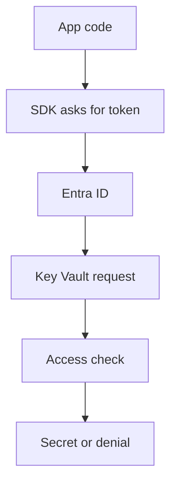

## Table of Contents

1. [The Permission Questions Before Production](#the-permission-questions-before-production)
2. [One Request Has Several Checks](#one-request-has-several-checks)
3. [A Compact AWS Bridge](#a-compact-aws-bridge)
4. [The Identity Check Before Access](#the-identity-check-before-access)
5. [Identity Answers Who Or What](#identity-answers-who-or-what)
6. [App Registrations And Service Principals](#app-registrations-and-service-principals)
7. [Signed In Does Not Mean Allowed](#signed-in-does-not-mean-allowed)
8. [Object IDs Beat Display Names](#object-ids-beat-display-names)
9. [A Review Habit Before Granting Access](#a-review-habit-before-granting-access)
10. [The Three Parts Of Access](#the-three-parts-of-access)
11. [Azure RBAC Answers What Action And Where](#azure-rbac-answers-what-action-and-where)
12. [Scopes Decide How Far Access Travels](#scopes-decide-how-far-access-travels)
13. [Scope Is The Size Of The Permission](#scope-is-the-size-of-the-permission)
14. [Reading Access Evidence](#reading-access-evidence)
15. [Evidence You Can Inspect](#evidence-you-can-inspect)
16. [Least Privilege For The Orders API](#least-privilege-for-the-orders-api)
17. [Managed Identity Removes Stored App Passwords](#managed-identity-removes-stored-app-passwords)
18. [Key Vault Protects Sensitive Values](#key-vault-protects-sensitive-values)
19. [Failure Modes And Fix Directions](#failure-modes-and-fix-directions)
20. [A Review Habit Before You Assign Access](#a-review-habit-before-you-assign-access)
21. [The Operating Checklist](#the-operating-checklist)

## The Permission Questions Before Production

Let's use a smaller model than the usual cloud-security diagram. Every Azure access decision can be read as one sentence:

```text
caller wants to perform action on target at scope, under current sign-in context
```

That sentence is the whole game. The caller might be a human developer, a deployment pipeline, or a running application. The action might be "read a secret", "restart a web app", "create a role assignment", or "upload a blob". The target is the thing being touched. The scope is how wide the permission reaches. The sign-in context matters mostly for people, because a human signing in from a trusted laptop is not the same risk as the same account signing in from an unknown device.

This is clearer than trying to picture Azure through a physical-place analogy. Azure is not checking one global access switch called "production". It is evaluating a request. If we can write the request sentence, we can usually debug the access problem.

Let's make it concrete. Suppose `devpolaris-support-portal` is an internal app used by support agents. The web app reads a database password from Key Vault, writes uploaded attachments into Blob Storage, and sends diagnostic logs to Azure Monitor. Three different targets are involved, so three access decisions happen. The app might be allowed to write blobs but not read secrets. That is not inconsistent. It is exactly what least privilege means.

The same pattern applies to humans. A developer might be allowed to read production logs but not restart the production app. A platform engineer might be allowed to deploy infrastructure in a development subscription but not grant themselves access in production. A CI/CD pipeline might be allowed to update one resource group but not create subscription-wide role assignments.

Notice the shift in thinking. We are no longer asking, "Does this account have Azure access?" That question is too vague. We ask, "Which identity is making which request against which target, and what evidence proves the permission is narrow enough?"

For a review, a useful access note looks like this:

```text
Access question:
  The production support portal needs to read the database password.

Caller:
  mi-devpolaris-support-portal-prod

Action:
  Read secret value

Target:
  kv-devpolaris-support-prod/secrets/support-db-password

Scope:
  Production Key Vault, not the whole subscription

Evidence:
  Key Vault Secrets User assignment for the managed identity
```

That note does not expose a secret. It gives us the exact shape of the permission. If the app fails in production, we already know where to look.

The non-obvious truth is that most Azure access mistakes are not caused by engineers forgetting what a role is called. They are caused by fuzzy boundaries. The caller is not the caller we thought. The role is assigned at a wider scope than anyone meant. The app has a token but the token is for the wrong identity. The permission grants management access but the operation needs data access. Good security work turns those fuzzy statements into inspectable facts.

## One Request Has Several Checks

A real request rarely passes through one gate. When `devpolaris-support-portal` reads `support-db-password`, Azure has to establish the caller, issue a token, check the resource's authorization model, and then evaluate whether the requested action is allowed. If any layer says no, the app sees a failure.

Here is the request as a small flow:



The useful part of this diagram is not the boxes. It is the diagnostic order. If the SDK cannot get a token, we have an identity attachment or credential-selection problem. If the SDK gets a token but Key Vault returns `Forbidden`, identity worked and authorization failed. If Key Vault access works but the app still cannot connect to the database, the secret may be stale, malformed, or pointing to the wrong database.

That order saves time during incidents. Without it, people tend to bounce between random fixes: rotate the secret, add a role, restart the app, change a firewall rule, and hope one of them sticks. A senior review keeps the request sentence intact and checks one layer at a time.

The same request can also involve conditional access for human sign-ins. Conditional Access policies in Microsoft Entra ID evaluate signals such as user, device, location, application, and risk before allowing access, requiring multi-factor authentication, or blocking the sign-in. That affects the human getting into the Azure portal or CLI. It does not replace Azure RBAC on the resource. A developer can pass Conditional Access and still lack permission to change a production resource.

This is where it gets interesting. Azure has several security systems that are all real, but they answer different questions. Microsoft Entra ID proves identity. Conditional Access can put conditions on human sign-ins. Azure RBAC evaluates management-plane actions and many data-plane actions. Some services also have their own access models. Key Vault, for example, can use Azure RBAC or legacy access policies. Storage has management roles and separate blob data roles. The article will keep coming back to the request sentence so these systems do not blur together.

## A Compact AWS Bridge

If you learned AWS first, the safest bridge is conceptual, not word-for-word. AWS Identity and Access Management (IAM) and Azure access control both care about principal, action, resource, and conditions, but the objects are shaped differently.

In AWS, you often attach policies directly to IAM roles, and a workload assumes a role to receive temporary credentials. In Azure, identity is rooted in Microsoft Entra ID, and permissions are commonly expressed as Azure role assignments: a security principal gets a role definition at a scope. A managed identity is Azure's built-in way to give an Azure-hosted workload an identity without storing credentials.

The translation table is useful only after we understand the behavior:

| Access idea | Common AWS shape | Common Azure shape |
|-------------|------------------|--------------------|
| Human identity | IAM Identity Center user or federated identity | Microsoft Entra user |
| Workload identity | IAM role assumed by service or workload | Managed identity or service principal |
| Permission document | IAM policy statement | Azure role definition plus role assignment |
| Resource boundary | ARN and policy resource | Azure scope: resource, resource group, subscription, or management group |
| Extra request conditions | IAM condition keys | Conditions in some Azure role assignments plus sign-in controls such as Conditional Access |

Do not force the mapping too hard. Azure separates the role definition from the assignment. The same role can be assigned to different principals at different scopes. Azure also has a strong distinction between management-plane operations, such as changing a storage account, and data-plane operations, such as reading blobs. AWS has similar ideas, but Azure role names make this split very visible.

The practical habit transfers well: always read the denial message as a request sentence. Who is the principal? What action failed? Which resource rejected it? Which policy or role assignment was expected to allow it?

## The Identity Check Before Access

Before Azure can decide whether a request is allowed, it has to know who or what is asking. Microsoft Entra ID is the identity system behind that answer. It stores users, groups, applications, service principals, and managed identities, and it issues tokens that Azure services can trust.

Let's look at a normal day. Maya signs in to the Azure portal to check why a deployment failed. She is a user in Microsoft Entra ID. The deployment pipeline that actually ran the release is not Maya, and it should not use Maya's password. It has its own non-human identity. The support portal running in production is not the pipeline either. It has a runtime identity attached to the Azure resource that hosts it.

Those distinctions matter because access follows the identity that made the request, not the person who wrote the code. If the pipeline deploys a web app, Azure evaluates the pipeline identity. If the web app later reads a secret, Azure evaluates the app's managed identity. If Maya opens the portal to inspect logs, Azure evaluates Maya's user identity.

A quick identity map might look like this:

```text
Human operator:
  maya@devpolaris.example

Team access group:
  grp-support-portal-operators

Deployment pipeline:
  sp-support-portal-github-actions

Runtime application:
  mi-support-portal-prod

Production resource group:
  rg-support-portal-prod
```

The map is not busywork. It prevents the classic mistake where a developer tests successfully with their own account, then production fails because the running app has a different identity. It also prevents the opposite mistake, where a pipeline gets broad permissions because the team never wrote down the exact deployment identity.

## Identity Answers Who Or What

Every Azure operation has a security principal behind it. A security principal is the directory object Azure can evaluate for access. A user is a security principal for a person. A group is a security principal used to manage many identities together. A service principal is a security principal for an application or automation. A managed identity is a service-principal-shaped identity that Azure creates and rotates credentials for.

The names sound abstract, so let's attach them to behavior. When a support agent opens the internal support portal, that agent signs in as a user. When the platform team grants every support lead read-only access to production logs, they should grant the role to a group, then manage membership in that group. When GitHub Actions deploys infrastructure, it needs an application identity, not a human password. When the running Azure Container App reads a secret at runtime, it should use a managed identity instead of a copied client secret.

Groups are not just a convenience. They preserve intent. If a role assignment says `grp-support-portal-operators` can read logs, we know the permission belongs to an operational role in the organization. If the same role is assigned to twelve individual users, we have to reverse-engineer why each person was added.

Service principals also preserve intent when named well. A display name like `deploy` tells us almost nothing. A display name like `sp-support-portal-prod-deploy` tells us the identity is automation, not a person, and that it probably belongs to a production deployment workflow. We still need the object ID for evidence, but a good name makes review possible.

The tricky part is that display names are not unique. Two groups can have similar names. Apps can be recreated with the same display name but a new object ID. Human-readable names are good for conversation. Object IDs are good for proof.

## App Registrations And Service Principals

When an application needs to sign in to Microsoft Entra ID, Azure uses two related objects: an app registration and a service principal. The app registration is the application definition. The service principal is the instance of that application in a tenant that can actually receive permissions.

For a beginner, the important behavior is simpler than the terminology. If our GitHub Actions workflow deploys `devpolaris-support-portal`, it cannot click the Azure portal and type a password. It needs an application identity that can authenticate non-interactively. That identity appears in the tenant as a service principal, and Azure RBAC role assignments are granted to that service principal.

Here is the evidence shape we want during review:

```bash
$ az ad sp show --id 00000000-1111-2222-3333-444444444444 --query "{displayName:displayName, appId:appId, id:id}"
{
  "displayName": "sp-support-portal-github-actions",
  "appId": "00000000-1111-2222-3333-444444444444",
  "id": "aaaaaaaa-bbbb-cccc-dddd-eeeeeeeeeeee"
}
```

The `appId` is the application or client ID. The `id` in this output is the service principal object ID. That distinction is easy to miss because both are GUIDs. Role assignments usually need the principal's object ID. SDK configuration often needs the client ID. Mixing them up creates failures that look mysterious until you know which ID each command expects.

For workloads running inside Azure, managed identities are usually the better option because Azure handles credential creation and rotation. Service principals still matter for external automation, cross-tenant application scenarios, and tools that are not running on an Azure resource with managed identity support.

## Signed In Does Not Mean Allowed

Let's say Maya signs in to the Azure portal successfully. That proves Entra ID accepted her authentication. It does not prove Maya can restart a production app. Authentication answers, "Is this really Maya?" Authorization answers, "Can Maya perform this action on this target?"

That difference sounds obvious, but it is one of the most common beginner traps. A successful sign-in feels like access. In Azure, it is only the start of the access check.

The same thing happens with applications. If `mi-support-portal-prod` receives a token from Entra ID, the identity exists and authentication worked. If Blob Storage then returns `AuthorizationPermissionMismatch`, the managed identity is real, but it does not have the blob data action it requested. We should not fix that by copying a storage account key into app settings. We should fix the role assignment or the scope.

Here is a short denial message:

```text
Status: 403
Code: AuthorizationFailed
Message: The client 'aaaaaaaa-bbbb-cccc-dddd-eeeeeeeeeeee'
with object id 'aaaaaaaa-bbbb-cccc-dddd-eeeeeeeeeeee'
does not have authorization to perform action
'Microsoft.Web/sites/restart/action'
over scope
'/subscriptions/sub-prod/resourceGroups/rg-support-portal-prod/providers/Microsoft.Web/sites/app-support-portal-prod'
```

The message already gives us the request sentence. We have the caller object ID, the action, and the scope. The next move is not guessing. We look up which principal owns that object ID, then check whether an appropriate role assignment exists at that scope or an inherited parent scope.

## Object IDs Beat Display Names

Display names are for humans. Object IDs are for evidence. We can talk about `grp-support-portal-operators` in a design meeting, but when we approve access, we should capture the object ID Azure will actually evaluate.

This matters during churn. A group can be deleted and recreated with the same display name. A service principal can be replaced during a migration. A user can have a renamed account. The old name may still look familiar in a screenshot, but the object ID tells us whether the assignment belongs to the same directory object.

For role assignments, capture both:

```bash
$ az role assignment list \
  --assignee aaaaaaaa-bbbb-cccc-dddd-eeeeeeeeeeee \
  --scope /subscriptions/sub-prod/resourceGroups/rg-support-portal-prod \
  --query "[].{principalId:principalId, principalType:principalType, role:roleDefinitionName, scope:scope}" \
  --output table

PrincipalId                           PrincipalType     Role                      Scope
------------------------------------  ----------------  ------------------------  ----------------------------------------------------
aaaaaaaa-bbbb-cccc-dddd-eeeeeeeeeeee  ServicePrincipal  Website Contributor       /subscriptions/sub-prod/resourceGroups/rg-support-portal-prod
```

The display name helps a reviewer understand intent. The object ID prevents accidental approval of the wrong thing. A good pull request includes enough of both that someone can verify the identity without exposing credentials.

The same habit helps with incident response. If logs say object ID `aaaaaaaa-bbbb-cccc-dddd-eeeeeeeeeeee` made a change, we can trace the exact principal even if a display name later changed. Names are memory. IDs are audit evidence.

## A Review Habit Before Granting Access

Before granting Azure access, let's ask for the smallest complete story. Who is asking? Is it a user, group, service principal, or managed identity? What job are they doing? Which resource do they need to touch? Which role grants exactly that job? Which scope keeps the permission from spreading?

This turns access review from a vibe into an engineering check. "Give the pipeline Contributor" is not enough. "Give `sp-support-portal-github-actions` Website Contributor at `rg-support-portal-prod` so the release can update the web app, but do not grant Owner or subscription-level access" is much better.

We also need an exit plan. Human access should usually flow through groups, so onboarding and offboarding happen through membership. Automation access should have a named owner and a rotation or federation story. Runtime access should use managed identity when possible. If the permission is temporary, the request should say when it will be removed.

The review habit is not meant to slow everyone down. It keeps future debugging cheap. When the next failure happens, we can read the access note, compare it with Azure evidence, and find the mismatch.

## The Three Parts Of Access

Azure RBAC, short for role-based access control, is easiest to understand as three fields joined together:

```text
principal + role definition + scope = role assignment
```

The principal is the caller. The role definition is the set of allowed actions. The scope is the boundary where those actions apply. A role assignment connects all three.

Let's say a pipeline needs to restart a staging web app during deployment. If we assign the pipeline's service principal the Website Contributor role at the staging resource group, Azure now has enough information to evaluate that restart request. The service principal is the principal. Website Contributor is the role definition. The staging resource group is the scope.

The role definition alone does nothing. A principal alone proves identity but grants no access. A scope alone is just a target boundary. Access appears only when the three are connected.

This is the mental model that prevents over-granting. If a request fails, we do not immediately search for a bigger role. We inspect which of the three fields is wrong. Maybe the role is fine but assigned to the wrong identity. Maybe the identity is fine but the role is scoped to a development resource group. Maybe the scope is fine but the role only grants management actions while the app needs data actions.

## Azure RBAC Answers What Action And Where

Azure RBAC is Azure's main authorization system for management-plane access and many service data-plane operations. Management-plane means changing Azure resources themselves: creating a web app, changing a storage account, assigning a role, restarting a VM. Data-plane means working with the data inside a service: reading a Key Vault secret, uploading a blob, or querying data.

That split is not trivia. A person with Contributor on a storage account can manage the storage account resource, but that does not automatically mean they can read every blob. Blob data access uses roles such as Storage Blob Data Reader, Storage Blob Data Contributor, and Storage Blob Data Owner. Key Vault has its own data roles such as Key Vault Secrets User and Key Vault Crypto User when it uses Azure RBAC.

Notice how this explains many confusing errors. "I am Contributor on the resource group, why can't I read the secret?" Because managing the vault and reading secret values are different actions. "I can deploy the storage account, why can't my app upload a blob?" Because the app's managed identity needs a blob data role. "I can read logs in the portal, why can't I assign a role?" Because role assignment is a privileged action, usually requiring Owner or User Access Administrator.

Here is the safe debugging move:

```text
1. Identify the caller object ID.
2. Identify the failed action from the error message.
3. Identify the resource scope in the error message.
4. Find the smallest role that includes that action.
5. Check whether the role is assigned to the caller at that scope or an inherited parent scope.
```

The list is short because the model is short. The hard part is discipline: do not skip straight to broad roles.

## Scopes Decide How Far Access Travels

Scope is where Azure permissions become powerful or dangerous. A role assigned at a resource affects one resource. A role assigned at a resource group affects every resource in that group. A role assigned at a subscription affects every resource group in that subscription. A role assigned at a management group can affect multiple subscriptions.

This hierarchy is useful because organizations need broad policy in some places. A central security team may need Reader across production subscriptions. A platform automation identity may need to deploy shared networking resources in a platform subscription. Those are legitimate broad scopes when the job is broad.

Most application permissions are not broad. If `mi-support-portal-prod` only needs to read secrets from `kv-support-portal-prod`, assigning a secret-reading role at the whole subscription makes future mistakes more likely. Another vault added later might become readable by accident. A support portal should not inherit access to a payroll vault because both live in the same subscription.

Here is the scope ladder:

```text
Management group
  /providers/Microsoft.Management/managementGroups/mg-platform

Subscription
  /subscriptions/sub-prod

Resource group
  /subscriptions/sub-prod/resourceGroups/rg-support-portal-prod

Resource
  /subscriptions/sub-prod/resourceGroups/rg-support-portal-prod/providers/Microsoft.KeyVault/vaults/kv-support-portal-prod
```

Inherited access is helpful when intentional. It is painful when invisible. During review, always ask, "If someone creates another resource under this scope tomorrow, should this principal automatically get the same access?" If the answer is no, the scope is too high.

## Scope Is The Size Of The Permission

It helps to think of scope as the blast radius of a role assignment. The role says what kind of power we are granting. Scope says how far that power travels.

The same role can be safe or risky depending on scope. Reader at one resource group may be normal for an on-call team. Reader at every subscription may expose sensitive metadata across the company. Contributor on a development resource group may be appropriate for a feature team. Contributor at a production subscription is a very different decision.

This is why "least privilege" is not only about picking a smaller role. A narrow role at a huge scope can still be too much. A powerful role at a tiny scope may be acceptable for a break-glass workflow with strong controls. We need to reason about role and scope together.

The most useful review question is simple: what future thing does this grant accidentally include? If we assign access at `rg-shared-prod`, the answer might be "every new secret store the platform team adds there". If we assign access at a single vault, the answer is "only new objects inside this vault, depending on the role." That difference changes the risk conversation.

For long-lived application access, start as close to the target as the service supports. For team access, use groups and resource-group scopes when the team owns the whole application boundary. For platform or security access, document why a broader scope matches the job.

## Reading Access Evidence

Good Azure access review uses the CLI, portal, logs, and infrastructure code as evidence. Screenshots can help, but they should not be the only source of truth. We want repeatable commands that show the principal, role, and scope.

For example, this command checks assignments for a service principal at a resource group:

```bash
$ az role assignment list \
  --assignee aaaaaaaa-bbbb-cccc-dddd-eeeeeeeeeeee \
  --scope /subscriptions/sub-prod/resourceGroups/rg-support-portal-prod \
  --include-inherited \
  --query "[].{role:roleDefinitionName, principal:principalId, scope:scope}" \
  --output table

Role                         Principal                             Scope
---------------------------  ------------------------------------  ----------------------------------------------------
Website Contributor          aaaaaaaa-bbbb-cccc-dddd-eeeeeeeeeeee  /subscriptions/sub-prod/resourceGroups/rg-support-portal-prod
Log Analytics Reader         aaaaaaaa-bbbb-cccc-dddd-eeeeeeeeeeee  /subscriptions/sub-prod/resourceGroups/rg-shared-observability-prod
```

Notice the `--include-inherited` flag. Without inherited assignments, we might miss access granted at a parent scope. That is a common source of false confidence. A resource may show no direct assignments, but the principal can still act because access flows down from the subscription or management group.

Role definition evidence matters too. Built-in role names are easier to read, but custom roles need extra care. A custom role called `Support Portal Operator` might sound narrow while containing broad actions. Always inspect the actions and data actions in the definition before trusting the name.

```bash
$ az role definition list \
  --name "Support Portal Operator" \
  --query "[0].{actions:permissions[0].actions, dataActions:permissions[0].dataActions}" \
  --output json
{
  "actions": [
    "Microsoft.Web/sites/read",
    "Microsoft.Web/sites/restart/action"
  ],
  "dataActions": []
}
```

The output tells us whether the role matches the job. If the operator role contains `*/write` or role-assignment actions, the name is misleading and the review should stop.

## Evidence You Can Inspect

Access evidence should answer the same request sentence from different angles. The application evidence says which identity the workload selected. The Azure RBAC evidence says which roles exist for that identity. The service evidence says which resource rejected or accepted the request. The audit evidence says who changed access.

For a running app, log the selected identity without logging tokens or secrets:

```text
support-portal startup
environment=prod
managedIdentityClientId=11111111-2222-3333-4444-555555555555
keyVaultName=kv-support-portal-prod
storageAccount=stsupportportalprod
```

For a denied request, keep the error code and action:

```text
Azure request failed
status=403
code=Forbidden
service=KeyVault
callerObjectId=aaaaaaaa-bbbb-cccc-dddd-eeeeeeeeeeee
vault=kv-support-portal-prod
operation=secrets/get
```

For the access review, keep the assignment:

```text
Principal:
  mi-support-portal-prod
Role:
  Key Vault Secrets User
Scope:
  /subscriptions/sub-prod/resourceGroups/rg-support-portal-prod/providers/Microsoft.KeyVault/vaults/kv-support-portal-prod
Reason:
  Runtime app reads database connection secret at startup.
```

Those three artifacts make incidents calmer. If production fails after a deployment, we can compare the runtime identity, the role assignment, and the failed operation. If the identity changed during a resource rebuild, the startup log exposes it. If the role assignment was removed, Azure Activity Log can show the access-change event.

## Least Privilege For The Orders API

Let's keep one orders example because it makes least privilege tangible. Suppose `devpolaris-orders-api` runs on Azure App Service, writes order export files to Blob Storage, and reads one payment-provider token from Key Vault. The app does not deploy infrastructure. It does not assign roles. It does not read every vault in production.

The access story should sound boring:

```text
Caller:
  mi-orders-api-prod

Allowed:
  Read secret values from kv-orders-prod
  Write blobs to container exports in stordersprod
  Send telemetry to the configured monitoring workspace

Not allowed:
  Assign Azure roles
  Read unrelated Key Vaults
  Delete the storage account
  Read payroll or support attachments
```

The role assignments should follow that story. Key Vault access should be scoped to the production orders vault if the app only needs that vault. Blob write access should use a storage data role at the right storage account or container scope where supported. App deployment access should belong to the pipeline identity, not the runtime identity.

This separation is one of the most important production habits. Runtime identity and deployment identity are different jobs. The runtime app needs to serve requests. The deployment pipeline needs to update the app. If we give the runtime app deployment permissions, a compromised application process can start changing its own infrastructure. If we give the deployment pipeline secret-read permissions it does not need, a CI incident can expose runtime secrets.

Here is a healthier split:

| Identity | Job | Example permission |
|----------|-----|--------------------|
| `sp-orders-api-github-actions` | Deploy the app | Website Contributor on `rg-orders-prod` |
| `mi-orders-api-prod` | Run the app | Key Vault Secrets User on `kv-orders-prod` |
| `grp-orders-oncall` | Investigate incidents | Reader on `rg-orders-prod` and log-reader access |

The table supports the story. It should not replace the story. The reviewer should still ask why each permission exists and whether the scope matches the job.

## Managed Identity Removes Stored App Passwords

Managed identity is the Azure answer to a very practical problem: applications need to call Azure services, but we do not want to ship app passwords. If the app runs on a supported Azure service, Azure can attach an identity to the resource and issue tokens at runtime. The app code asks for a token. Azure handles the credential behind the scenes.

In this article, managed identity matters because it gives us a clean caller for runtime requests. Instead of `devpolaris-support-portal` storing a client secret so it can read Key Vault, the web app uses `mi-support-portal-prod`. Azure RBAC then grants that managed identity the exact data access it needs.

Managed identity does not grant permission by itself. This is the subtle part. Attaching an identity answers "who is the caller?" Role assignments still answer "what can the caller do?" If a Container App gets a managed identity token and Blob Storage rejects the upload, identity may be working perfectly while authorization is missing.

We cover the runtime patterns, system-assigned versus user-assigned identity, SDK behavior, and failure modes in the managed identities article. Keep the short rule here: use managed identity for Azure-hosted workloads when possible, and still review role and scope like any other access grant.

## Key Vault Protects Sensitive Values

Key Vault enters the story when the target is a secret, key, or certificate. App settings are fine for ordinary configuration, but they are a bad home for values that would cause damage if printed in logs, copied into a ticket, or leaked from a deployment file.

The access-control lesson is narrow but important. Reading a secret value is a data-plane action. Managing a vault resource is a management-plane action. A principal can be allowed to configure the vault without being allowed to read secret values, and a running app can be allowed to read one class of secret without being allowed to change vault settings.

For `devpolaris-payments-webhook`, the app configuration should point to Key Vault names or secret URIs. The secret values themselves should stay in Key Vault. The app's managed identity should receive the vault data role it needs, and review evidence should show the vault, object, version behavior, and role scope without printing the value.

We cover secrets, keys, certificates, versioning, rotation, soft delete, and encryption basics in the Key Vault article. Keep the short rule here: Key Vault protects sensitive material, but Azure still evaluates the same caller/action/target/scope sentence when someone tries to use it.

## Failure Modes And Fix Directions

When access fails, read the symptom as a layer hint. A sign-in failure points to authentication, Conditional Access, tenant, or credential configuration. A token acquisition failure in a workload points to identity attachment or SDK credential selection. A `403` from a service usually means the caller exists but lacks the requested action at the target scope. A `404` can mean the resource name is wrong, but some services also hide resources the caller cannot access, so check carefully.

Here are common examples:

```text
Symptom:
  GitHub Actions cannot deploy the web app.

Likely first checks:
  Which service principal is the workflow using?
  Is federated credential or client secret configuration valid?
  Does that service principal have the deployment role at the app or resource-group scope?
```

```text
Symptom:
  The running app gets a token but Key Vault returns Forbidden.

Likely first checks:
  Which managed identity did the app select?
  Does the vault use Azure RBAC or access policies?
  Is the required data role assigned at the vault or narrower object scope?
```

```text
Symptom:
  A developer can see the resource group but cannot assign access.

Likely first checks:
  Is the developer authenticated as the expected user?
  Does the user or group have Owner or User Access Administrator at the needed scope?
  Is Privileged Identity Management activation required?
```

The fix direction should match the failed layer. Do not rotate secrets when the role is missing. Do not add Contributor when the app needs a blob data role. Do not grant a human direct permanent access when the real need is temporary group membership or a Privileged Identity Management activation.

The best incident notes say what changed and why:

```text
Fix:
  Assigned Key Vault Secrets User to mi-support-portal-prod
  at scope kv-support-portal-prod.

Why:
  Runtime app had identity token but lacked secrets/get data action.

Not changed:
  No subscription Contributor assignment.
  No client secret added to app settings.
```

That last part matters. It records the risky shortcut we deliberately avoided.

## A Review Habit Before You Assign Access

Before assigning access, write the sentence in plain English. If the sentence is vague, the role assignment will probably be vague too.

Good:

```text
The production support portal runtime identity needs to read secret values from
the production support Key Vault during startup.
```

Risky:

```text
The support portal needs access to Azure.
```

The good version tells us the caller, action, target, timing, and likely scope. The risky version could turn into almost anything. It invites broad roles because no one has defined the job.

Then check five things. Who is the principal, by object ID? Which role definition grants the exact required action? Which scope is the smallest workable boundary? How will we know the assignment still exists during an incident? Who owns removing or changing the access later?

Those questions sound procedural, but they are really design questions. Access is part of architecture. It defines what a system can damage when compromised and what an engineer can change during stress.

## The Operating Checklist

For each Azure application, keep a small access map close to the deployment docs or infrastructure code. It should name the human groups, deployment identities, runtime identities, important targets, and evidence commands.

For `devpolaris-support-portal`, the map might read like this:

```text
Human operators:
  grp-support-portal-operators
  Reader on rg-support-portal-prod
  Log reader access on law-devpolaris-prod

Deployment:
  sp-support-portal-github-actions
  Website Contributor on rg-support-portal-prod

Runtime:
  mi-support-portal-prod
  Key Vault Secrets User on kv-support-portal-prod
  Storage Blob Data Contributor on stsupportportalprod attachments container

Break-glass:
  Privileged access workflow required for Owner or User Access Administrator
```

During review, compare the desired map with Azure evidence. During incidents, compare error messages with the map. During cleanup, remove assignments that no longer match a real job.

The mental model stays small:

```text
Who or what is the caller?
What action are they trying to perform?
Which target are they touching?
At what scope is permission granted?
What context or service-specific rule also applies?
What evidence proves the answer?
```

If we can answer those questions, Azure identity and access control stops feeling like a pile of product names. It becomes a request check we can reason about, test, review, and debug.

---

**References**

- [What is Microsoft Entra ID?](https://learn.microsoft.com/en-us/entra/fundamentals/whatis) - Used for Entra ID's role as the identity system for users, groups, applications, service principals, and authentication.
- [Understand Azure role-based access control](https://learn.microsoft.com/en-us/azure/role-based-access-control/overview) - Used for the principal, role definition, role assignment, and scope model.
- [Understand scope for Azure RBAC](https://learn.microsoft.com/en-us/azure/role-based-access-control/scope-overview) - Used for the management group, subscription, resource group, and resource scope hierarchy.
- [Azure RBAC built-in roles](https://learn.microsoft.com/en-us/azure/role-based-access-control/built-in-roles) - Used for built-in role behavior and the distinction between management actions and data actions.
- [Application and service principal objects in Microsoft Entra ID](https://learn.microsoft.com/en-us/entra/identity-platform/app-objects-and-service-principals) - Used for the app registration and service principal relationship.
- [What is Conditional Access?](https://learn.microsoft.com/en-us/entra/identity/conditional-access/overview) - Used for the description of sign-in context evaluation and access decisions for human sign-ins.
