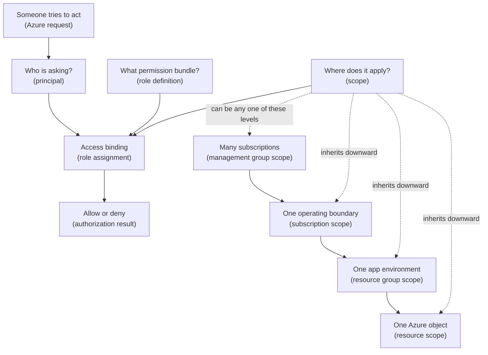

## Table of Contents

1. [The Permission Check Before Production Work](#the-permission-check-before-production-work)
2. [The AWS Bridge](#the-aws-bridge)
3. [Role Assignments In One Picture](#role-assignments-in-one-picture)
4. [The Three Parts Of Access](#the-three-parts-of-access)
5. [Scopes Decide How Far Access Travels](#scopes-decide-how-far-access-travels)
6. [Built-In Roles You Will See First](#built-in-roles-you-will-see-first)
7. [Least Privilege For The Orders API](#least-privilege-for-the-orders-api)
8. [Reading Access Evidence](#reading-access-evidence)
9. [Failure Modes And Fix Directions](#failure-modes-and-fix-directions)
10. [A Review Habit Before You Assign Access](#a-review-habit-before-you-assign-access)

## The Permission Check Before Production Work

You can know the right Azure subscription, the right resource group, and the right resource name, and still be blocked at the moment you try to act.
That is not Azure being random.
That is Azure asking a permission question:
who is making this request, what are they allowed to do, and where does that permission apply?

Azure RBAC means Azure role-based access control.
It is the authorization system for Azure resources.
Authentication proves who you are.
Authorization decides what you can do after Azure knows who you are.
RBAC is the part that answers the second question.

This exists because cloud resources are shared.
The `devpolaris-orders-api` team may have backend developers, platform engineers, finance reviewers, a CI pipeline, and a running Container App.
They do not all need the same access.
One person may need to read production logs.
Another identity may need to pull an image from Azure Container Registry.
A platform engineer may need to create the resource group.
A finance teammate may only need to inspect cost and tags.

Without RBAC, teams fall into two bad habits.
They either give everyone broad access because it is faster, or they block normal work because only one admin can do anything.
Both habits create pain.
Broad access makes mistakes larger.
Overly tight access turns simple operational work into a queue.

Azure RBAC gives you a middle path.
You grant a role to a principal at a scope.
A principal is the identity getting access, such as a user, group, service principal, or managed identity.
A role is a reusable set of permissions, such as Reader, Contributor, or Owner.
A scope is the place where those permissions apply, such as one resource group or one resource.

This article follows one running example:
the `devpolaris-orders-api` production environment lives in a resource group called `rg-devpolaris-orders-prod`.
The team needs to let humans inspect production, let a pipeline deploy the app, and let the running app read only the resources it needs.
The goal is not to memorize every Azure role.
The goal is to make safe access decisions without guessing.

> Azure access becomes easier when you read every permission as identity plus role plus scope.

## The AWS Bridge

If you have learned AWS before, the useful bridge is IAM.
In AWS, you may think about a principal such as a user, role, or service, then a policy document that allows actions on resources.
You may also think about a workload assuming an IAM role and receiving permissions from the policies attached to that role.

Azure asks a similar operating question, but it packages the answer differently.
Azure RBAC access is usually expressed as a role assignment.
The role assignment binds one principal to one role definition at one scope.
That sentence is the Azure version of "who gets which permissions on which resources?"

The comparison is useful, but it is not a perfect dictionary.
AWS IAM policies are JSON documents that often name actions and resources directly.
Azure built-in roles are role definitions managed by Azure, and you assign those role definitions at Azure scopes.
Azure scopes are part of the Azure resource hierarchy, and lower scopes inherit role assignments from higher scopes.

Here is the bridge in practical terms:

| AWS thinking | Azure RBAC thinking | What to remember |
|--------------|---------------------|------------------|
| Principal | Principal | The user, group, service principal, or managed identity getting access |
| IAM policy or role permissions | Role definition | The bundle of allowed actions, such as Reader or Contributor |
| Resource ARN or policy resource block | Scope | The Azure level where access applies |
| Account or organization boundary | Subscription or management group scope | Broad Azure scopes can affect many resources |
| IAM role for a workload | Managed identity or service principal plus role assignment | Workload identity still needs a role at the right scope |

The Azure-specific word to slow down on is scope.
You can assign a role at a management group, subscription, resource group, or individual resource.
That role then flows down to child scopes.
If Maya has Reader at the production subscription, she can read resources in every resource group under that subscription unless another rule blocks the request.

That inheritance is helpful when used carefully.
It is also the source of many surprises.
A teammate might say, "I do not see any role assignment on this Container App."
That can be true, and they can still have access because the role was inherited from the resource group or subscription above it.

So keep the AWS mental habit, but translate it into Azure's shape:
principal, role definition, scope, and inheritance.

## Role Assignments In One Picture

A role assignment is the actual permission binding.
It is not just the name of a role.
It is not just the identity.
It is the record that says:
this identity gets this role at this scope.

Read this diagram from top to bottom.
The plain-English labels come first.
The Azure terms are in parentheses because the mental model matters before the vocabulary.



The left side is the permission check.
Azure identifies the principal, looks for role assignments, evaluates the role definition, and checks whether the requested resource sits inside the assignment scope.

The right side is the scope hierarchy.
A management group can contain subscriptions.
A subscription can contain resource groups.
A resource group can contain resources.
If a role is assigned above the resource, the resource can inherit it.

That means access is not always visible where you first look.
When someone can edit `ca-devpolaris-orders-api-prod`, the reason may be a role assignment directly on the Container App.
It may also be Contributor on `rg-devpolaris-orders-prod`.
It may be Contributor on the whole production subscription.
Your job is to find the assignment that actually grants the access.

The role assignment record itself is just data, but it is important data.
A realistic Azure CLI output might look like this:

```json
{
  "principalName": "grp-orders-api-deployers",
  "principalType": "Group",
  "roleDefinitionName": "Contributor",
  "scope": "/subscriptions/11111111-2222-3333-4444-555555555555/resourceGroups/rg-devpolaris-orders-prod"
}
```

This one record tells a clear story.
The `grp-orders-api-deployers` group has Contributor access, but only inside the production orders resource group.
That is much safer than Contributor at the whole subscription when the team only owns one service environment.

## The Three Parts Of Access

The first part is the principal.
A principal is the identity that receives access.
For humans, that might be a user such as `maya@devpolaris.example`.
For teams, it is usually better to assign access to a group such as `grp-orders-api-readers` or `grp-orders-api-deployers`.
For automation, the principal might be a service principal used by CI or a managed identity attached to an Azure resource.

Groups are helpful because they make access review easier.
If every developer gets a separate role assignment, the IAM page becomes a long list of names.
If the role assignment points to `grp-orders-api-readers`, the team can review membership in Microsoft Entra ID and keep the Azure role assignment stable.

The second part is the role definition.
A role definition is the permission bundle.
It says which actions are allowed and which actions are excluded.
In everyday conversation people just say "role," but it helps to know that the formal Azure object is the definition.
The role assignment points to that definition.

The third part is the scope.
Scope answers the word "where."
The same role can be safe or dangerous depending on its scope.
Reader on one Key Vault resource is narrow.
Reader on a subscription is broad.
Contributor on one Container App may be reasonable for a deploy pipeline.
Contributor on the production subscription is usually too wide for an application team.

For `devpolaris-orders-api`, the team may need several different principals:

| Principal | Role | Scope | Why it exists |
|-----------|------|-------|---------------|
| `grp-orders-api-readers` | Reader | `rg-devpolaris-orders-prod` | Developers can inspect production resources during support |
| `grp-orders-api-deployers` | Contributor | `rg-devpolaris-orders-prod` | Trusted deployers can update the app environment |
| `sp-devpolaris-orders-ci` | Contributor | `ca-devpolaris-orders-api-prod` or app resource group | CI can deploy without touching unrelated resources |
| `mi-orders-api-prod` | AcrPull | Production container registry | The running app can pull its container image |
| `mi-orders-api-prod` | Key Vault Secrets User | Production Key Vault | The running app can read the secrets it needs |

Notice that the table does not give one giant role to one giant scope.
Each row answers one job.
That is the practical heart of least privilege:
grant enough access for the work, at the smallest useful scope, to the identity that actually performs the work.

You can create a role assignment from the CLI, but the command should come after the thinking.
In this example, the managed identity for the running orders API needs to pull images from the production registry.
That job does not require access to every resource in the production subscription.
It only needs the container registry pull role on the registry.

```bash
$ az role assignment create \
>   --assignee-object-id 99999999-aaaa-bbbb-cccc-dddddddddddd \
>   --assignee-principal-type ServicePrincipal \
>   --role AcrPull \
>   --scope /subscriptions/11111111-2222-3333-4444-555555555555/resourceGroups/rg-platform-prod/providers/Microsoft.ContainerRegistry/registries/crdevpolarisprod
{
  "principalType": "ServicePrincipal",
  "roleDefinitionName": "AcrPull",
  "scope": "/subscriptions/11111111-2222-3333-4444-555555555555/resourceGroups/rg-platform-prod/providers/Microsoft.ContainerRegistry/registries/crdevpolarisprod"
}
```

The important part is not the command length.
The important part is the shape:
the identity is the managed identity object ID, the role is `AcrPull`, and the scope is the registry resource.

## Scopes Decide How Far Access Travels

Scope is the set of resources where access applies.
Azure RBAC supports four main scope levels for resource access:
management group, subscription, resource group, and resource.
They are arranged from broad to narrow.

Management group scope is the broadest of these.
It sits above subscriptions and is usually owned by a platform or cloud governance team.
If a role assignment is placed at a management group, it can flow down into subscriptions under that management group.
That is useful for shared platform readers or security teams.
It is too broad for most application tasks.

Subscription scope covers everything in one subscription.
This is still broad.
If someone has Contributor at `sub-devpolaris-prod`, they can manage many resources in that production subscription.
That may include services owned by teams other than orders.
It may include resource groups for networking, logging, shared databases, or other applications.

Resource group scope is often the first good default for an application environment.
For `devpolaris-orders-api`, `rg-devpolaris-orders-prod` can hold the production Container App, supporting monitoring resources, Key Vault, and application settings.
Contributor at this scope lets the deployer manage the application environment without granting access to the whole subscription.

Resource scope is the narrowest common level.
It grants access to one Azure resource, such as one Container App, one Key Vault, one storage account, or one registry.
This is useful for workload identities and tightly scoped automation.
The tradeoff is that many small assignments can become harder to review if you create them without a naming and ownership habit.

Here is the hierarchy as a short scope map:

```text
/providers/Microsoft.Management/managementGroups/mg-devpolaris-prod
  /subscriptions/11111111-2222-3333-4444-555555555555
    /resourceGroups/rg-devpolaris-orders-prod
      /providers/Microsoft.App/containerApps/ca-devpolaris-orders-api-prod
```

Read the path from top to bottom.
Each level is more specific than the one above it.
When Azure checks a request against the Container App, role assignments at the Container App, its resource group, its subscription, and parent management groups can all matter.

Inheritance is why subscription-level Contributor is usually too wide.
Imagine `grp-orders-api-deployers` gets Contributor on the production subscription because one deployment needed quick access.
That group may now manage every resource group under the subscription, not just the orders API.
A deployer could accidentally update a shared network resource, delete a logging workspace, or change another team's app.
The intent was "deploy orders," but the scope says "manage production subscription resources."

The safer starting point is narrower:
grant Contributor at `rg-devpolaris-orders-prod` if the team owns that whole environment.
Grant a service-specific role at a resource scope when one identity only needs one job.
Use subscription scope when the job truly crosses resource groups, and document why the broader scope is necessary.

## Built-In Roles You Will See First

Azure has many built-in roles.
You do not need to memorize them all on day one.
You do need to understand the first three broad roles because they appear everywhere:
Reader, Contributor, and Owner.

Reader is the safe inspection role.
It lets a principal view resources but not change them.
This is useful for developers who need to debug production by reading configuration, health state, tags, and deployment history.
Reader does not mean the person can read every secret or every data record.
Some services have separate data-plane permissions for reading the data inside the resource.

Contributor is the common management role.
It lets a principal create, update, and delete many Azure resources at the assigned scope.
It does not let that principal assign Azure RBAC roles.
That last sentence matters.
A Contributor can change resources, but cannot normally grant other people access through RBAC.

Owner is the broad administrator role.
It can manage resources and assign roles in Azure RBAC.
Owner should be rare, especially at subscription and management group scopes.
If many humans have Owner all the time, your access model is no longer giving you much protection.

Here is the beginner version:

| Built-in role | Plain meaning | Can change resources? | Can assign Azure RBAC roles? | Good beginner use |
|---------------|---------------|-----------------------|------------------------------|-------------------|
| Reader | Can inspect | No | No | Support, review, production visibility |
| Contributor | Can manage resources | Yes | No | Deployment or resource management at a narrow scope |
| Owner | Can manage resources and access | Yes | Yes | Small trusted admin group, usually time-bound or tightly reviewed |

The reason Contributor cannot assign roles is separation of duties.
Managing resources and managing access are different powers.
A backend deployer may need to update the orders API, but that does not mean the deployer should be able to give a new person production access.
Keeping those powers separate limits the damage from a mistaken script or compromised account.

This also explains a common surprise.
Maya may have Contributor on `rg-devpolaris-orders-prod`.
She can restart the Container App and update settings.
When she tries to grant `mi-orders-api-prod` access to Key Vault, Azure denies the role assignment.
That is expected because she does not have a role that includes `Microsoft.Authorization/roleAssignments/write`.

The fix is not to make every deployer Owner.
The fix is to have a narrow access-management path.
For example, a platform group with Role Based Access Control Administrator or User Access Administrator can approve and create role assignments at the needed scope.
Some teams also use temporary elevation for production access, but the habit is the same:
access changes should be more carefully controlled than normal resource updates.

## Least Privilege For The Orders API

Least privilege means the identity gets only the access it needs for the job, at the smallest practical scope, for the time it needs it.
That sentence can sound like a security slogan until you apply it to a real service.
For `devpolaris-orders-api`, least privilege is just good engineering hygiene.

Start with the job, not the person.
The job "read production state during support" needs different access from "deploy the API" or "read secrets at runtime."
If you assign all three jobs the same role, the role will probably be too broad for at least two of them.

Here is a first access plan for the production orders environment:

| Job | Principal | Suggested role | Suggested scope |
|-----|-----------|----------------|-----------------|
| Read production resource state | `grp-orders-api-readers` | Reader | `rg-devpolaris-orders-prod` |
| Deploy the application environment | `grp-orders-api-deployers` | Contributor | `rg-devpolaris-orders-prod` |
| Assign or remove RBAC roles after review | `grp-platform-access-admins` | Role Based Access Control Administrator | `rg-devpolaris-orders-prod` or a controlled parent scope |
| Pull images at runtime | `mi-orders-api-prod` | AcrPull | `crdevpolarisprod` registry resource |
| Read runtime secrets | `mi-orders-api-prod` | Key Vault Secrets User | `kv-devpolaris-orders-prod` vault resource |
| Inspect costs and tags | `grp-finance-readers` | Reader or cost-specific role | subscription or resource group, based on reporting need |

The exact role names can vary by service and team policy.
The access shape is the important part.
Humans who support the app get read access.
Deployers get management access inside the app environment.
The running app gets only the service access it needs.
The access admin role is separated from normal deployment.

This shape gives up some convenience.
Someone may need to ask for an access change instead of doing it immediately.
That delay can feel annoying during setup.
But the gain is real:
the CI identity cannot edit unrelated production resources, the app identity cannot wander across the subscription, and a support reader cannot accidentally change live config.

Here is what "too wide" looks like in a role list:

```bash
$ az role assignment list \
>   --assignee grp-orders-api-deployers \
>   --all \
>   --query "[].{role:roleDefinitionName,scope:scope}" \
>   --output table
Role         Scope
-----------  ------------------------------------------------------------
Contributor  /subscriptions/11111111-2222-3333-4444-555555555555
```

This output is a warning.
It does not mention the orders resource group at all.
It says the deployer group has Contributor on the whole subscription.
If that subscription contains more than the orders API, the assignment is broader than the work.

A safer evidence shape looks like this:

```bash
$ az role assignment list \
>   --assignee grp-orders-api-deployers \
>   --scope /subscriptions/11111111-2222-3333-4444-555555555555/resourceGroups/rg-devpolaris-orders-prod \
>   --query "[].{role:roleDefinitionName,scope:scope}" \
>   --output table
Role         Scope
-----------  ------------------------------------------------------------------------------------------------
Contributor  /subscriptions/11111111-2222-3333-4444-555555555555/resourceGroups/rg-devpolaris-orders-prod
```

Now the role matches the job.
The group can manage the production orders resource group.
It does not automatically manage every other resource group in the subscription.

## Reading Access Evidence

When access feels confusing, do not start by guessing.
Start by collecting evidence.
The useful question is:
which role assignments apply to this principal at this resource?

For a human, you can start from the portal.
Open the resource, resource group, or subscription.
Go to Access control (IAM).
Use "Check access" for the user, group, service principal, or managed identity.
Then look for direct and inherited assignments.

For CLI work, the same idea is to list assignments at the scope and include inherited roles.
This example checks why Maya can read the production Container App:

```bash
$ az role assignment list \
>   --assignee maya@devpolaris.example \
>   --scope /subscriptions/11111111-2222-3333-4444-555555555555/resourceGroups/rg-devpolaris-orders-prod/providers/Microsoft.App/containerApps/ca-devpolaris-orders-api-prod \
>   --include-inherited \
>   --query "[].{principal:principalName,role:roleDefinitionName,scope:scope}" \
>   --output table
Principal                    Role    Scope
---------------------------  ------  ------------------------------------------------------------------------------------------------
maya@devpolaris.example      Reader  /subscriptions/11111111-2222-3333-4444-555555555555/resourceGroups/rg-devpolaris-orders-prod
```

The scope column is the clue.
The assignment is not directly on the Container App.
It is on the resource group, and the Container App inherits it.
That is normal.
It only becomes a problem when the inherited scope is broader than intended.

You can also inspect the current shell context before blaming RBAC.
Many access problems are really "wrong tenant" or "wrong subscription" problems.

```bash
$ az account show --query "{user:user.name,subscription:name,subscriptionId:id,tenantId:tenantId}" --output json
{
  "user": "maya@devpolaris.example",
  "subscription": "sub-devpolaris-prod",
  "subscriptionId": "11111111-2222-3333-4444-555555555555",
  "tenantId": "aaaaaaaa-bbbb-cccc-dddd-eeeeeeeeeeee"
}
```

This small check prevents a lot of wasted debugging.
If the tenant or subscription is wrong, the role assignment you are looking for may exist somewhere else.
RBAC cannot grant access in the place your CLI is not targeting.

For automation, inspect object IDs carefully.
Display names can be duplicated or renamed.
Object IDs are stable identifiers for Microsoft Entra objects.
When you create role assignments for service principals and managed identities, object ID based commands are often clearer and less fragile than display name lookup.

## Failure Modes And Fix Directions

RBAC failures are easier to handle when you separate the shape of the problem from the feeling of being blocked.
The error is usually telling you one of five things:
wrong scope, inherited surprise, not enough permission to assign access, stale principal, or directory lookup trouble.

The first failure is a role at the wrong scope.
The deployer group may have Contributor on the staging resource group, then fail in production.
The group has a real role assignment, but not where the production request is happening.

```bash
$ az containerapp update \
>   --name ca-devpolaris-orders-api-prod \
>   --resource-group rg-devpolaris-orders-prod \
>   --image crdevpolarisprod.azurecr.io/orders-api:2026.05.03
ERROR: The client 'maya@devpolaris.example' does not have authorization to perform action 'Microsoft.App/containerApps/write' over scope '/subscriptions/11111111-2222-3333-4444-555555555555/resourceGroups/rg-devpolaris-orders-prod/providers/Microsoft.App/containerApps/ca-devpolaris-orders-api-prod'.
```

The fix direction is to list assignments with the production scope and include inherited roles.
If the role appears only on `rg-devpolaris-orders-staging`, it does not help production.
Grant the right role at `rg-devpolaris-orders-prod` or at a carefully chosen parent scope.

The second failure is inherited role surprise.
Someone can change production even though you do not see a direct role assignment on the production resource group.
The assignment may come from the subscription.

```bash
$ az role assignment list \
>   --assignee maya@devpolaris.example \
>   --scope /subscriptions/11111111-2222-3333-4444-555555555555/resourceGroups/rg-devpolaris-orders-prod \
>   --include-inherited \
>   --query "[].{role:roleDefinitionName,scope:scope}" \
>   --output table
Role         Scope
-----------  ------------------------------------------------------------
Contributor  /subscriptions/11111111-2222-3333-4444-555555555555
```

The fix direction is not to remove access blindly.
First ask what job required that subscription assignment.
If the person only needs orders access, replace the broad subscription assignment with a narrower resource group or resource assignment.
If the person has a platform role, make sure it is owned, reviewed, and expected.

The third failure is Contributor trying to assign roles.
Contributor can manage many resources, but it cannot assign Azure RBAC roles.
That is why this error appears when a deployer tries to grant the orders app access to Key Vault:

```text
AuthorizationFailed:
The client has permission to manage resources, but not to perform action
'Microsoft.Authorization/roleAssignments/write' at the selected scope.
```

The fix direction is to involve an identity that can manage access, such as an approved access-admin group at the needed scope.
Do not solve this by making every deployer Owner.
Give role assignment power to fewer identities than normal deployment power.

The fourth failure is a stale or deleted principal.
A user, group, service principal, or managed identity can be deleted from Microsoft Entra ID while its Azure role assignment remains.
Azure may show the assignment as `Identity not found`.
The role assignment no longer points to a healthy identity, and it makes access reviews noisy.

```bash
$ az role assignment list \
>   --scope /subscriptions/11111111-2222-3333-4444-555555555555/resourceGroups/rg-devpolaris-orders-prod \
>   --query "[?principalName==null].{role:roleDefinitionName,principalId:principalId,principalType:principalType,scope:scope}" \
>   --output table
Role         PrincipalId                           PrincipalType  Scope
-----------  ------------------------------------  -------------  ------------------------------------------------------------------------------------------------
Reader       77777777-8888-9999-aaaa-bbbbbbbbbbbb  Unknown        /subscriptions/11111111-2222-3333-4444-555555555555/resourceGroups/rg-devpolaris-orders-prod
```

The fix direction is to confirm the principal was deleted or replaced, then remove the stale role assignment.
If a new managed identity replaced the old one, create a new role assignment for the new object ID.
Do not assume a matching display name means it is the same principal.

The fifth failure is service principal lookup trouble.
Automation may try to create a role assignment by display name or application ID, but the caller cannot read enough from Microsoft Entra ID to resolve the assignee.
The error often looks like a directory permission problem even though the target Azure scope is correct.

```text
Insufficient privileges to complete the operation.
Azure could not look up the assignee identity in Microsoft Entra ID.
```

The fix direction is to use the assignee object ID when creating the role assignment, and specify the principal type when your tooling supports it.
For Azure CLI, that means using `--assignee-object-id` and `--assignee-principal-type`.
If the automation must look up principals by name, it may need directory read permission, but object ID based assignment is usually cleaner for infrastructure scripts.

These failure modes all come back to the same inspection habit.
Check the principal.
Check the role.
Check the scope.
Check whether the access is direct or inherited.
Check whether the principal still exists.

## A Review Habit Before You Assign Access

Before you create a role assignment, pause for one minute and write the sentence in plain English.
For example:
the production orders CI identity needs to update the production Container App.
That sentence is better than "give CI Contributor" because it names the identity, job, and target.

Then translate the sentence into Azure terms:

```text
Principal: sp-devpolaris-orders-ci
Role: Contributor
Scope: /subscriptions/11111111-2222-3333-4444-555555555555/resourceGroups/rg-devpolaris-orders-prod/providers/Microsoft.App/containerApps/ca-devpolaris-orders-api-prod
Reason: deploy new revisions of devpolaris-orders-api
Reviewer: platform access admin
Review date: 2026-06-01
```

This small record helps future you.
When someone asks why an identity has access, you do not have to search chat messages or guess from a display name.
The role assignment has a reason, and the scope shows how far it reaches.

For a human group, prefer the same shape:

```text
Principal: grp-orders-api-readers
Role: Reader
Scope: /subscriptions/11111111-2222-3333-4444-555555555555/resourceGroups/rg-devpolaris-orders-prod
Reason: allow on-call developers to inspect production resources during support
Reviewer: orders service owner
Review date: 2026-06-01
```

This is not paperwork for its own sake.
It keeps access understandable when the team grows.
It also makes cleanup safer because you can tell which assignments are still serving a real job.

Use this quick checklist before assigning access:

| Question | Good answer |
|----------|-------------|
| Who needs access? | A named user, group, service principal, or managed identity |
| What job are they doing? | One concrete task, such as read state, deploy app, pull image, or read secret |
| Which role matches that job? | The narrowest role that supports the task |
| Where should it apply? | The smallest practical scope |
| Could inheritance make this wider than intended? | Checked parent scopes and documented the decision |
| Who can remove it later? | A clear owner or review group |

The best RBAC model is not the one with the most custom roles or the longest process.
It is the one a careful teammate can read during a release or incident and understand quickly.
For `devpolaris-orders-api`, that means no mystery Owners, no subscription-level Contributor for app-only work, and no stale principals hiding in the access list.

When you remember only one thing, remember the shape:
identity, role, scope.
That shape turns Azure access from a portal maze into a reviewable engineering decision.

---

**References**

- [Understand Azure role assignments](https://learn.microsoft.com/en-us/azure/role-based-access-control/role-assignments) - Explains the principal, role definition, scope, name, and identity-not-found details behind Azure role assignment records.
- [Understand scope for Azure RBAC](https://learn.microsoft.com/en-us/azure/role-based-access-control/scope-overview) - Defines management group, subscription, resource group, and resource scopes, including inheritance.
- [Steps to assign an Azure role](https://learn.microsoft.com/en-us/azure/role-based-access-control/role-assignments-steps) - Walks through choosing the principal, role, scope, and assignment method.
- [Azure built-in roles](https://learn.microsoft.com/en-us/azure/role-based-access-control/built-in-roles) - Lists Microsoft-maintained built-in roles and links to their permissions.
- [Assign Azure roles using the Azure portal](https://learn.microsoft.com/en-us/azure/role-based-access-control/role-assignments-portal) - Shows the Access control (IAM) flow and the permission needed to add role assignments.
