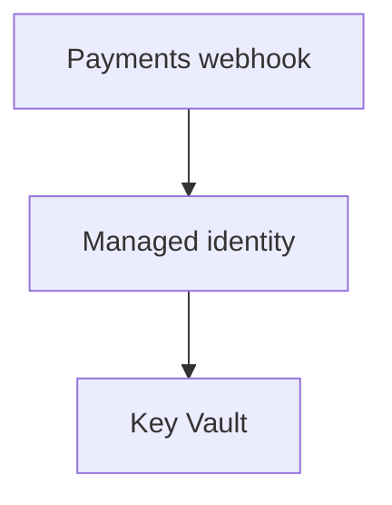
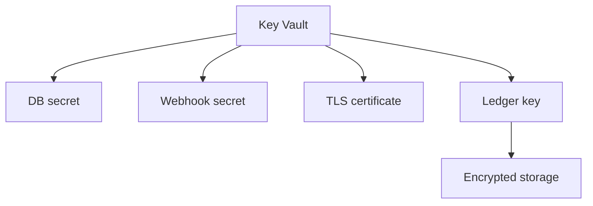

## Table of Contents

1. [The Safe Place For Dangerous Values](#the-safe-place-for-dangerous-values)
2. [The Payments Webhook Vault Map](#the-payments-webhook-vault-map)
3. [Secrets, Keys, And Certificates](#secrets-keys-and-certificates)
4. [Config Points To Secrets, It Does Not Become Secrets](#config-points-to-secrets-it-does-not-become-secrets)
5. [Vault Access Has Two Paths](#vault-access-has-two-paths)
6. [Managed Identity Lets The App Read Without A Password](#managed-identity-lets-the-app-read-without-a-password)
7. [Versions And Rotation Keep Old Values From Living Forever](#versions-and-rotation-keep-old-values-from-living-forever)
8. [Encryption At Rest And Customer-Managed Keys](#encryption-at-rest-and-customer-managed-keys)
9. [Evidence You Can Trust During A Review](#evidence-you-can-trust-during-a-review)
10. [Common Failures](#common-failures)
11. [A Small AWS Bridge](#a-small-aws-bridge)
12. [Review Checklist](#review-checklist)

## The Safe Place For Dangerous Values

Some values should never live in ordinary configuration. A production database connection string, a payment webhook signing value, a TLS certificate, and a key used to protect stored data all create real damage if they leak through a log, a screenshot, a pipeline variable, or a copied `.env` file.

Key Vault gives those values one controlled home. That matters less because the name sounds secure and more because the operating story becomes inspectable. When someone asks, "who can read this database password?", we can check the vault object, the workload identity, and the data-plane permission instead of searching source code, app settings, pipeline variables, chat messages, and old deployment logs.

For this article, the service is `devpolaris-payments-webhook`. It is a small Node.js API that receives payment provider callbacks. The app needs to connect to Azure SQL, verify webhook signatures, serve HTTPS through the platform, and use an Azure service that stores payment evidence with a customer-managed key. Those jobs all touch sensitive material, but they do not all touch the same kind of material.

Keep the object behavior in your head as we go. A secret is a value the app may need to read. A key is a cryptographic object a service may use for operations such as wrap, unwrap, sign, or verify, often without the app ever seeing raw key material. A certificate is an identity document for TLS and related trust flows, with its own expiry and renewal lifecycle.

The first goal is not to memorize every Azure option. The first goal is to keep dangerous values out of ordinary places and to make the access story readable. When the next review or outage happens, you want to answer five plain questions: which vault, which object, which identity, which permission, and which version?

## The Payments Webhook Vault Map

Start with two small maps.
The production app uses a production vault named `kv-devpolaris-payments-prod`.
Staging should use a separate vault such as `kv-devpolaris-payments-staging`.
That split matters because the staging app should not accidentally read production values, and a staging operator should not need production secret access to test a change.





The maps are intentionally boring.
Boring names help during real work.
`payments-db-connection-string` tells you which app and which purpose without showing the connection string.
`payments-ledger-key` tells you this is a key object, not a password copied into Node config.

The object inventory keeps the full names where they are easier to scan.

```text
kv-devpolaris-payments-prod
|-- payments-db-connection-string
|-- payments-webhook-signing-secret
|-- payments-webhook-tls
`-- payments-ledger-key
```

Here is the first inventory for `devpolaris-payments-webhook`:

| Object name | Object type | What uses it |
|-------------|-------------|--------------|
| `payments-db-connection-string` | Secret | The webhook API reads it to connect to Azure SQL |
| `payments-webhook-signing-secret` | Secret | The webhook API reads it to verify payment callbacks |
| `payments-webhook-tls` | Certificate | The platform or gateway uses it for HTTPS |
| `payments-ledger-key` | Key | An Azure service uses it for customer-managed encryption |

This table is not busywork. It prevents a common review problem: everyone says "the secret is in Key Vault", but nobody knows whether they mean a readable string, a cryptographic key, or a TLS certificate. The object type decides which permissions, commands, logs, and rotation plan you need.

## Secrets, Keys, And Certificates

Key Vault stores several kinds of protected objects. Beginners often call all of them "secrets" because they all need protection. That shortcut is fine in a hallway conversation, but it becomes a problem when you assign roles or debug a failure.

A **secret** is a sensitive value the caller can retrieve. For the payments webhook service, the database connection string is a secret because the app needs the actual string to open a database connection. The payment webhook signing value is also a secret because the app reads it and compares it with signatures on incoming payment callbacks.

```text
payments-db-connection-string
  Stored in Key Vault as a secret
  Read by devpolaris-payments-webhook at runtime
  Used by the database client to connect to Azure SQL

payments-webhook-signing-secret
  Stored in Key Vault as a secret
  Read by devpolaris-payments-webhook at runtime
  Used to verify payment callback signatures
```

The important part is that the app receives the value after Azure authorizes the app identity. The value should not be printed in startup logs, copied into pull requests, or pasted into app settings. Once a secret leaves Key Vault and spreads through normal tools, rotation becomes harder because you do not know which copies still exist.

A **key** is a cryptographic object. It can be used for operations such as encrypt, decrypt, sign, verify, wrap, or unwrap. In a customer-managed key setup, the app often does not read raw key material at all. An Azure service points at the Key Vault key and uses a permitted key operation while Key Vault keeps the key object under its own access rules.

```text
payments-ledger-key
  Stored in Key Vault as a key
  Identified by a /keys/ URL
  Used by an Azure service for encryption-related operations
```

A **certificate** is an X.509 certificate object, usually used for TLS. In plain English, it helps a browser or client trust that it really reached the service it meant to reach. Key Vault certificate management is connected to key and secret material, but the certificate still has its own lifecycle, expiry dates, issuer information, and permissions.

```text
payments-webhook-tls
  Stored in Key Vault as a certificate
  Identified by a /certificates/ URL
  Used by the platform or gateway for HTTPS
```

Use the object path as a clue when you inspect evidence:

| Path segment | Object type | Main question to ask |
|--------------|-------------|----------------------|
| `/secrets/` | Secret | Who can read the value? |
| `/keys/` | Key | Who can use key operations or manage the key? |
| `/certificates/` | Certificate | Who can manage the certificate lifecycle and related material? |

That one clue prevents a lot of confusion. A role that can read secret values should not automatically manage keys. A service that needs a key operation for encryption should not automatically receive the database connection string.

## Config Points To Secrets, It Does Not Become Secrets

Applications still need configuration. The safe pattern is to put directions in normal config and keep sensitive values in Key Vault. Normal config should tell the app which vault and object names to use, but it should not contain the protected value.

For `devpolaris-payments-webhook`, ordinary app config can look like this:

```text
APP_ENV=prod
AZURE_REGION=uksouth
LOG_LEVEL=info
KEY_VAULT_URI=https://kv-devpolaris-payments-prod.vault.azure.net/
DATABASE_SECRET_NAME=payments-db-connection-string
WEBHOOK_SECRET_NAME=payments-webhook-signing-secret
```

Those settings can still be wrong. A typo in `KEY_VAULT_URI` can send the app to the wrong vault. A wrong secret name can fail startup. But these settings do not grant database access by themselves, and they do not reveal the webhook signing value.

This is the shape you are trying to avoid:

```text
Plain app setting: production database connection string with password
Plain app setting: payment webhook signing value
Plain app setting: certificate private material
Plain app setting: raw encryption key material
```

The placeholders above are written as placeholders on purpose. Do not put real values like that in app settings, Dockerfiles, `.env` files, wiki pages, or screenshots. Anyone who can read those places can read the secret. If the app prints its environment during startup, the secret may also move into logs.

Key Vault does not mean the running process never sees a secret. The Node database client may still need the connection string in memory. Key Vault improves the storage path and the access path: one protected home, a short reader list, object versions, deletion recovery, and evidence that can be reviewed without exposing the value.

## Vault Access Has Two Paths

Key Vault access has two paths, and mixing them up causes a lot of wasted debugging. One path manages the Azure resource. The other path works with the protected objects inside the vault.

The **management plane** is used to create the vault, delete the vault, update tags, configure networking, or choose the permission model. These requests go through Azure Resource Manager, the Azure management layer for resources.

The **data plane** is used to get a secret, set a secret version, list keys, import a certificate, or use a key operation. These requests go to the vault endpoint:

```text
https://kv-devpolaris-payments-prod.vault.azure.net/
```

This split explains a surprising beginner bug. A person can have permission to manage the Key Vault resource and still be blocked from reading secret values inside the vault. That is useful. A teammate who updates tags for cost reporting does not automatically need the production database password.

Before you fix access, check which data-plane permission model the vault uses:

```bash
$ az keyvault show \
  --name kv-devpolaris-payments-prod \
  --resource-group rg-devpolaris-payments-prod \
  --query "{name:name, enableRbacAuthorization:properties.enableRbacAuthorization}" \
  -o json
{
  "name": "kv-devpolaris-payments-prod",
  "enableRbacAuthorization": true
}
```

If `enableRbacAuthorization` is `true`, inspect Azure RBAC role assignments for Key Vault data access. If it is `false`, inspect Key Vault access policies. Editing access policies on an RBAC vault will not fix a missing data-plane role, and adding a management role will not automatically let the app read a secret.

A narrow role assignment for the payments webhook service reads like a permission sentence:

```text
Principal:
  mi-devpolaris-payments-webhook-prod

Role:
  Key Vault Secrets User

Scope:
  /subscriptions/<subscription-id>/resourceGroups/rg-devpolaris-payments-prod/providers/Microsoft.KeyVault/vaults/kv-devpolaris-payments-prod

Meaning:
  The runtime identity can read secret values from this production vault.
```

Notice the scope. The app does not need every vault in the subscription. It needs the production payments vault. If a reviewer asks why the role is at subscription scope, you should have a strong reason. Most app runtime access should be smaller.

## Managed Identity Lets The App Read Without A Password

Now connect the app runtime to the vault. The running `devpolaris-payments-webhook` should not carry a long-lived client secret whose only job is to fetch other secrets. In Azure, the cleaner path is a managed identity. A managed identity is an identity Azure creates for a workload so the workload can authenticate without storing its own password.

The app still has to prove who it is. It just does not prove that with a copied credential in config. The Azure runtime gives the SDK a way to request a token for the managed identity. Key Vault receives the token, checks the data-plane permission, and then returns the requested secret if the identity is allowed.

In production code, keep the credential choice explicit:

```js
import { ManagedIdentityCredential } from "@azure/identity";
import { SecretClient } from "@azure/keyvault-secrets";

const vaultUrl = process.env.KEY_VAULT_URI;
const clientId = process.env.AZURE_CLIENT_ID;

if (!vaultUrl || !clientId) {
  throw new Error("Key Vault URI and managed identity client ID must be configured");
}

const credential = new ManagedIdentityCredential({ clientId });
const secrets = new SecretClient(vaultUrl, credential);

const database = await secrets.getSecret("payments-db-connection-string");
const webhook = await secrets.getSecret("payments-webhook-signing-secret");

export const databaseUrl = database.value;
export const webhookSecret = webhook.value;
```

The important line is `new ManagedIdentityCredential({ clientId })`. `AZURE_CLIENT_ID` is an identifier for the user-assigned managed identity. It is not a password. It helps the SDK choose the intended identity when the Azure hosting resource has that identity attached.

The identity still needs permission. If the app can get a token but Key Vault returns `403`, check the role assignment and scope for the managed identity. If the app cannot get a token, check whether the identity is attached to the hosting resource and whether `AZURE_CLIENT_ID` points to the intended identity.

Some Azure hosting options can resolve Key Vault references in platform app settings. That can be useful, but do not let it blur the security model. The platform still reads from Key Vault using an identity, and the resolved secret can still reach the running app. Logs, debug endpoints, crash dumps, and support access still need care.

## Versions And Rotation Keep Old Values From Living Forever

Key Vault is more useful when you can replace a value without changing every reference to that value. It does this with versions. When you set a secret with the same name again, Key Vault creates a new version. The name stays stable, and the long final segment of the object ID changes.

```bash
$ az keyvault secret show \
  --vault-name kv-devpolaris-payments-prod \
  --name payments-webhook-signing-secret \
  --query "{id:id, enabled:attributes.enabled, updated:attributes.updated}" \
  -o json
{
  "id": "https://kv-devpolaris-payments-prod.vault.azure.net/secrets/payments-webhook-signing-secret/9f0b1b7d8c63461c85a1f41d2d9b4567",
  "enabled": true,
  "updated": "2026-05-01T09:12:44+00:00"
}
```

The `/secrets/payments-webhook-signing-secret/9f0b...` part tells you the object type, object name, and version. If the app asks for `payments-webhook-signing-secret` without a version, it receives the current version. If the app uses a full versioned ID, it receives that exact version.

Version pinning can be useful when repeatability matters. It can hurt you when rotation should take effect automatically. If the payment provider has moved to a new webhook value but `devpolaris-payments-webhook` is still pinned to an old version, valid payment callbacks may fail signature checks.

Rotation is a small change process, not a single command. For the webhook value, the team may create the new secret version, configure the payment provider to accept or send the new value, let the app read the new version, verify callbacks, and then disable the old version after the overlap window. For a database connection string, the process may need two valid database users or two passwords so existing connections do not fail during the change.

A useful rotation note does not show the secret value. It shows which reference the app uses:

```text
Current secret version in Key Vault:
  https://kv-devpolaris-payments-prod.vault.azure.net/secrets/payments-webhook-signing-secret/9f0b1b7d8c63461c85a1f41d2d9b4567

App configuration:
  WEBHOOK_SECRET_NAME=payments-webhook-signing-secret
  KEY_VAULT_URI=https://kv-devpolaris-payments-prod.vault.azure.net/

Runtime behavior:
  App asks for the secret by name, so it follows the current enabled version after refresh.
```

The last line matters. A new version in the vault is not always the same as the running process using the new value. If the app caches secrets during startup, include a restart or refresh step in the rotation plan. If the platform resolves a Key Vault reference, check how and when that platform refreshes the value.

## Encryption At Rest And Customer-Managed Keys

Encryption at rest means stored data is encrypted while it sits on disk or inside a managed service. Many Azure services encrypt stored data by default with Microsoft-managed keys. For many teams, that default is a good starting point because the team does not need to operate key lifecycle work on day one.

A customer-managed key changes the responsibility. The Azure service still stores the data, but your team controls a key object in Key Vault or Managed HSM. The service uses that key object as part of its encryption workflow, and it can do so only if its identity has the right key permission.

Customer-managed key setups usually sit one layer below your Node app code. The Azure service uses your Key Vault key to protect service-managed encryption material. The app may only know that the service is configured to use a particular key ID.

Key evidence looks different from secret evidence:

```bash
$ az keyvault key show \
  --vault-name kv-devpolaris-payments-prod \
  --name payments-ledger-key \
  --query "{kid:key.kid, keyType:key.kty, enabled:attributes.enabled}" \
  -o json
{
  "kid": "https://kv-devpolaris-payments-prod.vault.azure.net/keys/payments-ledger-key/fb903a0b234d4e8ab4dddb3a8e5541f2",
  "keyType": "RSA",
  "enabled": true
}
```

Notice the `/keys/` path. That path tells you to review key roles and key operations, not secret-read access. A runtime identity that reads `payments-db-connection-string` should not automatically manage or purge `payments-ledger-key`.

Customer-managed keys give you more control and more ways to break your own service. If the key is disabled, deleted, purged, expired, or made unreachable by a permission change, the dependent service may lose access to protected data. That is why soft-delete, purge protection, narrow key roles, monitoring, and clear ownership matter more when a key protects service data.

## Evidence You Can Trust During A Review

A good review proves the protected setup without revealing the protected values. You want evidence that proves the vault, object type, identity, role scope, version, and deletion settings. You do not want screenshots or logs that contain secret values.

For `devpolaris-payments-webhook`, a small review pack is enough:

| Question | Evidence to show | What it proves |
|----------|------------------|----------------|
| Which vault is production using? | Vault URI and resource ID | The app targets the intended environment |
| Which identity reads secrets? | Managed identity name, client ID, principal ID, and role assignment | Access belongs to the app identity |
| Which object is being read? | Secret, key, or certificate ID without sensitive value output | The object type and name match the design |
| Which version is current? | Object ID and updated timestamp | Rotation state is visible |
| Is deletion recoverable? | Soft-delete and purge protection settings | Accidental deletion has a recovery path |

Here is a secret evidence snapshot that does not print the database connection string:

```bash
$ az keyvault secret show \
  --vault-name kv-devpolaris-payments-prod \
  --name payments-db-connection-string \
  --query "{id:id, enabled:attributes.enabled, updated:attributes.updated}" \
  -o json
{
  "id": "https://kv-devpolaris-payments-prod.vault.azure.net/secrets/payments-db-connection-string/4ab61ccf88f94b6fb2e8f0b555cc19d1",
  "enabled": true,
  "updated": "2026-05-02T14:31:09+00:00"
}
```

Here is role evidence for the app identity. The assignee value is a principal ID, not a secret:

```bash
$ az role assignment list \
  --assignee <principal-id-for-mi-devpolaris-payments-webhook-prod> \
  --scope /subscriptions/<subscription-id>/resourceGroups/rg-devpolaris-payments-prod/providers/Microsoft.KeyVault/vaults/kv-devpolaris-payments-prod \
  --query "[].{role:roleDefinitionName, scope:scope}" \
  -o table
Role                    Scope
----------------------  --------------------------------------------------------------------------------
Key Vault Secrets User  /subscriptions/<subscription-id>/resourceGroups/rg-devpolaris-payments-prod/providers/Microsoft.KeyVault/vaults/kv-devpolaris-payments-prod
```

This proves a narrow thing, and that is good. It proves the app identity can read secrets from the production payments vault. It does not prove the app can manage keys, purge deleted objects, administer every vault, or read secrets from staging.

Deletion settings are also review evidence:

```bash
$ az keyvault show \
  --name kv-devpolaris-payments-prod \
  --resource-group rg-devpolaris-payments-prod \
  --query "{softDelete:properties.enableSoftDelete, purgeProtection:properties.enablePurgeProtection}" \
  -o json
{
  "softDelete": true,
  "purgeProtection": true
}
```

For a vault that holds production secrets and customer-managed keys, those settings are part of the operating story. Soft-delete gives you a recovery path after accidental deletion. Purge protection helps prevent immediate permanent removal. That protection matters most for keys that other services depend on to read protected data.

## Common Failures

Most Key Vault failures reduce to five checks: vault, identity, permission model, object type, and version. Work through those checks before creating new secrets or widening roles. A quick fix in the wrong place can leave production harder to understand.

The first failure is the wrong vault. Staging and production names can look close when you are moving quickly:

```bash
$ az keyvault secret show \
  --vault-name kv-devpolaris-payments-staging \
  --name payments-db-connection-string \
  --query "{id:id, enabled:attributes.enabled}" \
  -o json
SecretNotFound: A secret with name 'payments-db-connection-string' was not found in this key vault.
```

Check `KEY_VAULT_URI`, subscription, resource group, and vault resource ID before creating anything. Creating a production secret in the staging vault just to make a command pass creates a problem for the next person.

The second failure is the wrong identity. The app may run under a system-assigned identity in staging and a user-assigned identity in production. If the SDK chooses a different identity than the one with access, the error often looks like a Key Vault permission issue:

```text
2026-05-03T10:18:22.104Z payments-webhook error Key Vault request failed
status=403
code=Forbidden
vault=kv-devpolaris-payments-prod
secret=payments-db-connection-string
identityClientId=8a77b7f5-1111-4444-9999-4f2a11111111
message="Caller is not authorized to perform action on resource."
```

This log should point you to identity and role assignment evidence. Check which managed identity is attached to `app-devpolaris-payments-webhook-prod`. Then check whether that principal has the Key Vault data role at the production vault scope.

The third failure is fixing the wrong access path. `Key Vault Contributor` helps manage the vault resource. It does not allow reading keys, secrets, and certificates. If the app cannot read a secret, adding another management role to the vault changes the wrong layer. The missing permission is data-plane access, not vault-resource management.

The fourth failure is stale version use after rotation:

```text
Configured secret ID:
  https://kv-devpolaris-payments-prod.vault.azure.net/secrets/payments-webhook-signing-secret/1c2oldversion

Current secret ID:
  https://kv-devpolaris-payments-prod.vault.azure.net/secrets/payments-webhook-signing-secret/9f0newversion
```

If the app should follow rotation, use the versionless name or base identifier and refresh the running process as needed. If the app should pin a version, write down why the pin exists and when it should be updated.

The fifth failure is deletion confusion. A deleted object may still be recoverable when soft-delete is enabled. Purge protection can prevent immediate permanent deletion:

```bash
$ az keyvault secret list-deleted \
  --vault-name kv-devpolaris-payments-prod \
  --query "[].{name:name, recoveryId:recoveryId, scheduledPurgeDate:scheduledPurgeDate}" \
  -o table
Name                         RecoveryId                                             ScheduledPurgeDate
---------------------------  -----------------------------------------------------  ------------------------
payments-webhook-signing-secret  https://kv-devpolaris-payments-prod.vault.azure.net/...  2026-07-31T09:12:44+00:00
```

If deletion was accidental, recover the object. If permanent removal is required, treat purge as a privileged action with a clear reason. Be especially careful with keys used for customer-managed encryption, because removing the wrong key can make dependent data unreadable.

## A Small AWS Bridge

If you learned AWS first, bring the habit of separating secret storage, key use, and workload identity. Do not force a one-to-one dictionary. AWS and Azure split the work differently, and the exact service boundary matters during reviews.

| Job | Common AWS shape | Azure shape |
|-----|------------------|-------------|
| Store a database password or API token | Secrets Manager | Key Vault secret |
| Store ordinary non-secret config | Systems Manager Parameter Store or app config | App settings or Azure App Configuration |
| Manage TLS certificate material | ACM or service-specific certificate stores | Key Vault certificate or platform certificate integration |
| Control encryption keys for services | KMS | Key Vault key or Managed HSM key |
| Give cloud-hosted code an identity | IAM role attached to a workload | Managed identity attached to an Azure resource |

The Azure habits are the part to practise. Check whether the vault uses RBAC or access policies. Separate management-plane access from data-plane access. Read `/secrets/`, `/keys/`, and `/certificates/` in object identifiers. Use versionless references only when the app should follow the current version.

For the payments webhook service, the clean Azure sentence is short: `mi-devpolaris-payments-webhook-prod` can read secret values from `kv-devpolaris-payments-prod`, and a service identity can use `payments-ledger-key` for the required encryption operation. If your evidence cannot say the sentence that clearly, the setup probably needs another pass.

## Review Checklist

Use this checklist before closing a Key Vault change for `devpolaris-payments-webhook`:

1. Is each protected item stored as the right object type: secret, key, or certificate?
2. Does app configuration contain vault URIs and object names rather than secret values?
3. Which managed identity reads or uses each vault object?
4. Is each role assignment scoped to the production vault, object, or service target instead of the whole subscription?
5. Does the evidence show object IDs, versions, and role scopes without printing secret values?
6. If a value was rotated, which version is the running app using now?
7. If a key protects service encryption, are soft-delete, purge protection, monitoring, and ownership part of the operating plan?
8. If something failed, have you checked vault, identity, permission model, object type, and version before changing production values?

The mental model stays small. Key Vault is the controlled home for protected objects. Secrets, keys, and certificates behave differently. Azure roles decide which identity can read a value, manage an object, or use a key operation. The app should call the vault with its managed identity, not with a copied password.

---

**References**

- [Azure Key Vault keys, secrets, and certificates overview](https://learn.microsoft.com/en-us/azure/key-vault/general/about-keys-secrets-certificates) - Defines Key Vault object types, object identifiers, base identifiers, and versioning.
- [About keys](https://learn.microsoft.com/en-us/azure/key-vault/keys/about-keys) - Explains Key Vault key types, protection methods, and customer-managed key scenarios.
- [ManagedIdentityCredential class](https://learn.microsoft.com/javascript/api/%40azure/identity/managedidentitycredential?view=azure-node-latest) - Documents the JavaScript credential used by Azure-hosted code with managed identity.
- [Authenticate Azure-hosted JavaScript apps using a user-assigned managed identity](https://learn.microsoft.com/en-us/azure/developer/javascript/sdk/authentication/user-assigned-managed-identity) - Shows the JavaScript SDK pattern for user-assigned managed identity and client IDs.
- [Provide access to Key Vault keys, certificates, and secrets with Azure RBAC](https://learn.microsoft.com/en-us/azure/key-vault/general/rbac-guide) - Covers Key Vault RBAC, data-plane roles, access scopes, and the management-plane/data-plane split.
- [Azure Key Vault soft-delete overview](https://learn.microsoft.com/en-us/azure/key-vault/general/soft-delete-overview) - Explains deleted object recovery, retention, purge, and purge protection.
