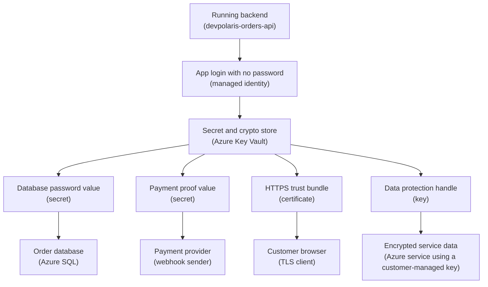

## Table of Contents

1. [The Safe Place For Dangerous Values](#the-safe-place-for-dangerous-values)
2. [If You Know AWS Secrets Manager, Parameter Store, And KMS](#if-you-know-aws-secrets-manager-parameter-store-and-kms)
3. [The Orders API Secret Map](#the-orders-api-secret-map)
4. [Secret, Key, And Certificate Are Different Objects](#secret-key-and-certificate-are-different-objects)
5. [App Configuration Is Not Secret Storage](#app-configuration-is-not-secret-storage)
6. [Vault Access Has Two Doors](#vault-access-has-two-doors)
7. [Managed Identity Lets The App Read Without A Password](#managed-identity-lets-the-app-read-without-a-password)
8. [Versions And Rotation Keep Old Values From Living Forever](#versions-and-rotation-keep-old-values-from-living-forever)
9. [Encryption At Rest And Customer-Managed Keys](#encryption-at-rest-and-customer-managed-keys)
10. [Evidence You Can Trust During A Review](#evidence-you-can-trust-during-a-review)
11. [Failure Modes You Will Actually See](#failure-modes-you-will-actually-see)
12. [A Beginner Operating Checklist](#a-beginner-operating-checklist)

## The Safe Place For Dangerous Values

Most applications need values that are useful only because they are private.
A database connection string can let code read and write order data.
A webhook secret can prove that a payment notification really came from the payment provider.
A TLS certificate can let browsers trust the HTTPS endpoint.
An encryption key can protect stored data or let an Azure service wrap another key.

Those values do not belong in Git.
They do not belong in a Dockerfile.
They do not belong in a Slack message.
They do not belong in a wiki page called "production notes."
Once a secret value spreads into normal team tools, it becomes hard to answer the basic safety question:
who can read it?

Azure Key Vault is Azure's service for storing and using sensitive application objects.
It stores secrets, keys, and certificates in one service family.
A **secret** is a sensitive value you retrieve, such as a password or connection string.
A **key** is cryptographic key material that Key Vault can use for operations such as wrapping, unwrapping, signing, verifying, encrypting, or decrypting.
A **certificate** is an X.509 certificate object, usually for TLS, with lifecycle information and often a related key and secret behind it.

Key Vault exists because application teams need a shared place for sensitive values that is separate from code and ordinary configuration.
The point is not only storage.
The point is controlled access, audit history, versions, recovery after accidental deletion, and a cleaner way for applications to get secrets without carrying their own long-lived password.

This article follows one running example:
`devpolaris-orders-api` is a Node backend running in Azure.
It needs four sensitive things:
a database connection string, a webhook secret, a TLS certificate, and an encryption key.
We will place those values in Key Vault and teach the operating habits around them.

The larger system looks like this:
your Azure subscription contains a resource group, the resource group contains the app and the vault, Microsoft Entra ID proves identities, and Azure RBAC or Key Vault access policies decide what each identity can do.
That may sound like several moving parts, but the day-to-day question stays small:

> Which app identity needs which secret, key, or certificate, in which vault, for which environment?

## If You Know AWS Secrets Manager, Parameter Store, And KMS

If you have learned a little AWS before, you may already know three separate ideas:
AWS Secrets Manager for sensitive values with rotation workflows, Systems Manager Parameter Store for named configuration parameters, and AWS KMS for cryptographic keys.
Azure Key Vault overlaps with all three, but it is not a perfect one-to-one replacement for any single one.

The beginner-friendly way to compare them is by job:

| Job | Common AWS service | Azure service shape | Careful translation |
|-----|--------------------|---------------------|---------------------|
| Store a database password or API token | Secrets Manager | Key Vault secret | Good mental bridge, but Azure calls it one object type inside Key Vault |
| Store a named config value | Parameter Store | App Configuration, app settings, or a Key Vault secret if sensitive | Do not put every config value in Key Vault |
| Store and use encryption keys | KMS | Key Vault key or Managed HSM key | Key Vault keys can back customer-managed key setups for Azure services |
| Manage TLS certificates | ACM or imported certs in service-specific places | Key Vault certificate | Azure groups cert lifecycle close to keys and secrets |

The biggest Azure difference is grouping.
Azure Key Vault stores secrets, keys, and certificates in the same service family.
That is convenient, but it also means you must keep the object types clear in your head.
A secret is not a key just because the value looks random.
A certificate is not only a secret, even though a certificate with a private key may have an addressable secret behind it.
A Key Vault key is not usually something your app reads into memory as a string.

AWS comparisons are a bridge, not a dictionary.
If you know Secrets Manager, carry over the habit of keeping passwords out of code and rotating them.
If you know Parameter Store, carry over the habit of naming configuration clearly.
If you know KMS, carry over the habit that services can use keys without exposing raw key material to your app.
Then slow down and learn the Azure-specific permission model, because access is where many Key Vault mistakes happen.

## The Orders API Secret Map

The `devpolaris-orders-api` production environment has a small but realistic set of sensitive objects.
The team uses an Azure Container App for the API, Azure SQL for order storage, a payment provider webhook, and HTTPS for public traffic.
The production vault is named `kv-devpolaris-orders-prod`.
The staging vault is named `kv-devpolaris-orders-staging`.

Here is the map before we look at commands:



Read the diagram from top to bottom.
The running app has an identity.
That identity is allowed to ask the vault for only the objects it needs.
The app can retrieve secret values such as the database connection string and webhook secret.
The TLS certificate may be consumed by the platform or imported into a service that terminates HTTPS.
The encryption key is different:
an Azure service may use the key for key operations, while the raw key should not become a normal application environment variable.

This is a healthier shape than a deployment pipeline that pushes all sensitive values directly into the app.
The pipeline can deploy the app and assign permissions.
The vault holds the sensitive objects.
The app identity reads what it is allowed to read at runtime.

The production inventory might look like this:

| Object name | Object type | Example purpose |
|-------------|-------------|-----------------|
| `orders-db-connection-string` | Secret | Connection string for the production orders database |
| `orders-webhook-secret` | Secret | Shared secret used to verify payment webhooks |
| `orders-api-tls` | Certificate | TLS certificate for `api.devpolaris.example` |
| `orders-data-key` | Key | Key used by an Azure service for customer-managed encryption |

The names are boring on purpose.
They describe the app, the job, and the environment through the vault name.
You do not need the secret value to know what the object is for.
That is exactly the balance you want.

## Secret, Key, And Certificate Are Different Objects

The words secret, key, and certificate are easy to blur because all three are sensitive.
Azure separates them because they behave differently.
That separation matters when you assign permissions, rotate values, debug failures, and review evidence.

A secret is a value that comes back to the caller.
For `devpolaris-orders-api`, the database connection string is a secret because the app needs the full string to connect:

```text
Server=tcp:sql-devpolaris-orders-prod.database.windows.net,1433;Database=orders;User ID=orders_app;Password=<hidden>;Encrypt=True
```

The webhook secret is also a secret.
The app uses it to check a signature from the payment provider.
If the value leaks, someone may be able to fake webhook calls.
That means the value should be stored in Key Vault, rotated when needed, and kept out of logs.

A key is different.
A Key Vault key is usually used through cryptographic operations.
For example, an Azure service may ask Key Vault to wrap or unwrap a data encryption key.
The service is proving that it is allowed to use the key.
It is not asking Key Vault to print the raw private key into an environment variable.

That distinction helps with customer-managed keys.
When the orders team says `orders-data-key`, they should not picture a long base64 string copied into Node.
They should picture a Key Vault key object with a key identifier, permissions, versions, and operations.
The app or Azure service uses the key through the Key Vault data plane.

A certificate is another shape again.
A TLS certificate proves that a public key belongs to a name such as `api.devpolaris.example`.
In Key Vault, certificate management can include metadata, lifecycle policy, issuer information, and related key and secret objects.
That is why certificate permissions are not exactly the same as secret permissions.

Here is the beginner table to keep close:

| Object type | Plain-English meaning | Does the app usually read the value? | Example for `devpolaris-orders-api` |
|-------------|-----------------------|--------------------------------------|-------------------------------------|
| Secret | Sensitive string or bytes | Yes, for many app secrets | Database connection string, webhook secret |
| Key | Crypto object used for operations | Usually no raw key read | Customer-managed encryption key |
| Certificate | X.509 identity and trust object | Sometimes by platform, sometimes as secret material | TLS certificate for HTTPS |

The tradeoff is clarity versus convenience.
It may feel easier to call every sensitive thing a secret.
That shortcut breaks down when you need a role that can read secrets but not use keys, or a service that needs `wrapKey` and `unwrapKey` but should never see a database password.

## App Configuration Is Not Secret Storage

Applications need both ordinary configuration and secret values.
Treating them as the same thing leads to messy deployments and unsafe reviews.
Configuration is how you tell the app what shape to use.
Secrets are values that would create risk if the wrong person could read them.

For the orders API, these are ordinary configuration values:

```text
APP_ENV=prod
AZURE_REGION=uksouth
LOG_LEVEL=info
FEATURE_NEW_CHECKOUT=false
KEY_VAULT_URI=https://kv-devpolaris-orders-prod.vault.azure.net/
```

None of those values grants access by itself.
They can still be wrong, and wrong config can break production.
But they are not passwords.
A developer can read `APP_ENV=prod` without gaining access to the database.

These values are secrets:

```text
DATABASE_URL=Server=tcp:sql-devpolaris-orders-prod.database.windows.net,1433;Database=orders;User ID=orders_app;Password=<real-password>;Encrypt=True
WEBHOOK_SECRET=whsec_4yLz...
TLS_CERT_PFX_BASE64=MIIK...
ORDERS_ENCRYPTION_KEY=3f8d...
```

This second block is the smell you should learn to notice.
If these values are stored directly as plain app settings, anyone who can read app settings can read production secrets.
If the app logs its environment during startup, the secret values may land in logs.
If a support script prints process environment variables, the secrets spread again.

The safer shape is to keep config as pointers and policy decisions, then let the app or platform retrieve the sensitive value through Key Vault:

```text
KEY_VAULT_URI=https://kv-devpolaris-orders-prod.vault.azure.net/
DATABASE_SECRET_NAME=orders-db-connection-string
WEBHOOK_SECRET_NAME=orders-webhook-secret
TLS_CERT_NAME=orders-api-tls
ENCRYPTION_KEY_NAME=orders-data-key
```

This does not make secrets safe by itself.
The app still receives the database connection string at some point if it needs to connect.
But it narrows where the value is stored, who can read it, how it is audited, and how rotation happens.

A good review question is:
can I understand the app setup without seeing the secret values?
If the answer is yes, configuration and secrets are separated well.
If the answer is no, the deployment probably has secret values mixed into ordinary config.

## Vault Access Has Two Doors

Key Vault access is confusing until you learn that there are two doors.
The first door is the management plane.
The second door is the data plane.
They sound abstract, but the difference is very practical.

The **management plane** is where you manage the vault resource itself.
Creating a vault, deleting a vault, changing tags, configuring networking, and choosing the permission model are management actions.
These requests go through Azure Resource Manager, the same management layer used for other Azure resources.

The **data plane** is where you work with what is inside the vault.
Getting a secret value, setting a new secret version, listing keys, importing a certificate, wrapping a key, or recovering a deleted secret are data actions.
These requests go to the vault endpoint, such as:

```text
https://kv-devpolaris-orders-prod.vault.azure.net/
```

This split explains a common beginner surprise:
someone can have permission to view or manage the vault resource and still be blocked from reading the secret values inside it.
That is good.
The person who tags the vault for cost reporting does not automatically need the database password.

Modern Azure guidance favors Azure RBAC for Key Vault access.
RBAC means you assign a role to an identity at a scope.
For example, the orders API managed identity can receive `Key Vault Secrets User` at the production vault scope so it can read secret values from that vault.
An older vault may use Key Vault access policies instead.
Access policies are legacy, but you will still see them in real environments, so do not be surprised by both models.

The permission model should be checked before debugging:

```bash
$ az keyvault show \
  --name kv-devpolaris-orders-prod \
  --resource-group rg-devpolaris-orders-prod \
  --query "{name:name, enableRbacAuthorization:properties.enableRbacAuthorization}" \
  -o json
{
  "name": "kv-devpolaris-orders-prod",
  "enableRbacAuthorization": true
}
```

If `enableRbacAuthorization` is true, look for Azure RBAC role assignments.
If it is false, look for Key Vault access policies.
Do not fix an RBAC problem by editing access policies on an RBAC vault, and do not fix an access-policy vault by staring only at the IAM tab.

For beginners, the safest default shape is one vault per app per environment, with role assignments at the vault scope.
That keeps `devpolaris-orders-api` production secrets away from staging and away from unrelated applications.
It also keeps the permission story readable during an incident.

## Managed Identity Lets The App Read Without A Password

The old pattern for app-to-service access was to create a service password, store it somewhere, and teach the app to use it.
That moves the problem around.
Now you have a password whose job is to fetch other passwords.
If that credential leaks, the vault becomes reachable from outside the intended runtime.

A managed identity is an Azure identity attached to a workload.
For a Container App, VM, Function App, or similar Azure resource, Azure can issue an identity from Microsoft Entra ID.
The app can then ask Azure for a token as itself.
No client secret has to be copied into the app.

For `devpolaris-orders-api`, the flow is:

1. Turn on a managed identity for the production app.
2. Assign that identity a narrow Key Vault data-plane role.
3. Let the app use that identity to read the secret names it needs.

The role assignment is the important evidence.
It says which identity can read from which vault:

```bash
$ az role assignment create \
  --assignee-object-id 6b3b1111-2222-4333-9444-555555555555 \
  --assignee-principal-type ServicePrincipal \
  --role "Key Vault Secrets User" \
  --scope /subscriptions/11111111-2222-3333-4444-555555555555/resourceGroups/rg-devpolaris-orders-prod/providers/Microsoft.KeyVault/vaults/kv-devpolaris-orders-prod
{
  "principalId": "6b3b1111-2222-4333-9444-555555555555",
  "roleDefinitionName": "Key Vault Secrets User",
  "scope": "/subscriptions/11111111-2222-3333-4444-555555555555/resourceGroups/rg-devpolaris-orders-prod/providers/Microsoft.KeyVault/vaults/kv-devpolaris-orders-prod"
}
```

That role lets the app read secrets.
It does not make the app a vault administrator.
It does not automatically let the app purge deleted secrets.
It does not give access to every vault in every subscription unless you assign it at a broad scope.

Application code can then use the Azure SDK with the managed identity.
This small Node example shows the shape, not a full application design:

```js
import { DefaultAzureCredential } from "@azure/identity";
import { SecretClient } from "@azure/keyvault-secrets";

const vaultUrl = process.env.KEY_VAULT_URI;
const credential = new DefaultAzureCredential();
const secrets = new SecretClient(vaultUrl, credential);

const database = await secrets.getSecret("orders-db-connection-string");
const webhook = await secrets.getSecret("orders-webhook-secret");

export const databaseUrl = database.value;
export const webhookSecret = webhook.value;
```

The important part is `DefaultAzureCredential`.
In Azure, it can use the managed identity attached to the running app.
On a developer laptop, it can use a developer sign-in if the developer has permission.
That makes local development possible without hardcoding production credentials.

Some Azure compute services also support Key Vault references in their app settings or secret configuration.
In that model, the platform reads from Key Vault using the managed identity and exposes the value to the app as an app setting or runtime secret.
That can be convenient, but remember the boundary:
the secret is still available to the running app.
Key Vault reduces storage and access sprawl.
It does not remove the need to protect logs, debug endpoints, process dumps, and broad app-settings readers.

## Versions And Rotation Keep Old Values From Living Forever

Secret values change.
Database passwords rotate.
Webhook providers issue a new signing secret.
Certificates expire and renew.
Encryption keys may get new versions as part of a key lifecycle plan.

Key Vault helps by versioning objects.
When you set a secret with the same name again, Key Vault creates a new version.
The name stays stable.
The version identifier changes.

You can see that in a secret ID:

```bash
$ az keyvault secret show \
  --vault-name kv-devpolaris-orders-prod \
  --name orders-webhook-secret \
  --query "{id:id, enabled:attributes.enabled, created:attributes.created}" \
  -o json
{
  "id": "https://kv-devpolaris-orders-prod.vault.azure.net/secrets/orders-webhook-secret/9f0b1b7d8c63461c85a1f41d2d9b4567",
  "enabled": true,
  "created": "2026-05-01T09:12:44+00:00"
}
```

The part after the secret name is the version.
If you retrieve the secret by the base identifier, Key Vault gives you the current version:

```text
https://kv-devpolaris-orders-prod.vault.azure.net/secrets/orders-webhook-secret
```

If you retrieve it by a versioned identifier, you get that specific version:

```text
https://kv-devpolaris-orders-prod.vault.azure.net/secrets/orders-webhook-secret/9f0b1b7d8c63461c85a1f41d2d9b4567
```

Versioned identifiers are useful when you need repeatability.
They are risky when you expect rotation to take effect automatically.
If `devpolaris-orders-api` pins the old webhook secret version, the payment provider can rotate to a new value and the app will keep checking signatures with the old one.
The failure will look like a webhook problem, but the root cause is a stale secret reference.

Rotation is not only "create a new secret."
It is a small change process:
create the new value, update the dependent system, let the app pick up the new version, verify traffic, then disable or remove the old version when it is safe.
For a database connection string, that may mean a dual-password or dual-user pattern so the app can move without downtime.
For a webhook secret, that may mean accepting both old and new signatures for a short window if the provider supports it.
For a TLS certificate, that may mean importing or renewing the certificate before expiry and confirming the platform serves the new certificate.

The beginner habit is:
when something was "rotated," ask which version the app is actually using.
Do not stop at "there is a new version in the vault."

## Encryption At Rest And Customer-Managed Keys

Encryption at rest means data is encrypted while stored on disk or in a managed service's storage layer.
Azure services commonly encrypt stored data by default with Microsoft-managed keys.
That means the service handles the encryption keys for you.
For many beginner and team workloads, that default is the right starting point.

A customer-managed key changes who controls part of the key lifecycle.
Instead of only using a Microsoft-managed key, an Azure service can be configured to use a key stored in your Key Vault or Managed HSM.
The service still handles the storage system.
Your team controls the Key Vault key, its permissions, its versions, and whether the service is still allowed to use it.

This is where learners often picture the wrong thing.
Customer-managed key does not usually mean `devpolaris-orders-api` opens every database row, encrypts it by hand, and stores ciphertext itself.
It often means an Azure service uses your Key Vault key to protect its own data encryption key.
The service needs permission to use key operations such as wrapping and unwrapping.
Your application may only need the key identifier as configuration.

The evidence for a Key Vault key looks different from secret evidence:

```bash
$ az keyvault key show \
  --vault-name kv-devpolaris-orders-prod \
  --name orders-data-key \
  --query "{kid:key.kid, keyType:key.kty, enabled:attributes.enabled}" \
  -o json
{
  "kid": "https://kv-devpolaris-orders-prod.vault.azure.net/keys/orders-data-key/fb903a0b234d4e8ab4dddb3a8e5541f2",
  "keyType": "RSA",
  "enabled": true
}
```

Notice the path says `/keys/`, not `/secrets/`.
That is not cosmetic.
It changes the operations and the roles you review.
An app identity that can read `orders-db-connection-string` as a secret should not automatically be able to manage or purge `orders-data-key`.
An Azure storage or database service identity that needs to use the key for encryption may need a crypto role such as `Key Vault Crypto Service Encryption User`, scoped carefully to the vault or key.

Customer-managed keys give you more responsibility.
If you disable the key, remove the service identity's access, purge the key, or delete the vault without a recovery path, the dependent service may lose access to encrypted data.
That is why purge protection and careful role assignment matter more when keys protect service data.

The beginner tradeoff is simple:
Microsoft-managed keys reduce operational work.
Customer-managed keys give your team more control over key access and lifecycle.
More control also means more ways to break your own service if the key is deleted, disabled, or inaccessible.

## Evidence You Can Trust During A Review

Security reviews go better when you bring evidence instead of promises.
You do not need to show secret values.
In fact, showing secret values is usually a sign that the review is going the wrong way.
Good evidence proves location, identity, permission, version, and usage without exposing the sensitive value.

For `devpolaris-orders-api`, a helpful review pack might include:

| Question | Evidence to show | What it proves |
|----------|------------------|----------------|
| Which vault is production using? | Vault resource ID and `KEY_VAULT_URI` | The app targets the intended environment |
| Which identity reads secrets? | Managed identity principal ID and role assignment | Access belongs to the app, not a copied password |
| Which secret version is current? | Secret ID without value | Rotation state is visible without leaking data |
| Which key protects service data? | Key ID and service encryption setting | The service points at the intended Key Vault key |
| Is deletion recoverable? | Soft-delete and purge protection settings | Accidental deletion has a recovery path |

Here is a small evidence snapshot that does not reveal the database password:

```bash
$ az keyvault secret show \
  --vault-name kv-devpolaris-orders-prod \
  --name orders-db-connection-string \
  --query "{id:id, enabled:attributes.enabled, updated:attributes.updated}" \
  -o json
{
  "id": "https://kv-devpolaris-orders-prod.vault.azure.net/secrets/orders-db-connection-string/4ab61ccf88f94b6fb2e8f0b555cc19d1",
  "enabled": true,
  "updated": "2026-05-02T14:31:09+00:00"
}
```

This proves the object exists, shows the vault name, shows the object type, and shows the current version.
It does not print the value.
That is the kind of evidence you want in tickets and pull requests.

Role evidence should also be scoped:

```bash
$ az role assignment list \
  --assignee 6b3b1111-2222-4333-9444-555555555555 \
  --scope /subscriptions/11111111-2222-3333-4444-555555555555/resourceGroups/rg-devpolaris-orders-prod/providers/Microsoft.KeyVault/vaults/kv-devpolaris-orders-prod \
  --query "[].{role:roleDefinitionName, scope:scope}" \
  -o table
Role                    Scope
----------------------  --------------------------------------------------------------------------------
Key Vault Secrets User  /subscriptions/11111111-2222-3333-4444-555555555555/resourceGroups/rg-devpolaris-orders-prod/providers/Microsoft.KeyVault/vaults/kv-devpolaris-orders-prod
```

This proves the app has a narrow reader role at the production vault scope.
If the same query showed `Owner` at the subscription scope, the review would go very differently.
Broad access may work, but working is not the same as being safe to operate.

## Failure Modes You Will Actually See

Key Vault failures are often permission or targeting mistakes.
The error message may feel unfriendly at first, but most failures point back to one of a few checks:
which vault, which identity, which permission model, which object type, which version?

The first failure is storing a secret as a plain environment variable.
It looks convenient during deployment:

```text
Container App setting
DATABASE_URL=Server=tcp:sql-devpolaris-orders-prod.database.windows.net,1433;Database=orders;User ID=orders_app;Password=P@ssw0rd-Prod-2026;Encrypt=True
```

The fix direction is to move the value into Key Vault, keep only a reference or secret name in ordinary config, and limit who can read app settings.
Also check logs and deployment history, because the value may already have spread.
Rotation is usually required after a real leak.

The second failure is pointing at the wrong vault.
Staging and production names can be close:

```bash
$ az keyvault secret show \
  --vault-name kv-devpolaris-orders-staging \
  --name orders-db-connection-string
SecretNotFound: A secret with name 'orders-db-connection-string' was not found in this key vault.
```

The fix direction is not to create a production secret in the staging vault just to make the command pass.
First confirm `KEY_VAULT_URI`, subscription, resource group, and vault resource ID.
Then point the app or pipeline at the correct environment.

The third failure is an identity that lacks `get` permission for secrets.
The app can start, but the first secret read fails:

```text
Azure.RequestFailedException: Caller is not authorized to perform action on resource.
Action: Microsoft.KeyVault/vaults/secrets/read
Vault: kv-devpolaris-orders-prod
Identity: devpolaris-orders-api-prod
```

The fix direction is to check whether the vault uses RBAC or access policies.
For RBAC, assign a data-plane role such as `Key Vault Secrets User` to the managed identity at the vault scope.
For an access-policy vault, grant the managed identity the secret `get` permission through the vault access policy model.
After changing permissions, allow a little time for permission propagation before assuming the fix failed.

The fourth failure is stale secret version after rotation.
The webhook provider moved to a new signing secret, but the app still references the old version:

```text
configured secret id:
https://kv-devpolaris-orders-prod.vault.azure.net/secrets/orders-webhook-secret/1c2oldversion

current secret id:
https://kv-devpolaris-orders-prod.vault.azure.net/secrets/orders-webhook-secret/9f0newversion
```

The fix direction is to use a versionless secret URI when the app should follow the current version, or update the pinned version intentionally when repeatability matters.
Also restart or refresh the app if the platform caches the secret value.
Rotation is not complete until the running app uses the intended version.

The fifth failure is deletion confusion.
A teammate deletes a secret and expects the name to be free immediately.
Key Vault soft-delete means the deleted object may remain recoverable for a retention period:

```bash
$ az keyvault secret list-deleted \
  --vault-name kv-devpolaris-orders-prod \
  --query "[].{name:name, recoveryId:recoveryId, scheduledPurgeDate:scheduledPurgeDate}" \
  -o table
Name                         RecoveryId                                             ScheduledPurgeDate
---------------------------  -----------------------------------------------------  ------------------------
orders-webhook-secret        https://kv-devpolaris-orders-prod.vault.azure.net/...   2026-07-31T09:12:44+00:00
```

The fix direction depends on intent.
If deletion was accidental, recover the object.
If the object should be permanently removed, purge requires a separate privileged action and may be blocked by purge protection until the retention period ends.
For encryption keys, be much more careful:
purging a key used for customer-managed encryption can make dependent data unreadable.

The sixth failure is mixing up management plane and data plane.
A user has `Key Vault Contributor` and can edit vault settings, but cannot read the database connection string.
That can feel broken until you remember the two doors.
Management permission is not the same as secret data permission.

The fix direction is to decide which operation is failing.
If the failing operation creates or updates the vault, check management-plane Azure RBAC.
If the failing operation reads, writes, rotates, recovers, or purges a secret, key, or certificate, check data-plane access through Key Vault RBAC or access policies.

## A Beginner Operating Checklist

When you are new to Key Vault, do not try to memorize every role and operation first.
Start with a short checklist that keeps you from touching the wrong thing.

Before you store a value, ask:
is this ordinary configuration or a secret?
If it grants access, proves trust, decrypts data, signs data, or contains private key material, treat it as sensitive.
For the orders API, `LOG_LEVEL=info` is config.
The database password is a secret.
The webhook signing value is a secret.
The TLS certificate is a certificate.
The customer-managed encryption handle is a key.

Before you give access, ask:
which identity needs which operation?
A human deployer may need permission to set a new secret version.
The running app may need permission to get a secret.
An Azure service using a customer-managed key may need permission to wrap and unwrap with a key.
Those are not the same job, so they should not automatically receive the same role.

Before you rotate, ask:
which systems must accept the old value and the new value during the change?
A database credential rotation can break active connections.
A webhook secret rotation can make valid provider calls fail if the app checks the wrong value.
A certificate rotation can leave a public endpoint serving an expired certificate if the platform did not pick up the new version.

Before you delete, ask:
is this object used by a running app or by encryption at rest?
If it is a secret, deletion can break startup or external integrations.
If it is a key used for customer-managed encryption, deletion or purge can be much more serious.
Soft-delete helps with recovery, but it is not a reason to be casual.

Before you close the ticket, collect evidence that does not leak values:
vault URI, resource ID, managed identity principal ID, role assignment scope, object ID, current version, and any platform setting that points to the object.
That evidence lets another engineer review your work without asking you to paste the secret.

Key Vault becomes much less mysterious once you keep four separations clear:
config is not a secret value,
a secret is not the same as a key,
management access is not data access,
and a new version in the vault is not the same as the running app using it.

---

**References**

- [About Azure Key Vault](https://learn.microsoft.com/en-us/azure/key-vault/general/overview) - Explains the main Key Vault problems: secrets management, key management, certificate management, access, and monitoring.
- [Azure Key Vault keys, secrets, and certificates overview](https://learn.microsoft.com/en-us/azure/key-vault/general/about-keys-secrets-certificates) - Defines Key Vault object types, identifiers, and versioning across secrets, keys, and certificates.
- [Provide access to Key Vault keys, certificates, and secrets with Azure role-based access control](https://learn.microsoft.com/en-us/azure/key-vault/general/rbac-guide) - Shows the RBAC model, control plane versus data plane, built-in roles, and recommended vault-per-app patterns.
- [About Azure Key Vault secrets](https://learn.microsoft.com/en-us/azure/key-vault/secrets/about-secrets) - Describes what secrets store, how secret values are handled, encryption at rest, attributes, and secret permissions.
- [About keys](https://learn.microsoft.com/en-us/azure/key-vault/keys/about-keys) - Explains Key Vault key resource types, key protection methods, and common key usage scenarios such as customer-managed keys.
- [Azure Key Vault soft-delete overview](https://learn.microsoft.com/en-us/azure/key-vault/general/soft-delete-overview) - Covers deleted vault and object recovery, retention, purge behavior, and purge protection expectations.
