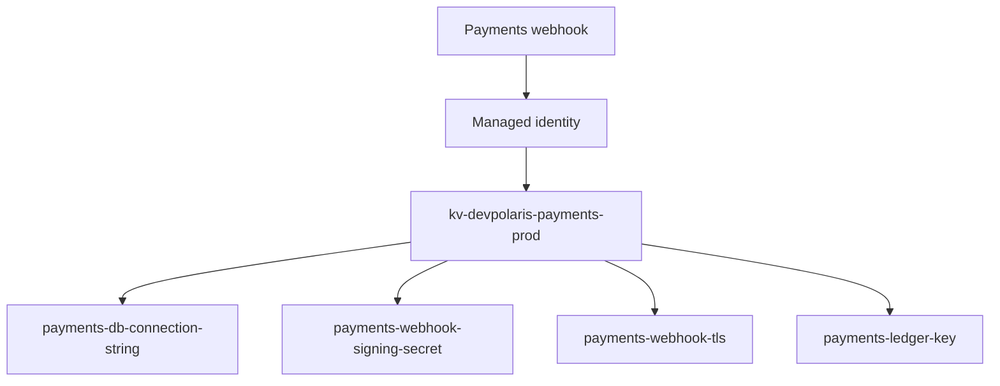

## Table of Contents

1. [The Problem](#the-problem)
2. [What Is Key Vault](#what-is-key-vault)
3. [Secrets](#secrets)
4. [Keys](#keys)
5. [Certificates](#certificates)
6. [Vault Access](#vault-access)
7. [Managed Identity Access](#managed-identity-access)
8. [Versions And Rotation](#versions-and-rotation)
9. [Soft Delete And Purge Protection](#soft-delete-and-purge-protection)
10. [Evidence Without Exposure](#evidence-without-exposure)
11. [Sample Vault Shape](#sample-vault-shape)
12. [Putting It All Together](#putting-it-all-together)

## The Problem

The payments webhook has a few dangerous values. It needs a database connection string, a payment provider signing secret, a TLS certificate, and a key used by an Azure service to protect stored payment evidence.

Those values start in ordinary places because ordinary places are convenient:

- A webhook signing secret appears in an app setting.
- A database password is copied into a pipeline variable.
- A certificate is passed around as a file attachment.
- A key rotation plan says "later" because nobody knows which apps still use the old value.

The issue is not only leakage. It is also evidence. When someone asks who can read the payment secret, the team should not search source code, deployment logs, screenshots, chat messages, and old `.env` files. The answer should live in one controlled system.

Key Vault gives sensitive values a home that can be named, permissioned, versioned, monitored, and reviewed.

## What Is Key Vault

Azure Key Vault is a service for storing and controlling access to secrets, keys, and certificates. It is not just a prettier environment-variable store. Its value is the operating model around sensitive material: one vault, named objects, access control, versions, logs, deletion protection, and evidence that does not require exposing the value.

For the payments webhook, the vault is `kv-devpolaris-payments-prod`. The app runs with `mi-devpolaris-payments-webhook-prod`. The app does not store the database password or signing secret in its configuration. It stores references and asks Key Vault for the values at runtime.



The diagram is small because the mental model should stay small. The app has an identity. The identity has narrow access. The vault stores sensitive objects. Reviews inspect the object and permission path without printing secret values.

## Secrets

A secret is a sensitive value that an application may need to read. Database passwords, API tokens, webhook signing values, and connection strings are common examples.

Secrets are still dangerous in Key Vault. If the app reads a secret value, the app has the value in memory. A bad log line can still leak it. Key Vault reduces the places where the value is stored and copied; it does not make careless handling safe.

For the payments webhook, these values belong as secrets:

| Secret | Why it belongs in Key Vault |
| --- | --- |
| `payments-db-connection-string` | The app needs the value, and leakage gives database access. |
| `payments-webhook-signing-secret` | The app needs the value to verify provider callbacks. |
| `payments-provider-api-token` | The app may need to call the provider, and rotation should be central. |

Secret names should describe purpose without revealing the value. A name such as `payments-webhook-signing-secret` is useful. A name that includes the token, account number, or password hint is not.

## Keys

A key is a cryptographic object. A service or application may use it for operations such as encrypt, decrypt, wrap, unwrap, sign, or verify. Depending on the design, the raw key material may never be handed to the application.

This is the main difference between a secret and a key. A secret is often a value the app reads and uses. A key is often an object the app or service asks Key Vault to use for a cryptographic operation.

Keys also appear in customer-managed key designs. For example, an Azure data service may use a key in Key Vault to protect stored data. In that design, the app using the data service may not need access to the key at all. The service identity needs permission to use the key for the required operations.

That distinction prevents a common over-grant. The payments app may need to read a webhook secret. It does not automatically need key management permission on the vault.

## Certificates

A certificate combines public identity material with lifecycle concerns such as expiry and renewal. TLS certificates are the most familiar example. Certificates often include a private key, so they deserve the same controlled handling as other sensitive objects.

Key Vault can store and help manage certificates. The operational value is not only storage. It is also the ability to see expiry, ownership, access, and renewal state in one place.

For the payments webhook, the TLS certificate may be consumed by an Azure gateway or platform integration rather than by the app code directly. That matters for access. The app's managed identity does not need certificate read access just because the app serves HTTPS through a platform path.

## Vault Access

Key Vault has two access-control stories that appear in real environments: Azure RBAC and the older vault access policy model. Newer designs often prefer Azure RBAC because it uses the same role assignment model covered in the first article.

The key question is not "which button grants access?" The key question is still the RBAC shape:

```text
principal + role + scope = access
```

For the payments webhook, the runtime identity should receive a narrow data role on the production vault. A human support group might receive permission to read metadata or list object names, but not to read secret values. A platform group might manage vault settings without reading application secrets.

| Caller | Access shape |
| --- | --- |
| `mi-devpolaris-payments-webhook-prod` | Read only the secret values the app needs. |
| `grp-prod-support-readers` | Inspect safe metadata and evidence. |
| `grp-platform-security` | Manage vault configuration, networking, deletion protection, and role assignments. |

The management plane and data plane distinction matters here. Managing the vault resource is different from reading a secret value. A clean design separates those jobs.

## Managed Identity Access

Managed identity is the clean way for an Azure-hosted app to call Key Vault. The app uses its runtime identity to request a token, then calls Key Vault with that token. Key Vault checks whether that identity has the required data access.

The app configuration can keep stable identifiers:

```text
KEY_VAULT_URL=https://kv-devpolaris-payments-prod.vault.azure.net
PAYMENTS_DB_SECRET_NAME=payments-db-connection-string
WEBHOOK_SECRET_NAME=payments-webhook-signing-secret
AZURE_CLIENT_ID=1d6d5d2d-25d8-4d4a-92a0-d58df00f55e1
```

Those values are not the secrets. They tell the app where to ask and which managed identity to use. The dangerous values remain in Key Vault.

The access evidence should name the identity and role assignment:

```text
Identity: mi-devpolaris-payments-webhook-prod
Role:     Key Vault Secrets User
Scope:    /subscriptions/sub-prod/resourceGroups/rg-payments-prod/providers/Microsoft.KeyVault/vaults/kv-devpolaris-payments-prod
```

If the app fails, start there. Does the app have the intended identity attached? Is the SDK using that identity? Does the role assignment cover the vault and the secret operation?

## Versions And Rotation

Secrets and keys can have versions. A new version lets you change the value without changing the object name. That is important because applications can keep a stable reference while the protected value changes underneath.

Rotation is the process around changing those values safely. The exact process depends on the dependency. A database password rotation might require creating a new password, updating Key Vault, restarting or refreshing the app, verifying connections, then retiring the old password. A webhook secret rotation might require a period where the app accepts both old and new signatures while the provider changes over.

The useful beginner habit is to separate the stable name from the changing version:

```text
Stable secret name: payments-webhook-signing-secret
Old version:        2026-04-01
New version:        2026-05-13
App reference:      secret name, not a pasted value
```

Do not treat Key Vault as the whole rotation plan. It stores versions and controls access. The application and external service still need a safe cutover path.

## Soft Delete And Purge Protection

Deletion is a security and reliability event. If a production secret, key, or vault is deleted by mistake, the app may fail immediately. If a key used for encryption is purged, protected data may become unrecoverable.

Soft delete keeps deleted vaults and objects recoverable for a retention period. Purge protection prevents permanent deletion until that retention period ends. Together, they reduce the chance that an accident or malicious cleanup destroys critical material before the team can recover.

This is one of the places where a convenience setting becomes a serious production choice. In a throwaway training environment, easy deletion may be fine. In production, deletion protection belongs in the design review because secrets and keys are part of the system's ability to recover.

Soft delete and purge protection do not replace backups, rotation plans, or access reviews. They give the team time and a recovery path when something sensitive is deleted.

## Evidence Without Exposure

A good Key Vault review proves control without revealing values.

Useful evidence includes:

- Vault name and resource ID.
- Object names and types.
- Current and previous version metadata.
- Expiry dates where they apply.
- Role assignments and principal IDs.
- Diagnostic settings or logs that show access events.

Unsafe evidence includes:

- Secret values.
- Connection strings.
- Private key material.
- Screenshots that show sensitive values in portal blades or logs.

For the payments webhook, a safe review note looks like this:

```text
Vault: kv-devpolaris-payments-prod
Object: payments-webhook-signing-secret
Type: Secret
Current version: 2026-05-13
Runtime identity: mi-devpolaris-payments-webhook-prod
Access: Key Vault Secrets User at vault scope
Secret value shown: no
```

That record lets the team reason about access, rotation, and ownership without turning the review itself into a leak.

## Sample Vault Shape

For one production app, a small vault map is enough:

```text
kv-devpolaris-payments-prod
|-- secrets
|   |-- payments-db-connection-string
|   |-- payments-webhook-signing-secret
|   `-- payments-provider-api-token
|-- keys
|   `-- payments-ledger-key
`-- certificates
    `-- payments-webhook-tls
```

The access shape stays just as important as the object inventory:

| Principal | Permission | Scope |
| --- | --- | --- |
| `mi-devpolaris-payments-webhook-prod` | Read required secret values | Production payments vault |
| Azure data service identity | Use `payments-ledger-key` as needed | Specific key |
| Platform security group | Manage vault settings and protection | Production payments vault |

This is the Azure version of the AWS Secrets Manager and KMS story, with one service collecting secrets, keys, and certificates. The same lesson carries over: do not put dangerous values in ordinary configuration, and do not give the app broad power just because it needs one value.

## Putting It All Together

Return to the payments webhook. The original problem was not that the app had sensitive values. Real systems have sensitive values. The problem was that those values lived in places that were hard to protect, rotate, and review.

The Key Vault design changes the operating story:

- Secrets, keys, and certificates have named homes.
- The app keeps references in configuration, not secret values.
- Managed identity lets the app call Key Vault without storing a client secret.
- Azure RBAC grants narrow data access at the right scope.
- Versions make rotation visible.
- Soft delete and purge protection reduce deletion risk.
- Reviews prove the access path without exposing the values.

That is the identity and security module in one line: Azure needs a clear caller, a narrow permission boundary, and a controlled home for dangerous values.

---

**References**

- [Azure Key Vault overview](https://learn.microsoft.com/en-us/azure/key-vault/general/overview)
- [Provide access to Key Vault keys, certificates, and secrets with Azure RBAC](https://learn.microsoft.com/en-us/azure/key-vault/general/rbac-guide)
- [Assign a Key Vault access policy](https://learn.microsoft.com/en-us/azure/key-vault/general/assign-access-policy)
- [Azure Key Vault soft-delete overview](https://learn.microsoft.com/en-us/azure/key-vault/general/soft-delete-overview)
- [What are managed identities for Azure resources?](https://learn.microsoft.com/en-us/entra/identity/managed-identities-azure-resources/overview)
