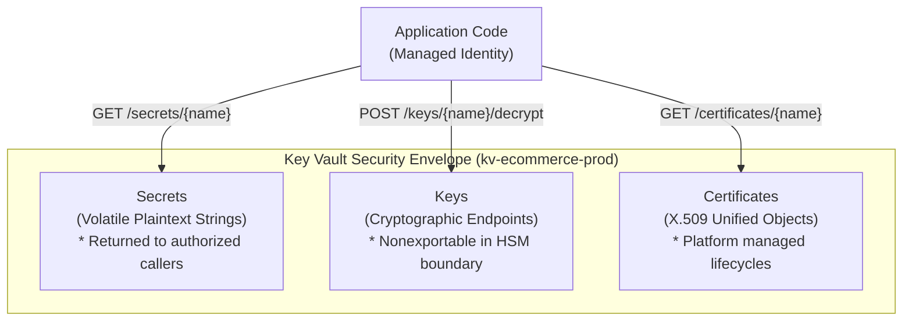

## Table of Contents

1. [Sensitive Store Isolation: The Key Vault Blueprint](#sensitive-store-isolation-the-key-vault-blueprint)
2. [Secrets: Volatile Plaintext Strings](#secrets-volatile-plaintext-strings)
3. [Keys: Cryptographic Operation Endpoints](#keys-cryptographic-operation-endpoints)
4. [Certificates: Unified X.509 Lifecycles](#certificates-unified-x.509-lifecycles)
5. [Vault Authorization: Access Policies vs. Azure RBAC](#vault-authorization-access-policies-vs-azure-rbac)
6. [Declarative Bicep Key Vault with Private Endpoints](#declarative-bicep-key-vault-with-private-endpoints)
7. [Runnable Node.js Key Vault Client Example](#runnable-nodejs-key-vault-client-example)
8. [Decoupled Secret Versioning and Rotation Cycles](#decoupled-secret-versioning-and-rotation-cycles)
9. [Reliability Safeguards: Soft Delete and Purge Protection](#reliability-safeguards-soft-delete-and-purge-protection)
10. [Auditing Evidence without Data Exposure](#auditing-evidence-without-data-exposure)
11. [Sample Vault Inventory and Access Topology](#sample-vault-inventory-and-access-topology)
12. [Putting It All Together](#putting-it-all-together)
13. [What's Next](#whats-next)

## Sensitive Store Isolation: The Key Vault Blueprint

Azure Key Vault is the Azure service for keeping sensitive application values outside your compute hosts. It stores secrets, cryptographic keys, and certificates behind a dedicated HTTPS API instead of leaving them in code, images, or local configuration files.

Example: an orders API can read `db-orders-password` from `kv-orders-prod`, while an encryption job can ask the vault to decrypt data with `key-orders-ledger` without downloading the raw key.

To build a secure cloud system, you must establish a dedicated, hard boundary around your sensitive materials.
In local workstation development, engineers are accustomed to writing database passwords and API tokens in local environment configuration files or hardcoding them inside application settings.

However, in a distributed cloud environment, this ad-hoc storage introduces severe operational risks.
Plaintext keys spread across multiple servers, compile into deployment logs, leak into diagnostic crash dumps, and remain visible in Git repository histories.
Azure Key Vault resolves these vulnerabilities by providing a unified physical and logical security envelope.



Under the hood, Key Vault enforces two isolation layers:

First is protected physical storage and hardware key boundaries.
All Key Vault data is encrypted at rest and protected by Azure's managed security boundary.
The exact protection model depends on the object and tier.
Standard vaults support software-protected keys.
Premium vaults support FIPS 140-2 Level 3 hardware security module (HSM) protected key types.
Azure Managed HSM is a separate service for single-tenant HSM-backed key management.

Second is logical REST isolation.
Key Vault does not run as a local database or filesystem folder inside your compute cluster.
It runs as an independent, isolated microservice accessed strictly through a hardened HTTPS REST API.
Every single request to read a secret, decrypt a string, or rotate a certificate must pass through TLS 1.2 or 1.3 encryption.
It must prove identity through Microsoft Entra ID, and satisfy explicit role-based access control (RBAC) boundaries before the vault's storage engine evaluates the request.

## Secrets: Volatile Plaintext Strings

A secret is a sensitive configuration string that an application must read in plaintext form to connect to another service.
Common examples include SQL database connection strings, payment provider API tokens, webhook signing signatures, and third-party credential parameters.
When an application container boots up and needs to access a database, it makes an HTTPS REST call to Key Vault:

```plain
GET https://kv-ecommerce-prod.vault.azure.net/secrets/db-password?api-version=7.4
```

Key Vault decrypts the secret value inside its secure boundary and transmits the plaintext string back to the application over the encrypted HTTPS channel.
Once received, the application stores the string in its local process memory space, utilizing it to open the database socket connection.

Because secrets are read by the application in plaintext, they are volatile.
Once the raw string value enters your application's RAM, it is vulnerable to local leakage.
A careless log statement can easily print the secret into cleartext application logs.
To protect your systems, always keep secrets short-lived in memory, sanitize logging libraries, and use Key Vault to centralize rotation.

## Keys: Cryptographic Operation Endpoints

A key is a cryptographic object (such as an RSA or Elliptic Curve key pair) used to perform secure operations like encryption, decryption, digital signing, and signature verification.
For nonexportable keys, the important anchor is that applications call the vault to perform the operation instead of downloading the raw key material.
The fundamental systems engineering difference between a secret and a key is the operational boundary of the raw material.

Under the Secret (Read-Extract) flow, the application reads and extracts the plaintext string value out of Key Vault, performing the subsequent database login locally inside its own memory space.
Under the Key (Remote-In-Vault) flow, the application never reads or extracts nonexportable cryptographic key material.
The key stays inside the Key Vault protection boundary, and HSM-backed protection depends on using the Premium HSM key types or Managed HSM.


*This boundary is the practical difference between fetching a dangerous value and asking Key Vault to perform a protected operation for you.*

```plain
Secret Flow: Key Vault [Secret String] ───────── HTTPS ────────> Application Memory
Key Flow:    Application Data ───────── Remote REST Call ────────> Key Vault Key Operation ──── Result ───> App
```

If your application needs to encrypt a customer's bank account ledger before writing it to a database, it does not download the key.
Instead, the application sends the raw ledger bytes over a secure REST call to the Key Vault `/encrypt` endpoint.
Key Vault receives the payload, executes the supported cryptographic operation using the key material inside the service boundary, and returns only the operation result back to the application.

Even if an attacker gains complete root access to your container host and dumps the application's RAM, they can never steal the encryption key.
This is because the key material has never entered the application's memory space.

## Certificates: Unified X.509 Lifecycles

A certificate is an X.509 object used to establish public identity, configure secure TLS handshakes, and verify domain ownership.
In traditional architectures, certificates are treated as raw files scattered across servers.
This makes them highly vulnerable to expiry outages (causing sudden downtime when browsers block user traffic due to untrusted connections) and access leaks (where the private key file must be copied to the web server, risking exposure).

Key Vault resolves some of these lifecycle challenges by managing certificates as a unified object that coordinates certificate metadata, a key, and a secret containing certificate material.
It can help with certificate creation, import, renewal policy, and integration with supported certificate authorities.
Do not assume Key Vault automatically handles every public certificate issuer or every DNS challenge workflow.
Built-in certificate issuer integration is limited to supported providers and configurations.
Many teams still use external automation such as ACME clients or platform-managed certificates for Let's Encrypt-style flows.

Key Vault can centralize certificate storage and lifecycle policy, while issuer automation depends on the provider and setup.

## Vault Authorization: Access Policies vs. Azure RBAC

Vault authorization is the rule system that decides which identity can read, write, or operate on vault objects. Key Vault supports two authorization models: legacy Vault Access Policies and modern Azure RBAC.

Example: `mi-orders-api-prod` can receive `Key Vault Secrets User` at `kv-orders-prod`, which lets it read secrets without giving it permission to delete the vault or change network settings.

A legacy Vault Access Policy is a vault-local permission list configured directly on the vault resource, while Azure RBAC uses standard Entra principals, role definitions, and scopes.
For all new cloud architectures, you must explicitly select the Azure RBAC model.
We contrast the two authorization architectures below:

| Authorization Coordinate | Legacy Vault Access Policies | Modern Azure RBAC Integration |
| :--- | :--- | :--- |
| **Storage Boundary** | Defined on the Key Vault resource itself (JSON properties block). | Defined globally using Microsoft Entra and `Microsoft.Authorization`. |
| **Granular Scope** | Flat, vault-level access. Capped at 1024 access policy rows. | Supports finer scopes, though Microsoft recommends assigning data-plane roles at vault scope in most cases and using object scope only for specific exceptions. |
| **Access Resolution** | Cannot grant permission to read `Secret A` without granting access to read `Secret B`. | Fully supports least privilege. Assign role at `/secrets/payments-db-string`. |
| **Governance Audit** | Audited separately using custom vault metadata scripts. | Audited centrally using standard Azure Active Directory and Activity logs. |

Under the legacy Vault Access Policies model, permissions are flat.
If you grant your microservice `Secret Get` permission on the vault, the service obtains the right to read every secret inside that vault.
If your vault holds ten unrelated database passwords, the microservice has access to all of them.

Modern Azure RBAC resolves this vulnerability by integrating Key Vault data-plane access with standard Azure role assignments.
In most production designs, create separate vaults per application and environment, then assign data-plane roles at the vault scope.
For exceptional cases, Azure RBAC can be scoped to an individual secret, key, or certificate:

```plain
Principal: mi-payments-webhook-prod (Managed Identity ObjectID)
Role:      Key Vault Secrets User (Built-in Data Role)
Scope:     /subscriptions/.../vaults/kv-payments-prod/secrets/payments-db-password
```

This can ensure that the payment processor can read only its specific database password secret, but object-level role assignments are harder to manage at scale.
For most teams, separate vaults per app/environment plus vault-scope data roles are easier to audit.

## Declarative Bicep Key Vault with Private Endpoints

To deploy a secure, enterprise-grade Key Vault, we use a declarative Bicep configuration.
The template below provisions a Key Vault with Azure RBAC authorization enabled, restricts network ingress to virtual network endpoints, and blocks all public internet access.

```bicep
param vaultName string
param subnetId string

resource keyVault 'Microsoft.KeyVault/vaults@2023-07-01' = {
  name: vaultName
  location: resourceGroup().location
  properties: {
    sku: {
      family: 'A'
      name: 'standard'
    }
    tenantId: subscription().tenantId
    enableRbacAuthorization: true
    enableSoftDelete: true
    softDeleteRetentionInDays: 90
    networkAcls: {
      bypass: 'AzureServices'
      defaultAction: 'Deny'
      virtualNetworkRules: [
        {
          id: subnetId
          ignoreMissingVnetServiceEndpoint: false
        }
      ]
    }
  }
}

resource privateEndpoint 'Microsoft.Network/privateEndpoints@2023-04-01' = {
  name: 'pe-${vaultName}'
  location: resourceGroup().location
  properties: {
    subnet: {
      id: subnetId
    }
    privateLinkServiceConnections: [
      {
        name: 'plsc-${vaultName}'
        properties: {
          privateLinkServiceId: keyVault.id
          groupIds: [
            'vault'
          ]
        }
      }
    ]
  }
}
```

## Runnable Node.js Key Vault Client Example

To fetch and modify secrets programmatically without managing passwords or client secrets, we utilize passwordless managed identities.
The Node.js script below demonstrates a complete, comment-free implementation using `@azure/keyvault-secrets` and `@azure/identity` to dynamically write and read a database credential.

```javascript
import { SecretClient } from "@azure/keyvault-secrets";
import { DefaultAzureCredential } from "@azure/identity";

const url = "https://kv-ecommerce-prod.vault.azure.net";
const credential = new DefaultAzureCredential();

const client = new SecretClient(url, credential);

async function manageDatabaseSecrets() {
  const name = "db-transaction-password";
  const value = "MOCK_DURABLE_SQL_KEY_2026";

  await client.setSecret(name, value);
  console.log("Secret successfully written.");

  const secret = await client.getSecret(name);
  console.log("Retrieved Secret Version:", secret.properties.version);
  return secret.value;
}

manageDatabaseSecrets()
  .then(val => {
    console.log("Secret operations complete.");
  })
  .catch(err => {
    console.error("Key Vault Operation Failure:", err.message);
  });
```

## Decoupled Secret Versioning and Rotation Cycles

Secret rotation is the process of replacing a sensitive value before old credentials become risky. Key Vault versioning lets the name stay stable while the value changes behind it.

Example: `payments-db-password` can keep the same secret name while Version A and Version B exist during a database password cutover. New app instances read Version B, while old instances finish their existing work with Version A.

To prevent downtime during credential updates, you must design a decoupled cutover path using Key Vault secret versioning.

```plain
Key Vault Secret Object [Stable Name: payments-db-password]
  ├── Version A (Active: 2026-04-01) ──> Used by current app tasks
  └── Version B (New:    2026-05-13) ──> Used by newly booted app tasks
```

Every time you update a secret value, Key Vault does not overwrite the old data.
Instead, it generates a new version GUID while maintaining the stable, human-friendly secret name.
When your application boots, it queries the stable name without specifying a version GUID.
Key Vault automatically returns the latest active version.

During database credential rotation, your platform team writes the new password to Key Vault (creating Version B).
The active database engine is configured to accept both Version A and Version B.
Your application containers are then rolled sequentially during a deployment.

As new tasks boot, they automatically read Version B and open connections.
Once all old containers using Version A have terminated, you safely revoke the old password at the database engine, ensuring a flawless cutover.

A common secret rotation failure occurs when applications are configured with fully qualified, version-pinned secret URLs.
An Azure Key Vault secret URL follows a strict hierarchical format: `https://{vault-name}.vault.azure.net/secrets/{secret-name}/{version-guid}`.
If an engineer copies this complete URL with the specific version GUID into the application settings, the application is permanently locked to that specific snapshot.

When your rotation pipeline runs and updates the secret value in Key Vault, a new version GUID is generated.
However, because the application configuration contains the old version-pinned URL, the running container continues to request the old secret version.
The rotation appears successful in the vault, but the active application never picks up the updated credential.
Once the old credential is disabled or deleted at the target database engine, the application immediately suffers authentication failures and crashes.

## Reliability Safeguards: Soft Delete and Purge Protection

Secrets and keys are critical to your application's ability to run and recover.
If a database password or data encryption key is deleted by accident, your application will fail instantly.
If a key used for customer-managed encryption is permanently deleted, the underlying database files become unrecoverable, resulting in permanent data loss.

To protect against accidental human errors or malicious security compromises, Key Vault enforces two mandatory reliability safeguards:

First is Soft Delete.
Soft delete is a retention state for deleted vault objects, keeping them recoverable for the configured retention window before permanent removal is allowed.
When a vault or an individual secret is deleted, the resource is not instantly wiped from physical disks.
Instead, it is moved to a temporary "trash bin" state for a configurable retention window (defaults to 90 days).
During this window, the object cannot be read by applications, but it can be recovered by an identity with the required Key Vault recovery permissions.

Second is Purge Protection.
Purge protection is a deletion-control setting that blocks permanent destruction of a deleted vault object until its retention timer has fully expired.
When enabled, it blocks anyone, including subscription owners and global directory administrators, from permanently destroying (purging) a soft-deleted vault or secret until the retention window has fully expired.

This is a critical defense against ransomware attacks.
If an attacker gains administrative access and attempts to delete and purge your encryption keys, the ARM engine will block the purge command.
The keys remain recoverable in the soft-deleted state, allowing you to restore your systems.

## Auditing Evidence without Data Exposure

Safe auditing means proving which identity, role, scope, and version are active without printing the protected value. The evidence should show that access is correctly configured while keeping the secret itself hidden.

Example: an audit note can record that `mi-payments-webhook-prod` has `Key Vault Secrets User` on `payments-db-connection-string` version `55555555-4444-4444-4444-121212121212`, without showing the connection string.

When conducting an audit or troubleshooting a startup error, support engineers must never print sensitive secrets into tickets or capture decryption passwords in screenshots.
Instead, they rely on public metadata and operational evidence.

```plain
Safe Audit Evidence:
  Vault ID: /subscriptions/.../providers/Microsoft.KeyVault/vaults/kv-payments-prod
  Secret Name: payments-db-connection-string
  Current Active Version: 55555555-4444-4444-4444-121212121212
  Assigned Principal: mi-devpolaris-payments-webhook-prod (5f1f64a4-0a2c-4f3c-91f4-3b9e68b9f6d1)
  Role: Key Vault Secrets User
  Scope: /subscriptions/.../vaults/kv-payments-prod/secrets/payments-db-connection-string
```

This audit record contains zero sensitive values.
It provides complete evidence that the workload is authenticated, the role assignment is scoped to the correct target secret scope, and the correct version is active, all without exposing a single database socket password.

## Sample Vault Inventory and Access Topology

For a secure commerce microservice, the Key Vault inventory is kept clean and tightly bounded:

```plain
kv-ecommerce-prod (Key Vault with RBAC enabled)
├── secrets
│   ├── db-ecommerce-password
│   └── payment-api-token
├── keys
│   └── ledger-signing-key (nonexportable cryptographic key)
└── certificates
    └── portal-tls-cert (SSL/TLS cert object)
```

The corresponding role assignments are scoped to isolate management plane actions from data plane actions:

| Security Principal | Assigned RBAC Role | Scope Target | Allowed Operations |
| :--- | :--- | :--- | :--- |
| **`mi-ecommerce-prod`** | `Key Vault Secrets User` | Vault Secret Scope (`/secrets/db-...`) | Reads plaintext secret values over HTTPS. |
| **`mi-ecommerce-prod`** | `Key Vault Crypto User` | Specific Key Scope (`/keys/ledger-...`) | Sends encryption/decryption payloads to Key Vault key operations. |
| **`grp-platform-security`** | `Key Vault Contributor` | Vault Resource Scope (`kv-ecommerce-prod`) | Manages network firewalls and purge settings (no data access). |

This access topology ensures that the payment workload holds the precise permissions required to encrypt ledgers and read its connection database secret, while remaining completely blocked from altering the vault's infrastructure settings or reading adjacent platform keys.

## Putting It All Together

Operating a secure, compliant cloud architecture requires centralizing all sensitive materials inside the physical and logical boundaries of Key Vault.

*   **Isolate Plaintext Strings**: Store SQL database passwords, API tokens, and connection strings inside AES-256 encrypted secrets, keeping configuration files clean.
*   **Use Nonexportable Keys**: Keep encryption keys inside the Key Vault or Managed HSM boundary, executing cryptographic operations through secure remote APIs.
*   **Enforce Azure RBAC**: Choose the Azure RBAC model over legacy access policies, usually assigning data-plane roles at vault scope and using object-level scopes only for specific exceptions.
*   **Enable Purge Protection**: Lock down production vaults with soft delete and purge protection to shield critical encryption keys from accidental deletions or ransomware.
*   **Design Versioned Rotation**: Structure cutover paths using secret versioning, ensuring that applications consume stable names while underlying passwords change.

## What's Next

Now that we have structured our relational databases, NoSQL document containers, operational release pipelines, workload identities, and central key vaults, we will explore VNet networking.
In the next chapter, we will explore Submodule 3: Networking & Connectivity, starting with Virtual Networks (VNets), routing tables, and private network segmentation.


*Use this mental model to check both halves of the design: where sensitive material lives, and how access, rotation, and recovery are controlled.*

---

**References**

* [Azure Key Vault Overview](https://learn.microsoft.com/en-us/azure/key-vault/general/overview) - Core architecture and physical boundaries of Key Vault.
* [Secure access to a key vault](https://learn.microsoft.com/en-us/azure/key-vault/general/security-features) - Authentication and authorization layers.
* [Azure Key Vault soft-delete overview](https://learn.microsoft.com/en-us/azure/key-vault/general/soft-delete-overview) - Deletion protection and purge controls.
* [RBAC Guide for Key Vault](https://learn.microsoft.com/en-us/azure/key-vault/general/rbac-guide) - Best practices for secret and key-level role assignments.
