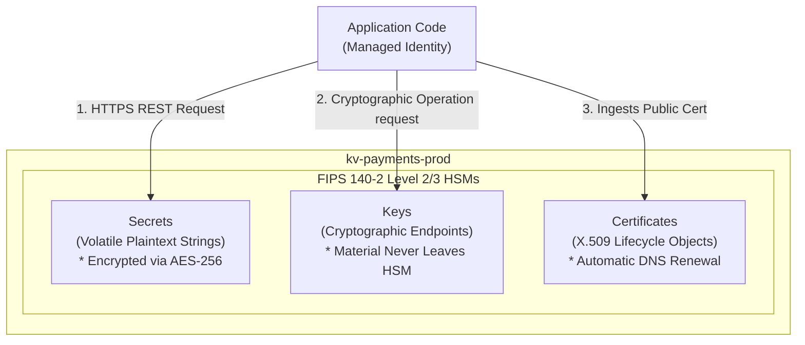

## Table of Contents

1. [Sensitive Store Isolation: The Key Vault Blueprint](#sensitive-store-isolation-the-key-vault-blueprint)
2. [Secrets: Volatile Plaintext Strings](#secrets-volatile-plaintext-strings)
3. [Keys: Cryptographic HSM Endpoints](#keys-cryptographic-hsm-endpoints)
4. [Certificates: Unified X.509 Lifecycles](#certificates-unified-x.509-lifecycles)
5. [Vault Authorization: Access Policies vs. Azure RBAC](#vault-authorization-access-policies-vs-azure-rbac)
6. [Managed Identity Access integration](#managed-identity-access-integration)
7. [Decoupled Secret Rotation Cycles](#decoupled-secret-rotation-cycles)
8. [Reliability Safeguards: Soft Delete and Purge Protection](#reliability-safeguards-soft-delete-and-purge-protection)
9. [Auditing Evidence without Data Exposure](#auditing-evidence-without-data-exposure)
10. [Sample Vault Inventory and Access Topology](#sample-vault-inventory-and-access-topology)
11. [Putting It All Together](#putting-it-all-together)

## Sensitive Store Isolation: The Key Vault Blueprint

Azure Key Vault is a highly secure, centralized cloud service designed to safeguard sensitive application secrets, cryptographic keys, and TLS/SSL certificates in a single, dedicated storage boundary.

To build a secure cloud system, you must establish a dedicated, hard boundary around your sensitive materials. In local workstation development, engineers are used to writing database passwords and API tokens in local `.env` files or hardcoding them in application settings. 

However, in a distributed cloud environment, this ad-hoc storage introduces severe risks. plaintext keys spread across multiple servers, compile into deployment logs, leak into diagnostic crash dumps, and remain visible in Git repository histories.



Azure Key Vault resolves these vulnerabilities by providing a unified, physical and logical security envelope. Under the hood, Key Vault enforces two isolation layers:

### 1. Physical HSM Isolation
All cryptographic keys and sensitive strings are encrypted at rest using AES-256 and stored inside dedicated physical Hardware Security Modules (HSMs). These modules comply with strict Federal Information Processing Standards (FIPS 140-2 Level 2 or Level 3 for Premium vaults). 

The raw cryptographic key material is cabled directly inside the HSM physical processor. It can never be read, exported, or viewed by anyone—including Microsoft administrators, support engineers, or your own account owners.

### 2. Logical REST Isolation
Key Vault does not run as a local database or filesystem folder inside your compute cluster. It runs as an independent, isolated microservice accessed strictly through a hardened HTTPS REST API. 

Every single request to read a secret, decrypt a string, or rotate a certificate must pass through TLS 1.2 or 1.3 encryption, prove identity through Microsoft Entra ID, and satisfy explicit role-based access control (RBAC) boundaries before the vault's storage engine evaluates the request.

## Secrets: Volatile Plaintext Strings

A secret is a sensitive configuration string that an application must read in plaintext format to do its job. Common examples include SQL database connection strings, payment provider API tokens, webhook signing signatures, and third-party credential parameters.

When an application container boots up and needs to access a database, it makes an HTTPS REST call to Key Vault:
```text
GET https://kv-payments-prod.vault.azure.net/secrets/payments-db-password?api-version=7.4
```
Key Vault decrypts the secret value inside its secure boundary and transmits the plaintext string back to the application over the encrypted HTTPS channel. Once received, the application stores the string in its local process memory space, utilizing it to open the database socket connection.

> [!WARNING]
> **The Runtime Memory Hazard**: Because secrets are read by the application in plaintext, they are volatile. Once the raw string value enters your application's RAM, it is vulnerable to local leakage. A careless log statement (`console.log(process.env)` or `logger.info("Connecting to DB: " + dbString)`) can easily print the secret into cleartext application logs. 

To protect your systems, always keep secrets short-lived in memory, sanitize logging libraries, and use Key Vault to centralize rotation.

## Keys: Cryptographic HSM Endpoints

A key is a cryptographic object (such as an RSA or Elliptic Curve key pair) used to perform secure operations like encryption, decryption, digital signing, and signature verification.

The fundamental systems engineering difference between a secret and a key is the **operational boundary of the raw material**:

*   **Secret (Read-Extract)**: The application reads and extracts the plaintext string value out of Key Vault, performing the subsequent database login locally inside its own memory space.
*   **Key (Remote-In-Vault)**: The application **never** reads or extracts the raw cryptographic key material. The key material remains locked inside the FIPS-compliant HSM processor.

```text
Secret Flow: Key Vault [Decrypted String] ───────── HTTPS ────────> Application Memory
Key Flow:    Application Data ───────── Remote REST Call ────────> Key Vault HSM [Math Process] ──── Cipher Text ───> App
```

If your application needs to encrypt a customer's bank account ledger before writing it to a database, it does not download the key. Instead, the application sends the raw ledger bytes over a secure REST call to the Key Vault `/encrypt` endpoint. 

The HSM processor receives the payload, executes the cryptographic math internally using the isolated key material, and returns only the encrypted cipher text back to the application. 

Even if an attacker gains complete root access to your container host and dumps the application's RAM, they can never steal the encryption key, because the key material has never entered the application's memory space.

## Certificates: Unified X.509 Lifecycles

A certificate is an X.509 digital certificate used to establish public identity, configure secure TLS handshakes, and verify domain ownership.

In traditional architectures, certificates are treated as raw files scattered across servers. This makes them highly vulnerable:
*   **Expiry Outages**: Certificates expire silently, causing sudden, catastrophic downtime when browsers block user traffic due to untrusted connections.
*   **Access Leaks**: The private key file (`.key` or `.pfx`) must be copied to the web server, risking exposure in plain directories.

Key Vault resolves these lifecycle challenges by managing certificates as a unified object that coordinates three internal resources: a public X.509 certificate file, a private secret value (containing the private key), and a cryptographic key (used for signing). 

You can configure Key Vault to integrate directly with public Certificate Authorities (like DigiCert or Let's Encrypt). 

Key Vault handles the automated DNS challenge verification, renews the certificate prior to expiration, and updates the public/private key pairs automatically under the hood, eliminating manual certificate renewal tasks entirely.

## Vault Authorization: Access Policies vs. Azure RBAC

To manage access to these sensitive objects, Key Vault supports two distinct authorization models: legacy **Vault Access Policies** and modern **Azure RBAC**.

For all new cloud architectures, you must explicitly select the **Azure RBAC** model. Differentiating between these two systems reveals critical security and operational implications:

| Authorization Coordinate | Legacy Vault Access Policies | Modern Azure RBAC Integration |
| :--- | :--- | :--- |
| **Storage Boundary** | Defined on the Key Vault resource itself (JSON properties block). | Defined globally using Microsoft Entra and `Microsoft.Authorization`. |
| **Granular Scope** | Flat, vault-level access. Capped at 1024 access policy rows. | Granular scope. Can assign permissions down to individual secrets or keys. |
| **Access Resolution** | Cannot grant permission to read `Secret A` without granting access to read `Secret B`. | Fully supports least privilege. Assign role at `/secrets/payments-db-string`. |
| **Governance Audit** | Audited separately using custom vault metadata scripts. | Audited centrally using standard Azure Active Directory and Activity logs. |

Under the legacy Vault Access Policies model, permissions are flat. If you grant your microservice `Secret Get` permission on the vault, the service obtains the right to read **every** secret inside that vault. If your vault holds ten unrelated database passwords, the microservice has access to all of them.

Modern Azure RBAC resolves this vulnerability. Because permissions are evaluated at the individual resource scope, you can configure granular, secret-level role assignments:

```text
Principal: mi-payments-webhook-prod
Role:      Key Vault Secrets User
Scope:     /subscriptions/.../vaults/kv-payments-prod/secrets/payments-db-password
```

This ensures that the payment processor can read only its specific database password secret, remaining completely blind to adjacent payment provider tokens stored in the same vault.

## Managed Identity Access Integration

Managed identity is the primary, passwordless mechanism to connect your compute containers to Key Vault. The application utilizes its attached user-assigned or system-assigned workload identity to authenticate, bypassing the need to store static client secrets.

To implement this without hardcoding credentials, you configure your application's environment settings to store only the non-sensitive metadata coordinates:

```text
KEY_VAULT_URL=https://kv-devpolaris-payments-prod.vault.azure.net
PAYMENTS_DB_SECRET_NAME=payments-db-connection-string
AZURE_CLIENT_ID=1d6d5d2d-25d8-4d4a-92a0-d58df00f55e1
```

These parameters contain zero secrets. They are stable, public pointers that tell the Azure SDK where to direct its token requests and which workload identity to use during the IMDS handshake. The physical secret string remains locked inside Key Vault, protected by the Entra ID authorization gate.

## Decoupled Secret Rotation Cycles

Rotation is the operational process of updating a sensitive value to limit the lifetime of a credential. To prevent downtime during credential updates, you must design a decoupled cutover path:

```text
Key Vault Secret Object [Stable Name: payments-db-password]
  ├── Version A (Active: 2026-04-01) ──> Used by current app tasks
  └── Version B (New:    2026-05-13) ──> Used by newly booted app tasks
```

Key Vault handles this gracefully by supporting **secret versioning**. Every time you update a secret value, Key Vault does not overwrite the old data. Instead, it generates a new version GUID while maintaining the stable, human-friendly secret name (e.g. `payments-db-password`).

When your application boots, it queries the stable name without specifying a version GUID. Key Vault automatically returns the latest active version. 

During database credential rotation, your platform team writes the new password to Key Vault (creating Version B). The active database engine is configured to accept both Version A and Version B. 

Your application containers are then rolled sequentially during a deployment. As new tasks boot, they automatically read Version B and open connections. Once all old containers using Version A have terminated, you safely revoke the old password at the database engine, ensuring a flawless cutover.

## Reliability Safeguards: Soft Delete and Purge Protection

Secrets and keys are critical to your application's ability to run and recover. If a database password or data encryption key is deleted by accident, your application will fail instantly. If a key used for customer-managed encryption is permanently deleted, the underlying database files become unrecoverable, resulting in permanent data loss.

To protect against accidental human errors or malicious security compromises, Key Vault enforces two mandatory reliability safeguards:

### 1. Soft Delete
When a vault or an individual secret is deleted, the resource is not instantly wiped from physical disks. Instead, it is moved to a temporary "trash bin" state for a configurable retention window (defaults to 90 days). 

During this window, the object cannot be read by applications, but it can be recovered instantly by an administrator holding the `Key Vault Contributor` role.

### 2. Purge Protection
Purge protection is the ultimate administrative lock. When enabled, it blocks anyone—including subscription owners and global directory administrators—from permanently destroying (purging) a soft-deleted vault or secret until the retention window has fully expired. 

This is a critical defense against ransomware attacks. If an attacker gains administrative access and attempts to delete and purge your encryption keys, the ARM engine will block the purge command. The keys remain recoverable in the soft-deleted state, allowing you to restore your systems.

## Auditing Evidence without Data Exposure

A central tenet of security engineering is verifying access controls without exposing the protected data. When conducting an audit or troubleshooting a startup error, support engineers must never print sensitive secrets into tickets or capture decryption passwords in screenshots.

Instead, they rely on public metadata and operational evidence:

```text
Safe Audit Evidence:
  Vault ID: /subscriptions/.../providers/Microsoft.KeyVault/vaults/kv-payments-prod
  Secret Name: payments-db-connection-string
  Current Active Version: 55555555-4444-4444-4444-121212121212
  Assigned Principal: mi-devpolaris-payments-webhook-prod (5f1f64a4-0a2c-4f3c-91f4-3b9e68b9f6d1)
  Role: Key Vault Secrets User
  Scope: /subscriptions/.../vaults/kv-payments-prod/secrets/payments-db-connection-string
```

This audit record contains zero sensitive values. It provides complete evidence that the workload is authenticated, the role assignment is cabled to the correct target secret scope, and the correct version is active—all without exposing a single database socket password.

## Sample Vault Inventory and Access Topology

For a secure commerce microservice, the Key Vault inventory is kept clean and tightly bounded:

```text
kv-devpolaris-payments-prod (FIPS 140-2 Level 2/3 HSM Vault)
├── secrets
│   ├── payments-db-connection-string
│   └── payments-webhook-signing-secret
├── keys
│   └── payments-ledger-key (HSM remote cryptographic key)
└── certificates
    └── payments-webhook-tls (SSL/TLS cert object)
```

The corresponding role assignments are cabled to isolate management plane actions from data plane actions:

| Security Principal | Assigned RBAC Role | Scope Target | Allowed Operations |
| :--- | :--- | :--- | :--- |
| **`mi-payments-webhook-prod`** | `Key Vault Secrets User` | Vault Secret Scope (`/secrets/payments-...`) | Reads plaintext secret values over HTTPS. |
| **`mi-payments-webhook-prod`** | `Key Vault Crypto User` | Specific Key Scope (`/keys/payments-...`) | Sends encryption/decryption payloads to the HSM. |
| **`grp-platform-security`** | `Key Vault Contributor` | Vault Resource Scope (`kv-payments-prod`) | Manages network firewalls and purge settings (no data access). |

This access topology ensures that the payment workload holds the precise permissions required to encrypt ledgers and read its connection database secret, while remaining completely blocked from altering the vault's infrastructure settings or reading adjacent platform keys.

## Putting It All Together

Operating a secure, compliant cloud architecture requires centralizing all sensitive materials inside the physical and logical boundaries of Key Vault:

*   **Isolate Plaintext Strings**: Store SQL database passwords, API tokens, and connection strings inside AES-256 encrypted secrets, keeping configuration files clean.
*   **Leverage HSM Cryptography**: Keep encryption keys locked inside isolated FIPS-compliant HSM processors, executing cryptographic operations via secure remote REST APIs.
*   **Enforce Azure RBAC**: Choose the Azure RBAC model over legacy access policies to grant granular, secret-level role assignments cabled to Entra Object IDs.
*   **Enable Purge Protection**: Lock down production vaults with soft delete and purge protection to shield critical encryption keys from accidental deletions or ransomware.
*   **Design Versioned Rotation**: Structure cutover paths using secret versioning, ensuring that applications consume stable names while underlying passwords change.

---

**References**

* [Azure Key Vault Overview](https://learn.microsoft.com/en-us/azure/key-vault/general/overview) - Core architecture and physical boundaries of Key Vault.
* [Secure access to a key vault](https://learn.microsoft.com/en-us/azure/key-vault/general/security-features) - Authentication and authorization layers.
* [Azure Key Vault soft-delete overview](https://learn.microsoft.com/en-us/azure/key-vault/general/soft-delete-overview) - Deletion protection and purge controls.
* [RBAC Guide for Key Vault](https://learn.microsoft.com/en-us/azure/key-vault/general/rbac-guide) - Best practices for secret and key-level role assignments.
