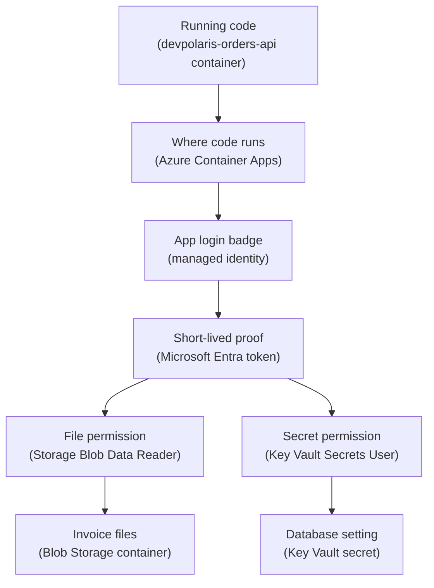

## Table of Contents

1. [The Key You Should Not Ship](#the-key-you-should-not-ship)
2. [If You Know AWS Roles](#if-you-know-aws-roles)
3. [The Orders API Access Path](#the-orders-api-access-path)
4. [System-Assigned And User-Assigned Identities](#system-assigned-and-user-assigned-identities)
5. [The Token Flow In Plain English](#the-token-flow-in-plain-english)
6. [RBAC Is The Permission, Identity Is The Caller](#rbac-is-the-permission-identity-is-the-caller)
7. [Runtime Identity Is Not Pipeline Identity](#runtime-identity-is-not-pipeline-identity)
8. [App Identity Lifecycle](#app-identity-lifecycle)
9. [Evidence From A Working Setup](#evidence-from-a-working-setup)
10. [Failure Modes You Will Actually See](#failure-modes-you-will-actually-see)
11. [A Review Habit Before Release](#a-review-habit-before-release)

## The Key You Should Not Ship

Every backend eventually needs to call something else.
A checkout API reads a secret, stores an invoice file, writes a message, or downloads a certificate.
The old habit was to give the app a password, an access key, or a client secret and place that value in an environment variable.
That feels simple at first because the app starts and the request works.
The trouble begins later, when the key is copied into a wiki, pasted into a pipeline variable, leaked in logs, forgotten during rotation, or reused by a second service that should not have the same access.

A managed identity is an Azure-managed workload identity for code running on Azure.
Workload identity means an identity used by software, not a human user.
The app does not store a password for that identity.
Instead, Azure creates and protects the identity in Microsoft Entra ID, then lets the Azure runtime prove that the running workload is allowed to request tokens for it.

Managed identity exists to remove stored credentials from the runtime path.
Your application still authenticates, which means it proves who it is.
Your application still needs authorization, which means it needs permission to do the specific action.
The difference is that your app no longer carries a long-lived secret in its own config.

This fits between your runtime and the Azure services your runtime calls.
For this article, the runtime is an Azure Container Apps app named `ca-devpolaris-orders-api-prod`.
The app runs the `devpolaris-orders-api` container.
It needs to read order export templates from Blob Storage and read one database connection setting from Key Vault.
The managed identity is the app's way to say, "Azure, I am this workload. Please give me a token for the service I am calling."

Before managed identity, a risky container configuration might look like this:

```text
Container App: ca-devpolaris-orders-api-prod

Environment variables:
  STORAGE_ACCOUNT_KEY=Ee3f...copied-secret...
  KEY_VAULT_CLIENT_SECRET=7QZ...copied-secret...
  EXPORT_CONTAINER=invoices
  KEY_VAULT_NAME=kv-devpolaris-orders-prod
```

Those two secret-looking values are the problem.
They are not bad because environment variables are always bad.
They are bad because they are long-lived credentials that now need storage, rotation, audit, and cleanup.
If the same key appears in a pipeline, local `.env` file, and production container revision, nobody feels fully sure which copy is still active.

With managed identity, the useful target is more specific:

```text
Container App: ca-devpolaris-orders-api-prod

Environment variables:
  EXPORT_CONTAINER=invoices
  STORAGE_ACCOUNT_URL=https://stdevpolarisordersprod.blob.core.windows.net
  KEY_VAULT_URL=https://kv-devpolaris-orders-prod.vault.azure.net
  AZURE_CLIENT_ID=8a77b7f5-1111-4444-9999-4f2a11111111
```

The `AZURE_CLIENT_ID` value is not a password.
It is an identifier that helps the Azure SDK choose the right user-assigned managed identity when more than one identity is attached.
An identifier can appear in config.
A secret should not.

> Managed identity does not mean "no identity." It means "no app-owned password for this identity."

## If You Know AWS Roles

If you have learned some AWS before, bring one habit with you:
do not hardcode cloud keys into workloads.
On AWS, you may have learned to attach an IAM role to an EC2 instance, ECS task, Lambda function, or another workload.
The workload uses temporary credentials from the platform instead of carrying a permanent access key.

Azure managed identity serves that same broad habit.
It is the Azure way for a workload to have a cloud identity without a stored secret.
But the Azure words and lifecycle choices are different enough that you should not translate them too quickly.

Here is the useful bridge:

| AWS habit | Azure idea | What to watch |
|-----------|------------|---------------|
| Attach a role to the workload instead of storing keys | Attach a managed identity to the Azure resource | Identity and RBAC are separate steps |
| Use short-lived credentials issued by the platform | Request a Microsoft Entra token from the Azure runtime | The token proves the workload identity, not broad access |
| Scope IAM permissions to the target resource | Assign Azure RBAC roles at the smallest useful scope | Storage and Key Vault data access need data-plane roles |
| Reuse a role only when the workloads truly share access | Use a user-assigned managed identity for shared or precreated access | A shared identity can also spread mistakes |

The first Azure-specific name is **system-assigned managed identity**.
This identity is created directly on one Azure resource.
For Container Apps, that means the identity belongs to one container app.
When the app is deleted, Azure deletes the identity too.
That lifecycle is tidy for a single workload.

The second Azure-specific name is **user-assigned managed identity**.
This identity is its own Azure resource.
You create it, grant permissions to it, and then attach it to one or more workloads.
It survives if one attached app is deleted.
That lifecycle is useful when permissions need to exist before the app is created, or when multiple runtime resources need the same identity.

For `devpolaris-orders-api`, a careful production setup often uses a user-assigned identity:

```text
Managed identity resource:
  mi-devpolaris-orders-api-prod

Attached to:
  ca-devpolaris-orders-api-prod

Allowed to read:
  Blob container invoices
  Key Vault secrets in kv-devpolaris-orders-prod
```

That shape feels close to the AWS role habit:
the workload gets an identity from the platform, then permissions are granted to that identity.
The learner mistake is to stop at "identity exists."
In Azure, an identity with no role assignment is like an employee badge with no door access.
It proves who the app is, but it does not open Blob Storage or Key Vault.

## The Orders API Access Path

The running service is small on purpose.
`devpolaris-orders-api` accepts order requests.
It runs in Azure Container Apps.
Once a day, it reads invoice template files from Blob Storage.
At startup, it reads the `OrdersDbConnection` secret from Key Vault.
The app should not store a storage account key.
The app should not store a Key Vault client secret.

Read this top to bottom.
The plain-English label comes first, and the Azure term appears in parentheses.



The diagram separates identity from permission because Azure separates them.
The managed identity is the caller.
The token is short-lived proof of that caller.
The role assignment says what that caller can do at a target scope.
Blob Storage and Key Vault still make their own authorization decisions when the request arrives.

This is also why the app code does not need a storage account key.
The SDK can use the Azure identity library to request a token.
Then the Blob Storage SDK sends that token to Blob Storage.
Blob Storage checks whether the identity behind the token has a data role such as `Storage Blob Data Reader` or `Storage Blob Data Contributor`.

In a Node service, the code shape can stay small:

```js
import { DefaultAzureCredential } from "@azure/identity";
import { BlobServiceClient } from "@azure/storage-blob";
import { SecretClient } from "@azure/keyvault-secrets";

const credential = new DefaultAzureCredential({
  managedIdentityClientId: process.env.AZURE_CLIENT_ID
});

const blobClient = new BlobServiceClient(
  process.env.STORAGE_ACCOUNT_URL,
  credential
);

const secretClient = new SecretClient(
  process.env.KEY_VAULT_URL,
  credential
);
```

This snippet only shows the important identity pattern.
The code passes a credential object to Azure SDK clients.
Locally, that credential may use a developer login.
In Azure Container Apps, it should use the attached managed identity.

## System-Assigned And User-Assigned Identities

The system-assigned choice is the simplest lifecycle.
You turn identity on for one Azure resource.
Azure creates a service principal in Microsoft Entra ID for that resource.
Only that resource can use that identity to request tokens.
When the resource is deleted, Azure removes the identity.

That makes system-assigned identity good for a workload that is clearly one resource and should not share access.
If `ca-devpolaris-orders-api-prod` is the only thing that ever needs to read the invoice templates, a system-assigned identity can be enough.
The access story is easy to inspect because the identity name follows the resource.

The user-assigned choice is a separate lifecycle.
You create an identity resource such as `mi-devpolaris-orders-api-prod`.
You grant RBAC roles to that identity.
Then you attach it to the Container App.
If the Container App is recreated, the identity can stay in place with the same permissions.

That makes user-assigned identity good when the identity needs to be prepared before the runtime exists.
It also helps when the deployment process recreates compute resources often, but the access contract should stay stable.
For example, the platform team may create the identity and role assignments first, then the application team can deploy the Container App later without asking for fresh Key Vault access.

Here is the practical comparison:

| Choice | Lifecycle | Good fit | Main risk |
|--------|-----------|----------|-----------|
| System-assigned | Created and deleted with one Azure resource | One app needs its own identity | Recreating the app changes the identity |
| User-assigned | Separate Azure resource | Access must survive app recreation or be shared carefully | Sharing can hide which workload used the access |

Do not treat user-assigned as always better.
The separate lifecycle is useful, but it is also something you must manage.
If three apps share one identity, a log line may show the identity but not immediately tell you which app made the call.
Shared access also means one broad role assignment can affect more than one workload.

For `devpolaris-orders-api`, this article uses a user-assigned identity because it teaches the full operating shape:
create the identity, attach it to the app, grant it Blob Storage access, grant it Key Vault access, and point the SDK at the correct client ID.
In a smaller project, system-assigned identity may be the right answer.

## The Token Flow In Plain English

Managed identity can sound mysterious because the secret is gone.
The missing secret is the point, but the app still needs a way to prove itself.
The proof comes from the Azure runtime and Microsoft Entra ID.

At a high level, the flow looks like this:

1. The app starts inside Azure Container Apps.
2. The app creates an Azure SDK credential.
3. The SDK asks the Azure hosting environment for a token for a target service.
4. Azure checks that the running app is allowed to use the attached managed identity.
5. Microsoft Entra issues a short-lived token for that identity.
6. The SDK sends the token to Blob Storage or Key Vault.
7. The target service checks RBAC or its own data-plane permission model before allowing the operation.

The app does not see the credential that backs the managed identity.
The app receives a token.
That token expires.
The SDK can request another one when needed.
That is a very different risk shape from a storage account key copied into app settings.

Think of a managed identity token like a temporary visitor sticker at an office.
The sticker proves the front desk checked you in.
It does not mean you can enter every room.
The room still has its own access list.
In Azure, RBAC is the access list.

This matters during debugging.
If the token request fails, the app may not have a usable identity attached.
If the token request succeeds but Blob Storage returns `AuthorizationPermissionMismatch`, the identity exists but lacks the data permission for that blob operation.
Those are different problems, and they send you to different fixes.

Here is a realistic app log when token acquisition works but Blob Storage blocks the operation:

```text
2026-04-18T09:14:27.913Z orders-api info  Loading invoice template container=invoices
2026-04-18T09:14:28.226Z orders-api error Blob download failed
status=403
code=AuthorizationPermissionMismatch
message="This request is not authorized to perform this operation using this permission."
identityClientId=8a77b7f5-1111-4444-9999-4f2a11111111
storageAccount=stdevpolarisordersprod
container=invoices
```

The useful clue is the status and code. The target service understood
the request and rejected the caller because the identity lacks the
required data permission. Start with the role assignment and scope for
that managed identity.

## RBAC Is The Permission, Identity Is The Caller

Managed identity answers "who is the app?"
Azure RBAC answers "what can that identity do here?"
The word **here** means scope, such as a management group, subscription, resource group, storage account, blob container, Key Vault, or secret.

An Azure role assignment has three practical pieces:
the principal, the role, and the scope.
The principal is the identity getting access.
The role is the permission set.
The scope is where that permission applies.

For the orders API, the intended access could be:

| Principal | Role | Scope | Why |
|-----------|------|-------|-----|
| `mi-devpolaris-orders-api-prod` | `Storage Blob Data Reader` | Blob container `invoices` | Read invoice templates |
| `mi-devpolaris-orders-api-prod` | `Key Vault Secrets User` | Key Vault `kv-devpolaris-orders-prod` | Read the database connection secret |

Notice the data-plane roles.
Blob data access is not the same as managing the Storage account resource.
Key Vault secret access is not the same as managing the Key Vault resource.
This is one of the most common Azure permission surprises.

The control plane is the management side.
It includes operations like creating a Storage account, changing tags, or configuring a Key Vault.
The data plane is the stored data side.
It includes operations like reading a blob or getting a secret value.
Many Azure services make this split because managing the container for data is not the same risk as reading the data itself.

That split protects teams from accidental overreach.
An engineer might need to view a Storage account resource in the portal without reading customer invoice files.
The orders API might need to read blobs without being able to delete the Storage account.
Those are different jobs, so they should be different roles.

The fix direction follows the job:
if the app cannot read Blob Storage data, check for a Storage Blob Data role at the right scope.
If the app cannot read Key Vault secret values, check for a Key Vault data role or the vault's access model.
If the app cannot update the Container App resource, that is a control-plane permission issue for the deployer, not a runtime managed identity issue.

## Runtime Identity Is Not Pipeline Identity

A deployment pipeline and a running application are different actors.
They may touch some of the same Azure resources, but they should not be the same identity by default.
This distinction saves teams from giving runtime code deployment power or giving deployment automation data access it does not need.

The pipeline identity is used before and during deployment.
It may build the image, push to Azure Container Registry, update the Container App revision, set environment variables, and assign a user-assigned identity to the app.
Depending on team shape, this identity may be a service principal, a federated workload identity from GitHub Actions, or another Microsoft Entra workload identity.

The runtime identity is used after the app starts.
It reads Blob Storage and Key Vault while serving real traffic.
It should not need permission to create resource groups, update RBAC assignments, or replace production container revisions.

For `devpolaris-orders-api`, the split can look like this:

| Actor | Example identity | Needs | Should not need |
|-------|------------------|-------|-----------------|
| Pipeline | `sp-devpolaris-orders-deploy-prod` | Update Container App, set image, attach identity | Read invoice blobs or secret values |
| Runtime | `mi-devpolaris-orders-api-prod` | Read Blob Storage and Key Vault data | Deploy new revisions or assign roles |

This split is the cloud version of not using your personal admin account inside application code.
The app should have the access it needs while it runs.
The deployment system should have the access it needs to ship changes.
Those two jobs overlap less than people first assume.

A clean release record can make the split visible:

```text
Release: orders-api-prod-2026.04.18.3

Pipeline identity:
  sp-devpolaris-orders-deploy-prod

Runtime identity attached:
  mi-devpolaris-orders-api-prod

Runtime roles expected:
  Storage Blob Data Reader on stdevpolarisordersprod/invoices
  Key Vault Secrets User on kv-devpolaris-orders-prod

Runtime roles not expected:
  Contributor on rg-devpolaris-orders-prod
  Owner on sub-devpolaris-prod
```

The "not expected" lines give the reviewer a quick way to catch dangerous shortcuts.
If the runtime identity has `Contributor` on the whole resource group, the app may be able to manage resources it only needed to read.

## App Identity Lifecycle

Identity lifecycle is the part that tends to surprise people during rebuilds.
An app name can stay the same while the identity behind it changes.
Or an identity can survive while a broken app revision is replaced.
You need to know which lifecycle you chose before a repair.

With a system-assigned identity, the identity belongs to the resource.
If you delete and recreate the Container App, Azure creates a new identity with a new principal ID.
Any old RBAC assignments pointed at the old principal.
The recreated app may look correct by name but fail at runtime because the new identity has no access yet.

With a user-assigned identity, the identity is separate.
If you delete and recreate the Container App, you can attach the same identity again.
The RBAC assignments stay attached to the identity.
That is helpful during rebuilds, blue-green style replacements, or infrastructure refactors where the compute resource may change but the workload's access contract should remain steady.

The tradeoff is ownership.
A user-assigned identity needs its own naming, tags, access review, and deletion process.
If nobody owns it, it can outlive the application and keep access that no running workload needs.
That is not a reason to avoid it.
It is a reason to treat it as a real resource.

For the orders API, a good identity inventory row includes:

| Field | Example |
|-------|---------|
| Identity resource | `mi-devpolaris-orders-api-prod` |
| Resource group | `rg-devpolaris-orders-prod` |
| Attached workload | `ca-devpolaris-orders-api-prod` |
| Client ID | `8a77b7f5-1111-4444-9999-4f2a11111111` |
| Principal ID | `9ed1d69b-2222-4555-8888-2c9b22222222` |
| Intended roles | Blob reader, Key Vault secrets user |
| Owner tag | `team=orders-platform` |

The client ID and principal ID are easy to mix up.
The client ID helps applications and SDK configuration choose an identity.
The principal ID is commonly used when creating role assignments because Azure RBAC grants access to the principal.
When a command asks for an assignee, check which identifier it expects.

During cleanup, do not only delete the Container App and walk away.
Check whether the identity was system-assigned or user-assigned.
If it was user-assigned and the app is retired, remove role assignments and delete the identity resource too.
Otherwise you leave behind an identity with no obvious workload but real permissions.

## Evidence From A Working Setup

A working setup should leave evidence in Azure that a teammate can inspect.
You do not need to memorize every command.
You need to know what proof looks like.
The first proof is that the Container App has the intended identity attached.

```bash
$ az containerapp identity show \
>   --name ca-devpolaris-orders-api-prod \
>   --resource-group rg-devpolaris-orders-prod \
>   --query "{type:type,principalId:principalId,userAssigned:userAssignedIdentities}" \
>   --output json
{
  "type": "UserAssigned",
  "principalId": null,
  "userAssigned": {
    "/subscriptions/11111111-2222-3333-4444-555555555555/resourceGroups/rg-devpolaris-orders-prod/providers/Microsoft.ManagedIdentity/userAssignedIdentities/mi-devpolaris-orders-api-prod": {
      "clientId": "8a77b7f5-1111-4444-9999-4f2a11111111",
      "principalId": "9ed1d69b-2222-4555-8888-2c9b22222222"
    }
  }
}
```

The useful clues are `type`, `clientId`, and `principalId`.
Because this app uses a user-assigned identity, the top-level `principalId` is null and the attached identity appears under `userAssignedIdentities`.
That is expected.
If the app was using a system-assigned identity, you would expect `type` to include `SystemAssigned` and a top-level principal ID.

The second proof is that RBAC has been granted to the principal at the target scope.
This example shows the assigned roles for the runtime identity.

```bash
$ az role assignment list \
>   --assignee 9ed1d69b-2222-4555-8888-2c9b22222222 \
>   --all \
>   --query "[].{role:roleDefinitionName,scope:scope}" \
>   --output table
Role                       Scope
-------------------------  -------------------------------------------------------------------------------
Storage Blob Data Reader   /subscriptions/11111111-2222-3333-4444-555555555555/resourceGroups/rg-devpolaris-orders-prod/providers/Microsoft.Storage/storageAccounts/stdevpolarisordersprod/blobServices/default/containers/invoices
Key Vault Secrets User      /subscriptions/11111111-2222-3333-4444-555555555555/resourceGroups/rg-devpolaris-orders-prod/providers/Microsoft.KeyVault/vaults/kv-devpolaris-orders-prod
```

This output proves only role assignment state.
It does not prove the app used the identity successfully.
For that, look at app logs or a health check that actually reaches the dependency.

A useful startup log might look like this:

```text
2026-04-18T09:21:42.105Z orders-api info  Starting revision=orders-api--7m9vp5 image=crdevpolarisprod.azurecr.io/orders-api:2026.04.18.3
2026-04-18T09:21:42.384Z orders-api info  Azure credential selected managedIdentityClientId=8a77b7f5-1111-4444-9999-4f2a11111111
2026-04-18T09:21:43.018Z orders-api info  Key Vault secret loaded name=OrdersDbConnection vault=kv-devpolaris-orders-prod
2026-04-18T09:21:43.247Z orders-api info  Blob container reachable account=stdevpolarisordersprod container=invoices
2026-04-18T09:21:43.255Z orders-api info  Startup dependency check passed
```

This log is better than a vague "started" line.
It tells the operator which identity client ID the app selected and which dependencies were checked.
It still avoids printing secret values.
Never log the database connection string or a token.

## Failure Modes You Will Actually See

Managed identity failures are usually plain once you separate identity, token, role, and target service.
The noisy part is that every layer can return a different error shape.
Your job is to ask which layer is complaining.

Here are the common beginner failures for the orders API:

| Failure | What it looks like | Likely cause | Fix direction |
|---------|--------------------|--------------|---------------|
| Identity missing | `ManagedIdentityCredential authentication unavailable` | No managed identity is attached to the Container App | Attach system-assigned or user-assigned identity, then redeploy or restart if needed |
| Identity exists but no role assignment | Token request works, Blob or Key Vault returns `403` | The identity has no data role on the target | Assign the smallest useful RBAC role at the right scope |
| Wrong identity attached | Logs show a different `managedIdentityClientId` than expected | App config points at the wrong client ID, or the wrong identity was attached | Check `AZURE_CLIENT_ID`, attached identities, and release record |
| Token works but data-plane permission missing | Storage account is visible, blob read fails | Control-plane role exists but data role is missing | Add `Storage Blob Data Reader` or another data role for the needed operation |
| Local developer auth confusion | Works on laptop but fails in Azure, or the reverse | `DefaultAzureCredential` uses local Azure CLI login locally and managed identity in Azure | Test both paths and log the selected credential context without printing tokens |

The first failure usually appears before the target service sees a request.
The app asks for a token and cannot get one.
In that case, do not start by changing Blob Storage roles.
First prove the app has an identity attached.

The second and fourth failures look similar because they both return `403`.
The difference is what access exists.
If the identity has no role assignments, the fix is to add the missing role.
If the identity has a broad management role but no data role, the fix is not "make it Owner."
The fix is to grant the right data-plane role for Blob Storage or Key Vault.

The wrong identity failure is common when a Container App has more than one user-assigned identity.
The SDK needs to know which identity to use.
For Node.js, setting `managedIdentityClientId` from `AZURE_CLIENT_ID` is a common way to make that choice explicit.
If `AZURE_CLIENT_ID` points to staging while the app runs in production, Azure may issue a token for an identity that has no production data access.

Local developer confusion deserves extra patience.
On a laptop, `DefaultAzureCredential` may use your Azure CLI login, Visual Studio Code sign-in, Azure Developer CLI login, or environment variables.
In Azure, it should use managed identity.
That is useful because the same app code can run in both places, but it can hide which identity is being tested.

For local testing, a good habit is to write down the expected actor:

```text
Local actor:
  maya@devpolaris.example through Azure CLI

Azure runtime actor:
  mi-devpolaris-orders-api-prod

Local test target:
  non-production Key Vault and Storage account

Production runtime target:
  production Key Vault and Storage account
```

That small record prevents a false sense of safety.
A local test passing with Maya's human account does not prove the production managed identity has access.
A production app working with managed identity does not mean every developer should get direct access to production secrets.

## A Review Habit Before Release

Managed identity is not only a setup task.
It becomes part of release review and incident debugging.
Before a production release, the reviewer should be able to answer a few concrete questions without searching old chat messages.

Start with the runtime:
which Container App revision will run the code, which managed identity is attached, and which client ID will the SDK select?
If the answer depends on "whatever Azure picks," make it explicit.
Production identity should be boring and inspectable.

Then check the permissions:
which role assignments exist for the runtime identity, at which scopes, and why are those scopes no broader than needed?
For the orders API, reading one blob container should not require access to every storage account in the subscription.
Reading one app's secrets should not require Key Vault Administrator.

Then check the pipeline:
which identity deploys the Container App, and does it have runtime data access it does not need?
If the pipeline can both deploy production and read production secrets, ask whether that is truly required.
Sometimes it is.
Often it is only a shortcut left over from early setup.

Here is a compact review checklist:

| Question | Healthy answer for `devpolaris-orders-api` |
|----------|--------------------------------------------|
| Which runtime identity is attached? | `mi-devpolaris-orders-api-prod` |
| Is the app selecting that identity explicitly? | `AZURE_CLIENT_ID` matches the user-assigned identity client ID |
| Can it read Blob Storage data? | `Storage Blob Data Reader` scoped to `invoices` |
| Can it read Key Vault secrets? | `Key Vault Secrets User` scoped to the app vault |
| Can it deploy itself? | No, deployment belongs to the pipeline identity |
| Can the pipeline read runtime data? | No, unless a documented release step needs it |

The tradeoff is worth naming.
Managed identity removes long-lived credentials from the app, but it does not remove access design.
You still choose identity type, role, scope, ownership, and lifecycle.
That is a good trade.
It moves the problem from "where did we copy this secret?" to "which identity has which access?"
The second question is much easier to inspect, review, and fix.

---

**References**

- [What is managed identities for Azure resources?](https://learn.microsoft.com/en-us/entra/identity/managed-identities-azure-resources/overview) - Microsoft Learn explains managed identity types, lifecycle differences, and how Azure workloads get Microsoft Entra tokens without stored credentials.
- [Managed identities in Azure Container Apps](https://learn.microsoft.com/en-us/azure/container-apps/managed-identity) - Microsoft Learn shows how Container Apps support system-assigned and user-assigned identities.
- [Understand Azure role assignments](https://learn.microsoft.com/en-us/azure/role-based-access-control/role-assignments) - Microsoft Learn defines the principal, role, and scope model used by Azure RBAC.
- [Provide access to Key Vault keys, certificates, and secrets with Azure role-based access control](https://learn.microsoft.com/en-us/azure/key-vault/general/rbac-guide) - Microsoft Learn explains Key Vault control-plane and data-plane access and the Key Vault data roles.
- [Authorize access to blobs using Microsoft Entra ID](https://learn.microsoft.com/en-us/azure/storage/common/storage-auth-aad-app) - Microsoft Learn explains Blob Storage data access with Microsoft Entra ID and storage data roles.
