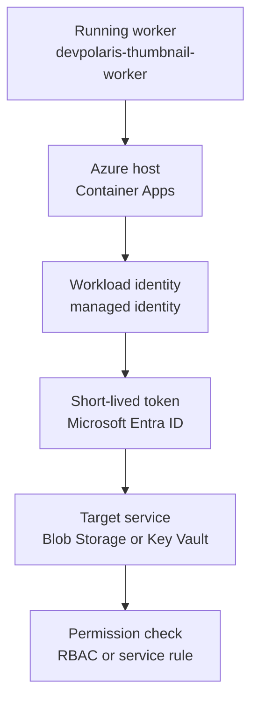

## Table of Contents

1. [The Key You Should Not Ship](#the-key-you-should-not-ship)
2. [The Workload Gets Its Own Identity](#the-workload-gets-its-own-identity)
3. [System-Assigned And User-Assigned Identities](#system-assigned-and-user-assigned-identities)
4. [The Temporary Token Flow](#the-temporary-token-flow)
5. [RBAC Is The Permission, Identity Is The Caller](#rbac-is-the-permission-identity-is-the-caller)
6. [Blob Storage And Key Vault Access](#blob-storage-and-key-vault-access)
7. [Runtime Identity Is Not Pipeline Identity](#runtime-identity-is-not-pipeline-identity)
8. [Identity Lifecycle During Rebuilds](#identity-lifecycle-during-rebuilds)
9. [Evidence From A Working Setup](#evidence-from-a-working-setup)
10. [When Workload Access Fails](#when-workload-access-fails)
11. [A Review Habit Before Release](#a-review-habit-before-release)

## The Key You Should Not Ship

Every backend eventually calls another service. `devpolaris-thumbnail-worker` reads original images from Blob Storage, writes generated thumbnails back to Blob Storage, and reads one image-processing license token from Key Vault. The first version often works by putting a storage key, password, or client secret into an environment variable.

That can be enough for a local demo. In production, the key starts spreading. Someone copies it into a pipeline variable. Someone pastes it into a local `.env` file to debug a bug. A support script prints the environment. An old Container App revision keeps the previous value. Now rotation is no longer a simple change. We have to hunt every copy.

The core problem is ownership. If the worker uses a copied client secret, that secret becomes a second thing we have to protect, rotate, audit, and remove during cleanup. If the secret leaks, Azure cannot tell whether the real workload is calling or someone else copied the credential.

Managed identity gives the workload its own Azure identity. Azure creates and protects the credential material behind that identity. The app asks Azure for short-lived tokens at runtime instead of storing a long-lived credential. The app still needs permission at the target service, but it no longer carries the secret used to prove who it is.

The risky shape looks like this:

```text
Container App: ca-devpolaris-thumbnail-worker-prod
STORAGE_ACCOUNT_KEY=<do-not-store-storage-key-here>
KEY_VAULT_CLIENT_SECRET=<do-not-store-client-secret-here>
INPUT_CONTAINER=raw-images
KEY_VAULT_NAME=kv-devpolaris-media-prod
```

The safer shape keeps identifiers and URLs in config, not secrets:

```text
Container App: ca-devpolaris-thumbnail-worker-prod
INPUT_CONTAINER=raw-images
OUTPUT_CONTAINER=thumbnails
STORAGE_ACCOUNT_URL=https://stdevpolarismediaprod.blob.core.windows.net
KEY_VAULT_URL=https://kv-devpolaris-media-prod.vault.azure.net
AZURE_CLIENT_ID=<managed-identity-client-id>
```

`AZURE_CLIENT_ID` is not a password. It tells the SDK which user-assigned identity to use. The permission still lives in Azure RBAC, and the target service still decides whether the identity can read or write data.

## The Workload Gets Its Own Identity

A managed identity is an Azure-managed identity for code running on Azure. It is a workload identity, which means the identity belongs to software, not to a person. The app uses that identity when it calls Azure services.

Let's make the story concrete. The thumbnail worker starts inside Azure Container Apps. It needs to read an uploaded image from Blob Storage, write the resized image to another container, and fetch a license token from Key Vault. Instead of reading a storage key from app settings, the app asks Azure for a token that represents `mi-devpolaris-thumbnail-worker-prod`.

That token is temporary proof that the request came from the workload identity. It is not broad permission. Blob Storage still checks whether the identity has a data role such as `Storage Blob Data Contributor`. Key Vault still checks whether the identity can read secret values.

This is the non-obvious truth: managed identity solves credential handling, not authorization by itself. It removes the stored password from the app, but we still have to grant the identity the right access at the right scope.

## System-Assigned And User-Assigned Identities

Azure gives us two managed identity lifecycles. The choice is not "secure" versus "insecure." The choice is what owns the identity and what happens when the app is rebuilt.

A system-assigned managed identity belongs to one Azure resource. If we enable it on `ca-devpolaris-thumbnail-worker-prod`, Azure creates an identity tied to that Container App. Only that resource can use it. If we delete the Container App, Azure deletes the identity too.

That feels tidy when one stable app needs one private runtime identity. The evidence path is also straightforward: inspect the Container App, find its principal ID, then inspect role assignments for that principal.

A user-assigned managed identity is its own Azure resource. We create `mi-devpolaris-thumbnail-worker-prod`, grant roles to that identity, and attach it to the Container App. If we delete and recreate the app, we can attach the same identity again. The access contract survives the compute rebuild.

That stability is useful for production platforms, but it has a tradeoff. A user-assigned identity can outlive the app. If no one owns it, it can keep access after the workload disappears. We should tag it, review its roles, and remove it when the app retires.

For the thumbnail worker, we use a user-assigned identity because we want the production access contract to be stable while the worker revisions change often. The identity can be created and reviewed before the app revision rolls out. A smaller app can use a system-assigned identity and still be designed well.

## The Temporary Token Flow

Managed identity feels strange at first because the app settings no longer show the credential. That missing credential is the point. The proof comes from the Azure runtime and Microsoft Entra ID instead of a copied password.



Step by step, the Node app creates a credential object. The Azure SDK asks the Azure runtime for a token for the managed identity. Azure checks that the running Container App can use that identity. Microsoft Entra ID issues a short-lived token. The SDK sends that token to Blob Storage or Key Vault. The target service checks permissions before returning data.

For production, we make the user-assigned identity explicit:

```js
import { ManagedIdentityCredential } from "@azure/identity";
import { BlobServiceClient } from "@azure/storage-blob";
import { SecretClient } from "@azure/keyvault-secrets";

const clientId = process.env.AZURE_CLIENT_ID;
const storageAccountUrl = process.env.STORAGE_ACCOUNT_URL;
const keyVaultUrl = process.env.KEY_VAULT_URL;

if (!clientId || !storageAccountUrl || !keyVaultUrl) {
  throw new Error("Managed identity client ID and service URLs must be configured");
}

const credential = new ManagedIdentityCredential({ clientId });

const blobClient = new BlobServiceClient(storageAccountUrl, credential);
const secretClient = new SecretClient(keyVaultUrl, credential);
```

Notice what the code does not contain. There is no storage account key. There is no Key Vault client secret. There is no developer login. The app has directions and an identity selector, then Azure handles token acquisition at runtime.

For local development, many teams use a separate helper or environment-specific path against non-production resources. That can use developer sign-in. The important point is that a laptop test with Sam's identity does not prove the production managed identity has access.

A good startup check proves the identity path without exposing a token:

```text
thumbnail-worker dependency check
credential=ManagedIdentityCredential
requestedClientId=8a77b7f5-1111-4444-9999-4f2a11111111
storageAccount=stdevpolarismediaprod
keyVault=kv-devpolaris-media-prod
tokenLogged=false
secretValueLogged=false
```

This kind of log helps because managed identity failures often happen before the target service does anything useful. If `requestedClientId` is empty, the SDK may choose a system-assigned identity when we expected a user-assigned identity. If the client ID is correct but the service returns `403`, the next check is RBAC at the target scope.

Keep this evidence close to the release record. When a new revision rolls out, the team should be able to compare the configured client ID, the identity attached to the Container App, and the role assignments on Blob Storage and Key Vault. If those three pieces disagree, the app is using the wrong identity or the identity is missing the right data role.

## RBAC Is The Permission, Identity Is The Caller

Managed identity answers who is calling. RBAC answers what that identity can do at the target. If we mix those up, we end up saying "the app has managed identity" as if that means the app can read everything. It does not.

For `devpolaris-thumbnail-worker`, the runtime identity needs narrow data access. It needs to read uploaded images from one blob container, write thumbnails to another container, and read one license token from Key Vault. It does not need Contributor on the app resource group. It does not need Owner on the subscription. It does not need permission to assign roles.

The access story should sound like this: `mi-devpolaris-thumbnail-worker-prod` can read blob data from `raw-images`, write blob data to `thumbnails`, and read secret values from `kv-devpolaris-media-prod`. That is much clearer than saying "the app has Azure access."

The hidden lesson is that control-plane access and data-plane access are different. Managing a Storage account resource is not the same as reading blobs. Managing a Key Vault resource is not the same as reading secret values. Runtime code usually needs data-plane access, not broad resource-management power.

## Blob Storage And Key Vault Access

Blob Storage and Key Vault make the split visible. The app needs a token for its managed identity, then each service checks whether that identity has a data role at the right scope.

For Blob Storage, the evidence should show a data role, not a management role:

```bash
$ az role assignment list \
  --assignee 9ed1d69b-2222-4555-8888-2c9b22222222 \
  --scope /subscriptions/11111111-2222-3333-4444-555555555555/resourceGroups/rg-devpolaris-media-prod/providers/Microsoft.Storage/storageAccounts/stdevpolarismediaprod/blobServices/default/containers/thumbnails \
  --query "[].{role:roleDefinitionName,scope:scope}" \
  --output table
Role                           Scope
-----------------------------  ------------------------------------------------------------------------------------------------
Storage Blob Data Contributor  /subscriptions/.../containers/thumbnails
```

For Key Vault, the same idea applies. If the vault uses Azure RBAC for data-plane access, the runtime identity needs a role such as `Key Vault Secrets User` scoped to the vault or a suitable narrower boundary.

```bash
$ az role assignment list \
  --assignee 9ed1d69b-2222-4555-8888-2c9b22222222 \
  --scope /subscriptions/11111111-2222-3333-4444-555555555555/resourceGroups/rg-devpolaris-media-prod/providers/Microsoft.KeyVault/vaults/kv-devpolaris-media-prod \
  --query "[].{role:roleDefinitionName,scope:scope}" \
  --output table
Role                    Scope
----------------------  ------------------------------------------------------------------------------------------------
Key Vault Secrets User  /subscriptions/.../vaults/kv-devpolaris-media-prod
```

The evidence should prove access without revealing data. We can show the vault name, secret name, managed identity client ID, and role scope. We should not show the secret value, token, storage key, or connection string.

## Runtime Identity Is Not Pipeline Identity

The deployment pipeline and the running app are different actors. The pipeline builds an image, pushes it to the registry, and updates the Container App revision. The running app serves traffic, reads dependencies, and writes app-owned data.

If both actors share one identity, we lose clarity. Runtime code might inherit deployment power. The pipeline might inherit data access. Audit logs no longer tell us which part of the system acted. During an incident, that confusion costs time.

The release record should show the split:

```text
Release: thumbnail-worker-prod-2026.05.10.3
Pipeline identity: sp-devpolaris-media-ci
Runtime identity attached: mi-devpolaris-thumbnail-worker-prod
Runtime can read: raw image blobs and Key Vault license token
Runtime can write: thumbnail blobs
Runtime should not have: Contributor on resource group, Owner on subscription
```

Notice how the "should not have" line is part of the design. We are not only proving the app can work. We are proving the app cannot do unrelated production work.

## Identity Lifecycle During Rebuilds

Identity lifecycle becomes interesting when we rebuild infrastructure. An app name can stay the same while the underlying identity changes. An identity can also survive after an app disappears. Both cases matter for access reviews.

With a system-assigned identity, deleting and recreating the Container App creates a new principal. Old role assignments point at the old principal, so the new app may fail even though the app name looks familiar. The fix is to inspect the new principal ID and update assignments deliberately.

With a user-assigned identity, the identity is separate from the app. We can recreate the Container App and attach the same identity. That keeps RBAC stable, which is useful in production. The tradeoff is cleanup: if the app retires and the identity remains, the identity can keep its roles.

For the thumbnail worker, a useful inventory row looks like this:

```text
Identity resource: mi-devpolaris-thumbnail-worker-prod
Client ID: 8a77b7f5-1111-4444-9999-4f2a11111111
Principal ID: 9ed1d69b-2222-4555-8888-2c9b22222222
Attached workload: ca-devpolaris-thumbnail-worker-prod
Owner: media platform team
Expected roles: Blob data contributor, Key Vault secrets user
```

The client ID and principal ID have different jobs. The client ID helps the SDK choose the user-assigned identity. The principal ID is often what role assignment commands use as the assignee. Mixing them up is a common source of confusing failures.

## Evidence From A Working Setup

A working managed identity setup should leave evidence at three layers. First, the Container App should show the identity attached. Second, Azure RBAC should show the expected roles for the identity. Third, the app should log that it used the expected identity without printing sensitive values.

```bash
$ az containerapp identity show \
  --name ca-devpolaris-thumbnail-worker-prod \
  --resource-group rg-devpolaris-media-prod \
  --query "{type:type,userAssigned:userAssignedIdentities}" \
  --output json
{
  "type": "UserAssigned",
  "userAssigned": {
    "/subscriptions/11111111-2222-3333-4444-555555555555/resourceGroups/rg-devpolaris-media-prod/providers/Microsoft.ManagedIdentity/userAssignedIdentities/mi-devpolaris-thumbnail-worker-prod": {
      "clientId": "8a77b7f5-1111-4444-9999-4f2a11111111",
      "principalId": "9ed1d69b-2222-4555-8888-2c9b22222222"
    }
  }
}
```

The top-level type tells us this app uses a user-assigned identity. The nested `clientId` is what our app config should select. The `principalId` is what we inspect for role assignments.

The app log then proves runtime behavior:

```text
thumbnail-worker startup revision=thumbnail-worker--7m9vp5
credential=ManagedIdentityCredential
managedIdentityClientId=8a77b7f5-1111-4444-9999-4f2a11111111
keyVault=kv-devpolaris-media-prod
inputContainer=raw-images
outputContainer=thumbnails
secretValueLogged=false
startupDependencyCheck=passed
```

That log gives us useful evidence without leaking the secret. If the release fails later, we can compare the logged client ID with the identity assignment and RBAC records.

## When Workload Access Fails

Managed identity failures become easier when we separate the layers. If the app cannot get a token, the identity may not be attached or the client ID may be wrong. If the app gets a token but Blob Storage returns `AuthorizationPermissionMismatch`, the identity exists but lacks the needed blob data role. If Key Vault returns `Forbidden`, the vault access model, data role, or scope may be wrong.

Here is a realistic storage failure:

```text
thumbnail-worker error Blob upload failed
status=403
code=AuthorizationPermissionMismatch
identityClientId=8a77b7f5-1111-4444-9999-4f2a11111111
storageAccount=stdevpolarismediaprod
container=thumbnails
```

This points us to the blob data role and scope. It does not tell us to add a storage account key to app settings. That would make the symptom disappear while reintroducing the credential problem managed identity was meant to remove.

Local development can create false confidence. A developer may test with `DefaultAzureCredential` and succeed because their own account has access to a development vault. Production still fails because the Container App's managed identity lacks access to the production vault. The fix is to test the production runtime identity, or at least log and verify the identity selected in Azure.

## A Review Habit Before Release

Before a release, let's review managed identity like we review code. Which workload identity will the app use? Which client ID does the code select? Which target services will it call? Which data roles exist at which scopes? Which permissions are deliberately absent?

For `devpolaris-thumbnail-worker`, a healthy answer sounds like this: the production Container App attaches `mi-devpolaris-thumbnail-worker-prod`, the Node code selects that identity with `AZURE_CLIENT_ID`, the identity can read raw image blobs, write thumbnail blobs, read Key Vault secrets, and cannot deploy the app or assign roles.

If the app needs new access, we should add the narrow role and update the release evidence. If the app no longer needs access, we should remove the role. Managed identity makes credential handling simpler, but access still needs ownership.

The mental shift is the real win. We stop asking, "Where did we copy the secret?" and start asking, "Which workload identity has which access, and can we prove it?" That second question is easier to operate safely.

---

**References**

- [Managed identities for Azure resources](https://learn.microsoft.com/en-us/entra/identity/managed-identities-azure-resources/overview) - Used for managed identity types, lifecycle behavior, and token-based access without stored credentials.
- [Managed identities in Azure Container Apps](https://learn.microsoft.com/en-us/azure/container-apps/managed-identity) - Used for Container Apps identity attachment and evidence patterns.
- [ManagedIdentityCredential class](https://learn.microsoft.com/en-us/javascript/api/@azure/identity/managedidentitycredential?view=azure-node-latest) - Used for the JavaScript credential pattern and user-assigned identity client ID selection.
- [Authenticate Azure-hosted JavaScript apps using a user-assigned managed identity](https://learn.microsoft.com/en-us/azure/developer/javascript/sdk/authentication/user-assigned-managed-identity) - Used for the JavaScript SDK example with `AZURE_CLIENT_ID`.
- [Provide access to Key Vault keys, certificates, and secrets with Azure RBAC](https://learn.microsoft.com/en-us/azure/key-vault/general/rbac-guide) - Used for Key Vault data-plane RBAC role guidance.
- [Authorize access to blobs using Microsoft Entra ID](https://learn.microsoft.com/en-us/azure/storage/common/storage-auth-aad-app) - Used for Blob Storage data access through Microsoft Entra ID and storage data roles.
