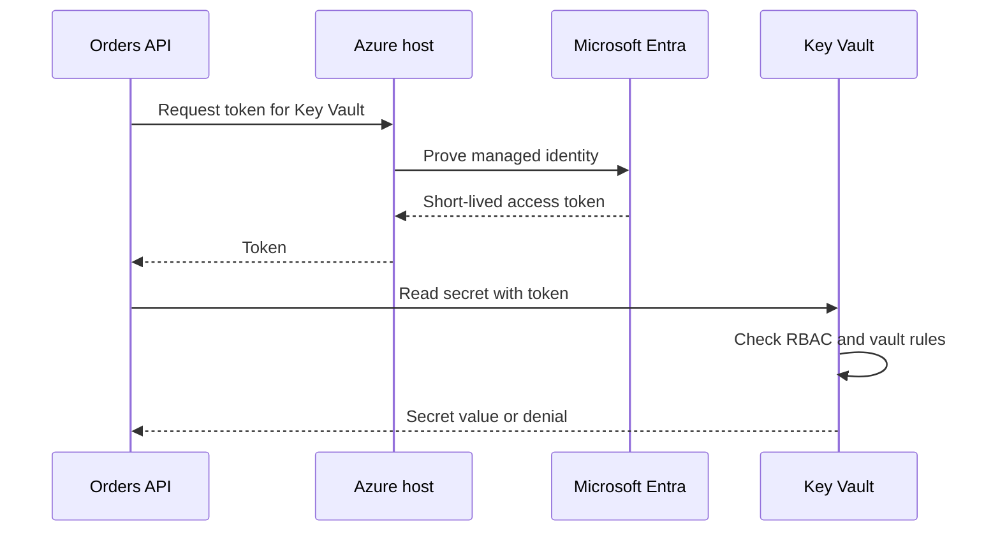

## Table of Contents

1. [The Problem](#the-problem)
2. [Workload Identity](#workload-identity)
3. [Managed Identities](#managed-identities)
4. [System-Assigned](#system-assigned)
5. [User-Assigned](#user-assigned)
6. [Token Flow](#token-flow)
7. [RBAC Still Grants Permission](#rbac-still-grants-permission)
8. [Runtime Identity vs Pipeline Identity](#runtime-identity-vs-pipeline-identity)
9. [Failure Evidence](#failure-evidence)
10. [Putting It All Together](#putting-it-all-together)
11. [What's Next](#whats-next)

## The Problem

The orders API needs to read a database password from Key Vault and write order export files to Blob Storage. The first version often works by putting a client secret, storage key, or connection string into an app setting.

That works until the secret spreads:

- A developer copies the value into a local `.env` file to debug production behavior.
- A pipeline variable keeps the old value after rotation.
- An old app revision still has the previous secret in its environment.
- A support script prints configuration while collecting evidence.

Now rotation is not one change. It is a hunt.

Managed identities solve the credential-handling part of this problem. Instead of storing a long-lived credential in the app, the Azure-hosted workload gets its own identity. The app asks Azure for short-lived tokens at runtime. Azure protects the credential material behind that identity.

The app still needs authorization at the target service. Managed identity tells Azure who the app is. Azure RBAC still decides what that identity may do.

## Workload Identity

A workload identity is an identity used by software rather than a person. In Azure, the workload might be an App Service app, a Function App, a virtual machine, a Container App, an AKS workload using workload identity, or another supported Azure resource.

The useful shift is this: the running app should not borrow a human identity, a broad deployment identity, or a copied service principal secret. It should have a runtime identity that matches its runtime job.

For the orders API, that job is narrow:

| Runtime behavior | Target service | Permission shape |
| --- | --- | --- |
| Read the database password | Key Vault | Secret read for the orders vault |
| Write export files | Blob Storage | Blob write for the orders exports container |
| Send logs | Azure Monitor path | Telemetry write through the configured platform path |

Those are runtime permissions. They are not the same as deploying infrastructure, creating role assignments, or changing App Service settings. A clean design gives the app one identity for running and the pipeline another identity for deploying.

## Managed Identities

A managed identity is a Microsoft Entra identity that Azure creates and manages for an Azure resource. Azure handles the underlying credential, token issuance, and integration with the hosting platform.

From the app's point of view, the flow is simple. The app uses an Azure SDK or token endpoint to ask for a token for a target service. Azure returns a short-lived token that represents the managed identity. The app presents that token to the service it is calling.

From the service's point of view, this is still a normal access request:

```text
principal: mi-devpolaris-orders-api-prod
action:    read secret value
target:    kv-orders-prod/secrets/orders-db-password
decision:  allow or deny
```

The important truth is that managed identity removes a stored credential from the app. It does not remove the need for least privilege. If the identity has no role assignment, the app gets a token and is still denied. If the identity has too broad a role assignment, the app may be able to do far more than its code needs.

## System-Assigned

A system-assigned managed identity belongs to one Azure resource. If you enable it on `app-orders-prod`, Azure creates an identity tied to that app. Only that resource can use it. If you delete the app, Azure deletes the identity.

That lifecycle is tidy when one stable resource needs one private runtime identity. The access evidence is also easy to follow: inspect the app, find its principal ID, then inspect role assignments for that principal.

System-assigned identities are a good fit for simple services where the resource lifecycle and identity lifecycle should be the same. If a throwaway development app is deleted, its identity and access should disappear with it.

The tradeoff appears when you rebuild or replace resources. If the identity is deleted with the old app, the new app gets a different principal ID. Any role assignment that pointed at the old principal must be recreated for the new one.

## User-Assigned

A user-assigned managed identity is its own Azure resource. You create the identity, grant roles to it, and attach it to one or more supported Azure resources.

For production, that separate lifecycle can be useful. Suppose the platform team creates `mi-devpolaris-orders-api-prod`, grants it Key Vault and Blob Storage access, then attaches it to the production App Service. If the app is rebuilt, moved through deployment slots, or recreated as part of a controlled migration, the same identity can be attached again.

The tradeoff is cleanup. A user-assigned identity can outlive the workload that used it. If nobody owns it, it can keep access after the app retires. Treat it like any other security resource: tag it, review its role assignments, and remove it when the workload is gone.

For the orders API, a user-assigned identity makes the access contract stable:

```text
identity: mi-devpolaris-orders-api-prod
used by:  app-orders-prod
roles:
  - Key Vault Secrets User on kv-orders-prod
  - Storage Blob Data Contributor on stordersprod/export container scope
```

The identity is now a named part of the architecture, not an invisible side effect of one app instance.

## Token Flow

Managed identity is easiest to understand as a token flow.



The app never needs to know a client secret for its own identity. It receives a token for the service it wants to call. The token expires. The SDK can request another token when needed.

This is different from putting a service principal client secret in app settings. A copied client secret can be reused from somewhere else until it expires or is revoked. A managed identity token flow is tied to the Azure resource that is allowed to request tokens for that identity.

When a resource has more than one user-assigned identity, the app often needs to specify which one it wants. In SDKs, that usually means providing the managed identity client ID. The client ID is an identifier, not a password.

## RBAC Still Grants Permission

Managed identity answers who the app is. Azure RBAC answers what that identity may do.

For Key Vault, the app might need a data role that lets it read secret values. For Blob Storage, it might need a data role that lets it write blobs. Those are separate permissions on separate targets. Giving the app a managed identity does not automatically grant either one.

The access shape should be explicit:

| Identity | Role | Scope |
| --- | --- | --- |
| `mi-devpolaris-orders-api-prod` | Key Vault Secrets User | `kv-orders-prod` |
| `mi-devpolaris-orders-api-prod` | Storage Blob Data Contributor | Orders export container or storage account scope |

The Key Vault role should not be replaced with subscription Contributor just because the app fails to read a secret. The failure means one request was denied. Read the principal, action, and scope before widening access.

## Runtime Identity vs Pipeline Identity

Deployment and runtime are different jobs.

The pipeline may need to publish code, update app settings, attach a managed identity, or deploy infrastructure. The running app may need to read one secret and write one blob prefix. If the same principal does both jobs, evidence becomes muddy and access tends to grow.

Keep the split visible:

| Job | Example identity | Should be able to |
| --- | --- | --- |
| Deploy | `sp-devpolaris-orders-deploy` | Update the app and infrastructure it owns. |
| Run | `mi-devpolaris-orders-api-prod` | Call Key Vault and Storage at runtime. |
| Support | `grp-prod-support-readers` | Inspect logs and safe metadata. |

This split changes debugging. If deployment succeeds but startup fails, inspect the runtime identity. If the app runs but a deployment cannot attach the identity, inspect the pipeline identity. If a human can read a vault from the portal, that says nothing about the runtime identity unless the same principal is involved.

## Failure Evidence

A managed identity failure usually hides in one of four places:

| Symptom | Likely question |
| --- | --- |
| App cannot get a token | Is managed identity enabled or attached to the resource? |
| App gets a token but service denies access | Does the identity have the right RBAC role at the right scope? |
| App uses the wrong identity | Did the SDK choose the intended user-assigned identity? |
| Recreated app lost access | Was a system-assigned identity replaced with a new principal ID? |

Good evidence names the runtime principal, not just the app:

```text
Workload: app-orders-prod
Identity: mi-devpolaris-orders-api-prod
Client ID: 1d6d5d2d-25d8-4d4a-92a0-d58df00f55e1
Object ID: 5f1f64a4-0a2c-4f3c-91f4-3b9e68b9f6d1
Target: kv-orders-prod/secrets/orders-db-password
Role: Key Vault Secrets User
Scope: kv-orders-prod
```

That record is enough to review the path without printing the secret. It also tells the next engineer where to look when the app fails.

## Putting It All Together

Return to the original problem. The risky version put a long-lived secret in app settings so the app could prove who it was. That created copies, rotation pain, and weak evidence.

The managed identity version changes the shape:

- The running app has its own Microsoft Entra identity.
- Azure manages the credential material behind that identity.
- The app requests short-lived tokens at runtime.
- The target service still checks Azure RBAC and service rules.
- Runtime identity stays separate from deployment identity.
- Evidence names the identity, role, scope, and target without leaking values.

Managed identities do not make authorization automatic. They make the caller clean. Once the caller is clean, Azure RBAC can stay narrow.

## What's Next

The app now has a safe way to identify itself. The next question is where dangerous values should live and how the app should read them without turning reviews into secret exposure. That is Key Vault.

---

**References**

- [What are managed identities for Azure resources?](https://learn.microsoft.com/en-us/entra/identity/managed-identities-azure-resources/overview)
- [What is Azure role-based access control?](https://learn.microsoft.com/en-us/azure/role-based-access-control/overview)
- [Understand Azure role assignments](https://learn.microsoft.com/en-us/azure/role-based-access-control/role-assignments)
