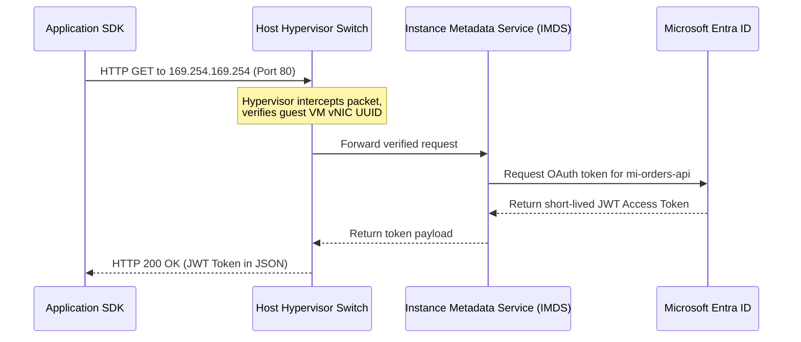
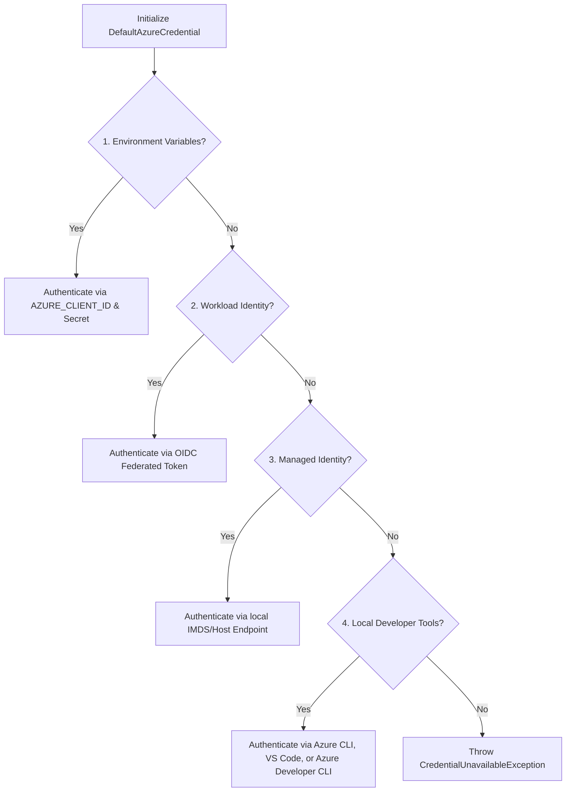

## Table of Contents

1. [Workload Access: The Passwordless Principle](#workload-access-the-passwordless-principle)
2. [Confronting the Bootstrap Credentials Paradox](#confronting-the-bootstrap-credentials-paradox)
3. [Workload Identity vs. User Identity](#workload-identity-vs-user-identity)
4. [Managed Identities: Centralized Platform Credentials](#managed-identities-centralized-platform-credentials)
5. [System-Assigned: Resource Bound Lifecycle](#system-assigned-resource-bound-lifecycle)
6. [User-Assigned: Standalone Architecture](#user-assigned-standalone-architecture)
7. [Under the Hood: The IMDS Local Loopback and Token Handshake](#under-the-hood-the-imds-local-loopback-and-token-handshake)
8. [SDK Authentication: Tracing DefaultAzureCredential Fallbacks](#sdk-authentication-tracing-defaultazurecredential-fallbacks)
9. [Runnable Node.js SDK Passwordless Code Example](#runnable-nodejs-sdk-passwordless-code-example)
10. [Hands-On Token Retrieval and JWT Claims Inspection](#hands-on-token-retrieval-and-jwt-claims-inspection)
11. [RBAC Authorization: The Active Permission Binding](#rbac-authorization-the-active-permission-binding)
12. [Operational Isolation: Runtime vs. Pipeline Separation](#operational-isolation-runtime-vs-pipeline-separation)
13. [Putting It All Together](#putting-it-all-together)
14. [What's Next](#whats-next)

## Workload Access: The Passwordless Principle

A managed identity is an Azure-managed identity for running software. It gives an Azure resource, such as a VM, Web App, Function App, or Container App, a Microsoft Entra identity without giving your code a stored password.

Example: `app-orders-prod` can use its managed identity to ask Key Vault for `db-orders-password`, and Key Vault can decide access from that app's Object ID instead of from a copied client secret.

It allows an Azure-hosted compute service to authenticate to other Azure resources without storing passwords, client secrets, or access keys.
To understand the architectural necessity of managed identities, you must confront the bootstrap credentials paradox.

The bootstrap credentials paradox is the first-secret problem: a workload needs one credential to reach the vault that stores its other credentials.
Also known as the first secret problem, the bootstrap paradox outlines a fundamental circular dependency in application security.
Suppose you decide to secure your production database password by storing it inside a highly protected central vault.
Your application code and deployment files no longer contain the raw database password.
However, when your application container boots up and needs to connect to the database, it must first call the vault's API.

To call the vault, your application must prove its own identity to the key vault controller.
If you use traditional credential-based authentication, you must provide your application with a Client Secret or an API key.
This leads to the paradox: where do you store that first client secret.

If you write it into your application configuration files, your Git repository holds a plaintext credential.
If you pass it in as an environment variable during deployment, your CI/CD pipeline logs and host hypervisor environments contain a secret key.
If the client secret is ever compromised, an attacker can use it from any computer in the world to sign in to your vault and download every production credential you own.

Managed identities solve the bootstrap credentials paradox by eliminating the stored secret entirely.
Instead of storing a long-lived credential inside the application, the Azure-hosted compute resource is associated with a Microsoft Entra service principal.
The hosting platform uses this service principal to request short-lived tokens on the workload's behalf.
The application code never handles a password, client secret, or private certificate key.

The runtime SDK requests short-lived authentication tokens locally from the host, and the Azure platform handles all credential material under the hood.
This removes the danger of credential leakage from your application configurations.

## Confronting the Bootstrap Credentials Paradox

The bootstrap credentials paradox is the first-secret problem: software needs a credential to reach the system that stores credentials. Managed identities solve that loop by letting Azure issue the first proof locally to the resource.

Example: instead of storing `AZURE_CLIENT_SECRET` in a Container App setting, the app asks its host for a short-lived token for `https://vault.azure.net`.

To secure credentials at scale, we must transition away from static configurations.
We contrast the security posture of traditional connection keys with passwordless managed identities below:

| Security Vector | Traditional Connection Keys | Passwordless Managed Identities |
| :--- | :--- | :--- |
| **Credential Storage** | Plaintext files, environment parameters, or Git logs. | No credentials stored on disk or in environment memory. |
| **Rotation Lifecycles** | Manual operations, requiring application restarts and code syncs. | Automated, short-lived token rotation managed by the platform. |
| **Compromise Boundary** | Universal access; stolen keys can be used from any network endpoint globally. | Local containment; tokens are restricted to the active Azure resource compute. |
| **Audit Capabilities** | Shared account logs, making individual server tracking ambiguous. | Highly granular logging tied directly to the specific service principal. |

## Workload Identity vs. User Identity

A workload identity is an account-like identity designed for software processes rather than human users.
This includes active microservices, scheduled background tasks, and automated deployment runners.
Workload identities are structurally distinct from human user accounts.

In local development, engineers are accustomed to running applications using their own personal developer identities.
However, running a production workload under a human user account, or sharing a broad administrative deployment credential, introduces severe security risks:

*   **Principal Creep**: If a microservice shares a developer's identity, the microservice automatically inherits the developer's broad permissions, violating the principle of least privilege.
*   **Audit Ambiguity**: If an incident occurs and a database table is wiped, the audit logs will record the action under the developer's name, making it impossible to distinguish between a manual human error and a runtime application bug.
*   **Rotation Pain**: If the developer leaves the company or changes their password, the production microservice will immediately suffer authentication failures and crash.

A secure cloud architecture treats the running application as an independent principal with its own dedicated workload identity attached strictly to its runtime job:

```plain
Orders Service Container ──> mi-orders-api-prod (User-Assigned Identity) ──> Key Vault Secrets User
Payments Worker VM       ──> mi-payments-worker (System-Assigned Identity) ──> Storage Blob Contributor
```

By separating these identities, you enforce granular operational isolation.
If the payments worker is compromised, the attacker cannot read secrets from the orders vault.
This is because the payments worker's security token is completely blind to the orders envelope.

## Managed Identities: Centralized Platform Credentials

A managed identity is a specialized Microsoft Entra service principal attached directly to the lifecycle or configuration of an Azure resource.
The core value of this design is that the credential material is managed entirely by Azure.
When you enable a managed identity on a compute resource, Azure creates a service principal row in your Microsoft Entra directory database.

However, unlike a standard service principal, Entra ID does not generate a client secret string or certificate file for you to copy.
Azure manages the credential material and token issuance path for the identity so your application never stores the secret.
From the application's perspective, the token flow is completely hands-off.

The application code utilizes standard Azure SDK libraries.
At runtime, the SDK automatically detects the Azure hosting environment, contacts the managed identity endpoint for that host type, and retrieves a short-lived access token.
The SDK handles token caching and refresh behavior, keeping application code clean and free of credential-handling logic.


*The important boundary is local: the app asks the host for temporary proof instead of carrying a reusable client secret.*

## System-Assigned: Resource Bound Lifecycle

A system-assigned managed identity is a one-resource identity whose lifecycle is tied to exactly one Azure resource instance.

Example: if `func-receipts-prod` has a system-assigned identity, deleting that Function App also deletes the identity record. That tight lifecycle is useful when the identity should never outlive the resource.

```plain
Compute Resource (app-orders-prod) <─── Tied 1:1 ───> System Identity (mi-app-orders-prod)
```

When you enable a system-assigned identity on an App Service (e.g. `app-orders-prod`), the ARM engine contacts Microsoft Entra ID.
It provisions a service principal attached directly to the App Service's specific Resource ID.
If you delete the App Service, Azure deletes the system-assigned identity because its lifecycle is tied to that resource.

If you recreate the App Service, the new resource gets a new principal ID.
Role assignments that referenced the old principal become stale, because the old principal ID is permanently deleted.
The platform does not automatically transfer permissions to the new identity simply because it shares the resource name.

*   **Pros**: Tidy and automated. There are no standalone identity resources to manage, clean up, or track. It is a perfect fit for singleton workloads where the resource lifecycle and identity lifecycle are identical.
*   **Cons**: Rebuild volatility. If you delete and recreate your App Service (a common occurrence during controlled platform migrations or stack updates), Entra ID generates a brand-new Object ID for the new system-assigned identity. Even though the App Service name remains unchanged, the old principal ID is gone. You must recreate every role assignment for the new Object ID, which can cause startup failures if your deployment pipeline does not automate this step.

## User-Assigned: Standalone Architecture

A user-assigned managed identity is a standalone identity resource that you create independently and attach to one or more compute hosts.
It is a standalone Azure resource created and managed independently of the compute resources that use it.

```plain
Standalone Identity Resource (mi-orders-api-prod)
  ├── Attached to compute: app-orders-prod-slot-a
  ├── Attached to compute: app-orders-prod-slot-b
  └── Persistent lifecycle independent of compute resources
```

Because the user-assigned identity exists as its own resource, its lifecycle is decoupled from the compute resources.
You create the identity once, assign the required RBAC roles to its Object ID, and then attach it to one or more supported compute hosts.
If the compute host is deleted, rebuilt, or migrated across slots, the user-assigned identity remains untouched in the directory.
The newly provisioned compute host simply binds to the existing identity, inheriting the existing role assignments instantly without any principal ID shifts.

*   **Pros**: Stable, reusable, and predictable. Ideal for multi-node deployments, blue-green deployment slots, and GitOps pipelines where permissions must remain active across rolling compute swaps.
*   **Cons**: Administrative cleanup overhead. Deleting a compute host does not delete a user-assigned identity. If your platform team does not actively audit Entra service principals, retired user-assigned identities can linger in the directory, retaining access indefinitely. You must tag these resources and clean them up when their workloads are retired.

## Under the Hood: The IMDS Local Loopback and Token Handshake

The Instance Metadata Service (IMDS) is Azure's local metadata and token endpoint for a running compute host.
For a VM, IMDS is the local HTTP endpoint the workload calls to request a token without storing a secret.

Example: code running on `vm-orders-worker` can call `http://169.254.169.254` with the `Metadata: true` header and request a token for `https://vault.azure.net`.

Understanding how a passwordless workload obtains a secure token requires looking beneath the high-level SDK interfaces at hypervisor packet interception and local metadata exchanges.
When an application running on an Azure Virtual Machine requests a token, the local guest OS routes the request to a non-routable link-local IP address: `169.254.169.254`.
This endpoint hosts the Instance Metadata Service (IMDS).



The execution flow of this local token handshake follows a highly secure sequence:

First, the application issues an HTTP `GET` request targeting the IMDS token endpoint on port 80.
The request must include a mandatory HTTP header: `Metadata: true`.
Without this header, the service rejects the request immediately, protecting the host from Server-Side Request Forgery (SSRF) attacks from basic browser page loads.

Second, the physical host hypervisor switch intercepts the IP packet.
Because `169.254.169.254` is non-routable over the internet, the packet never leaves the physical server blade.
The hypervisor verifies the source MAC address and guest VM virtual network interface card (vNIC) hardware UUID against the ARM control plane database, confirming the physical identity of the VM.

Third, the IMDS service receives the verified request.
It contacts Microsoft Entra ID over a secure backbone network channel, authenticating as the managed identity registered for that VM, and requests an access token for the targeted resource scope (such as `https://vault.azure.net`).

Fourth, Microsoft Entra ID generates a short-lived JSON Web Token (JWT) signed using Entra's private keys.
It returns this JWT bearer token to the IMDS endpoint.

Fifth, IMDS routes the token back through the hypervisor switch to the guest OS VM memory, where the Azure SDK caches the token locally to serve subsequent requests without incurring Entra round trips.

## SDK Authentication: Tracing DefaultAzureCredential Fallbacks

DefaultAzureCredential is the Azure SDK helper that tries common authentication sources in order until one returns a token. It exists so the same code can run on a developer laptop, VM, App Service, Container Apps, or AKS without hardcoding a different login path for each host.

Example: locally it may use your `az login` session, while in production it can use the managed identity attached to `ca-orders-api-prod`.

To connect your application to Azure services, the Azure Identity SDK provides the `DefaultAzureCredential` class.
This class acts as a unified authentication facade.
It dynamically resolves the active host environment credentials at startup without requiring code modifications.

When initialized, the SDK attempts to acquire a token by sequentially evaluating the following seven authentication mechanisms in order:



1.  **Environment Variables**: The SDK checks if `AZURE_CLIENT_ID`, `AZURE_TENANT_ID`, and `AZURE_CLIENT_SECRET` (or `AZURE_SHARED_KEY`) are present in the environment variables.
2.  **Workload Identity**: If running in a federated environment (such as Azure Kubernetes Service with OIDC federation active), the SDK checks for `AZURE_FEDERATED_TOKEN_FILE` and `AZURE_AUTHORITY_HOST`.
3.  **Managed Identity**: The SDK attempts to contact the host-specific managed identity endpoints (IMDS for VMs, or platform-specific local endpoints for App Services and Container Apps) using the environment's assigned client ID.
4.  **Azure CLI**: The SDK attempts to invoke the local `az account get-access-token` command to fetch a token from the developer's cached CLI session.
5.  **Azure Developer CLI**: The SDK attempts to query the active developer context via `azd auth get-access-token`.
6.  **VS Code Credentials**: The SDK checks for active developer login credentials inside the local Visual Studio Code environment configuration.
7.  **PowerShell Session**: The SDK attempts to query an active local `Az` PowerShell module session.

If all seven fallback validation gates are exhausted without acquiring a token, the SDK throws a `CredentialUnavailableException` error, blocking access.

## Runnable Node.js SDK Passwordless Code Example

To implement passwordless authentication inside our container workloads, we configure our client integrations to use the default identity token path.
The Node.js script below demonstrates a complete, comment-free setup querying a Key Vault secret using managed identities.

```javascript
import { SecretClient } from "@azure/keyvault-secrets";
import { DefaultAzureCredential } from "@azure/identity";

const vaultName = "kv-ecommerce-prod";
const url = `https://${vaultName}.vault.azure.net`;

const credential = new DefaultAzureCredential();

const client = new SecretClient(url, credential);

async function getDatabasePassword() {
  const secretName = "db-ecommerce-password";
  const result = await client.getSecret(secretName);
  return result.value;
}

getDatabasePassword()
  .then(password => {
    console.log("Database connection established.");
  })
  .catch(err => {
    console.error("Authentication failed:", err.message);
  });
```

## Hands-On Token Retrieval and JWT Claims Inspection

To verify your managed identity configuration directly from the command line, you can execute a terminal session inside a running virtual machine.
In this hands-on guide, we query the IMDS endpoint using `curl` to fetch a raw token, then parse the JWT metadata properties.

First, we log into our target virtual machine and execute an HTTP `GET` query to fetch a token for the Azure Key Vault resource plane.

```bash
curl -s -H "Metadata: true" \
  "http://169.254.169.254/metadata/identity/oauth2/token?api-version=2018-02-01&resource=https://vault.azure.net"
```

The IMDS endpoint returns a JSON payload containing the bearer token details:

```json
{
  "access_token": "eyJ0eXAiOiJKV1QiLCJhbGciOiJSUzI1NiIsIng1dCI6Im...",
  "expires_in": "42300",
  "expires_on": "1780199999",
  "not_before": "1780157699",
  "resource": "https://vault.azure.net",
  "token_type": "Bearer"
}
```

Next, we extract the `access_token` string and decode the JSON Web Token using a standard CLI command or script.
The token contains the following directory claims:

```json
{
  "aud": "https://vault.azure.net",
  "iss": "https://sts.windows.net/88888888-4444-4444-4444-121212121212/",
  "iat": 1780157699,
  "nbf": 1780157699,
  "exp": 1780199999,
  "oid": "5f1f64a4-0a2c-4f3c-91f4-3b9e68b9f6d1",
  "sub": "5f1f64a4-0a2c-4f3c-91f4-3b9e68b9f6d1",
  "tid": "88888888-4444-4444-4444-121212121212",
  "appid": "1d6d5d2d-25d8-4d4a-92a0-d58df00f55e1",
  "xms_mirid": "/subscriptions/.../resourceGroups/rg-ecommerce-prod/providers/Microsoft.ManagedIdentity/userAssignedIdentities/mi-ecommerce-prod"
}
```

Analyzing these claims provides clear technical evidence of security verification:

*   **`aud` (Audience)**: Confirms this token is restricted strictly to Key Vault. It cannot be used to authenticate to Storage or Azure SQL databases.
*   **`oid` (Object ID)**: Represents the unique service principal ID of our managed identity. This is the coordinate checked by the Key Vault RBAC authorization engine.
*   **`appid` (Application ID)**: Represents the logical application registration blueprint associated with the identity.
*   **`xms_mirid`**: The absolute resource ID of the managed identity in the subscription. It confirms that the VM holds the correct user-assigned identity.

## RBAC Authorization: The Active Permission Binding

A managed identity only proves who the workload is. It does not grant access by itself.

Example: `mi-orders-api-prod` can exist in Entra ID and still receive `403 Forbidden` from Key Vault until someone assigns `Key Vault Secrets User` at the vault or secret scope.

A newly created managed identity holds zero access.
If your application attempts to read a Key Vault secret or write a blob immediately after enabling the identity, the target service will reject the request with a `403 Forbidden` error.

You must explicitly create a role assignment that binds the identity's Object ID to a specific role definition at the target scope.
The table below maps the required production permission coordinates for our e-commerce microservices:

| Managed Identity Object ID | Assigned RBAC Role | Scope Target URI |
| :--- | :--- | :--- |
| `5f1f64a4-0a2c-4f3c-91f4-3b9e68b9f6d1` | `Key Vault Secrets User` | `/subscriptions/.../resourceGroups/rg-ecommerce-prod/providers/Microsoft.KeyVault/vaults/kv-ecommerce-prod` |
| `5f1f64a4-0a2c-4f3c-91f4-3b9e68b9f6d1` | `Storage Blob Data Contributor` | `/subscriptions/.../resourceGroups/rg-ecommerce-prod/providers/Microsoft.Storage/storageAccounts/saecommercefiles/blobServices/default/containers/exports` |

This explicit binding guarantees that even if an attacker compromises the container app's code, they are locked within these exact data-plane limits.
They cannot delete the vault, scale the database, or list files in other storage accounts, keeping the production blast radius extremely tight.

## Operational Isolation: Runtime vs. Pipeline Separation

A critical security practice is the strict separation of Runtime Identities from Pipeline Deployment Identities.
In immature cloud architectures, deployment pipelines (like GitHub Actions or GitLab runners) often deploy applications using the same identity that runs the code.
Alternatively, developers are tempted to grant their runtime managed identity administrative roles (like `Contributor` or `Owner`) to make deployment headaches disappear.

This violates operational isolation.
The deployment pipeline requires management plane access to provision databases, modify firewalls, and update virtual networks.
The runtime application requires data plane access to read database rows, fetch secrets, and write transaction logs.

```plain
Pipeline Deployment Identity (sp-ecommerce-deploy) ──> Management Plane (Bicep updates, VM scale-up)
Runtime Workload Identity     (mi-ecommerce-prod)   ──> Data Plane (Read vault secret, query orders table)
```

By separating these roles, you ensure that the running application can never modify the infrastructure it resides in.
The managed identity has zero management plane permissions.
It cannot change firewalls, delete subnets, or provision new virtual machines.

Conversely, the deployment pipeline has control-plane access but lacks data-plane access.
It can provision the Key Vault but cannot read the sensitive database passwords stored inside it.
This division protects your business from internal configuration drift and external software supply chain attacks.

## Putting It All Together

Operating a secure, passwordless workload requires transitioning from static credentials to dynamic token-based metadata flows.

*   **Solve the Bootstrap Paradox**: Leverage managed identities to eliminate long-lived passwords and client secrets from code, configurations, and logs.
*   **Decouple Lifecycles with User-Assigned**: Prefer user-assigned managed identities for production to guarantee stable Object IDs across slots and platform migrations.
*   **Audit Token Acquisition**: Recognize that Virtual Machines use IMDS, while App Service, Functions, and Container Apps expose managed identity through their own local endpoint contracts.
*   **Enforce Strict Least Privilege**: Enabling an identity grants zero access; always cable explicit, resource-scoped role assignments to the principal's Object ID.
*   **Isolate Runtime from Deployment**: Keep management-plane deployment pipelines completely separate from data-plane application runtimes.

## What's Next

We have established how our application securely proves its identity at runtime without passwords.
Now we are ready to examine the secure boundary where our sensitive passwords, cryptographic keys, and certificates reside.
In the next article, we will go deep into Azure Key Vault.
We will contrast secrets, keys, and certificates, evaluate access control architectures, and examine soft-delete and purge protection mechanisms.


*Use this checklist before shipping a workload identity: remove stored secrets, bind the platform identity narrowly, and keep runtime access separate from deployment power.*

---

**References**

* [Managed Identities for Azure Resources](https://learn.microsoft.com/en-us/entra/identity/managed-identities-azure-resources/overview) - Core architecture of managed workload credentials.
* [Instance Metadata Service (IMDS) reference](https://learn.microsoft.com/en-us/azure/virtual-machines/instance-metadata-service) - Technical documentation for the VM metadata endpoint.
* [Managed identities in Azure Container Apps](https://learn.microsoft.com/en-us/azure/container-apps/managed-identity) - Host-specific managed identity behavior for Container Apps.
* [Managed identities in App Service](https://learn.microsoft.com/en-us/azure/app-service/overview-managed-identity) - Host-specific managed identity behavior for App Service.
* [Azure SDK Authentication with DefaultAzureCredential](https://learn.microsoft.com/en-us/dotnet/api/azure.identity.defaultazurecredential) - How SDKs resolve identities at runtime.
