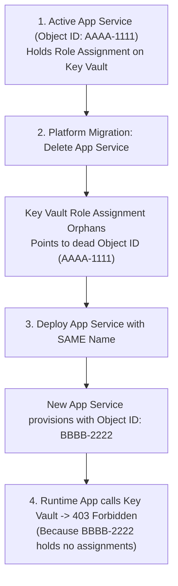
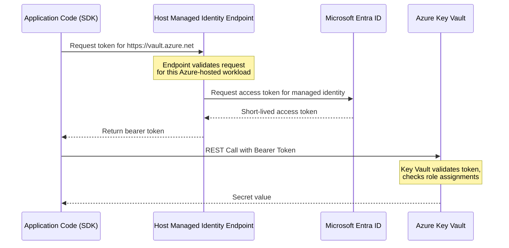
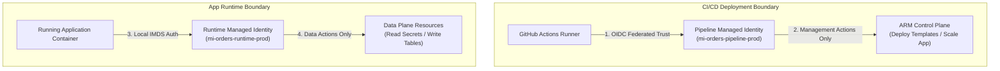

## Table of Contents

1. [Workload Access: The Passwordless Principle](#workload-access-the-passwordless-principle)
2. [Workload Identity vs. User Identity](#workload-identity-vs-user-identity)
3. [Managed Identities: Centralized Credentials](#managed-identities-centralized-credentials)
4. [System-Assigned: Resource Bound Lifecycle](#system-assigned-resource-bound-lifecycle)
5. [User-Assigned: Standalone Architecture](#user-assigned-standalone-architecture)
6. [The Token Request Path](#the-token-request-path)
7. [RBAC Authorization: The Active Binding](#rbac-authorization-the-active-binding)
8. [Operational Isolation: Runtime vs. Pipeline](#operational-isolation-runtime-vs-pipeline)
9. [Diagnosing Workload Identity Outages](#diagnosing-workload-identity-outages)
10. [Putting It All Together](#putting-it-all-together)
11. [What's Next](#whats-next)

## Workload Access: The Passwordless Principle

A managed identity is an automatically managed workload identity in Microsoft Entra ID that allows an Azure-hosted service to authenticate to other Azure resources without storing passwords, client secrets, or long-lived access keys in code or configuration.

To understand why this is a fundamental architectural requirement, you must confront **"the first secret problem"** (also known as the bootstrap credentials paradox).

Suppose you decide to secure your production database password by storing it inside a highly protected central vault (such as Azure Key Vault). Your application code no longer contains the raw database password. However, when your application container boots up and needs to connect to the database, it must first call the Key Vault API to retrieve the password.

To call Key Vault, your application must prove its own identity. If you use traditional password-based authentication, you must provide your application with a Client Secret or an API key.

This leads to the paradox: **Where do you store that first client secret?**

If you write it into your application configuration files, your Git repository now holds a plaintext credential. If you pass it in as an environment variable during deployment, your CI/CD pipeline logs and host hypervisor environment registers now contain a secret key. If the client secret is ever compromised, an attacker can use it from any computer in the world to sign in to your Key Vault and download every production credential you own.

Managed identities solve the bootstrap credentials paradox by eliminating the stored secret entirely. Instead of storing a long-lived credential inside the application, the Azure-hosted compute resource is associated with a Microsoft Entra service principal that the hosting platform can use to request tokens on the workload's behalf.

The application code never handles a password, client secret, or private certificate key. Instead, the runtime SDK requests short-lived authentication tokens locally, and the Azure platform handles all credential material, cryptographic signatures, and token rotation loops under the hood.

## Workload Identity vs. User Identity

A workload identity is an identity designed specifically for software (such as an active microservice, a scheduled background worker, or a CI/CD pipeline runner) rather than a physical human being.

In local development, engineers are used to running applications using their own personal developer identities (using permissions cached by running `az login`). However, running a production workload under a human user account, or sharing a broad administrative deployment credential, introduces severe security risks:

*   **Principal Creep**: If a microservice shares a developer's identity, the microservice automatically inherits the developer's broad permissions, violating the principle of least privilege.
*   **Audit Ambiguity**: If an incident occurs and a database table is wiped, the audit logs will record the action under the developer's name, making it impossible to distinguish between a manual human error and a runtime application bug.
*   **Rotation Pain**: If the developer leaves the company or changes their password, the production microservice will immediately suffer authentication failures and crash.

A secure cloud architecture treats the running application as an independent principal with its own dedicated workload identity cabled strictly to its runtime job:

| Workload Identity | Specific Runtime Job | Target Scope & Permission |
| :--- | :--- | :--- |
| **`mi-orders-api-prod`** | Read order database passwords and write transaction logs. | `Key Vault Secrets User` on `kv-orders-prod` (Resource Scope). |
| **`mi-payment-processor`** | Process incoming payment cards and write audit ledgers. | `Storage Blob Data Contributor` on payment export storage container. |
| **`mi-log-exporter`** | Export regional telemetry traces to security audit workspaces. | `Monitoring Metrics Publisher` on Log Analytics scope. |

By separating these identities, you enforce granular operational isolation. If the payment processor is compromised, the attacker cannot read secrets from the orders vault, because the payment processor's security token is completely blind to the orders envelope.

## Managed Identities: Centralized Credentials

A managed identity is a specialized Microsoft Entra service principal cabled directly to the lifecycle of an Azure resource. The core value of this design is that the credential material is managed entirely by Azure.


*System-assigned identities follow one resource lifecycle, while user-assigned identities can be shared and moved across workloads.*

When you enable a managed identity on a compute resource, Azure creates a service principal row in your Microsoft Entra directory. However, unlike a standard service principal, Entra ID does not generate a client secret string or certificate file for you to copy. Azure manages the credential material and token issuance path for the identity so your application never stores the secret.

From the application's perspective, the token flow is completely hands-off. The application code utilizes standard Azure SDK libraries (such as `DefaultAzureCredential` in Node.js, Python, or Go).

At runtime, the SDK automatically detects the Azure hosting environment, contacts the managed identity endpoint for that host type, and retrieves a short-lived access token. The SDK handles token caching and refresh behavior, keeping application code clean and free of credential-handling logic.

## System-Assigned: Resource Bound Lifecycle

A system-assigned managed identity belongs to exactly one Azure resource instance and is cabled directly to its lifecycle.

```text
Compute Resource (app-orders-prod) <─── Tied 1:1 ───> System Identity (mi-app-orders-prod)
  * Created when enabled on resource.
  * Deleted automatically when resource is deleted.
```

### The Lifecycle Mechanism
When you enable a system-assigned identity on an App Service (e.g. `app-orders-prod`), the ARM engine contacts Microsoft Entra ID and provisions a service principal cabled to the App Service's specific Resource ID.

If you delete the App Service, Azure deletes the system-assigned identity because its lifecycle is tied to that resource. If you recreate the App Service, the new resource gets a new principal ID. Role assignments that referenced the old principal can become stale from an operational point of view, so production teardown and rebuild pipelines should explicitly recreate or clean up assignments.

### Architectural Tradeoffs
*   **Pros**: Tidy and automated. There are no standalone identity resources to manage, clean up, or track. It is a perfect fit for singleton workloads where the resource lifecycle and identity lifecycle are identical.
*   **Cons**: Rebuild volatility. If you delete and recreate your App Service (a common occurrence during controlled platform migrations or stack updates), Entra ID generates a brand-new Object ID for the new system-assigned identity. Even though the App Service name remains unchanged, the old principal ID is gone. You must recreate every role assignment for the new Object ID, which can cause startup failures if your deployment pipeline does not automate this step.

:::expand[Pitfall: System-Assigned Identity Lost on Resource Rebuild]{kind="pitfall"}
A subtle failure pattern occurs when a compute resource using a system-assigned managed identity is deleted and recreated. Imagine a production App Service named `app-orders-prod` that has a system-assigned identity cabled to an Azure SQL Database with a role assignment. During a platform migration, your deployment script deletes the App Service and provisions a new one with the exact same name. The application boots up, but SQL queries immediately fail with a `403 Forbidden` error.

The culprit is principal ID rotation. Even though the App Service friendly name remains identical, Microsoft Entra ID treats the recreation as a brand-new entity, generating a completely new Object ID (Principal ID) for the new system-assigned identity. The old Object ID is permanently deleted, leaving the existing role assignments in Azure SQL, Key Vault, and Storage orphaning a "tombstoned" security principal that no longer exists. The platform does not automatically transfer permissions to the new identity simply because it shares the resource name.

This exact issue exists in AWS. If you delete and recreate an AWS IAM Role with the same name, any Amazon S3 Bucket Policies or Key Management Service (KMS) key policies that reference the role's Amazon Resource Name (ARN) will break. Under the hood, AWS maps the ARN to a unique internal role ID (e.g. starting with `AROA`). When you recreate the role, the internal ID changes, and the policies continue to point to the tombstoned old ID.

The timeline below illustrates this lifecycle failure path:



**Rule of thumb:** For production environments subject to infrastructure rebuilds, blue-green slot swaps, or infrastructure-as-code teardowns, avoid system-assigned identities. Use standalone **user-assigned managed identities** to ensure the security principal and its associated role assignments survive compute resources being destroyed and recreated.
:::

## User-Assigned: Standalone Architecture

A user-assigned managed identity is a standalone Azure resource (`Microsoft.ManagedIdentity/userAssignedIdentities`) created and managed independently of the compute resources that use it.

```text
Standalone Identity Resource (mi-orders-api-prod)
  ├── Attached to compute: app-orders-prod-slot-a
  ├── Attached to compute: app-orders-prod-slot-b
  └── Persistent lifecycle independent of compute resources
```

### The Lifecycle Mechanism
Because the user-assigned identity exists as its own resource, its lifecycle is decoupled from the compute resources. You create the identity once, assign the required RBAC roles to its Object ID, and then attach it to one or more supported compute hosts (such as App Services or Container Apps).

If the compute host is deleted, rebuilt, or migrated across slots, the user-assigned identity remains untouched in the directory. The newly provisioned compute host simply binds to the existing identity, inheriting the cabled role assignments instantly without any principal ID shifts.

### Architectural Tradeoffs
*   **Pros**: Stable, reusable, and predictable. Ideal for multi-node deployments, blue-green deployment slots, and GitOps pipelines where permissions must remain active across rolling compute swaps.
*   **Cons**: Administrative cleanup overhead. Because user-assigned identities are independent resources, deleting a compute host does not delete the identity. If your platform team does not actively audit Entra service principals, retired user-assigned identities can linger in the directory, retaining access indefinitely. You must tag these resources and clean them up when their workloads are retired.

## The Token Request Path

To understand how a passwordless workload obtains a secure token, separate the general managed identity pattern from the host-specific endpoint.


*The managed identity token path is local first, then Entra-signed, then checked by RBAC at the target service.*

When your application code uses `DefaultAzureCredential` to make an API call, the Azure SDK does not transmit a client secret. Instead, it asks the current Azure host for a token through that host's managed identity interface. Virtual Machines use the Instance Metadata Service (IMDS) at `169.254.169.254`. App Service, Functions, and Container Apps expose managed identity through platform-specific local endpoints and environment-provided headers.



### 1. The Local Request
On a Virtual Machine, the application can request a token from IMDS at `169.254.169.254` with the required metadata header. On App Service and Container Apps, the Azure SDK uses the local managed identity endpoint and headers exposed through the hosting environment. Application code should normally use the Azure Identity library instead of hardcoding one endpoint, because the endpoint shape differs across hosting services.

### 2. Platform Verification
The hosting platform verifies that the token request comes from the Azure resource that owns or has been assigned the managed identity. The verification mechanism is platform-specific, but the goal is the same: the workload proves its Azure-hosted identity without storing a password or client secret.

### 3. Directory Authentication
The host identity endpoint requests an access token from Microsoft Entra ID for the target resource scope, such as `https://vault.azure.net`.

### 4. Ephemeral Token Generation
Microsoft Entra ID issues a short-lived access token and returns it to the host identity endpoint, which passes it back to the application. The SDK caches and refreshes tokens according to the library and platform behavior.

### 5. Secure REST Execution
The Azure SDK extracts this JWT and places it in the authorization header of the REST query:
```text
GET https://kv-orders-prod.vault.azure.net/secrets/orders-db-password?api-version=7.4
Headers: Authorization: Bearer eyJ...
```
Key Vault validates the token, identifies the caller's principal, and evaluates its own RBAC assignments. If allowed, it returns the secret value over TLS.

## RBAC Authorization: The Active Binding

Managed identity answers the authentication question (who the app is). Azure RBAC answers the authorization question (what the app is allowed to do).

> [!IMPORTANT]
> Enabling a managed identity does **not** grant the workload any permissions by default. A freshly created managed identity holds zero access. If your application attempts to read a Key Vault secret or write a blob immediately after enabling the identity, the target service will reject the data-plane request with a `403 Forbidden` error. You must explicitly create a role assignment that binds the identity's Object ID to a specific role definition at the target scope.

For our transactional orders microservice, the production permissions are strictly bounded:

| Workload Object ID | Assigned Role Definition | Scope URI Target |
| :--- | :--- | :--- |
| `5f1f64a4-0a2c-4f3c-91f4-3b9e68b9f6d1` | `Key Vault Secrets User` | `/subscriptions/.../resourceGroups/rg-orders-prod/providers/Microsoft.KeyVault/vaults/kv-orders-prod` |
| `5f1f64a4-0a2c-4f3c-91f4-3b9e68b9f6d1` | `Storage Blob Data Contributor` | `/subscriptions/.../resourceGroups/rg-orders-prod/providers/Microsoft.Storage/storageAccounts/stordersprod/blobServices/default/containers/exports` |

This explicit binding guarantees that even if an attacker compromises the container app's code, they are locked within these exact data-plane limits. They cannot delete the vault, scale the database, or list files in other storage accounts, keeping the blast radius completely isolated.

## Operational Isolation: Runtime vs. Pipeline

A critical security practice is the strict separation of **Runtime Identities** from **Pipeline Deployment Identities**.

In immature cloud architectures, deployment pipelines (like GitHub Actions or GitLab runners) often deploy applications using the same identity that runs the code. Alternatively, developers are tempted to grant their runtime managed identity administrative roles (like `Contributor` or `Owner`) to make deployment headaches disappear.

This violates operational isolation:

```text
Deploy Pipeline Identity (sp-orders-deploy) -> Management Plane (Bicep templates, scaling, networking)
Runtime Workload Identity (mi-orders-api-prod) -> Data Plane (Read database secret, write blob transactions)
```

By separating these roles, you ensure that the running application can never modify the infrastructure it resides in. The managed identity has zero management plane permissions: it cannot change firewalls, delete subnets, or provision new virtual machines.

Conversely, the deployment pipeline has control-plane access but lacks data-plane access: it can provision the Key Vault but cannot read the sensitive database passwords stored inside it. This division protects your business from internal configuration drift and external software supply chain attacks.

:::expand[Pattern: Two-Identity Runtime and Pipeline Separation]{kind="pattern"}
The gold standard for securing enterprise cloud environments is the complete decoupling of deployment privileges from runtime permissions using a two-identity architecture cabled to workload federation. By separating these boundaries, you eliminate the risk of a runtime application vulnerability compromising your infrastructure control plane, while also protecting your data plane from pipeline deployment scripts.

The architecture relies on two distinct user-assigned managed identities:

1.  **The Pipeline Deployment Identity (`mi-orders-pipeline-prod`)**: This identity is cabled to your CI/CD provider (such as GitHub Actions or GitLab CI) using Workload Identity Federation (OIDC). When a build runs, Entra ID trusts the OIDC token issued by the runner and exchanges it for a temporary Azure token. This identity holds `Contributor` access at the resource group scope, allowing it to provision network interfaces, scale compute, and update templates, but it has zero data-plane access to database records.
2.  **The Runtime Workload Identity (`mi-orders-runtime-prod`)**: This identity is physically attached to the App Service or container. It holds strictly data-plane roles (like `Key Vault Secrets User` and `Storage Blob Data Contributor`) at individual resource scopes. It holds zero management-plane access, meaning it cannot modify firewalls, delete subnets, or inspect other systems in the resource group.

This pattern maps directly to AWS IAM. A pipeline runner uses AWS OIDC federation to assume a deployment role with CloudFormation permissions, while the running application container is assigned an ECS Task Execution Role that holds strictly the DynamoDB and S3 data-plane permissions.

The top-down boundary map below illustrates this operational isolation:



**Rule of thumb:** Never grant a single identity both management-plane and data-plane access. Enforce passwordless, OTel-auditable separation by federating your pipeline runner and isolating your application runtime behind independent managed identities.
:::

## Diagnosing Workload Identity Outages

When a managed identity workload fails to access a resource, you can isolate the outage coordinate by running through four clinical diagnostic steps:

### 1. Verify Identity Attachment
Verify that the managed identity is physically enabled and attached to the compute host. If using a user-assigned identity, confirm that the client ID inside the application configuration matches the actual resource ID.
```bash
az containerapp show --name "app-orders-prod" --resource-group "rg-orders-prod-uksouth" --query "identity"
```

### 2. Confirm Token Acquisition
Check application logs to confirm the SDK can contact the local managed identity endpoint for the hosting service. If the log shows `CredentialUnavailableException`, the SDK cannot obtain a token. On a VM, that may mean IMDS is unreachable. On App Service or Container Apps, it may mean the identity is not enabled, the user-assigned client ID is wrong, the endpoint environment is not available yet, or the hosting platform has not finished applying the identity binding.

### 3. Verify Object ID in Role Assignments
Do not check the friendly application name; query the actual Object ID of the service principal and verify it is listed in the target resource's role assignments.
```bash
az role assignment list --assignee "5f1f64a4-0a2c-4f3c-91f4-3b9e68b9f6d1" --scope "/subscriptions/..."
```

### 4. Check Scope Boundaries
Confirm that the role assignment's scope covers the target resource. If the assignment is cabled to `vaults/kv-orders-dev`, the app will be denied when requesting secrets from `vaults/kv-orders-prod`.

## Putting It All Together

Operating a secure, passwordless workload requires transitioning from static credentials to dynamic token-based metadata flows:

*   **Solve the Bootstrap Paradox**: Leverage managed identities to eliminate long-lived passwords and client secrets from code, configurations, and logs.
*   **Decouple Lifecycles with User-Assigned**: Prefer user-assigned managed identities for production to guarantee stable Object IDs across slots and platform migrations.
*   **Audit Token Acquisition**: Recognize that Virtual Machines use IMDS, while App Service, Functions, and Container Apps expose managed identity through their own local endpoint contracts.
*   **Enforce Strict Least Privilege**: Enabling an identity grants zero access; always cable explicit, resource-scoped role assignments to the principal's Object ID.
*   **Isolate Runtime from Deployment**: Keep management-plane deployment pipelines completely separate from data-plane application runtimes.

## What's Next

We have established how our application securely proves its identity at runtime without passwords. Now we are ready to examine the secure boundary where our sensitive passwords, cryptographic keys, and certificates reside. In the next article, we will go deep into Azure Key Vault. We will contrast secrets, keys, and certificates, evaluate access control architectures, and examine soft-delete and purge protection mechanisms.


*Use this as the managed identity flow: the workload asks Azure for a short-lived token, Entra ID issues it, and RBAC decides whether that token can reach the target service.*


---

**References**

* [Managed Identities for Azure Resources](https://learn.microsoft.com/en-us/entra/identity/managed-identities-azure-resources/overview) - Core architecture of managed workload credentials.
* [Instance Metadata Service (IMDS) reference](https://learn.microsoft.com/en-us/azure/virtual-machines/instance-metadata-service) - Technical documentation for the VM metadata endpoint.
* [Managed identities in Azure Container Apps](https://learn.microsoft.com/en-us/azure/container-apps/managed-identity) - Host-specific managed identity behavior for Container Apps.
* [Managed identities in App Service](https://learn.microsoft.com/en-us/azure/app-service/overview-managed-identity) - Host-specific managed identity behavior for App Service.
* [App Service Managed Identity Guide](https://learn.microsoft.com/en-us/azure/app-service/overview-managed-identity) - Best practices for managed identities on hosting tiers.
* [Azure SDK Authentication with DefaultAzureCredential](https://learn.microsoft.com/en-us/dotnet/api/azure.identity.defaultazurecredential) - How SDKs resolve identities at runtime.
