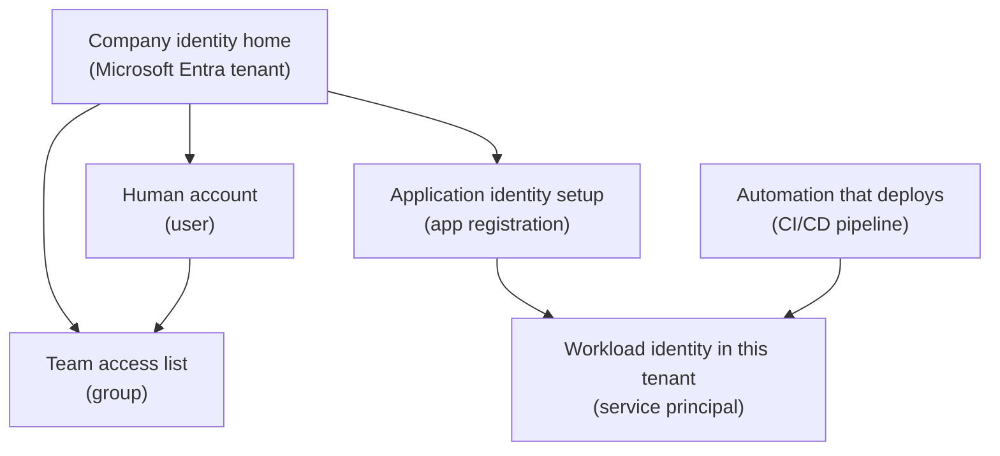

## Table of Contents

1. [The Identity Check Before Access](#the-identity-check-before-access)
2. [If You Know AWS IAM](#if-you-know-aws-iam)
3. [The Identity Map In One Picture](#the-identity-map-in-one-picture)
4. [Tenants Are The Identity Home](#tenants-are-the-identity-home)
5. [Users And Groups Are For People Access](#users-and-groups-are-for-people-access)
6. [App Registrations And Service Principals](#app-registrations-and-service-principals)
7. [Object IDs Beat Display Names](#object-ids-beat-display-names)
8. [Signed In Does Not Mean Allowed](#signed-in-does-not-mean-allowed)
9. [Pipelines And Apps Need Non-Human Identities](#pipelines-and-apps-need-non-human-identities)
10. [Failure Modes You Will Actually See](#failure-modes-you-will-actually-see)
11. [A Review Habit Before Granting Access](#a-review-habit-before-granting-access)

## The Identity Check Before Access

Most Azure access mistakes do not start with a bad command.
They start with a missing identity check.
Someone is signed in, the Azure portal loads, the CLI has a token, and a deployment looks ready.
Then the command fails because Azure does not know whether this person, group, pipeline, or app is allowed to touch the production resource group.

This article is about that identity layer.
Microsoft Entra ID is the directory service Azure uses as an identity home.
A directory service is a system that stores identities and facts about them, such as users, groups, applications, and service principals.
Azure still uses Azure RBAC (role-based access control, the permission system for Azure resources) to decide what those identities can do at a scope.

Those two checks are easy to blur together when you are new.
Microsoft Entra ID answers, "who or what is this?"
Azure RBAC answers, "what can this identity do here?"
The word "here" matters.
It might mean one subscription, one resource group, one Key Vault, or one Container App.

We will keep one running example:
`devpolaris-orders-api` is a Node backend deployed by a CI/CD pipeline.
The service team has human maintainers, a group for deployers, an app registration, and a service principal used by the pipeline.
The team wants the pipeline to deploy the orders API to the production resource group without giving a human password or broad owner access to every Azure resource.

The practical goal is simple.
After this article, you should be able to look at an Azure access problem and separate four questions:
which tenant is the identity from, which object is the exact identity, which role was assigned, and which scope did Azure check?

> Being signed in proves identity. It does not prove permission.

## If You Know AWS IAM

If you learned AWS first, you already know the shape of the problem.
AWS IAM helps you answer who can call which AWS API on which resource.
Azure asks the same operating question, but it splits the answer across Microsoft Entra ID and Azure RBAC more visibly.

The closest bridge looks like this:

| AWS idea you know | Azure idea to learn | Careful difference |
|-------------------|---------------------|--------------------|
| IAM user | Microsoft Entra user | A human identity in a tenant, not a subscription resource |
| IAM group | Microsoft Entra group | A collection of identities that can receive Azure role assignments |
| IAM role assumed by software | Service principal or managed identity | Azure still needs an RBAC role assignment at a scope |
| External identity provider for federation | App registration plus federated credential or workload identity setup | The app registration describes token trust, while the service principal is the tenant-local identity |
| IAM policy attached to a user, group, or role | Azure RBAC role assignment | The assignment joins principal, role, and scope |
| AWS account boundary | Azure tenant plus subscription | The tenant is identity home, while the subscription is the resource and billing boundary |

The service principal comparison needs extra care.
An AWS IAM role often feels like one object that both represents a workload and carries permissions through attached policies.
In Azure, a service principal represents an application or workload inside a tenant.
It does not automatically get permission to Azure resources.
Azure grants that permission through role assignments.

An app registration is another Azure-specific idea.
It is the identity configuration for an application, usually in its home tenant.
It can define things like the application ID, redirect URIs, certificates, secrets, and federated credentials.
A service principal is the local security identity created from that application inside a tenant.
For a single-tenant internal pipeline, those two objects often appear together, but they are not the same object.

So if your AWS-trained brain asks, "which role does this pipeline assume?", the Azure version is usually:
which app registration or workload identity issues the token, which service principal exists in this tenant, and which Azure RBAC role assignment gives it access to this scope?

That sentence is longer than the AWS version, but it is more precise.
Azure separates identity description, tenant-local identity, and resource permission.
Once you see the split, troubleshooting gets much calmer.

## The Identity Map In One Picture

Identity diagrams can become messy because people, groups, apps, and permissions are all related.
Read this one from top to bottom first.
The plain-English labels come first.
The Azure terms are in parentheses.



The solid lines show where identity objects live or how the app identity is represented.
Permission relationships are intentionally not drawn here.
A group or service principal can receive an Azure RBAC role assignment at a scope, but that is a permission binding, not containment.
A group does not contain the resource group, and a service principal does not contain the Container App.

For `devpolaris-orders-api`, the human maintainers might be in a group called `grp-orders-api-deployers`.
The pipeline might authenticate as a service principal called `sp-devpolaris-orders-ci`.
Both identities can receive role assignments, but they should not receive the same level of access automatically.

That separation is the first safety win.
Humans need enough access to inspect and operate the service.
The pipeline needs enough access to deploy the service.
The running app needs enough access to read its own secrets or call its own dependencies.
Those are different jobs, so they should be different identities or groups with different assignments.

## Tenants Are The Identity Home

A tenant is the identity home for an organization in Microsoft Entra ID.
It is where Azure looks up users, groups, app registrations, service principals, and sign-in records.
If DevPolaris uses work accounts like `maya@devpolaris.example`, those accounts live in a tenant.

The tenant is not the same thing as the subscription.
The tenant tells Azure who the identity is.
The subscription tells Azure where resources, billing, quotas, and many resource-level policies live.
This is why a person can sign in to the correct company tenant and still have no access to the production subscription.

The Azure CLI can show the tenant tied to your current account context:

```bash
$ az account show --query "{user:user.name,subscription:name,subscriptionId:id,tenantId:tenantId}" --output json
{
  "user": "maya@devpolaris.example",
  "subscription": "sub-devpolaris-prod",
  "subscriptionId": "11111111-2222-3333-4444-555555555555",
  "tenantId": "aaaaaaaa-bbbb-cccc-dddd-eeeeeeeeeeee"
}
```

That output is a safety check, not trivia.
Before you create a service principal or assign a role, the `tenantId` tells you which identity home Azure is using.
The `subscriptionId` tells you which resource boundary your CLI is pointed at.

For the orders API team, a small identity inventory might look like this:

| Identity object | Example | Why it exists |
|-----------------|---------|---------------|
| Tenant | `devpolaris.example` | Home for company identities |
| User | `maya@devpolaris.example` | Human maintainer who signs in |
| Group | `grp-orders-api-deployers` | People allowed to deploy or operate the service |
| App registration | `app-devpolaris-orders-ci` | Configuration for the pipeline identity |
| Service principal | `sp-devpolaris-orders-ci` | Tenant-local identity the pipeline uses when it asks Azure for access |

The tenant is also where sign-in controls are applied.
For people, that can include multifactor authentication and conditional access.
For applications and service principals, it includes credentials, certificates, and federated identity settings.
Those controls help prove the identity before Azure even checks what the identity can do.

The beginner habit is to ask:
which tenant am I looking at?
If the answer is wrong, searching for users, groups, or service principals can lead you to the wrong object or to no object at all.

## Users And Groups Are For People Access

A user is a person-shaped identity in Microsoft Entra ID.
It has a profile, a sign-in name, and an object ID.
The person may be an employee in the tenant or a guest from another tenant.
Either way, Azure needs an identity object before it can reason about access.

It is tempting to assign Azure roles directly to each user.
That works for tiny experiments, but it becomes painful quickly.
People join the team, leave the team, move to another service, or need temporary read access during an incident.
If every role assignment points to one person, access review turns into a slow search across many scopes.

A group is the usual answer.
A group collects identities so you can grant access to the group instead of repeating the same assignment for each person.
For the orders API, the group might hold the people who can deploy to production:

```bash
$ az ad group show --group "grp-orders-api-deployers" --query "{displayName:displayName,id:id}" --output json
{
  "displayName": "grp-orders-api-deployers",
  "id": "22222222-3333-4444-5555-666666666666"
}
```

The important field is `id`.
In Azure CLI output for Microsoft Entra objects, this usually means the object ID.
The display name is for humans.
The object ID is for exact targeting.

Then a role assignment can point at that group object ID:

```bash
$ az role assignment list \
  --assignee 22222222-3333-4444-5555-666666666666 \
  --scope /subscriptions/11111111-2222-3333-4444-555555555555/resourceGroups/rg-devpolaris-orders-prod \
  --query "[].{role:roleDefinitionName,scope:scope,principalType:principalType}" \
  --output table
Role        PrincipalType    Scope
----------  ---------------  ------------------------------------------------------------
Contributor Group            /subscriptions/11111111-2222-3333-4444-555555555555/resourceGroups/rg-devpolaris-orders-prod
```

This proves the group has `Contributor` at the production resource group scope.
It does not prove every person is in the group.
It also does not prove a newly added person has refreshed their token.
Group membership and sign-in tokens are related, but they are not the same thing.

The tradeoff is worth naming.
Groups make access easier to review and change.
They also add one more place to inspect when someone says, "I should have access."
You now check both the role assignment and the group membership.

## App Registrations And Service Principals

Humans are not the only identities in Azure.
Your CI/CD pipeline and your running application also need to prove who they are.
They should not borrow Maya's account.
They should not store a shared human password.
They need their own non-human identity.

An app registration is the identity configuration for software.
It describes an application to Microsoft Entra ID.
It has an application ID, also called a client ID, and it can hold authentication settings such as certificates, client secrets, redirect URIs, or federated credentials.

A service principal is the security principal for that application inside a tenant.
Security principal means "an identity that can be assigned access."
For Azure RBAC, a service principal can be assigned a role just like a user, group, or managed identity can.

This is the part that feels odd at first:
the app registration and the service principal have different object IDs.
The app registration is the application definition.
The service principal is the tenant-local identity Azure checks when the app or pipeline signs in.

A realistic CLI lookup might show both shapes:

```bash
$ az ad app show --id 77777777-8888-9999-aaaa-bbbbbbbbbbbb \
  --query "{displayName:displayName,appId:appId,id:id}" --output json
{
  "displayName": "app-devpolaris-orders-ci",
  "appId": "77777777-8888-9999-aaaa-bbbbbbbbbbbb",
  "id": "33333333-4444-5555-6666-777777777777"
}

$ az ad sp show --id 77777777-8888-9999-aaaa-bbbbbbbbbbbb \
  --query "{displayName:displayName,appId:appId,id:id}" --output json
{
  "displayName": "sp-devpolaris-orders-ci",
  "appId": "77777777-8888-9999-aaaa-bbbbbbbbbbbb",
  "id": "44444444-5555-6666-7777-888888888888"
}
```

Look closely.
The `appId` matches.
That is the application or client ID used during sign-in.
The `id` values differ.
Those are object IDs for different directory objects.

For the CI/CD pipeline, the service principal object ID is often the one you need for Azure RBAC.
If you assign a role to the app registration object ID by mistake, the assignment can fail or target the wrong kind of object.
When in doubt, look up the service principal and use its object ID for role assignments.

The service principal can exist and still have no useful Azure resource access.
That is by design.
Identity creation and permission grant are separate steps.
Creating `sp-devpolaris-orders-ci` says, "this workload identity exists."
Assigning `Contributor` on `rg-devpolaris-orders-prod` says, "this identity can change resources in this resource group."

## Object IDs Beat Display Names

Azure has many names that look friendly.
Friendly names are helpful in the portal, in tickets, and in team chat.
They are not safe enough for exact permission work.

A display name can be duplicated.
A group called `orders-api-deployers` can exist in a lab tenant and in the production tenant.
Two app registrations can have similar names after a migration.
A service principal display name can differ from the app registration display name.
If a script chooses by display name alone, it can choose the wrong object.

An object ID is the unique identifier for one Microsoft Entra object inside a tenant.
It looks like a GUID.
Users, groups, app registrations, and service principals all have object IDs.
The exact field name can be confusing because different tools display it as `id`, `objectId`, or `principalId` depending on the command and resource.

For role assignments, the principal ID points to the Microsoft Entra object that received the role:

```bash
$ az role assignment list \
  --scope /subscriptions/11111111-2222-3333-4444-555555555555/resourceGroups/rg-devpolaris-orders-prod \
  --query "[].{principalName:principalName,principalId:principalId,principalType:principalType,role:roleDefinitionName}" \
  --output table
PrincipalName              PrincipalId                           PrincipalType     Role
-------------------------  ------------------------------------  ----------------  ----------------
grp-orders-api-deployers   22222222-3333-4444-5555-666666666666  Group             Contributor
sp-devpolaris-orders-ci    44444444-5555-6666-7777-888888888888  ServicePrincipal  Contributor
```

This output lets you answer a precise question:
which exact group and which exact service principal have access to the production resource group?
The answer is not the display name alone.
The answer is the principal ID plus principal type plus scope.

For beginners, the safe working rule is:
use display names to search, then use object IDs to assign or audit access.

That rule feels slower at first.
It saves time when something breaks.
If someone says the pipeline identity is missing access, you can compare the service principal object ID in Microsoft Entra ID with the `principalId` in the role assignment.
If they differ, you found the problem.

## Signed In Does Not Mean Allowed

Signing in gives Azure a token that says who or what the caller is.
Authorization decides what that caller can do.
Those are separate steps.

A human example makes this clear.
Maya signs in successfully:

```bash
$ az login --tenant aaaaaaaa-bbbb-cccc-dddd-eeeeeeeeeeee
You have logged in. Now let us find all the subscriptions to which you have access...
```

That message can feel like success.
It is only identity success.
Maya may still fail when she tries to change the production resource group:

```bash
$ az containerapp update \
  --name ca-devpolaris-orders-api-prod \
  --resource-group rg-devpolaris-orders-prod \
  --image ghcr.io/devpolaris/orders-api:2026.05.03

(AuthorizationFailed) The client 'maya@devpolaris.example' with object id
'99999999-aaaa-bbbb-cccc-dddddddddddd' does not have authorization to perform action
'Microsoft.App/containerApps/write' over scope
'/subscriptions/11111111-2222-3333-4444-555555555555/resourceGroups/rg-devpolaris-orders-prod/providers/Microsoft.App/containerApps/ca-devpolaris-orders-api-prod'.
```

The useful parts are the object ID, the action, and the scope.
Azure knows who Maya is.
Azure is blocking the specific write action at the Container App scope because no matching role assignment allows it.

The fix is not "log in again" unless the tenant or subscription context is wrong.
The normal fix is to grant the right role to the right principal at the smallest useful scope, or add Maya to the group that already has the correct role.

For the orders API, that might mean:
Maya joins `grp-orders-api-deployers`, and that group has `Contributor` on `rg-devpolaris-orders-prod`.
If Maya only needs to inspect logs, a read-only role may be enough.
If she needs to manage identities or assign roles, that is a different and more sensitive permission path.

This is also where Microsoft Entra roles and Azure RBAC roles can be confused.
Microsoft Entra roles manage directory resources such as users, groups, applications, and service principals.
Azure RBAC roles manage Azure resources such as resource groups, Container Apps, Storage accounts, and Key Vaults.
An Application Administrator in Microsoft Entra ID can manage app registrations, but that does not automatically make the person a Contributor on a production resource group.

## Pipelines And Apps Need Non-Human Identities

A CI/CD pipeline is software making changes on behalf of the team.
It builds `devpolaris-orders-api`, publishes an image, and asks Azure to update the running service.
That pipeline needs an identity Azure can audit and limit.

Using a person's account for that job creates several problems.
The pipeline can break when the person leaves.
The password or token may be shared too widely.
Audit logs show Maya instead of the pipeline.
Access might be broader than the deployment needs because the human account also has other duties.

A service principal gives the pipeline its own identity:

```text
Pipeline: deploy-orders-prod
Identity: sp-devpolaris-orders-ci
Tenant:   devpolaris.example
Scope:    rg-devpolaris-orders-prod
Role:     Contributor
Job:      update Container App image and deployment settings
```

This does not mean every pipeline should get `Contributor`.
It means the team starts with the job the pipeline performs, then grants the smallest role and scope that can do that job.
For a first learning example, `Contributor` at one resource group is easy to understand.
In a mature production setup, a narrower custom role or separate deployment resource scopes may be better.

Modern CI/CD systems often use workload federation instead of storing a long-lived client secret.
Federation means the pipeline provider issues a short-lived token, and Microsoft Entra ID trusts that token only when it matches configured rules such as repository, branch, environment, or workflow.
The important beginner idea is not the exact provider syntax.
The important idea is that the pipeline proves itself as the pipeline, not as a human.

When that identity is missing permission, the pipeline error has a familiar shape:

```text
Run: deploy-orders-prod
Identity: sp-devpolaris-orders-ci
Command: az containerapp update --name ca-devpolaris-orders-api-prod
Result: AuthorizationFailed

The client '77777777-8888-9999-aaaa-bbbbbbbbbbbb' with object id
'44444444-5555-6666-7777-888888888888' does not have authorization to perform action
'Microsoft.App/containerApps/write' over scope
'/subscriptions/11111111-2222-3333-4444-555555555555/resourceGroups/rg-devpolaris-orders-prod'.
```

The diagnosis path is the same as the human case.
Find the caller object ID.
Confirm it is the expected service principal.
List role assignments at the target scope.
If no assignment grants the required action, add the correct assignment or change the pipeline to target the scope where it already has access.

The running application may also need a non-human identity.
For example, `devpolaris-orders-api` might need to read a secret from Key Vault or write exports to Storage.
In Azure, a managed identity is often preferred for an Azure-hosted app because Azure manages the credential.
Service principals are still important for external automation and for understanding how application identities work.

The principle stays the same:
do not give software a human identity.
Give it a workload identity, then grant only the access that workload needs.

## Failure Modes You Will Actually See

Identity bugs can feel personal because the error says "not authorized."
Treat them like ordinary debugging.
Azure usually gives you enough evidence if you slow down and read the tenant, object ID, action, and scope.

Here are common failures for the orders API team.

| Failure | What it looks like | Fix direction |
|---------|--------------------|---------------|
| Wrong tenant | User, group, or service principal cannot be found | Switch tenant or create the identity in the correct tenant |
| Wrong object ID | Role assignment exists, but it points to a different object | Compare `principalId` with the exact user, group, or service principal object ID |
| Service principal has no Azure RBAC assignment | Pipeline signs in, then gets `AuthorizationFailed` | Assign the right Azure role at the target resource, resource group, subscription, or management group scope |
| Group membership confusion | Group has access, but one person still cannot act | Confirm the person is in the group, then refresh sign-in token if membership changed recently |
| Microsoft Entra role confused with Azure RBAC | User can edit app registrations but cannot update Azure resources | Grant an Azure RBAC role at the needed Azure scope |

The wrong tenant case often starts with an empty lookup:

```bash
$ az ad sp show --id 77777777-8888-9999-aaaa-bbbbbbbbbbbb
Resource '77777777-8888-9999-aaaa-bbbbbbbbbbbb' does not exist or one of its queried reference-property objects are not present.
```

Before recreating anything, check the tenant:

```bash
$ az account show --query "{tenantId:tenantId,name:name}" --output table
TenantId                              Name
------------------------------------  -------------------
bbbbbbbb-cccc-dddd-eeee-ffffffffffff  sub-personal-lab
```

The fix may be as simple as selecting the company tenant and production subscription.
If the service principal really belongs in the company tenant and is missing, then create it there.
Do not create a second identity in the wrong tenant just to make the command stop failing.

The wrong object ID case is quieter.
Someone assigns a role to an app registration object ID instead of the service principal object ID, or to a lab group with the same display name.
The role assignment list proves the mismatch:

```bash
$ az role assignment list \
  --scope /subscriptions/11111111-2222-3333-4444-555555555555/resourceGroups/rg-devpolaris-orders-prod \
  --query "[?roleDefinitionName=='Contributor'].{name:principalName,id:principalId,type:principalType}" \
  --output table
Name                       Id                                    Type
-------------------------  ------------------------------------  ----------------
app-devpolaris-orders-ci   33333333-4444-5555-6666-777777777777  Application
```

The expected pipeline service principal object ID was `44444444-5555-6666-7777-888888888888`.
The assignment points somewhere else.
The fix is to remove the mistaken assignment and add one for the service principal object ID.

Group membership confusion is another common one.
The group has the role, but the person is not a member, is a member of a similarly named group, or has not refreshed their session after being added.
A good ticket update is specific:

```text
Checked:
  Tenant: devpolaris.example
  Group with RBAC: grp-orders-api-deployers
  Group object ID: 22222222-3333-4444-5555-666666666666
  User object ID: 99999999-aaaa-bbbb-cccc-dddddddddddd

Finding:
  User is in grp-orders-api-readers, not grp-orders-api-deployers.

Fix:
  Add user to deployers group only if production deploy access is approved.
  Otherwise keep reader access and ask a deployer to run the release.
```

That kind of evidence keeps the fix tied to the access model.
It avoids the rushed fix of granting broad direct access to one person because a release is waiting.

## A Review Habit Before Granting Access

Access changes deserve a small checklist.
Not a ceremony.
Just enough friction to avoid granting the wrong identity too much access in the wrong place.

For `devpolaris-orders-api`, a healthy access review can be five questions:

1. Which tenant owns the identity?
2. Is the principal a user, group, service principal, or managed identity?
3. What is the exact object ID?
4. What role is needed for the job?
5. What is the smallest scope where that role should apply?

Here is the shape of a clear access request:

```text
Request:
  Let the production deployment pipeline update devpolaris-orders-api.

Principal:
  Service principal sp-devpolaris-orders-ci
  Object ID 44444444-5555-6666-7777-888888888888

Role:
  Contributor

Scope:
  /subscriptions/11111111-2222-3333-4444-555555555555/resourceGroups/rg-devpolaris-orders-prod

Reason:
  Pipeline updates the Container App image and related deployment settings.
```

That request is easy to review because it names the identity, role, and scope separately.
If a reviewer wants narrower access later, the request gives them a starting point.
They can ask whether the pipeline really needs the whole resource group or only specific resources.

The main tradeoff is between speed and precision.
Direct user assignments are fast, but they become hard to audit.
Group assignments take a little more setup, but they make people access easier to review.
Service principals take more care than copying a secret into a pipeline, but they give software its own identity and audit trail.
Narrow scopes take more thought, but they reduce damage when a token or workflow is misused.

Keep the mental model small:
Microsoft Entra ID stores the identities.
Azure RBAC grants those identities roles at scopes.
Display names help you find things.
Object IDs prove which thing you found.
Pipelines and apps should use workload identities, not human accounts.

When an access problem appears, do not start by clicking around the portal hoping for the right checkbox.
Start with the evidence:
tenant, principal type, object ID, role, and scope.
Those five fields will lead you to the real fix most of the time.

---

**References**

- [Application and service principal objects in Microsoft Entra ID](https://learn.microsoft.com/en-us/entra/identity-platform/app-objects-and-service-principals) - Explains app registrations, application objects, service principal objects, and how they relate across tenants.
- [Create Azure service principals using the Azure CLI](https://learn.microsoft.com/en-us/cli/azure/azure-cli-sp-tutorial-1?view=azure-cli-latest) - Shows the Microsoft-supported path for creating and inspecting service principals with Azure CLI.
- [Understand Azure role assignments](https://learn.microsoft.com/en-us/azure/role-based-access-control/role-assignments) - Defines the principal, role, and scope fields that make Azure RBAC work.
- [Steps to assign an Azure role](https://learn.microsoft.com/en-us/azure/role-based-access-control/role-assignments-steps) - Walks through assigning Azure roles to users, groups, service principals, and managed identities.
- [Understand roles in Microsoft Entra ID](https://learn.microsoft.com/en-us/entra/identity/role-based-access-control/concept-understand-roles) - Clarifies that Microsoft Entra roles manage directory resources and are separate from Azure RBAC roles for Azure resources.
