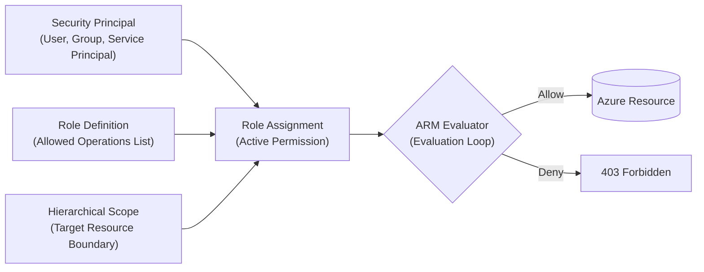
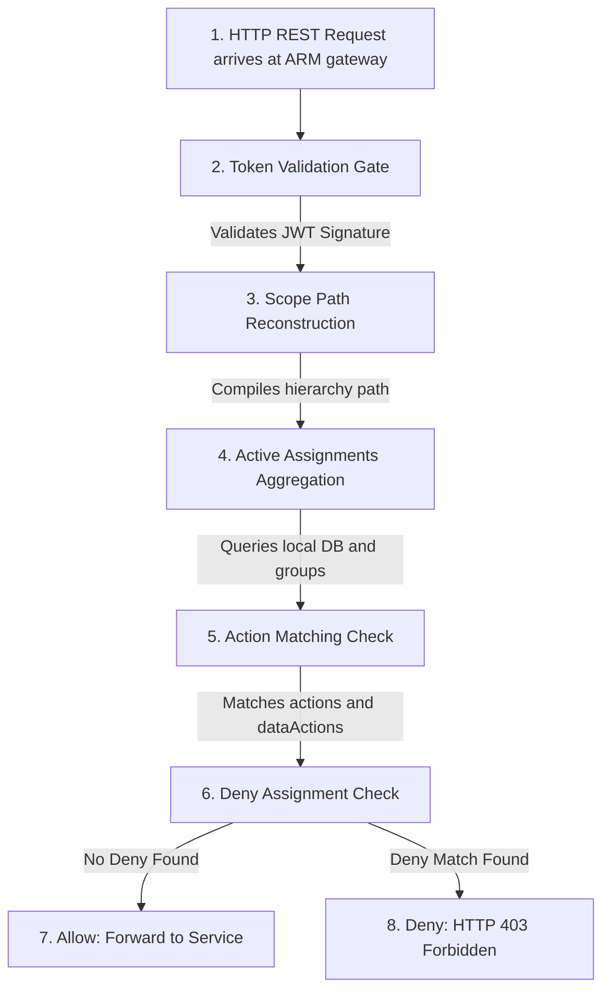

## Table of Contents

1. [Request Evaluation: The Authorization Pipeline](#request-evaluation-the-authorization-pipeline)
2. [Comparing Azure RBAC and AWS IAM Models](#comparing-azure-rbac-and-aws-iam-models)
3. [Microsoft Entra ID Directory Services](#microsoft-entra-id-directory-services)
4. [Differentiating Security Principals](#differentiating-security-principals)
5. [The Object ID vs. Application ID Interface](#the-object-id-vs-application-id-interface)
6. [Actions and Resource Planes](#actions-and-resource-planes)
7. [Role Definitions: Structuring Operations](#role-definitions-structuring-operations)
8. [Hierarchical Scopes and Inheritance](#hierarchical-scopes-and-inheritance)
9. [Role Assignments: Binding Scopes](#role-assignments-binding-scopes)
10. [Under the Hood: The ARM Access Evaluation Loop](#under-the-hood-the-arm-access-evaluation-loop)
11. [Declarative Bicep Custom Role and Assignment Previews](#declarative-bicep-custom-role-and-assignment-previews)
12. [Hands-On CLI Walkthrough: Creating and Assigning Custom Roles](#hands-on-cli-walkthrough-creating-and-assigning-custom-roles)
13. [Putting It All Together](#putting-it-all-together)
14. [What's Next](#whats-next)

## Request Evaluation: The Authorization Pipeline

Azure Role-Based Access Control (Azure RBAC) is Azure's permission system for management and data actions. It decides whether a verified identity can perform a specific operation on a specific Azure scope.


*Azure RBAC turns a caller, operation, and scope into an allow or deny decision at request time.*


Example: `mi-orders-api-prod` might be allowed to read secrets from `kv-orders-prod`, while the same identity is denied permission to delete the vault or resize an Azure SQL database.

To construct a secure, compliant cloud architecture, you must understand the absolute boundary between authentication and authorization.

Authentication is the identity proof step that answers who the caller is before Azure evaluates permissions.
When you enter a username, password, or security certificate, you authenticate.
Authorization is the permission evaluation step that checks what actions the authenticated identity may perform.
It answers the question of what that identity is allowed to do.



In the Azure cloud, this three-part authorization relationship is called a Role Assignment.
A role assignment is the binding record that connects an identity, a reusable role definition, and a target scope.
It is the absolute foundational binding that makes access real.
A role definition has no effect on its own.
It is simply an abstract checklist of allowed operations.
Access is established only when that checklist is bound to an Entra security principal at a designated boundary.
This boundary is the scope.

When a command is run via the Azure command-line interface or the web portal, the Azure Resource Manager (ARM) engine intercepts the request at `management.azure.com`.
The gateway validates that the caller holds an authenticated security token.
Next, it evaluates the active role assignments bound to that principal at the targeted resource scope.
If a role assignment allows the requested operation, the engine forwards the request to the backend service.
If no role assignment matches, the gateway aborts the request immediately, returning an HTTP `403 Forbidden` REST error.

## Comparing Azure RBAC and AWS IAM Models

If you are coming from an AWS background, the core security goals remain identical.
Workloads still require a workload identity to authenticate, a policy to describe permissions, and a boundary to lock down access.
However, AWS IAM and Azure RBAC structure these coordinates differently.


*Authentication proves who the caller is; authorization decides what that caller can do at the requested scope.*


In AWS IAM, a policy document is self-contained.
The JSON document defines both the allowed actions (such as `s3:GetObject`) and the specific resource paths those actions target (such as `arn:aws:s3:::my-bucket/*`).
Azure RBAC decouples these concerns.
An Azure role definition is a purely abstract checklist of allowed operations.
It does not contain any resource paths or subscription IDs inside its definition block.
The target boundary is decoupled entirely and applied only when the role is assigned to a principal.

This decoupled design makes roles highly reusable.
You can define a custom database reader role once and then assign it to ten different teams at ten completely different resource scopes.
We contrast the core terminology of the two cloud platforms below:

| AWS IAM Concept | Azure Foundation Equivalent | Architectural Difference |
| :--- | :--- | :--- |
| **IAM Principal** | Entra Security Principal | AWS IAM roles are assumed to obtain temporary sessions; Entra identities are direct directory principals that receive role assignments directly. |
| **IAM Policy Document** | Role Definition | AWS policies contain explicit target resource paths inside the JSON document; Azure role definitions are abstract checklists of actions without hardcoded targets. |
| **Policy Attachment** | Role Assignment | In AWS, policies are attached directly to users or roles; in Azure, a role assignment connects a principal and a role definition at an explicit, hierarchical scope. |

## Microsoft Entra ID Directory Services

Microsoft Entra ID is the central identity provider and directory service behind Azure.
It serves as the centralized directory database for your organization's users, groups, application registrations, and workload identities.
It stores, manages, and secures all identities within your organization.
Understanding the Entra directory is vital because Azure RBAC relies entirely on Entra to verify caller credentials before evaluating any access rules.

In a modern cloud deployment, identity management is decoupled from resource hosting.
All human user accounts, security groups, application registrations, and workload identities are defined once inside a central corporate catalog called the Microsoft Entra ID Tenant.
When a developer signs in to the Azure Portal, or when a container app requests a token at startup, Microsoft Entra ID validates the credentials, evaluates multi-factor authentication policies, and issues a cryptographically signed JSON Web Token (JWT).

This JWT is the signed identity token ARM can verify without handling the original password or certificate.
When the caller sends a request to Azure Resource Manager, ARM does not ask the database or storage service to verify the password.
Instead, ARM parses the JWT's claims to confirm that Microsoft Entra ID has authenticated the caller.
Only after this digital token is verified does ARM pass the request to the RBAC authorization engine.
The engine then evaluates whether that specific principal ID holds a valid role assignment at the target scope.

## Differentiating Security Principals

An Entra security principal is any directory identity object that can receive permission assignments. It is the "who" side of an Azure RBAC decision.

Example: a human user, a support group, a CI/CD service principal, and a managed identity can all be security principals, but they should receive different roles because they do different jobs.

To maintain least privilege, you must differentiate between four distinct principal types:

*   **User**: A directory object representing a physical human being. Human principals should strictly be used for interactive tasks (such as running manual diagnostic CLI queries or inspecting dashboards in the web portal). They must never be hardcoded into automated application deployment scripts or container runtimes.
*   **Group**: A collection of user accounts, service principals, or other groups managed as a single directory object. Utilizing groups is the primary mechanism to simplify administrative overhead. Instead of creating twenty separate role assignments for twenty separate engineers, you assign the role once to a support group. When engineers join or leave the team, you simply update their group membership in Entra ID, and their Azure permissions inherit automatically.
*   **Application and Service Principal**: An application registration is the global template for an application identity in Entra ID. A service principal is the local tenant instance of that registration. For automated CI/CD pipelines and deployment scripts, the service principal is the principal that receives role assignments.
*   **Managed Identity**: A specialized service principal managed entirely by Azure for Azure-hosted workloads. A managed identity is a credential-free resource identity whose token path is operated by the cloud provider, eliminating the need to write passwords in your code. Managed identities are attached directly to the compute hosting layer, allowing the container or virtual machine to obtain secure, ephemeral tokens automatically.

## The Object ID vs. Application ID Interface

Object ID and Application ID are different identifiers for different layers of an identity. The Object ID identifies one local directory object in your tenant, while the Application ID identifies the reusable application registration template.


*The application ID identifies the app registration, while the object ID is the security principal Azure RBAC actually binds.*


Example: RBAC role assignments need the Object ID for `mi-orders-api-prod`, because Azure must bind permission to the exact principal instance in your tenant.

To inspect and manage these directory identities, you must understand the absolute difference between these two critical GUID properties returned by Microsoft Entra ID.

An Application ID is the global identifier for an application registration template that can appear across tenants.
It is the stable, logical identifier representing the global application registration in Entra ID.
It is shared across all tenants and is used inside your application code and SDKs to specify which identity the workload is requesting to use.
An Object ID is the local directory key for a specific user, group, service principal, or managed identity inside your active tenant.
It is the absolute, unique UUID representing the specific service principal instance inside your active tenant directory database.

Azure RBAC role assignments are ultimately bound to the Object ID (Principal ID) of the user, group, service principal, or managed identity in the tenant.
Some CLI commands can resolve friendly names or application IDs for you, but infrastructure-as-code templates should use the principal/object ID explicitly.
If you pass the wrong identifier, the role assignment can fail or bind to a different principal than the workload actually uses.

## Actions and Resource Planes

An action is the operation Azure is being asked to perform, such as read, write, delete, or list secrets. The target resource is the Azure resource path where that operation would happen.

Example: `Microsoft.KeyVault/vaults/write` changes the vault resource itself, while `Microsoft.KeyVault/vaults/secrets/read/action` reads a secret value through the vault's data API.

In Azure, these operations are strictly partitioned into two distinct planes: the management plane and the data plane.

The management plane is Azure's administrative API surface for provisioning, modifying, or deleting cloud resources.
It manages the administrative metadata and infrastructure boundaries.
This includes creating a key vault, deleting a resource group, modifying a virtual network, or provisioning a new SQL database.
All management plane requests are handled by ARM at the global endpoint `management.azure.com`.

The data plane is the service-specific API surface for reading, writing, or altering the business files and records stored inside a resource.
It accesses or alters the actual business data stored inside a resource.
This includes reading a secret value out of a key vault, downloading a file blob from a storage container, or querying rows inside a SQL database.
Data plane operations are handled directly by the specific service's data endpoints, bypassing the central ARM control plane for maximum performance.

```plain
Management plane action format: {ProviderNamespace}/{ResourceType}/write | delete | read
Data plane action format:       {ProviderNamespace}/{ResourceType}/{SubResource}/[action]/action
```

For example, a role that can manage Key Vault settings needs the management action `Microsoft.KeyVault/vaults/write`.
An application that needs to read a database secret value requires the data action `Microsoft.KeyVault/vaults/secrets/read/action` (often grouped under the `dataActions` block of a role definition).
This structural separation ensures that an engineer managing the network infrastructure (control plane) can be completely blocked from reading customer credit card credentials (data plane), maintaining strict security boundaries.

## Role Definitions: Structuring Operations

A role definition is the reusable checklist of allowed and excluded operations. It does not grant access until it is assigned to a principal at a scope.

Example: `Key Vault Secrets User` can include secret read actions, but the role only becomes active when assigned to `mi-orders-api-prod` at `kv-orders-prod` or a specific secret scope.

It serves as the master contract of what a principal can do.
Let us inspect the JSON structure of a standard built-in data role definition, `Key Vault Secrets User` (definition ID: `4633a12f-17cd-4111-b297-82cbb36c534d`):

```json
{
  "id": "/providers/Microsoft.Authorization/roleDefinitions/4633a12f-17cd-4111-b297-82cbb36c534d",
  "properties": {
    "roleName": "Key Vault Secrets User",
    "description": "Perform data plane operations on Key Vault secrets.",
    "assignableScopes": [
      "/"
    ],
    "permissions": [
      {
        "actions": [
          "Microsoft.KeyVault/vaults/secrets/readMetadata/action"
        ],
        "notActions": [],
        "dataActions": [
          "Microsoft.KeyVault/vaults/secrets/get/action",
          "Microsoft.KeyVault/vaults/secrets/read/action"
        ],
        "notDataActions": []
      }
    ],
    "type": "Microsoft.Authorization/roleDefinitions"
  }
}
```

Every property in the role definition block defines operational boundaries:

*   **`actions`**: Contains management plane actions. In this role, the only allowed control-plane action is reading secret metadata, allowing a user or app to list active secret names and expiration dates.
*   **`dataActions`**: Contains data plane actions. This contains the direct GET and READ operations required to decrypt and download the physical secret string value.
*   **`notActions` & `notDataActions`**: Contains explicit exclusions. These are subtracted from the allowed actions list, allowing you to easily define roles like "Contributor on everything, except networking."
*   **`assignableScopes`**: Defines where this role definition can be assigned. A value of `["/"]` means it can be assigned anywhere from the root management group down to individual resources. Custom roles can be restricted to specific subscriptions to prevent accidental cross-department usage.

A common security mistake is assuming that `notActions` or `notDataActions` in a role definition behaves as an explicit deny.
You might assign a custom role to an engineer that grants administrative access but lists `Microsoft.Authorization/*/write` under `notActions`, thinking you have guaranteed they cannot modify role assignments.
However, if that same engineer is also assigned the `User Access Administrator` role at the same scope, the request to write permissions will succeed.

This is because Azure RBAC evaluates authorizations as a logical union of all active role assignments.
The `notActions` property is not a deny rule.
It is simply a subtraction filter applied to the allowed `actions` list of that particular role definition.
If a security principal is assigned multiple roles, any action allowed by at least one assignment is authorized, completely ignoring the `notActions` filters of the other roles.
The only true deny in Azure RBAC is an explicit Deny Assignment, which is a system-managed resource that takes absolute precedence over all allows.

## Hierarchical Scopes and Inheritance

Scope is the Azure boundary where a role assignment applies. Hierarchical scope means that a permission can be assigned at a parent level and flow down to children.


*A broad role assignment grants access downward, so least privilege usually means binding at the narrowest scope that still works.*


Example: assigning `Reader` at a subscription lets the principal read all resource groups and resources inside that subscription, while assigning `Reader` at one vault limits visibility to that vault.

Azure organizes scopes into a strict, four-level nested hierarchy:

```plain
Management Group (Top-level organizational folders)
  └── Subscription (Billing and quota pools)
        └── Resource Group (Flat lifecycle folders)
              └── Resource (Individual service instances)
```

The fundamental rule of Azure scope is inheritance.
Any role assignment granted to a principal at a higher scope automatically cascades and applies to all child resources nested below that scope.
If you grant `Reader` to a support group at the Subscription scope, every user in that group automatically inherits `Reader` access on every resource group and individual resource inside that subscription.

This inheritance behavior simplifies governance but introduces significant risk.
If you grant an application's managed identity `Contributor` access at the resource group scope, the app inherits management plane control over every resource in that group.
If a developer accidentally deploys an unrelated database into that same group, the app automatically obtains administrative power over it.

To maintain a secure system, always choose the lowest practical scope for role assignments.
If a container app only needs to read secrets from one specific vault, assign the `Key Vault Secrets User` role at the Resource scope of that specific vault, leaving the parent resource group completely un-authorized.

## Role Assignments: Binding Scopes

A role assignment is the binding record that makes access active. It connects one principal, one role definition, and one scope.


*Treat Azure RBAC as a request-time gate: identity proves who is calling, while the role assignment proves what that caller can do at this scope.*


Example: binding Object ID `5f1f64a4-0a2c-4f3c-91f4-3b9e68b9f6d1` to `Key Vault Secrets User` at `/vaults/kv-orders-prod` is what lets that workload read secrets from that vault.

It is an independent ARM resource managed by the `Microsoft.Authorization` resource provider.
It maps a security principal ID (Object ID) to a role definition ID at a specific scope.

```plain
Role Assignment Resource ID:
/subscriptions/{subId}/resourceGroups/{rgName}/providers/Microsoft.KeyVault/vaults/kv-orders-prod/providers/Microsoft.Authorization/roleAssignments/{assignmentGuid}
```

This path shows that the role assignment itself is a child resource bound directly to the target scope.
Azure RBAC models every role assignment as a separate, first-class resource.
Rather than embedding permission lists inside the security principal (e.g. as attributes on an Entra user account) or inside the target resource (e.g. as a property inside the storage account config), the authorization binding is a distinct relationship resource between them.

The primary design driver for this architectural choice is central auditing and compliance decoupling.
Because role assignments are independent ARM resources, a security team can audit every single permission across a subscription with a single query to the ARM control plane.
They do not need to query the internal state of every virtual machine, database engine, or storage container.
It also maintains clean decoupling: the team managing the database resource does not need write access to the identity directory, and the identity team does not need database access to grant permissions.

The tradeoff of this design is deployment orchestration complexity.
When provisioning a workload using Bicep or Terraform, you cannot simply declare "grant app access" as a property inside the SQL database block.
You must write a third, distinct resource block for the role assignment that references the IDs of both the application and the database.

## Under the Hood: The ARM Access Evaluation Loop

A request-time access evaluation loop is the sequence ARM runs before it allows or blocks a request. It exists because Azure cannot rely on static permission files copied into each service.

Example: when a pipeline sends `DELETE` for `rg-orders-prod`, ARM checks the caller token, scope path, role assignments, action match, and deny assignments before any resource provider receives the delete request.

Understanding how Azure enforces role assignments requires looking at the step-by-step execution logic of the Azure Resource Manager (ARM) authorization engine.
When a client sends an HTTP request to the management endpoint, the gateway processes the transaction through a series of five validation gates:



First, the gateway validates the incoming JWT token signature against the public keys published by Microsoft Entra ID.
It verifies that the token has not expired and extracts the caller's Object ID and active tenant membership properties.

Second, the gateway parses the URI request path to identify the target resource coordinates.
It reconstructs the full hierarchical scope path from the resource level up to the root management group.

Third, the gateway queries the central role assignments database.
It aggregates all role assignments that match the caller's Object ID, as well as any assignments matching the IDs of any Entra Security Groups the caller belongs to, across every node in the scope path.

Fourth, the gateway compares the requested operation verb (such as HTTP `DELETE`) or data plane action string against the aggregated list of allowed `actions` and `dataActions` in the assigned roles.
It applies subtraction filters from any `notActions` or `notDataActions` definitions.

Fifth, the gateway checks for any active Deny Assignments attached to the target scope.
If the action is allowed by at least one role assignment and is not blocked by a Deny Assignment, the gateway forwards the request to the backend service.
If the validation checks fail at any point, the gateway blocks the request instantly, returning an HTTP `403 Forbidden` response.

## Declarative Bicep Custom Role and Assignment Previews

To deploy secure permissions programmatically, we declare custom role definitions and assignments using Bicep.
The configuration template below defines a custom role named `Key Vault Metadata Reader` that is restricted to reading secret metadata (no data plane access).
It then creates a role assignment to bind this custom role to a workload's managed identity at a resource group scope.

```bicep
targetScope = 'resourceGroup'

param principalId string
param vaultName string

var roleDefinitionName = 'Key Vault Metadata Reader'
var roleDefinitionId = guid(subscription().id, roleDefinitionName)

resource customRole 'Microsoft.Authorization/roleDefinitions@2022-04-01' = {
  name: roleDefinitionId
  properties: {
    roleName: roleDefinitionName
    description: 'Allows reading Key Vault secret metadata and tags, but blocks data plane access.'
    type: 'CustomRole'
    assignableScopes: [
      subscription().id
    ]
    permissions: [
      {
        actions: [
          'Microsoft.KeyVault/vaults/secrets/readMetadata/action'
        ]
        notActions: []
        dataActions: []
        notDataActions: []
      }
    ]
  }
}

resource vault 'Microsoft.KeyVault/vaults@2023-07-01' existing = {
  name: vaultName
}

resource roleAssignment 'Microsoft.Authorization/roleAssignments@2022-04-01' = {
  name: guid(vault.id, principalId, customRole.id)
  scope: vault
  properties: {
    roleDefinitionId: customRole.id
    principalId: principalId
    principalType: 'ServicePrincipal'
  }
}
```

## Hands-On CLI Walkthrough: Creating and Assigning Custom Roles

To manage custom role permissions directly from the terminal, we execute a sequence of Azure CLI commands.
In this hands-on walkthrough, we define a custom role JSON file, register the role inside our subscription, and create a role assignment for an active service principal.

First, we write our custom role definition to a local file named `custom-role.json`.
The definition permits reading storage account network settings but blocks all other actions.

```json
{
  "Name": "Storage Network Auditor",
  "IsCustom": true,
  "Description": "Allows auditing storage account firewall rules.",
  "Actions": [
    "Microsoft.Storage/storageAccounts/read"
  ],
  "NotActions": [],
  "DataActions": [],
  "NotDataActions": [],
  "AssignableScopes": [
    "/subscriptions/88888888-4444-4444-4444-121212121212"
  ]
}
```

Next, we execute the terminal command to import the custom role JSON document into our Azure subscription.

```bash
az role definition create --role-definition @custom-role.json
```

The CLI queries the ARM database and registers the role, returning the metadata summary:

```json
{
  "id": "/subscriptions/88888888-4444-4444-4444-121212121212/providers/Microsoft.Authorization/roleDefinitions/77777777-6666-5555-4444-333333333333",
  "properties": {
    "roleName": "Storage Network Auditor",
    "type": "CustomRole",
    "permissions": [
      {
        "actions": [
          "Microsoft.Storage/storageAccounts/read"
        ],
        "notActions": [],
        "dataActions": [],
        "notDataActions": []
      }
    ],
    "assignableScopes": [
      "/subscriptions/88888888-4444-4444-4444-121212121212"
    ]
  }
}
```

Once the custom role is registered, we retrieve the Object ID of our target service principal.

```bash
az ad sp list \
  --display-name "mi-ecommerce-prod" \
  --query "[].{Name:displayName, ObjectID:id}" \
  --output table
```

This returns the directory coordinate details:

```plain
Name               ObjectID
-----------------  ------------------------------------
mi-ecommerce-prod  5f1f64a4-0a2c-4f3c-91f4-3b9e68b9f6d1
```

Finally, we bind the custom role to the service principal's Object ID at our production resource group scope.

```bash
az role assignment create \
  --assignee "5f1f64a4-0a2c-4f3c-91f4-3b9e68b9f6d1" \
  --role "Storage Network Auditor" \
  --resource-group "rg-ecommerce-prod"
```

This terminal execution completes the authorization loop.
The service principal now holds the custom read permissions on all storage resources within the resource group scope, while remaining completely blocked from reading the physical file bytes.

## Putting It All Together

Operating a secure, transparent cloud hierarchy requires evaluating every access request through the structural pipeline of Azure RBAC.

*   **Cable Role Assignments**: Access is never a flat setting on a resource. It is a three-part relationship connecting a Principal ID, a Role Definition, and a Scope.
*   **Isolate Management from Data**: Differentiate between control plane actions (`management.azure.com`) and data plane actions (service data endpoints) to prevent administrative over-granting.
*   **Apply the Lowest Scope**: Avoid assigning roles at the subscription or resource group scope, anchoring permissions strictly to individual resource scopes.
*   **Target the Object ID**: When scripting deployments or configuring Bicep templates, always pass the Entra Object ID (Principal ID), bypassing the App ID.
*   **Leverage Hierarchical Inheritance**: Recognize that permissions flow downwards from management groups to resources, auditing parent scopes continuously for access creep.

## What's Next

We have established the core mechanics of request evaluation, role definitions, hierarchical scopes, and role assignments.
Now we are ready to answer the runtime authentication question: how does our running application code securely prove its identity to ARM without carrying passwords or storing API keys?
In the next article, we will go deep into managed identities.
We will trace system-assigned and user-assigned lifecycles, and dissect the step-by-step token flow handshake.


*Use this as the RBAC checklist: caller, operation list, scope, binding, and ARM evaluation.*

---

**References**

* [What is Azure role-based access control?](https://learn.microsoft.com/en-us/azure/role-based-access-control/overview) - Core architecture of the Azure authorization engine.
* [Understand Azure role assignments](https://learn.microsoft.com/en-us/azure/role-based-access-control/role-assignments) - Anatomy and lifecycle of role binding resources.
* [Scope of Azure RBAC](https://learn.microsoft.com/en-us/azure/role-based-access-control/scope-overview) - Detailed reference for the hierarchical scope levels.
* [Entra Application and Service Principal Objects](https://learn.microsoft.com/en-us/entra/identity-platform/app-objects-and-service-principals) - Differences between app registrations and local principals.
