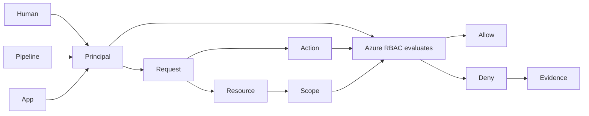
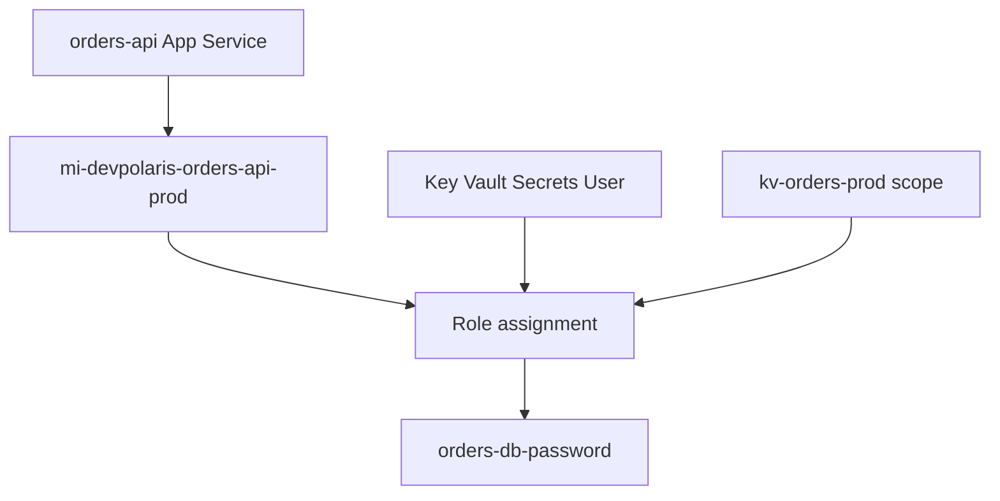

## Table of Contents

1. [The Problem](#the-problem)
2. [What Is Azure RBAC](#what-is-azure-rbac)
3. [An AWS Bridge](#an-aws-bridge)
4. [Microsoft Entra](#microsoft-entra)
5. [Principals](#principals)
6. [Object IDs](#object-ids)
7. [Actions And Resources](#actions-and-resources)
8. [Role Definitions](#role-definitions)
9. [Scopes](#scopes)
10. [Role Assignments](#role-assignments)
11. [Evidence](#evidence)
12. [Sample Access Shape](#sample-access-shape)
13. [Putting It All Together](#putting-it-all-together)
14. [What's Next](#whats-next)

## The Problem

The orders API worked in development. The app was deployed to Azure App Service, the database exists in the right resource group, and the production secret is stored in Key Vault. Then the app starts and fails before it can serve traffic.

```text
2026-05-13T09:02:18Z INFO boot service=orders-api env=prod revision=42
2026-05-13T09:02:19Z ERROR startup failed step=load_database_secret
error="Forbidden: caller is not authorized to perform secrets/get on this key vault"
```

The team now has several questions that sound like one question:

- The deployment succeeded, but the running app still cannot read its secret.
- A developer can see the Key Vault in the Azure portal, but the app cannot read from it.
- A reviewer sees a proposed fix that grants Contributor on the whole subscription.
- An audit log names an object ID, and nobody is sure whether it belongs to a person, an app, a group, or a managed identity.

Those are Azure identity and access questions. The useful beginner question is the same shape as the AWS IAM question:

> Who is asking Azure to do something, what are they asking to do, and which resource are they trying to touch?

Azure answers that question with Microsoft Entra ID for identity and Azure role-based access control, usually called Azure RBAC, for authorization. Once the team can name the caller, action, target, role, and scope, the failure stops being "security is broken." One principal asked for one operation against one resource, and Azure denied that request.

## What Is Azure RBAC

Azure RBAC is the authorization system Azure uses to decide whether a security principal can perform an action on an Azure resource. Authentication answers who the caller is. Authorization answers whether that caller is allowed to do the requested operation.

The failed secret read can be written as a small record:

```text
principal:  5f1f64a4-0a2c-4f3c-91f4-3b9e68b9f6d1
principal type: ServicePrincipal
action:     Microsoft.KeyVault/vaults/secrets/read
target:     /subscriptions/sub-prod/resourceGroups/rg-orders-prod/providers/Microsoft.KeyVault/vaults/kv-orders-prod/secrets/orders-db-password
scope:      /subscriptions/sub-prod/resourceGroups/rg-orders-prod/providers/Microsoft.KeyVault/vaults/kv-orders-prod
decision:   denied
```

That record is the mental model. The principal is the caller Azure sees. The action is the operation being requested. The target is the resource. The scope is the boundary where a role assignment applies. The decision is the result after Azure evaluates role assignments and service-specific rules.



Azure RBAC is not one permission list attached directly to a resource. It is a relationship between three things: a principal, a role definition, and a scope. That relationship is called a role assignment.

The first habit is small: before changing a role, name the principal, the action, and the scope. If any of those are wrong, a broader role may hide the real mistake.

## An AWS Bridge

If you already learned the AWS IAM article, Azure RBAC should feel familiar and slightly different.

AWS IAM often teaches the request as:

```text
principal + action + resource + policy = decision
```

Azure RBAC teaches the same kind of request through a different shape:

```text
principal + role definition + scope = allowed actions at that scope
```

The AWS policy document and the Azure role definition both describe allowed operations. The AWS principal and the Azure principal both represent the caller. The resource still matters in both clouds. The important Azure difference is that a role definition is not access by itself. `Reader` is just a reusable definition until it is assigned to a principal at a scope.

| AWS IAM idea | Azure idea | What to remember |
| --- | --- | --- |
| Principal | Principal in Microsoft Entra ID | The caller may be a human, group, app, or managed identity. |
| Action | Azure operation | Actions are service operations such as reading Key Vault secret metadata or writing blobs. |
| Resource ARN | Azure resource ID | Azure resource IDs include subscription, resource group, provider, type, and name. |
| Policy statement | Role definition | Built-in and custom roles describe allowed operations. |
| Policy attachment | Role assignment | Access appears when a role is assigned to a principal at a scope. |

The comparison is useful because it keeps the request shape familiar. It also prevents a common mistake: copying AWS words too literally. In Azure, scope is not an optional detail at the edge of the policy. Scope is one of the three core pieces of a role assignment.

## Microsoft Entra

Microsoft Entra ID is the identity system behind Azure sign-in. It stores and issues identities for people, groups, applications, service principals, and managed identities. Azure RBAC then uses those identities as principals when it evaluates access to Azure resources.

For the orders API, Microsoft Entra is where the app's managed identity exists. When the app asks Azure for a token, Azure issues a token that represents that identity. Key Vault sees the token, identifies the principal, and checks whether that principal has permission to read the requested secret.

This is why "the app is deployed in the right subscription" is not enough. Resource placement and caller identity are different facts. The Key Vault may be in the same resource group as the app, but the app still needs an identity and that identity still needs a role assignment that covers the vault operation.

Human access has the same separation. A developer can sign in to Azure and still be denied when reading a resource. Sign-in proves who they are. It does not automatically grant permission to every subscription, resource group, vault, database, or storage account they can name.

## Principals

A principal is the identity Azure uses in an access decision. In a small production workflow, several principals may appear even though the team experiences the workflow as one deployment.

| Actor | Example principal | What it should do |
| --- | --- | --- |
| Human support | `maya@devpolaris.example` | Read safe metadata, logs, and evidence during an incident. |
| Deploy pipeline | `sp-devpolaris-orders-deploy` | Update the app and infrastructure it owns. |
| Running app | `mi-devpolaris-orders-api-prod` | Read its own database secret and write its own data. |
| Support group | `grp-prod-support-readers` | Grant the same review role to several humans. |

Keeping those principals separate prevents the wrong fix. If Maya can read secret metadata from the portal, that does not prove the app can read the secret value. If the deploy pipeline can update App Service, that does not prove the runtime identity can call Key Vault. If the audit log shows a managed identity, widening Maya's access will not help the failing app.

Application identities add one extra word pair. An application registration describes an application globally in a tenant. A service principal is the local instance of that application identity in a tenant. For most Azure access reviews, the service principal is the principal that receives role assignments.

Managed identities are service principals that Azure manages for Azure-hosted workloads. The next article spends the full time on that runtime flow.

## Object IDs

Azure names are friendly to humans, but authorization evidence usually needs IDs. Display names can change. Two objects can have similar names. A service principal, group, and managed identity can all be named in a way that looks reasonable in a screenshot.

Object IDs are the stable identifiers that remove that ambiguity. When a role assignment lists a `principalId`, it is naming an object ID. When an audit event names a caller, it may show an object ID. When two identities both look like `orders-api`, the object ID is how you prove which identity received the permission.

A useful review note includes both:

```text
Principal name: mi-devpolaris-orders-api-prod
Principal type: ServicePrincipal
Object ID:      5f1f64a4-0a2c-4f3c-91f4-3b9e68b9f6d1
```

The name helps a person scan the design. The ID keeps the evidence precise.

## Actions And Resources

An action is the operation Azure is being asked to perform. A resource is the Azure object the operation targets. In Azure RBAC, operations are grouped into management-plane actions and data-plane actions.

Management-plane operations manage Azure resources. Creating a storage account, changing an App Service setting, or assigning a role are management operations. Data-plane operations use the data inside a service. Reading a blob, sending a queue message, or reading a Key Vault secret value are data operations.

That split matters because a role that can manage a resource is not always the same as a role that can use the resource's data. A person may be allowed to see that a Key Vault exists without being allowed to read secret values. An app may be allowed to read one secret without being allowed to change vault networking or delete the vault.

| App behavior | Azure operation shape | Resource shape |
| --- | --- | --- |
| Read a database password | Key Vault secret read | One secret in one vault |
| Write an order export | Blob data write | One container or prefix in one storage account |
| Change app settings | App Service configuration write | One web app resource |
| Create a role assignment | Authorization role assignment write | A scope such as a resource group or resource |

The table shows why broad roles are tempting. A Contributor assignment at a resource group can make many management failures disappear. It can also grant far more reach than the app needs. A good design follows the actual behavior: which operation, which resource, which scope, and which principal.

## Role Definitions

A role definition is the reusable set of operations that a principal may perform after the role is assigned. Azure includes built-in roles such as Reader, Contributor, Owner, Key Vault Secrets User, and Storage Blob Data Contributor. Teams can also create custom roles when the built-in roles are too broad or do not match the job.

The role name is only a shortcut. The real meaning lives in the operations the role allows and denies. Reader sounds safe, but Reader at subscription scope can reveal a lot of metadata. Contributor sounds powerful, but it does not include every possible action, and it generally does not grant permission to assign roles. Owner is broader because it includes access management.

Here is the important Azure habit: do not review a role name without reviewing its scope. `Reader` on one resource is narrow. `Reader` on a production subscription is much wider. `Key Vault Secrets User` on one vault is specific. The same role across a large resource group may cover secrets for several apps.

Role definitions also split management and data operations. Key Vault roles are a good example. A role that can manage vault settings is not the same as a role that can read secret values. That split is useful because the platform team can own the vault resource while the application identity receives only the data operation it needs.

## Scopes

Scope is the boundary where a role assignment applies. Azure organizes scopes in a hierarchy:

```text
Management group
  Subscription
    Resource group
      Resource
```

A role assignment at a higher scope is inherited by lower scopes. If a group receives Reader at subscription scope, that access flows to resource groups and resources inside the subscription. If the orders API receives Key Vault Secrets User on one vault, the assignment applies to that vault rather than every vault in the subscription.

Scope is where least privilege becomes real. The role definition says what operations are allowed. Scope says how far those operations travel.

| Scope choice | What it grants | Common risk |
| --- | --- | --- |
| Subscription | Applies across the whole subscription | Easy to over-grant across many systems. |
| Resource group | Applies to all resources in one lifecycle group | Good for team-owned stacks, risky when unrelated apps share the group. |
| Resource | Applies to one specific resource | Narrower evidence, but more assignments to manage. |

For the orders API, the clean target is the Key Vault resource scope. The app does not need Key Vault access across the subscription. It needs to read its own secret from one production vault.

## Role Assignments

A role assignment connects a principal, a role definition, and a scope. This is the point where a reusable role becomes real access.

```text
principal:  mi-devpolaris-orders-api-prod
role:       Key Vault Secrets User
scope:      /subscriptions/sub-prod/resourceGroups/rg-orders-prod/providers/Microsoft.KeyVault/vaults/kv-orders-prod
```

Read that as an access sentence:

```text
The orders API managed identity may read secret values in the production orders vault.
```

That sentence is much safer than:

```text
The orders app has access to production.
```

The first sentence can be checked. The second sentence hides the caller, role, and boundary.

Role assignments can be granted to users, groups, service principals, and managed identities. In most production designs, humans receive access through groups, and workloads receive access through their own identities. That keeps reviews smaller. You review group membership for humans and role assignments for workload identities, instead of chasing one-off access scattered across many resources.

## Evidence

Good Azure security work leaves evidence that a reviewer can inspect without exposing sensitive values. For RBAC, the evidence is usually the principal ID, role name or role definition ID, scope, and target resource ID.

A useful evidence record for the failed orders startup looks like this:

```text
Expected access:
  Principal: mi-devpolaris-orders-api-prod
  Object ID: 5f1f64a4-0a2c-4f3c-91f4-3b9e68b9f6d1
  Role: Key Vault Secrets User
  Scope: /subscriptions/sub-prod/resourceGroups/rg-orders-prod/providers/Microsoft.KeyVault/vaults/kv-orders-prod
  Target secret: orders-db-password
```

Notice what is missing: the secret value. A support engineer should be able to prove that the app can read the right secret without printing the password into a ticket. The same rule applies to storage, queues, databases, and certificates. Evidence should identify the permission path, not leak the data protected by that path.

Access failures are easier to debug when the team follows the request shape:

| Symptom | First question |
| --- | --- |
| App cannot read a secret | Which managed identity is the app using at runtime? |
| Human can see a vault but cannot read values | Does the human have data-plane secret permission, or only management metadata access? |
| Assignment exists but the app is still denied | Is the assignment at the correct scope for the target resource? |
| Audit log shows an unknown GUID | Which Entra object does that object ID represent? |

The boring evidence saves time because it narrows the fix. If the principal is wrong, fix the identity. If the scope is wrong, fix the scope. If the operation is a data-plane operation, choose a role that includes that data operation.

## Sample Access Shape

For the orders API, the production access shape can stay small:



That diagram is deliberately narrower than the whole Azure subscription. The app does not need to own the resource group. It does not need to manage the vault. It does not need every Key Vault role. It needs one workload identity, one data role, and one scope that covers the production vault.

The deploy pipeline has a different shape. It may need permission to update App Service, deploy infrastructure, or attach the managed identity to the app. That does not mean the pipeline should receive permission to read the database secret value. Runtime access and deployment access are different jobs.

## Putting It All Together

Return to the failed startup. The app was deployed, the Key Vault existed, and the secret existed. The missing piece was not "Azure access" in a general sense. The missing piece was a role assignment that connected the app's runtime principal to a role that included the secret read operation at the vault scope.

The count-back is now clear:

- The caller is the app's managed identity, not the human who deployed it.
- The operation is a data-plane secret read, not general portal visibility.
- The target is one secret in one Key Vault.
- The role definition must include that secret read operation.
- The scope should be the vault, not the whole subscription.
- The evidence should show principal ID, role, scope, and target without exposing the secret.

Azure RBAC is easier when it is read as a request system. Start with the request, then read the principal, role definition, and scope. That habit keeps fixes narrow and reviews useful.

## What's Next

Azure RBAC explains how Azure decides whether a caller may do something. The next article explains how a running workload becomes a caller without carrying a password: managed identities.

---

**References**

- [What is Azure role-based access control?](https://learn.microsoft.com/en-us/azure/role-based-access-control/overview)
- [Understand Azure role assignments](https://learn.microsoft.com/en-us/azure/role-based-access-control/role-assignments)
- [Understand scope for Azure RBAC](https://learn.microsoft.com/en-us/azure/role-based-access-control/scope-overview)
- [Application and service principal objects in Microsoft Entra ID](https://learn.microsoft.com/en-us/entra/identity-platform/app-objects-and-service-principals)
