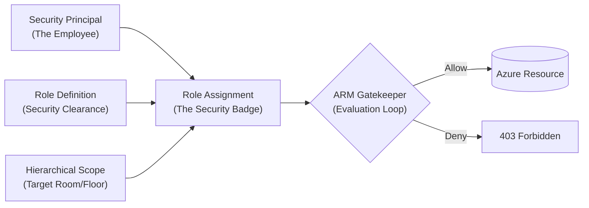
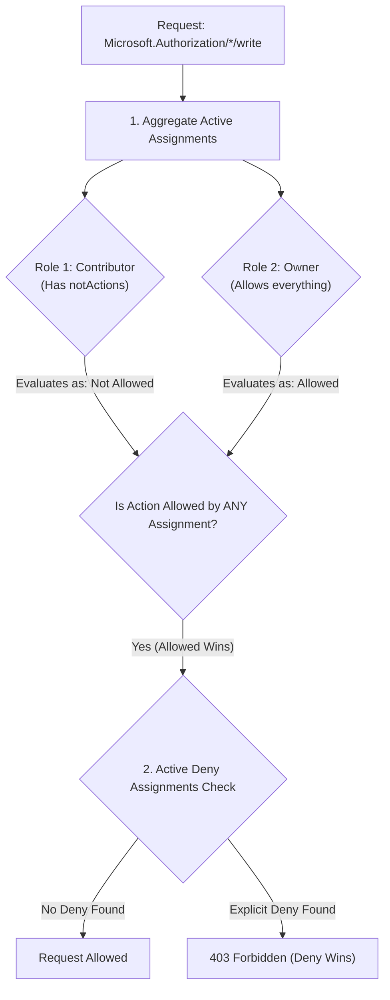
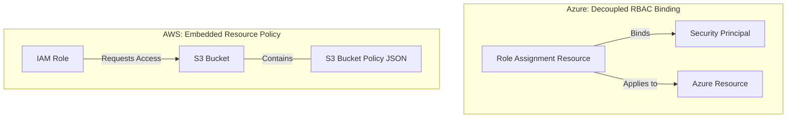
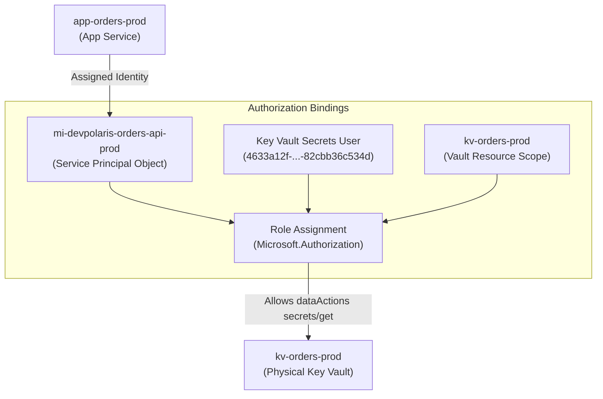

## Table of Contents

1. [Request Evaluation: The Authorization Pipeline](#request-evaluation-the-authorization-pipeline)
2. [An AWS Bridge](#an-aws-bridge)
3. [Microsoft Entra ID Directory Services](#microsoft-entra-id-directory-services)
4. [Differentiating Principals](#differentiating-principals)
5. [The Object ID vs. Application ID Interface](#the-object-id-vs-application-id-interface)
6. [Actions and Resource Planes](#actions-and-resource-planes)
7. [Role Definitions: Structuring Operations](#role-definitions-structuring-operations)
8. [Hierarchical Scopes and Inheritance](#hierarchical-scopes-and-inheritance)
9. [Role Assignments: Binding Scopes](#role-assignments-binding-scopes)
10. [Inspecting CLI Evidence and Mapping GUIDs](#inspecting-cli-evidence-and-mapping-guids)
11. [Sample Access Shape](#sample-access-shape)
12. [Putting It All Together](#putting-it-all-together)
13. [What's Next](#whats-next)

## Request Evaluation: The Authorization Pipeline

Azure role-based access control (Azure RBAC) is the central authorization system used to manage who can perform actions on Azure resources, evaluating every request at the control plane layer before any physical operation is allowed.


*Read every Azure access problem as two gates: first prove who the caller is, then prove what that identity is allowed to do.*

To build a secure cloud architecture, you must understand the absolute boundary between authentication and authorization. Authentication is the act of verifying a caller's identity (who they are). Authorization is the act of verifying whether that authenticated identity has permission to perform a specific action on a specific target resource (what they are allowed to do).



To explain this boundary, think of a high-security research facility. To enter the building, you must present a passport or corporate badge at the front gate. The guard checks your photo, validates your identity, and lets you inside. This is **authentication**.

However, just because you are inside the building does not mean you can walk into any laboratory, open any filing cabinet, or operate any heavy machinery. Each door inside the facility is locked and equipped with a keycard reader. When you tap your badge against a specific door's reader, the security system checks three coordinates:
1.  **The Principal (Who you are)**: Does this badge belong to you?
2.  **The Role Definition (Your security clearance)**: Are you registered as an active researcher, a custodian, or a platform administrator?
3.  **The Scope (The specific room or floor)**: Does your clearance cover this exact door on the third floor, or is it restricted to the development laboratory on the first floor?

Only when all three coordinates align does the keycard reader return success and unlock the door. This is **authorization**.

In the Azure cloud, this three-coordinate relationship is called a **Role Assignment**. It is the absolute foundational binding that makes access real. A role definition (such as `Reader` or `Key Vault Secrets User`) has no effect on its own; it is simply a checklist of allowed operations. Access is only established when that checklist is cabled to an Entra security principal at a specific, designated boundary (the scope).

When a command is run via the CLI or Portal, the Azure Resource Manager (ARM) engine acts as the central security reader at `management.azure.com`. It validates that the access token identifies an authenticated principal, then evaluates that principal's role assignments at the target scope. If a role assignment allows the requested operation, the command is forwarded to the service controller; if not, the request is aborted at the front gate with a `403 Forbidden` REST error.

## An AWS Bridge

If you are coming from AWS, the fundamental requirements of cloud identity remain identical. A microservice still needs an identity to authenticate, a policy to describe permissions, and a boundary to restrict those permissions to a specific database or storage account.

However, AWS IAM and Azure RBAC structure these concepts through different shapes:

```text
AWS: Principal + Action + Resource + Policy Document = Allowed Operations
Azure: Principal + Role Definition + Scope = Role Assignment (Real Access)
```

The differences in how these systems organize security are highly structured:

| AWS IAM Concept | Azure Foundation Equivalent | Architectural Difference |
| :--- | :--- | :--- |
| **IAM Principal (User/Role)** | Entra Security Principal | AWS IAM roles are assumed to obtain temporary sessions; Entra identities are direct principals that receive role assignments directly. |
| **IAM Policy Document** | Role Definition | AWS policies contain explicit `Resource` and `Condition` blocks inside the JSON document; Azure role definitions are reusable checklists of actions without hardcoded targets. |
| **Policy Attachment** | Role Assignment | In AWS, policies are attached directly to users or roles; in Azure, a role assignment connects a principal and a role definition at an explicit, hierarchical scope. |

In AWS IAM, a policy document is self-contained. The JSON document defines both the allowed actions (such as `s3:GetObject`) and the specific resources those actions target (such as `arn:aws:s3:::my-bucket/*`).

Azure RBAC separates these concerns. An Azure role definition is a purely abstract checklist of allowed operations (such as `Microsoft.Storage/storageAccounts/blobServices/containers/blobs/read`). It does not contain any resource paths or subscription IDs inside its definition block. The target boundary is decoupled entirely and applied only when the role is cabled to a principal. This decoupled design makes roles highly reusable: you can define a `Blob Reader` role once, and then assign it to ten different teams at ten completely different subscription scopes.

## Microsoft Entra ID Directory Services

Microsoft Entra ID is the central identity provider and directory service behind Azure. It stores, manages, and secures all identities within your organization. Understanding the Entra directory is vital because Azure RBAC relies entirely on Entra to verify caller credentials before evaluating any access rules.

In a modern cloud deployment, identity management is decoupled from resource hosting. All human user accounts, security groups, application registrations, and workload identities are defined once inside a central corporate catalog called the **Microsoft Entra ID Tenant**.

When a developer signs in to the Azure Portal, or when a container app requests a token at startup, Microsoft Entra ID validates the credentials, evaluates multi-factor authentication policies, and issues a cryptographically signed JSON Web Token (JWT).

This JWT acts as the caller's digital passport. When the caller sends a request to Azure Resource Manager, ARM does not ask the database or storage service to verify the password. Instead, ARM parses the JWT's claims (such as the issuer `iss`, signature, expiration `exp`, and principal ID `oid`) to confirm that Microsoft Entra ID has authenticated the caller. Only after this digital badge is verified does ARM pass the request to the RBAC authorization engine to evaluate whether that specific principal ID holds a valid role assignment at the target scope.

## Differentiating Principals

An Entra security principal is any identity that can be authenticated by Microsoft Entra ID and receive permissions inside Azure. To maintain least privilege, you must differentiate between four distinct principal types:

### 1. User
A directory object representing a physical human being (such as `maya@devpolaris.example`). Human principals should strictly be used for interactive tasks (such as running manual diagnostic CLI queries or inspecting dashboards in the web portal). They must never be hardcoded into automated application deployment scripts or container runtimes.

### 2. Group
A collection of user accounts, service principals, or other groups managed as a single directory object. Utilizing groups is the primary mechanism to simplify administrative overhead. Instead of creating twenty separate role assignments for twenty separate engineers, you assign the role once to a support group (such as `grp-prod-support-readers`). When engineers join or leave the team, you simply update their group membership in Entra ID, and their Azure permissions inherit automatically.

### 3. Application & Service Principal
An application registration is the global blueprint of an application identity in Entra ID. A **Service Principal** is the local instance of that application registration cabled to a specific tenant subscription. Think of the application registration as a compiled `.exe` file, and the service principal as the active, running process instance of that file in your memory space. For automated CI/CD pipelines and deployment scripts, the service principal is the principal that receives role assignments.

### 4. Managed Identity
A specialized service principal managed entirely by Azure for Azure-hosted workloads. They eliminate the need for developers to manage client secrets or rotate keys. Managed identities are cabled directly to the compute hosting layer, allowing the container or virtual machine to obtain secure, ephemeral tokens automatically.

## The Object ID vs. Application ID Interface

To inspect and manage these directory identities, you must understand the absolute difference between two critical GUID properties returned by Microsoft Entra ID: the **Object ID** and the **Application ID** (also called the Client ID).


*The object ID is the security principal that receives access, so copying only an application ID can point your troubleshooting at the wrong identity.*

*   **Application ID (App ID / Client ID)**: This is the stable, logical identifier representing the global application registration in Entra ID. It is shared across all tenants and is used inside your application code and SDKs to specify *which* identity the workload is requesting to use.
*   **Object ID (Principal ID)**: This is the absolute, unique UUID representing the specific service principal instance inside your active tenant directory database.

This distinction is crucial for authorization:

> [!IMPORTANT]
> Azure RBAC role assignments are ultimately bound to the **Object ID (Principal ID)** of the user, group, service principal, or managed identity in the tenant. Some CLI commands can resolve friendly names or application IDs for you, but infrastructure-as-code templates should use the principal/object ID explicitly. If you pass the wrong identifier, the role assignment can fail or bind to a different principal than the workload actually uses.

## Actions and Resource Planes

An action is the specific operation Azure is being asked to execute, while the target resource is the absolute URI address of the object. In Azure, these operations are strictly partitioned into two distinct planes: the **management plane** and the **data plane**.

*   **The Management Plane (Control Plane)**: Manages the administrative metadata and infrastructure boundaries. This includes creating a key vault, deleting a resource group, modifying a virtual network, or provisioning a new SQL database. All management plane requests are handled by ARM at the global endpoint `management.azure.com`.
*   **The Data Plane (Runtime)**: Accesses or alters the actual business data stored inside a resource. This includes reading a secret value out of a key vault, downloading a file blob from a storage container, or querying rows inside a SQL database. Data plane operations are handled directly by the specific service's data endpoints (such as `*.vault.azure.net` or `*.blob.core.windows.net`), bypassing the central ARM control plane for maximum performance.

```text
Management plane action format: {ProviderNamespace}/{ResourceType}/write | delete | read
Data plane action format:       {ProviderNamespace}/{ResourceType}/{SubResource}/[action]/action
```

For example, a role that can manage Key Vault settings needs the management action `Microsoft.KeyVault/vaults/write`. An application that needs to read a database secret value requires the data action `Microsoft.KeyVault/vaults/secrets/read/action` (often grouped under the `dataActions` block of a role definition).

This structural separation ensures that an engineer managing the network infrastructure (control plane) can be completely blocked from reading customer credit card credentials (data plane), maintaining strict security boundaries.

## Role Definitions: Structuring Operations

A role definition is a structured JSON metadata block that lists the precise set of allowed and denied operations. It serves as the master contract of what a principal can do.

Let us inspect the JSON structure of a standard built-in data role definition, `Key Vault Secrets User` (definition ID: `4633a12f-17cd-4111-b297-82cbb36c534d`):

```json
{
  "id": "/providers/Microsoft.Authorization/roleDefinitions/4633a12f-17cd-4111-b297-82cbb36c534d",
  "properties": {
    "roleName": "Key Vault Secrets User",
    "description": "Perform data plane operations on Key Vault secrets.",
    "assignableScopes": [
      "/"
    ],
    "permissions": [
      {
        "actions": [
          "Microsoft.KeyVault/vaults/secrets/readMetadata/action"
        ],
        "notActions": [],
        "dataActions": [
          "Microsoft.KeyVault/vaults/secrets/get/action",
          "Microsoft.KeyVault/vaults/secrets/read/action"
        ],
        "notDataActions": []
      }
    ],
    "type": "Microsoft.Authorization/roleDefinitions"
  }
}
```

Every property in the role definition block defines operational boundaries:

*   **`actions`**: Contains management plane actions. In this role, the only allowed control-plane action is reading secret metadata (`readMetadata/action`), allowing a user or app to list active secret names and expiration dates.
*   **`dataActions`**: Contains data plane actions. This contains the direct GET and READ operations (`secrets/get/action`, `secrets/read/action`) required to decrypt and download the physical secret string value.
*   **`notActions` & `notDataActions`**: Contains explicit exclusions. These are subtracted from the allowed actions list, allowing you to easily define roles like "Contributor on everything, except networking."
*   **`assignableScopes`**: Defines where this role definition can be assigned. A value of `["/"]` means it can be assigned anywhere from the root management group down to individual resources. Custom roles can be restricted to specific subscriptions to prevent accidental cross-department usage.

:::expand[Pitfall: notActions Is Not an Explicit Deny]{kind="pitfall"}
A common security mistake is assuming that `notActions` or `notDataActions` in a role definition behaves as an explicit deny. You might assign a custom role to an engineer that grants administrative access but lists `Microsoft.Authorization/*/write` under `notActions`, thinking you have guaranteed they cannot modify role assignments. However, if that same engineer is also assigned the `User Access Administrator` role (which allows role assignments) at the same scope, the request to write permissions will succeed.

This is because Azure RBAC evaluates authorizations as a logical union of all active role assignments. The `notActions` property is not a deny rule; it is simply a subtraction filter applied to the allowed `actions` list of that *particular* role definition. If a security principal is assigned multiple roles, any action allowed by *at least one* assignment is authorized, completely ignoring the `notActions` filters of the other roles. The only true deny in Azure RBAC is an explicit **Deny Assignment**, which is a system-managed resource (often created by Azure Blueprints or deployment guards) that takes absolute precedence over all allows.

This behavior is identical to AWS IAM. In AWS, listing an operation under `NotAction` in a policy statement does not block that operation if another policy statement grants it. In both clouds, if you want a bulletproof block that overrides all other permissions, you must use an explicit deny construct: an AWS IAM explicit `"Effect": "Deny"` statement, or an Azure Deny Assignment.

The top-down evaluation logic below shows how the authorization engine handles overlapping role assignments:



**Rule of thumb:** Never rely on `notActions` as a security guardrail against overlapping privileges. If a principal must be strictly prevented from executing an action, audit all assigned roles to ensure none of them allow it, or apply an explicit Deny Assignment.
:::

## Hierarchical Scopes and Inheritance

Scope is the precise boundary where a role assignment applies. Azure organizes scopes into a strict, four-level nested hierarchy:


*Assignments flow down the Azure scope tree, which makes broad permissions powerful and dangerous when they are placed too high.*

```text
Management Group (Top-level organizational folders)
  └── Subscription (Billing and quota pools)
        └── Resource Group (Flat lifecycle folders)
              └── Resource (Individual service instances)
```

The fundamental rule of Azure scope is **inheritance**. Any role assignment granted to a principal at a higher scope automatically cascades and applies to all child resources nested below that scope. If you grant `Reader` to a support group at the Subscription scope, every user in that group automatically inherits `Reader` access on every resource group and individual resource inside that subscription.

```text
Subscription Scope Assignment: Reader
  ├── RG A Scope (Inherits: Reader)
  │     └── Virtual Machine A (Inherits: Reader)
  └── RG B Scope (Inherits: Reader)
        └── Storage Account B (Inherits: Reader)
```

This inheritance behavior simplifies governance but introduces significant risk. If you grant an application's managed identity `Contributor` access at the resource group scope, the app inherits management plane control over every resource in that group. If a developer accidentally deploys an unrelated database into that same group, the app automatically obtains administrative power over it.

To maintain a secure system, always choose the **lowest practical scope** for role assignments. If a container app only needs to read secrets from one specific vault, assign the `Key Vault Secrets User` role at the **Resource scope** of that specific vault, leaving the parent resource group completely un-authorized.

## Role Assignments: Binding Scopes

A role assignment is the physical binding that makes access active. It is an independent ARM resource managed by the `Microsoft.Authorization` resource provider. It maps a security principal ID (Object ID) to a role definition ID at a specific scope.

```text
Role Assignment Resource ID:
/subscriptions/{subId}/resourceGroups/{rgName}/providers/Microsoft.KeyVault/vaults/kv-orders-prod/providers/Microsoft.Authorization/roleAssignments/{assignmentGuid}
```

This path shows that the role assignment itself is a child resource cabled directly to the target scope.

Under the hood, when ARM evaluates a request, it runs a highly structured **Access Evaluation Loop**:

1.  **Scope Tree Scan**: ARM parses the target resource ID and traces the parent tree upwards from the resource to the resource group, subscription, and management groups.
2.  **Assignment Aggregation**: ARM queries the `Microsoft.Authorization` provider database and pulls all active role assignments matching the caller's principal ID (or any group IDs the caller belongs to) across that entire scope path.
3.  **Operation Check**: ARM matches the requested HTTP verb (such as `DELETE`) or service data action against the aggregated list of allowed actions.
4.  **Deny Check**: ARM evaluates whether any explicit **Deny Assignments** (often placed by Azure Blueprints or deployment guards) cover the target resource. Deny assignments are absolute; they take precedence over any allow assignments.
5.  **Binary Decision**: If the action is allowed and no deny matches, ARM returns success and routes the request; otherwise, it returns a `403 Forbidden` error.

:::expand[Design: Why Role Assignments Are First-Class ARM Resources]{kind="design"}
Azure RBAC models every role assignment as a separate, first-class resource under the `Microsoft.Authorization/roleAssignments` provider. Rather than embedding permission lists inside the security principal (e.g., as attributes on an Entra user account) or inside the target resource (e.g., as a property inside the storage account config), the authorization binding is a distinct resource cabled between them.

The primary design driver for this architectural choice is central auditing and compliance decoupling. Because role assignments are independent ARM resources, a security team can audit every single permission across a subscription with a single query to the ARM control plane (`az role assignment list`). They do not need to query the internal state of every virtual machine, database engine, or storage container. It also maintains clean decoupling: the team managing the database resource does not need write access to the identity directory, and the identity team does not need database access to grant permissions.

The tradeoff of this design is deployment orchestration complexity. When provisioning a workload using Bicep or Terraform, you cannot simply declare "grant app access" as a property inside the SQL database block. You must write a third, distinct resource block for the role assignment that references the IDs of both the application and the database.

This stands in contrast to AWS IAM, which supports both identity-based policies and embedded resource-based policies (such as Amazon S3 Bucket Policies or KMS Key Policies). While AWS resource-based policies allow quick, local access configuration, they complicate centralized compliance tracking because security scanners must crawl and parse both IAM policy attachments and individual resource-level JSON documents to find who has access.

The top-down diagram below compares Azure's decoupled first-class binding with the embedded resource policy model:



**Rule of thumb:** Treat role assignments as independent infrastructure dependencies. When writing Bicep or Terraform modules, separate the resource deployment from its RBAC assignments, allowing the database to deploy first and binding the permissions in a downstream step.
:::

## Inspecting CLI Evidence and Mapping GUIDs

To audit these permission coordinates directly from the terminal, you use the Azure CLI to query active role assignments.

Let us execute a terminal session to list all active role assignments for our production key vault scope:

```bash
$ az role assignment list \
    --scope "/subscriptions/88888888-4444-4444-4444-121212121212/resourceGroups/rg-orders-prod-uksouth/providers/Microsoft.KeyVault/vaults/kv-orders-prod" \
    --output json
```

This terminal command queries the ARM engine to return the collection of active role assignments:

```json
[
  {
    "id": "/subscriptions/88888888-4444-4444-4444-121212121212/resourceGroups/rg-orders-prod-uksouth/providers/Microsoft.KeyVault/vaults/kv-orders-prod/providers/Microsoft.Authorization/roleAssignments/e5e5e5e5-f5f5-4444-9999-000000000000",
    "principalId": "5f1f64a4-0a2c-4f3c-91f4-3b9e68b9f6d1",
    "principalType": "ServicePrincipal",
    "roleDefinitionId": "/subscriptions/88888888-4444-4444-4444-121212121212/providers/Microsoft.Authorization/roleDefinitions/4633a12f-17cd-4111-b297-82cbb36c534d",
    "roleDefinitionName": "Key Vault Secrets User",
    "scope": "/subscriptions/88888888-4444-4444-4444-121212121212/resourceGroups/rg-orders-prod-uksouth/providers/Microsoft.KeyVault/vaults/kv-orders-prod"
  }
]
```

This returns exact permission evidence. If you see an anonymous GUID inside the `principalId` field and need to map it back to an actual Entra ID directory object, you run the service principal show query:

```bash
$ az ad sp show --id "5f1f64a4-0a2c-4f3c-91f4-3b9e68b9f6d1" --query "{displayName:displayName, appId:appId, objectId:id}" --output json
```

This terminal execution queries the Microsoft Entra directory to resolve the anonymous Object ID:

```json
{
  "appId": "1d6d5d2d-25d8-4d4a-92a0-d58df00f55e1",
  "displayName": "mi-devpolaris-orders-api-prod",
  "objectId": "5f1f64a4-0a2c-4f3c-91f4-3b9e68b9f6d1"
}
```

This output provides clear directory coordinates, mapping the anonymous `principalId` to our production managed identity (`mi-devpolaris-orders-api-prod`), and confirming that the workload holds the necessary access to the vault.

## Sample Access Shape

For a secure orders microservice, the authorization landscape remains compact:



This diagram maps a highly secure deployment model. The container app runs with a dedicated managed identity. That identity holds exactly one role assignment cabled strictly to the individual Key Vault resource scope. It cannot touch other vaults, cannot scale the resource group, and has no control plane permissions, keeping the production blast radius extremely tight.

## Putting It All Together

Operating a secure, transparent cloud hierarchy requires evaluating every access request through the structural pipeline of Azure RBAC:

*   **Cable Role Assignments**: Access is never a flat setting on a resource; it is a three-coordinate relationship connecting a Principal ID, a Role Definition, and a Scope.
*   **Isolate Management from Data**: Differentiate between control plane actions (`management.azure.com`) and data plane actions (`*.vault.azure.net`) to prevent administrative over-granting.
*   **Apply the Lowest Scope**: Avoid assigning roles at the subscription or resource group scope, anchoring permissions strictly to individual resource scopes.
*   **Target the Object ID**: When scripting deployments or configuring Bicep templates, always pass the Entra Object ID (Principal ID), bypassing the App ID.
*   **Leverage Hierarchical Inheritance**: Recognize that permissions flow downwards from management groups to resources, auditing parent scopes continuously for access creep.

## What's Next

We have established the core mechanics of request evaluation, role definitions, hierarchical scopes, and role assignments. Now we are ready to answer the runtime authentication question: how does our running application code securely prove its identity to ARM without carrying passwords or storing API keys? In the next article, we will go deep into managed identities. We will trace system-assigned and user-assigned lifecycles, and dissect the step-by-step token flow handshake.


*Use this as the RBAC checklist: identify the principal, choose the role, place it at the narrowest useful scope, then verify the assignment and evidence before trusting access.*


---

**References**

* [What is Azure role-based access control?](https://learn.microsoft.com/en-us/azure/role-based-access-control/overview) - Core architecture of the Azure authorization engine.
* [Understand Azure role assignments](https://learn.microsoft.com/en-us/azure/role-based-access-control/role-assignments) - Anatomy and lifecycle of role binding resources.
* [Scope of Azure RBAC](https://learn.microsoft.com/en-us/azure/role-based-access-control/scope-overview) - Detailed reference for the hierarchical scope levels.
* [Entra Application and Service Principal Objects](https://learn.microsoft.com/en-us/entra/identity-platform/app-objects-and-service-principals) - Differences between app registrations and local principals.
