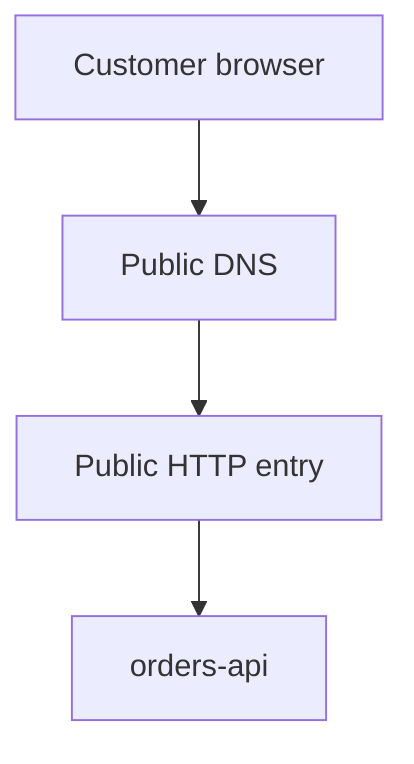
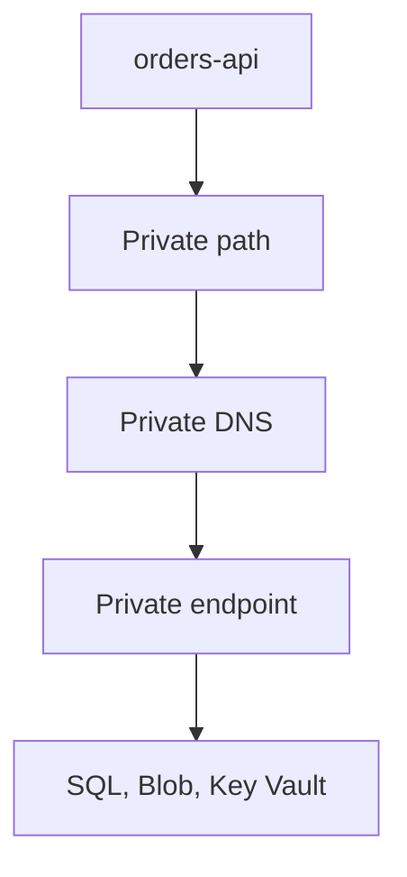
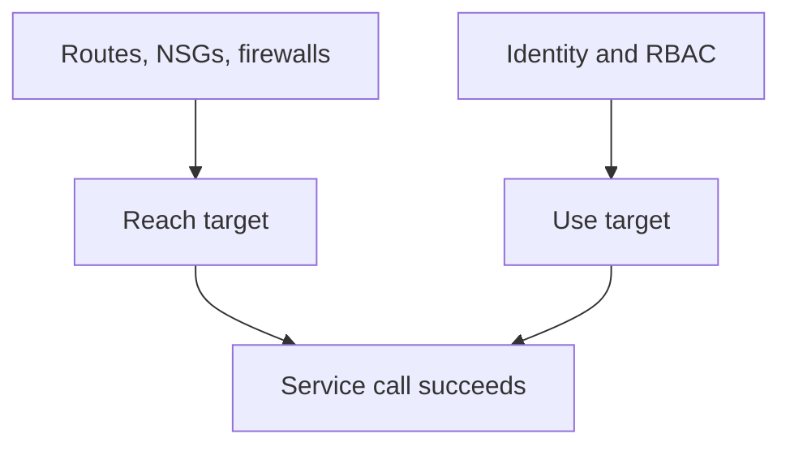

## Table of Contents

1. [The Traffic Questions Before Production](#the-traffic-questions-before-production)
2. [The Orders API Request Path](#the-orders-api-request-path)
3. [The Seven Checks In Order](#the-seven-checks-in-order)
4. [Evidence From A Broken Checkout](#evidence-from-a-broken-checkout)
5. [Failure Modes And Fix Directions](#failure-modes-and-fix-directions)
6. [A Beginner Network Review Habit](#a-beginner-network-review-habit)
7. [What The Later Articles Own](#what-the-later-articles-own)

## The Traffic Questions Before Production

The phrase "the network is broken" is too large to debug.
It can mean a browser reached the wrong public endpoint.
It can mean a backend resolved a database name to a public address when it expected a private one.
It can mean Azure chose a route through a firewall that did not allow the destination.
It can mean a network security group blocked a new connection.
It can mean the target service accepted the network path and then rejected the caller's identity.

A beginner's first win is not memorizing every Azure networking service.
The first win is learning to shrink the vague complaint into a path question:
from which caller, to which name, to which resolved address, over which route, through which rule, into which service gate, using which identity?

That question gives every layer a job.
The public entry decides where customer traffic first arrives.
The private area decides where internal resources live or connect.
DNS decides what destination address the caller tries.
Routes decide the next hop for that address.
Network security rules decide whether a new connection may pass.
The target service's own network gate decides whether this path is accepted.
Identity and authorization decide whether the caller can use the service after reachability works.

Those checks are separate on purpose.
Separation lets a team expose one public API without exposing every database, vault, queue, and storage account behind it.
Separation also creates failure modes that look confusing when you read only the application error.
An application log may say `ETIMEDOUT`, but that does not tell you whether DNS, routing, an NSG, a firewall, or a private endpoint is the first wrong layer.

This article follows one operational story.
The DevPolaris team runs `orders.devpolaris.com` for customer checkout.
Behind that public name is `orders-api`, a backend that accepts order requests, stores order records in Azure SQL, writes invoice exports to Blob Storage, and reads secrets from Key Vault.
Customers must reach the API over HTTPS.
The database, storage account, and vault should not become general public targets just because the API needs them.

That is the shape most production services eventually need.
One side is public because users have to call it.
The other side is private because dependencies hold data, secrets, or operational control.
The design work is deciding where the public path stops and where the private paths begin.

If you already know some cloud networking, keep the broad ideas.
Azure has private address spaces, subnets, route tables, packet filters, DNS, private service access, and public entry services.
The exact Azure names matter later, but the overview mental model is simpler:
follow the request, then ask what evidence proves each hop.

Here is the smallest useful incident sentence:

```text
Caller:
  customer browser

Name:
  orders.devpolaris.com

Expected path:
  public HTTP entry -> orders-api -> private SQL endpoint

Symptom:
  checkout returns 502 during payment confirmation
```

That sentence is already better than "network broken."
It names the caller.
It names the public hostname.
It names the first expected path.
It also leaves room for a second path, because the customer request can reach the API while the API fails to reach SQL.

The tradeoff begins here.
A wide-open network is faster to test because fewer gates can block you.
A narrow network is easier to defend and review because every path has to be named.
Production teams usually accept the setup cost of narrow paths because the alternative is a system where nobody can answer a simple audit question: from where can order data be reached?

## The Orders API Request Path

Let's give the running example a concrete shape.
The public request starts outside Azure.
A customer browser calls `https://orders.devpolaris.com/orders`.
Public DNS answers with the public HTTP entry point.
That entry point could be Azure Front Door, Application Gateway, App Service ingress, Container Apps ingress, or another approved entry pattern.
This overview does not choose the entry product for you.
It asks you to name the entry and prove that it forwards only the traffic you intended.

After the public entry, the request reaches `orders-api`.
The API may run in a service that is directly integrated with a virtual network, or it may run on compute resources placed inside a subnet.
The detail differs by runtime service.
The mental model does not.
The API needs a private path to dependencies that should not be exposed as public application surfaces.

The most useful overview is not a full architecture diagram.
It is a set of request path diagrams.
Read these as the path of one checkout request and the API's dependency calls, not as a list of Azure products to buy.
Splitting the view keeps each question visible.

First, there is the public path that lets a customer reach the API.



Next, there is the private path the API uses when it calls managed services.
The API still uses normal service hostnames in connection strings.
Private DNS and private endpoints change where those names land from inside the right network.



Finally, there are the checks around that path.
Network controls decide whether the flow can reach the target.
Identity and service permissions decide whether the reached target will accept the operation.



Notice the split across the three views.
The public path exists so customers can place orders.
The private path exists so the API can use dependencies without turning those dependencies into public application entry points.
This is why the word "endpoint" can be slippery in Azure conversations.
The API has a public endpoint for users.
SQL, Blob Storage, and Key Vault may have private endpoints for the API.
Those are different jobs.

Now turn the diagram into a review record.
This is the kind of small artifact a team can put in a design issue before production.

| Path piece | Expected evidence | Why it matters |
|------------|-------------------|----------------|
| Public name | `orders.devpolaris.com` resolves to the approved HTTP entry | Users follow DNS before they ever reach the app |
| Public entry | HTTPS listener, route, backend health, and TLS binding are configured on the chosen entry service | The public door should be intentional and observable |
| Private area | `orders-api` runs in, or integrates with, the production virtual network path | Private dependencies are reachable only if the runtime has a private network path |
| DNS answer | SQL, Blob, and Key Vault hostnames resolve to private endpoint IPs from the app environment | DNS chooses the destination address before routes or rules can help |
| Route and next hop | The app subnet or integration path has an effective route to that destination | Routes decide where traffic goes next |
| NSG or rule | The relevant rule allows the source, destination, protocol, and port | Packet filters decide whether new flows may pass |
| Service gate | The target service allows the private endpoint, subnet, or firewall path | Managed services have their own network access controls |
| Identity | The runtime identity, database login, or token is authorized | Network reachability does not grant data access |

The table is not a replacement for the later articles.
It is the overview contract.
The public entry article will spend more time on records, validation, TLS, health probes, and cutovers.
The VNet article will spend more time on address planning, subnets, and route tables.
The NSG article will spend more time on priorities, default rules, and application security groups.
The private access article will spend more time on Private Link, private endpoints, service endpoints, resource firewalls, and private DNS.
This article gives you the order in which to think when a real request fails.

## The Seven Checks In Order

Start with the public entry.
If the caller is a customer browser, the first question is not "which subnet is wrong?"
The first question is "what public name did the browser call, and where did that name send it?"
For `orders.devpolaris.com`, a healthy public lookup should land on the approved entry service for production.

```bash
$ nslookup orders.devpolaris.com
Server:  resolver.devpolaris.net
Address: 10.10.0.10

Non-authoritative answer:
orders.devpolaris.com canonical name = fd-devpolaris-prod.azurefd.net.
Name:    fd-devpolaris-prod.azurefd.net
Address: 203.0.113.42
```

The important fact is not the example IP.
The important fact is that the public name points at the production entry target the team intended.
If this lookup points at staging, an old gateway, or a deleted provider hostname, no subnet rule inside the app network will fix the customer path.

Then check the public HTTP response.
DNS can be correct while the entry route is wrong.
The entry can answer HTTPS while forwarding to the wrong backend pool.
A small `curl` check can tell you whether the public door and the app agree on the environment.

```bash
$ curl -i https://orders.devpolaris.com/health
HTTP/2 200
content-type: application/json
x-entry: fd-devpolaris-prod
x-backend: orders-api-prod

{"status":"ok","service":"orders-api","environment":"prod"}
```

Headers like these are examples, not Azure defaults.
Many teams add lightweight diagnostic headers or health response fields during controlled checks.
The point is to prove that the friendly name, HTTP entry, and backend environment line up before you chase private dependencies.

Next, name the private area.
In Azure, the main private network boundary is a Virtual Network, usually shortened to VNet.
Microsoft describes Azure Virtual Network as the fundamental building block for private networks in Azure.
For our purposes, the VNet is the controlled private area where resources can use private addresses, apply routes, apply network filtering, and integrate with Azure services.

For `orders-api`, the private area review might be this simple:

```text
Runtime:
  orders-api-prod

Network path:
  vnet-devpolaris-prod

App placement or integration:
  snet-orders-app-prod

Private endpoint placement:
  snet-orders-private-endpoints-prod

Private dependency targets:
  sql-devpolaris-orders-prod
  stdevpolarisordersprod
  kv-devpolaris-orders-prod
```

Do not overread this inventory.
It does not prove the app can connect.
It only names the network area and the dependencies that should use private paths.
That naming step still matters because it stops the team from inspecting the wrong resource group, subscription, environment, or VNet.

Now check DNS from the same kind of place where the app runs.
DNS is not a global truth for every caller.
A public laptop and an app inside a VNet can receive different answers for the same service hostname when private DNS is configured.
That is useful, but it can also hide the bug.

Here is the kind of SQL lookup the orders team wants from the app network:

```bash
$ nslookup sql-devpolaris-orders-prod.database.windows.net
Server:  168.63.129.16
Address: 168.63.129.16

Non-authoritative answer:
sql-devpolaris-orders-prod.database.windows.net canonical name = sql-devpolaris-orders-prod.privatelink.database.windows.net.
Name:    sql-devpolaris-orders-prod.privatelink.database.windows.net
Address: 10.42.20.4
```

The `privatelink` name and the `10.42.20.4` private address tell a clear story.
The normal SQL hostname resolves, inside this network context, to the private endpoint address.
That is the DNS steering the design expects.

Compare it with a broken private path:

```bash
$ nslookup sql-devpolaris-orders-prod.database.windows.net
Server:  168.63.129.16
Address: 168.63.129.16

Non-authoritative answer:
Name:    sql-devpolaris-orders-prod.database.windows.net
Address: 20.49.104.18
```

This does not prove the database is reachable or unreachable by itself.
It proves the app did not get the private endpoint destination.
If the target service has public network access disabled, this DNS answer is enough to explain a timeout.
The fix direction is private DNS, VNet links, endpoint DNS zone groups, or custom DNS forwarding, not a random NSG change.

After DNS, inspect the route.
Routes do not decide the name.
They route the destination IP address produced by DNS.
Azure creates system routes for subnets in a virtual network, and custom route tables can change selected next hops.
The beginner question is always concrete:
for this destination IP, which next hop wins?

For the SQL private endpoint address, a healthy route picture might be:

```text
Effective route check from orders-api network path

Destination tested:
  10.42.20.4

Winning route:
  address prefix: 10.42.0.0/16
  next hop type: Virtual network
  source: Default

Meaning:
  traffic to the SQL private endpoint stays inside the VNet path
```

For an external payment API, the route might intentionally be different:

```text
Effective route check from orders-api network path

Destination tested:
  198.51.100.25

Winning route:
  address prefix: 0.0.0.0/0
  next hop type: Virtual appliance
  next hop IP: 10.42.40.4
  source: User

Meaning:
  internet-bound traffic is sent through the approved firewall path
```

That route can be correct and still cause a failure.
If the firewall path is intentional, the firewall must allow the destination and know how to forward the traffic.
Removing the route may restore a test quickly, but it also bypasses the inspection design the platform team chose.
That is the tradeoff: direct outbound access is simpler, while centralized inspection gives the team a stronger control point and another operational dependency to maintain.

After route, inspect the rule.
In Azure, a network security group, or NSG, contains inbound and outbound rules that allow or deny traffic.
The rule has a direction, source, destination, protocol, port, priority, and action.
Lower priority numbers are processed before higher numbers, and NSG changes affect new connections.

For a beginner, the right question is not "does an allow rule exist somewhere?"
The right question is "which rule matches this new flow first?"

Here is a compact route and rule evidence table for `orders-api`:

| Flow | DNS answer | Winning route | Rule evidence | First conclusion |
|------|------------|---------------|---------------|------------------|
| Browser to `orders.devpolaris.com:443` | Public entry address | Public internet path to entry service | Entry listener allows HTTPS | Public door is reachable |
| Entry to `orders-api:443` | Backend private or service address | Entry service route to backend | Backend access rule allows entry source on 443 | Public entry can forward to API |
| API to SQL `1433` | `10.42.20.4` | VNet route | Outbound app rule and service gate allow SQL path | Network path is likely correct |
| API to Blob `443` | `10.42.20.7` | VNet route | Outbound app rule and storage gate allow private endpoint path | Export path is likely correct |
| API to payment provider `443` | Public provider address | Firewall next hop | Firewall rule allows provider host or IP range | Outbound internet path is controlled |

The table forces precision.
It separates the DNS answer from the route.
It separates the route from the packet filter.
It separates network reachability from the service's own gate.
When a column is unknown, that is the next check.

Now check the service gate.
Managed Azure services can have their own network access controls.
Storage accounts, SQL servers, and Key Vaults can restrict public access, allow selected virtual networks, use private endpoints, and require private endpoint approval depending on the service and configuration.
A private endpoint is a network interface with a private IP address in your VNet that connects privately to a specific service resource through Azure Private Link.

The private endpoint is not the same thing as permission to read data.
It is also not the same thing as disabling every public path automatically.
For a production review, write the service gate as a small record:

```text
SQL service gate

Private endpoint:
  pe-sql-orders-prod

Private IP:
  10.42.20.4

Connection state:
  Approved

Public network access:
  Disabled

Expected DNS from app network:
  sql-devpolaris-orders-prod.database.windows.net -> 10.42.20.4
```

That record says the private access path is intentional.
If public network access is disabled and DNS still points to a public address, the app will fail even if the identity is perfect.
If the private endpoint is pending approval, the DNS answer may look promising while the service still rejects the connection path.

Finally, inspect identity after reachability.
This is where many beginners lose time because a `403` feels like a network block.
It usually is not.
A `403` means something answered and refused the caller.
That can happen after the private path works.

```text
2026-05-03T10:22:15Z ERROR secret lookup failed
service=orders-api
vault=https://kv-devpolaris-orders-prod.vault.azure.net
resolvedAddress=10.42.20.9
httpStatus=403
message="Caller is not authorized to perform action on resource"
```

The private address is a clue that DNS probably used the private endpoint.
The HTTP status is a clue that the network path reached Key Vault far enough for the service to make an authorization decision.
The next fix is not to open the network wider.
The next fix is to check the app's managed identity, role assignment, access policy model, or secret permission, depending on how that vault is configured.

## Evidence From A Broken Checkout

Now put the order into a small incident.
At 09:12, support reports that customers can open the checkout page, but placing an order returns a generic failure.
The frontend call to `POST /orders` returns `502`.
The API logs show timeouts to SQL.

Start with the public path, because users are involved.

```bash
$ nslookup orders.devpolaris.com
Server:  resolver.devpolaris.net
Address: 10.10.0.10

Non-authoritative answer:
orders.devpolaris.com canonical name = fd-devpolaris-prod.azurefd.net.
Name:    fd-devpolaris-prod.azurefd.net
Address: 203.0.113.42
```

The public name points at the production entry.
That does not close the incident, but it keeps the team from editing a DNS record that already matches the design.

Next, test the entry health endpoint.

```bash
$ curl -i https://orders.devpolaris.com/health
HTTP/2 200
content-type: application/json
x-entry: fd-devpolaris-prod
x-backend: orders-api-prod

{"status":"ok","database":"degraded","service":"orders-api"}
```

This is a better clue than a red dashboard tile.
The public entry can reach the API.
The API is alive enough to return health.
The API itself says the database dependency is degraded.
The incident moves from "public entry problem" toward "API to SQL path problem."

The application log agrees:

```text
2026-05-03T09:17:42Z WARN checkout dependency failed
service=orders-api
operation=createOrder
dependency=sql
host=sql-devpolaris-orders-prod.database.windows.net
resolvedAddress=20.49.104.18
port=1433
error="connect ETIMEDOUT 20.49.104.18:1433"
```

That log line is valuable because it includes the resolved address.
The app is trying a public SQL address.
If the production design requires a private endpoint, the first suspicious layer is DNS.

Run the lookup from the app network context or from a controlled test host that uses the same resolver path.

```bash
$ nslookup sql-devpolaris-orders-prod.database.windows.net
Server:  custom-dns.devpolaris.internal
Address: 10.42.10.10

Non-authoritative answer:
Name:    sql-devpolaris-orders-prod.database.windows.net
Address: 20.49.104.18
```

The custom DNS server is returning the public address.
The Azure private DNS zone may exist, but this resolver path is not using it.
For example, the private zone may not be linked to the VNet, or the custom DNS server may lack a conditional forwarder for the `privatelink.database.windows.net` zone.

At this point, changing an NSG would be noise.
The destination is wrong before routing and NSG evaluation become useful.
The fix direction is to repair private DNS resolution, then retest the same name from the same network context.

After the DNS fix, the evidence should change:

```bash
$ nslookup sql-devpolaris-orders-prod.database.windows.net
Server:  custom-dns.devpolaris.internal
Address: 10.42.10.10

Non-authoritative answer:
sql-devpolaris-orders-prod.database.windows.net canonical name = sql-devpolaris-orders-prod.privatelink.database.windows.net.
Name:    sql-devpolaris-orders-prod.privatelink.database.windows.net
Address: 10.42.20.4
```

Only now does it make sense to inspect route and rule evidence for `10.42.20.4`.

| Check | Observed evidence | Meaning | Next action |
|-------|-------------------|---------|-------------|
| DNS answer | SQL hostname resolves to `10.42.20.4` | App is targeting the private endpoint | Continue to route check |
| Effective route | `10.42.0.0/16 -> Virtual network` | Destination stays on the VNet path | Continue to rule check |
| NSG outbound | App subnet allows TCP `1433` to private endpoint subnet | New SQL connection should pass app subnet filter | Continue to service gate |
| Private endpoint | `pe-sql-orders-prod` is `Approved` | Private Link connection is ready | Continue to identity or SQL logs |
| SQL auth | Login succeeds for app identity or configured credential | Network and auth agree | Verify order write path |

The table is intentionally boring.
Good incident evidence should become boring as you narrow it.
Each row either agrees with the design or points at the next layer.

After recovery, the app log should also change from timeout to either success or a more specific service response.

```text
2026-05-03T09:31:08Z INFO checkout dependency recovered
service=orders-api
operation=createOrder
dependency=sql
host=sql-devpolaris-orders-prod.database.windows.net
resolvedAddress=10.42.20.4
port=1433
latencyMs=18
```

That line proves more than "green now."
It proves the app is using the private endpoint address during the recovered path.

## Failure Modes And Fix Directions

A good networking overview should make common failures feel recognizable.
The point is not to memorize every Azure setting.
The point is to classify the symptom before you change the system.

The first failure mode is wrong public entry.
Users call `orders.devpolaris.com`, and the name resolves, but it points to the wrong environment.

```bash
$ curl -i https://orders.devpolaris.com/health
HTTP/2 200
content-type: application/json
x-entry: fd-devpolaris-staging
x-backend: orders-api-staging

{"status":"ok","environment":"staging"}
```

The fix direction is the public DNS record or the entry service custom domain route.
Do not start by changing private endpoint DNS.
The public request has already landed on the wrong public door.

The second failure mode is private DNS drift.
The app reaches for SQL, but the hostname resolves to a public address while the design expects a private endpoint.

```text
Symptom:
  checkout writes time out

App evidence:
  resolvedAddress=20.49.104.18
  error="connect ETIMEDOUT 20.49.104.18:1433"

Expected:
  sql-devpolaris-orders-prod.database.windows.net -> 10.42.20.4
```

The fix direction is the private DNS zone, VNet link, endpoint DNS zone group, or custom DNS forwarding path.
Opening SQL public access may make a test pass, but it changes the security shape.
Use that only as an explicit emergency decision with rollback, not as a quiet fix.

The third failure mode is a route that sends traffic to a control point that is not ready.
For example, a route table sends all unknown destinations to a firewall, but the firewall does not allow the payment provider.

```text
Route evidence:
  destination: 198.51.100.25
  matching prefix: 0.0.0.0/0
  next hop type: Virtual appliance
  next hop IP: 10.42.40.4

Firewall evidence:
  action=deny
  source=10.42.1.18
  destination=198.51.100.25
  destinationPort=443
  reason="no matching application rule"
```

The fix direction is not automatically "remove the route."
First decide whether `orders-api` should call that external service.
If yes, add the narrow firewall rule or approved outbound pattern.
If no, the deny is doing its job and the app configuration needs correction.

The fourth failure mode is an NSG priority mistake.
DNS and route evidence look correct, but a deny rule is evaluated before the intended allow rule.

```text
Flow:
  orders-api subnet -> Blob private endpoint

Destination:
  10.42.20.7:443

NSG evidence:
  priority 140 Deny TCP from snet-orders-app-prod to 10.42.20.0/24
  priority 220 Allow TCP from snet-orders-app-prod to 10.42.20.7:443

Result:
  deny wins because lower priority numbers are processed first
```

The fix direction is to correct the priority or scope of the rules.
Do not add a broad allow for the whole VNet if the intended flow is only app to Blob over `443`.
The specific rule is easier to review later.

The fifth failure mode is mixing reachability with authorization.
The app reaches Key Vault over the private path, but Key Vault returns `403`.

```text
2026-05-03T10:22:15Z ERROR secret lookup failed
service=orders-api
vault=https://kv-devpolaris-orders-prod.vault.azure.net
resolvedAddress=10.42.20.9
httpStatus=403
message="Caller is not authorized to perform action on resource"
```

The fix direction is identity and permission.
Check which managed identity the runtime uses.
Check whether that identity has the right role assignment or access policy for the secret operation.
The private endpoint did not replace authentication.
It only shaped the network path.

The sixth failure mode is an approved private endpoint with a still-open public service path.
This is not always visible as an outage.
It is often a review finding.

```text
Review finding:
  pe-blob-orders-prod exists and resolves to 10.42.20.7 from the app network
  storage account public network access still allows all networks

Risk:
  production app uses the private path, but the storage account still accepts public network attempts
```

The fix direction is to align the service firewall or public network access setting with the design.
Do this carefully because other jobs, data pipelines, or admin workflows might still rely on public access.
The tradeoff is real:
closing public access improves the boundary, but it can break unmanaged callers that were never documented.
The right answer is not to keep public access forever.
The right answer is to find the callers, give them an approved path, and then close the wider door.

## A Beginner Network Review Habit

Before you create or change Azure networking for a service, write the path in plain English.
If the path sounds vague in English, it will become vague in Azure.

For `orders-api`, a healthy review note might look like this:

```text
Network review: orders-api production

Public request:
  Customers call https://orders.devpolaris.com.
  The public name resolves to the approved production HTTP entry.
  The entry forwards HTTPS traffic to orders-api only after its backend health check passes.

Private dependencies:
  orders-api uses the production VNet path.
  SQL resolves to 10.42.20.4 from the app network.
  Blob Storage resolves to 10.42.20.7 from the app network.
  Key Vault resolves to 10.42.20.9 from the app network.

Routes:
  Private endpoint traffic stays on the VNet path.
  External payment traffic goes through the approved outbound firewall path.

Rules and gates:
  NSGs allow only the required app flows.
  Service firewalls and private endpoint approvals match the private access design.

Identity:
  The runtime identity still needs permission to read secrets, write order records, and write export blobs.
```

That note is short enough to keep current.
It also creates a debugging map.
When a checkout fails, the team can move through the same rows instead of changing whichever setting looks familiar.

Use this incident checklist when the symptom is still vague:

| Step | Question | Evidence to collect | Common wrong turn |
|------|----------|---------------------|-------------------|
| 1 | Who is the caller? | Browser, entry service, app runtime, job, or admin workstation | Debugging the app-to-SQL path when the customer never reached the entry |
| 2 | What name did it call? | Hostname in request, config, log, or connection string | Assuming the app used the hostname you expected |
| 3 | What address did DNS return from that caller's context? | `nslookup`, resolver logs, or app log field | Testing DNS from a laptop when the app uses a different resolver |
| 4 | Which route matches that address? | Effective route or route table evidence | Blaming NSGs before proving the next hop |
| 5 | Which rule matches the new flow? | Effective security rule, NSG rule, firewall rule | Seeing an allow rule but missing an earlier deny |
| 6 | Does the service accept that network path? | Private endpoint state, service firewall, public access setting | Forgetting that managed services have their own gates |
| 7 | Is the caller authorized after it arrives? | `401`, `403`, RBAC, database login, token, or service audit log | Opening the network wider for an identity failure |

The order protects you from accidental widening.
If DNS is wrong, fix DNS.
If the route is wrong, fix the route or the intended next hop.
If the NSG blocks the required flow, fix the narrow rule.
If the service gate rejects the path, fix the service network setting or private endpoint state.
If the service returns `401` or `403`, move to identity.

This habit also helps during design reviews.
Ask each owner to prove one row.
The DNS owner proves the answers.
The platform networking owner proves routes and rules.
The service owner proves the app uses the intended names and ports.
The security or identity owner proves the caller has only the permissions it needs.
The review becomes a shared path story instead of a debate over scattered settings.

The practical tradeoff is speed versus certainty.
For a throwaway prototype, broad public access and simple defaults may be acceptable for a short time.
For production checkout, the team usually pays the extra cost of private endpoints, private DNS, route review, and narrow rules because the evidence is stronger.
You can explain where traffic enters, where private data is reachable, what must be allowed, and what should be impossible.

## What The Later Articles Own

This overview gives you the diagnostic order.
It should not be your only source for every Azure networking detail.
The rest of the module exists so each part can be learned without turning this overview into a glossary.

The VNet, subnet, and route article owns address planning, subnet placement, system routes, user-defined routes, and the evidence you check before blaming the app.
Return there when the question is about CIDR ranges, route table association, next hop behavior, or hub-and-spoke traffic.

The Azure Public Entry Points article owns the public side: DNS records, custom domain validation, TLS, Front Door, Application Gateway, Load Balancer, backend health, and cutover evidence.
Return there when the question is how browsers find `orders.devpolaris.com`, where HTTPS terminates, or why the public entry reports a bad gateway.

The NSG and ASG article owns packet filtering.
Return there when the question is rule priority, default rules, subnet versus network interface association, or how to make rules readable without hardcoding every private IP.

The Private Access to Azure Services article owns private managed-service access.
Return there when the question is whether Azure SQL, Blob Storage, Key Vault, or another managed service is reachable through Private Link, service endpoints, private DNS, and resource firewalls before authorization is checked.

Keep this article as the starting map.
When someone says "the network is broken," translate it into the path:
public entry, private area, DNS answer, route and next hop, NSG or rule, service gate, then identity.
That order will not solve every Azure incident by itself, but it will keep your first fix pointed at the layer that actually disagrees with the design.

---

**References**

- [What is Azure Virtual Network?](https://learn.microsoft.com/en-us/azure/virtual-network/virtual-networks-overview) - Used for the VNet role as Azure's private network building block, including traffic filtering, routing, and Azure service integration.
- [Azure virtual network traffic routing](https://learn.microsoft.com/en-us/azure/virtual-network/virtual-networks-udr-overview) - Used for system routes, custom routes, subnet route tables, next hop behavior, and the `0.0.0.0/0` routing discussion.
- [Azure network security groups overview](https://learn.microsoft.com/en-us/azure/virtual-network/network-security-groups-overview) - Used for NSG rule fields, allow and deny behavior, priority ordering, default rules, and how NSG changes affect new connections.
- [Azure Private DNS zone overview](https://learn.microsoft.com/en-us/azure/dns/private-dns-privatednszone) - Used for private DNS zones, VNet links, and the custom DNS warning that private zones are not queried automatically when custom DNS overrides the resolver path.
- [What is a private endpoint?](https://learn.microsoft.com/en-us/azure/private-link/private-endpoint-overview) - Used for the private endpoint model: a private IP network interface in a VNet, connection to a Private Link resource, approval flow, and service-specific target.
- [Azure Virtual Network integration for Azure services](https://learn.microsoft.com/en-us/azure/virtual-network/vnet-integration-for-azure-services) - Used for the comparison between Private Link/private endpoints and service endpoints, including DNS behavior and the recommendation to use Private Link for private PaaS access.
