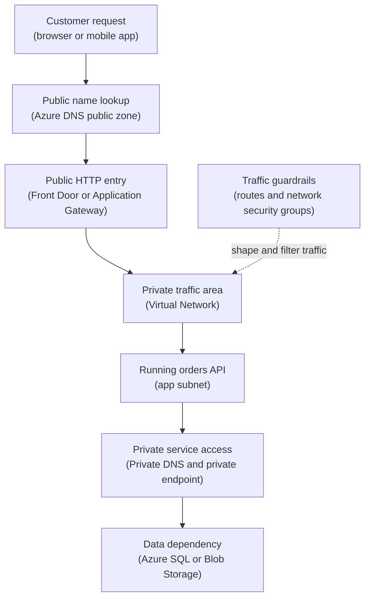

## Table of Contents

1. [The Traffic Questions Before Production](#the-traffic-questions-before-production)
2. [If You Know AWS Networking](#if-you-know-aws-networking)
3. [The Orders API Request Path](#the-orders-api-request-path)
4. [Public Internet And Private Network Are Different Paths](#public-internet-and-private-network-are-different-paths)
5. [Virtual Networks Are Private Traffic Areas](#virtual-networks-are-private-traffic-areas)
6. [Subnets Are Placement Areas](#subnets-are-placement-areas)
7. [Routes Tell Traffic Where To Go Next](#routes-tell-traffic-where-to-go-next)
8. [DNS Turns Names Into Destinations](#dns-turns-names-into-destinations)
9. [Network Security Rules Allow Or Deny New Connections](#network-security-rules-allow-or-deny-new-connections)
10. [Private Endpoints Bring Azure Services Into The Private Path](#private-endpoints-bring-azure-services-into-the-private-path)
11. [Service Endpoints And Private Endpoints Are Not The Same](#service-endpoints-and-private-endpoints-are-not-the-same)
12. [Failure Modes And Fix Directions](#failure-modes-and-fix-directions)
13. [A Beginner Network Review Habit](#a-beginner-network-review-habit)

## The Traffic Questions Before Production

Before a backend service can serve real users, the team needs to answer one plain question:
how does traffic get from a caller to the thing it needs?

That sounds simple on a laptop.
You run `npm run dev`.
The app listens on `localhost:3000`.
The database is a local container.
The browser, API, database, and logs all feel close together.

Azure separates those pieces.
That separation is useful because each piece can be managed, scaled, secured, and observed on its own.
It also means a working application can fail for reasons that have nothing to do with JavaScript.
The name might point to the wrong place.
The app might sit in the wrong subnet.
A route might send traffic to a firewall.
A network security group might block a port.
A private endpoint might exist, but DNS might still resolve to a public address.

Azure networking is the set of services and rules that control those paths.
For a beginner, the first mental model has six parts:
public internet, private network, placement areas, routes, DNS, and allow or deny checks.
The Azure names are Virtual Network, subnet, route table, Azure DNS, network security group, Private Link, and private endpoint.

This article follows one running example:
`devpolaris-orders-api` is a Node backend for checkout traffic.
The production version receives HTTPS requests at `orders.devpolaris.com`, runs in Azure, stores order records, writes receipt files to Blob Storage, and sends signals to monitoring.
The team wants users to reach the public API, but it does not want the database or storage account exposed as open public targets.

Read a simple system by asking better networking questions: where does
traffic enter, what stays private, what name resolves to what address,
which route is used, and which rule allows or denies the connection?

> A network problem is often a path problem. Find the name, the destination, the route, and the rule check.

## If You Know AWS Networking

If you have learned some AWS before, bring the basic map with you.
You already know that cloud networking is about private address space, subnets, routing, security rules, DNS, and service access.
Azure uses the same operating ideas, but the labels and service boundaries are not identical.

The closest bridge is this:
an Azure Virtual Network, often shortened to VNet, is the Azure private network area that feels closest to an AWS VPC.
That comparison is useful, but you should handle it carefully.
A VNet and a VPC both give you a private address space, subnets, routing, and private communication between resources.
They are not identical products, and you should not assume every AWS feature has the same Azure name or behavior.

Here is the careful bridge:

| AWS idea you may know | Azure idea to learn | Careful difference |
|-----------------------|---------------------|--------------------|
| VPC | Virtual Network, or VNet | Similar private network area, but Azure integration details differ |
| Subnet | Subnet | Same placement idea, but Azure services have their own subnet rules |
| Route table | Route table | Same traffic direction idea, with Azure system routes and optional custom routes |
| Security group | Network security group, or NSG | Similar allow or deny check, but NSGs attach to subnets or network interfaces |
| Route 53 public DNS | Azure DNS public zones | Same public name job, different service |
| Route 53 private hosted zone | Azure DNS private zones | Same private name job, often important with private endpoints |
| VPC endpoint | Private Link and private endpoint, or service endpoint | Azure has two different service access patterns you must not blur |
| ALB or CloudFront depending on the job | Application Gateway or Front Door | Pick by traffic job, not by a fake one-name match |

Front Door and Application Gateway deserve a slow comparison.
Front Door is usually part of a global public HTTP entry pattern.
Application Gateway is a regional HTTP load balancer that can sit with a VNet-connected design.
Neither one is "the Azure ALB" in every case.
Ask what job the entry point must do:
global edge routing, regional HTTP routing, TLS termination, private backend access, web application firewall rules, or health probes.

The AWS habit still helps:
do not expose a database just because the app needs to connect to it.
Do not trust a friendly DNS name without checking what it resolves to.
Do not assume a route exists because two resources are in the same cloud provider.
Translate the vocabulary, then inspect the actual Azure path.

## The Orders API Request Path

The `devpolaris-orders-api` team wants a first production network shape that is easy to explain.
Customers call a public HTTPS name.
The public entry point forwards only the intended web traffic to the API.
The API talks privately to data services where possible.
Developers and pipelines can inspect evidence without opening every resource to the internet.

In plain words, the request path looks like this:

```text
customer browser
  -> public name
  -> public HTTP entry point
  -> private app placement area
  -> private access to database and storage
  -> logs and metrics for evidence
```

In Azure words, that might become this:

```text
internet client
  -> Azure DNS
  -> Azure Front Door or Application Gateway
  -> Virtual Network and subnets
  -> Azure Container Apps, App Service, or virtual machines
  -> Private Link private endpoints for Azure SQL and Storage
  -> Azure Monitor and related signals
```

Read this diagram from top to bottom.
The plain-English label comes first.
The Azure term follows in parentheses.
The dotted lines are checks or supporting systems, not the main customer request path.



The diagram does not show every valid Azure design.
That is intentional.
The point is the mental path.
A public user should not need to know where the database lives.
The app needs a controlled path to data.
DNS must point names to the intended destinations.
Routes and security rules must agree with the design.

Here is a small network inventory for the example.
This kind of table is useful in a pull request or design review because it separates purpose from service name.

| Job | Example Resource | Azure Concept |
|-----|------------------|---------------|
| Public API name | `orders.devpolaris.com` | Azure DNS public record |
| Public HTTP entry | `fd-devpolaris-prod` or `agw-orders-prod` | Front Door or Application Gateway |
| Private address area | `vnet-devpolaris-prod` | Virtual Network |
| App placement | `snet-orders-app-prod` | Subnet |
| Private SQL access | `pe-sql-orders-prod` | Private endpoint |
| Private Blob access | `pe-blob-orders-prod` | Private endpoint |
| Private name resolution | `privatelink.database.windows.net` and `privatelink.blob.core.windows.net` | Azure DNS private zones |
| Network filtering | `nsg-orders-app-prod` | Network security group |

The inventory gives the team a starting map.
When checkout fails, they can follow the path instead of clicking through unrelated services.

## Public Internet And Private Network Are Different Paths

The public internet is the shared network path that normal clients use to reach public services.
Your customer's browser uses it when it calls `https://orders.devpolaris.com`.
A public path is correct for public web APIs.
The important choice is where that public entry stops.

A private network is the address area you control for internal traffic.
In Azure, the main private network area is a Virtual Network.
Resources inside or connected to that VNet can use private IP addresses, such as `10.42.1.20`, instead of public internet addresses.

For `devpolaris-orders-api`, the healthy beginner shape is:
public traffic reaches the HTTP entry point, not every backend dependency.
The API runtime talks to Azure SQL and Blob Storage over controlled service paths.
The database and storage account should not be treated like public web servers.

This distinction prevents a common beginner mistake.
Someone sees that Azure SQL has a public hostname such as `sql-devpolaris-orders-prod.database.windows.net`.
They assume it must be safe to allow public network access because the app can connect.
That may make the first test pass, but it also expands the places a request can come from.

The safer question is:
can the app reach the service through a private path, and can the service reject traffic that does not come through the intended path?

Here is a simple before and after:

| Design Choice | What Works | What You Risk |
|---------------|------------|---------------|
| Database allows broad public access | The app connects quickly during early testing | Mistyped firewall rules can expose a data service wider than intended |
| Database allows only a private endpoint path | App traffic stays on the private path | DNS and private endpoint setup must be correct |
| API has a public HTTP entry | Customers can call the service | Entry point must be protected, monitored, and routed to healthy backends |
| Every backend resource gets public access | Debugging may feel easier at first | The network boundary becomes unclear and harder to review |

The tradeoff is convenience versus clear boundaries.
Early public access is easy to test.
Private access takes more setup.
But private access gives the team a cleaner story when someone asks, "from where can production data be reached?"

## Virtual Networks Are Private Traffic Areas

An Azure Virtual Network is the main private traffic area for Azure resources.
It gives you private address space, such as `10.42.0.0/16`, and lets compatible Azure resources communicate privately.
Microsoft Learn describes Virtual Network as the fundamental building block for private networks in Azure.
That phrase is accurate, but the beginner meaning is easier:
a VNet is the private area where your Azure resources can have private addresses and controlled paths.

The address range matters because every subnet inside the VNet takes a slice of it.
For example, the orders production VNet might use:

```text
Virtual network:
  name: vnet-devpolaris-prod
  address space: 10.42.0.0/16

Subnets:
  snet-orders-app-prod: 10.42.1.0/24
  snet-private-endpoints-prod: 10.42.20.0/24
  snet-shared-gateway-prod: 10.42.40.0/24
```

The exact ranges are examples.
The important point is that the VNet is planned as a private address space.
You do not want random overlapping ranges if this network might later connect to another VNet, an on-premises network, or a VPN.
Overlapping address ranges make routing hard because two places claim the same destination.

Azure also creates default system routes so resources can communicate with other resources in the VNet and reach the internet outbound when allowed.
That does not mean every connection is safe or intended.
It means Azure gives the network a default path, and you add stricter routing or filtering when the system needs it.

For readers coming from AWS, this is close to the first VPC lesson:
choose private address space carefully because future connections depend on it.
The Azure version adds Azure-specific integration choices such as Private Link, service endpoints, VNet integration for some platform services, and private DNS zones.

## Subnets Are Placement Areas

A subnet is a smaller address range inside a VNet.
It is where certain resources or network interfaces are placed.
For a beginner, think of a subnet as a placement area with shared network rules.

Subnets matter because Azure attaches many networking choices at the subnet level.
A subnet can have a route table.
A subnet can have an NSG.
Some Azure services need their own delegated subnet, which means the subnet is assigned for that service's use.
Private endpoints are also placed into a subnet because each private endpoint gets a private IP address from that subnet.

The orders team might start with three subnets:

| Subnet | Address Range | Main Job |
|--------|---------------|----------|
| `snet-orders-app-prod` | `10.42.1.0/24` | Place the API runtime or integration path |
| `snet-private-endpoints-prod` | `10.42.20.0/24` | Hold private endpoints for SQL and Blob Storage |
| `snet-shared-gateway-prod` | `10.42.40.0/24` | Hold a regional entry component such as Application Gateway when used |

This shape keeps jobs separate.
The app subnet has app traffic rules.
The private endpoint subnet has private service doorway addresses.
The gateway subnet has HTTP entry behavior when the team chooses Application Gateway.

Do not split subnets just to make the diagram look serious.
Every subnet should have a reason:
different placement requirement, different route table, different NSG rule set, different service delegation, or cleaner operational ownership.
Too many subnets can make a small service harder to understand.
Too few can force unrelated traffic to share the same controls.

Here is the review question:
what is placed in this subnet, and what traffic should be allowed in and out?

If nobody can answer that in one or two sentences, the subnet design is probably not ready.

## Routes Tell Traffic Where To Go Next

Routes are traffic directions.
When a packet leaves the app, Azure needs to decide the next hop.
The next hop might be another subnet in the same VNet, the internet, a virtual network gateway, a peered VNet, or a network virtual appliance such as a firewall.

Azure creates system routes by default.
Those routes handle common paths such as traffic inside the VNet and outbound internet paths.
You can add custom routes with route tables when you need to change the default path.
For example, a platform team might force outbound traffic from the app subnet through an Azure Firewall before it reaches the internet.

For `devpolaris-orders-api`, route thinking starts with three questions:

1. Should app-to-database traffic stay on a private path?
2. Should app-to-internet traffic go directly out, through NAT Gateway, or through a firewall?
3. Should this VNet connect to other VNets or on-premises networks?

A route table snapshot might look like this:

```text
Route table: rt-orders-app-prod
Associated subnet: snet-orders-app-prod

Address prefix       Next hop type            Purpose
10.42.0.0/16         Virtual network          Keep VNet traffic local
10.80.0.0/16         Virtual network peering  Reach shared platform services
0.0.0.0/0            Virtual appliance        Send internet-bound traffic to firewall
```

Read this block as evidence of routing intent. The `0.0.0.0/0` route
means "when no more specific route matches, send the traffic here." That
default route can affect a large amount of traffic, so treat it
carefully. If it points to a firewall, the firewall must know how to
forward the traffic. If it points nowhere useful, the app can lose
outbound access.

The most common route debugging habit is to ask:
what destination IP did the app try to reach, and which route matched that destination?

That is why DNS and routes must be debugged together.
If `sql-devpolaris-orders-prod.database.windows.net` resolves to a public IP, routing follows a public destination.
If it resolves to a private endpoint IP such as `10.42.20.4`, routing follows the private VNet path.
The route cannot fix the wrong name resolution.
It only routes the destination it receives.

## DNS Turns Names Into Destinations

DNS, the Domain Name System, turns a name into a destination.
That sounds small, but DNS often decides whether a request uses the public path or the private path.

Azure DNS can host public DNS zones for internet-facing names.
It can also support private DNS zones for names that should resolve inside virtual networks.
For `devpolaris-orders-api`, both jobs matter.

The public name might be:

```text
orders.devpolaris.com
  -> public entry point for HTTPS traffic
```

That public name should resolve to the public HTTP entry service, such as Front Door or Application Gateway with a public frontend.
Customers do not need to know the private address of the API runtime.
They need a stable public name.

The private service names are different.
When the app connects to Azure SQL or Blob Storage through private endpoints, the service hostname should resolve inside the VNet to the private endpoint IP.
That usually involves Azure private DNS zones linked to the VNet.

Here is the kind of evidence a developer might collect from inside the app environment or a test host in the VNet:

```bash
$ nslookup sql-devpolaris-orders-prod.database.windows.net
Server:  168.63.129.16
Address: 168.63.129.16

Non-authoritative answer:
sql-devpolaris-orders-prod.database.windows.net canonical name = sql-devpolaris-orders-prod.privatelink.database.windows.net.
Name:    sql-devpolaris-orders-prod.privatelink.database.windows.net
Address: 10.42.20.4
```

The important line is the private address.
`10.42.20.4` tells you the name is resolving to something inside the VNet address space.
The `privatelink` name tells you private endpoint DNS is involved.

Now compare that with a failure shape:

```bash
$ nslookup sql-devpolaris-orders-prod.database.windows.net
Server:  168.63.129.16
Address: 168.63.129.16

Non-authoritative answer:
Name:    sql-devpolaris-orders-prod.database.windows.net
Address: 20.49.104.18
```

This does not automatically prove the connection is unsafe, but it does prove the name did not resolve to the private endpoint IP.
If the design requires private endpoint access, the next checks are the private DNS zone, the VNet link, the private endpoint connection, and whether the app is using the expected DNS resolver.

DNS is easy to underestimate because it feels like a phone book.
In cloud networking, DNS is often a steering wheel.
It tells the app which destination to try before routes and rules get involved.

## Network Security Rules Allow Or Deny New Connections

A network security group, or NSG, is an Azure rule set that filters network traffic.
It contains inbound and outbound security rules.
Each rule has a direction, priority, source, destination, protocol, port range, and action.
The action is allow or deny.

A common beginner mistake is treating an NSG as the whole firewall
story. An NSG is important, but application authentication, TLS, Azure
RBAC, service firewalls, Web Application Firewall rules, and private
endpoint approval can all matter too. The NSG answers one network-level
question: is this traffic allowed through this subnet or network
interface rule set?

Azure processes NSG rules by priority.
Lower numbers are processed first.
When traffic matches a rule, processing stops.
That means a high-priority deny can block traffic before a later allow has a chance to help.

For the orders app subnet, a simplified NSG design might look like this:

```text
NSG: nsg-orders-app-prod
Associated subnet: snet-orders-app-prod

Priority  Direction  Source             Destination          Port  Action  Purpose
100       Inbound    AppGatewaySubnet   snet-orders-app-prod 443   Allow   Let regional gateway reach API
200       Inbound    VirtualNetwork     snet-orders-app-prod 443   Allow   Let approved VNet callers reach API
300       Inbound    Internet           snet-orders-app-prod *     Deny    Block direct internet access
100       Outbound   snet-orders-app-prod 10.42.20.0/24      443   Allow   Reach private endpoints
200       Outbound   snet-orders-app-prod Internet           443   Allow   Reach approved external APIs through route path
```

This table is simplified on purpose.
Real NSG rules may use service tags, application security groups, and different source or destination shapes.
The teaching point is the evaluation habit:
find the direction, priority, source, destination, port, protocol, and action.

NSGs are stateful.
If outbound traffic is allowed for a connection, you do not need a matching inbound rule just for the response traffic.
That does not mean inbound traffic is open.
It means Azure tracks the flow for that connection.

Here is a realistic failure clue from an app log:

```text
2026-05-03T09:17:42Z WARN checkout dependency failed
dependency=sql
host=sql-devpolaris-orders-prod.database.windows.net
resolvedAddress=10.42.20.4
port=1433
error="connect ETIMEDOUT 10.42.20.4:1433"
```

The resolved address is private, so DNS probably found the private endpoint.
The timeout points to a path or rule problem, not a bad password.
The next checks are the route from the app subnet to `10.42.20.4`, any NSG on the app subnet, service-specific network settings, and the private endpoint connection state.

If the error were `Login failed for user`, the network likely got far enough to reach SQL.
That would move the investigation toward identity or database credentials.
Good network debugging separates "could not reach the destination" from "destination rejected the caller."

## Private Endpoints Bring Azure Services Into The Private Path

Many Azure services are platform services.
Azure SQL Database and Blob Storage are not normally "inside your subnet" in the same way a virtual machine network interface is.
They are managed services with service hostnames and Azure-managed infrastructure.

Private Link gives you a private access pattern for supported Azure services.
A private endpoint is a network interface in your VNet with a private IP address.
That private endpoint connects privately to a specific Azure service resource through Private Link.
For a beginner, it feels like adding a private doorway inside your VNet for one service instance.

For `devpolaris-orders-api`, the database private endpoint might look like this:

```text
Private endpoint:
  name: pe-sql-orders-prod
  subnet: snet-private-endpoints-prod
  private IP: 10.42.20.4
  target service: sql-devpolaris-orders-prod
  target subresource: sqlServer
  connection status: Approved
```

Several details matter.
The private endpoint has a private IP from the subnet.
It targets a specific service resource, not every Azure SQL server in the world.
The connection must be approved.
DNS should send the app to the private endpoint IP when the app uses the normal service hostname.

That last point is worth repeating.
Private endpoint setup is not only the private endpoint resource.
It is also DNS.
If the app still resolves the SQL hostname to a public address, it will not use the private endpoint path.

Private endpoints also change the review conversation.
Instead of asking "which public IPs can reach this database?", the team can ask:
which VNets have a private endpoint for this database, which private DNS zones resolve the name, and which identities can authenticate after the network path works?

Private network access does not replace authentication.
The app still needs valid database credentials or token-based access where configured.
The private endpoint only controls the network path.
That separation is healthy.
Network path says "can you reach this service endpoint?"
Identity says "are you allowed to use the service?"

## Service Endpoints And Private Endpoints Are Not The Same

Azure also has service endpoints.
The names are close enough to cause confusion, so slow down here.

A service endpoint extends a subnet's identity and private address space to supported Azure services over the Azure backbone.
The Azure service can then be configured to allow traffic from that VNet or subnet.
The service's DNS name can still resolve to a public service address.
The service endpoint helps the service recognize traffic from the allowed subnet.

A private endpoint is different.
It creates a private IP address in your VNet that maps to a specific service resource.
DNS normally points the service hostname to that private IP from inside the VNet.
The app connects to the private IP.

Here is the beginner comparison:

| Question | Service Endpoint | Private Endpoint |
|----------|------------------|------------------|
| Does it create a private IP in my VNet? | No | Yes |
| Does it usually need private DNS setup? | Usually less central | Yes, DNS is central |
| What does the service see? | Traffic from allowed VNet or subnet | Traffic through a private endpoint for a specific resource |
| What is the common beginner risk? | Thinking the service has moved into your VNet | Creating the endpoint but forgetting DNS |
| When might you see it? | Older or simpler VNet-restricted service access patterns | Private access to Azure SQL, Storage, Key Vault, and many other services |

Microsoft recommends Private Link and private endpoints for secure private access to many Azure platform services.
That does not mean every old service endpoint design is automatically wrong.
It means a new learner should understand the difference and avoid saying "endpoint" as if it always means the same thing.

For the orders API, the team chooses private endpoints for Azure SQL and Blob Storage because it wants the clearest private path.
The app should resolve the normal service names to private endpoint IPs inside the VNet.
The service firewall should reject public paths that are not part of the approved design.

## Failure Modes And Fix Directions

Networking failures can look vague from the application side.
The app usually knows that a connection timed out, a DNS lookup failed, or a TLS connection could not be made.
It may not know which Azure rule caused the problem.
That is why the fix begins by classifying the failure.

The first failure is wrong public DNS.
Customers call `orders.devpolaris.com`, but the name points to an old staging entry point.
The app might be healthy in production while users keep reaching the wrong backend.

```bash
$ nslookup orders.devpolaris.com
Name:    orders.devpolaris.com
Address: 52.160.18.25

$ curl -I https://orders.devpolaris.com/health
HTTP/2 200
x-environment: staging
```

The fix direction is to check the Azure DNS public zone record, the CNAME or A record target, and the entry point configuration.
The `x-environment: staging` header is the evidence.
The service answered, but it was the wrong environment.

The second failure is private endpoint DNS missing.
The app tries to connect to Azure SQL, but the SQL hostname resolves to a public IP instead of the private endpoint IP.

```text
Symptom:
  The SQL server public network access is disabled.

App log:
  error="connect ETIMEDOUT 20.49.104.18:1433"

DNS evidence:
  sql-devpolaris-orders-prod.database.windows.net -> 20.49.104.18

Expected private path:
  sql-devpolaris-orders-prod.database.windows.net -> 10.42.20.4
```

The fix direction is to check the private DNS zone, the VNet link, the private endpoint DNS zone group, and the resolver used by the app environment.
Do not start by opening public access.
First prove whether the private name path is correct.

The third failure is an NSG rule blocking a new connection.
DNS resolves to the right private IP, but the connection times out.

```text
Symptom:
  API cannot reach Blob Storage private endpoint.

Evidence:
  blob hostname resolves to 10.42.20.7
  app subnet route includes 10.42.0.0/16 as Virtual network
  NSG outbound rule priority 150 denies destination 10.42.20.0/24 port 443

Likely cause:
  The deny rule is processed before the intended allow rule.
```

The fix direction is to adjust the NSG priorities or rule scope so the intended app-to-private-endpoint traffic is allowed.
Remember that lower priority numbers run first.
Do not add a broad allow to everything if the narrow allow is the real requirement.

The fourth failure is a route table sending traffic to a firewall that does not know the return path.
This can happen when a default route sends outbound traffic to a network virtual appliance, but the firewall rules or routing are incomplete.

```text
Route evidence:
  destination: 0.0.0.0/0
  next hop: Virtual appliance
  next hop IP: 10.42.40.4

App symptom:
  external payment provider calls fail with timeout

Firewall evidence:
  no allow rule for api.payments.example:443
```

Before removing the firewall, decide whether this app should call that
external host. Then add the right firewall allow rule, DNS rule, or
route exception according to the platform team's pattern.

The fifth failure is mixing network access and identity access.
The app reaches Key Vault over a private endpoint, but Key Vault returns `403`.

```text
2026-05-03T10:22:15Z ERROR secret lookup failed
vault=https://kv-devpolaris-orders-prod.vault.azure.net
resolvedAddress=10.42.20.9
status=403
message="Caller is not authorized to perform action on resource"
```

The private address says the network path probably worked.
The `403` says the service rejected the caller.
The fix direction moves to identity and authorization:
check the managed identity, role assignment, scope, and Key Vault access model.

The beginner pattern is:
DNS failure means the name did not become the expected destination.
Timeout often means a route or rule path problem.
Connection refused means something answered but the port or listener may not be ready.
`403` means the caller reached a service that denied access.
`401` usually means authentication failed or no valid identity was presented.

## A Beginner Network Review Habit

Before you create or change Azure networking for a service, write the traffic story in plain English.
If you cannot explain the path, Azure will not make it clearer for you.

For `devpolaris-orders-api`, a healthy first review might read like this:

```text
Traffic story for devpolaris-orders-api production

Public users:
  orders.devpolaris.com resolves through Azure DNS to the public HTTP entry.
  The public HTTP entry forwards only HTTPS traffic to the orders API backend.

Private app traffic:
  The orders API runs in or integrates with vnet-devpolaris-prod.
  App traffic that needs Azure SQL resolves the SQL hostname to 10.42.20.4.
  App traffic that needs Blob Storage resolves the blob hostname to 10.42.20.7.

Routes:
  VNet traffic stays inside the VNet route.
  Internet-bound traffic follows the approved outbound route.

Rules:
  NSGs allow only the required inbound and outbound ports.
  Azure service firewalls accept the private endpoint path.

Identity:
  Network access does not grant data access by itself.
  The managed identity still needs the correct Azure role or service permission.
```

That review is short, but it catches many problems before deployment.
It separates public and private paths.
It names the expected DNS results.
It says where routes should send traffic.
It says which rule layer should allow the request.
It reminds the team that private networking and identity are partners, not replacements for each other.

Use this checklist when you feel lost:

| Check | Question | Evidence |
|-------|----------|----------|
| Public entry | What public name do users call? | Azure DNS record, `nslookup`, entry point config |
| Private area | Which VNet and subnet does the app use? | Resource networking settings |
| Destination | What IP does the service name resolve to? | `nslookup` or resolver logs |
| Route | Which next hop matches that destination? | Effective routes or route table |
| Rule | Which NSG rule allows or denies the flow? | Effective security rules or NSG config |
| Service gate | Does the target service allow this network path? | Service firewall, private endpoint state |
| Identity | Is the caller authorized after reaching the service? | RBAC, managed identity, service logs |

The order matters.
Start with the name and destination.
Then inspect routes.
Then inspect allow or deny rules.
Then inspect the service's own network gate.
Then inspect identity.
If you jump straight to changing random rules, you may make the system wider without fixing the real break.

Azure networking feels much less mysterious once you keep the layers separate.
Public internet gets users to the entry point.
The VNet gives private address space.
Subnets place resources and attach shared controls.
Routes choose the next hop.
DNS chooses the destination address.
NSGs filter connections.
Private endpoints give selected Azure services a private doorway in your VNet.

---

**References**

- [What is Azure Virtual Network?](https://learn.microsoft.com/en-us/azure/virtual-network/virtual-networks-overview) - Use this for the official VNet overview, including private communication, traffic filtering, routing, and Azure service integration.
- [What is Azure Private Link?](https://learn.microsoft.com/en-us/azure/private-link/private-link-overview) - Use this to understand how Private Link provides private access to supported Azure services through private endpoints.
- [What is a private endpoint?](https://learn.microsoft.com/en-us/azure/private-link/private-endpoint-overview) - Use this for the private endpoint properties, connection states, and private IP behavior.
- [Azure DNS overview](https://learn.microsoft.com/en-us/azure/dns/dns-overview) - Use this for the official DNS hosting and resolution model, including public DNS and private DNS zones.
- [Azure network security groups overview](https://learn.microsoft.com/en-us/azure/virtual-network/network-security-groups-overview) - Use this for NSG rule properties, priority evaluation, stateful behavior, and default rules.
- [Azure Virtual Network integration for Azure services](https://learn.microsoft.com/en-us/azure/virtual-network/virtual-network-for-azure-services) - Use this to compare service endpoints, private endpoints, and other Azure service integration patterns.
