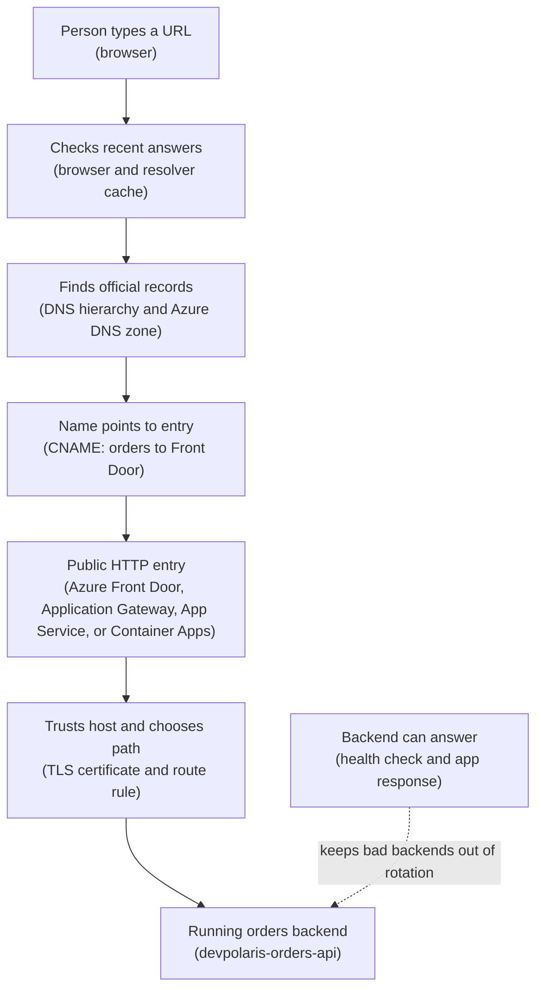

## Table of Contents

1. [The Public Name Is Part Of The System](#the-public-name-is-part-of-the-system)
2. [If You Know AWS Route 53](#if-you-know-aws-route-53)
3. [Zones Hold The Records For A Domain](#zones-hold-the-records-for-a-domain)
4. [A, CNAME, TXT, And TTL In Plain English](#a-cname-txt-and-ttl-in-plain-english)
5. [Custom Domains Prove Ownership Before Traffic Moves](#custom-domains-prove-ownership-before-traffic-moves)
6. [TLS Certificates Must Match The Hostname](#tls-certificates-must-match-the-hostname)
7. [Where TLS Actually Ends](#where-tls-actually-ends)
8. [How A Browser Finds The Orders API](#how-a-browser-finds-the-orders-api)
9. [Evidence You Should Check Before A Cutover](#evidence-you-should-check-before-a-cutover)
10. [Failure Modes And Fix Directions](#failure-modes-and-fix-directions)
11. [The Practical Tradeoff](#the-practical-tradeoff)

## The Public Name Is Part Of The System

A backend can be healthy and still unreachable if the public name sends browsers to the wrong place.
That is the quiet lesson behind many first cloud traffic problems.
The app is running.
The health check is green.
The logs are clean.
But the user typed `orders.devpolaris.com`, and that name did not land on the entry point that knows how to reach the app.

DNS, custom domains, and TLS are the pieces that turn a friendly public name into a working encrypted request path.
DNS (Domain Name System, the internet naming system) answers the question, "where should this name go?"
A custom domain is a name your team owns, such as `devpolaris.com`, instead of a provider-generated name like `something.azurefd.net` or `something.azurewebsites.net`.
TLS (Transport Layer Security, the encryption protocol behind HTTPS) protects the browser connection and proves that the server is allowed to answer for the hostname.

These pieces exist because public web traffic needs both direction and trust.
Direction means the browser can find the correct endpoint.
Trust means the browser can check that the certificate presented during HTTPS belongs to the name in the address bar.
If either side is wrong, the user sees a failure before your app code gets a fair chance to respond.

In Azure, DNS does not usually run your app.
Azure DNS can host the public records for a domain.
An entry service such as Azure Front Door, Application Gateway, App Service, or Container Apps receives the HTTP request.
That entry service is usually where the custom hostname is attached and where the first TLS certificate is presented.

This article follows one running example.
The DevPolaris team owns the public hostname `orders.devpolaris.com`.
They want that name to reach a backend called `devpolaris-orders-api`.
The app might run behind Front Door, Application Gateway, App Service, or Container Apps.
The exact Azure service can change, but the operating questions stay the same:
which DNS record points at the entry point, how does Azure know the team owns the name, which certificate is attached, where does TLS terminate, and what evidence proves the backend is healthy?

> A public hostname is not a label you add at the end. It is part of the request path.

## If You Know AWS Route 53

If you learned AWS first, Azure DNS will feel familiar in one important way.
Azure DNS hosts zones and records.
That is similar to Route 53 hosted zones and record sets.
You create a zone for a domain such as `devpolaris.com`, then create records inside that zone, such as `orders.devpolaris.com`.

The bridge is useful, but do not stretch it too far.
Route 53 can also be part of AWS routing patterns with alias records and health checks.
Azure DNS is mainly the DNS hosting layer.
The HTTP edge, TLS certificate binding, routing rules, web application firewall rules, and backend health usually belong to another Azure service.

Here is the safer translation:

| AWS idea you know | Azure idea to learn | What to watch |
|-------------------|---------------------|---------------|
| Route 53 hosted zone | Azure DNS zone | Holds records for a domain you control |
| A record | A record | Maps a name to an IPv4 address |
| CNAME record | CNAME record | Makes one name point to another name |
| TXT validation record | TXT validation record | Proves domain ownership to a service or certificate issuer |
| CloudFront or ALB custom domain | Front Door, Application Gateway, App Service, or Container Apps custom domain | The TLS and routing setup depends on the entry service |

The last row is the one to remember.
DNS tells the browser where to start.
The entry service decides how HTTPS is accepted, which certificate is shown, and how the request moves to `devpolaris-orders-api`.

For example, with Azure Front Door, the browser usually connects to Front Door first.
Front Door presents the certificate for `orders.devpolaris.com`, applies routing rules, then connects to the backend origin.
With App Service direct hosting, the custom domain and TLS binding belong to the App Service app.
With Container Apps direct hosting, the custom domain and certificate are bound to the container app ingress.
With Application Gateway, the HTTPS listener and certificate live on the gateway, then the gateway forwards to backend targets.

That means a good Azure troubleshooting habit is:
separate DNS hosting from HTTP entry.
Do not debug a certificate binding inside Azure DNS.
Do not debug a broken backend route by changing a TXT record.
Each layer has its own job.

## Zones Hold The Records For A Domain

A DNS zone is the container that holds DNS records for one domain.
If DevPolaris hosts `devpolaris.com` in Azure DNS, the Azure DNS zone named `devpolaris.com` contains records under that domain.
The record `orders` inside that zone becomes the fully qualified name `orders.devpolaris.com`.
Fully qualified means the complete DNS name, not just the short label.

Owning a DNS zone in Azure is not the same as buying the domain.
A registrar is the company where the domain is purchased.
The registrar controls which name servers are authoritative for the domain.
Authoritative means "these servers are allowed to give final answers for this domain."
Azure DNS can host the zone, but the registrar still needs to delegate the domain to the Azure DNS name servers.

Think of it like a team directory.
The registrar says which office has the official directory for `devpolaris.com`.
Azure DNS is that office only after the domain delegation points to Azure DNS name servers.
Creating a zone called `devpolaris.com` in Azure does not automatically move the public internet to that zone.

For the orders API, the public DNS shape might start like this:

```text
Public domain owner: DevPolaris
Registrar: example registrar
DNS hosting: Azure DNS
Zone: devpolaris.com
Record: orders
Full name: orders.devpolaris.com
Entry point: fd-devpolaris-prod.azurefd.net
Backend service: devpolaris-orders-api
```

That record is small, but it carries real risk.
If `orders` points to the wrong endpoint, every browser follows the wrong path.
If the zone is not delegated to Azure DNS, records can look correct in the Azure portal while the public internet never sees them.
If a stale record still exists at another DNS provider, different users may see different answers during a migration.

You can ask Azure DNS what record exists in the zone.
This output is the kind of evidence a platform engineer might paste into a release issue before moving production traffic.

```bash
$ az network dns record-set cname show \
>   --resource-group rg-shared-dns-prod \
>   --zone-name devpolaris.com \
>   --name orders \
>   --query "{name:name,type:type,ttl:TTL,target:cnameRecord.cname}" \
>   --output json
{
  "name": "orders",
  "type": "Microsoft.Network/dnszones/CNAME",
  "ttl": 300,
  "target": "fd-devpolaris-prod.azurefd.net"
}
```

The important fields are the name, the record type, the TTL, and the target.
This says the short record `orders` points at the Front Door hostname.
It does not prove the certificate is attached.
It does not prove the backend is healthy.
It only proves what Azure DNS is configured to answer for this record set.

## A, CNAME, TXT, And TTL In Plain English

Most beginner DNS work for web apps starts with four ideas:
A records, CNAME records, TXT records, and TTL.
You do not need to know every DNS record type on day one.
You need to understand which small record is responsible for which part of the path.

An A record maps a name to an IPv4 address.
If `orders.devpolaris.com` had a stable public IPv4 address, an A record could point the name at that address.
A records feel direct because the answer is an address the browser can connect to.
They are common for root domains, static IPs, and services that expose a fixed public IP.

A CNAME record maps one name to another name.
For a subdomain such as `orders.devpolaris.com`, this is often the cleanest shape when Azure gives you a provider hostname.
The record can say:
`orders.devpolaris.com` points to `fd-devpolaris-prod.azurefd.net`.
The browser then follows that name to get the final address.

A TXT record stores text on a name.
That sounds vague because TXT records are intentionally flexible.
Cloud services and certificate systems often use TXT records to ask, "prove you control this domain."
Azure may give you a token and ask you to publish it as a TXT record.
When Azure can read the token from public DNS, it knows you can edit the domain.

TTL means time to live.
It tells DNS resolvers how long they can cache an answer before asking again.
A TTL of `300` means five minutes.
A TTL of `3600` means one hour.
Lower TTLs make planned changes visible sooner, but they also cause resolvers to ask more often.
Higher TTLs reduce query traffic, but old answers can stay around longer during a migration.

Here is a small beginner table for `orders.devpolaris.com`:

| Record | Example | What it does | Common mistake |
|--------|---------|--------------|----------------|
| `A` | `orders A 203.0.113.25` | Points the name to an IPv4 address | Uses an old IP after the entry service changed |
| `CNAME` | `orders CNAME fd-devpolaris-prod.azurefd.net` | Points the name to another DNS name | Points to the backend instead of the public edge |
| `TXT` | `_dnsauth.orders TXT "validation-token"` | Proves domain control | Token missing, quoted wrong, or published under the wrong name |
| `TTL` | `300` | Controls cache lifetime for the answer | Changed after the cutover starts, so old caches still wait |

There is one DNS rule that surprises many people:
a CNAME record cannot coexist with other records at the same name.
In Azure DNS, the zone apex, shown as `@`, already has required NS and SOA records.
That is why a root name like `devpolaris.com` cannot simply become a CNAME.
Our running example uses `orders.devpolaris.com`, a subdomain, so a CNAME is usually fine.

The record type is part of how DNS standards work and how the Azure
entry service expects to be reached. Before you change a production
record, check the service instructions for the exact target type. Front
Door, App Service, Container Apps, and Application Gateway do not all
ask for the same record shape in every scenario.

## Custom Domains Prove Ownership Before Traffic Moves

A custom domain is a hostname your team owns and attaches to an Azure service.
For the orders API, the custom domain is `orders.devpolaris.com`.
Azure will not let any random subscription claim that name just because someone typed it into a portal form.
The service needs proof that the person configuring the service can edit DNS for the domain.

That proof usually happens through DNS validation.
Azure gives you a record to publish.
Sometimes the record is a CNAME that points your custom hostname at an Azure endpoint.
Sometimes the record is a TXT value under a validation name.
The exact shape depends on the service and whether Azure can manage the DNS zone directly.

For Azure Front Door Standard or Premium with Azure-managed DNS, the portal can work with the Azure DNS zone and validate the custom domain as part of the domain setup.
For a domain hosted outside Azure DNS, you may need to add a prompted TXT record manually.
For Front Door classic style instructions, you may also see CNAME validation through the Front Door default host.
Do not memorize one validation pattern and use it everywhere.
Read the entry service's domain screen and publish exactly what it asks for.

A realistic validation record might look like this:

```text
Name: _dnsauth.orders
Type: TXT
Value: "afd-validation=4f9c3b7b8e2f4a5c9d1e"
TTL: 300
Zone: devpolaris.com
Full name: _dnsauth.orders.devpolaris.com
```

The name matters as much as the value.
Publishing the correct token at `_dnsauth.devpolaris.com` does not prove control of `orders.devpolaris.com` if Azure asked for `_dnsauth.orders.devpolaris.com`.
DNS validation is exact.
Close is still wrong.

After the TXT record is published, public DNS needs time to return it.
The Azure portal may still show "Pending validation" for a few minutes.
That does not always mean the setup is broken.
It may simply mean the record has not propagated through caches yet.
But if the status stays pending, inspect the public answer from outside your laptop's cached resolver.

```bash
$ dig TXT _dnsauth.orders.devpolaris.com +short
"afd-validation=4f9c3b7b8e2f4a5c9d1e"
```

This output tells you the public TXT answer exists.
If Azure still cannot validate after this, check whether the token is old, whether the custom domain record in Azure is for the same hostname, and whether the DNS zone you edited is the delegated public zone.

## TLS Certificates Must Match The Hostname

After DNS points to the entry service, HTTPS still needs a certificate.
A certificate is the identity document the server presents during the TLS handshake.
The browser checks that the certificate is trusted and that the hostname in the address bar appears on the certificate.
For this article, the important hostname is `orders.devpolaris.com`.

TLS does two beginner-visible jobs.
First, it encrypts traffic so people between the browser and the server cannot read the request body.
Second, it gives the browser a way to reject impostors.
If the browser asks for `orders.devpolaris.com` and the server presents a certificate for `shop.devpolaris.com`, the browser should complain.

Azure entry services usually offer two certificate choices.
You can let the service create and manage a certificate for the custom domain.
Or you can bring your own certificate from a certificate authority and attach it to the entry service.
Managed certificates reduce renewal work.
Bring-your-own certificates give the team more control, which may matter for wildcard names, existing company certificate processes, or specific ownership rules.

The key point is that the certificate belongs where the browser's TLS connection lands.
If the browser reaches Front Door first, Front Door needs a certificate for `orders.devpolaris.com`.
If the browser reaches Application Gateway first, the Application Gateway listener needs the certificate.
If the browser reaches App Service directly, App Service needs a TLS binding for the custom domain.
If the browser reaches Container Apps ingress directly, the Container App custom domain needs a certificate binding.

You can inspect the certificate the browser would see. This command
gives a clear first signal about the certificate subject, issuer,
validity window, and hostname match.

```bash
$ openssl s_client \
>   -servername orders.devpolaris.com \
>   -connect orders.devpolaris.com:443 </dev/null 2>/dev/null \
>   | openssl x509 -noout -subject -issuer -ext subjectAltName
subject=CN=orders.devpolaris.com
issuer=C=US, O=DigiCert Inc, CN=DigiCert Global G2 TLS RSA SHA256 2020 CA1
X509v3 Subject Alternative Name:
    DNS:orders.devpolaris.com
```

The `-servername` value matters.
Modern HTTPS servers often use SNI (Server Name Indication), which lets one IP address serve different certificates for different hostnames.
Without SNI, your test may see a default certificate and send you down the wrong debugging path.

The line to check is `Subject Alternative Name`.
If `orders.devpolaris.com` is missing, the certificate does not match the browser hostname.
Changing DNS will not fix that.
You need the correct certificate issued and attached to the entry point that receives the browser connection.

## Where TLS Actually Ends

TLS termination means the encrypted connection ends at a component.
That component decrypts the request and can read the HTTP headers and path.
It may then make a new encrypted connection to the backend.
This is normal for HTTP entry services because they need to inspect the request to route it.

For `orders.devpolaris.com`, you need to know two TLS paths:
browser to entry service, and entry service to backend.
The first path protects the public user connection.
The second path protects traffic from the entry service to `devpolaris-orders-api`.
They are related, but they are not the same certificate in every design.

Here are the common Azure shapes:

| Entry shape | Where the browser TLS connection lands | What usually needs the public hostname certificate |
|-------------|----------------------------------------|---------------------------------------------------|
| Azure Front Door | Global Front Door edge | The Front Door custom domain |
| Application Gateway | Regional gateway listener | The Application Gateway HTTPS listener |
| App Service direct | App Service frontend | The App Service custom domain binding |
| Container Apps direct | Container Apps ingress | The Container App custom domain binding |

Front Door is a useful example because it makes the two TLS legs visible.
The browser connects to Front Door over HTTPS.
Front Door terminates that TLS connection, reads the HTTP request, applies its route rules, and then starts a new connection to the origin.
If the origin protocol is HTTPS, Front Door also checks the origin certificate chain and hostname.

That second check is a common source of confusion.
The public certificate for `orders.devpolaris.com` can be correct while the backend origin certificate is wrong.
For example, the origin might be configured as `api.internal.devpolaris.com`, but the backend presents a certificate for `devpolaris-orders-api.azurecontainerapps.io`.
Front Door can refuse that origin connection because the certificate subject does not match the origin hostname.

Application Gateway has a similar idea, but the placement is regional and often closer to the virtual network.
It can terminate TLS on a listener and forward HTTP or HTTPS to backend pools.
If it forwards HTTPS, backend certificates and hostnames still matter.
If it forwards plain HTTP inside a private network, the team should make that a deliberate design choice and understand what traffic is no longer encrypted after the gateway.

Direct App Service and direct Container Apps are simpler to picture.
The platform ingress receives the browser connection.
The custom hostname and certificate are attached to the app entry.
That can be a good starting point for a small service.
The tradeoff is that you may have fewer edge routing, global entry, or shared firewall options than you would with Front Door or Application Gateway in front.

## How A Browser Finds The Orders API

Now connect the pieces from top to bottom.
A browser does not know where `devpolaris-orders-api` runs.
It only knows the user typed `https://orders.devpolaris.com/orders`.
Everything else comes from DNS, TLS, routing, and backend health.

Read this diagram from top to bottom.
The plain-English label comes first.
The Azure term follows in parentheses.



The flow is simple, but each step has a different failure.
DNS can point to the wrong entry.
The cache can keep an old answer.
The certificate can be missing or mismatched.
The route can send the request to the wrong backend.
The backend can be unhealthy even though DNS and TLS are perfect.

For the happy path, the request feels instant:

```text
Browser request
  URL: https://orders.devpolaris.com/orders
  DNS answer: orders.devpolaris.com CNAME fd-devpolaris-prod.azurefd.net
  Public entry: Azure Front Door profile fd-devpolaris-prod
  Certificate: valid for orders.devpolaris.com
  Route: /orders/* to devpolaris-orders-api origin group
  Backend: healthy revision returns HTTP 201 for a new order
```

This is the mental model to keep during debugging.
Do not start by changing five things.
Walk the path.
Name resolution first.
Certificate next.
Entry route after that.
Backend health last.
The first broken layer is usually where the fix belongs.

## Evidence You Should Check Before A Cutover

A cutover is the moment you move real users from one entry path to another.
For `orders.devpolaris.com`, that might mean changing DNS from an old hosting provider to Azure Front Door.
The safest cutovers are boring because the team already collected evidence before the record changed.

Start with the current DNS answer.
You want to know what public resolvers see, not only what your local laptop remembers.

```bash
$ dig orders.devpolaris.com CNAME +short
fd-devpolaris-prod.azurefd.net.

$ dig orders.devpolaris.com A +short
192.0.2.42
192.0.2.43
```

The CNAME answer tells you the custom name points to Front Door.
The A answers are the final addresses reached after DNS follows the CNAME chain.
Those IPs are example documentation addresses here, but in a real check they should match the expected entry service.

Next, check the HTTPS response at the public name.
Use the same hostname users will type.

```bash
$ curl -I https://orders.devpolaris.com/health
HTTP/2 200
date: Tue, 05 May 2026 10:15:42 GMT
content-type: application/json
x-azure-ref: 20260505T101542Z-17b4f7c9f4
cache-control: no-store
```

This proves more than DNS.
It proves the browser-facing TLS handshake worked, the entry service accepted the hostname, the route reached something, and `/health` returned a good status.
It still does not prove every order workflow works, but it gives a strong first signal.

For Front Door, inspect the custom domain state and certificate state separately.
This is a realistic shape of the evidence you want, not a command you should copy blindly into every subscription.

```bash
$ az afd custom-domain show \
>   --resource-group rg-edge-prod \
>   --profile-name fd-devpolaris-prod \
>   --custom-domain-name orders-devpolaris-com \
>   --query "{hostName:hostName,domainValidationState:domainValidationState,certificateType:tlsSettings.certificateType,minimumTlsVersion:tlsSettings.minimumTlsVersion}" \
>   --output table
HostName                 DomainValidationState    CertificateType     MinimumTlsVersion
-----------------------  -----------------------  ------------------  -----------------
orders.devpolaris.com    Approved                 ManagedCertificate  TLS12
```

The useful part is the split.
Domain validation says Azure accepts that you control the name.
Certificate type says what will be used for the browser TLS connection.
Minimum TLS version tells you the baseline protocol setting.
Backend health is a separate check.

Finally, check the backend from the entry service's point of view.
If DNS and TLS look right but users get `502`, the backend origin may be unhealthy.

```text
Front Door origin group: og-orders-api-prod
Origin: devpolaris-orders-api
Origin hostname: ca-orders-api-prod.example.azurecontainerapps.io
Health probe path: /health
Last probe result: Failed
Last status: 503
Last message: backend returned service unavailable
```

That evidence means changing the CNAME again is probably the wrong fix.
The public edge is reachable.
The next question is why `devpolaris-orders-api` is returning `503` or failing health checks.

## Failure Modes And Fix Directions

Good DNS and TLS troubleshooting is mostly layer discipline.
You ask which layer is failing, then fix that layer.
The failures below are common because they look similar from the user's browser, but they have different causes.

| Symptom | Likely layer | What to inspect | Fix direction |
|---------|--------------|-----------------|---------------|
| `orders.devpolaris.com` resolves to an old host | DNS record | Public `dig` answer and Azure DNS record set | Update the A or CNAME record in the delegated public zone |
| Some users reach old entry, others reach new entry | DNS cache | TTL before the change and resolver answers from different networks | Wait for old TTLs, reduce TTL before future cutovers |
| Azure custom domain stays pending | Domain validation | TXT or CNAME validation record name and value | Publish the exact token at the exact requested name |
| Browser warns about certificate name | TLS certificate | Certificate SAN and selected entry service binding | Issue or attach a certificate that includes `orders.devpolaris.com` |
| HTTPS works on Azure default hostname but not custom hostname | Custom domain binding | Entry service custom domain list and certificate state | Add the custom domain and bind the certificate to that hostname |
| DNS and TLS work, but users get `502` or `503` | Backend route or health | Front Door origin health, gateway backend health, app logs | Fix backend health, route rules, port, host header, or revision traffic |

The wrong CNAME or A record is the most direct DNS failure.
It often appears after a migration.
The team updated the record in one DNS provider, but the domain is still delegated to another provider.
Or the team pointed `orders` at the backend platform hostname when the intended public entry was Front Door.

The fix is to prove delegation first, then edit the active zone.

```bash
$ dig NS devpolaris.com +short
ns1-08.azure-dns.com.
ns2-08.azure-dns.net.
ns3-08.azure-dns.org.
ns4-08.azure-dns.info.
```

If the name servers are not the Azure DNS name servers assigned to your `devpolaris.com` zone, editing Azure DNS will not affect public users.
Go to the registrar or the active DNS provider and correct the delegation or record there.

Stale TTL is not a bug in DNS.
It is DNS doing what you told it to do.
If the old record had a TTL of one hour, many resolvers are allowed to keep the old answer for one hour.
Lowering the TTL after the cutover begins does not recall answers that resolvers already cached.
For planned moves, lower the TTL before the move, wait for the old TTL to pass, then change the target.

Missing TXT validation usually looks like a pending custom domain or pending certificate.
The common mistakes are small:
the token is under `_dnsauth.devpolaris.com` instead of `_dnsauth.orders.devpolaris.com`, the value includes extra spaces, or the record was added to an internal/private zone instead of public DNS.
Fix it by copying the requested name and token carefully, then checking with `dig TXT` from public DNS.

A certificate mismatch usually appears as a browser privacy warning or a command-line error like this:

```text
curl: (60) SSL: no alternative certificate subject name matches target host name 'orders.devpolaris.com'
```

Do not fix this by turning off verification.
That only hides the trust problem.
Attach a certificate whose subject alternative names include `orders.devpolaris.com`, then bind it to the custom domain on the entry service that receives browser traffic.

There is one final failure that tricks many teams:
DNS can point to a healthy edge while the backend is unhealthy.
In that case the browser reaches the correct entry service and the certificate is valid, but the entry service cannot get a good response from `devpolaris-orders-api`.
The user may see a `502 Bad Gateway` or `503 Service Unavailable`.

That failure belongs behind the edge.
Inspect origin health, backend pool status, target port, host header, route pattern, and app logs.
If the app is Container Apps, check that ingress is enabled, the revision has traffic, and `/health` returns the expected status.
If the app is App Service, check app logs, TLS binding, and the custom domain binding.
If the app sits behind Application Gateway, check listener rules, backend settings, probe path, and certificate checks.

## The Practical Tradeoff

The simplest public path is often to attach the custom domain directly to the service running the app.
For a small internal tool or a first learning deployment, direct App Service or direct Container Apps custom domain setup can be easier to understand.
DNS points to the platform endpoint.
The platform owns the custom domain binding.
The platform presents the certificate.

The downside is that each app then owns more of its public entry story.
If the team later needs shared edge rules, global entry, path-based routing across services, caching, private origin access, or a web application firewall in front of several apps, direct bindings may start to feel scattered.
That is when an entry service such as Front Door or Application Gateway becomes attractive.

Front Door gives a global HTTP entry point.
That can be a good fit when users are spread across regions, when the team wants one public edge in front of several origins, or when route rules should live outside the app runtime.
The tradeoff is that you now have two places to debug:
the public edge and the backend origin.

Application Gateway gives a regional HTTP entry point that is commonly used with virtual networks.
That can be a good fit when the backend is private, when traffic needs regional layer 7 routing, or when gateway rules are part of the network design.
The tradeoff is more network placement detail.
Listeners, backend pools, probes, and certificates all need careful evidence.

Azure DNS stays important in every design, but DNS is not the whole design.
DNS is the signpost.
The entry service is the door.
TLS is the lock and identity check.
The backend health check tells you whether the room behind the door is ready.

For `orders.devpolaris.com`, a production checklist looks like this:

```text
Before changing traffic:
  1. Public zone delegation points to the intended DNS provider.
  2. orders.devpolaris.com has the intended A or CNAME record.
  3. TTL is low enough before the planned cutover.
  4. Azure custom domain validation is approved.
  5. Certificate includes orders.devpolaris.com.
  6. Certificate is attached to the browser-facing entry service.
  7. Entry route sends /orders and /health to devpolaris-orders-api.
  8. Backend health checks are passing from the entry service.
  9. curl to https://orders.devpolaris.com/health returns 200.
  10. App logs show the expected request after the public check.
```

The checklist keeps each layer honest. When the user types
`orders.devpolaris.com`, the browser walks through DNS, the public entry
point, TLS, routing, backend health, and application behavior, and each
layer needs one clear answer.

---

**References**

- [Azure DNS overview](https://learn.microsoft.com/en-us/azure/dns/dns-overview) - Explains Azure DNS hosting, public DNS, private DNS, and how DNS fits into Azure networking.
- [Overview of DNS zones and records](https://learn.microsoft.com/en-us/azure/dns/dns-zones-records) - Defines Azure DNS zones, record sets, A records, CNAME records, TXT records, and TTL behavior.
- [Add a custom domain to Azure Front Door](https://learn.microsoft.com/en-us/azure/frontdoor/front-door-custom-domain) - Shows how Front Door custom domains use DNS records and how CNAME validation fits into the setup.
- [Configure HTTPS on an Azure Front Door custom domain](https://learn.microsoft.com/en-us/azure/frontdoor/standard-premium/how-to-configure-https-custom-domain) - Covers managed and customer-managed certificates for Front Door custom domains.
- [TLS encryption with Azure Front Door](https://learn.microsoft.com/en-us/azure/frontdoor/end-to-end-tls) - Explains browser-to-edge TLS, Front Door-to-origin TLS, certificate matching, and end-to-end encryption behavior.
