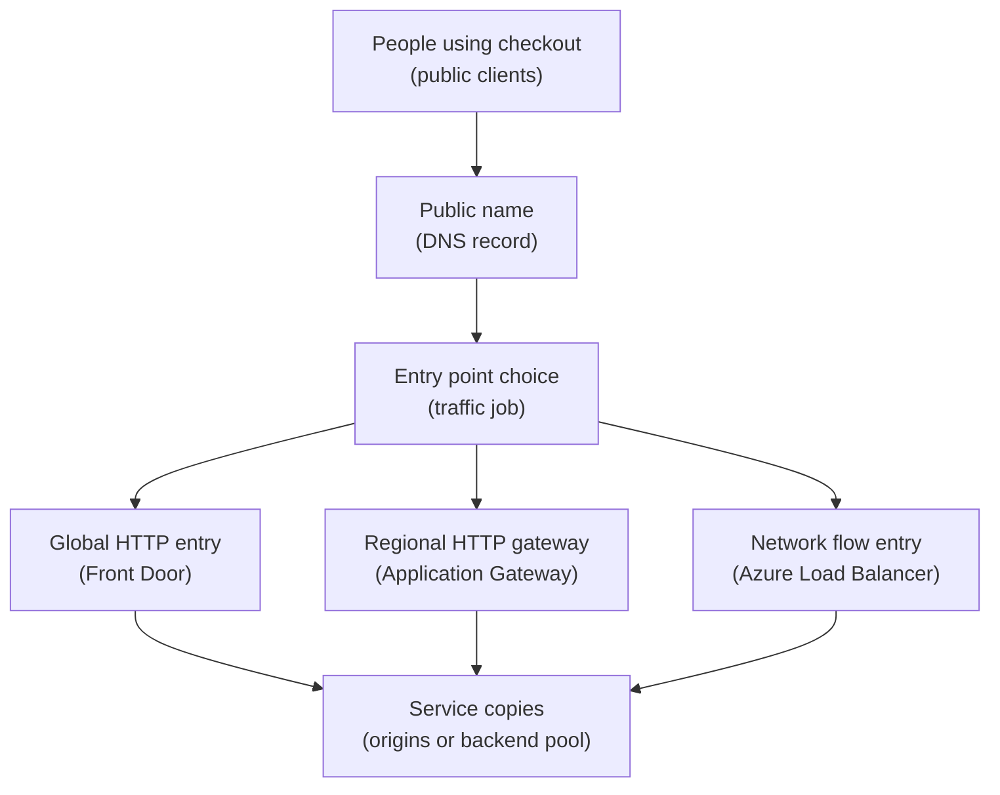

## Table of Contents

1. [The Public Door Is Only The Start](#the-public-door-is-only-the-start)
2. [If You Know AWS Load Balancing](#if-you-know-aws-load-balancing)
3. [Layer 4 And Layer 7 In Plain English](#layer-4-and-layer-7-in-plain-english)
4. [Three Azure Entry Points, Three Different Jobs](#three-azure-entry-points-three-different-jobs)
5. [The Orders API Traffic Path](#the-orders-api-traffic-path)
6. [Health Probes Decide Who Gets Traffic](#health-probes-decide-who-gets-traffic)
7. [TLS Termination Without Mystery](#tls-termination-without-mystery)
8. [When The Public Entry Looks Broken](#when-the-public-entry-looks-broken)
9. [A Beginner Decision Checklist](#a-beginner-decision-checklist)

## The Public Door Is Only The Start

A public URL can look like the whole story.
You create `https://orders.devpolaris.com`, point DNS at Azure, and the browser either works or fails.
But the public URL is only the first visible piece.
Behind it, Azure still has to accept the connection, choose a backend, check whether that backend is healthy, and forward the request in a way the app understands.

This article is about that entry layer.
An entry layer is the resource or group of resources that receives client traffic before the request reaches your app.
In Azure, three names show up often:
Azure Load Balancer, Azure Application Gateway, and Azure Front Door.
They all help traffic reach backends, but they do different jobs.

Azure Load Balancer works at the network connection level.
It is useful when you are balancing TCP or UDP traffic, or when you need a public or private IP that sends flows to virtual machines.
Application Gateway works at the HTTP request level inside a region.
It can make routing decisions from a hostname or URL path.
Front Door works at the global edge for HTTP and HTTPS apps.
It can receive users near them and route to origins in one or more regions.

Those words matter because public traffic failures often get blamed on the wrong layer.
If the browser sees `502 Bad Gateway`, the DNS name might be fine.
The gateway might be fine too.
The failing part might be the backend health probe, the TLS certificate between the gateway and the origin, or a new app revision that starts but returns errors.

We will use one running example:
`devpolaris-orders-api` is a backend service that accepts public HTTP traffic for checkout.
It exposes `GET /health` for backend health and `POST /orders` for order creation.
The team wants public traffic to reach only healthy backend instances.
When checkout fails, they want evidence that tells them whether the entry point, the backend pool, the health probe, TLS, or the app revision is the problem.

The goal is practical.
After this article, you should be able to look at a public Azure entry problem and ask:
which entry point owns this job, what layer is it operating at, and what backend health evidence proves the next move?

> A load balancer does not make an unhealthy app healthy. It only decides whether that app should receive traffic.

## If You Know AWS Load Balancing

If you learned AWS first, you already have useful instincts.
You know that public traffic might enter through something like a Network Load Balancer, an Application Load Balancer, CloudFront, or Global Accelerator.
Azure has services that do similar jobs, but they are not exact one-to-one matches.

Use the AWS comparison as a bridge, not as a translation table you can trust blindly.
The right Azure choice depends on the job:
network flows, regional HTTP routing, global HTTP entry, TLS handling, health probes, private networking, and web application firewall needs.

| Job You Are Trying To Do | AWS Idea You May Know | Azure Service To Consider | Important Difference |
|--------------------------|-----------------------|---------------------------|----------------------|
| Balance TCP or UDP flows by IP and port | NLB style job | Azure Load Balancer | Azure Load Balancer is layer 4 and often sits with VMs or VM scale sets |
| Route HTTP by host or path in one region | ALB style job | Application Gateway | Application Gateway is regional and sits in a virtual network |
| Put a global HTTP entry close to users | CloudFront or Global Accelerator style job | Front Door | Front Door is a global HTTP entry and origin router, not just a regional load balancer |
| Terminate TLS and inspect HTTP routing rules | ALB or CloudFront style job | Application Gateway or Front Door | The TLS and routing behavior depends on which Azure service receives the request |
| Keep traffic away from unhealthy backends | Target group health checks | Backend health probes and origin health probes | Azure names differ: backend pool, backend settings, origin group, health probe |

The loose mapping helps your memory.
The warning keeps you safe.
If someone says "we need the Azure ALB", slow down and ask what they actually need.
Do they need host and path routing inside one Azure region?
That points toward Application Gateway.
Do they need global HTTP entry with origins in more than one region?
That points toward Front Door.
Do they need TCP traffic to virtual machines, with no HTTP understanding?
That points toward Azure Load Balancer.

For `devpolaris-orders-api`, the first question is not "which AWS service is this like?"
The first question is "where should public HTTP traffic enter, and what does that entry need to understand?"

## Layer 4 And Layer 7 In Plain English

Layer numbers come from the OSI model, a teaching model that splits network communication into levels.
You do not need to memorize all seven layers to operate Azure entry points.
For this topic, the useful split is layer 4 versus layer 7.

Layer 4 is about the transport connection.
Think source IP, destination IP, port, and protocol.
A layer 4 load balancer can say:
"this is a TCP connection to port 443, send this flow to backend A."
It does not need to understand that the client asked for `/orders` or that the host was `orders.devpolaris.com`.

Layer 7 is about the application request.
For web apps, that usually means HTTP.
A layer 7 gateway can look at the HTTP host header, path, method, and sometimes other request details.
It can say:
"requests for `orders.devpolaris.com` go to the orders backend, but requests for `/admin` go somewhere else."

That extra understanding comes with a tradeoff.
Layer 7 services can make more specific HTTP decisions, but they need to understand HTTP and often need to terminate TLS before they can inspect the request.
Layer 4 services are simpler at the request level and can handle non-HTTP protocols, but they cannot make path-based routing decisions.

Here is the beginner version:

| Question | Layer 4 Thinking | Layer 7 Thinking |
|----------|------------------|------------------|
| What does it see? | IP, port, protocol, connection flow | HTTP host, path, method, headers |
| What can it route by? | Network tuple and rules | Web request details |
| Good fit | TCP, UDP, VM traffic, private service flows | Public web apps, APIs, host routing, path routing |
| Azure example | Azure Load Balancer | Application Gateway, Front Door |
| What it cannot know by itself | The request path `/orders` | Non-HTTP protocol meaning |

The orders API is public HTTP.
That means layer 7 usually matters.
If the team wants only one hostname and one backend, a layer 7 service still helps with TLS, health, and HTTP evidence.
If the team later adds `orders.devpolaris.com/api` and `orders.devpolaris.com/assets`, layer 7 routing becomes more important.

Azure Load Balancer can still be useful in the same system.
For example, it might balance internal TCP traffic to a set of virtual machines.
But for public HTTP routing to `devpolaris-orders-api`, Application Gateway or Front Door is usually where the beginner conversation starts.

## Three Azure Entry Points, Three Different Jobs

Azure Load Balancer, Application Gateway, and Front Door belong to the same broad family of traffic entry services.
That does not mean they are interchangeable.
They sit in different places and understand different parts of the request.

Azure Load Balancer is a layer 4 service.
It distributes inbound flows to backend virtual machines or virtual machine scale sets.
It can be public, for internet traffic, or internal, for private traffic inside a virtual network.
Use it when the job is network flow balancing, not HTTP request routing.

Application Gateway is a regional layer 7 web traffic load balancer.
Regional means it is placed in an Azure region.
It can route web traffic based on HTTP details such as hostnames and URL paths.
It can terminate TLS, use backend pools, and report backend health.
Because it lives in a virtual network, it is a common choice when the entry point needs to sit close to private Azure backends in one region.

Front Door is a global HTTP and HTTPS entry point.
Global means clients reach an Azure edge location first, then Front Door routes to an origin.
An origin is the backend endpoint Front Door retrieves content or API responses from.
That origin might be an App Service app, an Application Gateway, a Container Apps endpoint, a storage endpoint, or another reachable HTTP service.

Read this as a placement picture, not a product ranking.
Plain-English labels come first, and the Azure term follows in parentheses.



You will not always use all three services together.
For a small HTTP app, Front Door might route directly to the app origin.
For a private regional design, Application Gateway might be the public entry and talk to private backends.
For VM-based TCP services, Azure Load Balancer might be enough.

The diagram leaves health probes and TLS out of the main choice picture.
Keep those checks in a small table instead:

| Entry service | Health check to remember | TLS detail to remember |
|---------------|--------------------------|------------------------|
| Front Door | Origin health decides which backend receives HTTP traffic | Client certificate and origin hostname certificate can both matter |
| Application Gateway | Backend pool health decides which backend receives regional traffic | Listener TLS and optional backend TLS are separate conversations |
| Azure Load Balancer | Probe health decides which VM receives network flows | It does not read HTTP hostnames or URL paths |

The useful question is:
which service has the job you need?

| Service | Scope To Picture First | Layer | Main Job | Common Beginner Fit |
|---------|------------------------|-------|----------|---------------------|
| Azure Load Balancer | Regional or private network path | Layer 4 | Distribute TCP or UDP flows | VM or VM scale set traffic |
| Application Gateway | One Azure region and virtual network | Layer 7 | Route HTTP by host or path | Regional web API entry |
| Front Door | Global edge in front of origins | Layer 7 | Route HTTP globally to origins | Public website or API used by users in many places |

There are combinations.
Front Door can sit in front of Application Gateway when you want global HTTP entry plus a regional gateway near private backends.
Application Gateway can sit in front of services inside a virtual network.
Load Balancer can support lower-level VM traffic behind the scenes.

For the first version of `devpolaris-orders-api`, imagine two possible shapes:
Front Door directly to a public Container Apps endpoint, or Front Door to Application Gateway, then to private app backends.
The first is simpler.
The second gives more regional network control.
Both still depend on backend health.

## The Orders API Traffic Path

Now make the system concrete.
The team owns `devpolaris-orders-api`.
The public hostname is `orders.devpolaris.com`.
The API exposes a health endpoint:

```text
GET /health
200 OK
{"service":"devpolaris-orders-api","revision":"orders-api--2026-05-03-0918","database":"ok"}
```

That small response is the signal the entry layer can use to decide whether a backend should receive real checkout traffic.
If `/health` returns `200`, the backend is saying it can serve.
If it returns `500`, times out, or returns the wrong status, the entry layer should stop sending new requests to that backend.

Here is a simple public design record.
It is the kind of note a platform engineer might keep with the deployment review:

```text
Public entry record

Workload: devpolaris-orders-api
Public host: orders.devpolaris.com
Primary region: eastus2
Runtime: Azure Container Apps
Health path: /health
Client protocol: HTTPS
Origin protocol: HTTPS

Entry choice:
  Front Door receives public HTTP traffic globally.
  Front Door routes to the active orders API origin.
  The origin must present a certificate that matches its origin host name.
  Health probes call /health so bad revisions leave rotation.

Fallback shape:
  Application Gateway can be added as a regional HTTP gateway
  if the team needs private backend access or regional WAF rules.
```

Notice that the record separates client protocol from origin protocol.
The client connects to the public entry point.
The entry point connects to the backend.
Those are two different network conversations.
They can both use HTTPS, but they are still separate conversations.

When a request works, the path looks boring:

```text
2026-05-03T09:21:44Z edge=afd-eus route=orders-api
host=orders.devpolaris.com path=/orders method=POST status=201
origin=ca-orders-prod.eastus2.azurecontainerapps.io
originStatus=201 originLatencyMs=84 health=healthy
```

The log line gives you the request path.
Front Door matched the route.
It selected the orders API origin.
The origin returned `201 Created`.
Health is healthy.
If checkout later fails, you want the failure evidence to answer the same questions:
did the route match, did the origin respond, did TLS succeed, and did the app itself return an error?

## Health Probes Decide Who Gets Traffic

A health probe is a repeated check from the entry service to the
backend. Azure uses it to decide whether a backend should receive real
traffic right now.

For HTTP apps, a probe usually calls a path such as `/health`.
That path should be cheap, stable, and honest.
Cheap means it does not create orders or run expensive work.
Stable means it does not change every deploy.
Honest means it fails when the app cannot serve real traffic.

This is where a beginner mistake causes pain.
The team points the probe at `/`.
The app redirects `/` to `/docs`.
The probe treats the redirect as unexpected.
Azure marks the backend unhealthy.
Users see a public failure even though `POST /orders` might have worked.

Use the health path intentionally:

```text
Probe configuration for devpolaris-orders-api

Protocol: HTTPS
Path: /health
Expected status: 200
Backend host: ca-orders-prod.eastus2.azurecontainerapps.io
Interval: short enough to remove bad backends, not so short that probes become noise
```

Different Azure services use different names.
Application Gateway talks about backend pools, backend settings, and backend health.
Front Door talks about origins, origin groups, and origin health probes.
Azure Load Balancer talks about backend pools and health probes for network endpoints.
The language changes, but the operating idea stays the same.

Here is realistic Application Gateway backend health evidence:

```bash
$ az network application-gateway show-backend-health \
  --resource-group rg-devpolaris-orders-prod \
  --name agw-orders-prod
{
  "backendAddressPools": [
    {
      "backendAddressPool": {
        "id": "/subscriptions/11111111-2222-3333-4444-555555555555/resourceGroups/rg-devpolaris-orders-prod/providers/Microsoft.Network/applicationGateways/agw-orders-prod/backendAddressPools/orders-api-pool"
      },
      "backendHttpSettingsCollection": [
        {
          "backendHttpSettings": {
            "id": ".../backendHttpSettingsCollection/orders-api-https"
          },
          "servers": [
            {
              "address": "10.12.4.18",
              "health": "Unhealthy",
              "healthProbeLog": "Received invalid status code: 404"
            }
          ]
        }
      ]
    }
  ]
}
```

The useful line is `Received invalid status code: 404`. That points
toward the probe path, route, or app behavior. If the probe was supposed
to call `/health`, check that the backend receives `/health` and returns
`200`.

Here is the same idea in a shorter Front Door style status note:

```text
Origin group: og-orders-prod
Origin: ca-orders-prod.eastus2.azurecontainerapps.io
Probe path: /health
Probe protocol: HTTPS
Latest probe result: Failed
Observed response: 500
Decision: origin removed from healthy rotation
```

The public entry might still accept client connections, but if every
backend or origin is unhealthy, there is nowhere safe to send the
request. That is why a bad backend can make the public entry look broken
even when the entry service itself is still reachable.

## TLS Termination Without Mystery

TLS is the encryption layer behind HTTPS.
It protects traffic so a browser and a server can exchange data without exposing the request to the network path between them.
When people say "terminate TLS", they mean one component accepts the HTTPS connection, decrypts it, and becomes the endpoint for that TLS conversation.

That phrase can sound scarier than it is.
Imagine a sealed envelope.
The browser sends a sealed envelope to Front Door or Application Gateway.
The entry service opens it because it owns the public certificate for `orders.devpolaris.com`.
Now it can read the HTTP host and path, apply routing rules, and start a separate connection to the backend.

That backend connection can also use HTTPS.
In that case, the entry service creates a new sealed envelope to the origin.
This is common for public APIs because you want encryption from the client to the entry point and from the entry point to the backend.

For `devpolaris-orders-api`, the high-level TLS path might look like this:

```text
Client browser
  -> HTTPS certificate for orders.devpolaris.com
  -> Front Door
  -> HTTPS certificate for ca-orders-prod.eastus2.azurecontainerapps.io
  -> devpolaris-orders-api backend
```

The two certificates serve different conversations.
The public certificate proves the public hostname to the client.
The origin certificate proves the backend hostname to the entry service.
If the origin host name and certificate subject do not match, Front Door can refuse the origin connection.

That mismatch often looks like a public outage:

```text
Client error: 502
Entry point: Front Door
Route: orders-api
Origin host: ca-orders-prod.eastus2.azurecontainerapps.io
Origin host header: orders.devpolaris.com
TLS result: certificate name mismatch
Backend certificate names: ca-orders-staging.eastus2.azurecontainerapps.io
```

For an origin TLS mismatch, make the origin TLS story consistent.
Check the origin host name, origin host header, certificate subject names, and whether the backend app has the expected custom domain configured.
For a managed app platform, that might mean adding the custom domain to the backend app or changing the origin host header to the backend's real hostname.

TLS termination also explains why layer 7 routing often needs certificate planning.
If the gateway needs to read the HTTP host or path inside HTTPS traffic, it has to terminate TLS first.
That means the gateway needs a certificate for the public hostname.
The backend then needs its own HTTPS plan if you want encrypted traffic after the gateway.

## When The Public Entry Looks Broken

Most entry failures are not mysterious once you separate the layers.
Start from the client symptom, then walk inward:
DNS, public entry, route, backend pool or origin group, probe, TLS, app revision, database dependency.

Here are the failure modes you will see early.
The fix direction matters more than the exact command.

| Symptom | Likely Cause | Evidence To Inspect | Fix Direction |
|---------|--------------|---------------------|---------------|
| `502 Bad Gateway` from public host | Backend unhealthy | Backend health or origin health says failed | Fix app health, probe path, port, or backend dependency |
| `404` from gateway, not app | Wrong route, listener, host, or path rule | Access log route field, listener host, path map | Point the rule at the intended backend pool or origin group |
| TLS error or `502` on HTTPS origin | Certificate or host name mismatch | Origin TLS result, certificate subject, origin host header | Align origin host name, host header, custom domain, and certificate |
| Public entry accepts traffic but app returns `500` | Active app revision is failing | App logs, revision status, dependency errors | Roll back revision or fix the failing startup or dependency |
| Probe says unhealthy but manual `/health` works from laptop | Probe path, protocol, host header, or private reachability differs | Probe settings and backend access logs | Make the probe match the path and host the backend expects |
| Traffic goes to staging backend | Wrong origin or backend pool selected | Resource IDs, origin host, backend pool membership | Replace the target with the production backend resource ID |

Let's make two of those concrete.

First, the wrong origin.
The route is correct, TLS works, and the app responds.
But it responds from staging.
That is a dangerous kind of success.

```text
2026-05-03T10:04:18Z edge=afd-eus route=orders-api
host=orders.devpolaris.com path=/orders status=201
origin=ca-orders-staging.eastus2.azurecontainerapps.io
responseHeader.x-environment=staging
```

The browser sees success.
The business sees production orders created in the wrong environment.
The fix direction is to inspect the route and origin group, then replace the staging origin with the production origin.
Use exact resource IDs or hostnames.
Do not trust a friendly name that looks close.

Second, the app revision is failing.
The public entry exists.
The DNS name resolves.
TLS works.
The selected backend starts, then fails during startup because it cannot connect to the database.

```bash
$ az containerapp revision list \
  --resource-group rg-devpolaris-orders-prod \
  --name ca-devpolaris-orders-api-prod \
  --query "[].{name:name,active:properties.active,traffic:properties.trafficWeight,running:properties.runningState}"
[
  {
    "name": "ca-devpolaris-orders-api-prod--20260503-0918",
    "active": true,
    "traffic": 100,
    "running": "Failed"
  },
  {
    "name": "ca-devpolaris-orders-api-prod--20260502-1742",
    "active": true,
    "traffic": 0,
    "running": "Running"
  }
]
```

The active revision is the root cause in this failure. Shift traffic
back to the last running revision or deploy a corrected revision, then
inspect the app logs for the dependency failure that made startup fail.

For diagnostics, do not stop at the public symptom. Follow the request
path until you find the first component with bad evidence.

## A Beginner Decision Checklist

When you choose between Azure Load Balancer, Application Gateway, and Front Door, start with the traffic job.
The service name comes after the job.

Ask these questions in order.

1. Is the traffic HTTP or HTTPS?
2. Do you need to route by host name or path?
3. Is the entry point for one region, or should users reach a global edge first?
4. Are the backends private inside a virtual network?
5. What health endpoint proves the backend can serve real traffic?
6. Where should TLS terminate, and should the origin connection also use HTTPS?
7. What evidence will you check when checkout fails?

For `devpolaris-orders-api`, a beginner answer might look like this:

```text
Traffic type: public HTTPS API traffic
Routing need: host-based route for orders.devpolaris.com
Scope: global public entry, primary backend in eastus2
Entry service: Front Door first
Regional gateway: Application Gateway later if private regional control is needed
Network load balancer: not needed for the first HTTP API path
Health signal: GET /health returns 200 only when app and database dependency are ready
TLS plan: HTTPS from client to Front Door, HTTPS from Front Door to origin
First failure checks: route match, origin health, origin TLS, app revision status, app logs
```

Other valid designs exist, but this one is clear. If a teammate
disagrees, the conversation can stay concrete: "Do we need regional
private backends now?" "Do we need global edge entry now?" "What is the
health signal?" "Which certificate proves the origin?"

The tradeoff is clear. Front Door gives a global HTTP entry and origin
routing, but it adds an edge layer you must monitor and configure.
Application Gateway gives regional HTTP routing inside a virtual
network, while Azure Load Balancer handles lower-level network flows and
cannot read HTTP paths.

Pick the smallest entry shape that matches the job and still gives you useful health evidence.
Then write down the path.
Future you will be grateful when the first `502` appears.

---

**References**

- [What is Azure Load Balancer?](https://learn.microsoft.com/en-gb/azure/load-balancer/load-balancer-overview) - Microsoft Learn overview of Azure Load Balancer, layer 4 behavior, backend pools, and health probes.
- [Azure Load Balancer health probes](https://learn.microsoft.com/en-us/azure/load-balancer/load-balancer-custom-probe-overview) - Microsoft Learn guide to TCP, HTTP, and HTTPS probe behavior for Load Balancer.
- [What is Azure Application Gateway?](https://learn.microsoft.com/en-us/azure/application-gateway/overview) - Microsoft Learn overview of Application Gateway as a regional layer 7 web traffic load balancer.
- [Application Gateway backend health](https://learn.microsoft.com/en-us/azure/application-gateway/application-gateway-backend-health) - Microsoft Learn guide to backend health reports and unhealthy backend evidence.
- [Azure Front Door overview](https://learn.microsoft.com/en-us/azure/frontdoor/front-door-overview) - Microsoft Learn overview of Front Door as a global HTTP and HTTPS entry service.
- [TLS encryption with Azure Front Door](https://learn.microsoft.com/en-us/azure/frontdoor/end-to-end-tls) - Microsoft Learn explanation of client TLS, origin TLS, and certificate name checks for Front Door.
