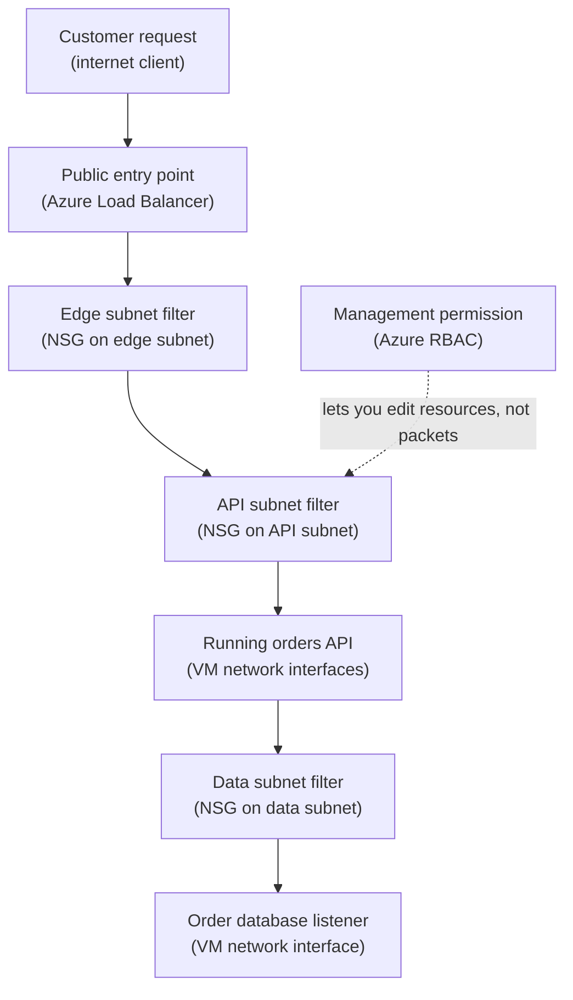

## Table of Contents

1. [The Packet Check Before The App Listens](#the-packet-check-before-the-app-listens)
2. [AWS Bridge For Security Groups And NACL Habits](#aws-bridge-for-security-groups-and-nacl-habits)
3. [The Orders API Network Path In One Picture](#the-orders-api-network-path-in-one-picture)
4. [What An NSG Rule Actually Says](#what-an-nsg-rule-actually-says)
5. [Priority Numbers Decide The First Match](#priority-numbers-decide-the-first-match)
6. [Subnet NSGs And NIC NSGs Are Two Checkpoints](#subnet-nsgs-and-nic-nsgs-are-two-checkpoints)
7. [Default Rules You Should Know First](#default-rules-you-should-know-first)
8. [ASGs Make Rules Read Like The App](#asgs-make-rules-read-like-the-app)
9. [Evidence You Can Inspect](#evidence-you-can-inspect)
10. [Failure Modes And Fix Directions](#failure-modes-and-fix-directions)
11. [A Review Habit Before You Change Rules](#a-review-habit-before-you-change-rules)

## The Packet Check Before The App Listens

An application can be healthy and still be unreachable.
The process is running.
The port is open on the server.
The code is listening.
Then a request from a browser, another service, or a deploy smoke test never arrives.

That is the network filtering problem this article is about.
Azure needs a way to decide which packets may enter or leave resources inside a virtual network.
A virtual network, often called a VNet, is the private network space where Azure resources can talk to each other using private IP addresses.
A network security group, usually shortened to NSG, is an Azure resource that filters traffic to and from supported resources in that VNet.

An NSG is made of security rules.
Each rule says something like:
allow HTTPS from the internet to the orders API subnet, or deny database traffic from anything except the API tier.
Rules can apply to inbound traffic, which is traffic trying to reach a resource, and outbound traffic, which is traffic leaving a resource.

An NSG is not Azure RBAC.
Azure RBAC answers who can create, update, read, or delete Azure resources through the management plane.
An NSG answers whether network traffic can flow through the data plane.
Maya can have Contributor access to a virtual machine and still fail to reach port 443 if the NSG blocks it.
The app can have permission to read a Key Vault secret and still fail to connect to a private endpoint if the network path is blocked.

We will use one running example:
`devpolaris-orders-api` runs in a production VNet.
The API tier receives HTTPS from a public load balancer.
Worker VMs call the API on an internal port for background tasks.
A database tier accepts traffic only from the API tier.
The team wants rules that are narrow enough to protect production and readable enough that a tired engineer can debug them safely.

Build the NSG reading habit: read the packet direction, read the source
and destination, read the port and protocol, then read the priority.

> NSGs are packet filters. RBAC is permission to manage Azure resources. Keep those two checks separate.

## AWS Bridge For Security Groups And NACL Habits

If you learned AWS first, Azure NSGs will feel familiar, but not identical.
AWS Security Groups protect network interfaces attached to resources.
AWS Network ACLs protect subnets and use numbered rules.
Azure NSGs sit somewhere between those habits because an NSG can be associated with a subnet, a network interface, or both.

That means your AWS mental model needs one small adjustment.
Do not ask only, "what is attached to the instance?"
In Azure, also ask, "what is attached to the subnet?"
Both places can matter.

Here is the bridge:

| AWS idea you may know | Azure idea to learn | Careful difference |
|-----------------------|---------------------|--------------------|
| Security Group on an instance or ENI | NSG associated with a NIC | Similar packet filtering job for one network interface |
| Network ACL on a subnet | NSG associated with a subnet | Azure uses NSG rules here too, not a separate NACL object |
| Rule number in a NACL | Priority in an NSG rule | Lower number means higher priority in Azure |
| Allow-only Security Group style | Allow or deny NSG rules | Azure custom rules can allow or deny |
| Security Group references | Application Security Groups | ASGs group VM network interfaces by app role |

The priority rule is the part to slow down on.
In Azure, rule priority is a number from low to high importance.
A lower number is processed first.
Priority `100` wins before priority `300`.
When traffic matches one rule, Azure stops checking lower-priority rules.
That stop-on-first-match behavior is why a deny at priority `100` can make an allow at priority `200` useless.

There is also a stateful behavior that feels like AWS Security Groups.
If an outbound request is allowed, the return traffic for that connection does not need a separate inbound rule.
If an inbound connection is allowed, the response does not need a separate outbound rule.
You still need rules for connections that start from the other side.

So the AWS bridge is useful, but do not flatten Azure into an AWS dictionary.
Azure NSGs can sit at subnet and NIC level.
Azure priorities use lower numbers first.
Azure ASGs are names you use inside NSG rules so the rules describe app roles instead of private IP lists.

## The Orders API Network Path In One Picture

Before writing rules, draw the path.
This is the quiet skill that prevents most beginner mistakes.
If you cannot say where traffic starts, where it goes, and which port it uses, the rule will probably be too broad or attached to the wrong place.

For `devpolaris-orders-api`, imagine this first production network:

```text
VNet: vnet-devpolaris-prod
Subnet: snet-orders-edge
  public load balancer private frontend

Subnet: snet-orders-api
  vm-orders-api-01
  vm-orders-api-02

Subnet: snet-orders-worker
  vm-orders-worker-01

Subnet: snet-orders-data
  vm-orders-db-01
```

The app listens on HTTPS from users.
The load balancer forwards to the API VMs on port `443`.
The worker VM calls an internal admin endpoint on port `8443`.
The API VMs connect to the database VM on port `5432`.

Read the diagram from top to bottom.
The plain-English label comes first.
The Azure term follows in parentheses.



The solid path is packet flow.
The dotted line is different.
RBAC may allow Maya or the deploy pipeline to edit an NSG.
RBAC does not allow user traffic through the NSG.

The diagram keeps ASGs out of the packet path because ASGs are labels used by NSG rules.
A small rule table is clearer:

| Rule intent | Source ASG | Destination ASG | Port |
|-------------|------------|-----------------|------|
| Worker calls API admin endpoint | `asg-orders-worker` | `asg-orders-api` | `8443` |
| API calls database listener | `asg-orders-api` | `asg-orders-db` | `5432` |

The RBAC distinction is worth repeating because it shows up in real tickets.
Someone says, "I have Contributor on the resource group, why is the app blocked?"
Contributor is a management permission.
The packet still needs a matching NSG rule.

## What An NSG Rule Actually Says

An NSG rule is a small decision record.
It does not know your intent.
It only checks packet facts.
When a packet reaches an NSG, Azure compares the packet to rule fields such as direction, source, destination, port, protocol, and action.

For beginners, read every custom rule as a sentence:

```text
For inbound traffic,
from this source,
to this destination,
using this protocol and destination port,
allow or deny it,
at this priority.
```

That sentence is much easier to debug than staring at a portal form.
For example, this rule allows user HTTPS traffic into the API tier:

```text
Name: Allow-HTTPS-From-Internet-To-Orders-API
Priority: 120
Direction: Inbound
Source: Internet
Source port ranges: *
Destination: asg-orders-api
Destination port ranges: 443
Protocol: TCP
Action: Allow
```

The source port is usually `*` because clients choose temporary source ports.
The destination port is the service port you care about.
For HTTPS, that is usually `443`.
For PostgreSQL, it is often `5432`.
For a custom internal API endpoint, it might be `8443`.

Now compare it with this database rule:

```text
Name: Allow-Postgres-From-Orders-API-To-Orders-DB
Priority: 140
Direction: Inbound
Source: asg-orders-api
Source port ranges: *
Destination: asg-orders-db
Destination port ranges: 5432
Protocol: TCP
Action: Allow
```

That second rule is safer and easier to read than "allow `10.40.12.4` and `10.40.12.5` to `10.40.14.6`."
Private IP addresses change when VMs are replaced, recreated, or scaled.
Application names change less often than individual NIC IPs.

The tradeoff is that NSG rules are simple by design.
They do not inspect HTTP paths.
They do not know whether `/orders` is safer than `/admin`.
They do not check JWT claims or user roles.
They filter traffic by network facts.
If you need application-aware decisions, that belongs in the app, a gateway, a firewall, or another layer.

## Priority Numbers Decide The First Match

NSG priority numbers are one of the most common sources of confusion.
The smaller number wins.
Priority `100` is checked before priority `200`.
Priority `200` is checked before priority `65000`.
As soon as traffic matches a rule, Azure stops evaluating rules for that direction.

This means the rules are not a wish list.
They are an ordered decision list.
The first matching rule decides the packet.

Here is a realistic NSG excerpt for the data subnet:

```text
NSG: nsg-snet-orders-data-prod

Priority  Name                                      Direction  Source            Destination     Port  Action
--------  ----------------------------------------  ---------  ----------------  --------------  ----  ------
100       Deny-All-To-Orders-DB                     Inbound    *                 asg-orders-db   *     Deny
140       Allow-Postgres-From-Orders-API-To-DB      Inbound    asg-orders-api    asg-orders-db   5432  Allow
65000     AllowVNetInBound                          Inbound    VirtualNetwork    VirtualNetwork  *     Allow
65500     DenyAllInbound                            Inbound    *                 *               *     Deny
```

At first glance, the allow rule looks correct.
The API ASG is allowed to reach the DB ASG on port `5432`.
But the deny rule at priority `100` is checked first.
It matches traffic to `asg-orders-db` before the allow rule has a chance.
The allow rule is shadowed, which means it exists but never affects matching traffic.

Put the more specific allow before the broad deny:

```text
Priority  Name                                      Direction  Source            Destination     Port  Action
--------  ----------------------------------------  ---------  ----------------  --------------  ----  ------
100       Allow-Postgres-From-Orders-API-To-DB      Inbound    asg-orders-api    asg-orders-db   5432  Allow
200       Deny-All-To-Orders-DB                     Inbound    *                 asg-orders-db   *     Deny
65000     AllowVNetInBound                          Inbound    VirtualNetwork    VirtualNetwork  *     Allow
65500     DenyAllInbound                            Inbound    *                 *               *     Deny
```

The rule pattern is specific allows first, broad denies after, and
default rules last.

Leave gaps between priority numbers.
Use `100`, `120`, `140`, and `200` rather than `100`, `101`, `102`, and `103`.
Those gaps make later fixes easier because you can insert a rule without renumbering the whole NSG.

## Subnet NSGs And NIC NSGs Are Two Checkpoints

Azure can associate an NSG with a subnet.
Azure can also associate an NSG with a network interface, usually called a NIC.
A NIC is the virtual network card attached to a VM or similar resource.
When both exist, traffic may have to pass both checks.

For inbound traffic, Azure checks the subnet NSG first, then the NIC NSG.
If the subnet NSG denies the traffic, the packet never reaches the NIC NSG.
If the subnet NSG allows the traffic, the NIC NSG still gets a chance to allow or deny it.

For outbound traffic, the order is reversed.
Azure checks the NIC NSG first, then the subnet NSG.
If the NIC NSG denies the packet, the subnet NSG never sees it.

This order matters when a team says, "the rule is there."
The rule may be there, but it may be on only one checkpoint.
If inbound HTTPS must reach `vm-orders-api-01` and both the API subnet and the VM NIC have NSGs, both NSGs need to allow the path.

Here is the mental model:

| Traffic direction | First checkpoint | Second checkpoint | Beginner check |
|-------------------|------------------|-------------------|----------------|
| Inbound to VM | Subnet NSG | NIC NSG | A subnet deny can stop traffic before the VM rule matters |
| Outbound from VM | NIC NSG | Subnet NSG | A NIC deny can stop traffic before the subnet rule matters |
| Only subnet NSG exists | Subnet NSG | None | All NICs in the subnet share that subnet rule set |
| Only NIC NSG exists | NIC NSG | None | The rule follows that specific NIC |

Many teams choose one main level for most rules.
For beginner environments, a subnet NSG is often easier to reason about.
All API VMs in `snet-orders-api` share the same traffic policy.
NIC-level NSGs are useful when one VM needs a special exception, but exceptions can make debugging harder if they spread.

The tradeoff is readability versus precision.
Subnet NSGs are easier to review because they describe the subnet's job.
NIC NSGs can be narrower, but they add another place to inspect.
Use both only when the extra checkpoint has a clear reason.

## Default Rules You Should Know First

Every NSG has default security rules.
You cannot remove them.
You can override them by creating custom rules with higher priority, which means lower priority numbers.

For a beginner, the default rules answer three questions.
First, resources in the same virtual network can usually talk to each other unless you block that traffic.
Second, inbound traffic from the internet is denied unless you allow it.
Third, outbound internet traffic is allowed unless you add a deny rule.

That default shape is helpful, but it can surprise you.
If the API tier and database tier are in the same VNet, the default inbound `AllowVNetInBound` rule can allow more east-west traffic than you intended.
East-west traffic means traffic moving inside the private network, such as API to database or worker to API.
If you want only the API tier to reach the database tier, you need a specific allow for the API and a deny for everything else.

Here is a beginner-level view of the defaults:

| Default rule | Direction | Beginner meaning |
|--------------|-----------|------------------|
| `AllowVNetInBound` | Inbound | Let resources in the virtual network talk inbound to each other |
| `AllowAzureLoadBalancerInBound` | Inbound | Let Azure load balancer health and data traffic reach resources |
| `DenyAllInbound` | Inbound | Block inbound traffic that no earlier rule allowed |
| `AllowVnetOutBound` | Outbound | Let resources talk outbound within the virtual network |
| `AllowInternetOutBound` | Outbound | Let resources start outbound internet connections |
| `DenyAllOutBound` | Outbound | Block outbound traffic that no earlier rule allowed |

Do not treat the defaults as bad.
They are a starting point.
They keep random inbound internet traffic out.
They let basic private communication work.
They let machines reach package repositories, APIs, and operating system update endpoints unless you tighten outbound traffic.

You cannot delete the defaults. The production question is which custom
rules should override the defaults for this subnet's job.

For `devpolaris-orders-api`, the data subnet probably needs tighter inbound rules than the API subnet.
The API subnet may accept HTTPS from the load balancer.
The data subnet should accept database traffic only from the API role.
Those are different jobs, so the rules should not look the same.

## ASGs Make Rules Read Like The App

An application security group, or ASG, is a named group you can use as the source or destination in an NSG rule.
For VM-based workloads, ASG membership is applied through network interfaces.
That means the ASG becomes a readable label for a set of application resources in the same virtual network.

Without ASGs, NSG rules often turn into private IP lists:

```text
Allow 10.40.12.4,10.40.12.5 to 10.40.14.6 on TCP 5432
```

That may work today, but it becomes hard to review. Six months later,
nobody remembers whether `10.40.12.5` is an API VM, a worker VM, an old
test machine, or something deleted last quarter.

With ASGs, the same policy can read like the application:

```text
Allow asg-orders-api to asg-orders-db on TCP 5432
Deny * to asg-orders-db on *
Allow asg-orders-worker to asg-orders-api on TCP 8443
```

This is the main value of ASGs.
They let the network rule use names that match the app design.
The rule says "API can reach database," not "this private IP can reach that private IP."

For `devpolaris-orders-api`, a small ASG plan might be:

| ASG | Members | Rule meaning |
|-----|---------|--------------|
| `asg-orders-api` | API VM NICs | Machines that answer order requests |
| `asg-orders-worker` | Worker VM NICs | Machines that run background order jobs |
| `asg-orders-db` | Database VM NICs | Machines that store order records |

ASGs also reduce maintenance when resources change.
If `vm-orders-api-03` is added, you add its NIC to `asg-orders-api`.
The NSG rule does not need to list a new private IP.
If an API VM is replaced, the rule can stay the same.

ASGs have important limits.
The members used together in a rule must be in the same virtual network.
An ASG rule only matches a NIC that was actually added to the ASG.
If an ASG is empty, a rule that names it may look correct but match no real application traffic.

So ASGs improve readability.
They do not remove the need to inspect membership.

## Evidence You Can Inspect

When a network ticket arrives, do not start by editing rules.
First gather evidence.
You want to know which NSG is associated, which rules exist, whether ASG membership is correct, and what the packet test says.

The Azure CLI can show the NSG associated with a subnet:

```bash
$ az network vnet subnet show \
>   --resource-group rg-devpolaris-network-prod \
>   --vnet-name vnet-devpolaris-prod \
>   --name snet-orders-api \
>   --query "{subnet:name,nsg:networkSecurityGroup.id}" \
>   --output json
{
  "subnet": "snet-orders-api",
  "nsg": "/subscriptions/11111111-2222-3333-4444-555555555555/resourceGroups/rg-devpolaris-network-prod/providers/Microsoft.Network/networkSecurityGroups/nsg-snet-orders-api-prod"
}
```

That proves the subnet checkpoint.
If the VM also has a NIC-level NSG, you need to inspect the NIC too:

```bash
$ az network nic show \
>   --resource-group rg-devpolaris-orders-prod \
>   --name nic-vm-orders-api-01 \
>   --query "{nic:name,nsg:networkSecurityGroup.id,asg:ipConfigurations[0].applicationSecurityGroups[].id}" \
>   --output json
{
  "nic": "nic-vm-orders-api-01",
  "nsg": null,
  "asg": [
    "/subscriptions/11111111-2222-3333-4444-555555555555/resourceGroups/rg-devpolaris-network-prod/providers/Microsoft.Network/applicationSecurityGroups/asg-orders-api"
  ]
}
```

This output tells a helpful story.
The NIC has no separate NIC-level NSG.
The NIC is a member of `asg-orders-api`.
So if API traffic is blocked, the next place to inspect is probably the subnet NSG and the rule priorities.

List the rules in priority order:

```bash
$ az network nsg rule list \
>   --resource-group rg-devpolaris-network-prod \
>   --nsg-name nsg-snet-orders-data-prod \
>   --query "[].{priority:priority,name:name,direction:direction,source:sourceAddressPrefix,destination:destinationAddressPrefix,port:destinationPortRange,access:access}" \
>   --output table
Priority    Name                                  Direction    Source    Destination    Port    Access
----------  ------------------------------------  -----------  --------  -------------  ------  --------
100         Allow-Postgres-From-Orders-API        Inbound      *         *              5432    Allow
200         Deny-All-To-Orders-DB                 Inbound      *         *              *       Deny
```

The table is useful, but it hides ASG fields because those fields are nested.
When a rule uses ASGs, inspect the full rule if the summary looks too generic:

```bash
$ az network nsg rule show \
>   --resource-group rg-devpolaris-network-prod \
>   --nsg-name nsg-snet-orders-data-prod \
>   --name Allow-Postgres-From-Orders-API \
>   --query "{priority:priority,sourceAsgs:sourceApplicationSecurityGroups[].id,destinationAsgs:destinationApplicationSecurityGroups[].id,destinationPort:destinationPortRange,access:access}" \
>   --output json
{
  "priority": 100,
  "sourceAsgs": [
    "/subscriptions/11111111-2222-3333-4444-555555555555/resourceGroups/rg-devpolaris-network-prod/providers/Microsoft.Network/applicationSecurityGroups/asg-orders-api"
  ],
  "destinationAsgs": [
    "/subscriptions/11111111-2222-3333-4444-555555555555/resourceGroups/rg-devpolaris-network-prod/providers/Microsoft.Network/applicationSecurityGroups/asg-orders-db"
  ],
  "destinationPort": "5432",
  "access": "Allow"
}
```

Now you can see the app-level names.
The rule allows API NICs to reach DB NICs on PostgreSQL.
If traffic still fails, the next check is whether the database NIC is actually a member of `asg-orders-db` and whether there is another NSG on the path.

A realistic app-side symptom might look like this:

```text
2026-05-03T09:42:18.211Z orders-api db connect failed
target=vm-orders-db-01.devpolaris.internal:5432
error=connect ETIMEDOUT 10.40.14.6:5432
attempt=3
```

`ETIMEDOUT` is different from "password rejected."
The app did not reach the database listener in time.
That points you toward routing, DNS, NSGs, firewalls, or the database process, not first toward RBAC.

## Failure Modes And Fix Directions

The first common failure is a lower priority rule shadowed by an earlier rule.
Remember the Azure wording:
lower priority number means higher priority.
If a broad deny at `100` matches traffic before a specific allow at `140`, the allow will not matter.

The failure often looks like this:

```text
Symptom:
  API to database times out on TCP 5432.

NSG excerpt:
  100 Deny-All-To-Orders-DB inbound * -> asg-orders-db *
  140 Allow-Postgres-From-Orders-API inbound asg-orders-api -> asg-orders-db 5432

Fix direction:
  Move the specific allow to a lower number than the broad deny.
  For example, allow at 100 and deny at 200.
```

The second failure is subnet versus NIC confusion.
The team adds an allow rule to the NIC NSG but forgets that an inbound subnet NSG is evaluated before it.
The subnet NSG denies the packet, so the NIC NSG never gets to help.

Fix direction:
inspect both association points.
For inbound traffic, check the subnet NSG first, then the NIC NSG.
For outbound traffic, check the NIC NSG first, then the subnet NSG.
If the team wants one clear place for most rules, move the policy to the subnet NSG and remove unnecessary NIC exceptions over time.

The third failure is outbound traffic blocked by a custom deny.
This often appears after a team tightens production egress.
Egress means outbound traffic leaving a subnet or resource.
The API can receive requests, but it cannot call a payment API, pull packages during startup, reach a private endpoint, or send telemetry.

The symptom may look like this:

```text
2026-05-03T10:03:44.917Z orders-api outbound call failed
target=https://payments.internal.devpolaris.com/authorize
error=connect ETIMEDOUT 10.60.8.20:443
```

Fix direction:
identify the destination and port the app must reach.
Then add a narrow outbound allow before the broad outbound deny.
Do not open all outbound traffic just to make the incident quiet.
Allow the specific service tag, ASG, private endpoint subnet, or IP range that matches the dependency.

The fourth failure is an empty ASG or wrong VNet membership.
The NSG rule says `asg-orders-api` can reach `asg-orders-db`, but the new database VM NIC was never added to `asg-orders-db`.
Or a teammate tries to use ASGs from different VNets in one rule.

Fix direction:
inspect NIC ASG membership.
Confirm source and destination ASGs are in the same VNet for the rule you are writing.
If a VM was replaced, make ASG assignment part of the deployment process so new NICs join the right application role automatically.

The fifth failure is mixing up RBAC and network access.
Maya has Contributor on `rg-devpolaris-orders-prod`.
She can edit the VM, view the NIC, and update the NSG.
But her laptop still cannot connect to `vm-orders-api-01` on port `443`.

That is expected if the NSG has no inbound allow from her source range.
RBAC lets Maya manage resources.
The NSG decides whether packets from Maya's network may reach the VM.

Fix direction:
separate the checks.
Use RBAC evidence to prove who can manage Azure resources.
Use NSG rules, route checks, DNS checks, and connection tests to prove whether traffic can flow.
Do not grant broader Azure roles to fix a packet block.
Open or correct the network rule instead.

## A Review Habit Before You Change Rules

Before changing an NSG, write the packet sentence in plain English.
That sounds slow.
It is usually faster than guessing.

For `devpolaris-orders-api`, a review note might be:

```text
Change request:
  Let API VMs connect to the orders DB on PostgreSQL.

Packet sentence:
  Inbound to the data subnet, allow TCP 5432 from asg-orders-api to asg-orders-db.

Guardrail:
  Keep a later deny for all other sources to asg-orders-db.

Evidence to check:
  API NICs are members of asg-orders-api.
  DB NICs are members of asg-orders-db.
  No subnet or NIC NSG has an earlier deny.
```

That note gives reviewers enough context to catch mistakes.
It names the direction.
It names the source and destination.
It names the port and protocol.
It names the ASG membership that must be true.

Here is a small checklist to use before you press save:

| Question | Why it matters |
|----------|----------------|
| Which direction starts the connection? | Inbound and outbound rules are separate decisions |
| Is the source a real client range, service tag, or ASG? | Broad sources are easy to forget later |
| Is the destination the subnet, NIC, or ASG that really receives traffic? | Rules attached to the wrong place look correct but do nothing |
| Is the port the listener port, not the client source port? | Source ports are usually temporary |
| Does the priority leave specific rules before broad rules? | First match wins |
| Are ASG members correct and in the right VNet? | A readable rule still needs real members |

The engineering tradeoff is clear.
Broad rules are fast during a lab.
Narrow rules are safer in production, but they require better naming and better evidence.
ASGs help with that cost because they let the rule describe the app shape.
Subnet-level NSGs help because they keep most policy in one visible place.

When a rule change feels confusing, return to the packet.
Who starts the connection?
Where is it going?
Which port is listening?
Which NSGs are on the path?
Which rule matches first?

Those five questions are enough to solve most beginner NSG problems without turning a network ticket into guesswork.

---

**References**

- [Azure network security groups overview](https://learn.microsoft.com/en-us/azure/virtual-network/network-security-groups-overview) - Explains NSG rule fields, priority order, default rules, service tags, and application security groups.
- [How network security groups filter network traffic](https://learn.microsoft.com/en-us/azure/virtual-network/network-security-group-how-it-works) - Shows how Azure evaluates subnet and NIC NSGs for inbound and outbound traffic.
- [Application security groups](https://learn.microsoft.com/en-us/azure/virtual-network/application-security-groups) - Explains how ASGs group network interfaces and how NSG rules use those groups as sources or destinations.
- [Create, change, or delete a network security group](https://learn.microsoft.com/en-us/azure/virtual-network/manage-network-security-group) - Provides the Microsoft Learn management reference for NSGs and rules.
- [Tutorial: Filter network traffic with a network security group](https://learn.microsoft.com/en-us/azure/virtual-network/tutorial-filter-network-traffic) - Walks through creating an NSG and filtering traffic in an Azure virtual network.
