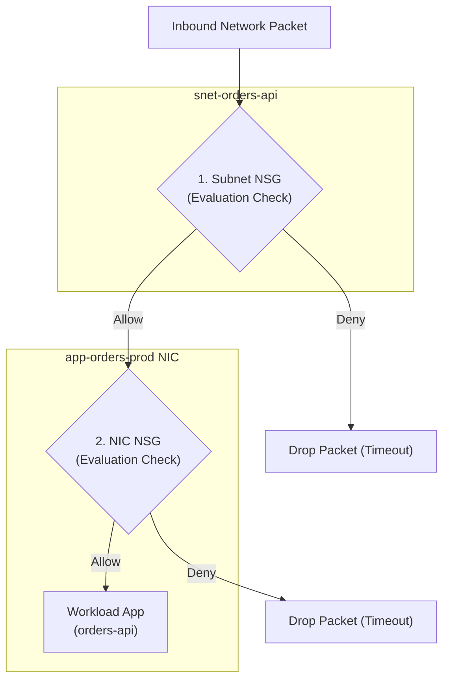

## Table of Contents

1. [Packet Flow Filtering: The Network Security Group Checklist](#packet-flow-filtering-the-network-security-group-checklist)
2. [Network Security Groups: The Software-Defined Checkpoint](#network-security-groups-the-software-defined-checkpoint)
3. [Rule Shape](#rule-shape)
4. [Priority and Rule Evaluation](#priority-and-rule-evaluation)
5. [Default Rules](#default-rules)
6. [Under-the-Hood: Stateful Flow and Connection Tracking](#under-the-hood-stateful-flow-and-connection-tracking)
7. [The Dual-Evaluation Pipeline: Subnet and NIC NSGs](#the-dual-evaluation-pipeline-subnet-and-nic-nsgs)
8. [Application Security Groups: Logical Role Resolvers](#application-security-groups-logical-role-resolvers)
9. [Effective Rules: Resolving Conflict](#effective-rules-resolving-conflict)
10. [Putting It All Together](#putting-it-all-together)
11. [What's Next](#whats-next)

## Packet Flow Filtering: The Network Security Group Checklist

A Network Security Group (NSG) is Azure's checklist of network rules for subnet and network interface traffic. Each rule looks at a packet, which is a small chunk of data traveling across the network, and decides whether that packet is allowed or denied.

Example: an NSG can allow HTTPS traffic on port `443` from `asg-app-gateway` to `asg-orders-api`, while denying Remote Desktop traffic on port `3389` from the internet.

It is a stateful packet filtering firewall that controls inbound and outbound network traffic flowing across subnets and individual virtual network interfaces.

To construct a resilient architecture, you must separate physical layout from traffic permissions. Designing a Virtual Network (VNet) topology with public and private subnets determines where resources *can* physically communicate. However, topology alone does not prevent traffic from crossing those boundaries.

By default, subnets in the same VNet are fully routable to each other. If your database subnet and your public web servers share the same VNet space, the web servers can open sockets directly to your database interfaces, exposing your persistent data blocks to compromise.

Network Security Groups solve this vulnerability by establishing software-defined packet filters. An NSG does not look at high-level application headers, HTTP request paths (`/orders`), or user login session cookies.

It functions at the network layer, inspecting every packet for six fundamental coordinates: direction, source address, source port, destination address, destination port, and protocol. If a packet matches a rule's criteria, the NSG returns an allow or deny decision, blocking unauthorized packets at the virtual switch level before they can reach your workload.



## Network Security Groups: The Software-Defined Checkpoint

An NSG is reusable because Azure lets you attach the same rule list to a subnet, an individual Network Interface Card (NIC), or both. The attachment point decides where packets are checked.

Example: `nsg-orders-api` can protect the whole `snet-orders-api` subnet, while a separate NIC-level NSG can add a stricter rule for one VM that should only accept SSH from a jump host.

When you apply an NSG to `snet-orders-api`, the rules are enforced by Azure's software-defined network layer rather than by your application code. The workload's operating system does not need to run a local firewall rule for the NSG to apply.

This packet-filter design is fast and useful, but it is not a complete DDoS or resource-exhaustion defense by itself. NSGs decide whether packet flows are allowed or denied. Public exposure, volumetric attacks, application-layer floods, and backend saturation still need the right public entry service, DDoS protection posture, health probes, scaling limits, and application controls.

## Rule Shape

An NSG rule is a packet-match record. It has a source, source port, destination, destination port, protocol, direction, priority, and access result. The access result is `Allow` or `Deny`.

For the orders API, a readable rule looks like this:

| Field | Value |
| --- | --- |
| Direction | Inbound |
| Source | `asg-app-gateway` |
| Source port | `*` |
| Destination | `asg-orders-api` |
| Destination port | `443` |
| Protocol | TCP |
| Access | Allow |
| Priority | `100` |

The rule controls a network flow instead of app permission. It lets the gateway open a TCP connection to the API. User sign-in, API health, and Key Vault permissions are separate checks.

That separation is useful. When a request fails, you can ask whether the packet passed the network rule before you debug identity, secrets, routes, or app code.

## Priority and Rule Evaluation

NSG priority is the rule order that decides which matching rule wins. Azure evaluates NSG rules in a strict, sequential order based on a priority number ranging from `100` to `65000`. Rules with lower priority numbers are processed first.


*NSG troubleshooting starts with priority order because the first matching rule stops the evaluation.*

When a packet arrives at the virtual switch, the security controller walks the priority list from lowest to highest:

```plain
Evaluating Inbound Packet:
  ├── Priority 100: Allow TCP 443 ──> Match! (Stop evaluation and ALLOW)
  ├── Priority 200: Allow TCP 1433 ── (Skipped)
  └── Priority 65000: Deny All Inbound ── (Skipped)
```


*A packet is decided by the first matching NSG rule, so a lower-numbered broad rule can hide every specific rule below it.*

The moment a packet matches all parameters of a rule (such as matching the destination port and source IP), the evaluation loop **stops immediately**. Azure applies that rule's access decision (Allow or Deny) and discards the rest of the list.

Understanding this sequence is vital. A broad `Deny All` rule placed at priority `100` will block every single connection attempt, completely blinding any highly specific `Allow` rules defined at priority `500`.

Conversely, a loose `Allow All` rule at priority `100` will bypass all security filters you attempt to place below it. When writing rules, always leave gaps between priority numbers (e.g. `100`, `110`, `120`) to allow room for future, highly specific rules.

## Default Rules

NSGs include default security rules. Those defaults are not empty background noise. They already allow some VNet traffic, allow Azure load balancer traffic, and deny inbound internet traffic. They also allow outbound internet traffic unless you create stricter outbound rules.

This surprises teams that assume a new NSG starts as a blank firewall. A workload may already be able to talk to other resources in the same VNet because of default virtual-network rules. If you need a stricter boundary between application tiers, you may need explicit deny and allow rules with the right priority.

For `orders-api`, the review should answer:

```plain
Do we depend on default VNet allow rules?
Which explicit rules describe intended app flows?
Which broad flows are denied before they become accidental access?
```

Defaults make simple networks easy. Production reviews should still name the flows the app needs.

## Under-the-Hood: Stateful Flow and Connection Tracking

A Network Security Group is a **stateful firewall**. This means that when a rule permits a connection to open, the NSG remembers that connection state and automatically permits all subsequent response traffic to flow in both directions.

To implement this stateful behavior without degrading network throughput, Azure's virtual switch hypervisors run a high-performance **connection tracking (conntrack)** engine directly inside the host kernel's packet processing path, similar to the Netfilter conntrack architecture in Linux systems.

When your application initiates or receives a connection request:
1.  **SYN Interception**: The virtual switch intercepts the initial TCP SYN packet (or the first packet of a UDP stream). It checks if a matching connection record exists in its conntrack state table.
2.  **State Insertion**: Since it is a new request, no record exists. The hypervisor runs the packet through the complete NSG rules list by evaluating priorities from lowest to highest. If a rule allows the packet, the conntrack engine creates a new record in its state table, indexing it by the **5-tuple key**:
    *   Source IP Address
    *   Source Port
    *   Destination IP Address
    *   Destination Port
    *   Protocol (TCP or UDP)
    The connection state is marked as `NEW`.
3.  **Handshake Completion**: Once the three-way TCP handshake completes (SYN -> SYN-ACK -> ACK), the conntrack engine transitions the connection state to `ESTABLISHED`.
4.  **Bypassing the Rules List**: For all subsequent packets belonging to this 5-tuple, the virtual switch matches the packet directly against the `ESTABLISHED` conntrack cache. The packet bypasses the prioritized NSG rules evaluation entirely, allowing it to traverse the virtual network at near-wire speeds.

```plain
Inbound TCP SYN -> Evaluated by NSG List -> Allowed -> Conntrack creates 5-tuple record (NEW)
Response TCP SYN-ACK -> Matches Conntrack Cache -> Bypasses NSG List -> Allowed Automatically (ESTABLISHED)
```

This stateful architecture operates identically for UDP streams, even though UDP is a stateless protocol. When a UDP packet is sent, the conntrack engine creates a pseudo-connection record with a default idle timeout (typically 4 minutes). As long as packets continue to flow within this timeout window, the return traffic is allowed automatically.

This stateful behavior significantly improves performance and simplifies configuration. You do not need to create fragile outbound rules to allow ephemeral response traffic back to clients. Outbound NSG rules are only evaluated when your container **initiates** a new connection to an external target (such as calling a payment API).

## The Dual-Evaluation Pipeline: Subnet and NIC NSGs

Dual evaluation means a packet may need to pass both the subnet NSG and the NIC NSG. When you associate an NSG with a subnet and also apply an NSG to an individual network interface (NIC), Azure processes packets through a strict dual-evaluation pipeline.


*A packet may pass one NSG and still be blocked by the other, so effective access is the intersection of both checkpoints.*

This pipeline evaluates packets sequentially, and the order of evaluation depends entirely on the direction of the traffic:

```plain
Inbound Flow:  [Subnet NSG] (Must Allow) ───> [NIC NSG] (Must Allow) ───> Container App
Outbound Flow: Container App ───> [NIC NSG] (Must Allow) ───> [Subnet NSG] (Must Allow)
```

### Inbound Request Evaluation
When an ingress packet arrives from the internet, Azure first processes the packet against the **Subnet-level NSG**. If the subnet rules allow the packet, it is then forwarded to the **NIC-level NSG**.

The packet is allowed to reach your application **only if both independent checks return Allow**. If either layer denies the packet, the connection is dropped.

### Outbound Request Evaluation
When your container initiates an outbound connection, Azure reverses the sequence. The packet is first evaluated by the **NIC-level NSG**.

If allowed, it is then processed by the **Subnet-level NSG**. The packet is allowed to leave the physical network only if both layers approve the flow.

This dual-layer evaluation is highly robust but can lead to complex routing blocks. If you deploy an VM and its NIC NSG allows database traffic on port `1433`, but the parent subnet's NSG blocks all outbound database ports, the traffic is dropped. To maintain a clean architecture and prevent diagnostic confusion, prefer placing security controls at the **Subnet scope**, utilizing NIC-level NSGs strictly as exceptional overrides.

:::expand[Subnet NSG Blocks What the NIC NSG Allows]{kind="pitfall"}
Under Azure's dual-evaluation pipeline, an inbound packet must be allowed by both the Subnet-level NSG and the NIC-level NSG. A common diagnostic trap occurs when a database engineer adds a rule to the database VM's NIC NSG allowing TCP port `1433`, but the network team has placed a restrictive `Deny All` rule on the database subnet's NSG. Because the subnet NSG intercepts the inbound packet first, the packet is instantly discarded. The database VM never sees the packet, and the client application times out with zero feedback.

This matches the behavior in AWS when combining **Security Groups** (which attach directly to instance ENIs) and **Network Access Control Lists (NACLs)** (which attach at the subnet boundary). If an AWS NACL blocks port `1433`, the client is blocked even if the instance's Security Group explicitly allows it. However, while AWS NACLs are stateless (requiring return rules), Azure NSGs are stateful at both layers, but still require dual-open configuration.

To locate exactly where a packet is being dropped in the dual-evaluation pipeline, run the CLI effective rules query:
```bash
az network nic show-effective-nsg --name nic-orders-db-prod --resource-group rg-orders-prod-uksouth
```

This command returns the combined, evaluated ruleset and indicates the deciding NSG:

| NSG Layer | Configured Rule for Port 1433 | Evaluation Outcome |
| :--- | :--- | :--- |
| **Subnet NSG** | `Deny All Inbound` (Priority 1000) | **Dropped** (Sequence stops here; NIC NSG is never reached) |
| **NIC NSG** | `Allow SQL Inbound` (Priority 100) | Neutralized (Effective only if subnet gate is opened) |
| **Final Result** | **Blocked** | Connection times out silently |

**The Fix:** Align your security architecture by removing NIC-level NSGs entirely and standardizing all rules on Subnet-level NSGs. Group virtual machines using Application Security Groups (ASGs) at the subnet scope, keeping your firewall topology clean, auditable, and centralized.
:::

## Application Security Groups: Logical Role Resolvers

An Application Security Group (ASG) is a named workload group that NSG rules can reference instead of hardcoded IP addresses. It allows you to write NSG rules using workload roles rather than fragile, hardcoded IP address blocks.

Example: instead of allowing `10.30.2.4`, `10.30.2.5`, and `10.30.2.6`, an NSG rule can allow traffic from `asg-orders-api` to `asg-orders-sql` on port `1433`.

In traditional datacenter networks, if your web servers need to connect to your database servers, you must write firewall rules listing the exact IP addresses of every database node. If your database cluster autoscales and provisions a fourth node, your firewall rules instantly break until an operator manually adds the new IP.

Application Security Groups solve this maintenance overhead by acting as logical role groups. You create an ASG (such as `asg-orders-api` and `asg-orders-sql`) and associate the network interfaces of your resources with these groups.

Under the hood, when a virtual machine's network interface card (NIC) is associated with an ASG:
1.  **Dynamic Metadata Registration**: The ARM controller writes the NIC-to-ASG mapping into the software-defined networking directory database.
2.  **Hypervisor Table Updates**: The controller immediately pushes this mapping to the physical host hypervisors that run your virtual machines.
3.  **Real-Time IP Resolution**: When an NSG rule references `asg-orders-sql` as a destination, the hypervisor's virtual switch evaluates the rule by dynamically resolving the ASG to the list of active private IP addresses in real time.

This means your security rules stay completely decoupled from your physical IP space. If your database cluster scales out from three nodes to ten, the automation simply tags the new virtual machine NICs with the `asg-orders-sql` group. The new nodes inherit the firewall rules instantly, and the NSG configuration remains untouched, preventing manual security changes during autoscale events.

To construct this relationship in Bicep, you define the network interface resource and link its IP configuration block directly to the target ASG resource ID:

```bicep
// Reference the existing Application Security Group
resource dbAsg 'Microsoft.Network/applicationSecurityGroups@2021-08-01' existing = {
  name: 'asg-orders-sql'
}

// Provision the Network Interface Card associated with the ASG
resource dbNic 'Microsoft.Network/networkInterfaces@2021-08-01' = {
  name: 'nic-orders-db-prod'
  location: resourceGroup().location
  properties: {
    ipConfigurations: [
      {
        name: 'ipconfig1'
        properties: {
          privateIPAllocationMethod: 'Dynamic'
          subnet: {
            id: '/subscriptions/.../subnets/snet-orders-db'
          }
          applicationSecurityGroups: [
            {
              id: dbAsg.id
            }
          ]
        }
      }
    ]
  }
}
```

This clean declarative structure makes your network architecture portable and easy to audit across environments.

## Effective Rules: Resolving Conflict

When packet behavior is surprising, inspect the effective security rules for the resource. Effective rules show what Azure is actually applying after subnet rules, NIC rules, default rules, and ASG membership are considered.

Good evidence names the flow and the matching rule:

```plain
Flow:
  Source: asg-app-gateway
  Destination: asg-orders-api
  Port: TCP 443
Expected rule:
  AllowAppGatewayToApi priority 100
Unexpected blocker:
  DenyAllInbound or broader deny with lower priority number
```

That evidence is better than "NSG looks fine." It says which packet should match which rule. If the packet still fails, the next layer might be route, health probe, DNS, service firewall, or the application itself.

## Putting It All Together

Operating a secure virtual network requires managing packet flows through the prioritized gates of Azure NSGs:

*   **Rely on Stateful Flow**: Leverage the connection tracking (`conntrack`) engine to manage ephemeral return traffic automatically, focusing rules on connection initiations.
*   **Audit the Dual-Evaluation Pipeline**: Understand that packets must pass both Subnet-level and NIC-level NSGs, resolving rules at the Subnet scope by default.
*   **Decouple IPs with ASGs**: Group network cards logically by application role, allowing firewall rules to scale seamlessly without manual IP adjustments.
*   **Manage Priority Hierarchies**: Sequence rules intentionally, leaving gaps between priority numbers to allow room for future, highly specific filters.
*   **Inspect Effective Rules**: Run CLI diagnostics to verify the final compiled rule set that Azure applies to the network interfaces, eliminating diagnostic ambiguity during outages.

## What's Next

The private packet path is now controlled. The next article moves to the public side: when users visit a hostname, which Azure entry point receives the request first?

In the next chapter, we will study **Public Entry Points**. We will compare Layer 4 load balancing (Azure Load Balancer) with regional Layer 7 application routing (Application Gateway) and global Anycast routing (Azure Front Door). We will learn how to design secure public entries and configure backend ingress locking to prevent direct public network attacks.

This ensures our private network interfaces remain insulated while accepting verified internet traffic.


*Use this as the packet checklist: evaluate the subnet NSG, then the NIC NSG, remember that the first matching priority wins, and use ASGs to target roles instead of memorizing IP lists.*


---

**References**

* [Azure Network Security Groups Overview](https://learn.microsoft.com/en-us/azure/virtual-network/network-security-groups-overview) - Physical and logical architecture of NSG switches.
* [How Network Security Groups work](https://learn.microsoft.com/en-us/azure/virtual-network/network-security-group-how-it-works) - Stateful conntrack engine and rule processing logs.
* [Application Security Groups Guide](https://learn.microsoft.com/en-us/azure/virtual-network/application-security-groups) - Logical role groupings for automated scaling networks.
