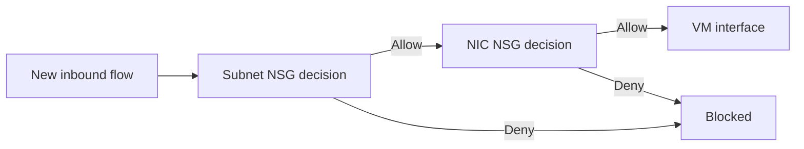

## Table of Contents

1. [What Does an NSG Control?](#what-does-an-nsg-control)
2. [Where Can You Attach an NSG?](#where-can-you-attach-an-nsg)
3. [What Makes Up an NSG Rule?](#what-makes-up-an-nsg-rule)
4. [How Do Priority, First Match, and Default Rules Work?](#how-do-priority-first-match-and-default-rules-work)
5. [Why Are NSGs Stateful?](#why-are-nsgs-stateful)
6. [How Do ASGs, Service Tags, and Augmented Rules Simplify Policies?](#how-do-asgs-service-tags-and-augmented-rules-simplify-policies)
7. [How Should Outbound Rules Be Designed?](#how-should-outbound-rules-be-designed)
8. [How Do You Verify Effective Network Access?](#how-do-you-verify-effective-network-access)
9. [Check Your Answers](#check-your-answers)
10. [References](#references)

A web server at `10.20.2.4` wants to connect to a database at `10.20.3.7` on TCP port `1433`. Azure may already have a route between their subnets. That tells us how the packet can reach the database, but it leaves another question: should this web server be allowed to make that connection?

A **Network Security Group**, or **NSG**, evaluates that question using the connection's addresses, ports, and protocol. It lets you allow the communication a system needs and restrict other traffic. Understanding those rules starts with the packet itself, then the places where the rules apply and the order in which Azure evaluates them.

These questions will help you follow the decision from a new connection to the evidence needed to troubleshoot it:

1. **What Does an NSG Control?**
2. **Where Can You Attach an NSG?**
3. **What Makes Up an NSG Rule?**
4. **How Do Priority, First Match, and Default Rules Work?**
5. **Why Are NSGs Stateful?**
6. **How Do ASGs, Service Tags, and Augmented Rules Simplify Policies?**
7. **How Should Outbound Rules Be Designed?**
8. **How Do You Verify Effective Network Access?**

## What Does an NSG Control?
<!-- section-summary: NSGs permit or deny Layer 3/4 flows using addresses, ports, and protocol; routes and NAT still perform their separate networking jobs. -->

Azure's NSG is a **Layer 3/Layer 4 traffic filter**. Layer 3 concerns network addresses and packet delivery, while Layer 4 concerns transport protocols and ports. The NSG therefore works with facts such as a source IP, destination IP, TCP or UDP, and the port at which a service is being contacted. Microsoft's [NSG overview][1] describes this inbound and outbound filtering model.

For the web-to-database connection, the web server chooses source port `51032`. It contacts destination `10.20.3.7:1433` from `10.20.2.4:51032`. Those address-and-port pairs identify the endpoints of the connection. Azure evaluates the following **five-tuple**, meaning this combination of five fields:

| Field | Example value |
| --- | --- |
| Source IP | `10.20.2.4` |
| Source port | `51032` |
| Destination IP | `10.20.3.7` |
| Destination port | `1433` |
| Protocol | TCP |

An NSG uses matching rules to decide whether this kind of traffic is allowed or denied. It does not need to understand the database query to make that decision. At this layer, the question is whether this source may contact this destination using the specified transport protocol and port.

### Keep forwarding and filtering separate

Suppose the application instead contacts `10.50.4.7` on TCP port `443`. An allow rule for traffic from `10.20.2.0/24` to `10.50.4.0/24` does not create the route to that remote address. You may still need a route for `10.50.0.0/16` through a VPN gateway.

A missing route causes failure even if the NSG permits the flow. A valid route also cannot overcome an NSG deny. Routing identifies the path, and filtering decides whether the flow is permitted to use it. Both requirements have to hold for the request to proceed.

The same separation applies to outbound internet access. An NSG can contain `AllowInternetOutBound`, but that rule does not supply a public source address for a VM at `10.20.2.4`. Where required, the workload still needs an outbound method such as NAT Gateway, a public IP, load-balancer outbound configuration, Azure Firewall, or another explicit egress path.

**NAT**, Network Address Translation, changes address information as traffic crosses a boundary. The route selects where the packet goes; the NSG permits or denies it; outbound NAT represents the private source through a suitable public address. Treating one of these settings as a replacement for the others leads to misleading conclusions about connectivity.

### Place NSGs alongside other security controls

An NSG can answer whether `10.20.1.5` may contact `10.20.2.8` on TCP port `443`. It does not inspect the HTTP Host header, URL path, logged-in user, TLS application identity, or SQL query carried by that connection.

Azure Firewall can provide richer centralized network and application filtering, including capabilities such as threat intelligence. A **Web Application Firewall**, or **WAF**, evaluates web requests for patterns such as SQL injection and cross-site scripting. These work at different levels from an NSG's address, protocol, and port filtering, as the [network security design guide][2] explains.

Keeping these distinctions visible also makes troubleshooting more precise. An NSG allow is evidence about one Azure filtering layer. It does not prove that the operating-system firewall permits the connection, TLS succeeds, or the application accepts the request. Those later checks remain necessary when the packet reaches the destination.

## Where Can You Attach an NSG?
<!-- section-summary: Subnet and NIC NSGs apply at separate scopes; when both govern a flow, each must permit it and their priority lists remain independent. -->

An NSG can be associated with a **subnet** or a **network interface**, usually shortened to **NIC**. A subnet is a range within the VNet that groups resources by placement. A NIC is the network interface through which a VM sends and receives traffic.

For example, VNet `10.20.0.0/16` can contain application subnet `10.20.2.0/24` with an associated NSG named `nsg-app-subnet`. VM A inside that subnet can also have `nsg-vm-a` attached to its NIC, while VM B uses only the subnet policy. The [NSG and ASG design guide][2] describes these association scopes.

The subnet association applies the subnet's policy across the relevant resources in that area. A NIC association provides a more specific filtering layer for the individual interface. Understanding which associations exist is necessary before interpreting a rule: a rule in an unrelated NSG says nothing about this VM's effective traffic policy.

### Use subnet policies to express security areas

Consider web subnet `10.20.1.0/24`, application subnet `10.20.2.0/24`, and data subnet `10.20.3.0/24`, with `nsg-web`, `nsg-app`, and `nsg-data` respectively. Their intended flows might allow internet HTTPS to the web tier, HTTPS from web to application, and SQL on port `1433` from application to database.

That division gives the policy identifiable source and destination areas. Unexpected paths, such as direct internet access to the database or web access to a database administration port, can then be denied. This is **network segmentation**: separating the communication that different parts of the application are permitted to initiate or receive.

The subnet names alone do not enforce this design. Each relevant NSG needs rules that express the intended flows and account for Azure's default rules. Later in the article we will make that explicit with a specific allow followed by a broader deny.

### Understand the additional NIC layer

Suppose ten machines occupy the application subnet, but a particular administration VM requires extra filtering. A NIC-level NSG can provide that additional layer while retaining the shared subnet policy.

For inbound traffic, Azure evaluates the subnet NSG before the NIC NSG. For outbound traffic, it evaluates the NIC NSG before the subnet NSG. When both apply, a deny at either layer blocks the flow. This evaluation order is described in the [VNet and subnet design guidance][3].


```mermaid
flowchart LR
    incoming["New inbound flow"] --> subnet["Subnet NSG decision"]
    subnet -->|"Allow"| nic["NIC NSG decision"]
    nic -->|"Allow"| vm["VM interface"]
    subnet -->|"Deny"| blocked["Blocked"]
    nic -->|"Deny"| blocked
    class incoming,vm workload
    class subnet,nic decision
    class blocked boundary
```

The two NSGs do not form one merged priority list. Imagine a subnet rule at priority `100` allows TCP `443`, while a NIC rule at priority `400` denies it. The subnet's lower number does not defeat the NIC's deny. Each number orders rules within its own NSG; the traffic has to pass both independent evaluations.

This distinction is especially important when a colleague points to one allow rule as proof that the VM should be reachable. Ask which NSG contains it and whether another applicable association denies the same flow. A working network policy is the result across the relevant layers, not the most favorable individual rule.

## What Makes Up an NSG Rule?
<!-- section-summary: Rules define direction, protocol, source and destination addresses and ports, action, and priority; service ports usually belong in the destination field. -->

A rule states a direction and protocol, source and destination criteria, source and destination ports, an action, and a priority. Direction describes whether the evaluated traffic is inbound or outbound at the resource being protected. The action is Allow or Deny. Priority determines where this rule is evaluated within the NSG.

A rule named `Allow-Web-To-App` can be expressed as follows:

| Rule field | Value |
| --- | --- |
| Direction | Inbound |
| Protocol | TCP |
| Source | `10.20.1.0/24` |
| Source port | `*` |
| Destination | `10.20.2.0/24` |
| Destination port | `443` |
| Action | Allow |
| Priority | `200` |

In plain language, this rule permits new inbound TCP flows from the web subnet to port `443` in the application subnet, regardless of the client's chosen source port. That sentence is a useful review tool: each field should contribute to an understandable communication requirement.

### Distinguish the client port from the service port

A web server at `10.20.1.8` may choose local port `52843` when contacting `10.20.2.9:443`. Port `443` identifies the destination service. Port `52843` is an **ephemeral port**, meaning a temporary client-side port selected for the connection.

The next connection might use a different client port, such as `52844` or `52845`. Trying to predict all those temporary values would make an ordinary HTTPS access rule unnecessarily fragile. This is why the source port is commonly `*`, while the destination port is the specific service port `443`.

The wildcard applies to that field; it does not make every part of the rule unrestricted. The example still limits source subnet, destination subnet, transport protocol, and destination port. Reading the entire rule prevents an overly broad interpretation of a single `*` value.

### Start with required flows

It is easier to write these rules after stating which communication the system needs. For a three-tier application, the desired connections can be: user to Application Gateway on TCP `443`; gateway to web on TCP `443`; web to API on TCP `443`; API to SQL on TCP `1433`; and API to Storage on TCP `443`.

Administration has its own path: the administrator reaches Bastion over HTTPS, and Bastion reaches the VM through SSH. This places management traffic on a deliberate private administration path rather than treating every VM as a public SSH destination.

The result is a list of communication requirements that can be translated into policy. Starting with “which rule should VM3 have?” encourages machine-specific entries without explaining their purpose. Starting with the allowed source, destination, and protocol makes each rule traceable to the architecture.

## How Do Priority, First Match, and Default Rules Work?
<!-- section-summary: Each NSG evaluates lower-numbered priorities first and stops at the first match; custom rules must account for broad built-in VNet and internet defaults. -->

Custom NSG priorities range from `100` through `4096`. Smaller numbers are evaluated first, so priority `100` precedes `200`, which precedes `1000`. Azure stops evaluation within that NSG at the first matching rule. These priority and first-match rules are defined in the [NSG overview][1].

For example, an inbound list could start with priority `100` denying all traffic from `203.0.113.5`, followed by priority `200` allowing Internet sources to port `443`, and priority `300` allowing Internet sources to port `80`. A packet from `203.0.113.5` to port `443` matches the first rule and is denied. The later HTTPS allow is not evaluated for that packet.

The logic resembles this ordered program:

```python
if traffic_matches(rule_100):
    return rule_100.action
elif traffic_matches(rule_200):
    return rule_200.action
elif traffic_matches(rule_300):
    return rule_300.action
```

This is conceptual rule evaluation, not executable Azure configuration. It shows why several matching rules do not vote on an outcome. Once the first match returns an action, later entries in that NSG no longer participate in this decision.

Leave room between priorities for future rules. Values such as `100`, `200`, `300`, and `400` leave space to insert priority `150` later. A sequence of `100`, `101`, `102`, and `103` gives less flexibility for an insertion between existing decisions. Microsoft's [rule-management guidance][4] recommends leaving gaps for this reason.

### Read the defaults as real rules

An NSG with no custom entries still contains Azure's default inbound and outbound rules. They participate in evaluation after the custom priority range:

| Direction | Priority | Default rule |
| --- | --- | --- |
| Inbound | `65000` | `AllowVNetInBound` |
| Inbound | `65001` | `AllowAzureLoadBalancerInBound` |
| Inbound | `65500` | `DenyAllInbound` |
| Outbound | `65000` | `AllowVnetOutBound` |
| Outbound | `65001` | `AllowInternetOutBound` |
| Outbound | `65500` | `DenyAllOutBound` |

These defaults cannot be deleted. Your custom entries, at priorities `100` to `4096`, are evaluated before them and can change which traffic ultimately receives an allow or deny. The [overview][1] lists the defaults and their ordering.

The default inbound posture permits matching VirtualNetwork traffic and Azure Load Balancer traffic before denying the remainder. Associating a new NSG with a VM therefore does not open arbitrary internet traffic. An internet SSH attempt to TCP `22` reaches the default deny unless a higher-priority custom rule permits it.

Be careful with a tutorial-style rule that allows source Internet to destination port `22`. It permits any internet address to attempt SSH authentication against a reachable machine. SSH still has its own authentication, but its network-facing attack surface has been deliberately exposed. Microsoft's [design guide][2] warns against `0.0.0.0/0` access to administration ports such as SSH `22` and RDP `3389`, and describes private administrative paths such as Bastion or VPN.

### Override broad internal access deliberately

Default `AllowVNetInBound` also means that putting web, application, and database resources into different subnets does not automatically give them strict internal isolation. A narrow custom allow followed by the broad default VNet allow can still permit other internal sources.

For a database that should accept SQL only from the application tier, a conceptual policy can use priority `100` to allow application-to-database TCP `1433`, then priority `200` to deny VirtualNetwork-to-database traffic more broadly. The intended SQL flow matches the first entry. Other matching internal sources reach the second entry and are denied before priority `65000` can allow them.

This is a **specific allow, broader deny** arrangement. Its correctness depends on both the ordering and the actual source and destination scope. Adding only the allow does not establish an exclusive list of permitted internal callers.

### Apply the pattern to a three-tier application

Consider a layout with gateway subnet `10.20.1.0/24`, web subnet `10.20.2.0/24`, application subnet `10.20.3.0/24`, and database subnet `10.20.4.0/24`. The required flows are gateway-to-web on `443`, web-to-application on `443`, and application-to-database on `1433`.

The web NSG can permit the Application Gateway subnet to reach the web tier on TCP `443` at priority `100`. With no separate custom internet allow, the gateway remains the public entry instead of allowing direct public access to every web VM. Any requirement to restrict other internal sources must still account for the broad default VNet rule.

The application NSG can allow `asg-web` to `asg-app` on TCP `443`. The database NSG can allow `asg-app` to `asg-db` on TCP `1433`. These ASG names identify logical workload-interface groups, explained in the next section. Appropriate broader denies are needed where the design requires all other internal callers to be excluded.

That policy can prevent a web-tier VM from connecting directly to the database even if the web tier is compromised. It does not claim to remove every possible attack path; it removes a particular unnecessary direct path. This is the practical purpose of segmentation: reduce reachable services to the connections the architecture requires.

## Why Are NSGs Stateful?
<!-- section-summary: NSGs remember allowed connections so replies are permitted, but separate new flows still need authorization and rule changes may not terminate existing sessions. -->

Suppose VM `10.20.2.4:51000` opens an allowed outbound TCP connection to `203.0.113.50:443`. The remote server's reply reverses those endpoints, coming from `203.0.113.50:443` to `10.20.2.4:51000`.

A **stateful** filter remembers the permitted flow. Azure therefore allows its response without requiring an independent inbound rule for destination port `51000`. Similarly, responding to a permitted inbound connection does not require a separately authored outbound allow for that response. The [NSG overview][1] describes this connection-state behavior.

The state belongs to the connection, not to every possible activity by the remote host. If `203.0.113.50` tries to start a new connection from port `40000` to the VM's SSH port `22`, that is a different flow. It must pass the applicable inbound evaluation as a new connection.

| Traffic | How to interpret it |
| --- | --- |
| Reply from `203.0.113.50:443` to `10.20.2.4:51000` | Response to the permitted connection |
| New request from `203.0.113.50:40000` to `10.20.2.4:22` | Separate inbound connection requiring its own allow |

This distinction prevents two opposite mistakes. You do not need to write an inbound exception for every temporary client port used by ordinary responses. You also must not assume that allowing one outbound HTTPS connection grants the remote machine broad inbound access.

### Test a new connection after changing a rule

State tracking affects rule changes as well. Suppose an administrator establishes an SSH session while an allow rule exists. Removing that rule may leave the established session active because its flow record can continue. New SSH connections are then evaluated under the changed policy and can be denied.

Microsoft documents this distinction in the [NSG overview][1]. Changing a rule should not be treated as a promise to immediately close every already-established TCP socket. This matters during incident response and during ordinary validation of a restrictive change.

If an existing session remains connected, that observation alone does not prove the new rule failed. Test a new connection and distinguish its result from the established session. Conversely, if the objective is to stop an active connection immediately, do not assume that editing the NSG has demonstrated that outcome.

The underlying routing requirements still apply to replies. Stateful permission lets a response pass the filtering layer; it does not construct a missing return route. Keep connection state and packet delivery separate when an allowed request reaches its destination but the application never receives a response.

## How Do ASGs, Service Tags, and Augmented Rules Simplify Policies?
<!-- section-summary: ASGs name workload NIC groups, service tags name Microsoft-maintained IP prefixes, and augmented rules combine explicit address and port sets without changing Layer 3/4 filtering. -->

Rules written around individual machine IPs can become difficult to maintain as applications scale. A web tier might begin with `web1` at `10.20.1.5` and `web2` at `10.20.1.6`, then add `web3` at `10.20.1.19` and `web4` at `10.20.1.27`. The architecture still says “web talks to application,” even though the set of interfaces has changed.

Azure supplies **Application Security Groups**, or **ASGs**, to represent logical collections of NICs. You can place the web interfaces in `asg-web`, application interfaces in `asg-app`, and database interfaces in `asg-db`. An NSG can then use those groups as source or destination criteria.

For example, a rule can allow TCP `443` from `asg-web` to `asg-app`, instead of listing `10.20.1.5`, `10.20.1.6`, and each new web-machine address. A related application-to-database architecture might use port `5432` for its database connection, while the earlier SQL example uses `1433`. The port in the policy must match the service used by that example; the logical grouping does not choose it for you.

An ASG groups interfaces for rule matching. It does not introduce application-layer inspection or authorize a business operation. Its benefit is that a rule expresses the workload roles that explain why the flow is needed. Microsoft also specifies that an ASG's member NICs must be in the same VNet; see the [ASG design guidance][2].

### Use service tags for managed address ranges

A **service tag** addresses a different maintenance problem. Rather than maintaining every Azure Storage IP prefix yourself as platform ranges evolve, you can reference the Microsoft-maintained `Storage` tag where the NSG field supports it. Other examples include `AzureLoadBalancer`, `VirtualNetwork`, and `Internet`.

Microsoft manages the prefixes behind these tags. The rule still matches IP networking information. A destination of `Storage` does not mean “allow a hostname containing storage.azure.com”; it means the relevant address prefixes represented by that tag. Service tags do not inspect DNS names, HTTP headers, URL paths, users, or queries.

Be especially careful with `VirtualNetwork`. It does not simply mean the exact subnet attached to the NSG, or exactly five machines you have in mind. Depending on topology, its effective prefixes can include the VNet and certain connected or learned network ranges. The [NSG diagnosis guidance][5] discusses this broader scope.

Where a precise boundary matters, name the required application subnet or use the appropriate ASG. That makes the policy's scope visible instead of relying on a narrower interpretation of `VirtualNetwork` than its actual semantics provide.

### Combine rules only when their meaning stays clear

**Augmented security rules** can combine multiple explicit IP addresses or ranges and multiple ports or port ranges in one rule, within platform limits. For example, a rule might cover sources `10.10.1.0/24`, `10.10.2.0/24`, and `10.10.8.4`, with ports `80`, `443`, and `8080-8090`.

This avoids multiplying every address-and-port combination into a separate entry. The capability improves manageability, as described in the [NSG overview][1], but it should not erase the rule's purpose. A large allow with many sources, destinations, ports, and protocols can be harder to audit than several focused rules.

A readable rule should still translate into a clear statement such as “web servers may initiate HTTPS connections to application servers.” That statement maps naturally to source `asg-web`, destination `asg-app`, protocol TCP, destination port `443`, and action Allow. Grouping syntax should make this intent easier to maintain, not conceal an unnecessarily broad permission.

The three tools now have distinct jobs. ASGs name the workload interfaces you manage. Service tags name the platform-maintained prefixes Azure manages. Augmented rules combine explicit sets in a manageable representation. None changes the basic NSG decision from Layer 3/4 matching into application-level authorization.

## How Should Outbound Rules Be Designed?
<!-- section-summary: Outbound NSGs restrict what workloads may initiate; explicit dependencies must be allowed before broader denies override Azure's permissive defaults. -->

The default outbound sequence includes `AllowVnetOutBound` and `AllowInternetOutBound` before `DenyAllOutBound`. Without more restrictive custom rules, NSG filtering generally permits outbound flows matching those broad destinations. The route and outbound translation mechanism still decide whether an allowed flow can actually leave.

Outbound policy matters after a compromise as well as during normal operation. Code running on a compromised web server may try to contact a malware command server, attacker-controlled storage, an arbitrary internet service, or a sensitive internal system. Restricting incoming traffic does not by itself limit those newly initiated outbound connections.

An application policy might allow TCP `443` to required Azure services while rejecting unrelated destinations. For more sophisticated destination or application-layer control, an NSG alone may be insufficient because it primarily matches IPs, ports, and protocols. Use the distinction between NSG filtering and richer firewall policy introduced at the beginning of the article.

### Put required dependencies before broader denies

A database server that should not contact arbitrary internet services can have a custom outbound policy. Priority `100` might allow the database to reach a required monitoring destination on TCP `443`. Priority `200` might deny other database traffic to Internet. Traffic matching that second rule is rejected before the built-in `65001 AllowInternetOutBound` entry is reached.

This uses the same first-match mechanism as inbound segmentation. The monitoring exception must come before the broader deny so its traffic receives the intended action. A correct priority number with the wrong source, destination, or port still fails to express the required dependency.

Before applying broad outbound restrictions, identify the workload's actual dependencies. These can include DNS, identity endpoints, package repositories, monitoring, storage, time services, certificate endpoints, and Azure platform services. A rule described only as “deny all outbound” can interrupt one of these dependencies and produce an application symptom that looks unrelated to networking.

The useful sequence is to understand dependencies, allow required flows, deny unwanted flows, and observe the resulting failures and logs. This provides a reason for every exception. Opening arbitrary ports after an unexplained failure makes the policy harder to understand and may reintroduce the exposure the restriction was intended to remove.

### Give each workload area an outbound purpose

In a simple production VNet at `10.20.0.0/16`, the ingress subnet can allow only required ingress, the application subnet can allow its ingress-tier callers and required outbound connections, and a worker subnet can have workload-specific rules. The data subnet can accept the necessary application or worker data ports, while administration uses Bastion, VPN, or another private path.

This arrangement describes a flow through approved ingress, frontend, backend, and data services. It avoids treating every resource in the VNet as a peer that should freely contact every other resource. The goal is a clear list of necessary communication, including outbound dependencies and management traffic, rather than isolation inferred only from subnet names.

A small matrix makes the intended boundaries explicit:

| Source | Destination | Protocol and port | Required? |
| --- | --- | --- | --- |
| Internet | Gateway | TCP `443` | Yes |
| Internet | Application VM | TCP `443` | No |
| Internet | Database | Any | No |
| Web | API | TCP `443` | Yes |
| Web | Database | TCP `1433` | No |
| API | Database | TCP `1433` | Yes |
| Database | Internet | Any | Usually no, or tightly controlled |

The matrix records design intent. The NSGs implement it through sources, destinations, actions, and ordering. Verification must then show that the actual policy produces the same results for the relevant new flows.

## How Do You Verify Effective Network Access?
<!-- section-summary: Inspect all effective policy layers and test a concrete flow, while separately verifying DNS, routes, listeners, other firewalls, and the return path. -->

Finding priority `100` in `nsg-app` with an HTTPS allow is not enough to prove access to a VM. Its NIC may also be subject to a subnet NSG, a NIC NSG, and Azure Virtual Network Manager security admin rules. The important result is the **effective security policy**, meaning the rules that actually govern this interface and flow.

Azure Network Watcher's **effective security rules** view aggregates applicable rules, including subnet and NIC NSGs and security admin rules. The [effective-rule overview][6] explains that view. It helps you inspect the combined policy instead of considering one configured NSG in isolation.

### Account for security admin rules

Larger organizations can use Azure Virtual Network Manager to apply **security admin rules** across virtual networks. These rules have precedence over ordinary NSG evaluation. Certain actions can deny or always allow traffic before the normal NSG result decides it, as described in the [NSG overview][1].

This is another reason to avoid concluding that a flow works just because “my NSG says Allow.” An enterprise policy layer can affect the result before that local rule list governs it. Conversely, an administrative always-allow action means the effective result may not match an expectation formed from NSG rules alone.

The practical approach is to identify all applicable policy layers, then inspect their effective behavior for the particular interface and direction. That gives a concrete explanation when an apparently reasonable local rule change has no observed effect.

### Ask about one flow with IP Flow Verify

Network Watcher's **IP flow verify** evaluates a concrete traffic question and identifies the NSG rule responsible for Allow or Deny. Instead of manually comparing dozens of entries without a clear test case, supply the VM, direction, protocol, and local and remote connection details.

For example, the question can describe inbound TCP from remote IP `10.20.1.5` to local IP `10.20.2.7` on local port `443`. The result reports whether the evaluated flow is allowed or denied and which matching rule explains it. Microsoft's [NSG troubleshooting guidance][7] describes the tool's use.

This is evidence about rule evaluation. It should be paired with the other layers needed for a successful application connection, not treated as proof that the remote process is healthy. A permitted packet can still arrive at a machine with no listening service.

### Follow the failed connection end to end

Suppose web host `10.20.2.5` cannot contact application host `10.20.3.8:443`. Begin by verifying that DNS produced the intended IP and that the destination is actually listening on port `443`. Check the route to `10.20.3.8`, then identify the applicable subnet and NIC NSGs.

Inspect the matching inbound rule at the destination and the matching outbound rule at the source. Determine whether another firewall or network virtual appliance is on the path. Check the return route, and use IP flow verify for the concrete connection. This sequence provides evidence before any rule is broadened.

If the application is bound only to `127.0.0.1:443`, it is listening on the machine's loopback interface rather than accepting the intended remote connection. If the application is stopped, there is no process to accept the packet at all. An Azure NSG allow fixes neither condition.

A successful rule evaluation also does not establish that the operating-system firewall permits the request, TLS completes, or the application responds correctly. Each of those checks concerns what happens after or alongside the Azure network filter. The failure should be assigned to the layer supported by the evidence.

The reverse distinction matters too. Azure may have a valid route for `10.20.3.0/24` through the VNet while an NSG denies TCP `443`. Routing is working in that example; filtering is the reason the connection is rejected. Editing the route would target the wrong part of the problem.

### Keep each component's responsibility visible

A VNet defines the private routing domain, and subnets partition its address space. Routes and UDRs determine packet paths. NSGs permit or deny Layer 3/4 traffic. ASGs provide names for workload-interface groups, and service tags provide names for Azure-managed prefix groups.

NAT Gateway translates private outbound source addresses. Azure Firewall provides richer centralized traffic policy, while a WAF protects web applications at the application layer. These components can work together, but their responsibilities remain separate.

Inside the NSG, the mechanism is now straightforward: choose inbound or outbound evaluation, match addresses, ports, and protocol, process the priority order, and use the first matching action. Stateful flow tracking permits replies to accepted connections. Following these rules, together with the actual attachment points and any higher-level policy, explains which new flows the network allows.

## Check Your Answers

:::expand[What Does an NSG Control?]{kind="recap"}
An NSG allows or denies Layer 3/4 flows using source and destination addresses and ports, protocol, and direction. It does not create a route, supply outbound NAT, inspect an HTTP operation, or prove that a destination application is working.
:::

:::expand[Where Can You Attach an NSG?]{kind="recap"}
An NSG can apply to a subnet or NIC. Inbound evaluation reaches the subnet NSG before the NIC NSG; outbound evaluation reverses that order. When both apply, both must permit the flow. Priorities are compared within each NSG, not between them.
:::

:::expand[What Makes Up an NSG Rule?]{kind="recap"}
A rule identifies direction, protocol, source and destination, their ports, action, and priority. The client commonly chooses an ephemeral source port, so rules often use source `*` and a specific destination service port. Required communication flows explain the values to choose.
:::

:::expand[How Do Priority, First Match, and Default Rules Work?]{kind="recap"}
Custom priorities run from 100 to 4096, with lower numbers evaluated first. The first match supplies the action. Azure's later default rules include broad VNet and outbound internet allows, so exclusive internal policies need appropriate earlier allows and denies.
:::

:::expand[Why Are NSGs Stateful?]{kind="recap"}
Azure records permitted connections so corresponding replies do not need unrelated reverse-direction rules. A new connection from the same remote host is evaluated separately. Rule changes can affect new connections while existing flow records keep established sessions alive.
:::

:::expand[How Do ASGs, Service Tags, and Augmented Rules Simplify Policies?]{kind="recap"}
ASGs group workload NICs within a VNet. Service tags represent Microsoft-maintained IP prefixes. Augmented rules combine explicit address and port sets. They simplify maintenance while retaining IP/port/protocol filtering, so each rule should still express an understandable requirement.
:::

:::expand[How Should Outbound Rules Be Designed?]{kind="recap"}
Identify real dependencies, allow those flows, then deny unwanted destinations before broad default allows. Include DNS, identity, monitoring, storage, and other platform dependencies in the review. Outbound permission still requires a working route and outbound connectivity method.
:::

:::expand[How Do You Verify Effective Network Access?]{kind="recap"}
Inspect all applicable subnet, NIC, and security admin policy, and test a concrete flow with effective rules and IP flow verify. Separately check DNS, routes, the listening service, operating-system and other firewalls, TLS, and the return path.
:::

## References

- [Azure network security groups overview][1]
- [Network security groups and application security groups][2]
- [Azure virtual networks and subnets][3]
- [Create and manage network security groups][4]
- [Check security rules using NSG diagnostics][5]
- [Effective security rules overview][6]
- [Troubleshoot NSG traffic blocking][7]

[1]: https://learn.microsoft.com/en-us/azure/virtual-network/network-security-groups-overview
[2]: https://learn.microsoft.com/en-us/azure/networking/design-guide/network-application-security-groups
[3]: https://learn.microsoft.com/en-us/azure/networking/design-guide/vnets-subnets
[4]: https://learn.microsoft.com/en-us/azure/virtual-network/manage-network-security-group
[5]: https://learn.microsoft.com/en-us/azure/network-watcher/diagnose-network-security-rules
[6]: https://learn.microsoft.com/en-us/azure/network-watcher/effective-security-rules-overview
[7]: https://learn.microsoft.com/en-us/troubleshoot/azure/virtual-network/virtual-network-troubleshoot-nsg-blocking-traffic
