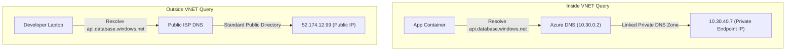

## Table of Contents

1. [Managed Service Isolation: The Private Link Fabric](#managed-service-isolation-the-private-link-fabric)
2. [Private Endpoints: The Local Proxy Model](#private-endpoints-the-local-proxy-model)
3. [Private Link: The Backbone Bridge](#private-link-the-backbone-bridge)
4. [Under-the-Hood: Split-Brain DNS Zone Resolution](#under-the-hood-split-brain-dns-zone-resolution)
5. [Private Endpoints vs. Service Endpoints](#private-endpoints-vs-service-endpoints)
6. [Resource Firewalls: The In-Service Gate](#resource-firewalls-the-in-service-gate)
7. [VNet Peering: Private Backbone Transit](#vnet-peering-private-backbone-transit)
8. [Hybrid Paths](#hybrid-paths)
9. [Inspecting Path Evidence](#inspecting-path-evidence)
10. [Putting It All Together](#putting-it-all-together)

## Managed Service Isolation: The Private Link Fabric

Azure Private Link is the platform capability that establishes secure, private network connectivity from your virtual network to managed Azure PaaS services over Microsoft's private global backbone network.

To secure a cloud deployment, you must treat service connectivity as a private network routing concern. By default, managed Azure PaaS services (such as Azure SQL databases, Storage Accounts, and Key Vaults) expose public IP endpoints on the internet. Even if you secure these endpoints with strong passwords or workload identities, the default routing path is public: your application container must send packets across the raw internet to reach the service, exposing your databank access paths to network interception.


Azure Private Link resolves these security vulnerabilities by providing isolated backbone transit paths. Under the hood, Private Link bypasses public routing tables completely. It allows you to expose PaaS resources as private, logical endpoints cabled directly inside your private subnets. 

The packets travel over Microsoft's isolated dark fiber network, keeping your database traffic entirely separate from the public internet.

## Private Endpoints: The Local Proxy Model

A private endpoint is a specialized network interface resource (`Microsoft.Network/networkInterfaces`) that Azure injects directly into a designated subnet within your Virtual Network.

This private endpoint functions as a **local proxy** for your managed PaaS service. When you create a private endpoint for a SQL database, the virtual network controller allocates a real, private IP address from your subnet's CIDR range (such as `10.30.40.7`) and binds it to the network interface:

```text
Target Database: devpolaris-orders-sql.database.windows.net 
  └── Local Proxy Private Endpoint: pe-orders-sql (IP: 10.30.40.7 cabled to snet-private-endpoints)
```

From your application's perspective, calling the database is now identical to calling any other private host inside your VNet. The application routes traffic directly to the local private IP address. 

The hypervisor intercepts these packets, translates the private IP envelope, and forwards the data stream over Azure's high-speed internal SDN fabric to the physical hosting clusters of the database, keeping your data transmission completely private.

## Private Link: The Backbone Bridge

Private Link is the capability that lets a private endpoint connect to Azure platform services, your own services, or partner services over Microsoft's backbone network. A private endpoint is the object you place in your VNet. Private Link is the platform behind that private connection.

The distinction helps in design reviews:

| Term | Plain meaning |
| --- | --- |
| Private Link | The Azure capability for private access to a service. |
| Private endpoint | The private IP network interface in your VNet. |
| Private Link service | A provider-side service exposed privately, often behind a Standard Load Balancer. |

Most app teams first use Private Link through private endpoints for Azure services: Key Vault, Storage, SQL, Cosmos DB, Service Bus, and similar dependencies. They do not need to build a Private Link service just to consume an Azure PaaS resource privately.

## Under-the-Hood: Split-Brain DNS Zone Resolution

To implement private endpoints seamlessly, your network must utilize a highly secure mechanism called **Split-Brain DNS Zone Resolution**.

When your application connects to a database, your code must continue using the canonical public domain name (e.g. `devpolaris-orders-sql.database.windows.net`). You must never hardcode a raw private IP address inside your source code, because the underlying virtual network interfaces can be recreated or reassigned during platform updates.

Split-Brain DNS solves this name resolution challenge by returning different IP answers depending on **where the DNS query originates**:



### 1. The Inside-VNet Query Path
When your application container calls `devpolaris-orders-sql.database.windows.net`, the request is sent to the VNet's local Azure DNS recursive resolver (`10.30.0.2`). 

Because the VNet is linked to a **Private DNS Zone** (such as `privatelink.database.windows.net`), the resolver intercepts the query. 

It matches the canonical database name, walks the private DNS zone, resolves the CNAME lookup to `devpolaris-orders-sql.privatelink.database.windows.net`, and returns the local Private Endpoint IP (`10.30.40.7`) to the container. 

The application routes the TCP socket privately inside the VNet.

### 2. The Outside-VNet Query Path
When a developer's laptop outside the VNet resolves the same hostname, the public DNS resolver walks the standard, public directory. 

Because the public internet is blind to your Private DNS Zone link, the resolver returns the default public IP address (`52.174.12.99`). The developer's browser attempts to connect over the internet.

This split behavior is highly elegant: the same hostname works everywhere, but routing automatically shifts from public to private the moment traffic originates inside your VNet boundary.

## Private Endpoints vs. Service Endpoints

Azure provides two primary private connectivity patterns: **Private Endpoints** and **Service Endpoints**. Differentiating between these architectures is a core design requirement:

| Feature Coordinate | Service Endpoints (`Microsoft.VNet`) | Private Endpoints (`Microsoft.Network`) |
| :--- | :--- | :--- |
| **IP Address Model** | Uses the service's default public IP address. | Allocates a dedicated private IP address from your subnet range. |
| **Routing Path** | Optimizes routing over Azure's backbone, tagging VNet identity. | Routes traffic directly to a local, private network interface proxy. |
| **PaaS Firewall Lock** | The PaaS firewall must be configured to trust the source subnet. | The PaaS firewall blocks all IP access, trusting the private interface. |
| **Scope Bounding** | Broad. Subnet can reach any PaaS resource of that type in Azure. | Granular. Binds strictly to one specific PaaS resource instance. |
| **Cross-Network Reach** | Cannot be reached from peered VNets or on-premises VPNs. | Fully reachable from peered VNets and hybrid networks. |

Service Endpoints are a routing optimization. They do not change the destination IP of your database; they simply tell Azure's switches to optimize the backbone route and allow the database's resource firewall to trust your source subnet's ID tag. 

However, because the destination IP remains public, a container in that subnet can technically open connections to *any* storage account in the global Azure catalog, introducing data exfiltration risks.

Private Endpoints are much more secure. Because they allocate a physical private IP inside your subnet, the database firewall can block all public IP access. 

Furthermore, the private endpoint proxy binds strictly to your specific database instance. If a malicious script inside your container attempts to exfiltrate data to an unauthorized storage account, the attempt is blocked at the virtual switch level, because there is no routing path to other PaaS resources.

## Resource Firewalls: The In-Service Gate

Many Azure services have their own network access controls. Storage accounts, Key Vaults, and databases can restrict which public networks, subnets, private endpoints, or trusted service paths they accept.

That service gate is separate from NSGs. An NSG may allow the packet to leave the API subnet. DNS may resolve to the private endpoint. The service can still reject the request if its network settings do not accept that path.

This is why `403` can be tricky. A `403` from Key Vault might mean the managed identity lacks permission. It might also mean the vault firewall rejected the network path. The fix depends on which gate denied the request.

For each dependency, keep the evidence split:

```text
Network path:
  DNS answer: private endpoint IP
  Private endpoint: approved
  Service firewall: accepts private endpoint

Authorization:
  Caller: mi-devpolaris-orders-api-prod
  Role: Key Vault Secrets User
  Scope: kv-devpolaris-orders-prod
```

Those two blocks should not be collapsed into "the app has access."

## VNet Peering: Private Backbone Transit

VNet Peering connects two virtual networks seamlessly over Microsoft's dark fiber network, allowing resources inside both networks to communicate privately using their internal IP addresses.

Peering is the primary architectural mechanism used to construct **Hub-and-Spoke networks**. 

In a modern enterprise, you deploy a central Hub VNet to host shared platform services (such as express route gateways, custom DNS resolvers, and network virtual appliances). 

You then peer multiple Spoke VNets (housing individual microservices) to this central hub.

Under the hood, VNet Peering does not merge the networks, and their address spaces must never overlap. When a resource in Spoke A sends a packet to a resource in Spoke B, the hypervisor detects the peered route and encapsulates the packet, routing it directly over Microsoft's high-speed dark fiber backbone. 

Traffic never crosses public internet paths, maintaining low-latency and secure isolation across your entire cloud footprint.

## Hybrid Paths

Hybrid connectivity connects Azure to networks outside Azure, usually through VPN, ExpressRoute, or a hub network design. The same private connectivity habits still apply: non-overlapping address spaces, routes, DNS, security rules, and service gates.

Hybrid paths make DNS especially important. An on-premises workload might need to resolve an Azure service name to a private endpoint IP. An Azure workload might need to resolve an on-premises service name through the right resolver path. If the name resolves differently on each side, the route evidence will not match the app symptom.

Keep the first hybrid design small:

| Question | Why it matters |
| --- | --- |
| Which network owns the source? | Determines the route table and DNS resolver. |
| Which private address should it reach? | Determines peering, VPN, or ExpressRoute routing. |
| Which DNS answer should the caller see? | Determines whether traffic uses the private path. |
| Which firewall accepts the path? | Determines whether reachability ends at the service gate. |

The services can be advanced. The habit stays plain.

## Inspecting Path Evidence

To verify private connectivity during an outage, you must collect empirical path evidence directly from the terminal. 

Let us execute a terminal query to verify that our orders container app is resolving our target SQL database through the private Link fabric:

```bash
$ nslookup devpolaris-orders-sql.database.windows.net
```

This diagnostic execution queries the VNet's DNS resolver to return the path evidence:

```text
Server:         10.30.0.2
Address:        10.30.0.2#53

Non-authoritative answer:
devpolaris-orders-sql.database.windows.net  canonical name = devpolaris-orders-sql.privatelink.database.windows.net.
Name:   devpolaris-orders-sql.privatelink.database.windows.net
Address: 10.30.40.7
```

This output provides pristine path evidence:
*   `canonical name`: Confirms that DNS is correctly resolving the canonical hostname to our private link CNAME alias (`privatelink.database.windows.net`).
*   `Address`: Shows the physical IP resolved is our local subnet private endpoint (`10.30.40.7`), proving that the Split-Brain DNS resolver link is active and traffic is guaranteed to flow privately inside the VNet.

## Putting It All Together

Operating a secure virtual network requires routing all PaaS service dependencies through private, isolated backbone links:

*   **Deploy Private Endpoints**: Inject real, VNet-local private IP proxies cabled to specific PaaS service instances, blocking public internet exposure.
*   **Configure Split-Brain DNS**: Link Private DNS Zones to your VNets to ensure that public hostnames automatically resolve to local private endpoint IPs at runtime.
*   **Decouple Endpoints from Service Endpoints**: Prefer Private Endpoints for strict resource-level security and hybrid network access, reserving Service Endpoints for broad, regional optimizations.
*   **Secure PaaS firewalls**: Harden resource firewalls on databases and key vaults to reject all public IP ranges, permitting connections strictly from approved private endpoint NICs.
*   **Peering through Fiber Hubs**: Interconnect spoke networks through central hubs utilizing VNet Peering to preserve low-latency, private backbone transits globally.

---

**References**

* [What is Azure Private Link?](https://learn.microsoft.com/en-us/azure/private-link/private-link-overview) - Architectural reference for private backbone links.
* [What is a private endpoint?](https://learn.microsoft.com/en-us/azure/private-link/private-endpoint-overview) - Details of network interface proxy endpoints.
* [Azure Private Endpoint DNS Integration](https://learn.microsoft.com/en-us/azure/private-link/private-endpoint-dns) - DNS values and Private DNS Zone link setups.
* [Virtual Network Service Endpoints](https://learn.microsoft.com/en-us/azure/virtual-network/virtual-network-service-endpoints-overview) - Subnet tag routing extensions.
