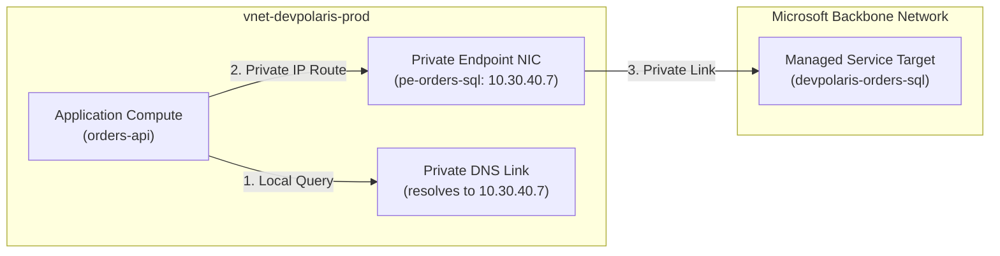
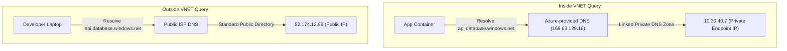

## Table of Contents

1. [Managed Service Isolation: The Private Link Fabric](#managed-service-isolation-the-private-link-fabric)
2. [Private Endpoints: The Local Proxy Model](#private-endpoints-the-local-proxy-model)
3. [Private Link: The Backbone Bridge](#private-link-the-backbone-bridge)
4. [Under-the-Hood: Split-Brain DNS Zone Resolution](#under-the-hood-split-brain-dns-zone-resolution)
5. [Private Endpoints vs. Service Endpoints](#private-endpoints-vs-service-endpoints)
6. [Resource Firewalls: The In-Service Gate](#resource-firewalls-the-in-service-gate)
7. [VNet Peering: Private Backbone Transit](#vnet-peering-private-backbone-transit)
8. [Hybrid Paths](#hybrid-paths)
9. [Inspecting Path Evidence](#inspecting-path-evidence)
10. [Putting It All Together](#putting-it-all-together)

## Managed Service Isolation: The Private Link Fabric

Azure Private Link is the private connection path from your virtual network to a supported Azure service. It lets an app reach a managed service through a private endpoint IP instead of sending traffic to the service's public endpoint.

Example: `orders-api` can connect to Azure SQL through `10.30.40.7` inside `snet-private-endpoints`, while the SQL server's public network access stays disabled.

To secure a cloud deployment, you must treat service connectivity as a private network routing concern. Many managed Azure PaaS services, such as Azure SQL databases, Storage Accounts, and Key Vaults, have public endpoints unless you restrict them. Even if you secure these endpoints with strong authentication and workload identities, the default public endpoint is still reachable from public networks unless the service firewall or public network access setting says otherwise.



Azure Private Link reduces this exposure by providing private connectivity over Microsoft's backbone network. It allows you to expose supported PaaS resources as private endpoints inside your private subnets.

The application sends traffic to a private IP in your VNet, and the Private Link path carries that connection to the service without requiring your app to target the service's public endpoint.

## Private Endpoints: The Local Proxy Model

A private endpoint is the private IP network interface Azure places in your subnet for one specific service connection. It is a specialized network interface resource (`Microsoft.Network/networkInterfaces`) that Azure injects directly into a designated subnet within your Virtual Network.

This private endpoint functions as a local network representation of your managed PaaS service. When you create a private endpoint for a SQL database, the virtual network controller allocates a real, private IP address from your subnet's CIDR range (such as `10.30.40.7`) and binds it to the network interface:

```plain
Target Database: devpolaris-orders-sql.database.windows.net
  └── Private Endpoint: pe-orders-sql (IP: 10.30.40.7 in snet-private-endpoints)
```

From your application's perspective, calling the database is now identical to calling any other private host inside your VNet. The application routes traffic directly to the local private IP address.

Azure routes that connection through the Private Link path to the target service. Your app keeps using a normal service hostname and TCP connection, but the resolved address and network path now stay on the private endpoint design instead of the public endpoint path.

## Private Link: The Backbone Bridge

Private Link is the Azure platform capability behind the private connection path. A private endpoint is the object you place in your VNet. Private Link is the managed transport that carries that private endpoint traffic to the target service over Microsoft's backbone network.

Example: a private endpoint named `pe-orders-kv` sits in your subnet, while Private Link carries its traffic to `kv-orders-prod.vault.azure.net` without using the public endpoint path.

The distinction helps in design reviews:

| Term | Plain meaning |
| --- | --- |
| Private Link | The Azure capability for private access to a service. |
| Private endpoint | The private IP network interface in your VNet. |
| Private Link service | A provider-side service exposed privately, often behind a Standard Load Balancer. |

Most app teams first use Private Link through private endpoints for Azure services: Key Vault, Storage, SQL, Cosmos DB, Service Bus, and similar dependencies. They do not need to build a Private Link service just to consume an Azure PaaS resource privately.

### Under the Hood: Private Link Encapsulation Mechanics

Private Link encapsulation is the network wrapping Azure uses to carry your VNet packet to the managed service while preserving which VNet it came from. Encapsulation means Azure places the original packet inside another transport packet so the platform can route it safely across shared infrastructure.

Example: a packet from `10.30.2.15` to private endpoint `10.30.40.7` can be wrapped with metadata that identifies the target SQL resource and the originating VNet.

While a private endpoint looks like a simple network interface inside your Virtual Network, the underlying transport mechanism uses Software Defined Networking (SDN) encapsulation.

When your application container sends a packet to the private endpoint IP (e.g., `10.30.40.7`), the Azure hypervisor intercepts the packet. It does not route the packet using standard IP routing rules. Instead, the virtual network controller wraps the original VNet IP packet inside a transport packet using an encapsulation protocol like NVGRE (Network Virtualization using Generic Routing Encapsulation) or VXLAN.

This encapsulated packet contains a Virtual Network Identifier (VNID) that represents your VNet identity, along with a metadata header specifying the destination PaaS resource ID. The encapsulated packet is then routed across Microsoft's physical host substrate network to the multi-tenant storage or database server cluster.

When the packet arrives at the destination PaaS host, the receiving hypervisor decapsulates the packet, validates that the VNet VNID matches the allowed Private Link connection database, and passes the raw payload to the target database instance. Because this encapsulation separates customer VNets, different customers can use overlapping private IP ranges for their VNets without any packet collision or security leakage on the physical substrate.

## Under-the-Hood: Split-Brain DNS Zone Resolution

Split-brain DNS is a name-resolution design where the same service hostname returns a private IP inside the VNet and a public answer outside it. To implement private endpoints seamlessly, your network must use this DNS pattern.


*Private connectivity often works or fails at DNS first because the same name can resolve differently inside and outside the VNet.*


When your application connects to a database, your code must continue using the canonical public domain name (e.g. `devpolaris-orders-sql.database.windows.net`). You must never hardcode a raw private IP address inside your source code, because the underlying virtual network interfaces can be recreated or reassigned during platform updates.

Split-Brain DNS solves this name resolution challenge by returning different IP answers depending on **where the DNS query originates**:



### 1. The Inside-VNet Query Path
When your application container calls `devpolaris-orders-sql.database.windows.net`, the request is resolved through the DNS settings for the virtual network. With Azure-provided DNS, the platform IP is `168.63.129.16`. If you use custom DNS servers, those servers must forward or resolve the relevant private DNS zones correctly.

Because the VNet is linked to a **Private DNS Zone** (such as `privatelink.database.windows.net`), the resolver intercepts the query.

It matches the canonical database name, walks the private DNS zone, resolves the CNAME lookup to `devpolaris-orders-sql.privatelink.database.windows.net`, and returns the local Private Endpoint IP (`10.30.40.7`) to the container.

The application routes the TCP socket privately inside the VNet.

### 2. The Outside-VNet Query Path
When a developer's laptop outside the VNet resolves the same hostname, the public DNS resolver walks the standard, public directory.

Because the public internet is blind to your Private DNS Zone link, the resolver returns the default public IP address (`52.174.12.99`). The developer's browser attempts to connect over the internet.

This split behavior is highly elegant: the same hostname works everywhere, but routing automatically shifts from public to private the moment traffic originates inside your VNet boundary.

### Hybrid DNS Forwarding Loops

Split-Brain DNS works effortlessly when workloads use the default Azure resolver at `168.63.129.16`. However, enterprise architectures often use custom DNS servers (such as Active Directory Domain Services or custom Bind9 servers) or hybrid on-premises environments. In these environments, simple Split-Brain DNS fails because your on-premises servers or custom VNets do not have direct access to the Azure Private DNS Zones.

To resolve this, you must configure a DNS forwarding loop:

*   **Custom DNS Servers in the VNet:** If your VMs or containers use custom DNS servers, those servers cannot directly query the Azure Private DNS Zone. You must configure these custom servers to conditionally forward DNS queries for Azure public suffixes (such as `*.database.windows.net` or `*.blob.core.windows.net`) to the Azure-provided DNS IP `168.63.129.16`.
*   **On-Premises DNS Resolution:** On-premises servers cannot reach `168.63.129.16` because it is a non-routable link-local address. To resolve names from on-premises, you must deploy an Azure Private DNS Resolver or a custom DNS forwarder VM inside your Azure Hub VNet. The on-premises DNS server is configured to conditionally forward Azure PaaS queries across the VPN or ExpressRoute to the Hub DNS forwarder, which in turn queries `168.63.129.16` to get the private endpoint IP.

Without these forwarding loops, on-premises clients or custom DNS clients will resolve the public IP of the PaaS service, causing traffic to be blocked at the resource's private firewall.

:::expand[Forgetting to Link the Private DNS Zone to the VNet]{kind="pitfall"}
Deploying a private endpoint allocates a private IP interface. Private DNS integration must also be configured, usually by creating or linking the correct Private DNS Zone and records for that service. If you forget the DNS link or use custom DNS without the right forwarding, resources inside your VNet remain blind to the private records. An `nslookup` query inside your container can resolve the target service's public endpoint, bypassing the private endpoint path.

This matches the AWS VPC behavior when deploying **VPC Interface Endpoints**. In AWS, you must explicitly enable the **Enable Private DNS** checkbox on the endpoint configuration. If left unchecked, standard service calls (such as AWS SDK calls to S3 or secretsmanager) resolve to public AWS endpoints instead of routing to the private ENIs inside your subnets.

To diagnose and resolve this:

*   **Before (Zone Unlinked):** Resolving the storage account returns public IPs:
    ```plain
    $ nslookup mystorage.blob.core.windows.net
    Address: 52.174.12.99
    ```
*   **After (Zone Linked):** Resolving the storage account returns the local VNet IP:
    ```plain
    $ nslookup mystorage.blob.core.windows.net
    Address: 10.30.40.7
    ```

**The Fix:** Establish the network link via Bicep or run the CLI command:
```bash
az network private-dns link vnet create \
    --name "link-orders-dns-prod" \
    --resource-group "rg-orders-prod-uksouth" \
    --zone-name "privatelink.blob.core.windows.net" \
    --virtual-network "vnet-orders-prod" \
    --registration-enabled false
```

**Rule of thumb:** A private endpoint deployment is never complete until you verify its DNS resolution from *inside* the calling subnet. Always check that `nslookup` returns the private subnet IP to guarantee traffic flows over the private backbone fabric.
:::

## Private Endpoints vs. Service Endpoints

Azure provides two primary private connectivity patterns: Private Endpoints create a private IP interface for one service instance, while Service Endpoints keep the service endpoint public but add subnet-based trust. Differentiating between these architectures is a core design requirement:


*Private endpoints create a local private IP for a service, while service endpoints keep the public service endpoint and add VNet-based trust.*


| Feature Coordinate | Service Endpoints (`Microsoft.VNet`) | Private Endpoints (`Microsoft.Network`) |
| :--- | :--- | :--- |
| **IP Address Model** | Uses the service's default public IP address. | Allocates a dedicated private IP address from your subnet range. |
| **Routing Path** | Optimizes routing over Azure's backbone, tagging VNet identity. | Routes traffic directly to a local, private network interface proxy. |
| **PaaS Firewall Lock** | The PaaS firewall must be configured to trust the source subnet. | The PaaS firewall blocks all IP access, trusting the private interface. |
| **Scope Bounding** | Broad. Subnet can reach any PaaS resource of that type in Azure. | Granular. Binds strictly to one specific PaaS resource instance. |
| **Cross-Network Reach** | Cannot be reached from peered VNets or on-premises VPNs. | Fully reachable from peered VNets and hybrid networks. |

Service Endpoints are a routing and service-firewall integration. They do not give the service a private IP in your subnet; they let supported services identify traffic from a trusted VNet subnet and keep optimized routing on the Azure backbone.

However, because the destination is still the service's public endpoint, you must rely on the target service firewall and policies to constrain which service instances can be reached. Without that discipline, a subnet can still initiate traffic to other public service endpoints of the same type.

Private Endpoints are more granular for many service designs. Because they allocate a private IP inside your subnet, the service can disable or restrict public network access and accept traffic through the approved private endpoint.

Furthermore, the private endpoint binds to a specific service resource or subresource. If a malicious script inside your container attempts to exfiltrate data to an unauthorized storage account, the private endpoint for your approved account does not grant a private path to that other account. You still need outbound controls, DNS controls, and service firewalls to make the exfiltration boundary complete.

## Resource Firewalls: The In-Service Gate

A resource firewall is the service's own network admission rule set, separate from VNet routing and NSGs. Many Azure services have their own network access controls. Storage accounts, Key Vaults, and databases can restrict which public networks, subnets, private endpoints, or trusted service paths they accept.

Example: an NSG may allow `orders-api` to reach a Key Vault private endpoint, but the vault can still reject the call if its firewall does not approve that private endpoint connection.

That service admission check is separate from NSGs. An NSG may allow the packet to leave the API subnet. DNS may resolve to the private endpoint. The service can still reject the request if its network settings do not accept that path.

This is why `403` can be tricky. A `403` from Key Vault might mean the managed identity lacks permission. It might also mean the vault firewall rejected the network path. The fix depends on which layer denied the request.

For each dependency, keep the evidence split:

```plain
Network path:
  DNS answer: private endpoint IP
  Private endpoint: approved
  Service firewall: accepts private endpoint

Authorization:
  Caller: mi-devpolaris-orders-api-prod
  Role: Key Vault Secrets User
  Scope: kv-devpolaris-orders-prod
```

Those two blocks should not be collapsed into "the app has access."

## VNet Peering: Private Backbone Transit

VNet peering connects two virtual networks so their private IP addresses can route to each other over Microsoft's backbone network. It lets separate VNets communicate without crossing the public internet.

Example: `vnet-orders-prod` can peer with `vnet-platform-hub`, allowing the orders API subnet to reach a shared DNS resolver or firewall in the hub VNet.

Peering is the primary architectural mechanism used to construct **Hub-and-Spoke networks**.

In a modern enterprise, you deploy a central Hub VNet to host shared platform services (such as express route gateways, custom DNS resolvers, and network virtual appliances).

You then peer multiple Spoke VNets (housing individual microservices) to this central hub.

Under the hood, VNet Peering does not merge the networks, and their address spaces must never overlap. When a resource in Spoke A sends a packet to a resource in Spoke B, Azure uses the peered route to carry that traffic over Microsoft's backbone network.

Traffic never crosses public internet paths, maintaining low-latency and secure isolation across your entire cloud footprint.

## Hybrid Paths

Hybrid connectivity connects Azure to networks outside Azure, usually through VPN, ExpressRoute, or a hub network design. It exists when cloud workloads and private datacenter workloads need to talk over controlled network paths instead of public endpoints.

Example: an on-premises reporting server can reach `db-orders-prod` through ExpressRoute and a private endpoint, while Azure workloads resolve on-premises names through a forwarded DNS zone.

The same private connectivity habits still apply: non-overlapping address spaces, routes, DNS, security rules, and service admission checks.

Hybrid paths make DNS especially important. An on-premises workload might need to resolve an Azure service name to a private endpoint IP. An Azure workload might need to resolve an on-premises service name through the right resolver path. If the name resolves differently on each side, the route evidence will not match the app symptom.

Keep the first hybrid design small:

| Question | Why it matters |
| --- | --- |
| Which network owns the source? | Determines the route table and DNS resolver. |
| Which private address should it reach? | Determines peering, VPN, or ExpressRoute routing. |
| Which DNS answer should the caller see? | Determines whether traffic uses the private path. |
| Which firewall accepts the path? | Determines whether reachability ends at the service gate. |

The services can be advanced. The habit stays plain.

## Inspecting Path Evidence

To verify private connectivity during an outage, you must collect empirical path evidence directly from the terminal.

Let us execute a terminal query to verify that our orders container app is resolving our target SQL database through the private Link fabric:

```bash
$ nslookup devpolaris-orders-sql.database.windows.net
```

This diagnostic execution queries the VNet's DNS resolver to return the path evidence:

```plain
Server:         168.63.129.16
Address:        168.63.129.16#53

Non-authoritative answer:
devpolaris-orders-sql.database.windows.net  canonical name = devpolaris-orders-sql.privatelink.database.windows.net.
Name:   devpolaris-orders-sql.privatelink.database.windows.net
Address: 10.30.40.7
```

This output provides pristine path evidence:
*   `canonical name`: Confirms that DNS is correctly resolving the canonical hostname to our private link CNAME alias (`privatelink.database.windows.net`).
*   `Address`: Shows the physical IP resolved is our local subnet private endpoint (`10.30.40.7`), proving that the Split-Brain DNS resolver link is active and traffic is guaranteed to flow privately inside the VNet.

## Putting It All Together

Operating a secure virtual network requires routing all PaaS service dependencies through private, isolated backbone links:

*   **Deploy Private Endpoints**: Inject real, VNet-local private endpoint interfaces mapped to specific PaaS service instances, blocking public internet exposure.
*   **Configure Split-Brain DNS**: Link Private DNS Zones to your VNets to ensure that public hostnames automatically resolve to local private endpoint IPs at runtime.
*   **Decouple Endpoints from Service Endpoints**: Prefer Private Endpoints for strict resource-level security and hybrid network access, reserving Service Endpoints for broad, regional optimizations.
*   **Secure PaaS firewalls**: Harden resource firewalls on databases and key vaults to reject all public IP ranges, permitting connections strictly from approved private endpoint NICs.
*   **Peering through Fiber Hubs**: Interconnect spoke networks through central hubs utilizing VNet Peering to preserve low-latency, private backbone transits globally.


*Use this as the Private Link path: DNS resolves to the private endpoint IP, the app talks to that local VNet address, and Azure carries the connection privately.*

---

**References**

* [What is Azure Private Link?](https://learn.microsoft.com/en-us/azure/private-link/private-link-overview) - Architectural reference for private backbone links.
* [What is a private endpoint?](https://learn.microsoft.com/en-us/azure/private-link/private-endpoint-overview) - Details of network interface proxy endpoints.
* [Azure Private Endpoint DNS Integration](https://learn.microsoft.com/en-us/azure/private-link/private-endpoint-dns) - DNS values and Private DNS Zone link setups.
* [Virtual Network Service Endpoints](https://learn.microsoft.com/en-us/azure/virtual-network/virtual-network-service-endpoints-overview) - Subnet tag routing extensions.
