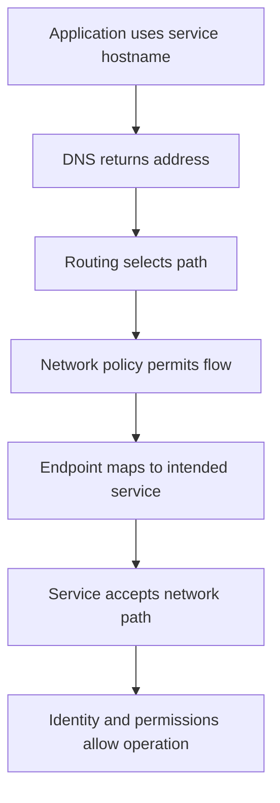
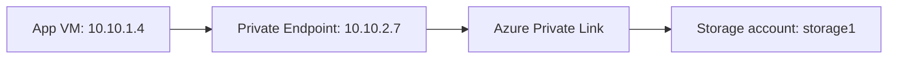
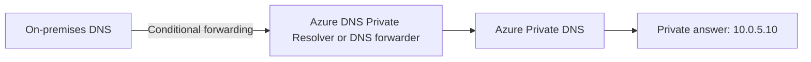

## Table of Contents

1. [What Problem Does Private Connectivity Solve?](#what-problem-does-private-connectivity-solve)
2. [How Do Private Endpoints and Private Link Work?](#how-do-private-endpoints-and-private-link-work)
3. [Why Does Private DNS Matter?](#why-does-private-dns-matter)
4. [How Do Resource Firewalls Add Protection?](#how-do-resource-firewalls-add-protection)
5. [How Do Service Endpoints Differ?](#how-do-service-endpoints-differ)
6. [How Do VNets and Hybrid Networks Reach Private Services?](#how-do-vnets-and-hybrid-networks-reach-private-services)
7. [What Evidence Proves the Private Path?](#what-evidence-proves-the-private-path)
8. [How Does the Complete Private Path Fit Together?](#how-does-the-complete-private-path-fit-together)
9. [Check Your Answers](#check-your-answers)
10. [References](#references)

An application at `10.10.1.4` needs to read data from `storage1.blob.core.windows.net`. Before it can send the request, DNS must return an address. That answer determines where the packet goes: a public service address or a private address such as `10.10.2.7` inside an Azure network.

This is the starting point for understanding private connectivity. Creating a Private Endpoint supplies the private address, but the application still needs to discover and reach it. The service must accept that connection, and the application's identity must have permission to read the data. If the service is intended to be private-only, its unwanted public access must also be closed.

We will follow the request through those decisions so the Azure terms describe concrete jobs in one connection:

1. **What Problem Does Private Connectivity Solve?**
2. **How Do Private Endpoints and Private Link Work?**
3. **Why Does Private DNS Matter?**
4. **How Do Resource Firewalls Add Protection?**
5. **How Do Service Endpoints Differ?**
6. **How Do VNets and Hybrid Networks Reach Private Services?**
7. **What Evidence Proves the Private Path?**
8. **How Does the Complete Private Path Fit Together?**

## What Problem Does Private Connectivity Solve?
<!-- section-summary: A successful private request needs working DNS, routing, network controls, endpoint mapping, service acceptance, and authorization; private-only access also closes unwanted public paths. -->

Many Azure **Platform as a Service**, or **PaaS**, resources expose a public service endpoint. PaaS means Azure operates the managed service infrastructure rather than asking you to run that infrastructure on your own VM. An application in VNet `10.10.0.0/16` can use HTTPS from VM `10.10.1.4` to the public endpoint for the Storage account `storage1`.

A public destination address does not establish that the packet physically leaves Microsoft's network and crosses the open internet. The distinction here concerns addressability, exposure, and reachability. A public-facing service endpoint can remain on Azure's network while still presenting an endpoint whose allowed callers need careful control.

The private-access requirement is to reach that managed service through a private address such as `10.10.2.7`, with the option to make the public access path unavailable. Private Link and Private Endpoints provide this model for supported services. Microsoft's [service-endpoint guidance][1] recommends Private Link for secure private PaaS access where it is supported.

### Follow the complete request

Start with the hostname the application uses, `storage1.blob.core.windows.net`. DNS returns an IP address. Routing then selects a path to that address. Network controls, including applicable NSGs, firewalls, and endpoint policies, must permit the connection. The endpoint must represent the intended service, and that resource must accept the selected network path. Finally, authentication and authorization determine whether this caller can perform its requested operation.


```mermaid
flowchart TD
    app["Application uses service hostname"] --> dns["DNS returns address"]
    dns --> route["Routing selects path"]
    route --> policy["Network policy permits flow"]
    policy --> endpoint["Endpoint maps to intended service"]
    endpoint --> service["Service accepts network path"]
    service --> auth["Identity and permissions allow operation"]
    class app workload
    class dns,route control
    class policy,endpoint boundary
    class service workload
    class auth decision
```

All of these requirements have to hold. Correct DNS with a missing route fails. A working network connection with an unapproved endpoint fails. A successful transport connection with an identity that lacks data permissions also fails. Treating them as one vague “private networking” setting makes it harder to identify which requirement is missing.

Private-only access adds a second test. It is not enough to demonstrate that an approved client can use the private path; you must also establish that an unwanted public path is unavailable. A service with both private and public access can satisfy the first test while failing the second.

This distinction should appear at the beginning of a design review because it changes what you need to configure and verify. “The application connects privately” describes its selected path. “The resource is private-only” describes the absence of other unwanted paths as well. The rest of this article explains the settings and evidence behind both statements.

## How Do Private Endpoints and Private Link Work?
<!-- section-summary: A Private Endpoint is a consumer-side private network interface; Private Link maps that interface to a specific approved service resource or subresource. -->

Create a Private Endpoint for `storage1` in subnet `10.10.2.0/24`. Azure can assign it the private address `10.10.2.7`. The application at `10.10.1.4` now has a private destination through which it can contact Storage.

The Storage service itself continues to run on Azure's managed platform. Creating this endpoint places a **network interface representing the service** into your VNet. It does not relocate the entire Storage service into that subnet. Microsoft defines a [Private Endpoint][2] as a network interface that uses a private VNet address and connects to a service through Azure Private Link.

This separation explains what you are inspecting in Azure. The private IP and interface belong to the consumer-side connection. The data service remains the managed resource behind it. Troubleshooting the interface, checking its approval, and checking the target resource are therefore related but distinct activities.

### Give the two names different jobs

**Private Endpoint** names the interface that the consumer contacts. In this example, that interface uses `10.10.2.7` and consumes an address from your subnet. **Private Link** names the Azure platform mechanism that carries the connection from this interface to the intended service.


```mermaid
flowchart LR
    vm["App VM: 10.10.1.4"] --> pe["Private Endpoint: 10.10.2.7"]
    pe --> link["Azure Private Link"]
    link --> storage["Storage account: storage1"]
    class vm workload
    class pe boundary
    class link control
    class storage storage
```

Using the names interchangeably hides that difference. When you ask which IP the application should reach, you are asking about the Private Endpoint. When you ask how that interface reaches a managed service outside the VNet, you are asking about Private Link. The platform can connect to Azure PaaS services and to customer or partner services published through Private Link, as described in its [documentation][3].

The endpoint also differs from VNet peering. Peering connects networks; a Private Endpoint maps to a particular approved resource or subresource. It does not join your VNet to all of Microsoft's internal service network or expose everything hosted behind the provider. A **subresource** is the specific service interface being targeted, such as Blob within a Storage account.

That resource-specific mapping helps explain the security model. Network connectivity can be tied to the intended resource instead of granting broad reach into a provider network. The application still needs permissions, but the endpoint itself has a defined destination rather than an open-ended collection of services behind a peering relationship.

Once the endpoint exists, one question remains before the application can use it: how does a program configured with a hostname learn that `10.10.2.7` is now the address it should contact?

## Why Does Private DNS Matter?
<!-- section-summary: Clients keep the normal service hostname, while the appropriate private DNS view resolves it to the Private Endpoint address. -->

Applications normally use `https://storage1.blob.core.windows.net/`, not `https://10.10.2.7/`. Keeping the hostname matters for TLS certificates, SDKs, connection strings, discovery, failover, and service-specific behavior. The endpoint's private address should be discovered through DNS rather than treated as a replacement for the service name in application configuration.

**DNS**, the Domain Name System, answers name-to-address questions. A **fully qualified domain name**, or **FQDN**, is the complete hostname, such as `storage1.blob.core.windows.net`. For a client that should use the Private Endpoint, resolving this name needs to lead to `10.10.2.7`.

Azure Private DNS zones and the platform's Private Link DNS conventions provide the private answer. For Blob Storage, the associated private namespace is `privatelink.blob.core.windows.net`. Other services have their own zone names, so this Blob zone is not a universal value to reuse for every resource. Microsoft's [private DNS zone reference][4] lists the service-specific names.

### The same name can produce different answers

A home laptop can resolve `storage1.blob.core.windows.net` through the public DNS view and ultimately receive a public service address. An Azure application using the intended private DNS view can ask for the same name and receive `10.10.2.7`.

This arrangement is called **split-horizon**, **split-view**, or **split-brain DNS**. The name stays the same, while the answer depends on the DNS view available to the caller. The application can therefore continue using its normal service hostname as the network design changes from public access to private access.

| Client view | Hostname | Intended result |
| --- | --- | --- |
| Public DNS view | `storage1.blob.core.windows.net` | Public service address |
| Private DNS view | `storage1.blob.core.windows.net` | Private Endpoint address `10.10.2.7` |

The table describes resolution, not permission. Receiving a public address does not prove that the Storage account will accept the request. Its public network access and firewall settings still decide whether that path is usable. Similarly, receiving the private address does not replace the routing and authorization requirements discussed earlier.

### Check the answer from the actual client

Suppose the Private Endpoint at `10.10.2.7` is Approved, the routes are correct, and the Storage resource is configured properly. If the application resolves the service name to a public IP, it never attempts to contact the private endpoint. A perfectly healthy private interface cannot help a packet that was addressed somewhere else.

This is why DNS should be checked before spending time adjusting routes. Inspect the answer from the particular machine or environment with the problem. A working lookup from the endpoint's VNet does not prove that another VNet or an office client sees the same answer. The [Private Endpoint troubleshooting guidance][5] explicitly includes checking that the FQDN resolves to the assigned private address.

Peering and other network connections also do not automatically distribute private DNS knowledge. They can provide an IP path while leaving the client on a DNS view that still returns the public destination. We will use that separation again in the hybrid networking examples.

Once clients resolve the intended address, you can test the private path. A separate setting is still needed to determine whether the service continues to accept requests through its public endpoint.

## How Do Resource Firewalls Add Protection?
<!-- section-summary: Private access, public exposure, network filtering, encryption, and application authorization are separate controls that must agree. -->

Adding the Private Endpoint at `10.10.2.7` can leave Storage's **Public network access** setting enabled. The result is potentially two access paths: one through the private interface and another through public service infrastructure. The existence of the private path does not automatically disable the other one.

For a private-only design, configure the Private Endpoint and its DNS, then disable or appropriately restrict public access according to the intended policy. Microsoft's [private PaaS access guidance][6] explicitly calls out restricting public access after setting up private endpoints. Without that separate step, a successful private connection does not establish the intended resource exposure.

### Distinguish the three network controls

A **PaaS resource firewall** decides which network sources or network paths a particular resource accepts. Storage, SQL, Key Vault, and other managed services expose controls of this kind. They operate at the service resource, where the arriving request is either accepted through its permitted network path or rejected.

An **NSG**, or Network Security Group, filters traffic associated with Azure virtual networking. **Azure Firewall** is a centralized network security service or appliance in the traffic path. These names do not describe interchangeable locations for the same rule.

| Control | Question it addresses |
| --- | --- |
| NSG | Is this traffic permitted by the relevant VNet networking rules? |
| Azure Firewall or another network appliance | Does centralized network inspection and policy permit the traffic? |
| PaaS resource firewall | Will this specific managed resource accept this network source or path? |
| Application authorization | Is this caller permitted to perform the requested data operation? |

Network permission can succeed at every applicable layer while the data operation remains unauthorized. Entra ID, RBAC, database permissions, SAS tokens, keys, and certificates have their own authentication and authorization responsibilities. Private Link does not replace those controls. A reachable service can still refuse a request because the identity or token lacks access.

### Apply subnet controls where supported

Private Endpoint traffic can use NSGs and user-defined routes when the appropriate Private Endpoint network policies are enabled on the subnet. These policies allow supported designs to restrict traffic or steer it through a security appliance for inspection. The [private PaaS networking guide][6] explains the role of these endpoint network policies.

The configuration matters because seeing a private interface in a subnet is not enough to infer every policy applied to it. Check the endpoint subnet's network-policy settings as part of the design. Then evaluate the route, optional firewall path, resource access configuration, and authorization in their respective layers.

### Limit where data can be sent

Consider a compromised VM that attempts to copy data to `attackerstorage.blob.core.windows.net`. Broad outbound internet access may provide a path to that account. A deliberately constrained private design can instead allow access only to `10.0.5.10`, mapped to `company-storage`, with ordinary public Storage access unavailable.

In that design, the reachable network destination is tied more closely to the intended resource. This is an example of how resource-oriented connectivity can reduce unwanted paths; merely creating a Private Endpoint while leaving broad alternate egress does not establish the same restriction.

Traditional Service Endpoints use a different model in which a subnet accesses the Azure service under resource-firewall rules. Service Endpoint Policies can add resource-level restrictions for supported services, but that does not turn them into Private Endpoints. The [service-endpoint overview][1] describes those policy capabilities.

### Keep encryption in the design

Private routing and encryption answer different questions. A private IP path determines how the client reaches the service. HTTPS and TLS protect the communication through encryption. An encrypted connection can use a public route, and calling a route private does not replace TLS.

A layered design can therefore include a Private Endpoint, TLS, an identified caller, appropriate authorization, and restricted public access together. Each layer addresses a different property of the request. This distinction is especially important when a connection works only after replacing a hostname with an IP address: doing so can change TLS or service-hostname behavior instead of correcting the intended private DNS setup.

## How Do Service Endpoints Differ?
<!-- section-summary: A Service Endpoint lets a service recognize an allowed VNet subnet while retaining the service endpoint model; a Private Endpoint supplies a private interface for a specific resource. -->

Return to VM `10.10.1.4` and the Storage service. With a traditional Service Endpoint, you enable a service such as `Microsoft.Storage` on the VM's subnet. You then configure the Storage firewall to allow the designated VNet and application subnet.

The service does not receive an address from your VNet. Instead, Azure provides an optimized route to the supported service over its backbone and extends the subnet's identity to the service. The Storage firewall can then recognize that this request comes through an allowed VNet/subnet path. The [service-endpoint overview][1] explains both route optimization and the extension of VNet identity.

Without that endpoint, the VM reaches the Storage public endpoint through its normal Azure/public service routing. With the Service Endpoint enabled, Azure recognizes the service destination and uses the service-endpoint route. Storage receives the VNet/subnet context and evaluates the resource's network-access rules. There is still no `10.10.x.x` interface representing Storage inside the VNet.

### Compare what the client actually contacts

With Private Link, the application resolves `storage1.blob.core.windows.net` to `10.10.2.7`, opens TCP port `443` to that private address, and reaches `storage1` through the Private Endpoint and Private Link platform. The private interface is the destination from the client's perspective.

With a Service Endpoint, the destination remains the Azure service endpoint. Its network-access rules recognize the permitted subnet. Keeping that destination distinction clear explains most of the other differences:

| Design question | Traditional Service Endpoint | Private Endpoint |
| --- | --- | --- |
| Does an interface representing the PaaS resource use an IP from my VNet? | No | Yes, the Private Endpoint NIC |
| What destination does the client contact? | Azure's service endpoint | Private Endpoint IP in the VNet |
| Must normal service-name resolution use a private address? | Usually no | Usually yes |
| How is permitted network access expressed? | The service recognizes an allowed VNet/subnet | The flow uses a specific Private Link connection |
| Does this provide a private on-premises route to PaaS? | Normally no | Yes, with working routing and DNS |
| Can public access remain present? | Yes | Yes, unless separately disabled or restricted |
| What is the connection granularity? | Service and VNet firewall rules | A particular Private Link resource or subresource |
| Where does it fit for private PaaS access? | Existing or use-case-dependent designs | Generally the preferred model where supported |

The [comparison guidance][7] notes the difference in private connectivity and on-premises access. An office machine does not gain the Private Link model simply because an Azure subnet has a Service Endpoint. In contrast, an office machine with a valid private route and DNS answer can reach a Private Endpoint's address.

A concise way to remember the distinction is to describe the action. A Service Endpoint lets the service recognize and trust a permitted subnet as a source. A Private Endpoint supplies a private interface through which a particular service resource can be contacted. Both involve network access controls, but they change different parts of the request path.

## How Do VNets and Hybrid Networks Reach Private Services?
<!-- section-summary: Remote clients need both a route to the Private Endpoint and DNS that resolves the service name to that address. -->

A Private Endpoint does not require every client to occupy its own subnet. Suppose the endpoint is `10.0.5.10` in a hub VNet using `10.0.0.0/16`. An application at `10.20.1.4` runs in a spoke VNet using `10.20.0.0/16`. With appropriate peering, routing, and network policy, that application can reach the endpoint's private IP.

There are still two separate questions. Can the spoke route to `10.0.5.10`? Can it resolve the service hostname to `10.0.5.10`? The network connection contributes the path. Private DNS integration supplies the answer used to select that path. Peering does not automatically link a Private DNS zone to every connected VNet.

Link the appropriate zones to the VNets whose workloads need those private answers, or provide the intended DNS resolution path. Microsoft's [Private Endpoint DNS integration guidance][8] describes how those DNS views are made available. Check both the route and the lookup from the spoke instead of using a successful hub test as a substitute.

### Extend the same model to an office

An office network using `172.16.0.0/16` can connect to Azure through a site-to-site VPN or ExpressRoute. A client at `172.16.1.25` can then use Private Link if it has a permitted route to `10.0.5.10` and resolves `storage1.blob.core.windows.net` to that private address.

From the client's perspective, this remains a private IP connection across connected networks. The endpoint maps that traffic into the managed service. This hybrid reach is one of the important differences from traditional Service Endpoints, which do not provide the same private on-premises access mechanism.

The office's DNS server does not automatically learn an Azure Private DNS zone. It is possible for the VPN or ExpressRoute route to work while the hostname still resolves publicly. In that case the client has a usable private route that its service request never selects.

A common DNS design uses **conditional forwarding**: the corporate resolver sends queries for the relevant namespace to a resolver that can answer them. Azure DNS Private Resolver can perform that role, using the Azure private DNS configuration to return the endpoint address. A DNS forwarder running in Azure is another documented approach. Both patterns appear in the [DNS integration scenarios][8].


```mermaid
flowchart LR
    office["On-premises DNS"] -->|"Conditional forwarding"| resolver["Azure DNS Private Resolver or DNS forwarder"]
    resolver --> zone["Azure Private DNS"]
    zone --> answer["Private answer: 10.0.5.10"]
    class office external
    class resolver,zone control
    class answer data
```

### Centralize deliberately in a hub

A hub-and-spoke arrangement can put the DNS resolver, firewall, private DNS integration, and Private Endpoint in the hub. Applications in Spoke A and Spoke B use their peering connections to reach the hub's endpoint. An on-premises environment reaches the same hub over VPN or ExpressRoute.

This layout centralizes shared connectivity, but its dependencies stay explicit. Each spoke needs a permitted route to the endpoint and a correct DNS answer. The endpoint needs an approved Private Link connection. The service needs its public exposure configured according to the design. Central placement only works when those dependencies hold for every intended consumer.

The DNS work is therefore part of the network architecture, not a final naming detail. Connecting more networks increases the number of places from which both the name and its private address must work. A test plan should include the relevant spoke and office clients, rather than only the subnet in which the endpoint was created.

## What Evidence Proves the Private Path?
<!-- section-summary: Verify the actual client hostname, private DNS answer, route, endpoint approval, target resource, and authorized operation; separately test public-path denial. -->

A Private Endpoint resource shown in the portal proves that a configuration object exists. It does not prove that an application is using it. Stronger evidence follows the request from the actual client and confirms the address contacted.

Begin on a trusted private client. Resolve the application's normal FQDN and check that the result matches the endpoint's assigned private address, in a private range such as `10.x`, `172.16` through `172.31`, or `192.168.x`. Then test the actual hostname and service port. Confirm the endpoint connection is **Approved**, and compare its configured IP and target resource with the values used by the client.

Use endpoint traffic or metrics and Network Watcher diagnostics to add evidence about the flow. Microsoft's [troubleshooting procedure][5] covers approval, FQDN and private-address assignment, DNS, metrics, and Network Watcher Connection Troubleshoot. These checks answer different questions and are most useful when they agree on the same attempted request.

### Inspect resolution and the connected address

For the hub endpoint example, a lookup can show:

```text
$ nslookup storage1.blob.core.windows.net

Name: ...
Address: 10.0.5.10
```

An alternative lookup tool is `dig`:

```text
$ dig storage1.blob.core.windows.net
...
10.0.5.10
```

These outputs are illustrative. The value to compare is the address returned by the client's configured resolver. It should match the intended endpoint, rather than merely looking like some private address.

An HTTPS connection attempt can show which address the client actually tries:

```text
$ curl -v https://storage1.blob.core.windows.net/
...
Trying 10.0.5.10:443...
```

The `Trying` line is evidence of the selected destination. It is not proof that the caller has permission to read a particular blob. The service still has to authorize the operation, so interpret the connection information and the eventual service response separately.

For a private-only design, repeat the exposure check from an unauthorized or public network. The trusted private client should resolve and reach the intended private path successfully. The unwanted public path should fail. Without that negative test, you have demonstrated a working private route but have not established that public access was removed.

### Diagnose in order

First identify the exact hostname the application uses. Second, resolve it from that same client. Third, inspect the route to the returned IP. Fourth, check applicable NSGs, routes, and firewall policies. Fifth, verify the private address and endpoint approval. Sixth, confirm the target resource or subresource and its public/private access configuration. Finally, check the identity, token, key, and data permissions used by the application.

Following this order prevents a common waste of effort: editing an NSG while the client is still resolving a public destination. It also keeps an authorization failure from being mistaken for a missing network path. The order narrows the investigation to the first layer whose observed behavior differs from the intended request.

| Observed symptom | First area to investigate |
| --- | --- |
| Endpoint exists, but traffic still uses a public destination | DNS answer from the actual client |
| Works in the endpoint VNet but fails in a spoke | Spoke DNS-zone availability, routing, and NSGs |
| Works in Azure but fails from the office | Hybrid routes and DNS forwarding |
| Private request succeeds, but public access also works | Resource public-access and firewall restrictions |
| Service Endpoint works from an Azure VM but not the office | The traditional Service Endpoint access boundary |
| Private address is reached, but the response is `401` or `403` | Caller authentication and authorization, using the actual response as evidence |
| Connecting by IP fails while the FQDN works | TLS, SNI, and service-hostname requirements |
| Some Storage operations work while others fail | Required Blob, File, or DFS subresource endpoints and DNS |
| DNS returns the right address, but the connection times out | Routing, NSG, UDR, and firewall path |
| Peering exists, but the name resolves publicly | Private DNS integration rather than peering alone |

**SNI**, or Server Name Indication, is the TLS mechanism by which a client supplies the intended server name. It helps explain why replacing the FQDN with an IP can change connection behavior. Likewise, Storage has multiple service interfaces, so a working Blob endpoint does not establish that File or DFS operations have the required endpoint and DNS configuration.

Treat the table as a starting point, not a diagnosis from one symptom alone. Record the selected address, connection behavior, and service response together. That evidence distinguishes a wrong destination, an unreachable destination, and a destination that received the request but rejected the operation.

## How Does the Complete Private Path Fit Together?
<!-- section-summary: The full Storage example joins private name resolution, spoke-to-hub routing, approved endpoint mapping, disabled public access, and data authorization. -->

Consider a Storage account used by applications in Azure and the corporate network. The corporate network uses `172.16.0.0/16` and connects through ExpressRoute to a hub VNet at `10.0.0.0/16`. The hub contains Azure DNS Private Resolver and a Private Endpoint at `10.0.5.10`. A peered application spoke uses `10.20.0.0/16`, with its application VM at `10.20.1.4`.

The endpoint represents the Blob subresource of `storage1`, and public network access on the Storage account is disabled. The application wants to perform the following request using its normal service hostname:

```http
GET https://storage1.blob.core.windows.net/data.json
```

Start with DNS. The application's resolution path returns `10.0.5.10` for `storage1.blob.core.windows.net`. The VM then needs a route to that private address, and its spoke-to-hub connectivity provides the intended path. Network policy permits the flow from `10.20.1.4` to `10.0.5.10` on TCP port `443`.

At the endpoint, Azure maps `10.0.5.10` to the approved `storage1/blob` connection. Private Link carries the request to the Storage service. The account's access configuration allows this private connection while its disabled public-access setting removes the unwanted alternative public path.

Storage then evaluates the caller. The request must supply an accepted identity or credential, and that caller must be permitted to read `data.json`. Entra ID and RBAC, SAS, or another configured authorization method answer this data-operation question. Reaching the correct private address has not skipped that final check.

This sequence gives seven concrete things to verify: the private DNS answer, spoke-to-hub routing, allowed network flow, correct Private Endpoint mapping, Private Link connection, resource exposure settings, and application authorization. The corporate client uses the same endpoint model, with ExpressRoute and hybrid DNS forwarding supplying its own route and resolution path.

### Keep four questions available during a review

The full sequence can be organized around four questions without losing the separate checks. **Name:** what address does this client believe the service has? **Path:** how does its packet reach that address? **Endpoint:** which service or subresource does that IP represent? **Permission:** which network and application controls accept the request?

For a Private Endpoint, the answer begins with a private IP. The path can include the VNet, peering, VPN, or ExpressRoute; the endpoint maps through Private Link to the intended resource; and network rules, resource configuration, and identity permissions all contribute to acceptance.

For a Service Endpoint, the application uses the normal Azure service endpoint, with an optimized service route. The service recognizes the permitted VNet/subnet under its network-access model. Comparing the name, path, endpoint, and permission answers makes the differences visible without treating either product name as an explanation by itself.

The final private-only check remains independent: demonstrate the authorized private request and demonstrate that unwanted public access is unavailable. Together, those observations show both the path the application uses and the exposure the service permits.

## Check Your Answers

:::expand[What Problem Does Private Connectivity Solve?]{kind="recap"}
It lets a client reach a managed service through a private address and controlled path. Success requires correct DNS, routing, network policy, endpoint mapping, service acceptance, and authorization. Private-only access also requires closing unwanted public paths.
:::

:::expand[How Do Private Endpoints and Private Link Work?]{kind="recap"}
A Private Endpoint is a consumer-side network interface with a private VNet address. Private Link connects that interface to a specific approved resource or subresource. The managed service remains on Azure's platform, and the connection does not peer entire networks.
:::

:::expand[Why Does Private DNS Matter?]{kind="recap"}
The application keeps its normal service hostname. Its private DNS view must resolve that name to the intended endpoint address. An approved endpoint is unused if the application still resolves and contacts a public destination.
:::

:::expand[How Do Resource Firewalls Add Protection?]{kind="recap"}
Resource network settings control which paths the managed service accepts, including unwanted public access. NSGs and centralized firewalls act at other network layers. TLS protects the communication, and application credentials and permissions still govern the data operation.
:::

:::expand[How Do Service Endpoints Differ?]{kind="recap"}
A Service Endpoint extends the subnet's identity to a supported Azure service through an optimized route, without assigning that service a private VNet interface. A Private Endpoint supplies such an interface for a specific resource and supports hybrid private access with suitable routing and DNS.
:::

:::expand[How Do VNets and Hybrid Networks Reach Private Services?]{kind="recap"}
Spoke and office clients need a permitted route to the endpoint and DNS that returns its private address. Peering, VPN, or ExpressRoute supplies connectivity; zone links, forwarding, or Azure DNS Private Resolver supplies the intended resolution path.
:::

:::expand[What Evidence Proves the Private Path?]{kind="recap"}
Check the actual client's DNS answer and connected address, endpoint approval, target resource, network path, and authorized operation. Use diagnostics and metrics where appropriate. For private-only access, separately verify that an unwanted public request cannot use the service.
:::

:::expand[How Does the Complete Private Path Fit Together?]{kind="recap"}
The Storage example resolves the normal hostname privately, routes from the spoke to the hub endpoint, permits TCP 443, and maps the approved endpoint through Private Link to Storage. Public access is disabled, while the final read still requires the caller's data permission.
:::

## References

- [Azure virtual network service endpoints][1]
- [What is a Private Endpoint?][2]
- [Azure Private Link documentation][3]
- [Private Endpoint private DNS zone values][4]
- [Troubleshoot Private Endpoint connectivity][5]
- [Private access to Azure PaaS services][6]
- [Azure standard service endpoint overview][7]
- [Private Endpoint DNS integration scenarios][8]

[1]: https://learn.microsoft.com/en-us/azure/virtual-network/virtual-network-service-endpoints-overview
[2]: https://learn.microsoft.com/en-us/azure/private-link/private-endpoint-overview
[3]: https://learn.microsoft.com/en-us/azure/private-link/
[4]: https://learn.microsoft.com/en-us/azure/private-link/private-endpoint-dns
[5]: https://learn.microsoft.com/en-us/troubleshoot/azure/private-link/troubleshoot-private-endpoint-connectivity-problems
[6]: https://learn.microsoft.com/en-us/azure/networking/design-guide/private-platform-as-a-service
[7]: https://learn.microsoft.com/en-us/azure/private-link/service-endpoint-standard-overview
[8]: https://learn.microsoft.com/en-us/azure/private-link/private-endpoint-dns-integration
