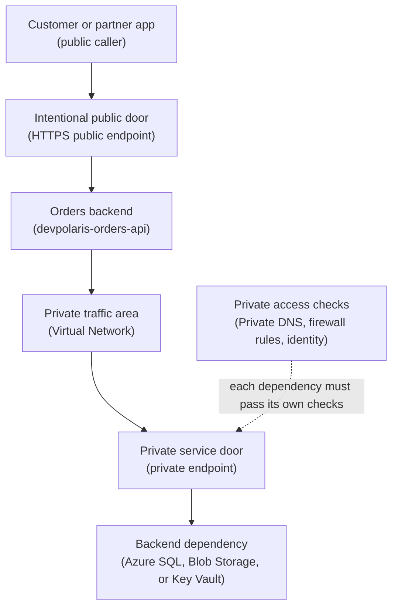

## Table of Contents

1. [The Reachability Check Before You Debug](#the-reachability-check-before-you-debug)
2. [If You Know AWS Networking](#if-you-know-aws-networking)
3. [The Orders API Access Shape](#the-orders-api-access-shape)
4. [Public Endpoint Means Internet-Reachable Address](#public-endpoint-means-internet-reachable-address)
5. [Private Endpoint Brings One Resource Onto Your Network](#private-endpoint-brings-one-resource-onto-your-network)
6. [Private Link Is The Platform Behind The Private Endpoint](#private-link-is-the-platform-behind-the-private-endpoint)
7. [Service Endpoints Are A Lighter Network Allow Rule](#service-endpoints-are-a-lighter-network-allow-rule)
8. [Resource Firewalls Are Still Part Of The Decision](#resource-firewalls-are-still-part-of-the-decision)
9. [DNS Decides Which Door The App Uses](#dns-decides-which-door-the-app-uses)
10. [The App Can Be Public While Data Stays Private](#the-app-can-be-public-while-data-stays-private)
11. [Evidence From A Working Setup](#evidence-from-a-working-setup)
12. [Failure Modes And Fix Directions](#failure-modes-and-fix-directions)
13. [A Release Review Habit](#a-release-review-habit)

## The Reachability Check Before You Debug

An Azure resource can exist, look healthy, and still be unreachable from the place your code runs.
That is the first idea to keep close.
Cloud resources are not automatically connected just because they sit in the same subscription, the same resource group, or the same region.

Reachability means there is a valid network path from a caller to a target.
For an API, the caller may be a browser on the public internet.
For a database, the caller may be your backend app inside an Azure virtual network.
For Key Vault, the caller may be the same app, but the request still needs both a network path and permission to read the secret.

Public access means a service has an internet-reachable address.
Private access means the service is reached through a private network path, usually from inside a virtual network.
Those words are about traffic paths.
They are separate from identity, RBAC, passwords, keys, and application authorization.

Azure gives you several ways to shape those paths.
A public endpoint exposes a service through a public DNS name and public IP path.
A private endpoint creates a private IP address in your virtual network for one specific Azure resource.
Azure Private Link is the platform feature that powers private endpoint access to supported services.
Service endpoints are a lighter option that let some Azure services trust traffic from selected virtual network subnets while the service still uses its public endpoint.
Resource firewall rules decide which public or virtual network paths a service accepts.

This article follows `devpolaris-orders-api`.
It is a Node backend for checkout traffic.
Customers need a public HTTPS entry point for `POST /orders`.
The app needs private access to Azure SQL for order records, Blob Storage for invoice exports, and Key Vault for secrets.

That shape is common.
The service can be public at the API layer without making every dependency public too.
The useful beginner question is not "is the resource deployed?"
The useful question is:

> From this caller, which network path reaches this exact resource, and does the resource allow that path?

## If You Know AWS Networking

If you learned AWS first, you may be used to thinking about public subnets, private subnets, security groups, route tables, NAT gateways, and VPC endpoints.
Bring that habit with you, but translate slowly.
Azure has virtual networks and subnets, but private access to Azure platform services often uses private endpoints rather than a subnet label alone.

In AWS, a public subnet usually means the subnet has a route to an internet gateway and resources in it can have public IP addresses.
A private subnet usually lacks that direct inbound internet path.
Azure subnets also sit inside virtual networks, and route tables matter, but Azure managed services such as Azure SQL, Storage, and Key Vault are not usually "inside your subnet" just because they belong to your resource group.

That is the key difference.
Many Azure PaaS services are managed by Azure outside your virtual network by default.
If you want private network access to one of those services, you often create a private endpoint.
That private endpoint is a network interface with a private IP address in your subnet, mapped to one specific service instance.

Here is the bridge:

| AWS habit | Azure idea | Careful translation |
|-----------|------------|---------------------|
| Public subnet plus public load balancer | Public entry point such as Front Door, Application Gateway, App Service, or Container Apps external ingress | The app entry can be public while dependencies stay private |
| Private subnet for app workloads | Azure Virtual Network subnet for workloads or integration | A subnet gives the app a private network location or path |
| Interface VPC endpoint | Private endpoint powered by Private Link | Similar habit: private IP path to one service instance |
| Gateway VPC endpoint for S3 or DynamoDB | Service endpoint for supported Azure services, or private endpoint for stronger private access | Service endpoints still use the service public endpoint shape |
| Security group on an endpoint or workload | NSG plus service firewall plus identity checks | Azure resource firewalls and RBAC remain separate checks |
| Private hosted zone for endpoint DNS | Azure Private DNS zone for private endpoint names | DNS must resolve the normal service name to the private IP from the right network |

The AWS bridge is useful because it preserves the operating habit:
do not leave data services open to every network just because the application has a public URL.
But avoid a one-to-one dictionary.
An Azure private endpoint is not "a private subnet."
It is a private IP entry point for one target resource.

## The Orders API Access Shape

The production service has two very different kinds of callers.
Customers call the public API.
The API calls its private dependencies.

That distinction protects the system.
If every dependency accepted public traffic from anywhere, a mistake in a password, token, or firewall rule could expose data services directly.
If the API itself were private only, customers could not place orders.
The design needs one intentional public door and several private service doors.

Read this top to bottom.
The plain-English label comes first, and the Azure term appears in parentheses.



The public request path is short:
customer, public API door, orders backend.
The private dependency path starts after the app is running.
The app must reach a virtual network path, resolve service names to private addresses, and use an identity that the target service accepts.

The diagram uses one private service door instead of drawing SQL, Blob, and Key Vault three times.
In the real inventory, each dependency gets its own target and its own checks:

| Dependency | Private endpoint target | Checks that must agree |
|------------|-------------------------|------------------------|
| Order records | Azure SQL Database | Private DNS, endpoint approval, firewall rules, database or Entra permission |
| Invoice exports | Blob Storage | Private DNS, storage network rules, managed identity, RBAC, key, or SAS permission |
| Secrets and keys | Key Vault | Private DNS, vault firewall, managed identity, RBAC, or access policy |

That table is easier to scan than nine dotted arrows.
DNS, firewall rules, and identity are still separate checks.
They just do not need to crowd the main drawing.

That separation explains many real incidents.
The app can have the right managed identity and still fail because DNS points to the public endpoint.
The private endpoint can exist and still fail because the connection is pending approval.
The firewall can allow the subnet and still fail because RBAC is missing.

## Public Endpoint Means Internet-Reachable Address

A public endpoint is an address that clients can reach over the public internet path.
For Azure services, that often looks like a public DNS name:
`orders.devpolaris.com`, `sql-devpolaris-orders-prod.database.windows.net`, `stdevpolarisordersprod.blob.core.windows.net`, or `kv-devpolaris-orders-prod.vault.azure.net`.

Public does not mean unauthenticated.
Azure SQL still requires database authentication or Microsoft Entra authentication.
Blob Storage still checks keys, SAS tokens, or identity.
Key Vault still checks access permissions.
But public does mean the network door can be reached from outside your private network unless you restrict or disable that door.

That difference matters because identity failures and network exposure are different risks.
If a storage account accepts public network access from every IP, then the whole internet can knock on the door.
The attacker still needs valid credentials, but you have made the first step easy.
If the same storage account only accepts traffic through a private endpoint, the attacker also needs a route from an allowed private network.

For `devpolaris-orders-api`, the public endpoint should be the API entry.
The public path might be:

```text
https://orders.devpolaris.com
  -> public HTTPS edge
  -> devpolaris-orders-api
```

The database, blob account, and vault should not need public reachability for normal production traffic.
They serve the backend.
Customers do not call them directly.
Finance users should download exports through an app workflow or a controlled admin path, not by making the storage account generally reachable.

Here is the first practical rule:
make public access intentional.
If the app entry is public, name it, monitor it, protect it, and test it.
If a data service is public by accident, treat that as a design bug even if identity still blocks most requests.

## Private Endpoint Brings One Resource Onto Your Network

A private endpoint is a network interface in your virtual network with a private IP address.
That interface connects privately to a service powered by Azure Private Link.
The beginner mental model is simple:
Azure gives your virtual network a private door for one specific service instance.

For the orders API, the SQL private endpoint might create an IP such as `10.21.2.5`.
The Blob private endpoint might create `10.21.2.6`.
The Key Vault private endpoint might create `10.21.2.7`.
Those addresses live in a subnet you choose for private endpoints.
The addresses are not the database server itself moving into your subnet.
They are private connection points from your network to the managed service.

That "one specific service instance" part is important.
A private endpoint for `sql-devpolaris-orders-prod` should not grant access to every SQL server in Azure.
A private endpoint for the Blob subresource of one storage account should not grant access to Queue or File endpoints on the same account.
For Storage, different service types such as Blob, File, Queue, Table, Web, and Dfs can need separate private endpoints.

A realistic inventory might look like this:

```text
Private endpoint inventory for rg-devpolaris-orders-prod

Name                         Target service                         Subresource   Private IP
pe-orders-sql-prod            sql-devpolaris-orders-prod             sqlServer     10.21.2.5
pe-orders-blob-prod           stdevpolarisordersprod                 blob          10.21.2.6
pe-orders-vault-prod          kv-devpolaris-orders-prod              vault         10.21.2.7
```

This evidence tells you three useful things.
The private endpoints exist.
Each one points at a specific target.
Each one has a private IP address in the virtual network.

It does not prove the setup works by itself.
You still need approval state, DNS, firewall rules, routing, and identity.
Private networking is a chain.
A chain fails when any required link is missing.

## Private Link Is The Platform Behind The Private Endpoint

Private Link is the Azure platform feature that lets you access supported Azure services, your own services, and partner services through private endpoints.
The private endpoint is the thing you create inside your virtual network.
Private Link is the service family that makes the private connection possible behind the scenes.

That wording can feel fussy at first.
It helps during debugging.
When someone says "we use Private Link," ask which private endpoint exists, which target resource it maps to, which subresource it targets, and whether the connection is approved.
Private Link is the capability.
The private endpoint and private endpoint connection are the concrete objects you inspect.

Approval state is one of the most practical details.
If the creator has enough permission on the target resource, Azure may approve the private endpoint connection automatically.
If the requester does not own the target resource, the connection can wait for the target owner to approve it.
Only approved private endpoint connections can carry traffic.

The status evidence might look like this:

```json
{
  "name": "pe-orders-vault-prod",
  "privateLinkServiceConnectionState": {
    "status": "Approved",
    "description": "Approved for devpolaris-orders-api production"
  },
  "privateIpAddress": "10.21.2.7",
  "groupIds": [
    "vault"
  ]
}
```

That JSON is the kind of output you want during a review.
It names the endpoint, shows the private IP, shows the target subresource, and confirms the approval state.
If the status is `Pending`, the private endpoint may look created, but the service is not ready for traffic.

This is another reason "resource exists" is not enough.
The private endpoint resource can exist as an Azure object while the connection it represents is not usable yet.
When a junior teammate says "but I created it," the calm answer is:
good, now check whether the target approved it.

## Service Endpoints Are A Lighter Network Allow Rule

Service endpoints are easy to confuse with private endpoints because both mention virtual networks and Azure services.
They solve related problems in different ways.

A service endpoint lets selected Azure services see traffic as coming from a specific virtual network subnet.
Then the target service can have a firewall rule that allows that subnet.
The service still uses its public endpoint shape.
You did not create a private IP address in your subnet for that one service instance.

That makes service endpoints lighter to set up in some cases.
They can be useful when a supported service needs to allow traffic from a known subnet and you do not need the stronger service-instance mapping and private DNS shape of Private Link.
They are also an older and simpler pattern you may see in existing Azure environments.

The tradeoff is the point.
Private endpoints give you private IP access to a specific resource through Private Link.
Service endpoints help secure access to supported services from a subnet while keeping the public endpoint model.
They are not the same control.

For `devpolaris-orders-api`, a storage firewall rule based on a service endpoint might say:

```text
Storage account network rules

Default action: Deny
Allowed virtual network rules:
  vnet-devpolaris-prod/subnets/snet-app-runtime
Public endpoint: still the storage service endpoint
Private endpoint: not used for this rule
```

That may be acceptable for some internal workloads.
For the production orders data path, the team chooses private endpoints for Azure SQL, Blob Storage, and Key Vault because the design goal is a private IP path to exact data services.

Do not make the decision by habit.
Ask what you need to prove.
If the release review needs to prove that the normal app path does not use public network access to storage, a private endpoint plus DNS evidence is much clearer.
If the review only needs to prove that a storage account accepts traffic from one Azure subnet and denies other public IPs, a service endpoint based rule may be enough.

## Resource Firewalls Are Still Part Of The Decision

Many Azure services have their own network access settings.
People often call them resource firewalls.
They are service-specific allow and deny rules that sit at the target resource.
Storage accounts, Azure SQL servers, and Key Vaults all have network access controls, though the exact names and behavior differ by service.

The important beginner idea is that network access and identity access are both required.
The network path can be allowed while the identity is denied.
The identity can be correct while the network path is denied.
Do not collapse those checks into one vague word like "access."

For the orders API, the desired production posture might read like this:

| Resource | Normal caller | Network decision | Identity decision |
|----------|---------------|------------------|-------------------|
| Public API entry | Customer browser or partner app | Public HTTPS allowed | App-level auth or API controls decide user action |
| Azure SQL | `devpolaris-orders-api` | Private endpoint path allowed | Database login or Entra identity allowed |
| Blob Storage | `devpolaris-orders-api` | Private endpoint path allowed | Managed identity has Blob data role |
| Key Vault | `devpolaris-orders-api` | Private endpoint path allowed | Managed identity can read required secrets |

This table is more useful than saying "everything is locked down."
It names the caller, the path, and the permission check.
That is how you can debug without guessing.

If a storage account has public network access disabled and a private endpoint exists, clients using that private endpoint can still be allowed.
For Storage, the storage firewall controls access through the public endpoint, while private endpoints rely on the private endpoint connection and network path.
That distinction is useful when someone worries that disabling public network access will break the app.
It should not break the app if the app is truly using the private endpoint and DNS resolves correctly.

If the app breaks after public access is disabled, do not immediately turn public access back on.
First prove which endpoint the app is using.
The likely problem is missing private DNS, missing private endpoint approval, missing route from the runtime, or a missing service-specific permission.

## DNS Decides Which Door The App Uses

Private endpoints depend heavily on DNS.
The app should usually keep using the normal service name, such as `stdevpolarisordersprod.blob.core.windows.net`.
From inside the virtual network, that name should resolve to the private endpoint IP.
From outside, the same name may resolve to the public service path.

That sounds odd until you remember what DNS is doing.
DNS turns a name into an address.
With private endpoint DNS, Azure uses private DNS zones so callers inside the right network get the private answer.
The application code does not need to change to a strange `privatelink` hostname.
The network's name resolution changes the answer.

A healthy Blob Storage lookup from the app network might look like this:

```bash
$ nslookup stdevpolarisordersprod.blob.core.windows.net
Server:  168.63.129.16
Address: 168.63.129.16

Non-authoritative answer:
stdevpolarisordersprod.blob.core.windows.net canonical name = stdevpolarisordersprod.privatelink.blob.core.windows.net.
Name:    stdevpolarisordersprod.privatelink.blob.core.windows.net
Address: 10.21.2.6
```

The important line is the private address.
The app asked for the normal storage name.
DNS returned a `privatelink` name and a private IP.
That is exactly what you want from inside the app network.

A broken lookup often looks like this:

```bash
$ nslookup stdevpolarisordersprod.blob.core.windows.net
Server:  10.21.0.4
Address: 10.21.0.4

Non-authoritative answer:
Name:    blob.ams25prdstr01a.store.core.windows.net
Address: 20.60.144.36
```

That output means the app is not getting the private answer.
If public network access is disabled, the next application request probably fails even though the private endpoint exists.
The fix direction is not a new password.
The fix direction is DNS:
link the right private DNS zone to the virtual network, fix custom DNS forwarding, or add the correct private records.

Common private DNS zones include names like `privatelink.blob.core.windows.net`, `privatelink.database.windows.net`, and `privatelink.vaultcore.azure.net`.
Do not memorize those as a complete list.
Check the service documentation because each Azure service has its own private DNS zone guidance.

## The App Can Be Public While Data Stays Private

Beginners sometimes hear "private access" and think the whole application must disappear from the internet.
That is not the goal for a customer-facing API.
The goal is to expose only the layer that should receive public requests.

For `devpolaris-orders-api`, customers need the API endpoint.
They do not need direct network access to SQL, Blob Storage, or Key Vault.
So the application design separates public ingress from private dependencies.

In plain words:

```text
Public:
  Customers can reach https://orders.devpolaris.com

Private:
  The API reaches Azure SQL through a private endpoint
  The API reaches Blob Storage through a private endpoint
  The API reaches Key Vault through a private endpoint
```

This gives the team a cleaner failure boundary.
If public traffic spikes, you inspect the API entry and app runtime.
If SQL connection fails, you inspect the app network path, SQL private endpoint, SQL firewall, DNS, and database auth.
If secret lookup fails, you inspect Key Vault private endpoint, private DNS, Key Vault network settings, and the managed identity permission.

The tradeoff is extra setup and extra evidence.
Private endpoints need subnets, DNS zones, approval, and service-specific target subresources.
That is more work than leaving public access open.
The reason teams accept the work is that the normal data path becomes narrower and easier to defend during a review.

The word private does not make the whole system safe by itself.
Private access reduces network exposure.
It does not replace authentication.
It does not replace authorization.
It does not prove the app validates user input.
It simply makes the reachable network path match the architecture you meant to build.

## Evidence From A Working Setup

A good review does not rely on a diagram alone.
It collects small pieces of evidence from the actual environment.
The goal is not to paste every Azure CLI output into a ticket.
The goal is to prove the important claims.

For the orders API, the claims are:
the public API is reachable, the data services have private endpoints, DNS resolves to private IPs from the app network, and resource network rules do not leave broad public access open.

A compact review note might look like this:

```text
Production access review: devpolaris-orders-api

Public entry:
  https://orders.devpolaris.com/health -> 200 OK

Private endpoints:
  pe-orders-sql-prod   -> sql-devpolaris-orders-prod.database.windows.net -> 10.21.2.5 -> Approved
  pe-orders-blob-prod  -> stdevpolarisordersprod.blob.core.windows.net    -> 10.21.2.6 -> Approved
  pe-orders-vault-prod -> kv-devpolaris-orders-prod.vault.azure.net       -> 10.21.2.7 -> Approved

Network stance:
  Azure SQL public network access: Disabled
  Storage public network access: Disabled
  Key Vault public network access: Disabled

Identity stance:
  ca-devpolaris-orders-api-prod uses mi-devpolaris-orders-api-prod
  Managed identity has required data roles and secret read access
```

That note is intentionally boring.
Boring evidence is good.
It lets another engineer follow the same checks without reading your mind.

You can also capture a small dependency failure test.
For example, from outside the virtual network, a direct storage request should not work when public network access is disabled:

```bash
$ curl -I https://stdevpolarisordersprod.blob.core.windows.net/invoices/example.pdf
HTTP/1.1 403 This request is not authorized to perform this operation
x-ms-error-code: AuthorizationFailure
```

The exact error can vary by service and request shape.
The teaching point is not the status code alone.
The teaching point is that direct public access to the data service is not the normal path.
The app should reach storage from the private network path with its managed identity.

Finally, test the application behavior, not only the infrastructure objects.
If the app can create an order and write an invoice export while public access is disabled on the data services, you have stronger evidence than a list of resources.
Infrastructure state matters because it predicts behavior.
Application behavior matters because it proves the path under real code.

## Failure Modes And Fix Directions

Private access failures are frustrating because several layers can produce similar symptoms.
The app says timeout, forbidden, or name resolution failure.
The fix depends on which layer failed.
Slow down and classify the symptom before changing settings.

| Symptom | Likely cause | Fix direction |
|---------|--------------|---------------|
| Public network access disabled, app now times out | No usable private endpoint path or DNS still points public | Check private endpoint, route, private DNS zone link, and app network integration |
| Private endpoint exists but traffic fails | Connection is `Pending`, `Rejected`, or `Disconnected` | Ask target resource owner to approve or recreate the connection |
| DNS returns public IP from the app network | Private DNS zone missing, not linked, or custom DNS not forwarding | Link zone to VNet or configure custom DNS for `privatelink` zones |
| Service endpoint subnet is allowed, but request gets 403 | Network rule passed, identity or data-plane permission missing | Check managed identity, RBAC role, database auth, or Key Vault access |
| App endpoint is reachable publicly by mistake | Public ingress, public IP, or public app setting was enabled | Disable public ingress or place the app behind the intended public entry point |

Here is the first failure shape.
The team disables public network access on Key Vault because the architecture says secrets should be private.
The next deployment starts, and the app cannot read `OrdersDbConnection`.

```text
2026-04-22T09:14:03Z devpolaris-orders-api
Startup check failed: could not load secret OrdersDbConnection
RequestFailedException: getaddrinfo ENOTFOUND kv-devpolaris-orders-prod.vault.azure.net
```

This is not an RBAC error yet.
The app cannot resolve the vault name.
Start with DNS.
Check whether the Key Vault private DNS zone is linked to the virtual network the app uses.
If the environment uses custom DNS, check whether that DNS server forwards the private link zone correctly.

The second failure shape is a pending private endpoint.
The resource exists, but the target has not approved the connection.

```text
Private endpoint: pe-orders-sql-prod
Target: sql-devpolaris-orders-prod
Connection state: Pending
Message: Waiting for owner approval
```

Do not fix this by reopening public SQL access.
Find who owns the SQL server resource, have them review the request, and approve it if the source network and request message are correct.
After approval, test DNS and a real connection from the app network.

The third failure shape is DNS still resolving the public name.
This often appears after the private endpoint was created successfully.

```bash
$ nslookup kv-devpolaris-orders-prod.vault.azure.net
Name:    azkms-prod-uks.vault.azure.net
Address: 20.90.40.12
```

The private endpoint may be fine.
The name answer is not.
Check the private DNS zone for Key Vault, verify the A record points to the private endpoint IP, and verify the virtual network link.
If the app uses a custom DNS server, make that server forward the private link zone instead of sending the query to public DNS.

The fourth failure shape is the service endpoint trap.
The storage account firewall allows the app subnet through a service endpoint, but the app still receives `403`.

```text
Azure.RequestFailedException: This request is not authorized to perform this operation.
Status: 403
ErrorCode: AuthorizationPermissionMismatch
```

That error points away from basic network reachability.
The service saw the request, then rejected the operation.
Check the managed identity, role assignment scope, and data-plane role.
For Blob Storage, a management-plane role such as Contributor on the resource group does not automatically grant data read or write inside containers.

The fifth failure shape is the public app door being wider than planned.
Someone enables external ingress directly on the backend while the design expected all traffic through the approved public edge.

```text
Unexpected public endpoint found

Resource: ca-devpolaris-orders-api-prod
Ingress: External
FQDN: ca-devpolaris-orders-api-prod.bluebay-1234.uksouth.azurecontainerapps.io
Expected public entry: https://orders.devpolaris.com
```

The fix direction is to restore the intended entry shape.
Either disable the direct public endpoint or ensure the direct endpoint is the approved one with the right TLS, auth, logging, and traffic controls.
Do not leave two public doors open because one was useful during testing.

## A Release Review Habit

Before a production release, review public and private access as a path, not as a list of resource names.
Start with one caller and one target.
Then walk the path.

For the public API path, ask:
which hostname should customers use, where does it terminate TLS, which app receives the request, and is any unintended public hostname also reachable?
This catches the "temporary test URL became production" mistake.

For the private dependency path, ask:
which runtime calls the service, which virtual network path does it use, which private endpoint maps to the target, what does DNS return from that runtime, and what network rules does the target enforce?
This catches the "private endpoint exists but the app is still using public DNS" mistake.

For identity, ask:
which managed identity does the app use, which role or permission lets it perform this exact operation, and at what scope?
This catches the "network is fixed, but authorization is missing" mistake.

A small checklist is enough:

```text
Release access checklist for devpolaris-orders-api

1. Public API entry is the only intended customer-facing endpoint.
2. Azure SQL, Blob Storage, and Key Vault are not broadly reachable through public network access.
3. Private endpoints for SQL, Blob, and Key Vault are approved.
4. DNS from the app network resolves service names to private IP addresses.
5. Resource firewalls allow the intended private path and deny unwanted public paths.
6. Managed identity and data-plane permissions are present.
7. A real app request proves order creation, blob write, and secret read.
```

This is not ceremony.
It is a way to avoid guessing during an outage.
When the path is written down, the team can debug one link at a time.

Keep the final mental model simple:
the public API is the front door for users.
Private endpoints are private doors for the app.
Private Link powers those private doors.
Service endpoints are subnet-based allow rules for supported services.
Resource firewalls and identity still decide whether a request is accepted.

---

**References**

- [What is Azure Private Link?](https://learn.microsoft.com/en-us/azure/private-link/private-link-overview) - Microsoft Learn overview of Private Link and why private endpoints can access Azure services without exposing those services to the public internet.
- [What is a private endpoint?](https://learn.microsoft.com/en-us/azure/private-link/private-endpoint-overview) - Microsoft Learn explanation of private endpoint properties, approval states, DNS requirements, and supported Azure resources.
- [Manage Azure private endpoints](https://learn.microsoft.com/en-us/azure/private-link/manage-private-endpoint) - Microsoft Learn guide for inspecting and managing private endpoint configuration details such as group IDs, member names, and connection setup.
- [Integrate Azure services with virtual networks for network isolation](https://learn.microsoft.com/en-us/azure/virtual-network/virtual-network-for-azure-services) - Microsoft Learn comparison of dedicated virtual network deployment, private endpoints, service endpoints, and service tags.
- [Use private endpoints for Azure Storage](https://learn.microsoft.com/en-us/azure/storage/common/storage-private-endpoints) - Microsoft Learn guidance on Storage private endpoints, subresources, public network access, and DNS behavior.
