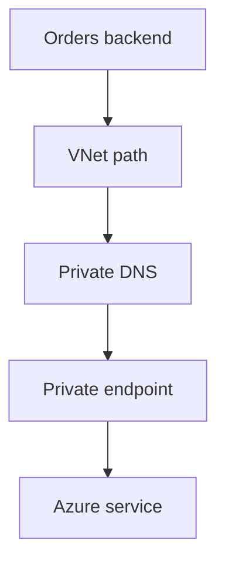
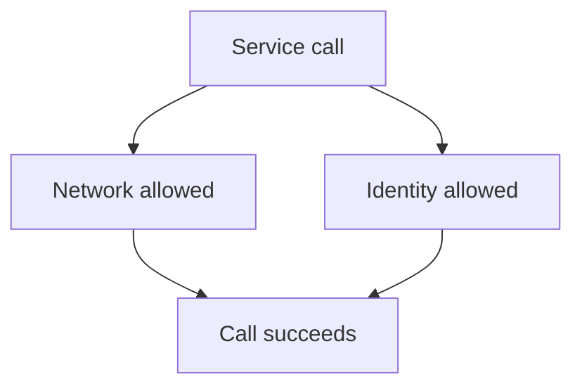

## Table of Contents

1. [The Reachability Check Before You Debug](#the-reachability-check-before-you-debug)
2. [The Private Service Access Shape](#the-private-service-access-shape)
3. [Private Endpoint Brings One Resource Onto Your Network](#private-endpoint-brings-one-resource-onto-your-network)
4. [Private Link Is The Capability, Private Endpoint Is The Object](#private-link-is-the-capability-private-endpoint-is-the-object)
5. [Private DNS Decides Which Address The App Uses](#private-dns-decides-which-address-the-app-uses)
6. [Service Endpoints Are Subnet Trust, Not Private IP Access](#service-endpoints-are-subnet-trust-not-private-ip-access)
7. [Resource Firewalls Decide Which Network Paths Are Accepted](#resource-firewalls-decide-which-network-paths-are-accepted)
8. [Evidence From A Working Setup](#evidence-from-a-working-setup)
9. [A 403 After Private DNS Is A Different Problem](#a-403-after-private-dns-is-a-different-problem)
10. [Failure Modes And Fix Directions](#failure-modes-and-fix-directions)
11. [A Review Habit For Private Service Access](#a-review-habit-for-private-service-access)

## The Reachability Check Before You Debug

An Azure app can have the right code, the right connection string, and the right managed identity, then still fail because the request never reaches the service over the path you think it uses.
That is the first check for private access.
Before we debug credentials, drivers, SDKs, retries, or secrets, we need to ask whether the caller can reach the target service through the intended network path.

Reachability is not authorization.
Reachability means the packet, DNS name, route, and service network rule allow a request to arrive at the target service front door.
Authorization means the service accepts the caller for the requested action.
In Azure, those checks often fail with similar looking symptoms.
A secret read might return `403` because the vault firewall rejected the network path, or because the managed identity does not have permission to read that secret.
Those are different fixes.

This article follows `devpolaris-orders-api`.
The app already has a public customer entry point somewhere else in the architecture.
That public entry may be Front Door, Application Gateway, App Service, Container Apps ingress, or another approved HTTP path.
This article does not spend time choosing that entry point.
We start after the backend is running and ask how it reaches private Azure services.

The backend needs three dependencies:

| Dependency | Normal caller | Private access target | Permission still required |
|------------|---------------|-----------------------|---------------------------|
| Key Vault | `devpolaris-orders-api` | `kv-devpolaris-orders-prod.vault.azure.net` | Secret read permission through Azure RBAC or an access policy |
| Azure SQL Database | `devpolaris-orders-api` | `sql-devpolaris-orders-prod.database.windows.net` | SQL authentication, Microsoft Entra authentication, or database roles |
| Blob Storage | `devpolaris-orders-api` | `stdevpolarisordersprod.blob.core.windows.net` | Blob data role, account key, or SAS permission |

The table is small on purpose.
It separates the caller, the network target, and the identity check.
If we collapse those into one phrase like "the app has access," we lose the ability to debug calmly.

The simplest private-service-access question is:

> From this runtime, does the normal service hostname resolve and connect through the intended private path, and does the service then authorize this caller for this operation?

That question has two halves.
The first half is network evidence.
The second half is permission evidence.
Good Azure troubleshooting keeps them separate until both are proven.

## The Private Service Access Shape

Private service access is the pattern where an app running in or connected to an Azure virtual network reaches managed Azure services without using those services as broad public internet targets.
The managed service may still have a global Azure hostname.
The app may still use the normal hostname in its connection string.
The private behavior comes from the network objects, DNS answer, and service network settings around that hostname.

For `devpolaris-orders-api`, the private path looks like this:



The path only proves that packets can arrive.
The service still applies its own network rules and permission checks.



Notice the order.
The app does not call a private IP address directly in the code.
It calls the normal service hostname.
DNS answers with a private endpoint address when the query comes from the right network.
The private endpoint maps that private address to one service instance.
Then the service network rules and identity permissions decide whether the request is accepted.

The public app entry point is deliberately outside this drawing.
A customer-facing API often needs a public door for browsers, partner systems, or mobile clients.
That does not mean the database, vault, and storage account should accept broad public network access too.
The useful design is not "everything public" or "everything private."
It is "only the entry layer is public, and the backend dependencies use private service paths."

This private shape adds operational work.
Someone has to create endpoints, approve connections, link DNS zones, set firewall rules, and assign identities.
The benefit is that the normal data path becomes easier to defend and easier to prove.
When a production review asks, "Can the API reach Key Vault without opening Key Vault to the internet?", you can answer with evidence instead of a diagram alone.

## Private Endpoint Brings One Resource Onto Your Network

A private endpoint is a network interface in your virtual network with a private IP address.
That network interface connects to a specific Azure service resource through Azure Private Link.
In everyday engineering language, it gives your virtual network a private service door for one target.

That "one target" detail matters.
A private endpoint for `kv-devpolaris-orders-prod` does not make every Key Vault private from your app.
A private endpoint for the Blob subresource of `stdevpolarisordersprod` does not automatically cover Queue, File, Table, Web, or Data Lake Storage endpoints on the same storage account.
A private endpoint for an Azure SQL logical server does not grant database permissions.
It creates a private network path to that target.

The private endpoint belongs to a subnet.
The target service can live outside the virtual network because it is an Azure managed service.
The service is not moving into your subnet.
The private endpoint is the private network interface that maps your network to the managed service.

A realistic inventory for the orders API might look like this:

```text
Private endpoint inventory for rg-devpolaris-network-prod

Name                         Target service                         Subresource   Private IP
pe-orders-kv-prod             kv-devpolaris-orders-prod              vault         10.30.40.9
pe-orders-sql-prod            sql-devpolaris-orders-prod             sqlServer     10.30.40.7
pe-orders-blob-prod           stdevpolarisordersprod                 blob          10.30.40.8
```

This inventory proves only the first part of the story.
It says private endpoint resources exist and have private addresses.
It does not prove DNS uses those addresses.
It does not prove the endpoint connection is approved.
It does not prove the resource firewall accepts the path.
It does not prove RBAC or data-plane permissions.

That is why private endpoint evidence should include the target, the subresource, the approval state, and the private IP.
Here is the kind of Azure CLI output that is useful during a review:

```bash
$ az network private-endpoint show \
>   --resource-group rg-devpolaris-network-prod \
>   --name pe-orders-kv-prod \
>   --query "{name:name, subnet:subnet.id, dns:customDnsConfigs, connections:privateLinkServiceConnections[].{target:privateLinkServiceId, groupIds:groupIds, state:privateLinkServiceConnectionState.status}}" \
>   --output json
{
  "name": "pe-orders-kv-prod",
  "subnet": "/subscriptions/00000000-0000-0000-0000-000000000000/resourceGroups/rg-devpolaris-network-prod/providers/Microsoft.Network/virtualNetworks/vnet-devpolaris-prod/subnets/snet-private-endpoints",
  "dns": [
    {
      "fqdn": "kv-devpolaris-orders-prod.vault.azure.net",
      "ipAddresses": [
        "10.30.40.9"
      ]
    }
  ],
  "connections": [
    {
      "target": "/subscriptions/00000000-0000-0000-0000-000000000000/resourceGroups/rg-devpolaris-data-prod/providers/Microsoft.KeyVault/vaults/kv-devpolaris-orders-prod",
      "groupIds": [
        "vault"
      ],
      "state": "Approved"
    }
  ]
}
```

The useful lines are the subnet, target resource, `groupIds`, private IP, and `Approved` state.
For Key Vault, the target subresource is `vault`.
For Azure SQL Database, it is commonly `sqlServer`.
For Blob Storage, it is `blob`.
Those subresource names are not trivia.
They tell Azure which service endpoint on the resource this private endpoint represents.

The `Approved` state is also not trivia.
A private endpoint can be created while its connection request is still pending.
Only an approved connection is ready to carry traffic to the target private-link resource.
If the endpoint exists but the connection is `Pending`, the next action is approval by the target resource owner, not changing app code.

## Private Link Is The Capability, Private Endpoint Is The Object

Azure Private Link is the platform capability.
It lets clients in a virtual network access supported Azure services, customer-owned services, or partner services through private endpoints.
The private endpoint is the resource you inspect in your subscription.
The private endpoint connection is the relationship the target service approves or rejects.

The names sound similar because they belong to the same feature family.
During an incident, keep the objects straight.
If someone says, "Private Link is configured," ask what they can actually show:

| Question | Evidence to ask for |
|----------|---------------------|
| Which service instance is private? | Target resource ID on the private endpoint |
| Which part of the service is reached? | Target subresource such as `vault`, `sqlServer`, or `blob` |
| Which subnet owns the private address? | Private endpoint subnet ID and NIC private IP |
| Has the service owner accepted it? | Private endpoint connection state is `Approved` |
| Which name should the app use? | Normal service hostname and private DNS record |

This distinction prevents a common false conclusion.
The team may have created a private endpoint, but the app may still be resolving the service name to a public address.
Or the endpoint may be approved, but the storage account may still allow broad public access.
Or the network path may work, but the managed identity may lack a data role.

Private Link narrows network exposure.
It does not turn off every public route by itself for every service.
It does not replace service firewalls.
It does not grant application permission.
It does not make a poor secret or database permission safe.
It gives you a private path that you still need to wire into DNS, service network rules, and identity.

The tradeoff is worth naming.
Private endpoints are more explicit and more reviewable than broad public network access, but they are also more objects to operate.
You need subnet planning, DNS ownership, approval workflows, and failure evidence.
For production data services, teams often accept that extra work because the normal path becomes narrower and less dependent on public exposure.

## Private DNS Decides Which Address The App Uses

Private endpoints depend on DNS more than many beginners expect.
The application should usually keep using the normal service hostname:
`kv-devpolaris-orders-prod.vault.azure.net`, `sql-devpolaris-orders-prod.database.windows.net`, or `stdevpolarisordersprod.blob.core.windows.net`.
From the app network, that normal hostname should resolve to the private endpoint IP.

Do not teach the app to connect to a `privatelink` hostname as a shortcut.
Do not teach it to connect directly to a private IP address.
The normal hostname keeps certificates, SDK behavior, routing, and service expectations aligned.
The private DNS configuration changes the answer from the right networks.

A healthy Key Vault lookup from the app network might look like this:

```bash
$ nslookup kv-devpolaris-orders-prod.vault.azure.net
Server:  168.63.129.16
Address: 168.63.129.16

Non-authoritative answer:
Name:    kv-devpolaris-orders-prod.privatelink.vaultcore.azure.net
Address: 10.30.40.9
Aliases: kv-devpolaris-orders-prod.vault.azure.net
```

The important line is `Address: 10.30.40.9`.
The app asked for the ordinary vault hostname.
DNS returned a private endpoint address from the private link zone.
That is the behavior we want from the runtime network.

The private DNS zone must be linked to the virtual network that needs the answer.
Having the zone somewhere in the subscription is not enough.
The app's VNet must be able to use it.

```bash
$ az network private-dns link vnet show \
>   --resource-group rg-devpolaris-network-prod \
>   --zone-name privatelink.vaultcore.azure.net \
>   --name link-vnet-devpolaris-prod \
>   --query "{name:name, zone:'privatelink.vaultcore.azure.net', vnet:virtualNetwork.id, registrationEnabled:registrationEnabled, state:provisioningState}" \
>   --output json
{
  "name": "link-vnet-devpolaris-prod",
  "zone": "privatelink.vaultcore.azure.net",
  "vnet": "/subscriptions/00000000-0000-0000-0000-000000000000/resourceGroups/rg-devpolaris-network-prod/providers/Microsoft.Network/virtualNetworks/vnet-devpolaris-prod",
  "registrationEnabled": false,
  "state": "Succeeded"
}
```

Now inspect the record itself:

```bash
$ az network private-dns record-set a show \
>   --resource-group rg-devpolaris-network-prod \
>   --zone-name privatelink.vaultcore.azure.net \
>   --name kv-devpolaris-orders-prod \
>   --query "{name:name, ttl:ttl, records:aRecords[].ipv4Address}" \
>   --output json
{
  "name": "kv-devpolaris-orders-prod",
  "ttl": 600,
  "records": [
    "10.30.40.9"
  ]
}
```

This is the DNS side of the private endpoint evidence.
The private endpoint has IP `10.30.40.9`.
The private DNS A record returns `10.30.40.9`.
The zone is linked to the VNet used by the app.
Now a network failure is less likely to be a missing DNS link.

Each Azure service has its own recommended private DNS zone names.
For the services in this article, common commercial cloud zones include:

| Service target | Normal hostname suffix | Private DNS zone |
|----------------|------------------------|------------------|
| Key Vault vault | `vault.azure.net` | `privatelink.vaultcore.azure.net` |
| Azure SQL logical server | `database.windows.net` | `privatelink.database.windows.net` |
| Blob Storage | `blob.core.windows.net` | `privatelink.blob.core.windows.net` |

Do not memorize that table as a complete Azure list.
Treat it as evidence for this system and check the current service documentation when you add another service.
Private DNS zone names are service-specific, and mistakes here create failures that look like generic connectivity problems.

## Service Endpoints Are Subnet Trust, Not Private IP Access

Service endpoints are easy to confuse with private endpoints because both talk about virtual networks and Azure services.
They are different controls.
A private endpoint creates a private IP address in your virtual network for one service instance.
A service endpoint lets a supported Azure service recognize traffic from a selected subnet, while the service keeps its normal public endpoint DNS shape.

That difference changes the evidence you collect.
For a private endpoint, you expect private endpoint resource evidence, approved connection state, a private endpoint IP, and private DNS resolving the normal service name to that IP.
For a service endpoint, you expect the subnet to have the service endpoint enabled and the target resource firewall to allow that subnet.
DNS still resolves to the service's public endpoint addresses.

Here is the beginner comparison:

| Decision point | Private endpoint | Service endpoint |
|----------------|------------------|------------------|
| Private IP in your subnet for one resource | Yes | No |
| Normal service DNS resolves to private endpoint IP from linked networks | Yes, when private DNS is configured | No, DNS stays with the service public endpoint shape |
| Target service can allow a selected subnet | Through private endpoint connection and service behavior | Through virtual network rules on the service firewall |
| Resource-instance granularity | Strong, because endpoint maps to a specific resource and subresource | Depends on service firewall rules and service endpoint behavior |
| Operational cost | More DNS and endpoint objects | Usually lighter |

Service endpoints are not bad.
They are a lighter way to let supported services trust traffic from selected subnets.
They can be useful in existing environments or when a team only needs subnet-based firewall rules.
The mistake is treating them as if they provide the same private IP and DNS behavior as Private Link.

For Storage, a service-endpoint-based allow rule might look like this:

```bash
$ az storage account network-rule list \
>   --resource-group rg-devpolaris-data-prod \
>   --account-name stdevpolarisordersprod \
>   --query "{defaultAction:defaultAction, bypass:bypass, virtualNetworkRules:virtualNetworkRules[].{subnet:virtualNetworkResourceId, action:action, state:state}}" \
>   --output json
{
  "defaultAction": "Deny",
  "bypass": "AzureServices",
  "virtualNetworkRules": [
    {
      "subnet": "/subscriptions/00000000-0000-0000-0000-000000000000/resourceGroups/rg-devpolaris-network-prod/providers/Microsoft.Network/virtualNetworks/vnet-devpolaris-prod/subnets/snet-app-runtime",
      "action": "Allow",
      "state": "Succeeded"
    }
  ]
}
```

That output proves a storage firewall rule allows a subnet.
It does not prove a storage private endpoint exists.
It does not prove DNS resolves Blob Storage to a private IP.
If the design goal is "only the orders API subnet can use the storage public endpoint path," this evidence may fit.
If the design goal is "the orders API uses a private IP path to this exact Blob service," this evidence is not enough.

For the orders API production data path, we choose private endpoints for Key Vault, Azure SQL, and Blob Storage because the review question is strict:
can the app use exact managed-service instances through private network addresses while broad public access is disabled or restricted?
Service endpoints still belong in the toolbox, but they answer a different question.

## Resource Firewalls Decide Which Network Paths Are Accepted

Managed services have their own network access settings.
People often call these resource firewalls, although each service uses its own names and behavior.
Storage accounts have network rules.
Key Vault has networking and firewall settings.
Azure SQL logical servers have public network access and firewall controls.

Resource firewalls are target-side checks.
They answer a different question from NSGs.
An NSG filters traffic around subnets and network interfaces in a virtual network.
A resource firewall decides which callers the managed service accepts at its own service boundary.
You often need both.

The desired production stance for the orders API might be:

```text
Resource network stance

Key Vault:
  Public network access: Disabled
  Private endpoint: pe-orders-kv-prod, Approved
  Private DNS zone: privatelink.vaultcore.azure.net linked to vnet-devpolaris-prod

Azure SQL:
  Public network access: Disabled
  Private endpoint: pe-orders-sql-prod, Approved
  Private DNS zone: privatelink.database.windows.net linked to vnet-devpolaris-prod

Blob Storage:
  Public network access: Disabled
  Private endpoint: pe-orders-blob-prod, Approved
  Private DNS zone: privatelink.blob.core.windows.net linked to vnet-devpolaris-prod
```

That stance is easy to say and easy to get wrong.
Creating a private endpoint does not automatically prove that public access is disabled.
Disabling public access does not prove DNS is right.
A firewall deny setting does not grant data-plane permission.
Every line needs its own evidence.

Storage evidence might look like this:

```bash
$ az storage account show \
>   --resource-group rg-devpolaris-data-prod \
>   --name stdevpolarisordersprod \
>   --query "{publicNetworkAccess:publicNetworkAccess, defaultAction:networkRuleSet.defaultAction, bypass:networkRuleSet.bypass}" \
>   --output json
{
  "publicNetworkAccess": "Disabled",
  "defaultAction": "Deny",
  "bypass": "AzureServices"
}
```

Key Vault evidence might look like this:

```bash
$ az keyvault show \
>   --resource-group rg-devpolaris-data-prod \
>   --name kv-devpolaris-orders-prod \
>   --query "{publicNetworkAccess:properties.publicNetworkAccess, defaultAction:properties.networkAcls.defaultAction, bypass:properties.networkAcls.bypass}" \
>   --output json
{
  "publicNetworkAccess": "Disabled",
  "defaultAction": "Deny",
  "bypass": "AzureServices"
}
```

The exact fields differ by service and CLI version, but the review goal is stable.
You want to know whether broad public access is off or controlled, which private endpoint is approved, which DNS zone is linked, and whether the intended runtime can make a real request.

There is also a practical sequencing point.
Do not disable public network access first and hope the rest is correct.
Build the private endpoint path.
Link DNS.
Prove resolution from the runtime network.
Prove a read or connection with a test identity.
Then tighten the public network setting.
That order gives you evidence before you remove the fallback path.

## Evidence From A Working Setup

A working setup needs more than one green check.
Private service access is a chain, so the review should collect chain evidence.
For the orders API, the claims are:
the app runtime has a private network path, each dependency has an approved private endpoint, DNS resolves each normal hostname to a private IP from the app network, resource firewalls do not leave broad public access open, and the app identity is authorized for the operation it performs.

Here is a compact review note:

```text
Private service access review: devpolaris-orders-api

Runtime:
  App identity: mi-devpolaris-orders-api-prod
  Runtime network: vnet-devpolaris-prod/snet-app-runtime

Private endpoints:
  pe-orders-kv-prod    -> kv-devpolaris-orders-prod.vault.azure.net       -> vault     -> 10.30.40.9 -> Approved
  pe-orders-sql-prod   -> sql-devpolaris-orders-prod.database.windows.net -> sqlServer -> 10.30.40.7 -> Approved
  pe-orders-blob-prod  -> stdevpolarisordersprod.blob.core.windows.net    -> blob      -> 10.30.40.8 -> Approved

Private DNS:
  privatelink.vaultcore.azure.net   linked to vnet-devpolaris-prod -> kv-devpolaris-orders-prod A 10.30.40.9
  privatelink.database.windows.net  linked to vnet-devpolaris-prod -> sql-devpolaris-orders-prod A 10.30.40.7
  privatelink.blob.core.windows.net linked to vnet-devpolaris-prod -> stdevpolarisordersprod A 10.30.40.8

Resource network stance:
  Key Vault public network access: Disabled
  Azure SQL public network access: Disabled
  Storage public network access: Disabled

Authorization:
  Managed identity can read required Key Vault secrets
  Managed identity or database principal can connect to the orders database
  Managed identity has Blob data role at the storage account or container scope
```

This note is intentionally plain.
It names the caller, the private endpoint, DNS, firewall stance, and identity permission.
Another engineer can reproduce the checks.
That is the point of evidence.

Now prove one dependency from the runtime network.
Key Vault is useful because its diagnostic health endpoint can show the source address that the vault sees.

```bash
$ curl -i https://kv-devpolaris-orders-prod.vault.azure.net/healthstatus
HTTP/1.1 200 OK
Cache-Control: no-cache
Content-Type: application/json; charset=utf-8
x-ms-request-id: 3e3f0e77-16a5-43af-a73a-4b9bfb4f3142
x-ms-keyvault-network-info: addr=10.30.20.14;act_addr_fam=InterNetwork;
Content-Length: 4

null
```

The header is the useful part.
The vault sees a private source address from the app network.
This does not prove secret permission.
It proves the request reached Key Vault through a private network path rather than through a public NAT address.

Now prove DNS for Storage from the same runtime network:

```bash
$ nslookup stdevpolarisordersprod.blob.core.windows.net
Server:  168.63.129.16
Address: 168.63.129.16

Non-authoritative answer:
stdevpolarisordersprod.blob.core.windows.net canonical name = stdevpolarisordersprod.privatelink.blob.core.windows.net.
Name:    stdevpolarisordersprod.privatelink.blob.core.windows.net
Address: 10.30.40.8
```

This says the app can keep using the normal Blob Storage hostname, while DNS sends it to the private endpoint IP.
If public network access is disabled and this lookup returns a public address, the next storage call probably fails at the network boundary.
If this lookup returns the private address and the storage call returns an authorization error, move to identity and data-plane permissions.

Finally, prove the app behavior.
Infrastructure evidence predicts the path, but the application still has to use it.
A useful smoke test checks the actual operations the backend needs:

```text
Orders API private dependency smoke test

1. Read OrdersDbConnection from Key Vault.
2. Open a SQL connection using the normal server FQDN.
3. Insert a synthetic order record inside a transaction and roll it back.
4. Write a small invoice probe blob to a private container and delete it.
5. Confirm no dependency call required enabling public network access.
```

This test is not a replacement for infrastructure evidence.
It is the final proof that the real runtime, DNS, firewall, and identity settings agree.

## A 403 After Private DNS Is A Different Problem

The most useful beginner lesson is that a `403` can be good news.
Not good because the app is working, but good because the request may have reached the service.
If DNS resolves to a private IP and a service returns an authorization-shaped `403`, the network path might be correct and the remaining failure might be permission.

Here is a realistic Key Vault sequence from the app network.
First, the network path looks healthy:

```bash
$ nslookup kv-devpolaris-orders-prod.vault.azure.net
Name:    kv-devpolaris-orders-prod.privatelink.vaultcore.azure.net
Address: 10.30.40.9

$ curl -i https://kv-devpolaris-orders-prod.vault.azure.net/healthstatus
HTTP/1.1 200 OK
x-ms-keyvault-network-info: addr=10.30.20.14;act_addr_fam=InterNetwork;
```

Then the secret read fails:

```bash
$ az keyvault secret show \
>   --vault-name kv-devpolaris-orders-prod \
>   --name OrdersDbConnection \
>   --query value \
>   --output tsv
(Forbidden) Caller is not authorized to perform action on resource.
Action: 'Microsoft.KeyVault/vaults/secrets/getSecret/action'
Resource: '/subscriptions/00000000-0000-0000-0000-000000000000/resourceGroups/rg-devpolaris-data-prod/providers/Microsoft.KeyVault/vaults/kv-devpolaris-orders-prod/secrets/OrdersDbConnection'
```

The right fix is not to reopen public network access.
The right next check is identity.
Which principal did the command or app use?
Does that principal have a role assignment or access policy that allows secret read?
Is the assignment at the vault, secret, resource group, or subscription scope?
Did the app deploy with the managed identity you think it uses?

The same separation applies to Storage and SQL.
If Blob Storage resolves to a private endpoint IP and the service returns `AuthorizationPermissionMismatch`, check the identity, RBAC data role, container scope, SAS token, or account key use.
If Azure SQL resolves to a private endpoint IP and the TCP connection reaches the SQL gateway, but login fails, check database users, Microsoft Entra configuration, SQL authentication, and database roles.

Here is the mental model:

| Evidence | What it suggests | Next check |
|----------|------------------|------------|
| DNS returns public IP from app network | Private DNS is not being used | Zone, A record, VNet link, custom DNS forwarding |
| DNS returns private IP, connection times out | Private endpoint path or routing is broken | Approval state, route, NSG, runtime network integration |
| Health endpoint or service front door responds, then operation returns `403` | Network may work, authorization may fail | Managed identity, RBAC, access policy, data-plane role |
| Public access disabled breaks the app | App was probably still using public path | DNS and private endpoint path before reopening public access |

This is the difference between reachability and access in the human sense.
The request can reach the building and still be turned away at the desk.
In Azure terms, network reachability got the request to the service boundary.
Azure RBAC, data-plane roles, database permissions, keys, or tokens decide whether the operation is allowed.

## Failure Modes And Fix Directions

Private access failures are noisy because several layers can produce similar application symptoms.
The app may report timeout, name resolution failure, `403`, connection refused, login failed, or dependency unavailable.
The fix depends on which link in the chain failed.
Start with evidence, not with the setting you changed last.

| Symptom | Likely cause | Fix direction |
|---------|--------------|---------------|
| Service hostname resolves to a public IP from the app network | Private DNS zone missing, not linked to the VNet, wrong record, or custom DNS not forwarding correctly | Link the private DNS zone to the runtime VNet, fix the A record, or configure DNS forwarding for the service private link zone |
| Private endpoint exists but traffic cannot use it | Private endpoint connection is `Pending`, `Rejected`, or `Disconnected` | Have the target resource owner approve the connection or recreate it with the right target |
| Storage or vault still accepts public network access | Private endpoint was created but resource firewall was not tightened | Review public network access and network rule settings after private path is proven |
| Public access disabled and app immediately fails | The app was still using public DNS or lacked a private route from its runtime | Prove DNS and route from the app network before changing firewall settings again |
| Service endpoint rule exists but no private IP appears | Service endpoint is being mistaken for Private Link | Decide whether subnet-based service firewall trust is enough, or create a private endpoint and DNS zone |
| `403 Forbidden` after private DNS and health checks succeed | The network path works, but identity or data-plane authorization is missing | Check managed identity, role assignment scope, access policy, database user, SAS token, or data role |

Here is the first common failure.
The private endpoint exists, but the endpoint connection is still pending:

```text
Private endpoint: pe-orders-sql-prod
Target: sql-devpolaris-orders-prod
Subresource: sqlServer
Connection state: Pending
Message: Waiting for owner approval
```

Do not fix this by enabling public SQL access.
Find the owner of the SQL logical server.
Have them review the requested source network and approve the connection if it is expected.
After approval, test the SQL hostname from the app network and then test a real login.

The second failure is DNS drift after a correct endpoint deployment:

```bash
$ nslookup kv-devpolaris-orders-prod.vault.azure.net
Server:  10.30.0.4
Address: 10.30.0.4

Non-authoritative answer:
Name:    azkms-prod-uks.vault.azure.net
Address: 20.90.40.12
```

The private endpoint may be healthy.
The app is just not getting the private DNS answer.
Check whether `privatelink.vaultcore.azure.net` is linked to the VNet.
Check whether the A record matches the endpoint private IP.
If the app uses a custom DNS server, check conditional forwarding so queries for the private link zone reach Azure private DNS resolution.

The third failure is a service endpoint misconception.
The subnet has `Microsoft.Storage` service endpoints enabled, and the storage firewall allows that subnet.
The team expects a private IP lookup, but DNS still returns the normal public endpoint shape.
That is expected for service endpoints.
If the requirement is private IP access to a specific storage account, create a Blob private endpoint and private DNS record.
If subnet-based service firewall trust is sufficient, keep the service endpoint and document that it is not Private Link.

The fourth failure is authorization after the network path works:

```text
2026-05-02T08:42:19Z devpolaris-orders-api
Dependency check failed: Key Vault secret read denied
Status: 403
Action: Microsoft.KeyVault/vaults/secrets/getSecret/action
Identity: mi-devpolaris-orders-api-prod
```

This is not a DNS fix.
It is not a route-table fix.
It is an authorization fix.
Check the role assignment or access policy for `mi-devpolaris-orders-api-prod`.
Make sure it applies to the correct vault or secret and includes the exact operation the app performs.

The fifth failure is public access being disabled before the private path is proven.
This is how a good security change becomes an outage.
The fix is not to declare private endpoints risky.
The fix is to sequence the rollout: create endpoint, link DNS, test from runtime, test operation with identity, then tighten public network access.

## A Review Habit For Private Service Access

Private service access becomes manageable when you review it as one path from one caller to one target.
Do not start with every Azure resource in the subscription.
Start with `devpolaris-orders-api` reading one secret.
Then repeat the same pattern for SQL and Blob Storage.

For each dependency, write down five facts:

| Fact | Example |
|------|---------|
| Caller | `mi-devpolaris-orders-api-prod` running from `snet-app-runtime` |
| Hostname | `kv-devpolaris-orders-prod.vault.azure.net` |
| Private endpoint | `pe-orders-kv-prod`, target `vault`, approved, IP `10.30.40.9` |
| DNS and firewall | `privatelink.vaultcore.azure.net` linked to the VNet, public network access disabled |
| Authorization | Managed identity can perform `secrets/get` for required secrets |

That small record makes outages less mysterious.
When the app fails to start because it cannot load a secret, the team does not debate every Azure networking concept.
They check the path:
runtime network, DNS answer, private endpoint state, resource firewall, then identity.

The final tradeoff is straightforward.
Private endpoints and private DNS add operational objects, and those objects can break.
Service endpoints are simpler in some cases, but they do not provide the same private IP path to one resource.
Resource firewalls reduce network exposure, but they can lock out an app if DNS and routing are not ready.
RBAC and data-plane permissions remain mandatory because private reachability is not trust.

Use private service access when the data service should serve the app, not the internet.
Keep the public entry point conversation in the public traffic article.
Here, the job is narrower and more concrete:
prove that the backend reaches Azure services through the private path you intended, and prove separately that the service authorizes the operation.

---

**References**

- [What is a private endpoint?](https://learn.microsoft.com/en-us/azure/private-link/private-endpoint-overview) - Microsoft Learn explains private endpoint properties, target subresources, approval states, and why only approved private endpoint connections can send traffic.
- [Azure Private Endpoint private DNS zone values](https://learn.microsoft.com/en-us/azure/private-link/private-endpoint-dns) - Microsoft Learn lists service-specific private DNS zones and explains why application URLs stay the same while DNS resolves to private endpoint IP addresses.
- [Azure Virtual Network integration for Azure services](https://learn.microsoft.com/en-us/azure/virtual-network/vnet-integration-for-azure-services) - Microsoft Learn contrasts private endpoints with service endpoints, including the fact that service endpoint DNS entries remain public endpoint shaped.
- [Use private endpoints for Azure Storage](https://learn.microsoft.com/en-us/azure/storage/common/storage-private-endpoints) - Microsoft Learn describes Storage private endpoint behavior, separate Storage subresources, private DNS behavior, and the need to control public endpoint access separately.
- [Azure Private Link for Azure SQL Database](https://learn.microsoft.com/en-us/azure/azure-sql/database/private-endpoint-overview) - Microsoft Learn explains SQL private endpoint approval, private endpoint IP evidence, the normal server FQDN requirement, and disabling public network access.
- [Diagnose private links configuration issues on Azure Key Vault](https://learn.microsoft.com/en-us/azure/key-vault/general/private-link-diagnostics) - Microsoft Learn shows private DNS expectations, VNet link checks, Key Vault health status headers, and how to reason about private-link failures.
